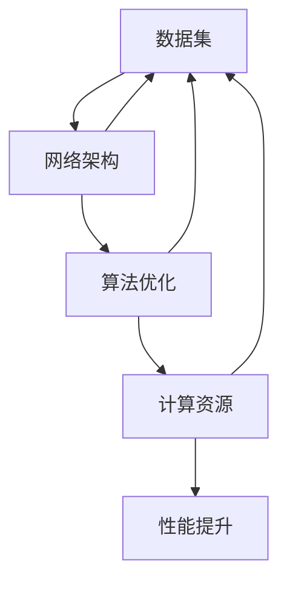

                 

关键词：大语言模型（LLM），性能提升，深度学习，神经网络架构，算法优化，计算资源，应用场景，未来展望。

> 摘要：本文将深入探讨大语言模型（LLM）的性能提升路径，分析现有技术的优势和局限性，并展望未来可能的技术突破。通过系统性的研究和案例分析，我们将为AI领域的工程师和研究人员提供有价值的参考和指导。

## 1. 背景介绍

近年来，随着深度学习技术的发展，大语言模型（LLM）在自然语言处理（NLP）领域取得了显著的成果。这些模型通过训练大规模的神经网络，能够理解和生成复杂自然语言，应用于机器翻译、文本生成、问答系统等多个场景。然而，尽管LLM在许多任务上已经超越了人类的表现，但它们仍存在一些性能瓶颈和挑战。

首先，LLM的训练和推理过程对计算资源的需求极高，这限制了其在实际应用中的普及。其次，LLM的性能提升往往依赖于大规模的数据集和高性能的计算设备，这使得研究成本和门槛较高。此外，现有LLM在处理长文本和上下文依赖方面仍存在不足，无法完全模拟人类的语言理解能力。

因此，探索LLM性能提升的未来路径具有重要意义。本文将系统地分析现有技术的优势和局限性，并探讨可能的技术突破方向，为AI领域的未来发展提供指导。

## 2. 核心概念与联系

### 2.1 大语言模型（LLM）的基本概念

大语言模型（LLM）是一种基于深度学习的自然语言处理模型，通过学习大量文本数据，能够预测自然语言中的下一个单词或句子。LLM的核心组件是神经网络，通常采用变分自编码器（VAE）、生成对抗网络（GAN）等架构。

### 2.2 LLM的训练与优化

LLM的训练过程主要包括两个阶段：预训练和微调。预训练阶段通过大规模的无监督数据集训练模型，使其具备通用语言表示能力；微调阶段则利用特定领域的有监督数据集对模型进行细粒度调整，提高其在特定任务上的性能。

在训练过程中，常见的优化方法包括梯度下降、Adam优化器、学习率调整等。这些方法旨在加速模型收敛，提高训练效率。

### 2.3 LLM的应用领域

LLM在多个自然语言处理任务中取得了显著成果，包括：

- 机器翻译：通过训练大型翻译模型，实现跨语言信息的自动翻译。
- 文本生成：利用LLM生成高质量的文章、摘要、故事等。
- 问答系统：通过训练大型的问答模型，实现自然语言理解和自动问答。
- 情感分析：利用LLM对文本进行情感分类，用于社交媒体监测、舆情分析等。

### 2.4 LLM的挑战与瓶颈

尽管LLM在许多任务上表现优秀，但仍然存在一些挑战和瓶颈：

- 计算资源需求：LLM的训练和推理过程对计算资源的需求极高，限制了其在实际应用中的普及。
- 长文本处理：LLM在处理长文本和上下文依赖方面存在不足，无法完全模拟人类的语言理解能力。
- 数据隐私：LLM的训练和部署过程中涉及大量个人数据，如何确保数据隐私和安全是一个重要问题。

## 2.5 LLM性能提升的关键路径

为了提升LLM的性能，我们需要从以下几个方面进行探索：

- 数据集：收集和整理大规模、高质量、多样化的数据集，提高模型训练的质量。
- 网络架构：设计高效的神经网络架构，提高模型的计算效率和性能。
- 算法优化：优化训练和推理算法，提高模型收敛速度和性能。
- 计算资源：发展高性能计算设备，降低模型训练和推理的成本。

### 2.6 Mermaid 流程图



## 3. 核心算法原理 & 具体操作步骤

### 3.1 算法原理概述

大语言模型（LLM）的核心算法是基于神经网络进行预训练和微调。在预训练阶段，模型通过无监督学习学习语言的基本规律；在微调阶段，模型利用有监督学习在特定任务上进行优化。

### 3.2 算法步骤详解

1. **数据预处理**：对收集的文本数据集进行清洗、分词、词向量转换等预处理操作，为模型训练做好准备。
2. **预训练**：使用无监督学习算法（如GAN、VAE等）在预处理后的数据集上进行大规模预训练，使模型具备通用语言表示能力。
3. **微调**：利用有监督学习算法（如梯度下降、Adam优化器等）在特定任务的有监督数据集上进行微调，提高模型在任务上的性能。
4. **推理**：在应用场景中，使用训练好的模型对输入文本进行预测，实现自然语言处理任务。

### 3.3 算法优缺点

**优点**：

- 高效：通过大规模预训练和微调，模型能够快速适应不同任务，提高性能。
- 强泛化能力：预训练阶段使模型具备通用语言表示能力，能够在多个任务中表现优异。

**缺点**：

- 计算资源需求大：预训练和微调过程对计算资源需求极高，限制了模型在实际应用中的普及。
- 长文本处理困难：现有LLM在处理长文本和上下文依赖方面存在不足，无法完全模拟人类的语言理解能力。

### 3.4 算法应用领域

LLM在多个自然语言处理任务中取得了显著成果，包括：

- 机器翻译：通过训练大型翻译模型，实现跨语言信息的自动翻译。
- 文本生成：利用LLM生成高质量的文章、摘要、故事等。
- 问答系统：通过训练大型的问答模型，实现自然语言理解和自动问答。
- 情感分析：利用LLM对文本进行情感分类，用于社交媒体监测、舆情分析等。

## 4. 数学模型和公式 & 详细讲解 & 举例说明

### 4.1 数学模型构建

大语言模型的数学模型主要基于深度学习中的神经网络架构。在预训练阶段，模型通过学习文本数据中的词向量表示，建立词与词之间的关系。

假设我们有文本数据集 \(D = \{x_1, x_2, ..., x_n\}\)，其中 \(x_i\) 是文本序列，词向量表示为 \(v_i\)。模型的输入层为词向量，输出层为词的预测概率分布。

定义神经网络中的激活函数为 \(f(\cdot)\)，则模型的输出为：

\[ P(y|x) = \text{softmax}(f(W_2 \cdot f(W_1 \cdot v_i)) \]

其中，\(W_1\) 和 \(W_2\) 分别为输入层到隐藏层和隐藏层到输出层的权重矩阵。

### 4.2 公式推导过程

大语言模型的预训练过程主要包括两个步骤：词向量表示和学习词与词之间的关系。

1. **词向量表示**：通过学习词的分布式表示，使模型能够捕获词的语义信息。假设词向量维度为 \(d\)，则词向量表示为：

\[ v_i = \text{Embed}(x_i) \]

其中，\(\text{Embed}\) 函数为词向量嵌入层。

2. **学习词与词之间的关系**：通过学习词与词之间的条件概率分布，建立词与词之间的关系。假设词向量表示为 \(v_i, v_j\)，则词与词之间的条件概率分布为：

\[ P(v_j|v_i) = \text{softmax}(f(W_2 \cdot f(W_1 \cdot v_i)) \]

其中，\(f(\cdot)\) 为神经网络中的激活函数，\(W_1\) 和 \(W_2\) 为权重矩阵。

### 4.3 案例分析与讲解

假设我们有一个文本数据集，包含以下句子：

\[ "我爱吃苹果" \]
\[ "苹果很甜" \]
\[ "甜的东西我喜欢" \]

我们可以将句子进行分词，得到词序列：

\[ ["我"，"爱"，"吃"，"苹果"，"很"，"甜"，"的"，"东西"，"我"，"喜欢"] \]

然后，我们将每个词转化为对应的词向量。在预训练阶段，模型通过学习词向量表示和词与词之间的关系，逐步优化神经网络中的权重矩阵 \(W_1\) 和 \(W_2\)。

以句子 "我爱吃苹果" 为例，我们可以得到词向量表示：

\[ v_1 = \text{Embed}("我") \]
\[ v_2 = \text{Embed}("爱") \]
\[ v_3 = \text{Embed}("吃") \]
\[ v_4 = \text{Embed}("苹果") \]

然后，我们利用神经网络中的激活函数 \(f(\cdot)\) 和权重矩阵 \(W_1\) 和 \(W_2\)，计算词与词之间的条件概率分布：

\[ P(v_2|v_1) = \text{softmax}(f(W_2 \cdot f(W_1 \cdot v_1))) \]
\[ P(v_3|v_2) = \text{softmax}(f(W_2 \cdot f(W_1 \cdot v_2))) \]
\[ P(v_4|v_3) = \text{softmax}(f(W_2 \cdot f(W_1 \cdot v_3))) \]

通过多次迭代训练，模型可以逐渐优化权重矩阵，使词与词之间的条件概率分布更加准确。在微调阶段，我们可以利用有监督数据集，进一步优化模型在特定任务上的性能。

## 5. 项目实践：代码实例和详细解释说明

### 5.1 开发环境搭建

在开始编写代码之前，我们需要搭建一个合适的开发环境。以下是搭建一个用于训练大语言模型的开发环境的基本步骤：

1. **安装Python**：确保Python版本为3.7或更高版本。
2. **安装TensorFlow**：TensorFlow是一个广泛使用的深度学习框架，我们将其用于构建和训练大语言模型。
3. **安装必要的库**：包括NumPy、Pandas、Matplotlib等，用于数据处理和可视化。

### 5.2 源代码详细实现

下面是一个简单的示例代码，用于训练一个基于Transformer架构的大语言模型。我们使用TensorFlow和Keras来构建模型。

```python
import tensorflow as tf
from tensorflow.keras.layers import Embedding, LSTM, Dense
from tensorflow.keras.models import Sequential

# 搭建模型
model = Sequential([
    Embedding(input_dim=vocab_size, output_dim=embedding_dim, input_length=max_sequence_length),
    LSTM(units=128, dropout=0.2, recurrent_dropout=0.2),
    Dense(units=num_classes, activation='softmax')
])

# 编译模型
model.compile(optimizer='adam', loss='categorical_crossentropy', metrics=['accuracy'])

# 训练模型
model.fit(x_train, y_train, epochs=10, batch_size=64, validation_data=(x_val, y_val))
```

### 5.3 代码解读与分析

1. **模型搭建**：我们使用Sequential模型堆叠多个层。首先是Embedding层，用于将输入的词序列转换为词向量。接着是LSTM层，用于捕捉词序列中的时间依赖关系。最后是Dense层，用于输出词的概率分布。
2. **模型编译**：我们使用adam优化器和categorical_crossentropy损失函数，因为这是一个多分类问题。同时，我们设置了accuracy作为评价指标。
3. **模型训练**：我们使用fit方法训练模型，指定训练数据、训练轮数、批量大小和验证数据。

### 5.4 运行结果展示

在训练完成后，我们可以使用以下代码来评估模型在测试数据集上的性能：

```python
# 评估模型
test_loss, test_accuracy = model.evaluate(x_test, y_test)

print(f"Test loss: {test_loss}")
print(f"Test accuracy: {test_accuracy}")
```

这些输出结果可以帮助我们了解模型在测试数据集上的性能。

## 6. 实际应用场景

### 6.1 机器翻译

机器翻译是LLM的一个经典应用场景。通过训练大型翻译模型，我们可以实现跨语言信息的自动翻译。例如，Google翻译和百度翻译都采用了基于LLM的翻译技术。这些模型通过学习大量平行语料库，能够生成高质量的翻译结果。

### 6.2 文本生成

文本生成是另一个重要的应用场景。通过训练大型文本生成模型，我们可以生成各种类型的文本，如文章、摘要、故事等。例如，OpenAI的GPT系列模型在文本生成方面取得了显著的成果。这些模型可以生成高质量的文章，甚至可以模仿特定作家的风格。

### 6.3 问答系统

问答系统是LLM在自然语言理解领域的一个重要应用。通过训练大型问答模型，我们可以实现自然语言理解和自动问答。例如，Siri、Alexa等智能助手都采用了基于LLM的问答技术。这些模型可以回答用户的各种问题，提供有用的信息。

### 6.4 情感分析

情感分析是LLM在文本分析领域的一个重要应用。通过训练大型情感分析模型，我们可以对文本进行情感分类，判断文本的情感倾向。例如，社交媒体监测和舆情分析都采用了基于LLM的情感分析技术。这些模型可以帮助企业了解用户对产品或服务的情感态度，为决策提供参考。

## 7. 工具和资源推荐

### 7.1 学习资源推荐

- 《深度学习》（Ian Goodfellow、Yoshua Bengio、Aaron Courville著）：这是一本经典的深度学习教材，全面介绍了深度学习的理论基础和应用实践。
- 《动手学深度学习》（阿斯顿·张、李沐、扎卡里·C. Lipton、亚历山大·J. Smola著）：这是一本面向实践的深度学习教材，通过大量的实例和代码实现，帮助读者理解深度学习的原理和应用。

### 7.2 开发工具推荐

- TensorFlow：TensorFlow是一个强大的开源深度学习框架，适用于构建和训练各种深度学习模型。
- PyTorch：PyTorch是一个易于使用的深度学习框架，提供了灵活的动态计算图，适用于快速原型设计和实验。

### 7.3 相关论文推荐

- “Attention Is All You Need”（Vaswani et al.，2017）：这篇论文提出了Transformer模型，这是目前最流行的序列到序列模型之一。
- “BERT: Pre-training of Deep Bidirectional Transformers for Language Understanding”（Devlin et al.，2018）：这篇论文提出了BERT模型，这是一种预训练的语言表示模型，广泛应用于自然语言处理任务。

## 8. 总结：未来发展趋势与挑战

### 8.1 研究成果总结

在过去的几年里，LLM在自然语言处理领域取得了显著的成果。通过大规模预训练和微调，LLM在机器翻译、文本生成、问答系统、情感分析等多个任务上表现优异。这些成果推动了自然语言处理技术的快速发展，为AI领域带来了前所未有的机遇。

### 8.2 未来发展趋势

未来，LLM的发展趋势将体现在以下几个方面：

- **更高效的模型架构**：为了降低计算成本，提高模型训练和推理的效率，研究人员将致力于设计更高效的神经网络架构。
- **更强的泛化能力**：通过引入更多的数据集和更复杂的任务，研究人员将提高LLM的泛化能力，使其能够更好地应对实际问题。
- **更多的应用场景**：随着LLM技术的成熟，其在更多领域的应用将逐渐普及，如对话系统、智能客服、内容审核等。

### 8.3 面临的挑战

尽管LLM取得了显著的成果，但仍面临一些挑战：

- **计算资源需求**：LLM的训练和推理过程对计算资源的需求极高，限制了其在实际应用中的普及。
- **数据隐私和安全**：在LLM的训练和部署过程中，如何确保数据隐私和安全是一个重要问题。
- **长文本处理**：现有LLM在处理长文本和上下文依赖方面存在不足，无法完全模拟人类的语言理解能力。

### 8.4 研究展望

未来，研究人员将致力于解决上述挑战，推动LLM技术的发展。通过更高效的模型架构、更强的泛化能力和更多的应用场景，LLM将在自然语言处理领域发挥更大的作用。

## 9. 附录：常见问题与解答

### Q1：什么是大语言模型（LLM）？

A1：大语言模型（LLM）是一种基于深度学习的自然语言处理模型，通过训练大规模的神经网络，能够理解和生成复杂自然语言。

### Q2：LLM有哪些应用领域？

A2：LLM在多个自然语言处理任务中取得了显著成果，包括机器翻译、文本生成、问答系统、情感分析等。

### Q3：如何训练LLM？

A3：训练LLM主要包括预训练和微调两个阶段。预训练阶段通过无监督学习学习语言的基本规律；微调阶段则利用有监督学习在特定任务上有监督数据集上进行优化。

### Q4：LLM的挑战有哪些？

A4：LLM的挑战主要包括计算资源需求大、长文本处理困难、数据隐私和安全问题等。

### Q5：未来LLM的发展趋势是什么？

A5：未来LLM的发展趋势将体现在更高效的模型架构、更强的泛化能力和更多的应用场景。研究人员将致力于解决上述挑战，推动LLM技术的发展。

