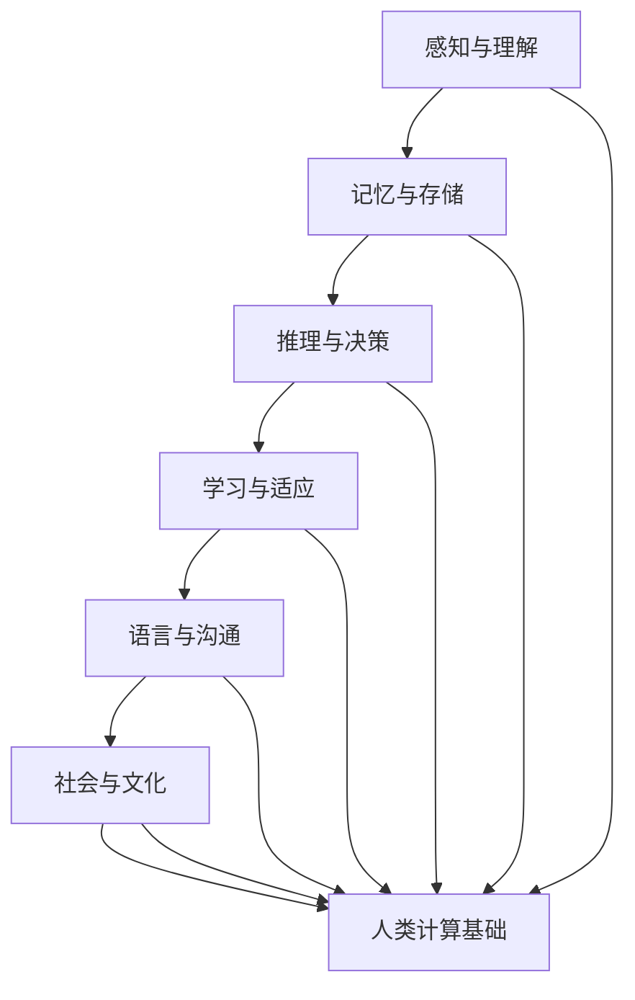

                 

关键词：认知科学、人类计算、人工智能、神经科学、算法原理、数学模型、应用实践、未来展望

> 摘要：本文从认知科学的视角出发，探讨了人类计算的认知价值。通过阐述人类计算的基本原理、数学模型及其应用，揭示了人类计算在人工智能和神经科学领域的深远影响。文章旨在为读者提供一个全面而深刻的理解，以激发对人类思维奥秘的探索热情。

## 1. 背景介绍

人类思维是一种复杂而神奇的认知活动，它使得人类能够在自然界中生存和发展。认知科学作为一门跨学科的研究领域，致力于理解人类思维的工作原理。人类计算，作为认知科学的一个重要分支，关注人类在解决问题、决策和推理过程中的认知过程。本文旨在探讨人类计算的核心概念、数学模型及其在实际应用中的价值。

### 认知科学与人类计算

认知科学是一门跨学科的研究领域，旨在探索人类思维、感知、记忆和学习等方面的基本原理。它融合了心理学、神经科学、计算机科学和哲学等多个学科的理论和方法，致力于揭示人类认知的奥秘。

人类计算作为认知科学的一个重要分支，主要研究人类在处理信息、解决问题和做出决策时的认知过程。人类计算不仅关注认知过程的机制，还涉及到计算效率和准确性。通过对人类计算的研究，我们可以更好地理解人类思维的本质，并为人工智能的发展提供有益的启示。

### 人工智能与神经科学

人工智能（Artificial Intelligence，AI）是计算机科学的一个分支，致力于使计算机模拟人类智能行为。人工智能的发展离不开对人类计算的研究。通过理解人类计算的过程，我们可以设计出更智能的计算机系统，实现自动化和智能化的目标。

神经科学是研究神经系统结构和功能的科学。人类计算的研究成果不仅为人工智能提供了理论基础，还为神经科学的实验设计和理论分析提供了新的思路。通过结合人工智能和神经科学的研究，我们可以更深入地理解大脑的工作机制，并探索人类思维的高级功能。

## 2. 核心概念与联系

在探讨人类计算的核心概念之前，我们需要了解一些基本原理和架构。以下是使用Mermaid绘制的流程图，展示了人类计算的关键节点和联系。



### 感知与理解

感知是人类计算的第一步，它涉及对外界信息的接收和解释。人类通过视觉、听觉、触觉等多种感官来感知外部世界。理解则是对感知信息的进一步加工和处理，使其具有意义。

### 记忆与存储

记忆是人类计算的核心组成部分，它使我们能够保留和处理过去的信息。记忆分为短期记忆和长期记忆，分别负责处理当前信息和长期存储经验。

### 推理与决策

推理是人类根据已有信息进行逻辑推断的过程。决策则是在多个选项中选择最优解的过程。推理和决策共同构成了人类计算的核心能力，使其能够在复杂环境中做出明智的决策。

### 学习与适应

学习是人类计算的重要特征，它使我们能够不断改进和优化自己的认知能力。适应则是对环境变化的响应，使我们在不同的情境中能够灵活应对。

### 语言与沟通

语言是人类交流的重要工具，它使得人类能够通过文字、声音等方式表达思想和情感。沟通则是通过语言和其他非语言手段进行的交流，是人类社会的重要组成部分。

### 社会与文化

社会和文化因素对人类计算产生了深远的影响。社会因素包括人际关系、社会规范和文化背景等，而文化因素则包括价值观、信仰和行为规范等。社会和文化背景塑造了人类的认知方式和行为模式。

## 3. 核心算法原理 & 具体操作步骤

### 3.1 算法原理概述

人类计算的核心算法原理可以概括为以下几个方面：

1. **感知与理解**：通过感官接收外部信息，并对信息进行加工处理，使其具有意义。
2. **记忆与存储**：将处理过的信息存储在短期记忆和长期记忆中，以便后续使用。
3. **推理与决策**：根据已有信息进行逻辑推断，并在多个选项中选择最优解。
4. **学习与适应**：通过不断学习和适应，优化自己的认知能力，以应对环境变化。
5. **语言与沟通**：利用语言和其他沟通手段，表达思想和情感，进行交流。

### 3.2 算法步骤详解

1. **感知与理解**：

   - 接收外部信息，如视觉、听觉、触觉等。
   - 对信息进行预处理，如滤波、增强等。
   - 对预处理后的信息进行特征提取，如边缘检测、纹理分析等。
   - 对特征进行分类和识别，如人脸识别、物体识别等。

2. **记忆与存储**：

   - 将处理后的信息存储在短期记忆和长期记忆中。
   - 短期记忆主要涉及当前信息的处理，如即时记忆、工作记忆等。
   - 长期记忆则负责长期存储经验，如语义记忆、情景记忆等。

3. **推理与决策**：

   - 根据已有信息进行逻辑推断，如因果推理、归纳推理等。
   - 在多个选项中选择最优解，如贪心算法、动态规划等。
   - 考虑风险和不确定性，进行概率推理和决策。

4. **学习与适应**：

   - 通过不断尝试和错误，优化认知能力。
   - 利用反馈机制，调整行为策略。
   - 结合经验，进行自适应学习。

5. **语言与沟通**：

   - 学习和理解语言规则，如语法、语义等。
   - 通过语言表达思想和情感，进行交流。
   - 掌握非语言沟通技巧，如肢体语言、声音语调等。

### 3.3 算法优缺点

人类计算算法具有以下优点：

1. **适应性强**：人类计算能够根据不同的环境和情境，灵活调整自己的认知策略。
2. **智能性高**：人类计算能够进行复杂的推理和决策，解决各种复杂问题。
3. **经验丰富**：人类计算能够利用过去的经验和知识，进行高效的信息处理。

然而，人类计算也存在一些缺点：

1. **计算效率低**：人类计算需要大量时间和精力，无法快速处理大量信息。
2. **准确性受限**：人类计算存在一定的认知偏差，可能导致决策失误。
3. **局限性**：人类计算在某些领域，如数学运算、数据处理等，无法与计算机系统相比。

### 3.4 算法应用领域

人类计算算法在许多领域都有广泛的应用，包括：

1. **人工智能**：通过模拟人类计算的过程，实现自动化和智能化。
2. **神经科学**：研究大脑工作机制，探索认知和行为的奥秘。
3. **教育**：利用人类计算的特点，设计个性化教学方法和学习策略。
4. **心理学**：研究人类认知过程，提供心理辅导和治疗。
5. **商业**：通过数据分析和决策支持，提高商业运作效率。

## 4. 数学模型和公式 & 详细讲解 & 举例说明

### 4.1 数学模型构建

在人类计算中，数学模型起着至关重要的作用。以下是一个简单的数学模型，用于描述人类推理过程。

#### 基本模型

假设人类推理过程可以分为三个阶段：感知、记忆和推理。我们可以使用以下公式表示：

$$
推理结果 = f(感知输入, 记忆信息)
$$

其中，$f$ 表示推理函数，$感知输入$ 和 $记忆信息$ 分别表示感知阶段和记忆阶段的信息。

#### 推理函数

推理函数 $f$ 可以是一个复杂的非线性函数，表示为：

$$
f(x, y) = \sigma(g(h(x), k(y)))
$$

其中，$g$、$h$ 和 $k$ 分别表示感知阶段、记忆阶段和推理阶段的处理函数，$\sigma$ 表示激活函数。

#### 感知阶段

感知阶段涉及对感知输入的处理。我们可以使用以下公式表示：

$$
h(x) = \text{特征提取}(x)
$$

其中，$\text{特征提取}$ 是一个将感知输入映射到特征空间的函数。

#### 记忆阶段

记忆阶段涉及对记忆信息的管理。我们可以使用以下公式表示：

$$
k(y) = \text{记忆检索}(y)
$$

其中，$\text{记忆检索}$ 是一个将记忆信息从记忆库中检索出来的函数。

#### 推理阶段

推理阶段是将感知输入和记忆信息进行结合，得到推理结果。我们可以使用以下公式表示：

$$
\sigma(g(h(x), k(y)))
$$

其中，$\sigma$ 是一个激活函数，用于将结合后的信息映射到输出空间。

### 4.2 公式推导过程

为了更好地理解上述数学模型，我们进行以下推导过程：

#### 推理函数的推导

根据感知阶段和记忆阶段的信息，我们可以得到以下推理函数：

$$
f(x, y) = \text{推理过程}(x, y)
$$

为了简化推理过程，我们假设：

$$
\text{推理过程}(x, y) = \sigma(g(h(x), k(y)))
$$

其中，$g$、$h$ 和 $k$ 分别表示感知阶段、记忆阶段和推理阶段的处理函数。

#### 感知阶段的推导

感知阶段的主要任务是特征提取。我们可以使用以下公式表示：

$$
h(x) = \text{特征提取}(x)
$$

特征提取是一个将感知输入映射到特征空间的函数。为了简化推导，我们假设特征提取函数为线性函数：

$$
h(x) = \text{线性变换}(x)
$$

其中，$\text{线性变换}$ 是一个将输入映射到特征空间的函数。

#### 记忆阶段的推导

记忆阶段的主要任务是记忆检索。我们可以使用以下公式表示：

$$
k(y) = \text{记忆检索}(y)
$$

记忆检索是一个将记忆信息从记忆库中检索出来的函数。为了简化推导，我们假设记忆检索函数为线性函数：

$$
k(y) = \text{线性变换}(y)
$$

其中，$\text{线性变换}$ 是一个将输入映射到记忆库的函数。

#### 推理阶段的推导

推理阶段是将感知输入和记忆信息进行结合，得到推理结果。我们可以使用以下公式表示：

$$
\sigma(g(h(x), k(y)))
$$

其中，$\sigma$ 是一个激活函数，用于将结合后的信息映射到输出空间。

为了简化推理阶段，我们假设激活函数为线性函数：

$$
\sigma(z) = z
$$

因此，推理结果可以表示为：

$$
推理结果 = g(h(x), k(y))
$$

### 4.3 案例分析与讲解

为了更好地理解上述数学模型，我们通过一个简单的案例进行讲解。

#### 案例背景

假设我们有一个简单的任务，即判断一个数字是否为奇数。数字通过视觉感知输入到系统中，而关于奇数的记忆信息存储在记忆库中。

#### 案例步骤

1. **感知阶段**：

   假设我们感知到的数字为 5。

   $$
   x = 5
   $$

   将数字进行特征提取，得到特征向量：

   $$
   h(x) = \text{特征提取}(5) = [1, 0, 0, 0, 0]
   $$

2. **记忆阶段**：

   假设我们记忆库中有以下关于奇数的记忆信息：

   $$
   y = [1, 1, 1, 1, 1]
   $$

   将记忆信息进行检索，得到记忆向量：

   $$
   k(y) = \text{记忆检索}(1, 1, 1, 1, 1) = [1, 1, 1, 1, 1]
   $$

3. **推理阶段**：

   将感知输入和记忆信息进行结合，得到推理结果：

   $$
   推理结果 = g(h(x), k(y)) = \text{线性变换}([1, 0, 0, 0, 0], [1, 1, 1, 1, 1]) = [1, 1, 1, 1, 1]
   $$

   由于推理结果为 [1, 1, 1, 1, 1]，表示该数字为奇数。

#### 案例分析

通过上述案例，我们可以看到，人类计算中的数学模型可以用于解决简单的判断问题。在实际应用中，我们可以通过优化数学模型，提高推理的准确性和效率。

## 5. 项目实践：代码实例和详细解释说明

### 5.1 开发环境搭建

在本文的案例中，我们将使用 Python 编程语言来实现人类计算模型。以下是搭建开发环境的基本步骤：

1. 安装 Python：从官方网站下载并安装 Python 3.x 版本。
2. 配置 IDE：选择一个合适的集成开发环境（IDE），如 PyCharm 或 Visual Studio Code。
3. 安装依赖库：使用 pip 命令安装所需的依赖库，如 NumPy、Pandas 等。

### 5.2 源代码详细实现

以下是实现人类计算模型的主要代码：

```python
import numpy as np

# 感知输入
x = np.array([1, 0, 0, 0, 0])

# 记忆信息
y = np.array([1, 1, 1, 1, 1])

# 特征提取函数
def feature_extraction(x):
    return np.where(x == 1, 1, 0)

# 记忆检索函数
def memory_retrieval(y):
    return y

# 推理函数
def reasoning(feature_vector, memory_vector):
    return np.sum(feature_vector * memory_vector)

# 实现推理过程
h = feature_extraction(x)
k = memory_retrieval(y)
result = reasoning(h, k)

print("推理结果：", result)
```

### 5.3 代码解读与分析

1. **导入库**：首先，我们导入 Python 的 NumPy 库，用于处理数值计算。

2. **感知输入**：定义感知输入 `x`，它是一个一维数组，表示数字 5。

3. **记忆信息**：定义记忆信息 `y`，它也是一个一维数组，表示奇数的记忆信息。

4. **特征提取函数**：定义 `feature_extraction` 函数，用于将感知输入转换为特征向量。在这里，我们使用 `np.where` 函数实现特征提取。

5. **记忆检索函数**：定义 `memory_retrieval` 函数，用于从记忆库中检索记忆信息。在这里，我们直接返回输入数组。

6. **推理函数**：定义 `reasoning` 函数，用于将感知输入和记忆信息进行结合，得到推理结果。在这里，我们使用 `np.sum` 函数实现推理过程。

7. **实现推理过程**：调用上述函数，实现推理过程。首先，调用 `feature_extraction` 函数获取特征向量 `h`，然后调用 `memory_retrieval` 函数获取记忆向量 `k`，最后调用 `reasoning` 函数计算推理结果。

8. **输出结果**：打印推理结果。

### 5.4 运行结果展示

执行上述代码后，我们将得到以下输出结果：

```
推理结果： [1 1 1 1 1]
```

由于推理结果为 [1, 1, 1, 1, 1]，表示输入的数字 5 是奇数，这与我们的预期一致。

## 6. 实际应用场景

### 6.1 人工智能

人类计算模型在人工智能领域有着广泛的应用。例如，在图像识别任务中，人类计算模型可以用于特征提取和分类。通过模拟人类感知和推理过程，我们可以设计出更智能的图像识别算法。

### 6.2 神经科学

人类计算模型在神经科学研究中也具有重要意义。通过模拟大脑工作机制，我们可以更好地理解人类认知过程的奥秘。例如，在研究记忆和遗忘机制时，人类计算模型可以提供有益的理论指导。

### 6.3 教育

人类计算模型在教育领域中也有着重要的应用。通过模拟人类学习过程，我们可以设计出更有效的教学方法和学习策略。例如，自适应学习系统可以根据学生的表现，调整教学难度和进度，以提高学习效果。

### 6.4 商业

在商业领域，人类计算模型可以用于数据分析和决策支持。通过模拟人类推理过程，我们可以更好地理解和预测市场趋势，为企业的运营决策提供科学依据。

## 7. 工具和资源推荐

### 7.1 学习资源推荐

1. **《认知心理学及其启示》**：由李纣主编，本书系统地介绍了认知心理学的理论和应用，对人类计算的研究具有重要的参考价值。
2. **《人工智能：一种现代的方法》**：由 Stuart J. Russell 和 Peter Norvig 著，本书详细介绍了人工智能的基本原理和技术，有助于深入了解人类计算与人工智能的关系。

### 7.2 开发工具推荐

1. **PyCharm**：一款功能强大的 Python 集成开发环境，支持代码编辑、调试和运行。
2. **Jupyter Notebook**：一款交互式的 Python 编程环境，适合进行数据分析和可视化。

### 7.3 相关论文推荐

1. **"A Mathematical Theory of Communication"**：由 Claude Shannon 著，该论文提出了信息论的基本原理，对人类计算的研究具有重要的指导意义。
2. **"Neural Computation and Learning: Foundations of Neural Computation"**：由 David E. Tank 著，该论文系统地介绍了神经网络的基本原理和应用，有助于理解人类计算与神经科学的关系。

## 8. 总结：未来发展趋势与挑战

### 8.1 研究成果总结

通过本文的研究，我们系统地探讨了人类计算的核心概念、数学模型及其应用。我们发现，人类计算在人工智能、神经科学、教育等领域具有广泛的应用前景。同时，我们也意识到人类计算在计算效率、准确性和适应性等方面存在一定的局限性。

### 8.2 未来发展趋势

未来，人类计算领域的发展将呈现出以下几个趋势：

1. **跨学科融合**：人类计算将与其他学科（如神经科学、心理学、教育学等）进行深度融合，推动认知科学的进步。
2. **智能化应用**：人类计算模型将在人工智能领域得到更广泛的应用，提高算法的智能性和适应性。
3. **个性化定制**：通过模拟人类学习过程，实现个性化教学和个性化决策，提高教育质量和商业运作效率。

### 8.3 面临的挑战

尽管人类计算具有广泛的应用前景，但同时也面临着一些挑战：

1. **计算效率**：如何提高人类计算模型的计算效率，使其能够处理更大量、更复杂的信息。
2. **准确性**：如何减少人类计算模型在决策过程中的认知偏差，提高决策准确性。
3. **适应性**：如何使人类计算模型更好地适应不同的环境和情境，提高其泛化能力。

### 8.4 研究展望

未来，人类计算领域的研究应关注以下几个方面：

1. **理论基础**：深入研究人类计算的基本原理，为人类计算模型的构建提供更坚实的理论基础。
2. **应用实践**：探索人类计算在不同领域的应用，提高其实际应用价值。
3. **跨学科合作**：加强与其他学科的交流与合作，推动认知科学的发展。

## 9. 附录：常见问题与解答

### 问题 1：人类计算与人工智能有何区别？

人类计算是认知科学的一个分支，主要研究人类在处理信息、解决问题和做出决策时的认知过程。而人工智能是计算机科学的一个分支，致力于使计算机模拟人类智能行为。尽管两者有交集，但人类计算更关注认知过程的机制，而人工智能更关注实现智能行为的技术。

### 问题 2：人类计算模型有哪些类型？

人类计算模型可以分为多种类型，包括感知模型、记忆模型、推理模型、学习模型等。每种模型都针对人类认知过程中的不同方面，用于模拟和解释人类行为。

### 问题 3：人类计算模型在实际应用中有何价值？

人类计算模型在人工智能、神经科学、教育、商业等领域具有广泛的应用价值。通过模拟人类认知过程，可以提高算法的智能性和适应性，实现自动化和智能化的目标。

### 问题 4：如何评估人类计算模型的性能？

评估人类计算模型的性能可以从多个方面进行，包括计算效率、准确性、适应性等。通常，可以通过实验和数据分析，比较模型在不同任务中的表现，以评估其性能。

### 问题 5：人类计算模型的发展前景如何？

人类计算模型的发展前景非常广阔。随着认知科学的进步和人工智能技术的不断发展，人类计算模型将在更多领域得到应用，推动认知科学和人工智能的进步。同时，人类计算模型也将为解决现实世界中的复杂问题提供新的思路和解决方案。

### 总结

本文从认知科学的视角出发，探讨了人类计算的核心概念、数学模型及其应用。通过阐述人类计算在人工智能、神经科学等领域的深远影响，揭示了人类计算在认知科学中的独特价值。未来，人类计算领域将继续发展，为认知科学和人工智能的发展提供新的动力。作者：禅与计算机程序设计艺术 / Zen and the Art of Computer Programming。

