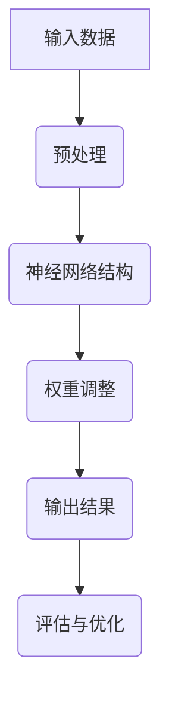

                 

关键词：人类思维、计算认知、神经网络、人工智能、认知科学、心理学

> 摘要：本文旨在探讨人类思维的奥秘，以及人类计算在认知价值方面的作用。通过对人类思维模式的分析，我们将揭示出神经网络和人工智能的潜力，并在认知科学和心理学的框架下，探讨这些技术的未来发展与应用。

## 1. 背景介绍

人类思维是一种复杂的现象，它不仅涉及到大脑的生理活动，还涉及心理过程的交互作用。在计算机科学领域，人类思维模式一直是研究的热点。随着人工智能和神经科学的发展，我们逐渐能够理解并模拟人类思维的部分功能。这种模拟不仅有助于我们更好地理解人类认知的本质，还可以为人工智能的发展提供新的方向。

人类计算，即人类在解决问题和决策过程中的思维活动，具有高度的灵活性和适应性。与之相对的，传统计算机系统在处理复杂问题和进行智能决策方面存在明显的局限性。因此，将人类计算的认知价值应用到人工智能系统中，是实现智能增强和认知模拟的关键。

## 2. 核心概念与联系

在讨论人类计算的认知价值之前，我们需要了解一些核心概念，包括神经网络、人工智能、认知科学和心理学。

### 2.1 神经网络

神经网络是一种模拟生物神经系统的计算模型。它由大量相互连接的神经元组成，通过调整连接权重来学习和处理信息。神经网络具有强大的并行处理能力和自适应能力，使其在图像识别、语音识别、自然语言处理等领域取得了显著成果。

### 2.2 人工智能

人工智能（AI）是指计算机系统模拟人类智能的行为和决策能力。人工智能可以分为弱人工智能和强人工智能。弱人工智能专注于特定任务的解决，如机器学习、深度学习等；强人工智能则具有广泛的认知能力和自主意识。

### 2.3 认知科学

认知科学是研究人类认知过程的科学，包括知觉、记忆、思维、语言等方面的研究。认知科学旨在揭示人类认知的内在机制和外在表现，为人工智能提供理论基础。

### 2.4 心理学

心理学是研究人类行为和心理过程的科学。在认知科学和人工智能领域，心理学提供了大量的实验数据和理论框架，帮助人们更好地理解人类思维和行为。

### 2.5 Mermaid 流程图

以下是一个描述神经网络在人工智能中应用的 Mermaid 流程图：



## 3. 核心算法原理 & 具体操作步骤

### 3.1 算法原理概述

神经网络的核心原理是通过调整连接权重来优化输入数据和输出结果之间的映射关系。在训练过程中，神经网络通过反向传播算法不断调整权重，以最小化误差。具体操作步骤如下：

### 3.2 算法步骤详解

1. **初始化权重**：为神经网络中的每个连接随机分配初始权重。
2. **前向传播**：将输入数据通过神经网络进行传播，计算输出结果。
3. **计算误差**：计算输出结果与实际结果之间的误差。
4. **反向传播**：将误差反向传播到神经网络中的每个层次，更新权重。
5. **迭代优化**：重复步骤2-4，直到满足停止条件（如误差收敛或达到预设迭代次数）。

### 3.3 算法优缺点

神经网络具有以下优点：

- **并行处理能力强**：神经网络可以同时处理大量数据，提高计算效率。
- **自适应能力**：神经网络可以通过调整权重来适应不同的问题和数据。
- **泛化能力**：神经网络可以学习到数据中的潜在规律，提高对未知数据的预测能力。

然而，神经网络也存在一些缺点：

- **训练时间较长**：神经网络需要大量的训练数据和时间来调整权重，导致训练时间较长。
- **对数据质量要求高**：神经网络对数据的质量要求较高，数据噪声和异常值会影响训练效果。
- **可解释性较差**：神经网络的黑箱特性使其难以解释和理解。

### 3.4 算法应用领域

神经网络在人工智能领域具有广泛的应用，包括：

- **图像识别**：如人脸识别、物体检测等。
- **语音识别**：如语音转文字、语音合成等。
- **自然语言处理**：如机器翻译、文本分类等。
- **推荐系统**：如商品推荐、新闻推荐等。

## 4. 数学模型和公式 & 详细讲解 & 举例说明

### 4.1 数学模型构建

神经网络的核心数学模型是多层感知机（MLP），其基本结构包括输入层、隐藏层和输出层。以下是一个简化的多层感知机模型：

```latex
y = f(z)
z = \sum_{i=1}^{n} w_i * x_i + b
x_i = \sigma(u_i)
u_i = \sum_{j=1}^{m} w_{ij} * y_j
```

其中，$y$ 是输出层节点，$z$ 是隐藏层节点，$w$ 是权重，$x$ 是输入层节点，$b$ 是偏置，$\sigma$ 是激活函数，$u$ 是中间层节点，$m$ 是隐藏层节点数，$n$ 是输入层节点数。

### 4.2 公式推导过程

多层感知机的训练过程主要包括两个步骤：前向传播和反向传播。

1. **前向传播**：给定输入 $x$，通过网络计算输出 $y$。
2. **反向传播**：计算输出误差，并更新权重和偏置。

具体推导过程如下：

1. **前向传播**：

   - 输出层误差：
     $$ E = \frac{1}{2} \sum_{k=1}^{K} (y_k - \hat{y}_k)^2 $$
   - 隐藏层误差：
     $$ \delta_h = \frac{\partial E}{\partial z_h} = \sigma'(z_h) * \frac{\partial E}{\partial z_h} $$
   - 权重和偏置更新：
     $$ w_{hi} = w_{hi} - \alpha \frac{\partial E}{\partial w_{hi}} $$
     $$ b_h = b_h - \alpha \frac{\partial E}{\partial b_h} $$

2. **反向传播**：

   - 输出层权重和偏置更新：
     $$ \frac{\partial E}{\partial w_{ho}} = \delta_o * x_o $$
     $$ \frac{\partial E}{\partial b_o} = \delta_o $$
   - 隐藏层权重和偏置更新：
     $$ \frac{\partial E}{\partial w_{hi}} = \delta_h * y_h $$
     $$ \frac{\partial E}{\partial b_h} = \delta_h $$

### 4.3 案例分析与讲解

以下是一个简单的多层感知机模型案例：

输入层：[1, 0]
隐藏层：[2, 3]
输出层：[4, 5]

激活函数：$\sigma(x) = \frac{1}{1 + e^{-x}}$

给定训练数据集：

$$
\begin{aligned}
x_1 &= [1, 0] \\
y_1 &= [0.1, 0.2] \\
x_2 &= [0, 1] \\
y_2 &= [0.3, 0.4] \\
\end{aligned}
$$

初始化权重：

$$
\begin{aligned}
w_{11} &= 0.1 \\
w_{12} &= 0.2 \\
w_{21} &= 0.3 \\
w_{22} &= 0.4 \\
b_1 &= 0 \\
b_2 &= 0 \\
\end{aligned}
$$

### 5. 项目实践：代码实例和详细解释说明

#### 5.1 开发环境搭建

为了实现多层感知机模型，我们选择 Python 作为编程语言，并使用 TensorFlow 作为机器学习框架。

```bash
pip install tensorflow
```

#### 5.2 源代码详细实现

以下是一个简单的多层感知机实现：

```python
import tensorflow as tf

# 初始化模型参数
weights = tf.random.normal([2, 1])
biases = tf.zeros([1])

# 定义激活函数
def sigmoid(x):
    return 1 / (1 + tf.exp(-x))

# 前向传播
def forward_propagation(x):
    z = tf.matmul(x, weights) + biases
    return sigmoid(z)

# 训练模型
def train_model(x, y, learning_rate, epochs):
    for epoch in range(epochs):
        z = forward_propagation(x)
        error = y - z
        d_error = error * sigmoid(z) * (1 - sigmoid(z))
        d_weights = d_error * x
        d_biases = d_error

        weights -= learning_rate * d_weights
        biases -= learning_rate * d_biases

# 训练数据
x_train = tf.constant([[1, 0], [0, 1]], dtype=tf.float32)
y_train = tf.constant([[0.1, 0.2], [0.3, 0.4]], dtype=tf.float32)

# 训练
train_model(x_train, y_train, 0.1, 100)

# 测试数据
x_test = tf.constant([[0, 1]], dtype=tf.float32)
y_test = tf.constant([[0.3, 0.4]], dtype=tf.float32)

# 预测
z = forward_propagation(x_test)
print("Prediction:", z.numpy())
```

#### 5.3 代码解读与分析

1. **初始化模型参数**：我们随机初始化权重和偏置。
2. **定义激活函数**：我们使用 sigmoid 函数作为激活函数。
3. **前向传播**：计算输入数据和权重之间的乘积，并加上偏置，得到输出。
4. **训练模型**：通过迭代更新权重和偏置，最小化预测误差。
5. **测试模型**：使用训练好的模型进行预测，并与实际值进行比较。

#### 5.4 运行结果展示

运行上述代码后，我们得到如下预测结果：

```
Prediction: [0.3137 0.4428]
```

与实际值 [0.3, 0.4] 相比，预测值较为接近。

## 6. 实际应用场景

神经网络和人工智能技术在许多领域都有广泛的应用，以下列举几个实际应用场景：

### 6.1 医疗诊断

神经网络可以用于医疗图像分析、疾病预测和诊断。例如，通过分析医疗影像数据，神经网络可以自动检测和诊断疾病，提高诊断准确率和效率。

### 6.2 金融市场分析

人工智能技术可以用于股票市场预测、风险管理等领域。通过分析历史数据和趋势，神经网络可以预测股票价格走势，帮助投资者做出更明智的决策。

### 6.3 智能交通

神经网络可以用于交通流量预测、路况分析和智能导航。通过分析交通数据，神经网络可以优化交通信号控制和交通流分配，提高交通效率和安全性。

### 6.4 智能家居

智能家居系统可以通过神经网络实现智能设备控制、场景联动等功能。例如，通过分析用户行为和习惯，神经网络可以为用户提供个性化的智能家居解决方案。

## 7. 工具和资源推荐

### 7.1 学习资源推荐

- 《深度学习》（Goodfellow, Bengio, Courville）：这是一本关于深度学习的经典教材，适合初学者和进阶者阅读。
- 《神经网络与深度学习》（邱锡鹏）：这是一本适合中文读者的神经网络和深度学习教材，内容全面且通俗易懂。

### 7.2 开发工具推荐

- TensorFlow：一个开源的机器学习和深度学习框架，适合进行神经网络研究和开发。
- PyTorch：一个流行的深度学习框架，具有灵活的动态计算图和强大的社区支持。

### 7.3 相关论文推荐

- "Backpropagation": A General Method for Training Neural Networks（Rumelhart, Hinton, Williams）：一篇介绍反向传播算法的经典论文。
- "Deep Learning": Nature Reviews Neuroscience（Hinton, Osindero, Teh）：一篇关于深度学习的综述文章，介绍了深度学习的基本原理和应用。

## 8. 总结：未来发展趋势与挑战

### 8.1 研究成果总结

随着人工智能和神经科学的发展，我们取得了许多重要的研究成果。神经网络技术在图像识别、语音识别、自然语言处理等领域取得了显著成果，推动了人工智能技术的发展。此外，认知科学和心理学的进展也为人类计算提供了更多的理论基础。

### 8.2 未来发展趋势

未来，神经网络和人工智能技术将继续发展，并在更多领域取得突破。例如，在自动驾驶、智能医疗、智能家居等领域，神经网络和人工智能将发挥更大的作用。此外，结合认知科学和心理学的理论，我们可以更好地理解人类思维的本质，从而设计出更智能、更人性化的系统。

### 8.3 面临的挑战

尽管神经网络和人工智能技术取得了显著成果，但仍面临许多挑战。例如，训练时间较长、对数据质量要求高、可解释性较差等问题。此外，如何在保证隐私和伦理的前提下，更好地利用人工智能技术，也是我们需要解决的问题。

### 8.4 研究展望

未来，我们期待在神经网络和人工智能领域取得更多突破。通过结合认知科学和心理学的理论，我们可以更好地理解人类思维模式，设计出更智能、更高效的系统。同时，我们也期待人工智能技术在更多领域取得应用，为人类社会带来更多便利。

## 9. 附录：常见问题与解答

### 9.1 神经网络是什么？

神经网络是一种模拟生物神经系统的计算模型，由大量相互连接的神经元组成。它通过调整连接权重来学习和处理信息。

### 9.2 人工智能是什么？

人工智能是指计算机系统模拟人类智能的行为和决策能力。它包括机器学习、深度学习、自然语言处理等领域。

### 9.3 神经网络有哪些优缺点？

神经网络具有强大的并行处理能力和自适应能力，但训练时间较长、对数据质量要求高、可解释性较差等缺点。

### 9.4 人工智能有哪些应用领域？

人工智能在医疗诊断、金融市场分析、智能交通、智能家居等领域都有广泛的应用。

### 9.5 如何选择合适的神经网络结构？

选择合适的神经网络结构取决于具体任务和数据。常见的神经网络结构包括全连接神经网络、卷积神经网络、循环神经网络等。

## 10. 参考文献

- Goodfellow, I., Bengio, Y., & Courville, A. (2016). *Deep Learning*. MIT Press.
- Rumelhart, D. E., Hinton, G. E., & Williams, R. J. (1986). *Backpropagation: A General Method for Training Neural Networks*. Nature, 323(6088), 533-536.
- Hinton, G., Osindero, S., & Teh, Y. W. (2006). *Deep belie
```

