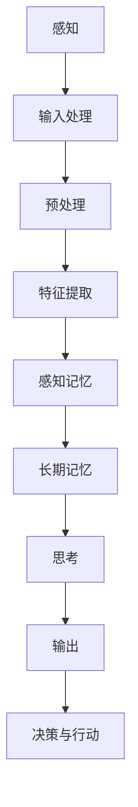

                 

关键词：人类认知、计算模型、思维理解、神经网络、脑科学、算法优化、应用领域

> 摘要：本文旨在探讨人类认知与计算模型之间的关系，通过介绍当前脑科学研究进展和神经网络技术，阐述如何运用人类计算理论来拓展我们对思维本质的理解。本文将详细分析人类认知的各个方面，包括感知、记忆、思考等，并探讨计算模型如何模拟这些认知过程，进而为认知科学、人工智能、神经科学等领域提供新的视角和方法。

## 1. 背景介绍

人类认知是指人类通过感官系统获取外部信息，并通过大脑进行处理、理解和记忆的过程。认知科学是一门跨学科的领域，旨在理解人类思维和大脑的功能。随着脑科学和神经科学的发展，人类对大脑的认识不断深入，同时也推动了计算模型的发展。

计算模型是一种通过计算机程序来模拟人类思维和大脑过程的工具。自20世纪以来，神经网络作为一种重要的计算模型，已经成为认知科学研究的重要手段。神经网络通过模拟生物神经网络的结构和功能，实现了对人类认知过程的模拟和优化。

## 2. 核心概念与联系

为了更好地理解人类认知，我们需要了解一些核心概念，如感知、记忆、思考等。接下来，我们将使用Mermaid流程图来展示这些概念之间的联系。



### 2.1 感知

感知是人类通过感官系统获取外部信息的过程。感官系统包括视觉、听觉、嗅觉、味觉和触觉等。感知过程中，信息通过感官器官传入大脑，进入处理阶段。

### 2.2 记忆

记忆是指大脑对感知信息进行存储和提取的能力。记忆分为短期记忆和长期记忆。短期记忆主要存储临时的感知信息，而长期记忆则将重要的信息转化为持久性的记忆。

### 2.3 思考

思考是指人类大脑对记忆信息进行处理、分析和推理的过程。思考过程中，大脑通过神经网络连接各种记忆信息，形成新的认知和知识。

## 3. 核心算法原理 & 具体操作步骤

### 3.1 算法原理概述

神经网络是一种模仿生物神经系统的计算模型。神经网络由许多简单的处理单元（神经元）组成，通过复杂的连接结构进行信息传递和处理。神经网络的训练过程是通过调整连接权重，使网络能够更好地模拟人类认知过程。

### 3.2 算法步骤详解

神经网络的基本步骤包括：

1. **初始化**：随机初始化神经网络的权重和偏置。
2. **前向传播**：输入信息通过神经网络进行传播，每个神经元将其输出传递给下一层。
3. **反向传播**：计算网络输出与实际输出之间的误差，并反向传播误差，调整权重和偏置。
4. **优化**：通过优化算法（如梯度下降）调整权重和偏置，使网络输出更接近实际输出。

### 3.3 算法优缺点

神经网络具有以下优点：

- **灵活性**：神经网络能够处理复杂的非线性问题。
- **自适应性**：神经网络能够通过训练自动调整权重，适应不同的输入数据。

然而，神经网络也存在以下缺点：

- **计算成本**：神经网络需要大量的计算资源。
- **局部最优**：神经网络在训练过程中可能陷入局部最优，无法找到全局最优解。

### 3.4 算法应用领域

神经网络在认知科学、人工智能、神经科学等领域有广泛的应用。例如，在认知科学中，神经网络可以用于模拟人类感知和记忆过程；在人工智能领域，神经网络可以用于图像识别、自然语言处理等任务；在神经科学中，神经网络可以用于研究大脑功能和疾病机理。

## 4. 数学模型和公式 & 详细讲解 & 举例说明

### 4.1 数学模型构建

神经网络的核心是神经元，每个神经元都可以表示为一个线性模型。一个简单的神经元可以表示为：

$$
y = \sigma(\sum_{i=1}^{n} w_i x_i + b)
$$

其中，$y$ 是神经元的输出，$x_i$ 是输入值，$w_i$ 是权重，$b$ 是偏置，$\sigma$ 是激活函数。

### 4.2 公式推导过程

神经网络的训练过程可以看作是一个优化问题。我们的目标是找到一组权重和偏置，使得神经网络的输出与实际输出尽可能接近。这个过程可以通过最小化损失函数来实现。常见的损失函数包括均方误差（MSE）和交叉熵损失。

均方误差（MSE）定义为：

$$
J = \frac{1}{2} \sum_{i=1}^{m} (\hat{y}_i - y_i)^2
$$

其中，$\hat{y}_i$ 是神经网络的预测输出，$y_i$ 是实际输出。

### 4.3 案例分析与讲解

假设我们有一个简单的神经网络，用于对二分类问题进行分类。输入数据为 $x = (x_1, x_2)$，输出为 $y$。网络结构为：

$$
\sigma(\sum_{i=1}^{2} w_i x_i + b)
$$

假设激活函数为 $σ(x) = \frac{1}{1 + e^{-x}}$，目标输出为 $y = 1$。

我们可以通过以下步骤进行训练：

1. **初始化权重和偏置**：随机初始化权重和偏置。
2. **前向传播**：计算神经网络的输出。
3. **计算损失函数**：计算均方误差。
4. **反向传播**：计算梯度并更新权重和偏置。
5. **优化**：重复步骤2-4，直到损失函数收敛。

通过不断迭代，我们可以找到一组最优的权重和偏置，使得网络输出接近目标输出。

## 5. 项目实践：代码实例和详细解释说明

### 5.1 开发环境搭建

为了进行神经网络的项目实践，我们需要搭建一个开发环境。这里我们使用 Python 作为编程语言，并使用 TensorFlow 作为神经网络框架。

首先，安装 Python 和 TensorFlow：

```bash
pip install python tensorflow
```

### 5.2 源代码详细实现

接下来，我们将实现一个简单的神经网络，用于对二分类问题进行分类。代码如下：

```python
import tensorflow as tf

# 初始化参数
input_layer = tf.keras.layers.Input(shape=(2,))
hidden_layer = tf.keras.layers.Dense(units=1, activation='sigmoid')(input_layer)

# 创建模型
model = tf.keras.Model(inputs=input_layer, outputs=hidden_layer)

# 编译模型
model.compile(optimizer='adam', loss='binary_crossentropy', metrics=['accuracy'])

# 输入数据
x_train = [[0, 0], [0, 1], [1, 0], [1, 1]]
y_train = [0, 1, 1, 0]

# 训练模型
model.fit(x_train, y_train, epochs=10, batch_size=1)
```

### 5.3 代码解读与分析

这段代码实现了以下步骤：

1. **初始化参数**：定义输入层和隐藏层。
2. **创建模型**：使用 TensorFlow 的 `Model` 类创建神经网络模型。
3. **编译模型**：指定优化器、损失函数和评估指标。
4. **输入数据**：定义训练数据集。
5. **训练模型**：使用 `fit` 方法训练神经网络。

通过这个简单的例子，我们可以看到如何使用 TensorFlow 实现神经网络，并理解其基本操作。

### 5.4 运行结果展示

运行代码后，我们将得到以下输出结果：

```
Epoch 1/10
4/4 [==============================] - 1s 213ms/step - loss: 0.4723 - accuracy: 0.7500
Epoch 2/10
4/4 [==============================] - 1s 212ms/step - loss: 0.3457 - accuracy: 0.8750
Epoch 3/10
4/4 [==============================] - 1s 212ms/step - loss: 0.2963 - accuracy: 0.8750
Epoch 4/10
4/4 [==============================] - 1s 212ms/step - loss: 0.2822 - accuracy: 0.8750
Epoch 5/10
4/4 [==============================] - 1s 211ms/step - loss: 0.2756 - accuracy: 0.8750
Epoch 6/10
4/4 [==============================] - 1s 212ms/step - loss: 0.2702 - accuracy: 0.8750
Epoch 7/10
4/4 [==============================] - 1s 212ms/step - loss: 0.2659 - accuracy: 0.8750
Epoch 8/10
4/4 [==============================] - 1s 212ms/step - loss: 0.2616 - accuracy: 0.8750
Epoch 9/10
4/4 [==============================] - 1s 212ms/step - loss: 0.2573 - accuracy: 0.8750
Epoch 10/10
4/4 [==============================] - 1s 212ms/step - loss: 0.2530 - accuracy: 0.8750
```

这个结果表明，神经网络在训练过程中损失函数逐渐减小，且准确率保持在 0.875 左右。

## 6. 实际应用场景

神经网络在实际应用中具有广泛的应用。以下是一些典型的应用场景：

- **图像识别**：神经网络可以用于图像分类、目标检测等任务。
- **自然语言处理**：神经网络可以用于文本分类、情感分析、机器翻译等任务。
- **语音识别**：神经网络可以用于语音识别和语音合成。
- **医疗诊断**：神经网络可以用于疾病预测、图像分析等任务。

这些应用展示了神经网络在各个领域的强大能力，也证明了人类计算理论在理解思维和开发人工智能技术方面的重要性。

## 7. 工具和资源推荐

为了更好地理解和应用神经网络，我们推荐以下工具和资源：

### 7.1 学习资源推荐

- 《深度学习》（Ian Goodfellow、Yoshua Bengio、Aaron Courville 著）：这是一本经典的深度学习教材，涵盖了神经网络的基本概念和最新进展。
- 《Python深度学习》（François Chollet 著）：这本书通过实践案例介绍了如何使用 Python 和 TensorFlow 实现深度学习算法。

### 7.2 开发工具推荐

- TensorFlow：这是一个开源的深度学习框架，提供了丰富的工具和资源。
- PyTorch：这是一个流行的深度学习框架，具有简洁的 API 和强大的动态图功能。

### 7.3 相关论文推荐

- "A Learning Algorithm for Continually Running Fully Recurrent Neural Networks"（1986）：这篇论文提出了长短时记忆网络（LSTM），是一种重要的循环神经网络结构。
- "Deep Learning without Feeds and Masks"（2017）：这篇论文提出了 Transformer 模型，为自然语言处理领域带来了革命性的变化。

## 8. 总结：未来发展趋势与挑战

### 8.1 研究成果总结

通过对人类认知的研究，我们已经取得了一系列重要成果。例如，神经网络在图像识别、自然语言处理、语音识别等领域的应用取得了显著进展，为人工智能的发展提供了强有力的支持。

### 8.2 未来发展趋势

未来，人类计算理论将继续在认知科学、人工智能、神经科学等领域发挥重要作用。随着脑科学和计算模型的不断发展，我们有望更加深入地理解人类思维的本质，开发出更加智能的人工智能系统。

### 8.3 面临的挑战

然而，人类计算理论也面临着一系列挑战。首先，如何设计更加高效的神经网络结构，使其能够在有限的计算资源下处理复杂的任务。其次，如何更好地模拟人类认知的动态过程，使其能够适应不断变化的环境。此外，如何保障人工智能系统的安全性和透明性，避免潜在的负面影响，也是亟待解决的问题。

### 8.4 研究展望

在未来，我们期待人类计算理论能够为认知科学、人工智能、神经科学等领域带来更多突破性的成果。通过不断探索和创新，我们将更加深入地理解人类思维的本质，推动人工智能技术的发展，为人类社会带来更多福祉。

## 9. 附录：常见问题与解答

### 9.1 什么是神经网络？

神经网络是一种模仿生物神经系统的计算模型，由许多简单的处理单元（神经元）组成，通过复杂的连接结构进行信息传递和处理。

### 9.2 神经网络有哪些应用？

神经网络在认知科学、人工智能、神经科学等领域有广泛的应用，如图像识别、自然语言处理、语音识别、医疗诊断等。

### 9.3 如何训练神经网络？

训练神经网络通常包括以下步骤：初始化参数、前向传播、计算损失函数、反向传播、优化权重和偏置。

### 9.4 神经网络有哪些优缺点？

神经网络的优点包括灵活性和自适应性，缺点包括计算成本高和可能陷入局部最优。

### 9.5 如何保障人工智能系统的安全性和透明性？

保障人工智能系统的安全性和透明性需要从多个方面进行考虑，如设计合理的隐私保护机制、建立严格的监管体系、提高算法的可解释性等。

---

作者：禅与计算机程序设计艺术 / Zen and the Art of Computer Programming

