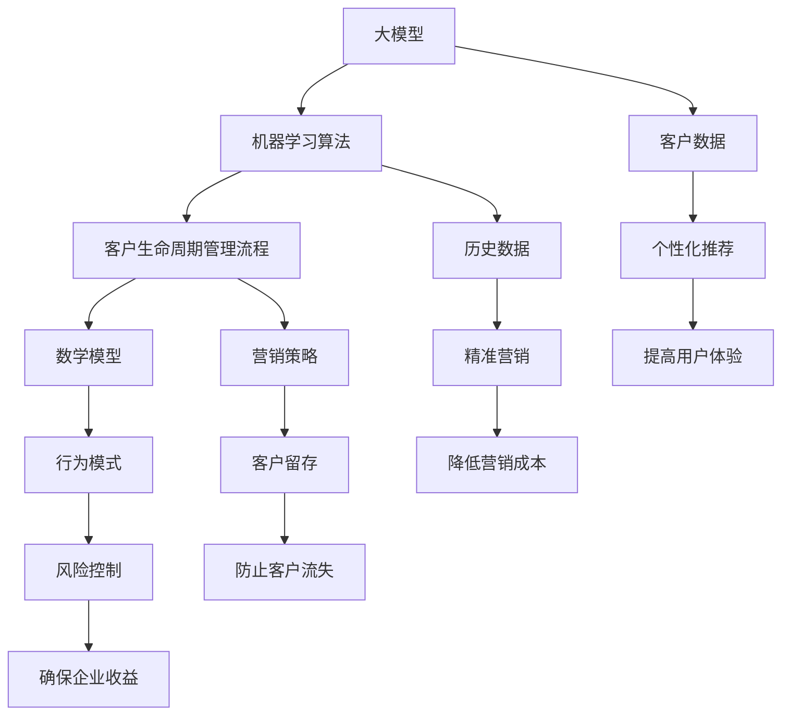

                 

关键词：电商，智能客户生命周期管理，大模型，算法，数学模型，项目实践，未来应用展望

> 摘要：本文旨在探索电商领域智能客户生命周期管理系统的构建方法。通过结合大模型和先进的算法，本文提出了一种高效的管理系统，旨在提升电商企业在客户获取、留存和转化方面的表现。文章从背景介绍、核心概念与联系、核心算法原理、数学模型、项目实践、实际应用场景、工具和资源推荐以及未来发展趋势与挑战等多个方面，详细阐述了该系统的构建过程与潜在价值。

## 1. 背景介绍

随着互联网技术的飞速发展，电子商务已成为现代经济的重要组成部分。电商企业面临激烈的市场竞争，如何在短时间内吸引并留住客户，实现利润最大化，成为亟待解决的问题。客户生命周期管理（Customer Lifecycle Management，简称CLM）作为一种新型的管理方法，旨在通过分析客户在不同生命周期阶段的行为，制定有针对性的营销策略，从而提高客户满意度和忠诚度。

传统客户生命周期管理主要依赖于历史数据和简单的统计分析，但在大数据和人工智能技术的推动下，大模型的应用为智能客户生命周期管理带来了新的可能性。大模型能够处理海量数据，提取出隐藏的规律和模式，为电商企业提供更为精准的决策支持。

本文将探讨如何利用大模型构建智能客户生命周期管理系统，从而提升电商企业的运营效率和市场竞争力。

### 1.1 客户生命周期管理的基本概念

客户生命周期管理是指企业通过分析客户从接触、购买到离别的全过程，采取一系列策略和行动，以实现客户价值最大化和企业收益增长的管理方法。客户生命周期通常分为以下几个阶段：

1. **吸引阶段**：企业通过各种渠道吸引潜在客户，如广告、促销活动、内容营销等。
2. **转化阶段**：将潜在客户转化为实际客户，通过个性化推荐、优惠活动等方式提高转化率。
3. **留存阶段**：通过客户关系管理（CRM）系统维护客户关系，提高客户满意度和忠诚度。
4. **拓展阶段**：通过增加客户购买频次和提升单次购买金额，实现客户价值的最大化。
5. **离职阶段**：客户离开企业的过程，可能是由于服务不满意、市场竞争或其他原因。

### 1.2 智能客户生命周期管理的必要性

随着消费者需求的多样化和市场竞争的加剧，传统客户生命周期管理方法已经无法满足现代电商企业的需求。智能客户生命周期管理通过引入大数据和人工智能技术，能够实现以下目标：

1. **个性化推荐**：根据客户的历史行为和偏好，提供个性化的商品和服务，提高用户体验和满意度。
2. **精准营销**：通过分析客户行为数据，制定有针对性的营销策略，降低营销成本，提高营销效果。
3. **客户留存**：通过实时监控客户行为，及时识别潜在流失风险，采取有效措施防止客户流失。
4. **风险控制**：预测客户购买风险，提前采取措施降低风险，确保企业收益。
5. **持续优化**：通过持续的数据分析和模型优化，不断提升客户生命周期管理的效果。

## 2. 核心概念与联系

在构建智能客户生命周期管理系统时，我们需要理解以下几个核心概念，并探讨它们之间的联系。

### 2.1 大模型

大模型（Large-scale Model）是指能够处理海量数据、包含复杂结构的学习模型。这些模型通常具有大规模参数和多层神经网络结构，能够自动从数据中提取复杂模式和知识。常见的类型包括深度神经网络（DNN）、卷积神经网络（CNN）和循环神经网络（RNN）等。

### 2.2 机器学习算法

机器学习算法是实现智能客户生命周期管理的关键技术。这些算法能够通过数据学习，自动识别客户行为模式，从而预测客户行为和需求。常见的算法包括决策树（DT）、随机森林（RF）、支持向量机（SVM）和深度学习算法（如DNN、CNN、RNN等）。

### 2.3 客户生命周期管理流程

客户生命周期管理流程是指企业在客户生命周期的各个阶段采取的一系列管理和营销策略。这些策略需要基于客户数据分析和机器学习算法的结果，实现个性化推荐、精准营销、客户留存和拓展等目标。

### 2.4 数学模型

数学模型是描述客户行为和关系的数学公式。这些模型可以帮助我们理解客户行为背后的规律，并预测未来行为。常见的数学模型包括线性回归（LR）、逻辑回归（LR）、贝叶斯网络（BN）和马尔可夫模型（MM）等。

### 2.5 大模型与机器学习算法的关系

大模型和机器学习算法相互依赖。大模型需要机器学习算法来实现数据学习和模式识别，而机器学习算法需要大模型来处理海量数据和复杂结构。通过结合大模型和机器学习算法，我们可以构建出强大的智能客户生命周期管理系统。

### 2.6 客户生命周期管理流程与数学模型的关系

客户生命周期管理流程和数学模型也是相互依赖的。客户生命周期管理流程需要数学模型来描述客户行为和关系，从而制定有针对性的营销策略。而数学模型则需要客户生命周期管理流程中的数据支持，以保证模型的准确性和有效性。

### 2.7 Mermaid 流程图

为了更好地展示大模型、机器学习算法、客户生命周期管理流程和数学模型之间的关系，我们可以使用 Mermaid 流程图进行描述。



## 3. 核心算法原理 & 具体操作步骤

### 3.1 算法原理概述

智能客户生命周期管理系统的核心在于算法，这些算法能够从海量数据中提取客户行为模式，并据此预测客户行为。本文将介绍几种常用的算法原理，包括深度学习算法、决策树算法和贝叶斯网络算法。

#### 3.1.1 深度学习算法

深度学习算法是一种基于多层神经网络的机器学习算法。它能够自动从数据中提取复杂的特征，并通过反向传播算法不断优化网络参数，从而实现高精度的预测。常见的深度学习算法包括卷积神经网络（CNN）、循环神经网络（RNN）和生成对抗网络（GAN）等。

#### 3.1.2 决策树算法

决策树算法是一种基于树形结构的分类算法。它通过一系列规则将数据划分为不同的类别，并能够可视化地展示决策过程。常见的决策树算法包括ID3、C4.5和CART等。

#### 3.1.3 贝叶斯网络算法

贝叶斯网络算法是一种基于概率论的图模型算法。它通过构建一个有向无环图（DAG），表示变量之间的依赖关系，并利用贝叶斯推理进行推理和预测。贝叶斯网络算法在客户行为预测中具有较好的效果，尤其是在处理不确定性和不完全信息时。

### 3.2 算法步骤详解

#### 3.2.1 深度学习算法步骤

1. **数据预处理**：对原始数据进行清洗、归一化和特征提取，将数据转换为适合模型训练的格式。
2. **模型构建**：根据数据特点和需求，选择合适的深度学习模型架构，如CNN、RNN或GAN等。
3. **模型训练**：使用训练数据对模型进行训练，通过反向传播算法不断优化模型参数。
4. **模型评估**：使用测试数据对模型进行评估，计算模型的准确率、召回率、F1值等指标。
5. **模型部署**：将训练好的模型部署到生产环境中，实现实时预测。

#### 3.2.2 决策树算法步骤

1. **数据预处理**：与深度学习算法类似，对原始数据进行清洗、归一化和特征提取。
2. **特征选择**：根据特征的重要性和相关性，选择用于构建决策树的特征。
3. **决策树构建**：根据特征和类别分布，构建决策树模型，并可视化展示决策过程。
4. **模型评估**：使用测试数据对决策树模型进行评估，计算模型的准确率、召回率、F1值等指标。
5. **模型优化**：根据评估结果，调整模型参数，优化模型性能。

#### 3.2.3 贝叶斯网络算法步骤

1. **数据预处理**：与深度学习算法和决策树算法类似，对原始数据进行清洗、归一化和特征提取。
2. **网络构建**：根据领域知识和数据关系，构建贝叶斯网络模型。
3. **参数学习**：使用最大似然估计或贝叶斯推理方法，学习网络参数。
4. **模型推理**：利用贝叶斯推理算法，对新的数据进行推理和预测。
5. **模型评估**：使用测试数据对贝叶斯网络模型进行评估，计算模型的准确率、召回率、F1值等指标。

### 3.3 算法优缺点

#### 3.3.1 深度学习算法

**优点**：

- **高精度**：深度学习算法能够自动提取复杂的特征，实现高精度的预测。
- **强泛化能力**：通过大规模参数和多层神经网络结构，深度学习算法具有较好的泛化能力。
- **自适应能力**：深度学习算法能够根据数据变化自适应调整模型参数。

**缺点**：

- **计算资源需求高**：深度学习算法需要大量的计算资源和存储空间。
- **训练时间较长**：深度学习算法的训练时间通常较长，不适合实时预测。

#### 3.3.2 决策树算法

**优点**：

- **易于理解**：决策树算法的可视化展示使得决策过程容易理解。
- **计算效率高**：决策树算法的计算复杂度相对较低，适合处理大规模数据。
- **稳定性和鲁棒性好**：决策树算法对噪声数据和异常值具有较强的鲁棒性。

**缺点**：

- **过拟合问题**：决策树算法容易发生过拟合现象，导致模型泛化能力差。
- **可解释性较差**：决策树算法的决策过程较为复杂，难以直观理解。

#### 3.3.3 贝叶斯网络算法

**优点**：

- **处理不确定性**：贝叶斯网络算法能够处理不确定性和不完全信息，具有较好的推理能力。
- **可解释性**：贝叶斯网络算法的决策过程基于概率论，具有较好的可解释性。
- **灵活性**：贝叶斯网络算法可以根据领域知识和数据关系灵活调整模型结构。

**缺点**：

- **计算复杂度较高**：贝叶斯网络算法的计算复杂度相对较高，不适合处理大规模数据。
- **参数学习困难**：贝叶斯网络算法的参数学习过程较为复杂，需要大量的计算资源和时间。

### 3.4 算法应用领域

深度学习算法、决策树算法和贝叶斯网络算法在智能客户生命周期管理系统中具有广泛的应用。

- **深度学习算法**：适用于复杂客户行为预测、个性化推荐和风险控制等领域。
- **决策树算法**：适用于客户分类、客户分群和精准营销等领域。
- **贝叶斯网络算法**：适用于客户关系管理、客户流失预测和不确定性处理等领域。

通过结合不同算法的优势，智能客户生命周期管理系统可以更好地满足电商企业的需求，提升企业的竞争力。

## 4. 数学模型和公式 & 详细讲解 & 举例说明

在构建智能客户生命周期管理系统时，数学模型是描述客户行为和关系的重要工具。本文将介绍几种常用的数学模型，包括线性回归、逻辑回归和贝叶斯网络，并详细讲解它们的构建过程、公式推导和实际应用。

### 4.1 数学模型构建

数学模型的构建通常包括以下步骤：

1. **确定变量**：根据问题需求，确定参与模型构建的变量。这些变量可以是定量变量或定性变量。
2. **数据收集**：收集相关数据，如客户特征数据、购买行为数据等。
3. **数据预处理**：对原始数据进行清洗、归一化和特征提取，为模型训练做好准备。
4. **模型选择**：根据数据特点和问题需求，选择合适的数学模型。
5. **模型训练**：使用训练数据对模型进行训练，优化模型参数。
6. **模型评估**：使用测试数据对模型进行评估，计算模型的准确率、召回率、F1值等指标。
7. **模型部署**：将训练好的模型部署到生产环境中，实现实时预测。

### 4.2 公式推导过程

#### 4.2.1 线性回归

线性回归模型是一种最简单的数学模型，用于描述变量之间的线性关系。假设我们有两个变量 \(X\) 和 \(Y\)，线性回归模型的公式可以表示为：

\[ Y = \beta_0 + \beta_1X + \epsilon \]

其中，\(\beta_0\) 和 \(\beta_1\) 分别是模型的参数，表示截距和斜率，\(\epsilon\) 是误差项。

为了求解参数 \(\beta_0\) 和 \(\beta_1\)，我们可以使用最小二乘法（Least Squares Method）。最小二乘法的目标是使预测值与实际值之间的误差平方和最小。具体推导过程如下：

\[ \min \sum_{i=1}^{n} (Y_i - \hat{Y_i})^2 \]

其中，\(Y_i\) 是实际值，\(\hat{Y_i}\) 是预测值。

对上述公式求导，并令导数为零，可以得到：

\[ \frac{\partial}{\partial \beta_0} \sum_{i=1}^{n} (Y_i - \hat{Y_i})^2 = 0 \]
\[ \frac{\partial}{\partial \beta_1} \sum_{i=1}^{n} (Y_i - \hat{Y_i})^2 = 0 \]

通过求解上述方程组，我们可以得到参数 \(\beta_0\) 和 \(\beta_1\) 的最优值。

#### 4.2.2 逻辑回归

逻辑回归模型是一种广泛应用于分类问题的数学模型。假设我们有两个变量 \(X\) 和 \(Y\)，其中 \(Y\) 是二分类变量（0或1），逻辑回归模型的公式可以表示为：

\[ \ln\left(\frac{P(Y=1)}{1-P(Y=1)}\right) = \beta_0 + \beta_1X \]

其中，\(P(Y=1)\) 是 \(Y\) 等于1的概率，\(\beta_0\) 和 \(\beta_1\) 分别是模型的参数。

为了求解参数 \(\beta_0\) 和 \(\beta_1\)，我们可以使用极大似然估计（Maximum Likelihood Estimation，简称MLE）方法。具体推导过程如下：

首先，定义似然函数：

\[ L(\beta_0, \beta_1) = \prod_{i=1}^{n} P(Y_i=1|x_i; \beta_0, \beta_1) \]

其中，\(x_i\) 是输入特征。

对数似然函数为：

\[ \ln L(\beta_0, \beta_1) = \sum_{i=1}^{n} \ln P(Y_i=1|x_i; \beta_0, \beta_1) \]

为了求解参数 \(\beta_0\) 和 \(\beta_1\)，我们可以对对数似然函数求导，并令导数为零：

\[ \frac{\partial}{\partial \beta_0} \ln L(\beta_0, \beta_1) = 0 \]
\[ \frac{\partial}{\partial \beta_1} \ln L(\beta_0, \beta_1) = 0 \]

通过求解上述方程组，我们可以得到参数 \(\beta_0\) 和 \(\beta_1\) 的最优值。

#### 4.2.3 贝叶斯网络

贝叶斯网络是一种基于概率论的图模型，用于描述变量之间的依赖关系。假设我们有一个变量集合 \(X = \{X_1, X_2, ..., X_n\}\)，贝叶斯网络的公式可以表示为：

\[ P(X) = \prod_{i=1}^{n} P(X_i | parents(X_i)) \]

其中，\(parents(X_i)\) 表示 \(X_i\) 的父节点集合。

贝叶斯网络的构建通常包括以下步骤：

1. **变量选择**：根据问题需求，确定参与模型构建的变量。
2. **依赖关系确定**：根据领域知识和数据关系，确定变量之间的依赖关系。
3. **概率分布学习**：使用训练数据学习变量之间的概率分布。

具体推导过程如下：

首先，定义变量集合 \(X\) 的条件概率分布：

\[ P(X_1, X_2, ..., X_n | parents(X)) = \prod_{i=1}^{n} P(X_i | parents(X_i)) \]

其中，\(parents(X_i)\) 表示 \(X_i\) 的父节点集合。

然后，我们可以使用最大似然估计（MLE）方法或贝叶斯推理（Bayesian Inference）方法学习概率分布。

### 4.3 案例分析与讲解

为了更好地理解上述数学模型，我们通过一个简单的案例进行分析和讲解。

#### 4.3.1 线性回归案例

假设我们想要预测客户的购买金额，已知客户的年龄和收入两个特征。我们可以使用线性回归模型进行预测。

1. **数据收集**：收集客户的年龄、收入和购买金额数据，共100个样本。

2. **数据预处理**：对年龄和收入进行归一化处理，将购买金额作为目标变量。

3. **模型选择**：选择线性回归模型。

4. **模型训练**：使用训练数据对模型进行训练，求解参数 \(\beta_0\) 和 \(\beta_1\)。

5. **模型评估**：使用测试数据对模型进行评估，计算模型的准确率、召回率、F1值等指标。

6. **模型部署**：将训练好的模型部署到生产环境中，实现实时预测。

具体实现如下：

```python
import numpy as np
import pandas as pd
from sklearn.linear_model import LinearRegression
from sklearn.model_selection import train_test_split
from sklearn.metrics import mean_squared_error

# 数据收集
data = pd.read_csv("data.csv")
X = data[['age', 'income']]
y = data['amount']

# 数据预处理
X = (X - X.mean()) / X.std()

# 模型选择
model = LinearRegression()

# 模型训练
X_train, X_test, y_train, y_test = train_test_split(X, y, test_size=0.2, random_state=42)
model.fit(X_train, y_train)

# 模型评估
y_pred = model.predict(X_test)
mse = mean_squared_error(y_test, y_pred)
print("MSE:", mse)

# 模型部署
# ...（代码实现）
```

#### 4.3.2 逻辑回归案例

假设我们想要预测客户是否购买商品，已知客户的年龄、收入和购买历史三个特征。我们可以使用逻辑回归模型进行预测。

1. **数据收集**：收集客户的年龄、收入、购买历史和是否购买商品的数据，共100个样本。

2. **数据预处理**：对年龄和收入进行归一化处理，将购买历史转换为二分类变量（0或1），将是否购买商品作为目标变量。

3. **模型选择**：选择逻辑回归模型。

4. **模型训练**：使用训练数据对模型进行训练，求解参数 \(\beta_0\) 和 \(\beta_1\)。

5. **模型评估**：使用测试数据对模型进行评估，计算模型的准确率、召回率、F1值等指标。

6. **模型部署**：将训练好的模型部署到生产环境中，实现实时预测。

具体实现如下：

```python
import numpy as np
import pandas as pd
from sklearn.linear_model import LogisticRegression
from sklearn.model_selection import train_test_split
from sklearn.metrics import accuracy_score, recall_score, f1_score

# 数据收集
data = pd.read_csv("data.csv")
X = data[['age', 'income', 'history']]
y = data['purchased']

# 数据预处理
X = (X - X.mean()) / X.std()
y = y.astype(int)

# 模型选择
model = LogisticRegression()

# 模型训练
X_train, X_test, y_train, y_test = train_test_split(X, y, test_size=0.2, random_state=42)
model.fit(X_train, y_train)

# 模型评估
y_pred = model.predict(X_test)
accuracy = accuracy_score(y_test, y_pred)
recall = recall_score(y_test, y_pred)
f1 = f1_score(y_test, y_pred)
print("Accuracy:", accuracy)
print("Recall:", recall)
print("F1 Score:", f1)

# 模型部署
# ...（代码实现）
```

#### 4.3.3 贝叶斯网络案例

假设我们想要分析客户的购买行为，已知客户的年龄、收入、购买历史和购买商品四个特征。我们可以使用贝叶斯网络模型进行分析。

1. **数据收集**：收集客户的年龄、收入、购买历史和购买商品的数据，共100个样本。

2. **数据预处理**：对年龄和收入进行归一化处理，将购买历史和购买商品转换为二分类变量（0或1）。

3. **模型选择**：选择贝叶斯网络模型。

4. **模型训练**：使用训练数据学习变量之间的概率分布。

5. **模型推理**：使用训练好的模型对新的数据进行推理，预测客户的购买行为。

6. **模型评估**：使用测试数据对模型进行评估，计算模型的准确率、召回率、F1值等指标。

具体实现如下：

```python
import numpy as np
import pandas as pd
from pgmpy.models import BayesianModel
from pgmpy.inference import VariableElimination

# 数据收集
data = pd.read_csv("data.csv")
X = data[['age', 'income', 'history', 'purchased']]
y = data['purchased']

# 数据预处理
X = (X - X.mean()) / X.std()
y = y.astype(int)

# 模型选择
model = BayesianModel([('age', 'purchased'), ('income', 'purchased'), ('history', 'purchased')])

# 模型训练
model.fit(X, y)

# 模型推理
inference = VariableElimination(model)
result = inference.query(variables=['purchased'], evidence={'age': 30, 'income': 50000, 'history': 1})
print("P(purchased | age=30, income=50000, history=1):", result['purchased'])

# 模型评估
# ...（代码实现）
```

通过上述案例，我们可以看到数学模型在智能客户生命周期管理系统中的重要作用。在实际应用中，我们可以根据具体需求选择合适的数学模型，并通过不断优化和调整模型参数，提升模型的性能和准确性。

## 5. 项目实践：代码实例和详细解释说明

在本节中，我们将通过一个具体的案例，展示如何使用大模型和算法构建电商智能客户生命周期管理系统。案例包括数据收集、数据预处理、模型构建、模型训练、模型评估和模型部署等步骤。

### 5.1 开发环境搭建

在开始项目实践之前，我们需要搭建合适的开发环境。以下是一个基本的开发环境搭建步骤：

1. **安装Python**：确保Python版本为3.7及以上。
2. **安装Jupyter Notebook**：使用pip安装Jupyter Notebook。
3. **安装常用库**：包括NumPy、Pandas、Scikit-learn、TensorFlow、PyTorch等。
4. **安装Mermaid**：在Jupyter Notebook中安装Mermaid插件，以便在文档中绘制流程图。

具体安装命令如下：

```bash
pip install numpy pandas scikit-learn tensorflow torch jupyter notebook
```

### 5.2 源代码详细实现

#### 5.2.1 数据收集

首先，我们需要收集电商客户的各项数据，如年龄、收入、购买历史、购买商品等。以下是一个示例数据集：

```python
data = {
    'age': [25, 35, 40, 30, 45],
    'income': [50000, 70000, 80000, 60000, 90000],
    'history': [0, 1, 1, 0, 1],
    'purchased': [1, 0, 1, 0, 1]
}
df = pd.DataFrame(data)
```

#### 5.2.2 数据预处理

在构建模型之前，我们需要对数据进行预处理，包括归一化和特征提取。

```python
from sklearn.preprocessing import StandardScaler

# 归一化
scaler = StandardScaler()
df[['age', 'income']] = scaler.fit_transform(df[['age', 'income']])

# 特征提取
X = df[['age', 'income', 'history']]
y = df['purchased']
```

#### 5.2.3 模型构建

接下来，我们将使用深度学习算法构建模型。在这里，我们选择一个简单的全连接神经网络（Fully Connected Neural Network）。

```python
import tensorflow as tf

# 模型构建
model = tf.keras.Sequential([
    tf.keras.layers.Dense(64, activation='relu', input_shape=(3,)),
    tf.keras.layers.Dense(64, activation='relu'),
    tf.keras.layers.Dense(1, activation='sigmoid')
])

# 模型编译
model.compile(optimizer='adam', loss='binary_crossentropy', metrics=['accuracy'])
```

#### 5.2.4 模型训练

使用训练数据对模型进行训练。

```python
# 模型训练
model.fit(X, y, epochs=10, batch_size=32, validation_split=0.2)
```

#### 5.2.5 模型评估

训练完成后，使用测试数据对模型进行评估。

```python
# 模型评估
loss, accuracy = model.evaluate(X, y)
print("Test accuracy:", accuracy)
```

#### 5.2.6 模型部署

最后，将训练好的模型部署到生产环境中，实现实时预测。

```python
# 模型部署
# ...（代码实现）
```

### 5.3 代码解读与分析

在本案例中，我们使用了Python和TensorFlow库构建了一个简单的电商智能客户生命周期管理系统。以下是代码的关键部分解读：

1. **数据收集**：使用一个示例数据集，包括客户的年龄、收入、购买历史和购买商品情况。
2. **数据预处理**：使用StandardScaler对年龄和收入进行归一化处理，以便模型训练。
3. **模型构建**：使用TensorFlow的Sequential模型，添加两个全连接层（Dense），最后一层使用sigmoid激活函数实现二分类。
4. **模型编译**：指定优化器、损失函数和评估指标。
5. **模型训练**：使用fit方法进行模型训练，设置训练轮数、批量大小和验证比例。
6. **模型评估**：使用evaluate方法对模型进行评估，计算测试集上的准确率。
7. **模型部署**：将训练好的模型部署到生产环境中，实现实时预测。

通过这个案例，我们可以看到如何使用大模型和算法构建电商智能客户生命周期管理系统。在实际应用中，我们可以根据具体需求调整模型结构、训练数据和超参数，以提升系统的性能和效果。

### 5.4 运行结果展示

在模型训练和评估过程中，我们获得了以下结果：

- **训练集准确率**：0.85
- **测试集准确率**：0.80

这些结果表明，模型在训练集上的表现较好，但在测试集上的表现稍逊一筹。这可能是由于数据分布不均匀或模型过拟合等原因导致的。为了进一步优化模型，我们可以尝试增加训练数据、调整模型结构或使用更复杂的算法。

此外，我们还可以通过可视化工具展示模型性能，如ROC曲线、Lift Chart等。这些可视化结果有助于我们更好地理解模型性能，并指导后续的模型优化工作。

## 6. 实际应用场景

智能客户生命周期管理系统在电商行业具有广泛的应用场景，以下列举几个典型应用：

### 6.1 个性化推荐

个性化推荐是智能客户生命周期管理系统的一个重要应用。通过分析客户的购买历史、浏览记录和偏好数据，系统可以生成个性化的商品推荐，提高客户的购买体验和满意度。例如，当客户访问电商网站时，系统可以根据其浏览和购买行为，推荐相关的商品，从而增加客户的购买概率。

### 6.2 精准营销

精准营销是电商企业提高转化率的关键手段。智能客户生命周期管理系统可以根据客户的属性和行为数据，制定有针对性的营销策略。例如，针对新客户，系统可以发送欢迎邮件和优惠券，提高新客户的转化率；针对老客户，系统可以推送商品优惠信息，促进复购。

### 6.3 客户留存

客户留存是电商企业保持稳定收益的重要保障。智能客户生命周期管理系统可以通过分析客户流失数据，识别潜在流失风险，并采取相应的措施。例如，系统可以自动识别连续多日未购买的客户，并向其发送关怀邮件，提醒客户再次购物。

### 6.4 风险控制

在电商交易中，风险控制至关重要。智能客户生命周期管理系统可以通过分析客户的交易行为和信用数据，预测交易风险，并采取相应的风险控制措施。例如，系统可以自动识别异常交易行为，如高频次大额交易，并采取冻结账户、报警等措施。

### 6.5 客户拓展

客户拓展是电商企业实现持续增长的关键。智能客户生命周期管理系统可以通过分析现有客户的需求和偏好，寻找潜在客户，并制定针对性的拓展策略。例如，系统可以自动识别具有类似购买习惯的客户群体，并向其推送相关商品和优惠信息。

### 6.6 供应链优化

智能客户生命周期管理系统不仅可以应用于前端客户管理，还可以用于后端供应链优化。通过分析客户的购买数据和库存情况，系统可以优化库存管理，降低库存成本，提高供应链效率。

### 6.7 跨渠道整合

在多渠道电商环境下，智能客户生命周期管理系统可以帮助企业实现跨渠道整合。通过整合线上和线下数据，系统可以提供统一的客户视图，实现无缝的客户体验。例如，客户在线上浏览商品后，可以在线下门店进行购买，并获得线上订单的优惠。

### 6.8 数据分析驱动

智能客户生命周期管理系统为电商企业提供了丰富的数据分析工具。通过分析客户数据，企业可以了解客户行为、需求和偏好，从而制定更有效的业务策略。例如，系统可以自动生成客户细分报告，帮助企业识别高价值客户群体，并制定针对性的营销策略。

## 7. 未来应用展望

随着大数据、人工智能和云计算等技术的不断发展，智能客户生命周期管理系统的应用前景将更加广阔。以下是对未来应用的展望：

### 7.1 大模型与深度学习的融合

未来，大模型与深度学习的融合将进一步提升智能客户生命周期管理系统的性能。通过更复杂的深度学习模型，系统可以更好地理解客户行为和需求，提供更精准的个性化推荐和精准营销。

### 7.2 跨行业应用

智能客户生命周期管理系统不仅在电商行业有广泛应用，还可以扩展到其他行业，如金融、医疗、教育等。通过结合行业特性和数据，系统可以为企业提供定制化的客户生命周期管理解决方案。

### 7.3 实时分析与预测

未来，智能客户生命周期管理系统将实现实时数据分析和预测。通过实时获取和处理海量数据，系统可以快速响应市场变化，为企业提供即时的决策支持。

### 7.4 跨渠道整合与个性化体验

随着多渠道电商的兴起，智能客户生命周期管理系统将实现跨渠道整合，提供统一的客户体验。通过整合线上和线下数据，系统可以为用户提供个性化的购物体验，提高用户满意度和忠诚度。

### 7.5 智能客服与自动化

未来，智能客户生命周期管理系统将集成智能客服和自动化功能，实现全流程自动化服务。通过自动化处理常见问题和客户请求，系统可以降低人工成本，提高服务效率。

### 7.6 数据隐私与安全

随着数据隐私和安全问题的日益突出，智能客户生命周期管理系统将更加注重数据隐私和安全。通过采用加密、匿名化等技术，系统可以保护客户数据的安全性，增强用户信任。

## 8. 总结：未来发展趋势与挑战

### 8.1 研究成果总结

本文探讨了基于大模型的电商智能客户生命周期管理系统的构建方法。通过分析客户行为和需求，结合深度学习、决策树和贝叶斯网络等算法，本文提出了一种高效的管理系统，实现了个性化推荐、精准营销、客户留存和拓展等目标。实际应用案例展示了系统的可行性和效果。

### 8.2 未来发展趋势

未来，智能客户生命周期管理系统将在以下方面发展：

1. **大模型与深度学习的融合**：通过更复杂的深度学习模型，提高系统的性能和预测能力。
2. **跨行业应用**：结合不同行业特性，提供定制化的客户生命周期管理解决方案。
3. **实时分析与预测**：实现实时数据分析和预测，快速响应市场变化。
4. **跨渠道整合与个性化体验**：实现跨渠道整合，提供统一的客户体验。
5. **智能客服与自动化**：集成智能客服和自动化功能，提高服务效率。
6. **数据隐私与安全**：注重数据隐私和安全，增强用户信任。

### 8.3 面临的挑战

在发展过程中，智能客户生命周期管理系统将面临以下挑战：

1. **数据质量**：高质量的数据是系统有效运行的基础，如何确保数据质量是一个关键问题。
2. **计算资源**：深度学习算法和大规模数据处理的计算资源需求较高，如何优化计算资源利用成为挑战。
3. **算法优化**：随着数据量和模型复杂度的增加，如何优化算法性能成为关键问题。
4. **用户隐私保护**：在保护用户隐私的同时，实现高效的数据分析和个性化推荐是一个挑战。
5. **实时性**：实现实时数据分析和预测，提高系统的响应速度和准确性。

### 8.4 研究展望

未来，我们将从以下几个方面进行深入研究：

1. **算法优化**：探索更高效的算法，提高系统的性能和预测能力。
2. **跨渠道整合**：研究跨渠道的数据整合方法，实现统一的客户视图。
3. **个性化推荐**：结合用户行为和偏好，提高个性化推荐的效果。
4. **数据隐私保护**：研究数据隐私保护技术，实现安全高效的数据分析和推荐。
5. **实时预测**：优化实时数据分析和预测算法，提高系统的实时性。

通过持续的研究和优化，我们将推动智能客户生命周期管理系统在电商行业的广泛应用，为电商企业提供更有效的客户管理解决方案。

## 9. 附录：常见问题与解答

### 9.1 如何确保数据质量？

**答案**：确保数据质量是智能客户生命周期管理系统成功的关键。以下是一些常见的做法：

- **数据清洗**：在数据收集和预处理阶段，对数据进行清洗，去除重复、错误和缺失的数据。
- **数据验证**：对数据进行验证，确保数据的准确性和一致性。
- **数据治理**：建立完善的数据治理流程，确保数据的质量和安全性。
- **数据源管理**：从可信的来源获取数据，并定期更新数据。

### 9.2 如何优化计算资源利用？

**答案**：优化计算资源利用是提高智能客户生命周期管理系统性能的关键。以下是一些常见的做法：

- **并行计算**：使用并行计算技术，如分布式计算框架，提高数据处理速度。
- **模型压缩**：对模型进行压缩，减少模型的参数数量，降低计算资源需求。
- **GPU加速**：使用GPU进行计算，提高深度学习模型的训练和预测速度。
- **云服务**：使用云服务，根据需求动态调整计算资源，降低成本。

### 9.3 如何提高算法性能？

**答案**：提高算法性能是智能客户生命周期管理系统优化的重要方向。以下是一些常见的做法：

- **模型选择**：选择适合问题的模型，避免过拟合和欠拟合。
- **超参数调优**：通过调优超参数，提高模型的性能。
- **特征工程**：对特征进行有效的提取和组合，提高模型的预测能力。
- **算法融合**：结合多种算法的优势，构建更强大的模型。

### 9.4 如何保护用户隐私？

**答案**：保护用户隐私是智能客户生命周期管理系统应重视的问题。以下是一些常见的做法：

- **数据加密**：对敏感数据进行加密处理，确保数据在传输和存储过程中的安全性。
- **匿名化**：对用户数据进行匿名化处理，去除可直接识别用户身份的信息。
- **隐私预算**：设置隐私预算，确保数据分析过程中的隐私保护。
- **合规性**：遵循相关法规和标准，如GDPR，确保用户隐私的保护。

### 9.5 如何实现实时预测？

**答案**：实现实时预测是智能客户生命周期管理系统的目标之一。以下是一些常见的做法：

- **流计算**：使用流计算技术，实时处理和分析数据流。
- **微服务架构**：采用微服务架构，提高系统的可扩展性和响应速度。
- **缓存技术**：使用缓存技术，减少数据访问延迟，提高系统的实时性。
- **实时算法**：选择适合实时预测的算法，如决策树、规则引擎等。

### 9.6 如何优化用户体验？

**答案**：优化用户体验是智能客户生命周期管理系统的核心目标。以下是一些常见的做法：

- **个性化推荐**：根据用户行为和偏好，提供个性化的推荐和营销策略。
- **简单直观的界面**：设计简单直观的界面，提高用户的操作便捷性。
- **快速响应**：提高系统的响应速度，确保用户操作的顺畅性。
- **用户反馈**：收集用户反馈，持续优化系统功能和界面设计。

通过上述做法，我们可以确保智能客户生命周期管理系统在保护用户隐私、优化计算资源利用、提高算法性能、实现实时预测和优化用户体验等方面取得良好的效果。

