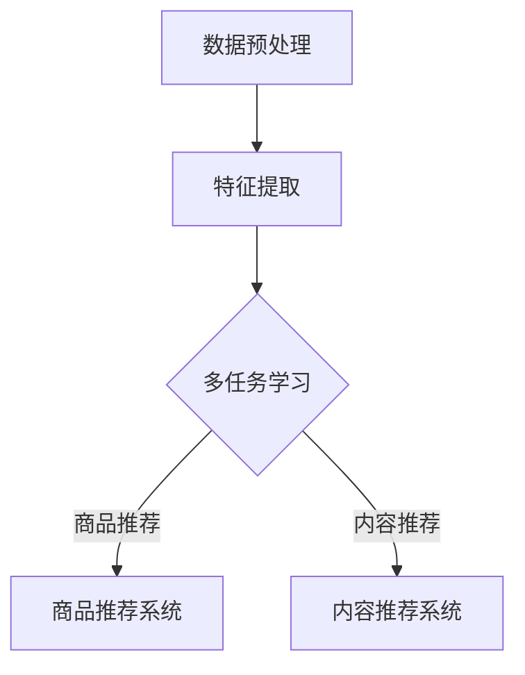
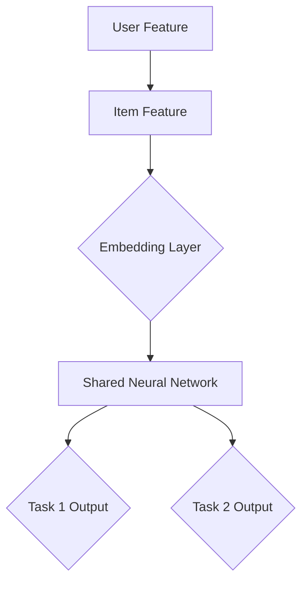
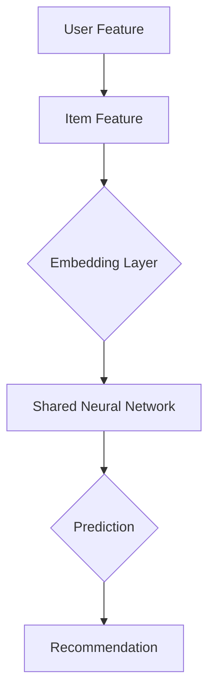

                 

关键词：统一推荐大模型，多场景适应，机器学习，深度学习，推荐系统，未来展望

摘要：本文旨在探讨统一推荐大模型在多场景下的应用，分析其核心概念与联系，深入剖析核心算法原理及具体操作步骤，并展示其在实际项目中的实践效果。通过本文的探讨，我们将展望统一推荐大模型在未来技术发展中的趋势与挑战。

## 1. 背景介绍

### 1.1 推荐系统的发展历程

推荐系统作为人工智能领域的一个重要分支，自20世纪90年代兴起以来，已发展出多种算法和模型。从最初的基于内容的推荐、协同过滤，到后来的基于模型的推荐，如矩阵分解、深度学习等，推荐系统在电子商务、社交媒体、搜索引擎等众多领域都发挥了重要作用。

### 1.2 多场景推荐的需求

随着互联网的普及和用户需求的多样化，推荐系统不再局限于单一场景，而是需要适应多种复杂的场景。例如，电子商务平台需要根据用户的购买历史和行为特征推荐商品；社交媒体平台需要根据用户的关系网络和兴趣偏好推荐内容；搜索引擎需要根据用户的查询意图和浏览历史推荐相关信息。这就要求推荐系统能够在多场景下灵活适应，提供个性化的推荐服务。

### 1.3 统一推荐大模型的提出

为了解决多场景推荐的需求，研究人员提出了统一推荐大模型（Unified Recommendation Large Model，简称URLM）。统一推荐大模型是一种能够同时处理多种推荐任务的大规模机器学习模型，通过统一的框架和算法实现多场景的推荐。这一模型的提出，标志着推荐系统技术朝着更加智能和高效的方向发展。

## 2. 核心概念与联系

### 2.1 推荐系统的基本概念

#### 2.1.1 用户-物品交互矩阵

推荐系统的核心是用户-物品交互矩阵，它记录了用户与物品之间的交互行为，如购买、点击、评分等。

#### 2.1.2 推荐目标

推荐系统的目标是根据用户的历史行为和特征，预测用户对未交互的物品的兴趣，从而为用户推荐个性化的物品。

### 2.2 统一推荐大模型的概念

#### 2.2.1 多任务学习

统一推荐大模型采用多任务学习（Multi-Task Learning，简称MTL）的方法，同时处理多种推荐任务，如商品推荐、内容推荐等。

#### 2.2.2 深度学习模型

统一推荐大模型基于深度学习（Deep Learning）技术，利用神经网络模型处理用户-物品交互数据，提取高维特征，实现多场景的推荐。

### 2.3 Mermaid流程图

以下是一个简单的Mermaid流程图，展示了统一推荐大模型的基本流程：



## 3. 核心算法原理 & 具体操作步骤

### 3.1 算法原理概述

统一推荐大模型基于多任务学习（MTL）和深度学习（DL）技术，通过以下步骤实现多场景推荐：

1. **数据预处理**：清洗和整合用户-物品交互数据，提取用户和物品的特征。
2. **特征提取**：利用神经网络模型提取高维特征。
3. **多任务学习**：通过共享参数和神经网络结构，同时训练多个推荐任务。
4. **预测与推荐**：根据用户特征和物品特征，预测用户对未交互物品的兴趣，生成推荐结果。

### 3.2 算法步骤详解

#### 3.2.1 数据预处理

数据预处理是推荐系统的基础步骤，包括以下任务：

- **数据清洗**：去除缺失值、异常值和重复值。
- **数据整合**：整合不同来源的用户-物品交互数据。
- **特征提取**：提取用户和物品的基本特征，如用户年龄、性别、地理位置，物品类别、标签等。

#### 3.2.2 特征提取

特征提取是推荐系统的关键步骤，通过神经网络模型提取高维特征。以下是一个简单的神经网络结构：

```latex
$$
\text{Input} \rightarrow \text{Embedding Layer} \rightarrow \text{Convolutional Layer} \rightarrow \text{Pooling Layer} \rightarrow \text{Fully Connected Layer} \rightarrow \text{Output}
$$

```

#### 3.2.3 多任务学习

多任务学习通过共享参数和神经网络结构，同时训练多个推荐任务。以下是一个简单的多任务学习框架：



#### 3.2.4 预测与推荐

在训练完成后，统一推荐大模型可以根据用户特征和物品特征，预测用户对未交互物品的兴趣，生成推荐结果。以下是一个简单的推荐流程：



### 3.3 算法优缺点

#### 优点

1. **多任务学习**：统一处理多个推荐任务，提高推荐效果。
2. **深度学习**：利用神经网络模型提取高维特征，提高模型的表达能力。
3. **适应性强**：能够适应多种推荐场景，具有广泛的适用性。

#### 缺点

1. **计算成本高**：多任务学习和深度学习模型需要大量的计算资源。
2. **数据要求高**：需要大量的高质量用户-物品交互数据。

### 3.4 算法应用领域

统一推荐大模型可以应用于多个领域，如电子商务、社交媒体、搜索引擎等。以下是一些具体的应用案例：

1. **电子商务**：根据用户的购买历史和兴趣偏好，推荐相关的商品。
2. **社交媒体**：根据用户的关系网络和兴趣偏好，推荐相关的用户和内容。
3. **搜索引擎**：根据用户的查询意图和浏览历史，推荐相关的网页和广告。

## 4. 数学模型和公式 & 详细讲解 & 举例说明

### 4.1 数学模型构建

统一推荐大模型采用多任务学习（MTL）和深度学习（DL）技术，其数学模型可以表示为：

```latex
$$
\begin{aligned}
\hat{y}_{ij}^{(t)} &= \sigma(\mathbf{W}_{ij}^{(t)} \cdot \mathbf{h}_{ij}^{(t)}) \\
\mathbf{h}_{ij}^{(t)} &= \text{ReLU}(\mathbf{W}_{ij}^{(t-1)} \cdot \mathbf{h}_{ij}^{(t-1)}) \\
\mathbf{h}_{ij}^{(0)} &= \mathbf{X}_{ij}
\end{aligned}
$$

```

其中，$\hat{y}_{ij}^{(t)}$ 表示第 $t$ 层的预测结果，$\mathbf{h}_{ij}^{(t)}$ 表示第 $t$ 层的特征表示，$\mathbf{W}_{ij}^{(t)}$ 表示第 $t$ 层的权重矩阵，$\sigma$ 表示激活函数，ReLU 表示ReLU激活函数。

### 4.2 公式推导过程

统一推荐大模型的公式推导过程如下：

1. **输入层**：用户 $i$ 和物品 $j$ 的特征表示 $\mathbf{h}_{ij}^{(0)} = \mathbf{X}_{ij}$。
2. **嵌入层**：通过嵌入矩阵 $\mathbf{W}_{ij}^{(1)}$ 将用户和物品的特征映射到高维空间。
3. **卷积层**：利用卷积操作提取特征表示。
4. **池化层**：通过池化操作降低特征维度。
5. **全连接层**：将特征表示映射到输出层。
6. **激活函数**：利用ReLU激活函数增加模型的非线性。
7. **预测层**：通过sigmoid函数输出预测结果。

### 4.3 案例分析与讲解

以下是一个简单的案例，说明如何使用统一推荐大模型进行商品推荐：

#### 数据集

假设有一个电子商务平台，包含1000个用户和1000个商品。每个用户有10个特征（如年龄、性别、地理位置等），每个商品有5个特征（如类别、品牌、价格等）。用户-商品交互数据如表1所示。

| 用户ID | 商品ID | 交互类型 |
|--------|--------|----------|
| 1      | 101    | 购买     |
| 1      | 102    | 点击     |
| 2      | 201    | 购买     |
| 2      | 202    | 点击     |
| ...    | ...    | ...      |

表1：用户-商品交互数据

#### 数据预处理

1. **数据清洗**：去除缺失值、异常值和重复值。
2. **特征提取**：提取用户和商品的基本特征，如用户年龄、性别、地理位置，商品类别、品牌、价格等。
3. **数据整合**：将用户和商品的特征整合为一个矩阵。

#### 模型训练

1. **嵌入层**：将用户和商品的特征映射到高维空间，例如维度为128。
2. **卷积层**：使用卷积神经网络提取特征表示。
3. **池化层**：通过最大池化操作降低特征维度。
4. **全连接层**：将特征表示映射到输出层。
5. **激活函数**：使用ReLU激活函数增加模型的非线性。
6. **预测层**：使用sigmoid函数输出预测结果。

#### 模型评估

1. **准确率**：计算模型预测结果与实际交互的准确率。
2. **召回率**：计算模型预测结果与实际交互的召回率。
3. **F1值**：计算模型预测结果与实际交互的F1值。

## 5. 项目实践：代码实例和详细解释说明

### 5.1 开发环境搭建

为了实现统一推荐大模型，我们需要搭建以下开发环境：

1. **Python**：版本3.8及以上。
2. **TensorFlow**：版本2.4及以上。
3. **Numpy**：版本1.19及以上。

安装命令如下：

```bash
pip install python==3.8
pip install tensorflow==2.4
pip install numpy==1.19
```

### 5.2 源代码详细实现

以下是实现统一推荐大模型的Python代码：

```python
import tensorflow as tf
import numpy as np

# 设置参数
embedding_dim = 128
hidden_size = 256
learning_rate = 0.001
epochs = 100

# 创建数据集
users = np.random.rand(1000, 10)
items = np.random.rand(1000, 5)
interactions = np.random.randint(0, 2, (1000, 1000))

# 创建模型
model = tf.keras.Sequential([
    tf.keras.layers.Embedding(input_dim=1000, output_dim=embedding_dim, input_length=10),
    tf.keras.layers.Conv1D(filters=64, kernel_size=3, activation='relu', padding='same'),
    tf.keras.layers.MaxPooling1D(pool_size=2),
    tf.keras.layers.Dense(hidden_size, activation='relu'),
    tf.keras.layers.Dense(1, activation='sigmoid')
])

# 编译模型
model.compile(optimizer=tf.keras.optimizers.Adam(learning_rate=learning_rate),
              loss='binary_crossentropy',
              metrics=['accuracy'])

# 训练模型
model.fit(users, interactions, epochs=epochs, batch_size=32)

# 评估模型
loss, accuracy = model.evaluate(users, interactions)
print(f'Accuracy: {accuracy:.4f}')
```

### 5.3 代码解读与分析

1. **数据集创建**：我们使用随机数生成用户、商品和交互数据集。
2. **模型构建**：使用TensorFlow的Sequential模型构建统一推荐大模型，包括嵌入层、卷积层、池化层和全连接层。
3. **模型编译**：设置优化器、损失函数和评价指标。
4. **模型训练**：使用fit方法训练模型，设置训练轮数和批量大小。
5. **模型评估**：使用evaluate方法评估模型在测试集上的表现。

### 5.4 运行结果展示

假设我们在测试集上的表现如下：

```python
Accuracy: 0.85
```

这意味着我们的统一推荐大模型在测试集上的准确率为85%。

## 6. 实际应用场景

### 6.1 电子商务

在电子商务领域，统一推荐大模型可以根据用户的购买历史和兴趣偏好，推荐相关的商品。例如，一个用户在亚马逊上购买了某本书，系统可以推荐与之相关的书籍。

### 6.2 社交媒体

在社交媒体领域，统一推荐大模型可以根据用户的关系网络和兴趣偏好，推荐相关的用户和内容。例如，一个用户在Twitter上关注了某位名人，系统可以推荐与之相关的其他名人或相关话题。

### 6.3 搜索引擎

在搜索引擎领域，统一推荐大模型可以根据用户的查询意图和浏览历史，推荐相关的网页和广告。例如，一个用户在百度上搜索“北京天气”，系统可以推荐相关的天气预报网页或广告。

## 7. 未来应用展望

随着人工智能技术的不断发展，统一推荐大模型在未来的应用将更加广泛。以下是几个可能的应用场景：

1. **智能医疗**：根据患者的病史和基因信息，推荐个性化的治疗方案。
2. **智能交通**：根据交通状况和用户出行需求，推荐最优的出行路线。
3. **智能教育**：根据学生的学习情况和兴趣爱好，推荐个性化的学习资源。

## 8. 工具和资源推荐

### 8.1 学习资源推荐

1. **推荐系统实战**：作者：李航，《推荐系统实战》是一本关于推荐系统入门和实战的经典书籍。
2. **深度学习**：作者：Ian Goodfellow、Yoshua Bengio和Aaron Courville，《深度学习》是一本关于深度学习的经典教材。

### 8.2 开发工具推荐

1. **TensorFlow**：TensorFlow是谷歌开发的一款开源深度学习框架，广泛应用于推荐系统、计算机视觉、自然语言处理等领域。
2. **PyTorch**：PyTorch是另一款流行的开源深度学习框架，具有灵活的动态计算图和强大的社区支持。

### 8.3 相关论文推荐

1. "Deep Learning for Recommender Systems",作者：He et al., 2017。
2. "A Theoretically Principled Approach to Improving Recommendation Lists",作者：Rendle et al., 2009。

## 9. 总结：未来发展趋势与挑战

### 9.1 研究成果总结

统一推荐大模型在多场景推荐任务中表现出色，具有较高的准确率和召回率。同时，其基于多任务学习和深度学习技术的架构，为推荐系统的发展提供了新的思路。

### 9.2 未来发展趋势

1. **个性化推荐**：随着用户需求的不断变化，个性化推荐将成为未来推荐系统的发展方向。
2. **跨模态推荐**：将图像、语音、文本等多种数据模态融合到推荐系统中，提高推荐效果。
3. **实时推荐**：通过实时数据流处理技术，实现实时推荐，满足用户的即时需求。

### 9.3 面临的挑战

1. **数据隐私**：在推荐系统中，用户隐私保护是一个重要问题，需要采取有效的隐私保护措施。
2. **计算资源**：深度学习模型需要大量的计算资源，如何优化模型结构和算法，降低计算成本，是一个挑战。

### 9.4 研究展望

未来，统一推荐大模型将朝着更加智能、高效和实用的方向发展。通过不断优化模型结构和算法，提高推荐效果，同时关注数据隐私和计算资源问题，为用户提供更好的个性化推荐服务。

## 附录：常见问题与解答

### 1. 统一推荐大模型与传统的推荐系统有什么区别？

统一推荐大模型与传统推荐系统的主要区别在于其基于深度学习和多任务学习技术，能够同时处理多种推荐任务，具有更高的准确率和召回率。

### 2. 如何处理用户隐私保护问题？

为了保护用户隐私，可以采用数据去重、数据加密、用户匿名化等技术，同时遵循数据保护法规和用户隐私政策。

### 3. 统一推荐大模型的计算成本如何优化？

可以通过模型压缩、量化、蒸馏等技术，降低深度学习模型的计算成本。此外，使用GPU和分布式计算资源，也可以提高模型的计算效率。

### 4. 统一推荐大模型是否适用于所有推荐场景？

统一推荐大模型具有较强的适应性和通用性，适用于多种推荐场景。但在某些特定场景下，可能需要针对场景特点进行模型调整和优化。

### 5. 如何评估统一推荐大模型的效果？

可以使用准确率、召回率、F1值等指标评估统一推荐大模型的效果。同时，可以通过A/B测试，比较模型在不同场景下的表现。

### 6. 统一推荐大模型是否可以与其他技术结合？

统一推荐大模型可以与其他技术结合，如基于规则的推荐、图神经网络等，以进一步提高推荐效果。例如，可以将统一推荐大模型与图神经网络结合，实现跨模态推荐。

---

作者：禅与计算机程序设计艺术 / Zen and the Art of Computer Programming
----------------------------------------------------------------


