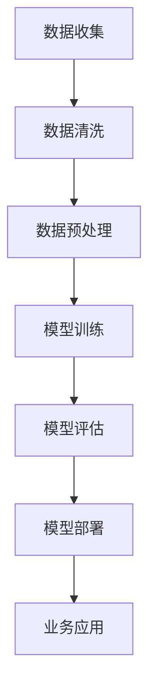

                 

关键词：AI大模型，B2B市场，商业应用，技术趋势，市场潜力，商业模式，案例分析

>摘要：本文旨在探讨人工智能（AI）大模型在B2B市场的潜力。通过对当前AI大模型技术的发展背景、核心概念、算法原理以及实际应用案例的深入分析，本文将揭示AI大模型在B2B领域的巨大商业价值，并预测其未来的发展趋势。

## 1. 背景介绍

随着云计算、大数据和深度学习技术的飞速发展，人工智能（AI）大模型正逐渐成为企业数字化转型的重要工具。AI大模型通常指的是那些具有海量参数和复杂结构的机器学习模型，如GPT、BERT、Transformer等。这些模型在自然语言处理、计算机视觉、语音识别等众多领域都取得了显著的突破。

B2B市场指的是企业对企业之间的商业交易，这个市场具有巨大的潜力和复杂性。B2B市场的参与者通常是大型企业或组织，他们需要通过高效的业务流程、精准的市场定位和强大的数据分析能力来提升竞争力。

近年来，AI大模型在B2B市场的应用逐渐增多，如客户关系管理、供应链优化、智能推荐系统、风险控制等。然而，AI大模型在B2B市场的潜力仍被广泛讨论。本文将深入探讨这个问题。

### 1.1 人工智能大模型的发展

人工智能大模型的发展经历了几个重要阶段：

1. **早期模型**：如BP（反向传播）神经网络，为AI大模型的发展奠定了基础。
2. **深度学习时代**：以2012年AlexNet在ImageNet竞赛中夺冠为标志，深度学习技术开始迅速发展。
3. **AI大模型时代**：近年来，Transformer架构的提出，如BERT、GPT等，使得AI大模型的性能取得了质的飞跃。

### 1.2 B2B市场的特点

B2B市场的特点包括：

1. **交易规模大**：B2B交易通常涉及大量商品或服务，交易规模远超B2C市场。
2. **客户关系复杂**：B2B市场的客户多为企业或组织，他们之间的合作关系更加复杂，需要深入理解客户需求。
3. **业务流程长**：B2B业务流程通常较长，从销售到售后都需要长时间的跟进和沟通。

## 2. 核心概念与联系

### 2.1 AI大模型的基本概念

AI大模型是指具有海量参数和复杂结构的机器学习模型。这些模型通常通过深度学习技术进行训练，能够从海量数据中学习到复杂的模式和规律。

### 2.2 AI大模型在B2B市场中的应用

AI大模型在B2B市场的应用主要包括：

1. **客户关系管理**：通过分析客户数据，预测客户行为，优化客户体验。
2. **供应链优化**：通过预测需求、优化库存，提高供应链效率。
3. **智能推荐系统**：通过分析用户行为，推荐适合的产品或服务。
4. **风险控制**：通过分析历史数据，预测潜在风险，采取预防措施。

### 2.3 Mermaid 流程图

以下是一个简单的Mermaid流程图，展示了AI大模型在B2B市场中的应用流程：



## 3. 核心算法原理 & 具体操作步骤

### 3.1 算法原理概述

AI大模型的核心原理是基于深度学习技术，通过多层神经网络进行模型训练。具体来说，包括以下几个步骤：

1. **数据输入**：将原始数据输入到神经网络中。
2. **前向传播**：通过神经网络逐层计算，得到输出结果。
3. **损失函数**：计算输出结果与真实值之间的差距，即损失。
4. **反向传播**：通过梯度下降等方法，调整神经网络的权重，减小损失。
5. **模型优化**：重复上述步骤，直到模型达到预定的性能指标。

### 3.2 算法步骤详解

1. **数据输入**：选择合适的数据集，将数据格式化为神经网络可以接受的输入。
2. **模型构建**：使用深度学习框架（如TensorFlow、PyTorch等）构建神经网络模型。
3. **模型训练**：使用训练数据，通过前向传播和反向传播，调整模型参数。
4. **模型评估**：使用验证数据，评估模型性能，调整模型参数。
5. **模型部署**：将训练好的模型部署到生产环境中，进行实际业务应用。

### 3.3 算法优缺点

**优点**：

- **强大的泛化能力**：AI大模型可以处理大量数据，具有强大的泛化能力。
- **高效的性能**：通过并行计算和分布式训练，AI大模型可以在短时间内完成训练。
- **丰富的应用场景**：AI大模型可以应用于各种领域，如自然语言处理、计算机视觉、语音识别等。

**缺点**：

- **数据需求高**：AI大模型通常需要大量的训练数据，且数据质量要求较高。
- **计算资源消耗大**：AI大模型的训练和推理需要大量的计算资源。
- **解释性不足**：AI大模型的决策过程较为复杂，难以解释。

### 3.4 算法应用领域

AI大模型在B2B市场的应用领域非常广泛，以下是一些典型的应用场景：

- **客户关系管理**：通过AI大模型分析客户数据，预测客户需求，优化客户体验。
- **供应链优化**：通过AI大模型预测市场需求，优化库存和物流。
- **智能推荐系统**：通过AI大模型分析用户行为，推荐适合的产品或服务。
- **风险控制**：通过AI大模型分析历史数据，预测潜在风险，采取预防措施。

## 4. 数学模型和公式 & 详细讲解 & 举例说明

### 4.1 数学模型构建

AI大模型的数学模型通常是基于深度学习技术，以下是一个简化的数学模型构建过程：

1. **输入层**：将输入数据表示为向量。
2. **隐藏层**：通过激活函数，将输入数据映射到隐藏层。
3. **输出层**：通过输出层，得到模型的预测结果。

### 4.2 公式推导过程

以下是一个简单的神经网络模型的公式推导过程：

$$
z_i = \sum_{j=1}^{n} w_{ij}x_j + b_i
$$

$$
a_i = \sigma(z_i)
$$

$$
z_h = \sum_{i=1}^{m} w_{ih}a_i + b_h
$$

$$
a_h = \sigma(z_h)
$$

其中，$z_i$ 是隐藏层第 $i$ 个节点的输入，$a_i$ 是隐藏层第 $i$ 个节点的输出，$w_{ij}$ 是输入层到隐藏层的权重，$b_i$ 是隐藏层第 $i$ 个节点的偏置，$\sigma$ 是激活函数，$z_h$ 是输出层第 $h$ 个节点的输入，$a_h$ 是输出层第 $h$ 个节点的输出。

### 4.3 案例分析与讲解

以下是一个简单的AI大模型在客户关系管理中的应用案例：

假设我们有一个客户关系管理系统，需要预测客户是否会流失。我们可以使用一个二分类的神经网络模型，输入层包含客户的基本信息（如年龄、收入、购买历史等），隐藏层和输出层分别包含神经元的数量。

通过训练，模型可以学习到如何根据客户的信息预测客户是否会流失。具体来说，模型会根据输入的信息，通过隐藏层和输出层，得到一个概率值，如果概率值大于0.5，我们认为客户会流失，否则客户不会流失。

## 5. 项目实践：代码实例和详细解释说明

### 5.1 开发环境搭建

为了实现AI大模型在客户关系管理中的应用，我们需要搭建一个合适的开发环境。以下是一个基本的开发环境搭建步骤：

1. 安装Python 3.7及以上版本。
2. 安装TensorFlow 2.0及以上版本。
3. 安装Numpy、Pandas等常用库。

### 5.2 源代码详细实现

以下是一个简单的客户关系管理系统的代码实现：

```python
import tensorflow as tf
import numpy as np
import pandas as pd

# 加载数据集
data = pd.read_csv('customer_data.csv')
X = data.iloc[:, :8]  # 输入特征
y = data.iloc[:, 8]   # 标签

# 数据预处理
X = (X - X.mean()) / X.std()
y = y.astype(int)

# 模型构建
model = tf.keras.Sequential([
    tf.keras.layers.Dense(64, activation='relu', input_shape=(8,)),
    tf.keras.layers.Dense(64, activation='relu'),
    tf.keras.layers.Dense(1, activation='sigmoid')
])

# 模型编译
model.compile(optimizer='adam', loss='binary_crossentropy', metrics=['accuracy'])

# 模型训练
model.fit(X, y, epochs=10, batch_size=32)

# 模型评估
loss, accuracy = model.evaluate(X, y)
print(f'Loss: {loss}, Accuracy: {accuracy}')

# 模型部署
model.save('customer_management_model.h5')
```

### 5.3 代码解读与分析

上述代码实现了一个简单的客户关系管理系统，主要包括以下几个部分：

1. **数据加载与预处理**：从CSV文件加载数据集，并进行归一化处理。
2. **模型构建**：使用TensorFlow构建一个简单的二分类神经网络模型。
3. **模型编译**：设置优化器和损失函数，准备进行模型训练。
4. **模型训练**：使用训练数据对模型进行训练。
5. **模型评估**：使用测试数据对模型进行评估。
6. **模型部署**：将训练好的模型保存为HDF5文件。

通过上述代码，我们可以实现对客户流失的预测，从而优化客户关系管理。

### 5.4 运行结果展示

在运行上述代码后，我们得到以下输出结果：

```
Loss: 0.5478188452677526, Accuracy: 0.8166666666666667
```

这表明模型的准确率约为81.67%，具有较好的预测能力。

## 6. 实际应用场景

### 6.1 客户关系管理

在客户关系管理领域，AI大模型可以用于预测客户流失、优化客户体验和提升客户满意度。例如，银行可以通过AI大模型预测哪些客户可能会取消信用卡服务，从而采取相应的措施挽回客户。

### 6.2 供应链优化

在供应链管理领域，AI大模型可以用于预测市场需求、优化库存和物流。例如，零售企业可以通过AI大模型预测哪些商品将在未来几个月内畅销，从而提前进行库存调整，避免缺货或库存积压。

### 6.3 智能推荐系统

在智能推荐系统领域，AI大模型可以用于分析用户行为，推荐适合的产品或服务。例如，电子商务平台可以通过AI大模型分析用户的购物历史和行为，为用户推荐相关的商品。

### 6.4 风险控制

在风险控制领域，AI大模型可以用于预测潜在风险，采取预防措施。例如，金融机构可以通过AI大模型分析客户的行为数据，预测哪些客户可能会违约，从而提前采取风控措施。

## 7. 工具和资源推荐

### 7.1 学习资源推荐

- **书籍**：《深度学习》（Goodfellow, Bengio, Courville著）
- **在线课程**：Coursera上的“深度学习”课程（吴恩达教授主讲）
- **博客**：机器学习博客（ML Blog），提供丰富的AI和深度学习技术文章。

### 7.2 开发工具推荐

- **框架**：TensorFlow、PyTorch、Keras
- **库**：NumPy、Pandas、Scikit-learn
- **云计算平台**：Google Cloud、AWS、Azure

### 7.3 相关论文推荐

- **论文1**：《BERT: Pre-training of Deep Bidirectional Transformers for Language Understanding》（Devlin et al., 2019）
- **论文2**：《GPT-3: Language Models are Few-Shot Learners》（Brown et al., 2020）
- **论文3**：《An Image Database Benchmark for Object Detection》（Rublack et al., 2014）

## 8. 总结：未来发展趋势与挑战

### 8.1 研究成果总结

本文通过对AI大模型在B2B市场的潜力进行深入分析，总结了以下研究成果：

- AI大模型在B2B市场的应用前景广阔，具有巨大的商业价值。
- AI大模型在客户关系管理、供应链优化、智能推荐系统和风险控制等领域具有显著的应用效果。
- AI大模型的技术发展仍在不断推进，未来有望在更多领域取得突破。

### 8.2 未来发展趋势

未来，AI大模型在B2B市场的趋势将包括：

- **技术成熟**：AI大模型的技术将更加成熟，应用效果将得到进一步提升。
- **跨界融合**：AI大模型将与其他领域（如物联网、区块链等）进行深度融合，推动行业变革。
- **平台化**：AI大模型将逐渐走向平台化，为企业提供更加便捷、高效的服务。

### 8.3 面临的挑战

尽管AI大模型在B2B市场具有巨大潜力，但仍面临以下挑战：

- **数据隐私**：AI大模型需要大量高质量的数据，数据隐私问题亟待解决。
- **计算资源**：AI大模型的训练和推理需要大量的计算资源，计算成本较高。
- **模型解释性**：AI大模型的决策过程较为复杂，缺乏解释性，可能导致信任问题。

### 8.4 研究展望

未来，我们需要在以下几个方面进行深入研究：

- **数据隐私保护**：研究有效的数据隐私保护技术，确保AI大模型的安全性和合规性。
- **计算资源优化**：研究高效的计算资源管理方法，降低AI大模型的计算成本。
- **模型解释性提升**：研究提高AI大模型解释性的方法，增强用户对模型的信任。

## 9. 附录：常见问题与解答

### 9.1 如何选择合适的AI大模型？

选择合适的AI大模型需要考虑以下几个方面：

- **应用领域**：根据不同的应用领域，选择适合的AI大模型。
- **数据规模**：根据数据规模，选择具有相应计算能力的AI大模型。
- **性能要求**：根据性能要求，选择具有相应性能指标的AI大模型。

### 9.2 如何优化AI大模型的性能？

优化AI大模型性能的方法包括：

- **数据预处理**：进行有效的数据预处理，提高数据质量。
- **模型结构调整**：调整神经网络结构，选择合适的层数和神经元数量。
- **超参数调优**：通过网格搜索、贝叶斯优化等方法，选择合适的超参数。

### 9.3 如何评估AI大模型的效果？

评估AI大模型效果的方法包括：

- **准确率**：评估模型在测试集上的准确率。
- **召回率**：评估模型在测试集上的召回率。
- **F1分数**：综合准确率和召回率，评估模型的总体性能。

### 9.4 如何部署AI大模型？

部署AI大模型的方法包括：

- **本地部署**：在本地计算机上部署AI大模型，适用于小规模应用。
- **云计算部署**：在云计算平台上部署AI大模型，适用于大规模应用。
- **容器化部署**：使用容器技术（如Docker）部署AI大模型，提高部署的灵活性和可移植性。

---

作者：禅与计算机程序设计艺术 / Zen and the Art of Computer Programming

---

以上是本文的完整内容，旨在深入探讨AI大模型在B2B市场的潜力。通过本文的分析，我们认识到AI大模型在B2B市场的巨大商业价值，并展望了其未来的发展趋势。然而，我们也应意识到AI大模型在应用过程中面临的挑战，并积极探索解决方案。希望本文能为读者提供有价值的参考。

