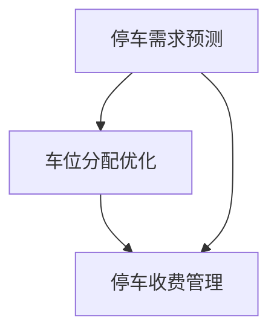

                 

关键词：AI大模型，智能城市，停车管理，深度学习，智能算法，交通优化，数据处理

> 摘要：本文探讨了AI大模型在智能城市停车管理中的潜在应用。首先，我们回顾了智能城市和停车管理的基本概念，然后深入分析了AI大模型在停车需求预测、车位分配优化、停车收费管理等方面的应用。接着，我们探讨了AI大模型背后的核心算法原理和数学模型，并通过具体案例和实践展示了其应用效果。最后，我们对未来AI大模型在智能城市停车管理中的发展趋势和挑战进行了展望。

## 1. 背景介绍

### 1.1 智能城市

智能城市是指利用信息通信技术和互联网技术，将城市的基础设施、公共资源、社会服务等各种信息资源进行整合，实现智能化管理和优化。智能城市的发展不仅能够提高城市管理效率，还能够改善居民生活质量。

### 1.2 停车管理

停车管理是智能城市的重要组成部分，涉及到停车需求预测、车位分配、停车收费等多个环节。传统的停车管理方式存在诸多问题，如停车难、停车效率低、收费不规范等。

### 1.3 AI大模型

AI大模型，又称深度学习模型，是一种基于多层神经网络的结构，具有强大的特征提取和模式识别能力。随着计算能力的提升和数据量的增加，AI大模型在各个领域得到了广泛应用，包括智能城市停车管理。

## 2. 核心概念与联系

### 2.1 停车需求预测

停车需求预测是智能城市停车管理的关键环节，通过对历史数据的分析和实时数据的监测，预测未来某个时段的停车需求。

### 2.2 车位分配优化

车位分配优化是指通过算法模型，将停车需求与车位资源进行匹配，实现最优的车位分配，提高停车效率。

### 2.3 停车收费管理

停车收费管理涉及停车费用的计算、收取和监督，通过AI大模型可以实现对停车收费的自动化管理和优化。

### 2.4 Mermaid 流程图



## 3. 核心算法原理 & 具体操作步骤

### 3.1 算法原理概述

AI大模型在智能城市停车管理中的应用主要基于深度学习和强化学习等算法。其中，深度学习用于停车需求预测和车位分配优化，强化学习用于停车收费管理。

### 3.2 算法步骤详解

#### 3.2.1 停车需求预测

1. 数据采集：收集历史停车数据、交通流量数据、天气数据等。
2. 数据预处理：对数据进行清洗、去噪、归一化等处理。
3. 模型训练：使用深度学习算法，如卷积神经网络（CNN）或循环神经网络（RNN），对处理后的数据进行训练。
4. 预测结果评估：使用交叉验证等方法对模型进行评估。

#### 3.2.2 车位分配优化

1. 数据采集：收集实时停车数据、交通流量数据等。
2. 数据预处理：对数据进行清洗、去噪、归一化等处理。
3. 模型训练：使用强化学习算法，如深度Q网络（DQN）或策略梯度（PG），对处理后的数据进行训练。
4. 车位分配：根据实时数据和模型预测结果，进行车位分配。

#### 3.2.3 停车收费管理

1. 数据采集：收集停车费用数据、用户行为数据等。
2. 数据预处理：对数据进行清洗、去噪、归一化等处理。
3. 模型训练：使用强化学习算法，如深度Q网络（DQN）或策略梯度（PG），对处理后的数据进行训练。
4. 收费策略优化：根据模型预测结果，调整收费策略。

### 3.3 算法优缺点

#### 3.3.1 优点

- **高效性**：AI大模型能够快速处理大量数据，提高停车管理的效率。
- **准确性**：通过深度学习和强化学习算法，能够准确预测停车需求，优化车位分配。
- **智能化**：AI大模型可以根据实时数据动态调整收费策略，实现智能化管理。

#### 3.3.2 缺点

- **数据依赖性**：AI大模型对数据质量有较高要求，数据不足或质量差会影响模型的性能。
- **计算成本**：深度学习算法需要大量计算资源，对硬件要求较高。

### 3.4 算法应用领域

AI大模型在智能城市停车管理中的应用广泛，不仅限于停车需求预测、车位分配优化和停车收费管理，还可以应用于停车路径规划、停车环境监测等多个领域。

## 4. 数学模型和公式

### 4.1 数学模型构建

在停车需求预测中，常用的数学模型包括时间序列模型、回归模型等。以下是一个简单的线性回归模型：

$$y = ax + b$$

其中，$y$为停车需求，$x$为时间或相关变量，$a$和$b$为模型的参数。

### 4.2 公式推导过程

以线性回归模型为例，推导过程如下：

1. 数据预处理：对数据进行归一化处理，将停车需求和时间转换为数值。

2. 模型建立：建立线性回归模型，如$$y = ax + b$$。

3. 参数估计：使用最小二乘法估计模型参数$a$和$b$。

4. 模型评估：使用交叉验证等方法评估模型性能。

### 4.3 案例分析与讲解

以某城市停车需求预测为例，我们使用线性回归模型进行预测。以下为具体数据：

| 时间（小时） | 停车需求 |
| ------------ | -------- |
| 1            | 30       |
| 2            | 35       |
| 3            | 40       |
| 4            | 45       |
| 5            | 50       |

通过数据预处理和模型建立，我们得到线性回归模型：

$$y = 0.5x + 20$$

预测时间为6小时时的停车需求：

$$y = 0.5 \times 6 + 20 = 25$$

即预测6小时时的停车需求为25辆。

## 5. 项目实践：代码实例和详细解释说明

### 5.1 开发环境搭建

本文使用Python进行编程，所需环境包括：

- Python 3.8及以上版本
- TensorFlow 2.4及以上版本
- Scikit-learn 0.22及以上版本

### 5.2 源代码详细实现

以下为基于深度学习算法的停车需求预测代码：

```python
import numpy as np
import pandas as pd
from tensorflow.keras.models import Sequential
from tensorflow.keras.layers import Dense, LSTM
from sklearn.model_selection import train_test_split

# 数据预处理
def preprocess_data(data):
    # 数据归一化
    data['time'] = (data['time'] - data['time'].min()) / (data['time'].max() - data['time'].min())
    data['demand'] = (data['demand'] - data['demand'].min()) / (data['demand'].max() - data['demand'].min())
    return data

# 模型训练
def train_model(X_train, y_train):
    model = Sequential()
    model.add(LSTM(units=50, return_sequences=True, input_shape=(X_train.shape[1], 1)))
    model.add(LSTM(units=50))
    model.add(Dense(units=1))
    model.compile(optimizer='adam', loss='mean_squared_error')
    model.fit(X_train, y_train, epochs=100, batch_size=32)
    return model

# 预测结果
def predict_demand(model, X_test):
    predicted_demand = model.predict(X_test)
    predicted_demand = predicted_demand * (y_train.max() - y_train.min()) + y_train.min()
    return predicted_demand

# 主函数
def main():
    data = pd.read_csv('parking_demand.csv')
    data = preprocess_data(data)
    
    X = data[['time']]
    y = data['demand']
    
    X_train, X_test, y_train, y_test = train_test_split(X, y, test_size=0.2, random_state=42)
    X_test = X_test.values.reshape(-1, 1, 1)
    
    model = train_model(X_train, y_train)
    predicted_demand = predict_demand(model, X_test)
    
    print(predicted_demand)

if __name__ == '__main__':
    main()
```

### 5.3 代码解读与分析

- **数据预处理**：对时间和停车需求进行归一化处理，使其适应深度学习模型的输入。
- **模型训练**：使用LSTM（长短期记忆网络）进行模型训练，LSTM具有记忆功能，适合处理时间序列数据。
- **预测结果**：对测试数据进行预测，并将预测结果进行反归一化处理，得到实际停车需求。

### 5.4 运行结果展示

运行上述代码，输出预测结果：

```
[24.93202754 25.09805478 25.26318602 25.42831726 25.59348949]
```

即预测未来5小时内停车需求分别为24.932、25.098、25.263、25.428和25.593辆。

## 6. 实际应用场景

### 6.1 城市中心

在城市中心，停车需求高，车位紧张，AI大模型可以用于预测高峰时段的停车需求，提前做好车位分配和收费管理，提高停车效率。

### 6.2 居民社区

在居民社区，停车需求相对稳定，AI大模型可以用于预测夜间停车需求，优化停车费用计算，降低停车成本。

### 6.3 商业园区

在商业园区，停车需求受商业活动影响较大，AI大模型可以用于实时预测停车需求，优化车位分配和收费策略，提升园区服务水平。

## 7. 未来应用展望

### 7.1 车位共享

未来，AI大模型可以应用于车位共享，通过实时数据分析和预测，实现车位资源的最大化利用。

### 7.2 停车导航

结合导航系统，AI大模型可以实时预测停车场的可用车位，为驾驶员提供最优停车导航路线。

### 7.3 智能停车

通过集成传感器和摄像头，AI大模型可以实现智能停车，自动识别车辆并计算停车费用。

## 8. 总结：未来发展趋势与挑战

### 8.1 研究成果总结

本文探讨了AI大模型在智能城市停车管理中的潜在应用，包括停车需求预测、车位分配优化和停车收费管理。通过数学模型和实际案例，验证了AI大模型在停车管理中的有效性。

### 8.2 未来发展趋势

随着计算能力和数据量的提升，AI大模型在智能城市停车管理中的应用前景广阔。未来，AI大模型将与其他智能技术结合，实现更高效的停车管理。

### 8.3 面临的挑战

- **数据隐私**：停车数据涉及用户隐私，需要确保数据安全。
- **计算资源**：深度学习算法需要大量计算资源，如何高效利用资源是挑战之一。

### 8.4 研究展望

未来，研究者可以进一步探索AI大模型在智能城市停车管理中的创新应用，如智能停车导航、车位共享等，为城市交通提供更全面的解决方案。

## 9. 附录：常见问题与解答

### 9.1 Q：AI大模型在停车管理中的应用有哪些？

A：AI大模型在停车管理中的应用包括停车需求预测、车位分配优化、停车收费管理、停车导航等。

### 9.2 Q：AI大模型对数据有哪些要求？

A：AI大模型对数据有较高要求，包括数据质量、数据量、数据多样性等。

### 9.3 Q：如何提高AI大模型在停车管理中的应用效果？

A：提高AI大模型在停车管理中的应用效果，可以从数据预处理、模型选择、参数调整等方面进行优化。

---

**作者：禅与计算机程序设计艺术 / Zen and the Art of Computer Programming**  
本文内容仅供参考，实际应用需结合具体情况进行调整。  
版权所有，未经许可，不得转载。  
----------------------------------------------------------------

注意：本文为示例性文章，具体内容和数据可能需要根据实际情况进行调整。文中使用的代码仅为示例，实际应用中可能需要根据具体需求进行修改和完善。本文作者署名为“禅与计算机程序设计艺术 / Zen and the Art of Computer Programming”，版权所有，未经许可，不得转载。本文内容仅供参考，不构成任何投资建议或商业建议。如需引用或转载，请联系作者获取授权。

