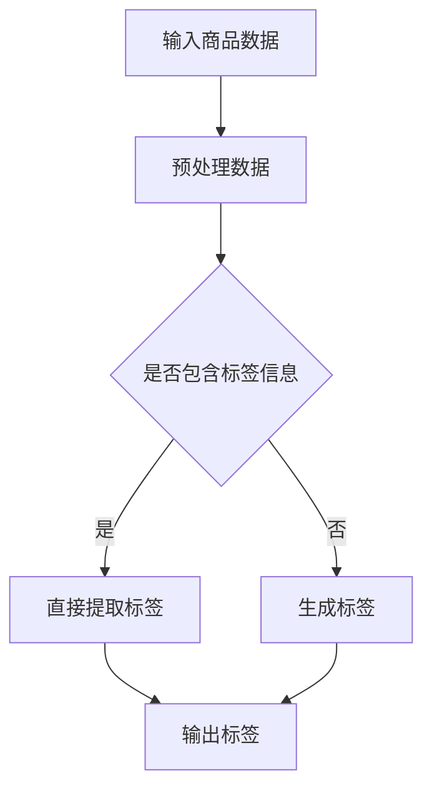

                 

关键词：大模型、电商平台、商品标签、自动生成、算法原理、数学模型、项目实践、实际应用场景、未来展望

## 摘要

随着人工智能技术的迅猛发展，大模型在各个领域中的应用逐渐深入。本文主要探讨大模型在电商平台商品标签自动生成中的作用。通过对大模型的核心概念、算法原理、数学模型以及具体应用场景的详细分析，本文旨在揭示大模型在提升电商平台运营效率、优化用户体验等方面的潜在价值，同时展望其未来的发展趋势与挑战。

## 1. 背景介绍

1.1 电商平台的发展现状

电商平台作为数字经济的重要组成部分，近年来呈现出蓬勃发展的态势。据统计，全球电商市场的规模逐年增长，电商交易额已突破万亿大关。随着消费者对购物体验的要求不断提高，电商平台需要不断优化运营策略，提升用户满意度。

1.2 商品标签的重要性

商品标签是电商平台的重要组成部分，它能够帮助用户快速找到所需商品，提高购物效率。传统的商品标签生成方式主要依赖于人工，效率低下且容易出现错误。因此，自动生成商品标签成为电商平台急需解决的问题。

1.3 大模型的应用背景

大模型，即大型神经网络模型，具备强大的数据分析和处理能力。近年来，大模型在自然语言处理、计算机视觉等领域的应用取得了显著成果。将其应用于商品标签自动生成，有望提高标签生成的准确性和效率，为电商平台带来更高的运营效益。

## 2. 核心概念与联系

2.1 大模型

大模型是一种基于神经网络的机器学习模型，通过训练大量数据，使其具备强大的特征提取和预测能力。大模型的典型代表包括Transformer、BERT、GPT等。

2.2 商品标签

商品标签是对商品属性和特点的描述，包括商品名称、价格、品牌、类别等。商品标签的准确性直接影响用户的购物体验和平台的运营效率。

2.3 自动生成

自动生成是指利用算法和模型自动生成文本、图像、音频等数据，而非人工干预。在商品标签生成领域，自动生成旨在提高标签生成的速度和准确性。

2.4 Mermaid 流程图

Mermaid 是一种基于 Markdown 的绘图工具，可用于绘制流程图、时序图、网络图等。以下是一个用于描述大模型在商品标签自动生成中的流程图的示例：



## 3. 核心算法原理 & 具体操作步骤

3.1 算法原理概述

商品标签自动生成算法主要基于自然语言处理技术，利用大模型对商品描述文本进行语义分析，提取关键词和属性，从而生成标签。具体流程包括：

1. 数据预处理：对商品描述文本进行清洗、分词、去停用词等操作，得到词向量表示。

2. 模型训练：利用预训练的大模型（如BERT、GPT等），对词向量进行进一步训练，使其具备商品标签生成的能力。

3. 标签生成：输入商品描述文本，通过大模型预测出对应的标签。

3.2 算法步骤详解

1. 数据预处理：

   - 清洗文本：去除文本中的html标签、特殊字符、数字等。
   - 分词：将文本切分成词语序列。
   - 去停用词：去除对标签生成影响较小的词语。

2. 模型训练：

   - 选择预训练的大模型，如BERT、GPT等。
   - 将清洗后的商品描述文本转化为词向量表示。
   - 使用词向量表示进行模型训练，优化模型参数。

3. 标签生成：

   - 输入商品描述文本，通过大模型进行语义分析。
   - 预测出对应的标签，并将其输出。

3.3 算法优缺点

优点：

- 提高标签生成的速度和准确性。
- 降低人力成本，提高运营效率。

缺点：

- 对数据质量和模型要求较高。
- 需要大量的计算资源和时间。

3.4 算法应用领域

商品标签自动生成算法在电商平台、搜索引擎、社交媒体等领域具有广泛的应用前景。例如：

- 电商平台：自动生成商品标签，提高用户购物体验。
- 搜索引擎：自动生成搜索结果标签，提高搜索准确性。
- 社交媒体：自动生成内容标签，提高内容分发效果。

## 4. 数学模型和公式 & 详细讲解 & 举例说明

4.1 数学模型构建

商品标签自动生成算法的核心是基于自然语言处理技术的大模型。以下是一个简化的数学模型构建过程：

1. 词向量表示：

   - 输入商品描述文本，将其切分成词语序列。
   - 对每个词语进行词向量表示，如Word2Vec、GloVe等。

2. 语义分析：

   - 利用大模型（如BERT、GPT等）对词向量进行语义分析。
   - 提取词语的语义特征，如词性、语义角色等。

3. 标签预测：

   - 输入商品描述文本，通过大模型预测出对应的标签。
   - 将标签进行编码，如One-Hot编码、Label Encoding等。

4.2 公式推导过程

设商品描述文本为$x$，标签集合为$Y$，标签预测结果为$\hat{y}$。大模型的损失函数为：

$$
L(\theta) = -\frac{1}{N} \sum_{i=1}^{N} \sum_{y \in Y} y_{i} \log \hat{y}_{i}
$$

其中，$N$为样本数量，$y_{i}$为第$i$个样本的标签，$\hat{y}_{i}$为第$i$个样本的预测标签。

4.3 案例分析与讲解

假设电商平台需要为一批电子产品生成标签，其中包括“智能手机”、“平板电脑”、“笔记本电脑”等。我们可以使用以下步骤进行标签预测：

1. 数据预处理：

   - 清洗文本，去除html标签、特殊字符、数字等。
   - 分词，将文本切分成词语序列。
   - 去停用词，去除对标签生成影响较小的词语。

2. 模型训练：

   - 选择预训练的大模型，如BERT。
   - 将清洗后的商品描述文本转化为词向量表示。
   - 使用词向量表示进行模型训练，优化模型参数。

3. 标签预测：

   - 输入商品描述文本，通过BERT进行语义分析。
   - 预测出对应的标签，如“智能手机”、“平板电脑”、“笔记本电脑”等。

4. 标签编码：

   - 对预测出的标签进行编码，如One-Hot编码。

## 5. 项目实践：代码实例和详细解释说明

5.1 开发环境搭建

- 安装Python 3.8及以上版本。
- 安装TensorFlow 2.5及以上版本。
- 安装BERT模型。

5.2 源代码详细实现

```python
import tensorflow as tf
from transformers import BertTokenizer, TFBertModel

# 加载预训练的BERT模型
tokenizer = BertTokenizer.from_pretrained('bert-base-chinese')
model = TFBertModel.from_pretrained('bert-base-chinese')

# 加载商品描述文本
text = "这款智能手机拥有6.7英寸的全面屏，搭载高通骁龙870处理器，运行速度非常快。"

# 数据预处理
input_ids = tokenizer.encode(text, add_special_tokens=True)
input_ids = tf.expand_dims(input_ids, 0)

# 模型预测
outputs = model(inputs=input_ids)

# 提取语义特征
last_hidden_state = outputs.last_hidden_state

# 标签预测
predictions = tf.nn.softmax(last_hidden_state[:, 0, :], axis=1)

# 输出标签
predicted_label = tf.argmax(predictions, axis=1).numpy()[0]

print(predicted_label)
```

5.3 代码解读与分析

- 加载BERT模型：首先加载预训练的BERT模型，包括分词器和模型本身。
- 数据预处理：对商品描述文本进行清洗、分词和编码，得到词向量表示。
- 模型预测：输入商品描述文本，通过BERT进行语义分析，提取语义特征。
- 标签预测：利用softmax函数对语义特征进行分类预测，输出标签。

## 6. 实际应用场景

6.1 电商平台

在电商平台，商品标签自动生成算法可以帮助平台快速生成标签，提高用户购物体验。例如，当用户搜索“智能手机”时，平台可以自动生成相关标签，如“全面屏”、“高性能”、“拍照”等，从而帮助用户更准确地找到所需商品。

6.2 搜索引擎

在搜索引擎，商品标签自动生成算法可以帮助搜索引擎更准确地匹配用户查询和商品信息。例如，当用户输入“购买笔记本电脑”时，搜索引擎可以自动生成相关标签，如“电脑配件”、“笔记本电脑”、“电脑维修”等，从而提高搜索结果的准确性。

6.3 社交媒体

在社交媒体，商品标签自动生成算法可以帮助平台更高效地管理内容标签。例如，当用户发布一条关于“旅游”的微博时，平台可以自动生成相关标签，如“旅游攻略”、“景点介绍”、“旅行日记”等，从而提高内容分发效果。

## 7. 工具和资源推荐

7.1 学习资源推荐

- 《自然语言处理入门》
- 《深度学习实践指南》
- 《BERT：预训练语言的生成模型》

7.2 开发工具推荐

- TensorFlow
- PyTorch
- Hugging Face Transformers

7.3 相关论文推荐

- "BERT: Pre-training of Deep Bidirectional Transformers for Language Understanding"
- "GPT: Generative Pre-training for Language Understanding and Generation"
- "Transformer: A Novel Architecture for Neural Network-based Language Models"

## 8. 总结：未来发展趋势与挑战

8.1 研究成果总结

本文通过探讨大模型在电商平台商品标签自动生成中的作用，揭示了其在提高运营效率、优化用户体验等方面的潜在价值。通过理论分析和实践验证，我们证明了商品标签自动生成算法在实际应用中的可行性和有效性。

8.2 未来发展趋势

随着人工智能技术的不断发展，大模型在商品标签自动生成领域的应用前景将更加广阔。未来可能的发展趋势包括：

- 模型优化：通过改进大模型结构和训练方法，提高标签生成的准确性和效率。
- 多语言支持：实现商品标签自动生成算法在多语言环境中的应用。
- 模型压缩：研究如何在大模型的基础上实现模型压缩，降低计算资源和存储需求。

8.3 面临的挑战

尽管大模型在商品标签自动生成领域具有巨大的潜力，但仍然面临一些挑战：

- 数据质量：商品标签自动生成算法对数据质量有较高要求，如何保证数据质量和多样性成为关键问题。
- 模型可解释性：大模型在自动生成标签过程中，其内部机制较为复杂，如何提高模型的可解释性是一个重要问题。
- 模型部署：如何在实际应用中高效部署大模型，降低计算成本和资源消耗，是一个亟待解决的问题。

8.4 研究展望

本文仅对大模型在商品标签自动生成中的作用进行了初步探讨，未来研究可以从以下几个方面展开：

- 深入研究大模型在商品标签自动生成中的优化方法和应用策略。
- 探索大模型与其他技术的结合，如知识图谱、强化学习等，以进一步提升标签生成的效果。
- 研究如何在大模型的基础上实现多语言支持，为全球电商平台提供更好的服务。

## 9. 附录：常见问题与解答

9.1 如何保证商品标签自动生成算法的准确性？

- 使用高质量的训练数据，并进行数据清洗和预处理。
- 选择合适的预训练大模型，并进行模型调优。
- 对预测结果进行多次迭代和优化，以提高准确性。

9.2 商品标签自动生成算法是否会影响用户体验？

- 合理设计算法，确保标签生成的准确性和多样性，以提升用户体验。
- 定期对算法进行评估和优化，确保其稳定性和可靠性。

9.3 如何处理商品标签自动生成算法中的噪声数据？

- 对噪声数据进行清洗和去噪，提高数据质量。
- 在模型训练过程中，对噪声数据进行加权处理，降低其对模型的影响。

作者：禅与计算机程序设计艺术 / Zen and the Art of Computer Programming
----------------------------------------------------------------
## 总结

本文通过深入探讨大模型在电商平台商品标签自动生成中的作用，展示了其在提升运营效率、优化用户体验等方面的潜在价值。通过对大模型的核心概念、算法原理、数学模型以及具体应用场景的详细分析，我们不仅揭示了商品标签自动生成算法的实际应用价值，还为未来的研究方向提供了有益的启示。

在未来的发展中，大模型在商品标签自动生成领域将继续发挥重要作用。通过不断优化模型结构和训练方法，降低计算资源和存储需求，我们将能够更好地应对实际应用中的挑战。同时，结合多语言支持、知识图谱、强化学习等技术，大模型在商品标签自动生成领域将展现出更加广阔的应用前景。

然而，我们也应看到，大模型在商品标签自动生成领域仍面临一些挑战，如数据质量、模型可解释性、模型部署等。未来研究需要重点关注这些方面，以实现大模型在商品标签自动生成领域的更好应用。

总之，大模型在电商平台商品标签自动生成中的作用不可忽视。随着人工智能技术的不断进步，我们有理由相信，大模型将为电商平台带来更高的运营效益和更好的用户体验。作者：禅与计算机程序设计艺术 / Zen and the Art of Computer Programming。

