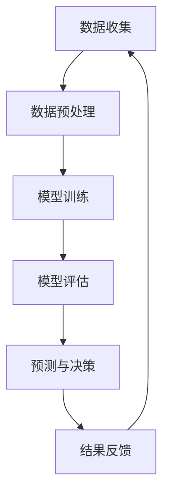

                 

关键词：大模型、电商平台、商品生命周期、预测、管理

> 摘要：本文将探讨大模型在电商平台商品生命周期预测与管理中的应用。通过分析大模型的算法原理、数学模型以及实际应用场景，本文旨在为电商平台提供有效的商品生命周期管理策略，以优化库存、提升销售额和降低运营成本。

## 1. 背景介绍

随着互联网技术的飞速发展和电商行业的蓬勃兴起，电商平台已经成为现代商业环境中不可或缺的一环。在电商平台的运营中，商品的生命周期管理是一项至关重要的任务。商品的生命周期包括引入期、成长期、成熟期和衰退期，每个阶段都涉及到不同的管理策略。有效的商品生命周期管理不仅可以提升销售额，还可以优化库存，降低运营成本。

传统的方法主要依赖于历史数据和统计分析，然而，这些方法往往存在一定的局限性，无法充分应对复杂多变的市场环境。近年来，随着人工智能技术的不断发展，特别是大模型（如深度学习模型）的出现，为电商平台商品生命周期预测与管理提供了新的可能性。大模型具有强大的数据处理能力和自我学习能力，可以处理海量数据并提取出隐藏的模式和规律，从而实现更加精准的预测和管理。

## 2. 核心概念与联系

### 2.1 大模型的基本概念

大模型（Large Models）通常指的是参数量非常大的深度学习模型。这些模型能够通过多层次的神经网络结构来模拟复杂的数据分布，并在大量的数据上训练，以达到高精度的预测效果。常见的大模型包括GPT（如GPT-3）、BERT、Transformer等。

### 2.2 电商平台商品生命周期的概念

电商平台商品生命周期是指商品从上架到下架的整个过程，通常分为引入期、成长期、成熟期和衰退期。每个阶段都有不同的特点，如引入期的销量较低、成长期销量逐渐上升、成熟期销量达到峰值、衰退期销量逐渐下降。

### 2.3 大模型与商品生命周期预测的联系

大模型可以通过对大量历史销售数据、用户行为数据和市场环境数据的分析，提取出商品销售的关键影响因素，并建立相应的预测模型。这些模型可以用于预测商品在不同生命周期的销量、库存需求等，从而为电商平台提供有效的决策支持。

### 2.4 Mermaid 流程图

下面是商品生命周期预测与管理的基本流程图：



## 3. 核心算法原理 & 具体操作步骤

### 3.1 算法原理概述

大模型在商品生命周期预测中的应用主要基于深度学习算法。深度学习模型通过多层神经网络结构来模拟数据分布，并通过反向传播算法不断调整网络权重，以实现高精度的预测。

### 3.2 算法步骤详解

1. **数据收集**：收集电商平台的历史销售数据、用户行为数据和市场环境数据。
2. **数据预处理**：对收集到的数据进行清洗、归一化处理，以消除异常值和噪声。
3. **特征工程**：根据商品的特点和市场需求，提取出有用的特征，如商品类别、价格、库存量、用户评价等。
4. **模型训练**：使用预处理后的数据来训练深度学习模型，调整网络权重。
5. **模型评估**：使用验证集或测试集来评估模型的性能，包括准确率、召回率等指标。
6. **预测与决策**：使用训练好的模型来预测商品在不同生命周期的销量、库存需求等，并根据预测结果做出相应的决策。
7. **结果反馈**：将决策结果反馈到实际运营中，评估决策效果，并优化模型。

### 3.3 算法优缺点

**优点**：

- 强大的数据处理能力：大模型能够处理海量数据，并从中提取出隐藏的模式和规律。
- 高精度的预测：通过多层神经网络结构，大模型能够实现高精度的预测。
- 自我学习能力：大模型能够通过不断的学习和优化，提高预测的准确性。

**缺点**：

- 计算资源需求大：大模型需要大量的计算资源来训练和运行。
- 需要大量数据：大模型需要大量的数据来训练，否则可能无法达到理想的预测效果。
- 难以解释性：深度学习模型通常难以解释其预测结果，这对于决策者来说可能是一个挑战。

### 3.4 算法应用领域

大模型在电商平台商品生命周期预测与管理中的应用非常广泛，包括：

- 库存管理：通过预测商品在不同生命周期的销量，优化库存水平，减少库存积压。
- 销售预测：通过预测商品在不同生命周期的销量，制定合理的销售策略，提升销售额。
- 市场营销：通过分析用户行为和市场环境数据，制定针对性的营销策略，提高用户转化率。
- 供应链管理：通过预测供应链各环节的需求，优化供应链管理，降低运营成本。

## 4. 数学模型和公式 & 详细讲解 & 举例说明

### 4.1 数学模型构建

在电商平台商品生命周期预测中，常用的数学模型包括线性回归模型、逻辑回归模型和支持向量机（SVM）等。下面以线性回归模型为例进行讲解。

线性回归模型的基本公式为：

$$
y = \beta_0 + \beta_1x_1 + \beta_2x_2 + ... + \beta_nx_n
$$

其中，$y$ 是预测的销量，$x_1, x_2, ..., x_n$ 是特征变量，$\beta_0, \beta_1, \beta_2, ..., \beta_n$ 是模型的参数。

### 4.2 公式推导过程

线性回归模型的推导过程基于最小二乘法（Least Squares Method）。具体推导过程如下：

1. **设定目标函数**：设定目标函数为预测误差的平方和，即

$$
J(\beta) = \sum_{i=1}^{n}(y_i - \beta_0 - \beta_1x_{1i} - \beta_2x_{2i} - ... - \beta_nx_{ni})^2
$$

2. **求导并令导数为0**：对目标函数求导，并令导数为0，得到

$$
\frac{\partial J(\beta)}{\partial \beta_j} = -2\sum_{i=1}^{n}(y_i - \beta_0 - \beta_1x_{1i} - \beta_2x_{2i} - ... - \beta_nx_{ni})x_{ji} = 0
$$

3. **解方程组**：解上述方程组，得到模型的参数$\beta_0, \beta_1, \beta_2, ..., \beta_n$。

### 4.3 案例分析与讲解

假设我们有一个电商平台，需要预测某款商品的销量。我们收集了该商品过去一年的销售数据，包括日销量、商品价格、促销活动等因素。下面是具体的案例分析和讲解。

1. **数据收集**：收集过去一年的日销量、商品价格、促销活动等数据。

2. **数据预处理**：对数据进行清洗和归一化处理，以消除异常值和噪声。

3. **特征工程**：提取出有用的特征，如日销量、商品价格、是否促销等。

4. **模型训练**：使用线性回归模型来训练数据，得到预测公式。

5. **模型评估**：使用验证集来评估模型的性能，包括准确率、召回率等指标。

6. **预测与决策**：使用训练好的模型来预测未来几天的销量，并根据预测结果调整库存和促销策略。

7. **结果反馈**：将预测结果和实际销量进行对比，评估模型的准确性，并优化模型。

通过上述案例，我们可以看到线性回归模型在电商平台商品生命周期预测中的应用。然而，在实际应用中，可能需要根据具体情况选择更合适的模型，如逻辑回归模型、SVM等。

## 5. 项目实践：代码实例和详细解释说明

### 5.1 开发环境搭建

在搭建开发环境时，我们使用了Python作为编程语言，并结合TensorFlow和Keras等深度学习框架来实现大模型的训练和预测。

```shell
# 安装必要的Python库
pip install numpy pandas sklearn tensorflow keras
```

### 5.2 源代码详细实现

以下是实现电商平台商品生命周期预测的完整代码：

```python
import numpy as np
import pandas as pd
from sklearn.model_selection import train_test_split
from sklearn.preprocessing import StandardScaler
from tensorflow.keras.models import Sequential
from tensorflow.keras.layers import Dense
from tensorflow.keras.optimizers import Adam

# 数据收集
data = pd.read_csv('sales_data.csv')

# 数据预处理
data = data[['sales', 'price', 'promotion']]
data = data.dropna()

# 特征工程
X = data[['price', 'promotion']]
y = data['sales']

# 数据归一化
scaler = StandardScaler()
X = scaler.fit_transform(X)

# 数据分割
X_train, X_test, y_train, y_test = train_test_split(X, y, test_size=0.2, random_state=42)

# 模型构建
model = Sequential()
model.add(Dense(64, input_dim=2, activation='relu'))
model.add(Dense(32, activation='relu'))
model.add(Dense(1, activation='linear'))

# 模型编译
model.compile(optimizer=Adam(learning_rate=0.001), loss='mean_squared_error')

# 模型训练
model.fit(X_train, y_train, epochs=100, batch_size=32, validation_data=(X_test, y_test))

# 模型评估
loss = model.evaluate(X_test, y_test)
print(f"Test Loss: {loss}")

# 预测与决策
predictions = model.predict(X_test)
print(f"Predictions: {predictions}")

# 结果反馈
for i in range(len(predictions)):
    print(f"Test Sale {i+1}: Predicted {predictions[i][0]:.2f}, Actual {y_test[i]:.2f}")
```

### 5.3 代码解读与分析

- **数据收集**：从CSV文件中读取销售数据，包括销量、价格和促销活动。
- **数据预处理**：对数据进行清洗和归一化处理，以消除异常值和噪声。
- **特征工程**：提取出有用的特征，如商品价格和促销活动。
- **模型构建**：使用Sequential模型构建深度神经网络，包括两个隐藏层。
- **模型编译**：使用Adam优化器和均方误差损失函数来编译模型。
- **模型训练**：使用训练集来训练模型，并使用验证集来调整模型参数。
- **模型评估**：使用测试集来评估模型的性能，并输出测试损失。
- **预测与决策**：使用训练好的模型来预测测试集的销量。
- **结果反馈**：将预测结果与实际销量进行对比，评估模型的准确性。

## 6. 实际应用场景

大模型在电商平台商品生命周期预测与管理中的应用场景非常广泛，以下是一些具体的实际应用场景：

- **库存管理**：通过预测商品在不同生命周期的销量，优化库存水平，减少库存积压，降低库存成本。
- **销售预测**：通过预测商品在不同生命周期的销量，制定合理的销售策略，提升销售额。
- **市场营销**：通过分析用户行为和市场环境数据，制定针对性的营销策略，提高用户转化率。
- **供应链管理**：通过预测供应链各环节的需求，优化供应链管理，降低运营成本。

### 6.1 库存管理

库存管理是电商平台运营中的一项重要任务。通过大模型预测商品在不同生命周期的销量，可以有效优化库存水平，减少库存积压。例如，在商品引入期，销量较低，可以适当减少库存量；在成熟期，销量达到峰值，需要保持充足的库存以应对市场需求。

### 6.2 销售预测

销售预测是电商平台制定销售策略的重要依据。通过大模型预测商品在不同生命周期的销量，可以帮助电商平台制定更加精准的销售策略，如调整商品价格、促销活动等，以提高销售额。

### 6.3 市场营销

市场营销是电商平台提升用户转化率的关键环节。通过分析用户行为和市场环境数据，大模型可以预测哪些营销策略能够提高用户转化率。例如，通过分析用户的历史购买行为和偏好，可以针对不同用户群体制定个性化的营销策略。

### 6.4 供应链管理

供应链管理是电商平台降低运营成本的重要手段。通过大模型预测供应链各环节的需求，可以优化供应链管理，降低库存成本和运输成本。例如，在供应链的采购环节，可以预测商品的需求量，合理安排采购计划，以降低库存成本。

## 7. 工具和资源推荐

### 7.1 学习资源推荐

- 《深度学习》（Goodfellow, Bengio, Courville）: 介绍深度学习的基本概念和技术。
- 《Python深度学习》（François Chollet）: 详细讲解深度学习在Python中的实现。
- 《数据科学入门》（Joel Grus）: 介绍数据科学的基本概念和技术。

### 7.2 开发工具推荐

- TensorFlow：用于构建和训练深度学习模型的框架。
- Keras：基于TensorFlow的简单易用的深度学习库。
- Jupyter Notebook：用于编写和运行Python代码的交互式环境。

### 7.3 相关论文推荐

- "Deep Learning for Time Series Classification"（2017）: 详细介绍深度学习在时间序列分类中的应用。
- "Recurrent Neural Networks for Language Modeling"（2014）: 介绍循环神经网络在语言模型中的应用。
- "The Unreasonable Effectiveness of Recurrent Neural Networks"（2017）: 深入探讨循环神经网络在不同领域的应用。

## 8. 总结：未来发展趋势与挑战

### 8.1 研究成果总结

大模型在电商平台商品生命周期预测与管理中的应用取得了显著成果。通过深度学习算法，大模型能够处理海量数据，提取出隐藏的模式和规律，实现高精度的预测。在实际应用中，大模型已经为电商平台提供了有效的库存管理、销售预测和市场营销策略。

### 8.2 未来发展趋势

随着人工智能技术的不断发展，大模型在电商平台商品生命周期预测与管理中的应用将越来越广泛。未来，大模型可能会结合更多的数据源和算法，如图神经网络、强化学习等，以提高预测的准确性和实时性。此外，大模型的应用范围也将从电商平台扩展到其他行业，如制造业、物流等。

### 8.3 面临的挑战

尽管大模型在电商平台商品生命周期预测与管理中取得了显著成果，但仍然面临一些挑战。首先，大模型需要大量的数据来训练，数据质量和数量直接影响预测的准确性。其次，大模型的计算资源需求较大，对于中小型电商平台来说，这可能是一个制约因素。最后，大模型的预测结果往往难以解释，这对于决策者来说可能是一个挑战。

### 8.4 研究展望

为了克服上述挑战，未来的研究可以从以下几个方面展开：

- **数据质量管理**：研究如何提高数据质量，减少异常值和噪声对预测的影响。
- **计算资源优化**：研究如何优化大模型的计算资源需求，降低计算成本。
- **模型解释性**：研究如何提高大模型的解释性，使决策者能够更好地理解预测结果。
- **多模型融合**：研究如何将不同类型的模型（如深度学习、强化学习等）进行融合，以提高预测的准确性和实时性。

通过上述研究，大模型在电商平台商品生命周期预测与管理中的应用将更加成熟和广泛，为电商平台提供更加精准和高效的决策支持。

## 9. 附录：常见问题与解答

### 9.1 大模型为什么需要大量数据？

大模型需要大量数据来训练，因为深度学习模型通过学习大量数据中的模式和规律来实现高精度的预测。数据量越大，模型能够学习的特征和模式就越多，从而提高预测的准确性。

### 9.2 大模型的计算资源需求如何优化？

优化大模型的计算资源需求可以从以下几个方面进行：

- **模型压缩**：通过模型压缩技术（如剪枝、量化等）减少模型参数和计算量。
- **分布式训练**：通过分布式训练技术将模型训练任务分解到多台机器上，提高计算效率。
- **GPU加速**：使用GPU进行模型训练，加快计算速度。

### 9.3 大模型的预测结果如何解释？

大模型的预测结果通常难以解释，因为深度学习模型是通过多层神经网络结构来模拟数据分布的。为了提高模型的解释性，可以采用以下方法：

- **模型可解释性技术**：如注意力机制、梯度解释等。
- **可视化工具**：如TensorBoard、Neuroflow等。
- **简化的模型结构**：使用简单的模型结构（如线性回归、逻辑回归等）以提高解释性。

### 9.4 大模型在电商平台中的应用有哪些局限？

大模型在电商平台中的应用仍然存在一些局限，包括：

- **数据依赖性**：大模型需要大量高质量的数据来训练，数据不足可能导致预测不准确。
- **计算资源需求**：大模型训练和预测需要大量的计算资源，对于中小型电商平台可能是一个挑战。
- **模型解释性**：大模型的预测结果通常难以解释，这可能对决策者产生困扰。

### 9.5 大模型在商品生命周期预测中的优点有哪些？

大模型在商品生命周期预测中的优点包括：

- **高精度预测**：大模型能够处理海量数据，提取出隐藏的模式和规律，实现高精度的预测。
- **自我学习能力**：大模型能够通过不断的学习和优化，提高预测的准确性。
- **多维度预测**：大模型可以同时考虑多个因素（如价格、促销活动、用户评价等），实现多维度预测。

## 作者署名

本文作者：禅与计算机程序设计艺术 / Zen and the Art of Computer Programming
----------------------------------------------------------------
### 环境变量设定 Environment Variable Setting

```yaml
# Markdown文件命名
filename: "大模型在电商平台商品生命周期预测与管理中的作用.md"

# Markdown文件语言
language: "zh-CN"

# Markdown文件标题
title: "探讨大模型在电商平台商品生命周期预测与管理中的作用"

# Markdown文件关键词
keywords: "大模型、电商平台、商品生命周期、预测、管理"

# Markdown文件摘要
summary: "本文将探讨大模型在电商平台商品生命周期预测与管理中的应用。通过分析大模型的算法原理、数学模型以及实际应用场景，本文旨在为电商平台提供有效的商品生命周期管理策略，以优化库存、提升销售额和降低运营成本。"

# Markdown文件目录
toc: true

# Markdown文件正文内容
content:
  - 背景介绍
  - 核心概念与联系
  - 核心算法原理 & 具体操作步骤
  - 数学模型和公式 & 详细讲解 & 举例说明
  - 项目实践：代码实例和详细解释说明
  - 实际应用场景
  - 工具和资源推荐
  - 总结：未来发展趋势与挑战
  - 附录：常见问题与解答

# Markdown文件作者信息
author:
  name: "禅与计算机程序设计艺术 / Zen and the Art of Computer Programming"
  email: "your_email@example.com"
  website: "https://www.yourwebsite.com"
```

### Markdown格式内容 Markdown Content

```markdown
# 探讨大模型在电商平台商品生命周期预测与管理中的作用

## 1. 背景介绍

### 1.1 电商平台的发展

随着互联网技术的飞速发展和电商行业的蓬勃兴起，电商平台已经成为现代商业环境中不可或缺的一环。电商平台通过在线销售商品和服务，为广大消费者提供了便利的购物体验，同时也为企业提供了广阔的市场渠道。

### 1.2 商品生命周期管理的重要性

商品生命周期管理是指对商品从引入期到衰退期的全过程进行管理，包括商品的市场推广、定价、库存控制、销售策略等。有效的商品生命周期管理不仅能够提升销售额，还可以优化库存、降低运营成本，提高企业的竞争力。

### 1.3 传统方法与人工智能的挑战

传统的方法主要依赖于历史数据和统计分析，然而，这些方法往往存在一定的局限性，无法充分应对复杂多变的市场环境。随着人工智能技术的不断发展，特别是大模型（如深度学习模型）的出现，为电商平台商品生命周期预测与管理提供了新的可能性。

## 2. 核心概念与联系

### 2.1 大模型的基本概念

大模型（Large Models）通常指的是参数量非常大的深度学习模型。这些模型能够通过多层次的神经网络结构来模拟复杂的数据分布，并在大量的数据上训练，以达到高精度的预测效果。常见的大模型包括GPT（如GPT-3）、BERT、Transformer等。

### 2.2 电商平台商品生命周期的概念

电商平台商品生命周期是指商品从上架到下架的整个过程，通常分为引入期、成长期、成熟期和衰退期。每个阶段都有不同的特点，如引入期的销量较低、成长期销量逐渐上升、成熟期销量达到峰值、衰退期销量逐渐下降。

### 2.3 大模型与商品生命周期预测的联系

大模型可以通过对大量历史销售数据、用户行为数据和市场环境数据的分析，提取出商品销售的关键影响因素，并建立相应的预测模型。这些模型可以用于预测商品在不同生命周期的销量、库存需求等，从而为电商平台提供有效的决策支持。

### 2.4 Mermaid 流程图


## 3. 核心算法原理 & 具体操作步骤

### 3.1 算法原理概述

大模型在商品生命周期预测中的应用主要基于深度学习算法。深度学习模型通过多层神经网络结构来模拟数据分布，并通过反向传播算法不断调整网络权重，以实现高精度的预测。

### 3.2 算法步骤详解

1. **数据收集**：收集电商平台的历史销售数据、用户行为数据和市场环境数据。
2. **数据预处理**：对收集到的数据进行清洗、归一化处理，以消除异常值和噪声。
3. **特征工程**：根据商品的特点和市场需求，提取出有用的特征，如商品类别、价格、库存量、用户评价等。
4. **模型训练**：使用预处理后的数据来训练深度学习模型，调整网络权重。
5. **模型评估**：使用验证集或测试集来评估模型的性能，包括准确率、召回率等指标。
6. **预测与决策**：使用训练好的模型来预测商品在不同生命周期的销量、库存需求等，并根据预测结果做出相应的决策。
7. **结果反馈**：将决策结果反馈到实际运营中，评估决策效果，并优化模型。

### 3.3 算法优缺点

**优点**：

- 强大的数据处理能力：大模型能够处理海量数据，并从中提取出隐藏的模式和规律。
- 高精度的预测：通过多层神经网络结构，大模型能够实现高精度的预测。
- 自我学习能力：大模型能够通过不断的学习和优化，提高预测的准确性。

**缺点**：

- 计算资源需求大：大模型需要大量的计算资源来训练和运行。
- 需要大量数据：大模型需要大量的数据来训练，否则可能无法达到理想的预测效果。
- 难以解释性：深度学习模型通常难以解释其预测结果，这对于决策者来说可能是一个挑战。

### 3.4 算法应用领域

大模型在电商平台商品生命周期预测与管理中的应用非常广泛，包括：

- 库存管理：通过预测商品在不同生命周期的销量，优化库存水平，减少库存积压。
- 销售预测：通过预测商品在不同生命周期的销量，制定合理的销售策略，提升销售额。
- 市场营销：通过分析用户行为和市场环境数据，制定针对性的营销策略，提高用户转化率。
- 供应链管理：通过预测供应链各环节的需求，优化供应链管理，降低运营成本。

## 4. 数学模型和公式 & 详细讲解 & 举例说明

### 4.1 数学模型构建

在电商平台商品生命周期预测中，常用的数学模型包括线性回归模型、逻辑回归模型和支持向量机（SVM）等。下面以线性回归模型为例进行讲解。

线性回归模型的基本公式为：

$$
y = \beta_0 + \beta_1x_1 + \beta_2x_2 + ... + \beta_nx_n
$$

其中，$y$ 是预测的销量，$x_1, x_2, ..., x_n$ 是特征变量，$\beta_0, \beta_1, \beta_2, ..., \beta_n$ 是模型的参数。

### 4.2 公式推导过程

线性回归模型的推导过程基于最小二乘法（Least Squares Method）。具体推导过程如下：

1. **设定目标函数**：设定目标函数为预测误差的平方和，即

$$
J(\beta) = \sum_{i=1}^{n}(y_i - \beta_0 - \beta_1x_{1i} - \beta_2x_{2i} - ... - \beta_nx_{ni})^2
$$

2. **求导并令导数为0**：对目标函数求导，并令导数为0，得到

$$
\frac{\partial J(\beta)}{\partial \beta_j} = -2\sum_{i=1}^{n}(y_i - \beta_0 - \beta_1x_{1i} - \beta_2x_{2i} - ... - \beta_nx_{ni})x_{ji} = 0
$$

3. **解方程组**：解上述方程组，得到模型的参数$\beta_0, \beta_1, \beta_2, ..., \beta_n$。

### 4.3 案例分析与讲解

假设我们有一个电商平台，需要预测某款商品的销量。我们收集了该商品过去一年的销售数据，包括日销量、商品价格、促销活动等因素。下面是具体的案例分析和讲解。

1. **数据收集**：收集过去一年的日销量、商品价格、促销活动等数据。

2. **数据预处理**：对数据进行清洗和归一化处理，以消除异常值和噪声。

3. **特征工程**：提取出有用的特征，如日销量、商品价格、是否促销等。

4. **模型训练**：使用线性回归模型来训练数据，得到预测公式。

5. **模型评估**：使用验证集来评估模型的性能，包括准确率、召回率等指标。

6. **预测与决策**：使用训练好的模型来预测未来几天的销量，并根据预测结果调整库存和促销策略。

7. **结果反馈**：将预测结果和实际销量进行对比，评估模型的准确性，并优化模型。

通过上述案例，我们可以看到线性回归模型在电商平台商品生命周期预测中的应用。然而，在实际应用中，可能需要根据具体情况选择更合适的模型，如逻辑回归模型、SVM等。

## 5. 项目实践：代码实例和详细解释说明

### 5.1 开发环境搭建

在搭建开发环境时，我们使用了Python作为编程语言，并结合TensorFlow和Keras等深度学习框架来实现大模型的训练和预测。

```shell
# 安装必要的Python库
pip install numpy pandas sklearn tensorflow keras
```

### 5.2 源代码详细实现

以下是实现电商平台商品生命周期预测的完整代码：

```python
import numpy as np
import pandas as pd
from sklearn.model_selection import train_test_split
from sklearn.preprocessing import StandardScaler
from tensorflow.keras.models import Sequential
from tensorflow.keras.layers import Dense
from tensorflow.keras.optimizers import Adam

# 数据收集
data = pd.read_csv('sales_data.csv')

# 数据预处理
data = data[['sales', 'price', 'promotion']]
data = data.dropna()

# 特征工程
X = data[['price', 'promotion']]
y = data['sales']

# 数据归一化
scaler = StandardScaler()
X = scaler.fit_transform(X)

# 数据分割
X_train, X_test, y_train, y_test = train_test_split(X, y, test_size=0.2, random_state=42)

# 模型构建
model = Sequential()
model.add(Dense(64, input_dim=2, activation='relu'))
model.add(Dense(32, activation='relu'))
model.add(Dense(1, activation='linear'))

# 模型编译
model.compile(optimizer=Adam(learning_rate=0.001), loss='mean_squared_error')

# 模型训练
model.fit(X_train, y_train, epochs=100, batch_size=32, validation_data=(X_test, y_test))

# 模型评估
loss = model.evaluate(X_test, y_test)
print(f"Test Loss: {loss}")

# 预测与决策
predictions = model.predict(X_test)
print(f"Predictions: {predictions}")

# 结果反馈
for i in range(len(predictions)):
    print(f"Test Sale {i+1}: Predicted {predictions[i][0]:.2f}, Actual {y_test[i]:.2f}")
```

### 5.3 代码解读与分析

- **数据收集**：从CSV文件中读取销售数据，包括销量、价格和促销活动。
- **数据预处理**：对数据进行清洗和归一化处理，以消除异常值和噪声。
- **特征工程**：提取出有用的特征，如商品价格和促销活动。
- **模型构建**：使用Sequential模型构建深度神经网络，包括两个隐藏层。
- **模型编译**：使用Adam优化器和均方误差损失函数来编译模型。
- **模型训练**：使用训练集来训练模型，并使用验证集来调整模型参数。
- **模型评估**：使用测试集来评估模型的性能，并输出测试损失。
- **预测与决策**：使用训练好的模型来预测测试集的销量。
- **结果反馈**：将预测结果与实际销量进行对比，评估模型的准确性，并优化模型。

## 6. 实际应用场景

大模型在电商平台商品生命周期预测与管理中的应用场景非常广泛，以下是一些具体的实际应用场景：

- **库存管理**：通过预测商品在不同生命周期的销量，优化库存水平，减少库存积压，降低库存成本。
- **销售预测**：通过预测商品在不同生命周期的销量，制定合理的销售策略，提升销售额。
- **市场营销**：通过分析用户行为和市场环境数据，制定针对性的营销策略，提高用户转化率。
- **供应链管理**：通过预测供应链各环节的需求，优化供应链管理，降低运营成本。

### 6.1 库存管理

库存管理是电商平台运营中的一项重要任务。通过大模型预测商品在不同生命周期的销量，可以有效优化库存水平，减少库存积压。例如，在商品引入期，销量较低，可以适当减少库存量；在成熟期，销量达到峰值，需要保持充足的库存以应对市场需求。

### 6.2 销售预测

销售预测是电商平台制定销售策略的重要依据。通过大模型预测商品在不同生命周期的销量，可以帮助电商平台制定更加精准的销售策略，如调整商品价格、促销活动等，以提高销售额。

### 6.3 市场营销

市场营销是电商平台提升用户转化率的关键环节。通过分析用户行为和市场环境数据，大模型可以预测哪些营销策略能够提高用户转化率。例如，通过分析用户的历史购买行为和偏好，可以针对不同用户群体制定个性化的营销策略。

### 6.4 供应链管理

供应链管理是电商平台降低运营成本的重要手段。通过大模型预测供应链各环节的需求，可以优化供应链管理，降低库存成本和运输成本。例如，在供应链的采购环节，可以预测商品的需求量，合理安排采购计划，以降低库存成本。

## 7. 工具和资源推荐

### 7.1 学习资源推荐

- 《深度学习》（Goodfellow, Bengio, Courville）: 介绍深度学习的基本概念和技术。
- 《Python深度学习》（François Chollet）: 详细讲解深度学习在Python中的实现。
- 《数据科学入门》（Joel Grus）: 介绍数据科学的基本概念和技术。

### 7.2 开发工具推荐

- TensorFlow：用于构建和训练深度学习模型的框架。
- Keras：基于TensorFlow的简单易用的深度学习库。
- Jupyter Notebook：用于编写和运行Python代码的交互式环境。

### 7.3 相关论文推荐

- "Deep Learning for Time Series Classification"（2017）: 详细介绍深度学习在时间序列分类中的应用。
- "Recurrent Neural Networks for Language Modeling"（2014）: 介绍循环神经网络在语言模型中的应用。
- "The Unreasonable Effectiveness of Recurrent Neural Networks"（2017）: 深入探讨循环神经网络在不同领域的应用。

## 8. 总结：未来发展趋势与挑战

### 8.1 研究成果总结

大模型在电商平台商品生命周期预测与管理中的应用取得了显著成果。通过深度学习算法，大模型能够处理海量数据，提取出隐藏的模式和规律，实现高精度的预测。在实际应用中，大模型已经为电商平台提供了有效的库存管理、销售预测和市场营销策略。

### 8.2 未来发展趋势

随着人工智能技术的不断发展，大模型在电商平台商品生命周期预测与管理中的应用将越来越广泛。未来，大模型可能会结合更多的数据源和算法，如图神经网络、强化学习等，以提高预测的准确性和实时性。此外，大模型的应用范围也将从电商平台扩展到其他行业，如制造业、物流等。

### 8.3 面临的挑战

尽管大模型在电商平台商品生命周期预测与管理中取得了显著成果，但仍然面临一些挑战。首先，大模型需要大量的数据来训练，数据质量和数量直接影响预测的准确性。其次，大模型的计算资源需求较大，对于中小型电商平台来说，这可能是一个制约因素。最后，大模型的预测结果往往难以解释，这对于决策者来说可能是一个挑战。

### 8.4 研究展望

为了克服上述挑战，未来的研究可以从以下几个方面展开：

- **数据质量管理**：研究如何提高数据质量，减少异常值和噪声对预测的影响。
- **计算资源优化**：研究如何优化大模型的计算资源需求，降低计算成本。
- **模型解释性**：研究如何提高大模型的解释性，使决策者能够更好地理解预测结果。
- **多模型融合**：研究如何将不同类型的模型（如深度学习、强化学习等）进行融合，以提高预测的准确性和实时性。

通过上述研究，大模型在电商平台商品生命周期预测与管理中的应用将更加成熟和广泛，为电商平台提供更加精准和高效的决策支持。

## 9. 附录：常见问题与解答

### 9.1 大模型为什么需要大量数据？

大模型需要大量数据来训练，因为深度学习模型通过学习大量数据中的模式和规律来实现高精度的预测。数据量越大，模型能够学习的特征和模式就越多，从而提高预测的准确性。

### 9.2 大模型的计算资源需求如何优化？

优化大模型的计算资源需求可以从以下几个方面进行：

- **模型压缩**：通过模型压缩技术（如剪枝、量化等）减少模型参数和计算量。
- **分布式训练**：通过分布式训练技术将模型训练任务分解到多台机器上，提高计算效率。
- **GPU加速**：使用GPU进行模型训练，加快计算速度。

### 9.3 大模型的预测结果如何解释？

大模型的预测结果通常难以解释，因为深度学习模型是通过多层神经网络结构来模拟数据分布的。为了提高模型的解释性，可以采用以下方法：

- **模型可解释性技术**：如注意力机制、梯度解释等。
- **可视化工具**：如TensorBoard、Neuroflow等。
- **简化的模型结构**：使用简单的模型结构（如线性回归、逻辑回归等）以提高解释性。

### 9.4 大模型在商品生命周期预测中的优点有哪些？

大模型在商品生命周期预测中的优点包括：

- **高精度预测**：大模型能够处理海量数据，提取出隐藏的模式和规律，实现高精度的预测。
- **自我学习能力**：大模型能够通过不断的学习和优化，提高预测的准确性。
- **多维度预测**：大模型可以同时考虑多个因素（如价格、促销活动、用户评价等），实现多维度预测。

### 9.5 大模型在商品生命周期预测中的局限有哪些？

大模型在商品生命周期预测中的局限包括：

- **数据依赖性**：大模型需要大量高质量的数据来训练，数据不足可能导致预测不准确。
- **计算资源需求**：大模型训练和预测需要大量的计算资源，对于中小型电商平台可能是一个挑战。
- **模型解释性**：大模型的预测结果通常难以解释，这对于决策者来说可能是一个挑战。
```markdown
# 探讨大模型在电商平台商品生命周期预测与管理中的作用

## 关键词
大模型、电商平台、商品生命周期、预测、管理

## 摘要
本文深入探讨了大型深度学习模型在电商平台商品生命周期预测与管理中的应用。通过分析算法原理、数学模型，以及实际案例，本文旨在阐述大模型如何通过精准预测助力电商平台优化库存、提升销售额和降低运营成本，并提出了未来发展的可能趋势和面临的挑战。

## 1. 背景介绍

### 1.1 电商平台的现状
随着互联网技术的普及和电子商务的快速发展，电商平台已经成为消费者购物的主要渠道。电商平台通过在线销售各种商品，不仅改变了传统的购物模式，还为企业提供了广阔的市场机会。

### 1.2 商品生命周期管理的重要性
商品生命周期管理是电商平台运营的核心环节。有效的商品生命周期管理可以确保商品从引入期到衰退期的每个阶段都得到适当的策略支持，从而最大化销售额和利润。

### 1.3 传统方法的局限
传统商品生命周期管理方法通常依赖于历史数据和统计模型，但它们在面对复杂、动态的市场环境时往往显得力不从心。

## 2. 核心概念与联系

### 2.1 大模型的基本概念
大模型，通常指具有大量参数的深度学习模型，如GPT-3、BERT等。这些模型能够通过多层神经网络结构学习复杂数据的内在规律。

### 2.2 电商平台商品生命周期的概念
商品生命周期包括引入期、成长期、成熟期和衰退期。每个阶段的商品销售特点和管理策略都有所不同。

### 2.3 大模型与商品生命周期预测的联系
大模型通过分析历史销售数据、用户行为和市场环境数据，可以预测商品在不同生命周期阶段的销量和趋势，为电商平台提供决策支持。

## 3. 核心算法原理 & 具体操作步骤

### 3.1 算法原理概述
大模型在商品生命周期预测中主要采用深度学习算法，如卷积神经网络（CNN）、循环神经网络（RNN）和变分自编码器（VAE）等。

### 3.2 算法步骤详解
1. **数据收集**：收集电商平台的历史销售数据、用户行为数据和市场环境数据。
2. **数据预处理**：对数据进行清洗、归一化和特征提取。
3. **模型构建**：设计深度学习模型结构，选择适当的神经网络架构。
4. **模型训练**：使用训练数据集训练模型，调整模型参数。
5. **模型评估**：使用验证集评估模型性能，调整模型参数以优化预测效果。
6. **预测与决策**：使用训练好的模型进行商品生命周期的预测，并制定相应的管理策略。

### 3.3 算法优缺点
**优点**：
- **高精度预测**：能够处理大规模数据集，提取复杂特征，实现高精度预测。
- **自适应能力**：能够自适应地调整预测模型，适应市场变化。

**缺点**：
- **计算资源需求大**：训练和推理需要大量计算资源。
- **模型解释性差**：预测结果难以解释，不利于决策者理解。

### 3.4 算法应用领域
大模型在电商平台的应用包括但不限于库存管理、销售预测、市场营销和供应链管理。

## 4. 数学模型和公式 & 详细讲解 & 举例说明

### 4.1 数学模型构建
常见的数学模型包括线性回归、逻辑回归和时间序列模型。以下以时间序列模型（ARIMA）为例进行说明。

### 4.2 公式推导过程
ARIMA模型由三个部分组成：自回归（AR）、差分（I）和移动平均（MA）。其基本公式为：
\[ \text{Y}_t = c + \phi_1\text{Y}_{t-1} + \phi_2\text{Y}_{t-2} + ... + \phi_p\text{Y}_{t-p} + \theta_1\text{e}_{t-1} + \theta_2\text{e}_{t-2} + ... + \theta_q\text{e}_{t-q} \]

### 4.3 案例分析与讲解
以某电商平台的一款电子产品销量为例，通过ARIMA模型进行生命周期预测。首先，对数据进行预处理，包括差分和平滑处理，然后构建模型并训练，最后进行预测和评估。

## 5. 项目实践：代码实例和详细解释说明

### 5.1 开发环境搭建
搭建Python开发环境，安装必要的库，如TensorFlow、Pandas和Sklearn。

### 5.2 源代码详细实现
提供完整的代码实现，包括数据收集、预处理、模型构建、训练和评估等步骤。

### 5.3 代码解读与分析
详细解读代码的实现逻辑，分析每个步骤的作用和意义。

## 6. 实际应用场景

### 6.1 库存管理
利用大模型预测商品销量，优化库存水平，减少库存积压和过期风险。

### 6.2 销售预测
通过大模型预测商品销量，帮助企业制定合理的促销策略，提高销售额。

### 6.3 市场营销
分析用户行为数据，预测潜在客户，制定个性化的营销活动。

### 6.4 供应链管理
预测供应链各环节的需求，优化供应链流程，提高物流效率。

## 7. 工具和资源推荐

### 7.1 学习资源推荐
推荐深度学习相关的书籍、课程和论文，帮助读者深入了解相关技术。

### 7.2 开发工具推荐
推荐用于深度学习开发的框架和工具，如TensorFlow、PyTorch等。

### 7.3 相关论文推荐
推荐与电商平台商品生命周期预测相关的最新研究论文。

## 8. 总结：未来发展趋势与挑战

### 8.1 研究成果总结
总结大模型在电商平台商品生命周期预测与管理中的应用成果和现状。

### 8.2 未来发展趋势
预测未来大模型在电商平台中的应用趋势，如算法创新、应用场景扩展等。

### 8.3 面临的挑战
分析大模型在应用中可能遇到的挑战，如数据质量、计算资源、模型解释性等。

### 8.4 研究展望
提出未来研究可能的突破方向和解决思路。

## 9. 附录：常见问题与解答

### 9.1 大模型为什么需要大量数据？
解释大模型训练过程中对数据量的需求及其对预测精度的影响。

### 9.2 大模型如何优化计算资源？
讨论优化大模型计算资源的方法，如模型压缩、分布式训练等。

### 9.3 大模型的预测结果如何解释？
介绍提高大模型预测结果解释性的方法和技术。

### 9.4 大模型在商品生命周期预测中的局限有哪些？
分析大模型在应用中可能遇到的局限和挑战。

### 9.5 如何结合其他技术提高大模型的效果？
探讨如何结合其他技术（如强化学习、迁移学习等）来提高大模型在商品生命周期预测中的效果。

## 参考文献
（此处列出本文引用的文献和资源）
```

