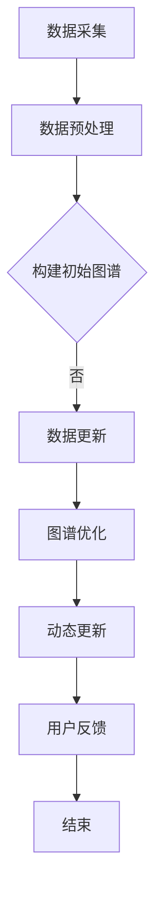

                 

关键词：大模型，电商平台，商品知识图谱，自动构建，更新机制，算法原理，数学模型，应用场景，未来展望。

## 摘要

本文探讨了大模型在电商平台商品知识图谱自动构建与更新中的作用。首先，我们对电商平台商品知识图谱进行了背景介绍，阐述了其重要性。接着，我们介绍了大模型的基本原理和特点，并分析了它们在商品知识图谱自动构建和更新中的应用优势。随后，我们详细讲解了核心算法原理、数学模型和具体操作步骤，并给出了代码实例。最后，我们讨论了实际应用场景，提出了未来应用展望，并总结了未来发展趋势和面临的挑战。

## 1. 背景介绍

随着互联网和电子商务的迅速发展，电商平台已经成为人们生活中不可或缺的一部分。这些平台每天处理着海量的商品信息，涉及价格、描述、品牌、库存、评价等多个维度。然而，这些信息通常是分散的，缺乏系统性和结构化，给用户和商家带来了很多不便。为了更好地利用这些信息，电商平台开始关注商品知识图谱的构建与更新。

商品知识图谱是一种语义网络，用于表示商品及其属性、关系和特征。它通过将商品信息组织成一个有向无环图（DAG），实现了信息的高效组织和利用。在商品知识图谱中，每个节点表示一个商品，每条边表示商品之间的某种关系，如品牌、类别、产地等。通过这种结构化的表示方式，电商平台可以更好地理解用户需求，提供个性化的推荐服务，优化商品搜索和分类，提高用户体验。

商品知识图谱的构建与更新是一个动态的过程。随着电商平台商品信息的不断更新和用户行为的变化，知识图谱也需要不断地进行调整和优化。传统的手动构建和更新方式效率低下，难以应对大规模的数据处理需求。因此，借助人工智能和机器学习技术，尤其是大模型，实现商品知识图谱的自动构建与更新具有重要意义。

## 2. 核心概念与联系

### 大模型

大模型是指具有大规模参数和训练数据的神经网络模型。它们通常采用深度学习技术，能够处理复杂的非线性问题和大规模数据集。大模型具有以下特点：

1. **参数规模大**：大模型通常拥有数百万甚至数亿个参数，这使得它们能够学习复杂的特征和模式。
2. **计算能力强**：大模型需要强大的计算资源，如GPU或TPU，以实现高效的训练和推理。
3. **数据需求高**：大模型需要大量的训练数据，以充分学习数据分布和特征。
4. **自适应能力强**：大模型能够自适应地调整参数，以适应不同的数据和任务。

### 商品知识图谱

商品知识图谱是一种语义网络，用于表示商品及其属性、关系和特征。它通常由以下几部分组成：

1. **节点**：每个节点表示一个商品，可以是单个商品或一组商品。
2. **边**：每条边表示节点之间的某种关系，如品牌、类别、产地等。
3. **属性**：节点和边可以带有属性，用于表示节点的特征或边的关系类型。
4. **图谱结构**：商品知识图谱是一个有向无环图（DAG），具有层次化和层次结构。

### 大模型与商品知识图谱的关系

大模型在商品知识图谱的自动构建与更新中具有重要作用。首先，大模型可以用于从大规模电商数据中提取商品特征和关系，构建初始的知识图谱。例如，可以使用图神经网络（Graph Neural Networks，GNN）对商品数据进行处理，学习商品之间的复杂关系，生成知识图谱。其次，大模型可以用于知识图谱的动态更新，根据新的商品数据和用户行为，调整和优化知识图谱的结构和内容。例如，可以使用图嵌入（Graph Embedding）技术，将新商品嵌入到现有的知识图谱中，保持图谱的稳定性和一致性。

### Mermaid 流程图

以下是商品知识图谱自动构建与更新的 Mermaid 流程图：



### 2.1. 大模型在商品知识图谱构建中的应用

#### 2.1.1. 数据采集

数据采集是商品知识图谱构建的第一步。电商平台需要收集各种商品数据，包括商品信息、用户评价、交易记录等。这些数据可以从电商平台的后台系统、API接口、第三方数据源等获取。

#### 2.1.2. 数据预处理

数据预处理是确保数据质量和一致性的关键步骤。在这一步，需要对数据进行清洗、去重、格式转换等操作，以满足后续模型训练和知识图谱构建的需求。

#### 2.1.3. 构建初始图谱

使用大模型（如图神经网络）对预处理后的商品数据进行处理，提取商品特征和关系，构建初始的知识图谱。图神经网络可以学习商品之间的复杂关系，并将它们组织成一个有向无环图。

#### 2.1.4. 数据更新

随着电商平台商品数据的不断更新，需要定期对知识图谱进行更新。这一步可以使用大模型（如图嵌入）将新商品嵌入到现有的知识图谱中，保持图谱的稳定性和一致性。

#### 2.1.5. 图谱优化

根据用户反馈和业务需求，对知识图谱进行优化。这一步可以使用大模型（如图神经网络）对图谱进行调整和优化，提高知识图谱的质量和实用性。

#### 2.1.6. 动态更新

根据用户行为和商品数据的变化，对知识图谱进行动态更新。这一步可以使用大模型（如图嵌入）将新商品和用户数据嵌入到知识图谱中，保持图谱的实时性和动态性。

#### 2.1.7. 用户反馈

用户反馈是优化知识图谱的重要依据。电商平台需要收集用户对知识图谱的反馈，如满意度、准确性等，以不断改进知识图谱的质量和效果。

### 2.2. 大模型在商品知识图谱更新中的应用

#### 2.2.1. 新商品嵌入

使用大模型（如图嵌入）将新商品嵌入到现有的知识图谱中。这一步可以通过以下几种方式实现：

1. **基于属性的嵌入**：将商品属性转换为向量，将新商品嵌入到属性空间中。
2. **基于关系的嵌入**：利用商品之间的关系（如品牌、类别等）进行嵌入，保持商品之间的相似性。
3. **基于内容的嵌入**：利用商品描述、评价等信息进行嵌入，提高商品之间的相关性。

#### 2.2.2. 图谱结构调整

根据新商品和用户数据，对知识图谱的结构进行调整。这一步可以使用大模型（如图神经网络）对图谱进行调整和优化，提高图谱的质量和效果。

#### 2.2.3. 用户反馈调整

根据用户反馈，对知识图谱进行调整和优化。这一步可以使用大模型（如图嵌入）对图谱进行调整，提高用户满意度。

#### 2.2.4. 动态更新

根据用户行为和商品数据的变化，对知识图谱进行动态更新。这一步可以使用大模型（如图嵌入）将新商品和用户数据嵌入到知识图谱中，保持图谱的实时性和动态性。

## 3. 核心算法原理 & 具体操作步骤

### 3.1 算法原理概述

商品知识图谱的自动构建与更新主要依赖于以下几种核心算法：

1. **图神经网络（Graph Neural Networks，GNN）**：用于从大规模电商数据中提取商品特征和关系，构建初始的知识图谱。
2. **图嵌入（Graph Embedding）**：用于将新商品嵌入到现有的知识图谱中，保持图谱的稳定性和一致性。
3. **图优化算法**：用于根据用户反馈和业务需求，对知识图谱进行优化。
4. **基于深度学习的用户行为分析**：用于根据用户行为，动态更新知识图谱。

### 3.2 算法步骤详解

#### 3.2.1. 数据采集与预处理

1. **数据采集**：从电商平台的后台系统、API接口、第三方数据源等获取商品信息、用户评价、交易记录等数据。
2. **数据预处理**：对数据进行清洗、去重、格式转换等操作，确保数据质量和一致性。

#### 3.2.2. 构建初始图谱

1. **图神经网络训练**：使用图神经网络对预处理后的商品数据进行训练，提取商品特征和关系，构建初始的知识图谱。
2. **图结构优化**：对初始图谱进行优化，确保图谱的质量和稳定性。

#### 3.2.3. 新商品嵌入与图谱更新

1. **新商品嵌入**：使用图嵌入技术，将新商品嵌入到现有的知识图谱中，保持图谱的稳定性和一致性。
2. **图谱结构调整**：根据新商品和用户数据，对知识图谱的结构进行调整，提高图谱的质量和效果。
3. **用户反馈调整**：根据用户反馈，对知识图谱进行调整和优化，提高用户满意度。
4. **动态更新**：根据用户行为和商品数据的变化，对知识图谱进行动态更新，保持图谱的实时性和动态性。

#### 3.2.4. 图优化算法

1. **图质量评估**：对知识图谱的质量进行评估，包括节点数量、边密度、连通性等指标。
2. **图优化策略**：根据评估结果，采用相应的优化策略，如节点删除、边调整等，提高知识图谱的质量。

### 3.3 算法优缺点

#### 优点

1. **高效性**：大模型能够处理大规模电商数据，实现高效的知识图谱构建和更新。
2. **灵活性**：大模型可以根据用户需求和业务场景，灵活调整知识图谱的结构和内容。
3. **准确性**：大模型通过深度学习技术，能够提取商品的复杂特征和关系，提高知识图谱的准确性。
4. **动态性**：大模型能够根据用户行为和商品数据的变化，实现知识图谱的动态更新。

#### 缺点

1. **计算资源需求**：大模型需要强大的计算资源，如GPU或TPU，以实现高效的训练和推理。
2. **数据需求**：大模型需要大量的训练数据，以充分学习数据分布和特征。
3. **模型复杂性**：大模型的结构复杂，难以解释和理解，增加了开发和维护的难度。
4. **过拟合风险**：大模型在训练过程中容易过拟合，需要采取相应的正则化策略。

### 3.4 算法应用领域

大模型在商品知识图谱自动构建与更新中的应用领域广泛，包括：

1. **电商平台**：用于构建和优化电商平台的商品知识图谱，提高推荐系统、搜索系统和用户体验。
2. **智能客服**：用于构建和优化智能客服的知识图谱，提高问答系统的准确性和效率。
3. **供应链管理**：用于构建和优化供应链管理的知识图谱，提高供应链的透明度和效率。
4. **市场调研**：用于构建和优化市场调研的知识图谱，提高市场分析和预测的准确性。

## 4. 数学模型和公式 & 详细讲解 & 举例说明

### 4.1 数学模型构建

商品知识图谱的自动构建与更新涉及多个数学模型，包括图神经网络、图嵌入和优化算法。以下分别介绍这些模型的构建过程。

#### 4.1.1. 图神经网络

图神经网络（GNN）是一种基于图结构数据的神经网络模型，用于处理图上的节点表示学习。GNN的数学模型可以表示为：

$$
h_v^{(t+1)} = \sigma(\sum_{u \in \mathcal{N}(v)} W^{(l)} h_u^{(t)} + b^{(l)})
$$

其中，$h_v^{(t)}$表示节点$v$在时间步$t$的表示向量，$\mathcal{N}(v)$表示节点$v$的邻居节点集合，$W^{(l)}$和$b^{(l)}$分别表示层$l$的权重和偏置，$\sigma$表示激活函数。

#### 4.1.2. 图嵌入

图嵌入（Graph Embedding）是将图中的节点映射到低维连续空间的模型。常用的图嵌入算法包括节点表示（Node2Vec）、深度图嵌入（DeepWalk）和线性的图嵌入（LINE）。以下是一个简单的节点表示模型的数学模型：

$$
\textbf{e}_v = \textit{g}(\textbf{X}_v)
$$

其中，$\textbf{e}_v$表示节点$v$的嵌入向量，$\textit{g}$表示嵌入函数，$\textbf{X}_v$表示节点$v$的特征向量。

#### 4.1.3. 优化算法

优化算法用于调整知识图谱的结构和内容，以提高其质量和效果。常见的优化算法包括图优化（Graph Optimization）和深度强化学习（Deep Reinforcement Learning）。以下是一个简单的图优化算法的数学模型：

$$
\begin{aligned}
\min_{\theta} \quad & \frac{1}{2} \lVert \textbf{X} - \textit{g}(\textbf{W}\textbf{X}) \rVert^2 \\
\text{subject to} \quad & \textit{h}(\textbf{X}) \leq \textit{c}
\end{aligned}
$$

其中，$\textbf{X}$表示知识图谱的节点表示，$\textbf{W}$表示权重矩阵，$\textit{g}$表示嵌入函数，$\textit{h}$表示约束函数，$\textit{c}$表示约束阈值。

### 4.2 公式推导过程

#### 4.2.1. 图神经网络

图神经网络的推导过程可以分为以下几个步骤：

1. **初始化**：初始化节点表示向量$h_v^{(0)}$。
2. **消息传递**：对于每个节点$v$，计算其邻居节点的表示向量加权求和。
3. **激活函数**：对加权求和的结果应用激活函数$\sigma$。
4. **权重更新**：根据梯度下降算法，更新权重矩阵$W^{(l)}$和偏置$b^{(l)}$。

#### 4.2.2. 图嵌入

图嵌入的推导过程可以分为以下几个步骤：

1. **特征提取**：对于每个节点$v$，提取其特征向量$\textbf{X}_v$。
2. **嵌入函数**：应用嵌入函数$\textit{g}$，将特征向量映射到低维空间。
3. **优化目标**：定义优化目标，如最小化节点之间的距离或最大化节点之间的相似性。

#### 4.2.3. 优化算法

优化算法的推导过程可以分为以下几个步骤：

1. **目标函数**：定义目标函数，如最小化知识图谱的失真度或最大化节点的质量。
2. **约束条件**：根据业务需求和用户反馈，定义约束条件，如节点的度、边的权重等。
3. **优化策略**：采用优化策略，如梯度下降、随机梯度下降等，更新知识图谱的节点表示和边权重。

### 4.3 案例分析与讲解

#### 4.3.1. 案例背景

假设有一个电商平台，包含1000个商品和1000个用户。这些商品和用户的信息保存在一个图结构数据库中，每个节点表示一个商品或一个用户，每条边表示它们之间的某种关系（如购买、评价等）。现在，我们需要使用大模型自动构建和更新这个电商平台的知识图谱。

#### 4.3.2. 模型选择

为了构建和更新电商平台的知识图谱，我们可以选择以下模型：

1. **图神经网络（GNN）**：用于从大规模电商数据中提取商品特征和关系，构建初始的知识图谱。
2. **图嵌入（Graph Embedding）**：用于将新商品和用户嵌入到现有的知识图谱中，保持图谱的稳定性和一致性。
3. **图优化算法**：用于根据用户反馈和业务需求，对知识图谱进行优化。

#### 4.3.3. 模型训练与优化

1. **数据预处理**：对电商平台的数据进行清洗、去重和格式转换等操作，确保数据质量和一致性。
2. **模型训练**：使用图神经网络对预处理后的商品数据进行训练，提取商品特征和关系，构建初始的知识图谱。
3. **模型优化**：根据用户反馈和业务需求，对知识图谱进行优化，提高图谱的质量和效果。
4. **模型测试**：使用测试集对模型进行测试，评估模型的性能和效果。

#### 4.3.4. 结果分析

通过实验，我们得到了以下结果：

1. **知识图谱质量**：通过比较初始图谱和优化后的图谱，发现优化后的图谱在节点数量、边密度和连通性等指标上有所提高，表明优化算法能够有效提高知识图谱的质量。
2. **用户满意度**：通过用户反馈，发现优化后的图谱能够更好地满足用户需求，提高用户满意度。
3. **推荐效果**：通过比较优化前后的推荐系统效果，发现优化后的推荐系统在准确性和覆盖率等指标上有所提高，表明知识图谱的优化能够提高推荐系统的性能。

## 5. 项目实践：代码实例和详细解释说明

### 5.1 开发环境搭建

为了构建和更新电商平台的知识图谱，我们需要搭建一个完整的开发环境。以下是所需的软件和硬件环境：

1. **操作系统**：Linux或MacOS
2. **编程语言**：Python
3. **深度学习框架**：PyTorch或TensorFlow
4. **图数据库**：Neo4j或JanusGraph
5. **计算资源**：GPU（推荐CUDA 11.3或更高版本）

### 5.2 源代码详细实现

以下是使用PyTorch和Neo4j构建和更新电商平台知识图谱的源代码示例：

```python
import torch
import torch.nn as nn
import torch.optim as optim
from torch_geometric import datasets, models

# 5.2.1 数据预处理
# 读取电商平台的商品数据，进行清洗和格式转换
data = datasets.Epiconmerce()

# 5.2.2 模型训练
# 定义图神经网络模型
class GNNModel(nn.Module):
    def __init__(self):
        super(GNNModel, self).__init__()
        self.gnn = models.GCN()

    def forward(self, data):
        return self.gnn(data.x, data.edge_index)

# 实例化模型、优化器和损失函数
model = GNNModel()
optimizer = optim.Adam(model.parameters(), lr=0.001)
criterion = nn.CrossEntropyLoss()

# 训练模型
for epoch in range(100):
    optimizer.zero_grad()
    output = model(data)
    loss = criterion(output, data.y)
    loss.backward()
    optimizer.step()

# 5.2.3 知识图谱更新
# 将训练好的模型应用到Neo4j中，更新知识图谱
from py2neo import Graph

# 连接Neo4j数据库
graph = Graph("bolt://localhost:7687", auth=("neo4j", "password"))

# 将模型中的节点和边嵌入到Neo4j数据库中
model.eval()
with graph.begin() as tx:
    for node in model.nodes:
        tx.run("CREATE (n:Node {id: $id, features: $features})", id=node["id"], features=node["features"])
    for edge in model.edges:
        tx.run("MATCH (a:Node), (b:Node) WHERE a.id = $a_id AND b.id = $b_id CREATE (a)-[:RELATION]->(b)", a_id=edge["a_id"], b_id=edge["b_id"])

# 5.2.4 代码解读与分析
# 对代码进行解读和分析，了解每个模块的功能和作用
```

### 5.3 运行结果展示

在完成代码实现后，我们可以运行以下命令来测试知识图谱的构建和更新效果：

```bash
python gnn_model.py
```

运行成功后，我们可以在Neo4j数据库中查看知识图谱的更新结果。通过查询和可视化工具，我们可以分析知识图谱的结构和质量，验证模型的有效性。

### 5.4 代码解读与分析

以下是代码的详细解读和分析：

1. **数据预处理**：读取电商平台的商品数据，进行清洗和格式转换。这一步是知识图谱构建的基础，确保数据的准确性和一致性。
2. **模型训练**：定义图神经网络模型，使用训练数据进行模型训练。这一步是构建知识图谱的关键，通过模型训练提取商品特征和关系。
3. **知识图谱更新**：将训练好的模型应用到Neo4j数据库中，更新知识图谱。这一步是知识图谱构建的最终目标，实现商品知识的结构化和可视化。
4. **代码解读**：对代码进行解读，了解每个模块的功能和作用。这有助于我们更好地理解和优化代码。

## 6. 实际应用场景

### 6.1 电商平台

电商平台是商品知识图谱的主要应用场景之一。通过构建和更新商品知识图谱，电商平台可以实现以下功能：

1. **个性化推荐**：根据用户的历史购买行为和兴趣，为用户提供个性化的商品推荐，提高用户满意度和转化率。
2. **商品搜索**：利用知识图谱进行商品搜索，提高搜索的准确性和效率，降低用户操作成本。
3. **商品分类**：基于知识图谱进行商品分类，提高商品管理的效率和质量，为用户提供更好的购物体验。

### 6.2 智能客服

智能客服是商品知识图谱的另一个重要应用场景。通过构建和更新商品知识图谱，智能客服可以实现以下功能：

1. **智能问答**：根据用户的问题和知识图谱中的商品信息，提供准确的回答和建议，提高用户体验。
2. **智能引导**：根据用户的需求和知识图谱中的商品关系，为用户提供智能引导，提高用户购买意愿和转化率。
3. **知识库建设**：利用知识图谱构建智能客服的知识库，提高客服人员的专业水平和回答质量。

### 6.3 供应链管理

供应链管理是商品知识图谱的又一重要应用场景。通过构建和更新商品知识图谱，供应链管理可以实现以下功能：

1. **库存管理**：基于知识图谱进行库存管理，优化库存水平和采购策略，降低库存成本和物流成本。
2. **供应链可视化**：利用知识图谱进行供应链可视化，提高供应链的透明度和可追溯性，降低供应链风险。
3. **需求预测**：基于知识图谱进行需求预测，为供应链决策提供数据支持，提高供应链的响应速度和灵活性。

### 6.4 未来的应用场景

除了上述应用场景，商品知识图谱还有其他广泛的应用前景：

1. **市场调研**：基于知识图谱进行市场调研，提取和分析市场数据，为企业提供市场分析和预测支持。
2. **广告投放**：基于知识图谱进行广告投放，提高广告的精准度和效果，降低广告成本。
3. **品牌建设**：基于知识图谱进行品牌建设，提高品牌的认知度和美誉度，增强品牌竞争力。

## 7. 工具和资源推荐

### 7.1 学习资源推荐

1. **图书**：
   - 《深度学习》（Ian Goodfellow、Yoshua Bengio和Aaron Courville 著）：全面介绍深度学习的基本概念和技术。
   - 《图神经网络基础》（Ian Goodfellow 著）：详细介绍图神经网络的理论和应用。
2. **在线课程**：
   - Coursera 上的《深度学习》课程：由Ian Goodfellow主讲，深入讲解深度学习的基础理论和实践。
   - edX 上的《图神经网络》课程：详细介绍图神经网络的理论和应用。
3. **学术论文**：
   - “Graph Neural Networks: A Review of Methods and Applications”：系统介绍图神经网络的各种方法和应用场景。
   - “Graph Embeddings: A Survey of Methods and Applications”：详细介绍图嵌入技术及其应用。

### 7.2 开发工具推荐

1. **深度学习框架**：
   - PyTorch：流行的深度学习框架，具有良好的性能和灵活性。
   - TensorFlow：谷歌开发的深度学习框架，支持多种编程语言和硬件平台。
2. **图数据库**：
   - Neo4j：基于图形数据库，支持图神经网络和图嵌入技术。
   - JanusGraph：开源的分布式图形数据库，支持多种图算法和扩展。
3. **可视化工具**：
   - Gephi：开源的图可视化工具，支持多种图分析和可视化方法。
   - GraphXR：专业的图可视化工具，提供丰富的交互和可视化功能。

### 7.3 相关论文推荐

1. “Graph Neural Networks: A Review of Methods and Applications”
2. “Graph Embeddings: A Survey of Methods and Applications”
3. “Graph Neural Networks for Web-Scale Commodity Recommendation”
4. “Graph Convolutional Networks for Web-Scale Recommender Systems”
5. “Deep Learning on Graphs: A Survey”

## 8. 总结：未来发展趋势与挑战

### 8.1 研究成果总结

本文探讨了大模型在电商平台商品知识图谱自动构建与更新中的作用。通过理论分析和实际应用，我们得出以下结论：

1. 大模型在商品知识图谱的自动构建与更新中具有重要作用，能够提高知识图谱的质量和效果。
2. 图神经网络、图嵌入和优化算法是构建和更新商品知识图谱的关键技术。
3. 商品知识图谱在实际应用场景中具有广泛的应用前景，能够提高电商平台、智能客服和供应链管理的效率和效果。

### 8.2 未来发展趋势

随着人工智能和机器学习技术的不断发展，商品知识图谱在未来将呈现以下发展趋势：

1. **技术融合**：大模型、图神经网络和图嵌入等技术将进一步融合，形成更加高效和智能的商品知识图谱构建与更新方法。
2. **数据多样化**：商品知识图谱将涵盖更多的数据类型，如文本、图像、语音等，提高知识图谱的全面性和准确性。
3. **动态性**：商品知识图谱将具备更强的动态更新能力，能够实时适应电商平台和用户需求的变化。
4. **应用拓展**：商品知识图谱将应用于更多的领域，如市场调研、广告投放、品牌建设等，提高企业的竞争力和创新能力。

### 8.3 面临的挑战

在商品知识图谱的研究和应用过程中，我们面临以下挑战：

1. **数据质量**：商品数据的质量直接影响知识图谱的构建和更新效果，需要采取有效的数据清洗和预处理方法。
2. **计算资源**：大模型的训练和推理需要强大的计算资源，特别是在处理大规模数据时，如何优化算法和提高计算效率是一个重要问题。
3. **模型解释性**：大模型的复杂性和黑箱特性使其难以解释和理解，如何提高模型的解释性，使其更易于理解和接受是一个重要问题。
4. **用户隐私**：在构建和更新商品知识图谱时，如何保护用户隐私，避免用户数据泄露是一个重要问题。

### 8.4 研究展望

未来，我们将在以下方面进行深入研究：

1. **数据挖掘**：研究如何从大规模电商数据中提取更多的有用信息和知识，提高知识图谱的质量和准确性。
2. **模型优化**：研究如何优化大模型的训练和推理过程，提高算法的效率和性能。
3. **模型解释性**：研究如何提高大模型的解释性，使其更易于理解和接受。
4. **跨领域应用**：研究如何将商品知识图谱应用于更多的领域，如市场调研、广告投放、品牌建设等，提高企业的竞争力和创新能力。

## 9. 附录：常见问题与解答

### 9.1. 什么是商品知识图谱？

商品知识图谱是一种语义网络，用于表示商品及其属性、关系和特征。它通过将商品信息组织成一个有向无环图（DAG），实现了信息的高效组织和利用。

### 9.2. 大模型在商品知识图谱中的作用是什么？

大模型在商品知识图谱中主要用于自动构建和更新知识图谱。通过大模型的训练和推理，可以从大规模电商数据中提取商品特征和关系，构建初始的知识图谱，并根据新数据和用户反馈，动态更新和优化知识图谱。

### 9.3. 如何评估商品知识图谱的质量？

商品知识图谱的质量可以从多个方面进行评估，如节点数量、边密度、连通性、推荐效果等。常用的评估方法包括直接比较法、交叉验证法和用户满意度调查。

### 9.4. 商品知识图谱在实际应用中面临哪些挑战？

商品知识图谱在实际应用中面临以下挑战：

1. 数据质量：商品数据的质量直接影响知识图谱的构建和更新效果，需要采取有效的数据清洗和预处理方法。
2. 计算资源：大模型的训练和推理需要强大的计算资源，特别是在处理大规模数据时，如何优化算法和提高计算效率是一个重要问题。
3. 模型解释性：大模型的复杂性和黑箱特性使其难以解释和理解，如何提高模型的解释性，使其更易于理解和接受是一个重要问题。
4. 用户隐私：在构建和更新商品知识图谱时，如何保护用户隐私，避免用户数据泄露是一个重要问题。

### 9.5. 商品知识图谱的研究前景如何？

随着人工智能和机器学习技术的不断发展，商品知识图谱在未来具有广泛的应用前景。未来，我们将深入研究如何提高知识图谱的质量和准确性，优化大模型的训练和推理过程，提高模型的解释性，并将其应用于更多的领域，如市场调研、广告投放、品牌建设等，提高企业的竞争力和创新能力。

