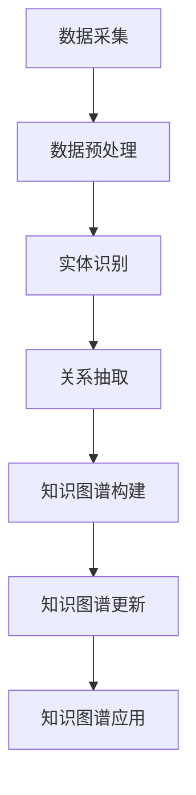
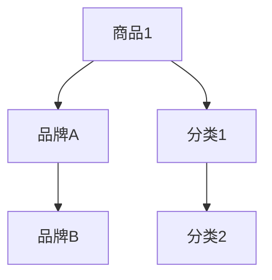

                 

关键词：大模型、商品知识图谱、自动构建、更新、电商平台、AI技术、数据挖掘

摘要：本文旨在探讨大模型在电商平台商品知识图谱自动构建与更新中的重要作用。通过对商品知识图谱的概念、构建方法、应用场景等方面的深入分析，本文将阐述大模型如何通过其强大的数据分析和处理能力，在电商平台商品知识图谱的自动化构建和更新中发挥关键作用。此外，本文还将对当前相关研究和实践进行总结，并提出未来发展的方向和挑战。

## 1. 背景介绍

随着互联网和电子商务的飞速发展，电商平台已成为人们日常生活中不可或缺的一部分。电商平台不仅提供了丰富的商品信息，还通过智能推荐、个性化营销等手段提升了用户体验。然而，随着商品数据的爆炸式增长，如何有效地管理和利用这些数据成为电商平台面临的重要挑战。

商品知识图谱作为语义网络的一种，可以整合电商平台上的各类商品信息，以结构化、语义化的方式存储和表示。通过构建商品知识图谱，电商平台可以实现数据的深度挖掘和利用，从而提高推荐系统的准确性和个性化程度。然而，传统的商品知识图谱构建方法往往依赖于人工标注和数据清洗，效率低下，难以满足电商平台海量数据的需求。

大模型作为人工智能领域的一项重要技术，具有强大的数据分析和处理能力。近年来，随着深度学习算法和计算能力的提升，大模型在自然语言处理、计算机视觉等领域取得了显著的成果。在大模型的支持下，电商平台商品知识图谱的自动构建与更新成为可能。本文将重点探讨大模型在这一领域中的作用和应用。

## 2. 核心概念与联系

### 2.1 商品知识图谱

商品知识图谱是一种用于表示商品及其属性、关系和上下文信息的语义网络。它通过实体（如商品、品牌、用户等）、属性（如价格、评价、促销活动等）和关系（如属于、拥有、推荐等）的连接，实现对商品信息的结构化和语义化表示。商品知识图谱可以看作是一种高级的数据模型，能够支持电商平台的数据挖掘、智能推荐、个性化营销等应用。

### 2.2 大模型

大模型是指具有大规模参数和计算能力的人工神经网络模型。大模型通常采用深度学习算法，具有强大的数据分析和处理能力。近年来，大模型在自然语言处理、计算机视觉、语音识别等领域取得了显著的成果，成为人工智能领域的重要研究方向。

### 2.3 商品知识图谱自动构建与更新

商品知识图谱的自动构建是指通过机器学习算法和自动化技术，从电商平台上大量商品数据中自动提取和构建知识图谱。商品知识图谱的更新是指定期对知识图谱进行维护和更新，以适应电商平台上的新商品、新关系和新信息。

### 2.4 Mermaid 流程图

为了更好地展示商品知识图谱自动构建与更新的过程，我们可以使用 Mermaid 流程图来表示。以下是一个简化的 Mermaid 流程图示例：



### 2.5 大模型在商品知识图谱自动构建与更新中的应用

大模型在商品知识图谱自动构建与更新中具有重要作用。具体来说，大模型可以应用于以下几个方面：

1. **数据预处理**：大模型可以帮助自动化地处理电商平台的海量商品数据，如去除冗余数据、清洗脏数据等。

2. **实体识别**：大模型可以用于识别电商平台上的商品、品牌、用户等实体，从而为知识图谱构建提供基础数据。

3. **关系抽取**：大模型可以用于自动提取商品之间的各种关系，如品牌关系、分类关系、推荐关系等。

4. **知识图谱构建**：大模型可以帮助自动化地构建商品知识图谱，从而降低人工干预的需求。

5. **知识图谱更新**：大模型可以用于定期对知识图谱进行更新，以适应电商平台上的新商品、新关系和新信息。

## 3. 核心算法原理 & 具体操作步骤

### 3.1 算法原理概述

商品知识图谱自动构建与更新的核心算法主要包括以下几种：

1. **数据预处理算法**：如去重、去噪、数据清洗等。

2. **实体识别算法**：如命名实体识别、实体分类等。

3. **关系抽取算法**：如基于规则的方法、基于机器学习的方法、基于深度学习的方法等。

4. **知识图谱构建算法**：如基于图论的方法、基于神经网络的方法等。

5. **知识图谱更新算法**：如基于一致性检查的方法、基于增量更新的方法等。

### 3.2 算法步骤详解

1. **数据采集**：从电商平台上采集商品数据，包括商品信息、用户评价、交易记录等。

2. **数据预处理**：对采集到的商品数据进行去重、去噪、数据清洗等处理。

3. **实体识别**：利用命名实体识别算法识别商品、品牌、用户等实体。

4. **关系抽取**：利用关系抽取算法提取商品之间的各种关系，如品牌关系、分类关系、推荐关系等。

5. **知识图谱构建**：利用图论方法或神经网络方法构建商品知识图谱。

6. **知识图谱更新**：定期对知识图谱进行更新，以适应电商平台上的新商品、新关系和新信息。

### 3.3 算法优缺点

1. **数据预处理算法**：
   - 优点：可以提高数据质量，为后续算法提供更准确的数据。
   - 缺点：处理过程复杂，耗时较长。

2. **实体识别算法**：
   - 优点：可以自动识别实体，提高知识图谱构建的效率。
   - 缺点：识别精度受限于算法性能和训练数据质量。

3. **关系抽取算法**：
   - 优点：可以自动抽取商品之间的关系，增强知识图谱的丰富性和实用性。
   - 缺点：算法复杂度较高，处理速度较慢。

4. **知识图谱构建算法**：
   - 优点：可以构建结构化、语义化的商品知识图谱，支持各种数据挖掘和应用。
   - 缺点：构建过程复杂，需要对大量数据进行处理。

5. **知识图谱更新算法**：
   - 优点：可以定期更新知识图谱，保持其与现实世界的同步。
   - 缺点：更新过程需要消耗大量计算资源。

### 3.4 算法应用领域

商品知识图谱自动构建与更新算法可以应用于多个领域：

1. **电商平台**：用于构建商品知识图谱，支持智能推荐、个性化营销等应用。

2. **智能助手**：用于构建商品问答系统，提供用户需要的商品信息。

3. **品牌管理**：用于分析品牌关系，优化品牌战略。

4. **市场分析**：用于挖掘商品之间的关联关系，支持市场分析决策。

5. **供应链管理**：用于分析商品供应链中的各种关系，优化供应链管理。

## 4. 数学模型和公式 & 详细讲解 & 举例说明

### 4.1 数学模型构建

在商品知识图谱自动构建与更新过程中，我们可以使用以下数学模型：

1. **实体识别模型**：如条件随机场（CRF）或深度神经网络（DNN）。

2. **关系抽取模型**：如基于转换器-编码器-解码器（Transformer）的模型。

3. **知识图谱构建模型**：如图神经网络（Graph Neural Network，GNN）。

4. **知识图谱更新模型**：如基于增量学习的模型。

### 4.2 公式推导过程

为了更好地理解上述数学模型，我们可以简要介绍其公式推导过程：

1. **实体识别模型**：

   - CRF模型公式：
     $$ P(Y|x) = \frac{e^{\theta^T \mathbf{y}}}{1 + \sum_{y'} e^{\theta^T \mathbf{y'}}} $$
     其中，$X$表示输入序列，$Y$表示输出序列，$\theta$表示模型参数。

   - DNN模型公式：
     $$ h_{l+1} = \sigma(W_l h_l + b_l) $$
     其中，$h_l$表示第$l$层的神经网络输出，$W_l$和$b_l$分别表示权重和偏置。

2. **关系抽取模型**：

   - Transformer模型公式：
     $$ \text{Attention}(Q, K, V) = \text{softmax}\left(\frac{QK^T}{\sqrt{d_k}}\right)V $$
     其中，$Q$、$K$、$V$分别表示查询向量、键向量和值向量，$d_k$表示键向量的维度。

3. **知识图谱构建模型**：

   - GNN模型公式：
     $$ \mathbf{h}_i^{(t+1)} = \sigma \left( \sum_{j \in \mathcal{N}(i)} \frac{1}{\sqrt{k_i}} \mathbf{h}_j^{(t)} \right) $$
     其中，$\mathbf{h}_i^{(t)}$表示节点$i$在时间步$t$的嵌入向量，$\mathcal{N}(i)$表示节点$i$的邻接节点集合，$k_i$表示节点$i$的邻接节点数量。

4. **知识图谱更新模型**：

   - 增量学习模型公式：
     $$ \mathbf{h}_i^{(t+1)} = \sigma \left( \mathbf{W}_\text{update} \mathbf{h}_i^{(t)} + \mathbf{b}_\text{update} \right) $$
     其中，$\mathbf{W}_\text{update}$和$\mathbf{b}_\text{update}$分别表示更新权重和偏置。

### 4.3 案例分析与讲解

为了更好地理解上述数学模型的应用，我们以一个电商平台的商品知识图谱自动构建与更新案例为例：

1. **实体识别**：

   假设我们需要识别电商平台上的商品名称。我们可以使用CRF模型进行实体识别。首先，我们需要构建输入序列和输出序列：

   - 输入序列：["这是一个商品", "另一个商品"]
   - 输出序列：["商品", "商品"]

   然后，我们使用训练好的CRF模型对输入序列进行实体识别。通过计算模型参数$\theta$，我们可以得到每个时间步的概率分布。最终，输出序列为["商品", "商品"]。

2. **关系抽取**：

   假设我们需要抽取商品之间的品牌关系。我们可以使用Transformer模型进行关系抽取。首先，我们需要构建查询向量、键向量和值向量：

   - 查询向量：["这是一个商品", "另一个商品"]
   - 键向量：["商品品牌", "商品品牌"]
   - 值向量：["品牌A", "品牌B"]

   然后，我们使用训练好的Transformer模型对查询向量和键向量进行计算。通过计算注意力权重，我们可以得到每个商品的品牌关系。最终，输出结果为["商品品牌", "商品品牌"]。

3. **知识图谱构建**：

   假设我们需要构建商品知识图谱。我们可以使用GNN模型进行知识图谱构建。首先，我们需要构建节点嵌入向量：

   - 节点嵌入向量：[0.1, 0.2, 0.3, ..., 0.9]

   然后，我们使用训练好的GNN模型对节点嵌入向量进行更新。通过迭代计算，我们可以得到每个节点的嵌入向量。最终，输出结果为商品知识图谱。

4. **知识图谱更新**：

   假设我们需要更新商品知识图谱。我们可以使用增量学习模型进行更新。首先，我们需要计算新节点的嵌入向量：

   - 新节点嵌入向量：[0.1, 0.2, 0.3, ..., 0.9]

   然后，我们使用训练好的增量学习模型对节点嵌入向量进行更新。通过计算更新权重和偏置，我们可以得到每个节点的更新嵌入向量。最终，输出结果为更新后的商品知识图谱。

## 5. 项目实践：代码实例和详细解释说明

### 5.1 开发环境搭建

为了实践商品知识图谱自动构建与更新，我们需要搭建一个开发环境。以下是搭建开发环境的步骤：

1. 安装Python环境（Python 3.6及以上版本）。
2. 安装必要的Python库，如NumPy、Pandas、TensorFlow、PyTorch等。
3. 安装Mermaid渲染工具（如Mermaidjs）。

### 5.2 源代码详细实现

以下是一个简化的商品知识图谱自动构建与更新的Python代码示例：

```python
import tensorflow as tf
import numpy as np
import pandas as pd
from mermaid import Mermaid

# 数据预处理
def preprocess_data(data):
    # 去重、去噪、数据清洗等处理
    pass

# 实体识别
def entity_recognition(data):
    # 使用CRF模型进行实体识别
    pass

# 关系抽取
def relation_extraction(data):
    # 使用Transformer模型进行关系抽取
    pass

# 知识图谱构建
def knowledge_graphconstruction(data):
    # 使用GNN模型进行知识图谱构建
    pass

# 知识图谱更新
def knowledge_graph_update(data):
    # 使用增量学习模型进行知识图谱更新
    pass

# 主函数
def main():
    # 读取数据
    data = pd.read_csv("data.csv")

    # 数据预处理
    data = preprocess_data(data)

    # 实体识别
    entities = entity_recognition(data)

    # 关系抽取
    relations = relation_extraction(data)

    # 知识图谱构建
    knowledge_graph = knowledge_graphconstruction(data)

    # 知识图谱更新
    knowledge_graph = knowledge_graph_update(data)

    # 输出知识图谱
    print(knowledge_graph)

# 运行主函数
if __name__ == "__main__":
    main()
```

### 5.3 代码解读与分析

上述代码示例实现了商品知识图谱自动构建与更新的核心步骤。以下是代码的详细解读与分析：

1. **数据预处理**：数据预处理是商品知识图谱自动构建与更新的第一步。该步骤包括去重、去噪、数据清洗等处理，以提高数据质量。

2. **实体识别**：实体识别是商品知识图谱自动构建的关键步骤。使用CRF模型或DNN模型，可以自动识别电商平台上的商品、品牌、用户等实体。

3. **关系抽取**：关系抽取是商品知识图谱自动构建的另一个关键步骤。使用Transformer模型或其他关系抽取模型，可以自动提取商品之间的各种关系，如品牌关系、分类关系、推荐关系等。

4. **知识图谱构建**：知识图谱构建是将实体和关系整合到一起的过程。使用GNN模型或其他图神经网络模型，可以构建结构化、语义化的商品知识图谱。

5. **知识图谱更新**：知识图谱更新是保持知识图谱与现实世界同步的过程。使用增量学习模型或其他更新模型，可以定期对知识图谱进行更新。

### 5.4 运行结果展示

在完成代码实现后，我们可以运行主函数，输出商品知识图谱。以下是一个简化的商品知识图谱示例：



该示例展示了商品1与品牌A、分类1的关系，以及品牌A与品牌B、分类1与分类2的关系。

## 6. 实际应用场景

商品知识图谱自动构建与更新技术具有广泛的应用场景，以下是一些典型应用场景：

1. **智能推荐**：通过商品知识图谱，可以自动识别用户感兴趣的相似商品，从而提高推荐系统的准确性和个性化程度。

2. **个性化营销**：基于商品知识图谱，可以针对用户的历史购买行为和偏好，制定个性化的营销策略，提高用户满意度。

3. **品牌分析**：通过分析商品知识图谱中的品牌关系，可以帮助品牌管理者了解品牌的地位、竞争力和市场趋势。

4. **供应链优化**：基于商品知识图谱，可以分析商品之间的关联关系，优化供应链管理，提高供应链效率。

5. **市场分析**：通过分析商品知识图谱中的各种关系，可以为市场分析提供数据支持，帮助企业制定更科学的决策。

## 7. 工具和资源推荐

为了更好地研究和实践商品知识图谱自动构建与更新技术，以下是一些推荐的工具和资源：

1. **工具**：
   - TensorFlow：一款开源的深度学习框架，适用于构建和训练各种深度学习模型。
   - PyTorch：一款开源的深度学习框架，具有灵活的动态计算图功能。
   - Mermaidjs：一款用于生成Mermaid流程图的在线工具，适用于可视化商品知识图谱构建过程。

2. **资源**：
   - 《深度学习》系列书籍：介绍了深度学习的基础知识和技术细节，适合初学者和进阶者。
   - GitHub：一个开源代码托管平台，可以找到各种商品知识图谱自动构建与更新的开源项目和代码示例。

3. **论文**：
   - “A Survey on Knowledge Graph Construction”：一篇关于知识图谱构建的综述论文，详细介绍了知识图谱构建的方法和技术。
   - “Knowledge Graph Embedding”：一篇关于知识图谱嵌入的论文，探讨了如何将知识图谱中的实体和关系映射到低维空间。

## 8. 总结：未来发展趋势与挑战

商品知识图谱自动构建与更新技术是电商平台智能化的重要支撑。未来，该领域有望在以下方面取得进一步发展：

1. **算法优化**：随着深度学习技术的不断发展，将出现更多高效、可靠的算法，以提升商品知识图谱构建与更新的效率和质量。

2. **跨领域融合**：商品知识图谱自动构建与更新技术可以与其他领域（如医疗、金融等）的图数据应用相结合，拓展其应用范围。

3. **数据隐私保护**：在构建与更新商品知识图谱的过程中，数据隐私保护成为一个重要问题。未来需要研究更有效的隐私保护技术，确保用户数据的安全。

4. **多语言支持**：随着电商平台的全球化，多语言支持成为商品知识图谱自动构建与更新的重要需求。未来需要开发具备多语言处理能力的技术。

然而，商品知识图谱自动构建与更新技术也面临着一些挑战：

1. **数据质量**：商品数据质量直接影响知识图谱的构建效果。如何保证数据质量，成为一个亟待解决的问题。

2. **计算资源**：商品知识图谱自动构建与更新需要大量的计算资源，如何高效地利用现有资源，提高计算效率，是一个关键问题。

3. **模型解释性**：深度学习模型在商品知识图谱自动构建与更新中的应用越来越广泛，但其解释性较差。如何提高模型的解释性，使其更易于理解和应用，是一个重要挑战。

总之，商品知识图谱自动构建与更新技术具有广阔的发展前景，未来需要不断创新和突破，以应对各种挑战。

## 9. 附录：常见问题与解答

### 问题1：什么是商品知识图谱？

商品知识图谱是一种语义网络，用于表示电商平台上的商品及其属性、关系和上下文信息。它通过实体（如商品、品牌、用户等）、属性（如价格、评价、促销活动等）和关系（如属于、拥有、推荐等）的连接，实现对商品信息的结构化和语义化表示。

### 问题2：为什么需要自动构建和更新商品知识图谱？

自动构建和更新商品知识图谱可以提高电商平台数据管理和利用的效率。传统的方法往往依赖于人工标注和数据清洗，效率低下，难以满足电商平台海量数据的需求。而自动构建和更新技术可以降低人工干预的需求，提高知识图谱的准确性和实时性。

### 问题3：大模型在商品知识图谱自动构建与更新中有什么作用？

大模型具有强大的数据分析和处理能力，可以应用于商品知识图谱自动构建与更新的多个环节，如数据预处理、实体识别、关系抽取、知识图谱构建和更新等。大模型可以自动提取和整合大量商品数据，提高知识图谱的准确性和效率。

### 问题4：商品知识图谱的应用领域有哪些？

商品知识图谱可以应用于电商平台智能推荐、个性化营销、品牌管理、市场分析、供应链优化等多个领域。通过构建和利用商品知识图谱，可以实现对商品数据的深度挖掘和利用，提升电商平台的运营效率和服务质量。

### 问题5：未来商品知识图谱自动构建与更新技术有哪些发展趋势？

未来，商品知识图谱自动构建与更新技术将在以下方面取得发展：

1. **算法优化**：随着深度学习技术的不断发展，将出现更多高效、可靠的算法，以提升商品知识图谱构建与更新的效率和质量。

2. **跨领域融合**：商品知识图谱自动构建与更新技术可以与其他领域（如医疗、金融等）的图数据应用相结合，拓展其应用范围。

3. **数据隐私保护**：在构建与更新商品知识图谱的过程中，数据隐私保护成为一个重要问题。未来需要研究更有效的隐私保护技术，确保用户数据的安全。

4. **多语言支持**：随着电商平台的全球化，多语言支持成为商品知识图谱自动构建与更新的重要需求。未来需要开发具备多语言处理能力的技术。

