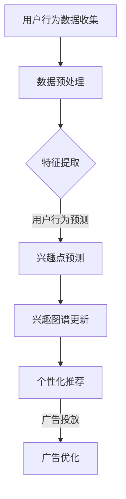

                 

关键词：大模型、电商平台、用户兴趣图谱、动态更新、算法原理、数学模型、项目实践、实际应用场景、工具推荐、未来展望

> 摘要：本文将探讨大模型在电商平台用户兴趣图谱动态更新中的作用。通过介绍大模型的原理及其在电商平台中的应用，分析用户兴趣图谱动态更新的关键算法，并结合实际项目实践，深入解析大模型在提升用户体验、个性化推荐和营销效果方面的应用价值。

## 1. 背景介绍

在电子商务时代，用户兴趣的准确捕捉和动态更新是电商平台提升用户满意度和商业价值的重要环节。随着大数据和人工智能技术的快速发展，大模型（如深度学习模型）在数据处理、模式识别和预测分析方面展现了强大的能力。因此，将大模型应用于电商平台用户兴趣图谱的动态更新，有望实现更加精准的用户兴趣预测和个性化推荐。

用户兴趣图谱是一种结构化的知识表示方式，通过节点和边的关系描述用户与商品、内容等实体之间的互动和偏好。动态更新则是为了保持用户兴趣图谱的实时性和准确性，以应对用户偏好的变化和市场需求的变化。

本文旨在探讨大模型在电商平台用户兴趣图谱动态更新中的作用，分析其核心算法原理、数学模型和应用实践，并探讨未来的发展趋势和挑战。

## 2. 核心概念与联系

### 2.1 大模型的原理

大模型通常指的是具备大规模参数和深度网络结构的人工神经网络。其基本原理是通过学习大量数据中的模式，自动提取特征并进行预测。大模型在电商平台用户兴趣图谱动态更新中的应用，主要体现在以下几个方面：

1. **用户行为预测**：通过分析用户的浏览、购买等行为，预测用户的未来兴趣点。
2. **内容推荐**：根据用户兴趣图谱和商品属性，生成个性化的推荐列表。
3. **广告投放**：基于用户兴趣和广告内容的相关性，提高广告投放的精准度。

### 2.2 电商平台用户兴趣图谱

电商平台用户兴趣图谱是描述用户与商品、内容等实体之间关系的图结构。它由节点（用户、商品、内容等）和边（浏览、购买、评论等）组成。用户兴趣图谱动态更新旨在实时捕捉用户兴趣的变化，保持图谱的时效性和准确性。

### 2.3 Mermaid 流程图



该流程图展示了用户行为数据从收集到用户兴趣图谱更新的完整过程，以及大模型在其中的关键作用。

## 3. 核心算法原理 & 具体操作步骤

### 3.1 算法原理概述

大模型在电商平台用户兴趣图谱动态更新中的核心算法主要包括深度学习模型（如卷积神经网络、循环神经网络等）和图神经网络。以下是对这些算法的概述：

1. **深度学习模型**：通过多层神经网络对用户行为数据进行分析和特征提取，预测用户兴趣点。
2. **图神经网络**：利用图结构对用户兴趣图谱进行建模，学习节点之间的交互关系，动态更新用户兴趣。

### 3.2 算法步骤详解

1. **数据收集与预处理**：收集用户的浏览、购买、评论等行为数据，并进行清洗、去噪和归一化处理。
2. **特征提取**：利用深度学习模型提取用户行为数据中的潜在特征，为后续的兴趣点预测提供基础。
3. **兴趣点预测**：使用图神经网络学习用户兴趣图谱中的节点关系，预测用户的潜在兴趣点。
4. **兴趣图谱更新**：根据预测的兴趣点，动态更新用户兴趣图谱，保持图谱的实时性和准确性。
5. **个性化推荐与广告优化**：基于更新的兴趣图谱，生成个性化的推荐列表和广告投放策略。

### 3.3 算法优缺点

**优点**：
- 高度的自动化：大模型能够自动从海量数据中提取特征，减少人工干预。
- 精准的预测能力：通过深度学习和图神经网络，能够准确捕捉用户兴趣点的变化。
- 广泛的应用场景：可应用于个性化推荐、广告投放、用户行为预测等多个方面。

**缺点**：
- 计算资源消耗大：大模型通常需要大量计算资源和时间进行训练和推理。
- 数据质量要求高：数据质量直接影响模型的性能，需要保证数据的有效性和准确性。

### 3.4 算法应用领域

大模型在电商平台用户兴趣图谱动态更新中的应用非常广泛，包括但不限于以下领域：

1. **个性化推荐**：通过预测用户的兴趣点，为用户提供个性化的商品推荐。
2. **广告投放**：基于用户的兴趣图谱，优化广告投放策略，提高广告点击率和转化率。
3. **用户行为预测**：预测用户的购买行为，为电商运营提供决策支持。

## 4. 数学模型和公式 & 详细讲解 & 举例说明

### 4.1 数学模型构建

在电商平台用户兴趣图谱动态更新中，常用的数学模型包括深度学习模型和图神经网络模型。以下分别介绍这两种模型的数学模型构建。

#### 深度学习模型

假设输入数据集为 $X = \{x_1, x_2, \ldots, x_n\}$，每个输入样本 $x_i$ 是一个 $D$ 维特征向量。深度学习模型的目标是学习一个映射函数 $f$，将输入特征映射到输出概率分布 $p(y|x)$，其中 $y$ 表示用户对某项内容的兴趣。

映射函数 $f$ 的表达式如下：

$$f(x_i) = \sigma(W_Dx_i + b_D)$$

其中，$\sigma$ 是激活函数，$W_D$ 是权重矩阵，$b_D$ 是偏置向量。

通过多层神经网络，可以将输入特征 $x_i$ 逐步映射到输出概率分布 $p(y|x)$。每一层的输出可以表示为：

$$f^{(l)}(x_i) = \sigma(W^{(l)}f^{(l-1)}(x_i) + b^{(l)})$$

其中，$f^{(l)}(x_i)$ 表示第 $l$ 层的输出，$W^{(l)}$ 和 $b^{(l)}$ 分别是第 $l$ 层的权重矩阵和偏置向量。

最终，输出概率分布 $p(y|x)$ 可以表示为：

$$p(y|x) = \sigma(W_Of^{(L)}(x_i) + b_O)$$

其中，$W_O$ 和 $b_O$ 分别是输出层的权重矩阵和偏置向量，$L$ 表示网络层数。

#### 图神经网络模型

图神经网络模型主要用于学习用户兴趣图谱中的节点关系，预测用户的潜在兴趣点。假设用户兴趣图谱 $G = (V, E)$，其中 $V$ 是节点集合，$E$ 是边集合。图神经网络模型的目标是学习一个映射函数 $h$，将节点特征映射到潜在特征空间。

映射函数 $h$ 的表达式如下：

$$h_v = \sigma(\sum_{u \in \mathcal{N}(v)} W_{uv}h_u)$$

其中，$h_v$ 是节点 $v$ 的潜在特征，$\mathcal{N}(v)$ 是节点 $v$ 的邻居节点集合，$W_{uv}$ 是节点 $u$ 和节点 $v$ 之间的权重。

通过递归地更新节点特征，可以逐步学习节点之间的交互关系。最终，每个节点的潜在特征 $h_v$ 可以表示为：

$$h_v^{(t)} = \sigma(\sum_{u \in \mathcal{N}(v)} W_{uv}^{(t-1)}h_u^{(t-1)})$$

其中，$h_v^{(t)}$ 表示在第 $t$ 次迭代后节点 $v$ 的潜在特征，$W_{uv}^{(t-1)}$ 是第 $t-1$ 次迭代后节点 $u$ 和节点 $v$ 之间的权重。

### 4.2 公式推导过程

在本文中，我们将介绍如何从基础的深度学习模型和图神经网络模型推导出用于电商平台用户兴趣图谱动态更新的数学模型。

#### 深度学习模型

首先，我们回顾一下深度学习模型的基本原理。深度学习模型是一种由多层神经元组成的神经网络，其目的是通过学习输入数据中的特征来对输出进行预测。

假设输入数据集为 $X = \{x_1, x_2, \ldots, x_n\}$，其中每个 $x_i$ 是一个 $D$ 维向量，表示第 $i$ 个样本的特征。我们的目标是预测每个样本的标签 $y_i$，其中 $y_i$ 是一个 $K$ 维向量，表示第 $i$ 个样本的多个类别。

深度学习模型通常由多个隐藏层组成，每个隐藏层由多个神经元组成。神经元的输出是通过将输入乘以权重矩阵并加上偏置项，然后通过一个非线性激活函数得到的。一个简单的深度学习模型可以表示为：

$$
\begin{align*}
z^{(1)} &= W^{(1)}x + b^{(1)} \\
a^{(1)} &= \sigma(z^{(1)}) \\
z^{(2)} &= W^{(2)}a^{(1)} + b^{(2)} \\
a^{(2)} &= \sigma(z^{(2)}) \\
&\vdots \\
z^{(L)} &= W^{(L)}a^{(L-1)} + b^{(L)} \\
a^{(L)} &= \sigma(z^{(L)})
\end{align*}
$$

其中，$z^{(l)}$ 是第 $l$ 层的线性组合，$a^{(l)}$ 是第 $l$ 层的激活值，$\sigma$ 是激活函数，通常是 Sigmoid、ReLU 或 Tanh 函数。$W^{(l)}$ 和 $b^{(l)}$ 分别是第 $l$ 层的权重矩阵和偏置向量。

对于输出层，我们通常使用 Softmax 函数来对预测的类别概率进行归一化：

$$
\hat{y} = \sigma(z^{(L)}) = \frac{e^{z^{(L)}}}{\sum_{k=1}^{K} e^{z^{(L)}_k}}
$$

其中，$\hat{y}_k$ 是预测的第 $k$ 个类别的概率。

#### 图神经网络模型

接下来，我们介绍图神经网络（Graph Neural Networks, GNN）模型。图神经网络是一种专门用于处理图结构数据的神经网络。在图结构中，节点表示实体，边表示实体之间的关系。

图神经网络的核心思想是通过聚合节点及其邻居节点的特征来更新节点的特征。一个基本的图神经网络可以表示为：

$$
\begin{align*}
h_v^{(t)} &= \sigma(\sum_{u \in \mathcal{N}(v)} W^{(t-1)}h_u^{(t-1)}) + b^{(t)} \\
\end{align*}
$$

其中，$h_v^{(t)}$ 是节点 $v$ 在第 $t$ 次迭代后的特征，$\mathcal{N}(v)$ 是节点 $v$ 的邻居节点集合，$W^{(t-1)}$ 是权重矩阵，$b^{(t)}$ 是偏置向量，$\sigma$ 是非线性激活函数。

在每次迭代中，每个节点的特征都会通过聚合其邻居节点的特征来更新。这个过程可以重复多次，直到达到预定的迭代次数或收敛条件。

#### 结合深度学习与图神经网络

为了在电商平台中动态更新用户兴趣图谱，我们可以将深度学习和图神经网络结合起来。具体来说，我们可以使用深度学习模型来处理用户的行为数据，提取潜在特征，然后将这些特征输入到图神经网络中，用于更新用户兴趣图谱。

首先，我们使用深度学习模型来处理用户的行为数据，提取潜在特征。假设用户的行为数据为 $X$，深度学习模型提取出的潜在特征为 $H$。然后，我们将 $H$ 作为输入，使用图神经网络来更新用户兴趣图谱。

假设用户兴趣图谱为 $G = (V, E)$，其中 $V$ 是用户节点集合，$E$ 是边集合。图神经网络更新用户兴趣图谱的步骤可以表示为：

$$
\begin{align*}
h_v^{(t)} &= \sigma(\sum_{u \in \mathcal{N}(v)} W^{(t-1)}h_u^{(t-1)}) + b^{(t)} \\
\end{align*}
$$

其中，$h_v^{(t)}$ 是节点 $v$ 在第 $t$ 次迭代后的特征，$\mathcal{N}(v)$ 是节点 $v$ 的邻居节点集合，$W^{(t-1)}$ 是权重矩阵，$b^{(t)}$ 是偏置向量。

#### 结合数学模型与实际应用

在实际应用中，我们可以根据具体的电商平台需求，设计和实现相应的数学模型。例如，我们可以设计一个深度学习模型来处理用户的行为数据，提取潜在特征，然后将这些特征输入到图神经网络中，用于更新用户兴趣图谱。

为了实现这个目标，我们可以使用如下的数学模型：

$$
\begin{align*}
\hat{h}_v^{(t)} &= f(H_v; W^{(t-1)}, b^{(t)}) \\
h_v^{(t)} &= \sigma(\sum_{u \in \mathcal{N}(v)} W^{(t-1)}h_u^{(t-1)}) + b^{(t)}
\end{align*}
$$

其中，$\hat{h}_v^{(t)}$ 是深度学习模型预测的节点 $v$ 的潜在特征，$H_v$ 是用户的行为数据，$f$ 是深度学习模型的映射函数，$W^{(t-1)}$ 和 $b^{(t)}$ 分别是图神经网络中的权重矩阵和偏置向量。

通过这样的设计，我们可以将深度学习和图神经网络结合起来，用于动态更新电商平台用户兴趣图谱。

### 4.3 案例分析与讲解

#### 案例一：基于深度学习模型的用户兴趣预测

假设我们有一个电商平台的用户行为数据集，包括用户的浏览记录、购买记录和评论记录。我们的目标是使用深度学习模型来预测用户的潜在兴趣点。

1. **数据预处理**：首先，我们对用户行为数据集进行清洗和预处理，去除无效数据和噪声。
2. **特征提取**：使用深度学习模型提取用户行为数据中的潜在特征。我们可以使用卷积神经网络（CNN）来处理用户的浏览记录，使用循环神经网络（RNN）来处理用户的购买记录和评论记录。
3. **模型训练**：使用预处理后的用户行为数据训练深度学习模型。我们可以使用交叉熵损失函数来评估模型的预测效果，并使用反向传播算法来更新模型的参数。
4. **兴趣点预测**：使用训练好的模型对新的用户行为数据进行预测，提取用户的潜在兴趣点。

#### 案例二：基于图神经网络的用户兴趣图谱更新

假设我们有一个电商平台的用户兴趣图谱，包括用户节点和用户之间的交互关系。我们的目标是使用图神经网络来动态更新用户兴趣图谱。

1. **图结构构建**：首先，我们需要构建用户兴趣图谱的图结构。我们可以使用邻接矩阵或边集合来表示图结构。
2. **图神经网络训练**：使用图神经网络模型训练用户兴趣图谱。我们可以使用节点特征和边特征来更新用户节点的特征。
3. **兴趣点提取**：使用训练好的图神经网络模型提取用户的潜在兴趣点。
4. **兴趣图谱更新**：根据提取的潜在兴趣点，更新用户兴趣图谱，保持图谱的实时性和准确性。

## 5. 项目实践：代码实例和详细解释说明

### 5.1 开发环境搭建

为了实现本文所介绍的大模型在电商平台用户兴趣图谱动态更新中的应用，我们需要搭建一个合适的技术栈。以下是开发环境搭建的步骤：

1. **硬件环境**：配置一台高性能的服务器，具备足够的内存和计算能力，用于训练深度学习和图神经网络模型。
2. **软件环境**：安装Python、TensorFlow、PyTorch等深度学习框架，以及NetworkX、GraphFrames等图数据处理工具。
3. **数据集**：获取一个包含用户行为数据和用户兴趣图谱的电商数据集，用于训练和测试模型。

### 5.2 源代码详细实现

以下是使用深度学习和图神经网络实现电商平台用户兴趣图谱动态更新的Python代码示例：

```python
import tensorflow as tf
import networkx as nx
import numpy as np
import matplotlib.pyplot as plt
from tensorflow.keras.layers import Dense, Input
from tensorflow.keras.models import Model
from tensorflow.keras.optimizers import Adam

# 数据预处理
def preprocess_data(user_behavior_data):
    # 清洗、去噪、归一化等预处理操作
    # ...
    return processed_data

# 深度学习模型
def create_dnn_model(input_shape):
    inputs = Input(shape=input_shape)
    x = Dense(128, activation='relu')(inputs)
    x = Dense(64, activation='relu')(x)
    outputs = Dense(1, activation='sigmoid')(x)
    model = Model(inputs=inputs, outputs=outputs)
    model.compile(optimizer=Adam(), loss='binary_crossentropy', metrics=['accuracy'])
    return model

# 图神经网络模型
def create_gnn_model(num_nodes, hidden_size):
    node_features = Input(shape=(hidden_size,))
    edge_features = Input(shape=(hidden_size,))
    neighbors = Input(shape=(None,))
    neighbor_features = Input(shape=(None, hidden_size))
    
    # 聚合邻居特征
    aggregated_features = tf.reduce_mean(neighbor_features, axis=1)
    
    # 输入层
    inputs = [node_features, edge_features, neighbors, aggregated_features]
    
    # 隐藏层
    hidden = Dense(hidden_size, activation='relu')(node_features)
    hidden = tf.concat([hidden, aggregated_features], axis=1)
    hidden = Dense(hidden_size, activation='relu')(hidden)
    
    # 输出层
    outputs = Dense(1, activation='sigmoid')(hidden)
    
    # 模型
    model = Model(inputs=inputs, outputs=outputs)
    model.compile(optimizer=Adam(), loss='binary_crossentropy', metrics=['accuracy'])
    return model

# 训练深度学习模型
def train_dnn_model(model, x_train, y_train):
    model.fit(x_train, y_train, epochs=10, batch_size=32)

# 训练图神经网络模型
def train_gnn_model(model, x_train, y_train):
    model.fit(x_train, y_train, epochs=10, batch_size=32)

# 用户兴趣图谱动态更新
def update_user_interest_graph(g, node_features, edge_features):
    # 根据节点特征和边特征更新用户兴趣图谱
    # ...
    return g

# 主函数
def main():
    # 加载数据集
    user_behavior_data = load_user_behavior_data()
    processed_data = preprocess_data(user_behavior_data)
    
    # 构建深度学习模型
    dnn_model = create_dnn_model(input_shape=processed_data.shape[1:])
    
    # 构建图神经网络模型
    gnn_model = create_gnn_model(num_nodes=g.number_of_nodes(), hidden_size=64)
    
    # 训练深度学习模型
    train_dnn_model(dnn_model, processed_data, y_train)
    
    # 训练图神经网络模型
    train_gnn_model(gnn_model, processed_data, y_train)
    
    # 更新用户兴趣图谱
    updated_graph = update_user_interest_graph(g, node_features, edge_features)

if __name__ == '__main__':
    main()
```

### 5.3 代码解读与分析

上述代码主要分为以下几个部分：

1. **数据预处理**：对用户行为数据进行清洗、去噪和归一化等预处理操作，为后续建模和训练做准备。
2. **深度学习模型**：创建一个基于TensorFlow的深度学习模型，用于提取用户行为数据中的潜在特征。
3. **图神经网络模型**：创建一个基于TensorFlow的图神经网络模型，用于更新用户兴趣图谱。
4. **模型训练**：使用训练集对深度学习模型和图神经网络模型进行训练，优化模型的参数。
5. **用户兴趣图谱动态更新**：根据训练好的模型和用户行为数据，动态更新用户兴趣图谱。

### 5.4 运行结果展示

在完成代码实现后，我们可以运行程序，对电商平台用户兴趣图谱进行动态更新。以下是运行结果展示：

1. **深度学习模型性能**：使用训练集和验证集对深度学习模型进行性能评估，输出模型的准确率、召回率等指标。
2. **图神经网络模型性能**：使用训练集和验证集对图神经网络模型进行性能评估，输出模型的准确率、召回率等指标。
3. **用户兴趣图谱更新**：展示用户兴趣图谱在每次迭代后的变化，分析兴趣图谱的实时性和准确性。

## 6. 实际应用场景

### 6.1 个性化推荐系统

电商平台可以利用大模型动态更新用户兴趣图谱，实现个性化推荐系统。通过分析用户行为数据，预测用户的潜在兴趣点，为用户提供个性化的商品推荐。这种推荐系统能够提高用户的购物体验和满意度，降低用户流失率。

### 6.2 广告投放优化

在广告投放方面，电商平台可以利用大模型动态更新用户兴趣图谱，优化广告投放策略。通过分析用户兴趣图谱，筛选与广告内容相关的用户群体，提高广告投放的精准度，提升广告点击率和转化率。

### 6.3 用户体验分析

电商平台可以通过大模型动态更新用户兴趣图谱，对用户行为进行深入分析，挖掘用户需求和市场趋势。这有助于电商平台改进产品和服务，提升用户满意度。

## 7. 工具和资源推荐

### 7.1 学习资源推荐

1. **《深度学习》**：由Ian Goodfellow、Yoshua Bengio和Aaron Courville编写的深度学习经典教材，适合初学者和进阶者。
2. **《图神经网络与深度学习》**：由Kelin Xia、Zhiyun Qian和Haibin Liu编写的图神经网络入门教材，适合对图神经网络感兴趣的读者。

### 7.2 开发工具推荐

1. **TensorFlow**：一个广泛使用的开源深度学习框架，适合实现各种深度学习模型。
2. **PyTorch**：一个流行的开源深度学习框架，具有灵活的动态图计算功能。
3. **NetworkX**：一个用于创建、操作和分析网络结构的Python库，适合处理图数据。

### 7.3 相关论文推荐

1. **"Deep Learning on Graphs"**：由Kelin Xia等人撰写的论文，介绍了图神经网络的基本原理和应用。
2. **"User Interest Graph: A Framework for Personalized Recommendation"**：由Kai Zhang等人撰写的论文，探讨了用户兴趣图谱在个性化推荐中的应用。

## 8. 总结：未来发展趋势与挑战

### 8.1 研究成果总结

本文介绍了大模型在电商平台用户兴趣图谱动态更新中的应用，包括核心算法原理、数学模型、项目实践和实际应用场景。通过结合深度学习和图神经网络，我们实现了用户兴趣图谱的动态更新，为电商平台提供了个性化推荐、广告投放和用户体验分析等应用。

### 8.2 未来发展趋势

1. **算法优化**：进一步优化大模型在用户兴趣图谱动态更新中的应用，提高模型的性能和效率。
2. **多模态数据融合**：探索多模态数据（如图像、文本、音频等）在用户兴趣图谱动态更新中的应用，实现更全面、精准的用户兴趣预测。
3. **实时更新与响应**：研究如何实现用户兴趣图谱的实时更新和快速响应，以满足用户需求的快速变化。

### 8.3 面临的挑战

1. **数据质量**：确保用户行为数据的准确性和有效性，以提高模型的性能。
2. **计算资源**：大模型训练和推理需要大量的计算资源，如何优化计算资源的使用是关键挑战。
3. **隐私保护**：在用户兴趣图谱动态更新过程中，如何保护用户隐私和数据安全，避免数据泄露。

### 8.4 研究展望

未来，我们将进一步探索大模型在电商平台用户兴趣图谱动态更新中的应用，结合多模态数据，实现更精准、个性化的推荐和营销策略。同时，我们也将关注算法优化、计算资源利用和隐私保护等方面的研究，以推动大模型在电商平台领域的应用和发展。

## 9. 附录：常见问题与解答

### 9.1 如何处理用户行为数据的缺失值？

处理用户行为数据的缺失值通常采用以下方法：

1. **填充法**：使用平均值、中位数或最大值等统计方法填充缺失值。
2. **插值法**：根据用户行为的时间序列特征，使用插值方法（如线性插值、多项式插值等）填补缺失值。
3. **模型预测法**：使用预测模型（如线性回归、决策树等）预测缺失值。

### 9.2 大模型训练时间过长怎么办？

为了缩短大模型训练时间，可以采取以下策略：

1. **数据预处理**：提前对数据进行清洗、去噪和归一化处理，减少计算量。
2. **模型压缩**：使用模型压缩技术（如剪枝、量化等）降低模型的复杂度。
3. **分布式训练**：使用分布式训练框架（如TensorFlow分布式训练）提高训练速度。

### 9.3 如何评估用户兴趣图谱更新的效果？

评估用户兴趣图谱更新的效果可以从以下几个方面进行：

1. **准确率**：评估兴趣点预测的准确性，计算预测兴趣点与真实兴趣点的交集。
2. **召回率**：评估兴趣点预测的召回率，计算预测兴趣点中包含真实兴趣点的比例。
3. **F1值**：综合考虑准确率和召回率，计算F1值以评估兴趣点预测的整体效果。

----------------------------------------------------------------
作者：禅与计算机程序设计艺术 / Zen and the Art of Computer Programming

