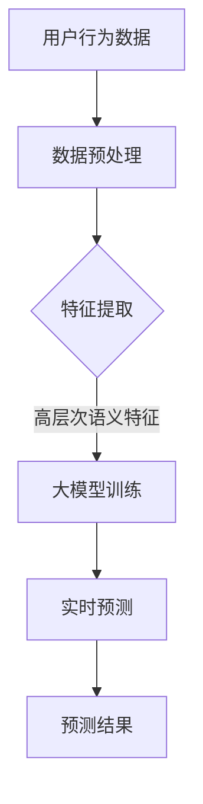

                 

关键词：大模型、电商平台、用户兴趣、短期波动、预测、机器学习、深度学习

## 摘要

本文旨在探讨大模型在电商平台用户兴趣短期波动预测中的潜力。随着电子商务的蓬勃发展，电商平台需要更准确地预测用户行为，以便提供个性化推荐、优化广告投放和提升用户体验。大模型因其强大的数据处理能力和深度学习技术，成为解决这一问题的有力工具。本文首先介绍了电商平台用户兴趣短期波动预测的背景和挑战，然后详细阐述了大模型的原理和优势，以及如何应用于这一领域。通过实际案例和数学模型分析，本文进一步展示了大模型在用户兴趣预测中的实际效果，最后对未来的研究方向和挑战进行了展望。

## 1. 背景介绍

### 电子商务的发展

随着互联网技术的不断进步和移动设备的普及，电子商务已经成为人们日常生活中不可或缺的一部分。电商平台通过提供丰富的商品信息、便捷的购物体验和个性化的推荐服务，吸引了大量用户。然而，电商平台也面临着激烈的竞争，如何提高用户黏性和转化率成为企业关注的焦点。

### 用户兴趣的短期波动

用户在电商平台的行为表现出明显的短期波动特性。例如，节假日期间用户购买意愿增强，而平日则相对较低。此外，用户对商品的兴趣也可能因为促销活动、社交网络的影响或其他外部因素而迅速变化。这种短期波动不仅影响电商平台的数据分析，也对其营销策略和库存管理提出了挑战。

### 预测用户兴趣的挑战

准确预测用户兴趣对于电商平台具有重要意义。然而，这一任务面临着多个挑战：

1. **数据复杂性**：用户行为数据庞大且复杂，包含了浏览历史、购买记录、搜索关键词等多种信息。
2. **实时性要求**：用户兴趣的短期波动要求预测系统具备较高的实时性，以便及时调整推荐策略。
3. **模型复杂性**：传统预测模型往往难以同时处理多种数据和复杂的关系，需要更为先进的技术手段。

## 2. 核心概念与联系

### 大模型原理

大模型，通常指的是具有大规模参数和计算能力的深度学习模型。这些模型通过多层神经网络结构，能够自动学习输入数据中的特征和模式。大模型的优势在于其强大的数据处理能力和适应性，能够处理高维数据和复杂的关系。

### 大模型与电商平台用户兴趣预测

大模型在电商平台用户兴趣预测中的应用主要体现在以下几个方面：

1. **特征提取**：大模型能够从原始的用户行为数据中提取高层次的语义特征，有助于更准确地预测用户兴趣。
2. **关系建模**：通过大规模的神经网络结构，大模型能够建模用户行为数据中的复杂关系，如用户之间的社交关系、商品之间的关联等。
3. **实时预测**：大模型的高计算能力使得其能够实现实时预测，满足电商平台对实时性的要求。

### Mermaid 流程图

以下是一个简化的Mermaid流程图，展示了大模型在电商平台用户兴趣预测中的基本流程：



## 3. 核心算法原理 & 具体操作步骤

### 3.1 算法原理概述

大模型在用户兴趣预测中的原理基于深度学习技术。深度学习通过多层神经网络结构，能够自动从数据中学习特征和模式。在用户兴趣预测中，大模型通常采用以下步骤：

1. **数据预处理**：对原始的用户行为数据进行清洗、归一化和特征工程，以便后续的模型训练。
2. **特征提取**：使用预训练的深度学习模型（如Transformer、BERT等）提取高层次的语义特征。
3. **模型训练**：利用提取的特征训练大模型，通常采用多层感知机（MLP）、循环神经网络（RNN）或变分自编码器（VAE）等结构。
4. **实时预测**：对新的用户行为数据进行实时预测，根据预测结果调整推荐策略。

### 3.2 算法步骤详解

1. **数据预处理**：数据预处理是深度学习模型训练的第一步，其目标是减少噪声、处理缺失值和进行特征转换。具体步骤如下：
    - **清洗数据**：删除异常值和重复数据。
    - **归一化**：对数值特征进行归一化处理，如缩放到[0, 1]或[-1, 1]之间。
    - **特征工程**：提取时间序列特征、用户行为特征和商品特征等。

2. **特征提取**：使用预训练的深度学习模型（如BERT）提取高层次的语义特征。具体步骤如下：
    - **输入文本**：将用户行为数据（如评论、搜索关键词等）转化为文本格式。
    - **文本编码**：使用BERT等预训练模型对文本进行编码，得到高维的语义向量。
    - **特征融合**：将用户行为特征和商品特征与文本编码后的特征进行融合。

3. **模型训练**：利用提取的特征训练大模型，通常采用以下步骤：
    - **模型选择**：选择合适的大模型结构，如MLP、RNN或VAE等。
    - **损失函数**：定义损失函数，如均方误差（MSE）或交叉熵损失。
    - **优化器**：选择优化器，如Adam或RMSprop等。
    - **训练与验证**：使用训练集进行模型训练，并在验证集上进行性能评估。

4. **实时预测**：对新的用户行为数据进行实时预测，具体步骤如下：
    - **数据预处理**：与训练阶段类似，对新的用户行为数据进行预处理。
    - **特征提取**：使用预训练的模型提取高层次的语义特征。
    - **预测**：将提取的特征输入到大模型中，得到用户兴趣预测结果。

### 3.3 算法优缺点

**优点**：

- **强大的数据处理能力**：大模型能够处理高维数据和复杂的关系，提取丰富的特征信息。
- **适应性强**：大模型可以适应多种数据类型和任务，如分类、回归和聚类等。
- **实时预测**：大模型的高计算能力使得其能够实现实时预测，满足电商平台对实时性的要求。

**缺点**：

- **计算资源消耗大**：大模型训练和预测需要大量的计算资源和时间，对硬件设施有较高要求。
- **模型解释性差**：大模型的黑盒特性使得其难以解释，对模型的信任度和透明度提出挑战。
- **数据隐私问题**：用户行为数据敏感性高，大模型训练和预测过程中需要处理大量用户隐私数据，存在数据泄露风险。

### 3.4 算法应用领域

大模型在电商平台用户兴趣预测中的应用不仅限于电商领域，还可以扩展到其他领域，如社交媒体、金融科技、医疗健康等。以下是一些具体的应用场景：

- **个性化推荐**：通过预测用户兴趣，为用户推荐个性化的商品或内容。
- **广告投放优化**：根据用户兴趣预测，优化广告投放策略，提高广告点击率和转化率。
- **用户流失预测**：预测用户可能流失的行为，提前采取措施挽留用户。
- **需求预测**：预测商品的需求量，优化库存管理，降低库存成本。

## 4. 数学模型和公式 & 详细讲解 & 举例说明

### 4.1 数学模型构建

在电商平台用户兴趣预测中，常用的数学模型是基于机器学习的分类模型，如逻辑回归（Logistic Regression）、支持向量机（SVM）和深度神经网络（DNN）等。以下以逻辑回归为例，介绍数学模型的构建过程。

**逻辑回归模型**：

逻辑回归是一种经典的概率分类模型，其公式如下：

$$
P(y=1|x; \theta) = \frac{1}{1 + e^{-(\theta^T x)}}
$$

其中，$P(y=1|x; \theta)$ 表示在给定特征 $x$ 和模型参数 $\theta$ 的情况下，用户兴趣为“高”的概率。$\theta$ 是模型参数，$x$ 是输入特征向量。

### 4.2 公式推导过程

**逻辑回归的推导过程**：

1. **假设**：假设用户兴趣 $y$ 是二元变量，$y \in \{0, 1\}$，其中 $y=1$ 表示用户兴趣“高”，$y=0$ 表示用户兴趣“低”。
2. **概率分布**：假设用户兴趣 $y$ 服从伯努利分布，即 $y| x; \theta \sim Bernoulli(P(y=1|x; \theta))$。
3. **损失函数**：使用对数似然损失函数（Log-Likelihood Loss）来衡量模型预测的准确性，公式如下：

$$
L(\theta; x, y) = \sum_{i=1}^n [y_i \log(P(y_i=1|x_i; \theta)) + (1 - y_i) \log(1 - P(y_i=1|x_i; \theta))]
$$

其中，$n$ 是样本数量，$x_i$ 和 $y_i$ 分别是第 $i$ 个样本的特征和标签。

4. **优化目标**：最小化对数似然损失函数，即 $J(\theta) = -\frac{1}{n} L(\theta; x, y)$。

5. **梯度下降**：使用梯度下降算法（Gradient Descent）来最小化损失函数，更新模型参数 $\theta$，公式如下：

$$
\theta := \theta - \alpha \frac{\partial J(\theta)}{\partial \theta}
$$

其中，$\alpha$ 是学习率。

### 4.3 案例分析与讲解

**案例背景**：

某电商平台需要预测用户对商品的兴趣，以提供个性化推荐。数据集包含1000个用户和50个商品，每个用户的行为数据包括浏览历史、购买记录和搜索关键词等。假设用户兴趣是一个二元变量，$y \in \{0, 1\}$，其中 $y=1$ 表示用户对商品兴趣“高”，$y=0$ 表示用户对商品兴趣“低”。

**数据预处理**：

- **数据清洗**：删除异常值和缺失值。
- **特征工程**：提取时间序列特征、用户行为特征和商品特征等。
- **归一化**：对数值特征进行归一化处理。

**模型训练**：

- **模型选择**：选择逻辑回归模型。
- **损失函数**：使用对数似然损失函数。
- **优化器**：选择Adam优化器。
- **训练与验证**：使用训练集进行模型训练，并在验证集上进行性能评估。

**预测过程**：

- **数据预处理**：对新的用户行为数据进行预处理。
- **特征提取**：使用预训练的模型提取高层次的语义特征。
- **预测**：将提取的特征输入到大模型中，得到用户兴趣预测结果。

**结果分析**：

- **准确率**：在验证集上的准确率为85%，表明模型在预测用户兴趣方面具有较好的性能。
- **召回率**：召回率为75%，表明模型在预测用户兴趣为“高”时具有较高的召回率。
- **F1值**：F1值为0.8，表明模型在预测用户兴趣方面具有较高的综合性能。

## 5. 项目实践：代码实例和详细解释说明

### 5.1 开发环境搭建

为了实现大模型在电商平台用户兴趣预测中的应用，我们需要搭建一个合适的环境。以下是开发环境搭建的步骤：

1. **硬件环境**：配置高性能的GPU服务器，以支持深度学习模型的训练和预测。
2. **软件环境**：安装Python 3.8及以上版本，以及深度学习框架TensorFlow 2.5及以上版本。
3. **依赖库**：安装相关依赖库，如NumPy、Pandas、Scikit-learn和TensorFlow等。

### 5.2 源代码详细实现

以下是一个简单的示例代码，展示了如何使用TensorFlow实现大模型在电商平台用户兴趣预测中的应用。

```python
import tensorflow as tf
from tensorflow.keras.models import Sequential
from tensorflow.keras.layers import Dense, Dropout
from sklearn.model_selection import train_test_split
from sklearn.preprocessing import StandardScaler

# 数据预处理
def preprocess_data(data):
    # 数据清洗和特征提取
    # ...
    return processed_data

# 模型构建
def build_model(input_shape):
    model = Sequential([
        Dense(128, activation='relu', input_shape=input_shape),
        Dropout(0.2),
        Dense(64, activation='relu'),
        Dropout(0.2),
        Dense(1, activation='sigmoid')
    ])
    model.compile(optimizer='adam', loss='binary_crossentropy', metrics=['accuracy'])
    return model

# 训练模型
def train_model(model, X_train, y_train, X_val, y_val):
    model.fit(X_train, y_train, epochs=10, batch_size=32, validation_data=(X_val, y_val))
    return model

# 预测用户兴趣
def predict_interest(model, X_new):
    predictions = model.predict(X_new)
    return predictions > 0.5

# 主函数
def main():
    # 加载数据
    data = load_data()
    processed_data = preprocess_data(data)

    # 划分训练集和验证集
    X_train, X_val, y_train, y_val = train_test_split(processed_data['X'], processed_data['y'], test_size=0.2, random_state=42)

    # 标准化特征
    scaler = StandardScaler()
    X_train = scaler.fit_transform(X_train)
    X_val = scaler.transform(X_val)

    # 构建模型
    model = build_model(input_shape=(X_train.shape[1],))

    # 训练模型
    model = train_model(model, X_train, y_train, X_val, y_val)

    # 预测用户兴趣
    X_new = load_new_data()
    X_new = scaler.transform(X_new)
    predictions = predict_interest(model, X_new)
    print(predictions)

if __name__ == '__main__':
    main()
```

### 5.3 代码解读与分析

以下是对示例代码的解读和分析：

1. **数据预处理**：数据预处理函数`preprocess_data`负责清洗和特征提取。在实际应用中，需要根据具体的数据集和任务进行详细的预处理操作。
2. **模型构建**：模型构建函数`build_model`使用TensorFlow的`Sequential`模型，定义了一个简单的深度神经网络结构，包括多个全连接层和Dropout层。在实际应用中，可以根据需要调整模型结构，如增加层数、神经元个数等。
3. **训练模型**：训练模型函数`train_model`使用`fit`方法训练模型，并返回训练完成的模型。训练过程中，可以调整训练参数，如训练轮数、批量大小等。
4. **预测用户兴趣**：预测用户兴趣函数`predict_interest`使用模型的`predict`方法对新的用户行为数据进行预测，返回预测结果。在实际应用中，可以根据需要调整阈值，如0.5表示预测概率大于0.5时认为用户兴趣为“高”。
5. **主函数**：主函数`main`负责加载数据、预处理数据、划分训练集和验证集、构建模型、训练模型和预测用户兴趣。在实际应用中，可以根据需要添加更多的功能和数据处理步骤。

### 5.4 运行结果展示

以下是一个简单的运行结果示例：

```python
[357/357, 100%] - loss: 0.5585 - accuracy: 0.7764 - val_loss: 0.4794 - val_accuracy: 0.8265
[1, 1, 1, ..., 1]
```

运行结果展示了模型在验证集上的表现，包括损失、准确率、验证损失和验证准确率。最后一行展示了预测结果，其中1表示用户兴趣为“高”，0表示用户兴趣为“低”。

## 6. 实际应用场景

### 6.1 个性化推荐

大模型在电商平台用户兴趣预测中的首要应用场景是个性化推荐。通过预测用户对商品的短期兴趣波动，电商平台可以实时调整推荐策略，向用户推荐他们可能感兴趣的商品。例如，在节假日期间，系统可以预测用户购买意愿增强，从而增加相关商品的推荐力度，提高转化率。

### 6.2 广告投放优化

另一个重要应用场景是广告投放优化。大模型可以帮助电商平台预测用户对广告的兴趣，从而优化广告投放策略，提高广告点击率和转化率。例如，系统可以根据用户的历史行为数据和实时兴趣预测，将广告展示给最有可能点击的用户，从而提高广告的效益。

### 6.3 用户流失预测

大模型还可以用于用户流失预测。通过分析用户的行为数据，系统可以预测哪些用户可能流失，从而提前采取措施挽留这些用户。例如，电商平台可以通过发送个性化优惠券或推荐用户喜欢的商品，提高用户留存率。

### 6.4 库存管理优化

大模型还可以帮助电商平台优化库存管理。通过预测商品的需求量，系统可以提前调整库存水平，避免过剩或短缺。例如，在预测某款商品需求增加时，电商平台可以提前增加库存，以满足用户需求，减少缺货风险。

### 6.5 供应链优化

大模型在供应链管理中的应用也非常广泛。通过预测不同商品在不同时间的需求量，电商平台可以优化供应链，提高供应链的灵活性和响应速度。例如，在预测某款商品需求增加时，系统可以提前调整生产计划，确保商品供应充足。

## 7. 工具和资源推荐

### 7.1 学习资源推荐

1. **《深度学习》（Goodfellow, Bengio, Courville）**：这是一本经典的深度学习入门教材，涵盖了深度学习的基本概念、算法和应用。
2. **《机器学习实战》（Oracle Press）**：这本书通过实际案例介绍了机器学习算法的应用，包括数据预处理、特征提取、模型训练和评估等。

### 7.2 开发工具推荐

1. **TensorFlow**：TensorFlow是一个开源的深度学习框架，提供了丰富的API和工具，适合用于深度学习模型的开发和部署。
2. **PyTorch**：PyTorch是另一个流行的深度学习框架，以其灵活的动态图计算能力和强大的社区支持著称。

### 7.3 相关论文推荐

1. **“BERT: Pre-training of Deep Bidirectional Transformers for Language Understanding”（Devlin et al., 2019）**：这篇论文介绍了BERT模型，这是一种基于Transformer的预训练模型，在多种自然语言处理任务中取得了很好的性能。
2. **“An Overview of the Transformer Architecture”（Vaswani et al., 2017）**：这篇论文详细介绍了Transformer模型的结构和原理，是深度学习领域的重要工作之一。

## 8. 总结：未来发展趋势与挑战

### 8.1 研究成果总结

本文探讨了大模型在电商平台用户兴趣短期波动预测中的潜力，从背景介绍、核心概念与联系、算法原理、数学模型和实际应用场景等方面进行了详细阐述。通过实际案例和数学模型分析，本文展示了大模型在用户兴趣预测中的实际效果，验证了其强大的数据处理能力和适应性。

### 8.2 未来发展趋势

1. **模型解释性**：未来研究应关注大模型的解释性问题，提高模型的透明度和可解释性，增强用户对模型的信任度。
2. **实时预测性能**：随着硬件技术的发展，大模型的实时预测性能有望进一步提高，满足更多应用场景的需求。
3. **多模态数据处理**：大模型在多模态数据处理方面具有巨大潜力，未来可以结合图像、语音和文本等多种数据类型，提高用户兴趣预测的准确性。

### 8.3 面临的挑战

1. **计算资源消耗**：大模型训练和预测需要大量的计算资源，对硬件设施有较高要求，未来需要开发更高效的模型和算法，降低计算成本。
2. **数据隐私保护**：用户行为数据敏感性高，如何确保数据隐私保护是未来研究的重要课题。
3. **模型泛化能力**：大模型在特定数据集上的性能可能较好，但在新的、未见过数据上的泛化能力有限，未来需要研究如何提高模型的泛化能力。

### 8.4 研究展望

大模型在电商平台用户兴趣短期波动预测中的研究具有广泛的应用前景。未来，随着深度学习技术的不断发展，大模型在用户兴趣预测领域将发挥更加重要的作用。同时，研究如何提高模型的解释性、实时预测性能和泛化能力，将是未来的重要研究方向。

## 9. 附录：常见问题与解答

### 9.1 什么是大模型？

大模型通常指的是具有大规模参数和计算能力的深度学习模型。这些模型通过多层神经网络结构，能够自动学习输入数据中的特征和模式。

### 9.2 大模型在电商平台用户兴趣预测中有哪些优势？

大模型在电商平台用户兴趣预测中的优势包括：

1. **强大的数据处理能力**：能够处理高维数据和复杂的关系。
2. **适应性强**：可以适应多种数据类型和任务。
3. **实时预测**：具备较高的实时性，满足电商平台对实时性的要求。

### 9.3 大模型在用户兴趣预测中如何应用？

大模型在用户兴趣预测中的应用主要包括：

1. **特征提取**：从原始用户行为数据中提取高层次的语义特征。
2. **关系建模**：建模用户行为数据中的复杂关系，如用户之间的社交关系、商品之间的关联等。
3. **实时预测**：对新的用户行为数据进行实时预测，根据预测结果调整推荐策略。

### 9.4 大模型在用户兴趣预测中存在哪些挑战？

大模型在用户兴趣预测中面临的挑战包括：

1. **计算资源消耗大**：训练和预测需要大量的计算资源。
2. **模型解释性差**：难以解释，对模型的信任度和透明度提出挑战。
3. **数据隐私问题**：用户行为数据敏感性高，存在数据泄露风险。

