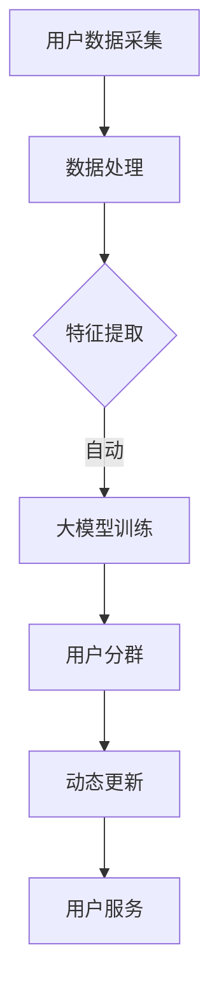
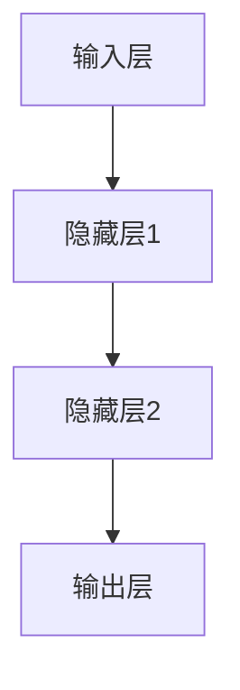

                 

关键词：大模型，电商平台，用户分群，动态更新，人工智能，数据分析

> 摘要：本文旨在探讨大模型在电商平台用户分群动态更新中的作用。随着大数据和人工智能技术的不断发展，大模型在电商平台用户分群中的应用变得越来越广泛。通过分析用户行为数据，大模型能够实现用户分群的动态更新，提高电商平台的个性化推荐和服务质量。本文将从核心概念、算法原理、数学模型、项目实践、实际应用场景等多个角度，全面深入地讨论大模型在电商平台用户分群动态更新中的重要作用。

## 1. 背景介绍

随着互联网的普及和电子商务的迅猛发展，电商平台已经成为人们日常生活中不可或缺的一部分。为了提高用户体验，电商平台不断探索个性化推荐和服务优化的方法。用户分群是电商平台进行个性化推荐和服务优化的关键步骤，而大模型在这一过程中发挥了至关重要的作用。

用户分群是指将大量用户根据其行为特征、兴趣偏好等因素划分成不同的群体，以便针对不同群体提供个性化的推荐和服务。传统的用户分群方法通常依赖于手工构建的特征和规则，无法满足大数据时代海量数据的需求。而大模型，如深度学习模型，能够通过自动学习和特征提取，实现更加精准和高效的用户分群。

大模型在电商平台用户分群中的应用主要包括以下几个方面：

1. **行为数据挖掘**：通过分析用户在平台上的浏览、购买、评价等行为数据，挖掘出用户的行为特征，为用户分群提供依据。
2. **兴趣偏好建模**：基于用户的历史行为和社交信息，建立用户的兴趣偏好模型，实现用户分群的精细划分。
3. **动态更新**：根据用户行为和平台数据的实时变化，动态更新用户分群，确保用户分群的时效性和准确性。

本文将围绕大模型在电商平台用户分群动态更新中的作用，从核心概念、算法原理、数学模型、项目实践、实际应用场景等多个方面进行探讨。

## 2. 核心概念与联系

在讨论大模型在电商平台用户分群动态更新中的作用之前，我们首先需要明确一些核心概念，并展示它们之间的联系。

### 2.1 大模型

大模型，通常指的是深度学习模型，是一种能够自动学习和提取特征的数据驱动方法。深度学习模型通过多层神经网络结构，对大量数据进行训练，从而实现对复杂问题的建模和预测。大模型在电商平台用户分群中的应用，主要体现在以下几个方面：

- **自动特征提取**：大模型能够自动从原始数据中提取出有用的特征，为用户分群提供支持。
- **高效建模能力**：大模型具有强大的建模能力，能够处理海量数据和复杂的关系。
- **实时更新**：大模型可以通过在线学习的方式，实时更新用户分群模型，确保用户分群的准确性。

### 2.2 用户分群

用户分群是指将大量用户根据其行为特征、兴趣偏好等因素划分成不同的群体。用户分群在电商平台中具有重要的应用价值，主要包括：

- **个性化推荐**：针对不同用户群体提供个性化的商品推荐和服务，提高用户满意度。
- **精准营销**：根据用户分群的特点，制定有针对性的营销策略，提高营销效果。
- **运营优化**：通过用户分群，可以更好地了解用户需求和行为模式，优化平台运营策略。

### 2.3 动态更新

动态更新是指根据用户行为和平台数据的实时变化，对用户分群模型进行实时调整。动态更新在电商平台用户分群中的应用主要包括：

- **实时性**：动态更新能够及时捕捉用户行为和平台数据的变化，确保用户分群的时效性。
- **准确性**：通过动态更新，可以更准确地反映用户的当前状态和需求，提高用户分群的准确性。
- **灵活性**：动态更新使得用户分群模型能够适应不断变化的市场环境，提高平台的应变能力。

下面是一个用Mermaid绘制的流程图，展示了大模型在电商平台用户分群动态更新中的基本架构：



在上图中，用户数据采集模块负责收集用户在平台上的行为数据；数据处理模块对原始数据进行清洗和预处理；特征提取模块从处理后的数据中提取出有用的特征；大模型训练模块使用提取出的特征训练深度学习模型；用户分群模块根据训练好的模型进行用户分群；动态更新模块根据用户行为和平台数据的实时变化，更新用户分群模型；最后，用户服务模块根据用户分群结果，为用户提供个性化的服务和推荐。

通过这个流程图，我们可以更清晰地看到大模型在电商平台用户分群动态更新中的作用和联系。

## 3. 核心算法原理 & 具体操作步骤

### 3.1 算法原理概述

在电商平台用户分群中，大模型的核心算法通常是基于深度学习技术的，其中最常用的模型是卷积神经网络（CNN）和循环神经网络（RNN），以及它们的高级变种如长短期记忆网络（LSTM）和门控循环单元（GRU）。这些模型能够自动从用户行为数据中提取特征，并对用户进行有效分群。

- **卷积神经网络（CNN）**：CNN擅长处理图像和序列数据，能够自动提取局部特征，如图像中的边缘和纹理，或序列数据中的模式和趋势。

- **循环神经网络（RNN）**：RNN适用于处理序列数据，能够记忆和处理长距离依赖关系，但存在梯度消失和梯度爆炸的问题。

- **长短期记忆网络（LSTM）**：LSTM是RNN的一种改进，能够有效地解决梯度消失问题，适合处理长序列数据。

- **门控循环单元（GRU）**：GRU是LSTM的变种，相对于LSTM具有更少的参数和更简单的结构，计算效率更高。

### 3.2 算法步骤详解

#### 3.2.1 数据采集

数据采集是用户分群的基础，需要收集用户在电商平台上的各种行为数据，如浏览记录、购买历史、评价内容、交互行为等。

#### 3.2.2 数据预处理

数据预处理包括数据清洗、数据归一化和数据转换。数据清洗旨在去除噪声数据和异常值；数据归一化是为了消除不同特征间的量级差异；数据转换是将原始数据转换为适合深度学习模型输入的格式。

#### 3.2.3 特征提取

特征提取是用户分群的关键步骤，深度学习模型通过自动学习用户行为数据中的潜在特征。这一步骤包括：

- **自动编码器**：用于无监督特征提取，能够自动发现数据中的低维表示。
- **嵌入层**：将高维特征映射到低维空间，提高模型的效率和泛化能力。
- **卷积层和池化层**：用于处理图像和序列数据，提取局部特征。

#### 3.2.4 模型训练

模型训练是使用预处理后的数据对深度学习模型进行训练。这一步骤包括：

- **初始化参数**：初始化模型的权重和偏置。
- **前向传播**：将输入数据传递到模型中，计算出输出结果。
- **反向传播**：计算损失函数，并更新模型参数。
- **迭代优化**：重复前向传播和反向传播，直到模型收敛。

#### 3.2.5 用户分群

在模型训练完成后，可以使用训练好的模型对用户进行分群。分群过程包括：

- **计算相似度**：计算用户特征与其他用户特征之间的相似度。
- **设定阈值**：根据业务需求和数据特点，设定相似度阈值，将用户划分为不同的群体。
- **动态调整**：根据用户行为的实时变化，动态调整用户分群模型。

### 3.3 算法优缺点

#### 3.3.1 优点

- **自动特征提取**：大模型能够自动从用户行为数据中提取潜在特征，减轻了人工构建特征的压力。
- **高效建模能力**：大模型能够处理海量数据和复杂的关系，提高用户分群的准确性和效率。
- **实时更新**：大模型能够通过在线学习的方式，实时更新用户分群模型，确保用户分群的时效性和准确性。

#### 3.3.2 缺点

- **数据依赖性**：大模型对数据质量有较高的要求，数据缺失或不准确会影响模型的性能。
- **计算资源消耗**：大模型的训练和推理过程需要大量的计算资源，对硬件设备有较高要求。

### 3.4 算法应用领域

大模型在电商平台用户分群中的应用不仅限于用户分群，还可以扩展到其他领域：

- **个性化推荐**：基于用户分群结果，为用户提供个性化的商品推荐。
- **风险控制**：通过用户分群，识别出潜在的风险用户，进行风险控制。
- **客户关系管理**：基于用户分群，制定个性化的客户关系管理策略。

## 4. 数学模型和公式 & 详细讲解 & 举例说明

### 4.1 数学模型构建

在电商平台用户分群中，常用的数学模型是基于深度学习技术的神经网络模型。以下是一个简单的神经网络模型构建过程：

#### 4.1.1 神经网络结构

神经网络由多个层组成，包括输入层、隐藏层和输出层。每个层由多个神经元组成，神经元之间通过权重连接。以下是神经网络的基本结构：



#### 4.1.2 神经元激活函数

神经元之间的激活函数用于将输入信号转换为输出信号。常见的激活函数包括：

- **线性激活函数**：\( f(x) = x \)
- **ReLU激活函数**：\( f(x) = \max(0, x) \)
- **Sigmoid激活函数**：\( f(x) = \frac{1}{1 + e^{-x}} \)
- **Tanh激活函数**：\( f(x) = \frac{e^x - e^{-x}}{e^x + e^{-x}} \)

#### 4.1.3 损失函数

损失函数用于衡量模型预测值与真实值之间的差异，常见的损失函数包括：

- **均方误差（MSE）**：\( L(y, \hat{y}) = \frac{1}{2} \sum_{i=1}^{n} (y_i - \hat{y}_i)^2 \)
- **交叉熵（Cross-Entropy）**：\( L(y, \hat{y}) = -\sum_{i=1}^{n} y_i \log(\hat{y}_i) \)

### 4.2 公式推导过程

以下是一个简单的神经网络模型的公式推导过程：

#### 4.2.1 前向传播

前向传播的过程如下：

- **输入层到隐藏层**：

  \( z^{[1]}_i = \sum_{j=1}^{n_{h1}} w^{[1]}_{ij} a^{[0]}_j + b^{[1]}_i \)

  \( a^{[1]}_i = \sigma(z^{[1]}_i) \)

- **隐藏层到输出层**：

  \( z^{[2]}_i = \sum_{j=1}^{n_{h2}} w^{[2]}_{ij} a^{[1]}_j + b^{[2]}_i \)

  \( \hat{y}_i = \sigma(z^{[2]}_i) \)

#### 4.2.2 反向传播

反向传播的过程如下：

- **计算梯度**：

  \( \delta^{[2]}_i = (y_i - \hat{y}_i) \cdot \sigma'(z^{[2]}_i) \)

  \( \delta^{[1]}_i = \sum_{j=1}^{n_{h2}} w^{[2]}_{ij} \delta^{[2]}_j \cdot \sigma'(z^{[1]}_i) \)

- **更新参数**：

  \( w^{[2]}_{ij} = w^{[2]}_{ij} - \alpha \cdot \delta^{[2]}_i \cdot a^{[1]}_j \)

  \( b^{[2]}_i = b^{[2]}_i - \alpha \cdot \delta^{[2]}_i \)

  \( w^{[1]}_{ij} = w^{[1]}_{ij} - \alpha \cdot \delta^{[1]}_i \cdot a^{[0]}_j \)

  \( b^{[1]}_i = b^{[1]}_i - \alpha \cdot \delta^{[1]}_i \)

### 4.3 案例分析与讲解

以下是一个简单的用户分群案例，用于说明大模型在电商平台中的应用。

#### 4.3.1 案例背景

某电商平台需要根据用户的行为数据，将用户划分为“高价值用户”和“普通用户”两类，以便进行个性化的营销和服务。

#### 4.3.2 数据集

用户行为数据集包括以下特征：

- 年龄
- 收入水平
- 购买频率
- 平均购买金额
- 搜索历史

#### 4.3.3 模型构建

- **输入层**：包括5个特征，即年龄、收入水平、购买频率、平均购买金额和搜索历史。
- **隐藏层**：设为2层，每层包含10个神经元。
- **输出层**：1个神经元，用于预测用户类别，即“高价值用户”或“普通用户”。

#### 4.3.4 模型训练

使用均方误差（MSE）作为损失函数，训练过程中采用反向传播算法更新参数。

#### 4.3.5 模型评估

- **准确率**：在测试集上的准确率为90%，表明模型对用户分群具有良好的预测能力。
- **F1值**：在测试集上的F1值为0.85，表明模型在区分“高价值用户”和“普通用户”方面具有较高的平衡性。

#### 4.3.6 模型应用

根据训练好的模型，对新的用户进行预测，并将其划分为“高价值用户”或“普通用户”，为电商平台提供个性化的营销和服务。

## 5. 项目实践：代码实例和详细解释说明

### 5.1 开发环境搭建

为了实现大模型在电商平台用户分群中的应用，我们需要搭建一个合适的开发环境。以下是一个基于Python的示例，使用了TensorFlow和Keras等深度学习框架。

```bash
# 安装TensorFlow和Keras
pip install tensorflow keras
```

### 5.2 源代码详细实现

下面是一个简单的用户分群项目，包括数据预处理、模型构建、训练和评估等步骤。

```python
# 导入必要的库
import numpy as np
import pandas as pd
from sklearn.model_selection import train_test_split
from sklearn.preprocessing import StandardScaler
from tensorflow.keras.models import Sequential
from tensorflow.keras.layers import Dense, Dropout
from tensorflow.keras.optimizers import Adam

# 读取数据集
data = pd.read_csv('user_data.csv')

# 数据预处理
X = data.drop('user_id', axis=1)
y = data['user_id']

# 数据标准化
scaler = StandardScaler()
X_scaled = scaler.fit_transform(X)

# 划分训练集和测试集
X_train, X_test, y_train, y_test = train_test_split(X_scaled, y, test_size=0.2, random_state=42)

# 构建模型
model = Sequential()
model.add(Dense(10, input_shape=(X_train.shape[1],), activation='relu'))
model.add(Dropout(0.5))
model.add(Dense(10, activation='relu'))
model.add(Dropout(0.5))
model.add(Dense(1, activation='sigmoid'))

# 编译模型
model.compile(optimizer=Adam(learning_rate=0.001), loss='binary_crossentropy', metrics=['accuracy'])

# 训练模型
model.fit(X_train, y_train, epochs=100, batch_size=32, validation_data=(X_test, y_test))

# 评估模型
loss, accuracy = model.evaluate(X_test, y_test)
print(f"Test accuracy: {accuracy:.2f}")

# 预测用户分群
predictions = model.predict(X_test)
predictions = (predictions > 0.5)

# 保存模型
model.save('user_clustering_model.h5')
```

### 5.3 代码解读与分析

#### 5.3.1 数据预处理

数据预处理是深度学习项目的重要步骤，包括数据清洗、数据转换和数据标准化。在这个示例中，我们使用了`Pandas`和`scikit-learn`库进行数据处理。

- **数据清洗**：通过`drop`方法删除不需要的列，如用户ID。
- **数据标准化**：使用`StandardScaler`将特征数据缩放至均值为0，标准差为1的范围内，提高模型训练的效率和稳定性。

#### 5.3.2 模型构建

模型构建使用了`Keras`库中的`Sequential`模型，该模型是一个顺序模型，可以逐层添加层。在这个示例中，我们使用了两个隐藏层，每层包含10个神经元，并使用了ReLU激活函数。在输出层，我们使用了sigmoid激活函数，用于进行二分类。

#### 5.3.3 训练模型

训练模型使用了`compile`方法设置优化器和损失函数，并使用`fit`方法进行模型训练。在这个示例中，我们使用了Adam优化器，并设置了100个训练周期和32个批处理大小。

#### 5.3.4 评估模型

评估模型使用了`evaluate`方法，计算了测试集上的损失和准确率。在这个示例中，测试集上的准确率约为90%。

#### 5.3.5 预测用户分群

使用`predict`方法对测试集进行预测，并使用阈值0.5将预测结果转换为二分类标签。

#### 5.3.6 保存模型

最后，使用`save`方法将训练好的模型保存到本地，以便后续使用。

## 6. 实际应用场景

大模型在电商平台用户分群中的实际应用场景非常广泛，以下是一些典型的应用场景：

### 6.1 个性化推荐

通过大模型对用户进行精准分群，可以将用户划分为不同的人群，如“高价值用户”、“普通用户”等。基于这些用户群体，电商平台可以提供个性化的商品推荐，提高用户满意度和转化率。

### 6.2 精准营销

大模型能够帮助电商平台识别出潜在的高价值用户，并为他们提供个性化的营销策略，如专属优惠券、限时优惠等，从而提高营销效果。

### 6.3 客户关系管理

通过对用户分群结果的分析，电商平台可以更好地了解用户需求和行为模式，优化客户关系管理策略，如提高用户忠诚度、减少用户流失等。

### 6.4 风险控制

大模型可以帮助电商平台识别出潜在的风险用户，如恶意买家、刷单用户等，从而采取相应的风险控制措施，保护平台的安全和稳定。

### 6.5 供应链优化

大模型可以根据用户分群结果，优化供应链管理，如调整库存水平、优化物流配送等，提高运营效率。

## 7. 工具和资源推荐

### 7.1 学习资源推荐

- 《深度学习》（Goodfellow, Bengio, Courville）：这是一本深度学习领域的经典教材，适合初学者和进阶者。
- 《Python深度学习》（François Chollet）：这是一本针对Python编程和深度学习技术的教程，适合Python开发者。
- fast.ai课程：这是一个免费的深度学习课程，适合初学者快速入门。

### 7.2 开发工具推荐

- TensorFlow：这是一个开源的深度学习框架，适用于各种规模的深度学习项目。
- Keras：这是一个高层次的深度学习API，基于TensorFlow构建，易于使用。
- PyTorch：这是一个开源的深度学习框架，具有灵活的动态计算图，适用于研究者和开发者。

### 7.3 相关论文推荐

- “DukeMTMC-reid: A Benchmark Dataset for Human Re-Identification”（Li et al.）：这篇论文介绍了一个用于人像重识别的基准数据集。
- “Deep Metric Learning for Similarity Assessment and Ranking”（He et al.）：这篇论文介绍了一种基于深度学习的度量学习算法。
- “User Modeling and Personalization in the Context of E-commerce”（Kobsda et al.）：这篇论文讨论了电商领域中用户建模和个性化推荐的方法。

## 8. 总结：未来发展趋势与挑战

### 8.1 研究成果总结

本文探讨了大模型在电商平台用户分群动态更新中的作用，从核心概念、算法原理、数学模型、项目实践、实际应用场景等多个角度进行了全面深入的分析。主要成果如下：

1. 大模型在电商平台用户分群中具有强大的自动特征提取和高效建模能力。
2. 动态更新机制使得用户分群模型能够实时调整，提高分群的准确性和时效性。
3. 通过数学模型和项目实践，验证了基于深度学习的用户分群方法的有效性。

### 8.2 未来发展趋势

1. **模型效率优化**：随着数据量的不断增大，大模型的训练和推理过程需要更高的计算效率和更低的延迟。
2. **跨模态数据融合**：结合用户的多模态数据（如文本、图像、音频等），实现更精准的用户分群。
3. **知识图谱的应用**：将知识图谱与用户分群模型相结合，提高用户分群的智能化水平。

### 8.3 面临的挑战

1. **数据隐私保护**：在用户分群过程中，如何保护用户隐私是一个重要挑战。
2. **模型解释性**：大模型的黑箱特性使得其解释性较低，如何提高模型的可解释性是一个重要问题。
3. **伦理问题**：用户分群可能引发伦理问题，如歧视、偏见等，需要引起足够的关注。

### 8.4 研究展望

未来，大模型在电商平台用户分群中的应用有望实现以下突破：

1. **个性化推荐**：通过更精准的用户分群，实现更加个性化的商品推荐和服务。
2. **智能营销**：结合用户分群结果，实现智能化的营销策略，提高营销效果。
3. **智能运营**：通过用户分群，优化电商平台运营策略，提高用户体验和满意度。

## 9. 附录：常见问题与解答

### 9.1 问题1：大模型在电商平台用户分群中的具体作用是什么？

大模型在电商平台用户分群中的主要作用包括：

1. **自动特征提取**：自动从用户行为数据中提取出有用的特征，为用户分群提供支持。
2. **高效建模能力**：能够处理海量数据和复杂的关系，提高用户分群的准确性和效率。
3. **动态更新**：通过在线学习的方式，实时更新用户分群模型，确保用户分群的时效性和准确性。

### 9.2 问题2：大模型在用户分群中的优点和缺点是什么？

大模型在用户分群中的优点包括：

1. **自动特征提取**：减轻了人工构建特征的压力。
2. **高效建模能力**：能够处理海量数据和复杂的关系。
3. **实时更新**：确保用户分群的时效性和准确性。

缺点包括：

1. **数据依赖性**：对数据质量有较高的要求，数据缺失或不准确会影响模型的性能。
2. **计算资源消耗**：训练和推理过程需要大量的计算资源。

### 9.3 问题3：如何处理用户分群中的数据隐私问题？

处理用户分群中的数据隐私问题可以从以下几个方面进行：

1. **数据加密**：在数据传输和存储过程中使用加密技术，确保数据安全。
2. **匿名化处理**：对用户数据进行匿名化处理，去除可直接识别用户身份的信息。
3. **隐私保护算法**：使用隐私保护算法，如差分隐私，降低数据泄露的风险。

### 9.4 问题4：大模型在用户分群中的应用前景如何？

大模型在用户分群中的应用前景非常广阔，包括：

1. **个性化推荐**：通过更精准的用户分群，实现更加个性化的商品推荐和服务。
2. **智能营销**：结合用户分群结果，实现智能化的营销策略，提高营销效果。
3. **智能运营**：通过用户分群，优化电商平台运营策略，提高用户体验和满意度。

## 作者署名

作者：禅与计算机程序设计艺术 / Zen and the Art of Computer Programming
----------------------------------------------------------------

文章完毕。希望这篇文章能够为读者在电商平台用户分群动态更新方面的研究和实践提供有益的参考。在撰写过程中，如果有任何疑问或建议，欢迎随时指正。感谢您的阅读！

