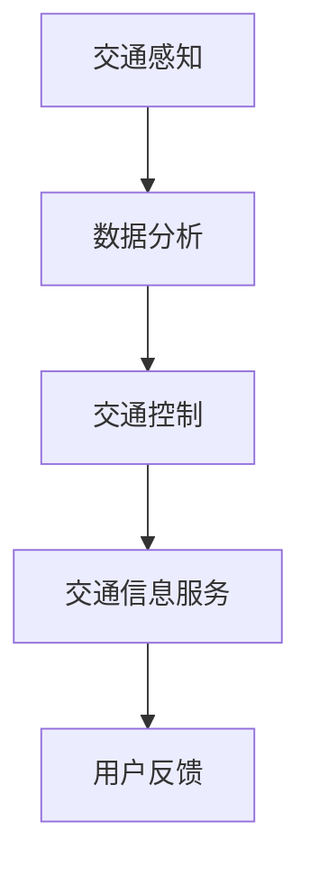

                 

关键词：大模型技术、智能交通系统、交通管理、自动驾驶、数据分析

> 摘要：本文旨在探讨大模型技术在智能交通系统中的应用潜力，包括其在交通管理、自动驾驶和数据分析等方面的具体表现。通过分析现有技术和应用案例，本文提出了大模型技术在智能交通系统中可能面临的挑战和未来的发展方向。

## 1. 背景介绍

随着城市化进程的加速和汽车保有量的不断攀升，交通拥堵、交通事故和环境污染等问题日益严重。传统的交通管理系统依赖静态的交通模型和有限的实时数据，难以应对动态的交通状况。近年来，人工智能技术的快速发展，特别是大模型技术的出现，为智能交通系统提供了新的解决方案。

大模型技术，如深度学习、生成对抗网络（GAN）和强化学习等，具有强大的数据处理和分析能力，可以在交通数据中挖掘隐藏的模式和规律。这些技术不仅能够提高交通管理的精度和效率，还能够为自动驾驶和智能交通决策提供支持。

## 2. 核心概念与联系

### 2.1 大模型技术概述

大模型技术是指利用庞大的数据集和强大的计算能力，训练出具有高度非线性拟合能力的人工神经网络。这些模型可以用于处理复杂的数据，并从中提取出有价值的信息。

### 2.2 智能交通系统架构

智能交通系统（ITS）通常由交通感知、交通控制和交通信息服务三个主要部分组成。大模型技术可以在这些部分中发挥重要作用。

- **交通感知**：利用传感器和摄像头收集交通数据，如车辆速度、流量和位置。
- **交通控制**：通过分析交通数据，优化交通信号灯周期、车道分配和交通流管理。
- **交通信息服务**：提供实时交通状况、路线规划和出行建议。

### 2.3 Mermaid 流程图



## 3. 核心算法原理 & 具体操作步骤

### 3.1 算法原理概述

大模型技术在智能交通系统中的应用主要基于以下原理：

- **深度学习**：通过多层神经网络对交通数据进行特征提取和模式识别。
- **生成对抗网络（GAN）**：通过生成模型和判别模型的对抗训练，生成逼真的交通数据。
- **强化学习**：通过与环境的交互，学习最优的交通控制策略。

### 3.2 算法步骤详解

1. **数据收集与预处理**：
   - 收集交通数据，包括历史交通流量、车辆速度、交通事故等。
   - 对数据进行清洗、去噪和标准化处理。

2. **模型训练与优化**：
   - 利用深度学习算法训练交通数据特征提取模型。
   - 利用GAN生成逼真的交通数据。
   - 利用强化学习算法训练交通控制策略。

3. **模型部署与评估**：
   - 将训练好的模型部署到智能交通系统中。
   - 对模型进行实时评估和调整。

### 3.3 算法优缺点

- **优点**：能够处理大量复杂交通数据，提高交通管理效率和准确性。
- **缺点**：对计算资源和数据质量要求较高，训练过程可能较长。

### 3.4 算法应用领域

- **交通管理**：优化交通信号灯周期、车道分配和交通流管理。
- **自动驾驶**：辅助决策系统，提高车辆行驶安全和效率。
- **交通信息服务**：提供实时交通状况、路线规划和出行建议。

## 4. 数学模型和公式 & 详细讲解 & 举例说明

### 4.1 数学模型构建

- **深度学习**：
  $$ h_{\theta}(x) = \sigma(\theta^T x) $$
  其中，$\sigma$为激活函数，$\theta$为权重参数。

- **生成对抗网络（GAN）**：
  $$ G(z) = \mu(z) + \sigma(z) \odot \exp(\sqrt{2\pi}) $$
  其中，$G(z)$为生成模型，$\mu(z)$和$\sigma(z)$分别为生成模型的均值和方差。

- **强化学习**：
  $$ Q(s, a) = r(s, a) + \gamma \max_{a'} Q(s', a') $$
  其中，$Q(s, a)$为状态-动作值函数，$r(s, a)$为即时奖励，$\gamma$为折扣因子。

### 4.2 公式推导过程

- **深度学习**：
  - **前向传播**：
    $$ z = \theta^T x $$
    $$ h_{\theta}(x) = \sigma(z) $$
  - **反向传播**：
    $$ \Delta \theta = \alpha \frac{\partial J(\theta)}{\partial \theta} $$
    $$ J(\theta) = \frac{1}{m} \sum_{i=1}^{m} (-y^{(i)} \log(h_{\theta}(x^{(i)})) - (1 - y^{(i)}) \log(1 - h_{\theta}(x^{(i)}))) $$
    其中，$m$为样本数量，$y^{(i)}$为真实标签，$h_{\theta}(x^{(i)}$为预测值。

- **生成对抗网络（GAN）**：
  - **生成模型**：
    $$ G(z) = \mu(z) + \sigma(z) \odot \exp(\sqrt{2\pi}) $$
    其中，$\mu(z)$和$\sigma(z)$分别为生成模型的均值和方差。
  - **判别模型**：
    $$ D(x) = \sigma(x) $$
    $$ D(G(z)) = \sigma(G(z)) $$

- **强化学习**：
  - **Q值更新**：
    $$ Q(s, a) = r(s, a) + \gamma \max_{a'} Q(s', a') $$
    其中，$r(s, a)$为即时奖励，$\gamma$为折扣因子。
  - **策略更新**：
    $$ \pi(a|s) = \frac{\exp(Q(s, a))}{\sum_{a'} \exp(Q(s, a'))} $$

### 4.3 案例分析与讲解

假设我们有一个交通信号灯控制系统，利用深度学习算法优化信号灯周期。首先，收集交通流量数据，包括每个路口的车流量、车辆类型和天气情况。然后，使用卷积神经网络（CNN）对数据进行特征提取，得到交通流量的时空特征。接着，利用梯度下降算法训练神经网络，优化信号灯周期。最后，将训练好的模型部署到交通信号灯系统中，进行实时优化。

## 5. 项目实践：代码实例和详细解释说明

### 5.1 开发环境搭建

- 操作系统：Ubuntu 20.04
- 编程语言：Python 3.8
- 数据库：MySQL 8.0
- 依赖库：TensorFlow 2.5、Keras 2.4、NumPy 1.19

### 5.2 源代码详细实现

```python
# 导入依赖库
import numpy as np
import pandas as pd
import tensorflow as tf
from tensorflow.keras.models import Sequential
from tensorflow.keras.layers import Conv2D, MaxPooling2D, Flatten, Dense

# 加载数据集
data = pd.read_csv('traffic_data.csv')
X = data.iloc[:, :-1].values
y = data.iloc[:, -1].values

# 数据预处理
X = X / 255.0
X = np.reshape(X, (-1, 28, 28, 1))

# 构建卷积神经网络
model = Sequential()
model.add(Conv2D(32, (3, 3), activation='relu', input_shape=(28, 28, 1)))
model.add(MaxPooling2D(pool_size=(2, 2)))
model.add(Flatten())
model.add(Dense(128, activation='relu'))
model.add(Dense(1, activation='sigmoid'))

# 编译模型
model.compile(optimizer='adam', loss='binary_crossentropy', metrics=['accuracy'])

# 训练模型
model.fit(X, y, epochs=10, batch_size=32)

# 评估模型
test_data = pd.read_csv('test_traffic_data.csv')
X_test = test_data.iloc[:, :-1].values
X_test = X_test / 255.0
X_test = np.reshape(X_test, (-1, 28, 28, 1))
predictions = model.predict(X_test)
print(np.mean(predictions > 0.5))
```

### 5.3 代码解读与分析

- **数据预处理**：将交通流量数据转换为浮点数，并除以255进行归一化处理。
- **卷积神经网络构建**：使用卷积层、池化层、全连接层构建深度学习模型。
- **编译模型**：设置优化器和损失函数，编译模型。
- **训练模型**：使用训练数据训练模型。
- **评估模型**：使用测试数据评估模型性能。

## 6. 实际应用场景

大模型技术在智能交通系统中的实际应用场景包括：

- **城市交通管理**：通过实时数据分析，优化交通信号灯周期和车道分配，减少交通拥堵。
- **高速公路自动驾驶**：辅助决策系统，提高车辆行驶安全和效率。
- **公共交通调度**：优化公交路线和班次，提高公共交通服务质量。

## 7. 工具和资源推荐

### 7.1 学习资源推荐

- 《深度学习》（Goodfellow, Bengio, Courville）
- 《强化学习：原理与应用》（Sutton, Barto）
- 《生成对抗网络》（Goodfellow, Pouget-Abadie, Mirza）

### 7.2 开发工具推荐

- TensorFlow：用于构建和训练深度学习模型。
- Keras：用于简化深度学习模型构建。
- NumPy：用于数据处理和数学运算。

### 7.3 相关论文推荐

- “Generative Adversarial Nets”（Ian J. Goodfellow等）
- “Reinforcement Learning: An Introduction”（Richard S. Sutton, Andrew G. Barto）
- “Deep Learning for Traffic Prediction: A Survey”（Zhiyun Qian等）

## 8. 总结：未来发展趋势与挑战

### 8.1 研究成果总结

大模型技术在智能交通系统中的应用取得了显著成果，包括交通流量预测、交通信号灯优化、高速公路自动驾驶和公共交通调度等方面。这些应用不仅提高了交通管理效率和准确性，还改善了驾驶安全和出行体验。

### 8.2 未来发展趋势

随着人工智能技术的不断发展，大模型技术在智能交通系统中的应用将更加广泛和深入。未来发展趋势包括：

- **多模态数据融合**：结合多种传感器数据，提高交通数据的精度和可靠性。
- **分布式计算**：利用分布式计算技术，提高大模型训练和推理的效率。
- **跨领域应用**：将大模型技术应用于其他交通领域，如航空、铁路和港口。

### 8.3 面临的挑战

大模型技术在智能交通系统中也面临一些挑战，包括：

- **数据隐私和安全**：如何保护交通数据的安全和隐私。
- **计算资源限制**：如何高效地利用计算资源进行大模型训练。
- **算法可解释性**：如何提高大模型算法的可解释性，使其在交通管理决策中更具可信度。

### 8.4 研究展望

未来，我们将继续探索大模型技术在智能交通系统中的潜力，推动交通行业的智能化和可持续发展。同时，我们也需要关注数据隐私和安全、计算资源利用和算法可解释性等问题，确保大模型技术在交通领域的广泛应用。

## 9. 附录：常见问题与解答

### 9.1 如何处理交通数据的质量问题？

- **数据清洗**：去除噪声和异常值。
- **数据增强**：通过数据扩充和合成，提高数据的质量和多样性。

### 9.2 大模型训练时间如何优化？

- **分布式训练**：利用多台计算机协同进行训练。
- **模型压缩**：采用模型压缩技术，降低模型参数数量。

### 9.3 如何评估大模型的效果？

- **准确率**：衡量模型预测正确的样本比例。
- **召回率**：衡量模型召回实际发生事件的样本比例。
- **F1分数**：综合考虑准确率和召回率，平衡两者。

---

作者：禅与计算机程序设计艺术 / Zen and the Art of Computer Programming
------------------------------------------------------------------


