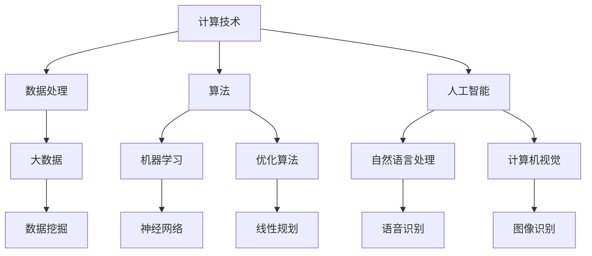

                 

关键词：计算技术、社会进步、人工智能、创新、技术发展

> 摘要：本文旨在探讨计算技术在推动社会进步方面的积极影响。通过对核心概念、算法原理、数学模型和实际应用场景的深入分析，本文揭示了计算技术在各个领域的应用及其潜在的未来发展方向。文章还提出了面临的挑战和研究展望，以期为读者提供全面的技术视角。

## 1. 背景介绍

### 1.1 计算技术的发展历程

计算技术的发展历程可以说是人类科技进步的一个缩影。从最初的机械计算机到电子计算机，再到如今的量子计算机，计算技术不断演进，极大地推动了人类社会的进步。

- **机械计算机**：19世纪，查尔斯·巴贝奇设计的差分机和分析机被认为是机械计算机的先驱，它们通过机械装置来执行复杂的计算任务。
- **电子计算机**：20世纪40年代，随着电子技术的兴起，电子计算机逐渐取代了机械计算机，成为科学研究和工业生产的重要工具。
- **现代计算机**：20世纪末至21世纪初，计算机技术进入了高速发展的阶段，尤其是互联网和移动设备的普及，使得计算技术成为人们日常生活的一部分。
- **量子计算机**：近年来，量子计算技术的突破性进展，预示着计算技术的下一个重大变革。

### 1.2 计算技术对社会的积极影响

计算技术不仅在技术领域发挥了重要作用，还在社会、经济、教育等多个领域产生了深远的影响。

- **经济领域**：计算技术的应用大大提高了生产效率，降低了成本，推动了经济全球化。
- **教育领域**：在线教育平台的兴起，使得优质教育资源得以普及，改变了传统的教育模式。
- **医疗领域**：计算技术在疾病诊断、治疗和药物研发方面发挥了重要作用，提高了医疗服务的质量和效率。
- **社会治理**：计算技术为公共安全、交通管理、城市管理等领域提供了高效、智能的解决方案。

## 2. 核心概念与联系

为了更好地理解计算技术对社会的积极影响，我们需要了解一些核心概念和它们之间的联系。以下是一个使用Mermaid绘制的流程图，展示了这些核心概念及其相互关系：



### 2.1 数据处理

数据处理是计算技术的核心，它包括数据收集、存储、处理和分析等环节。随着数据量的不断增长，高效的数据处理技术变得尤为重要。

### 2.2 算法

算法是计算技术的灵魂，它决定了计算过程的高效性和准确性。常见的算法包括机器学习算法、优化算法和搜索算法等。

### 2.3 人工智能

人工智能是计算技术的最新发展，它通过模拟人类智能，实现了计算机在感知、认知和决策等方面的能力。人工智能主要包括自然语言处理和计算机视觉等领域。

### 2.4 大数据

大数据是当前社会的一个重要特征，它指的是大量、高速、多变的数据集合。大数据技术的应用，使得我们从海量数据中提取有价值的信息成为可能。

### 2.5 数据挖掘

数据挖掘是大数据分析的一个重要环节，它通过统计学、机器学习等方法，从大量数据中提取出隐藏的模式和规律。

## 3. 核心算法原理 & 具体操作步骤

### 3.1 算法原理概述

在计算技术中，核心算法原理主要包括机器学习算法、优化算法和数据挖掘算法。以下是这些算法的简要概述：

- **机器学习算法**：通过训练数据集，使计算机具备自主学习和预测能力。常见的机器学习算法包括线性回归、支持向量机、神经网络等。
- **优化算法**：用于求解最优化问题，例如最小化成本、最大化收益等。常见的优化算法包括线性规划、梯度下降、遗传算法等。
- **数据挖掘算法**：用于从大量数据中提取出有价值的信息，常见的算法包括聚类、关联规则挖掘、分类等。

### 3.2 算法步骤详解

以下是机器学习算法、优化算法和数据挖掘算法的具体操作步骤：

#### 3.2.1 机器学习算法

1. 数据收集：收集训练数据集，用于训练模型。
2. 数据预处理：对数据进行清洗、归一化等处理，以提高模型的训练效果。
3. 模型训练：通过训练数据集，训练出一个预测模型。
4. 模型评估：使用测试数据集评估模型的准确性，并进行调参优化。
5. 模型部署：将训练好的模型部署到实际应用中，进行预测和决策。

#### 3.2.2 优化算法

1. 求解目标函数：确定需要优化的目标函数，例如最小化成本函数。
2. 选择优化算法：根据目标函数的性质，选择合适的优化算法，例如线性规划、梯度下降等。
3. 求解最优解：通过迭代计算，求解最优解。
4. 验证结果：对求解结果进行验证，确保其正确性和可行性。

#### 3.2.3 数据挖掘算法

1. 数据准备：选择合适的数据集，并进行预处理。
2. 确定挖掘任务：根据业务需求，确定数据挖掘的任务，例如聚类、关联规则挖掘等。
3. 挖掘算法实现：选择合适的数据挖掘算法，实现挖掘过程。
4. 结果分析：对挖掘结果进行分析，提取出有价值的信息。
5. 结果可视化：将挖掘结果进行可视化，以便于理解和决策。

### 3.3 算法优缺点

以下是机器学习算法、优化算法和数据挖掘算法的优缺点：

#### 3.3.1 机器学习算法

- **优点**：能够自动从数据中学习，提高模型的预测准确性；适用于复杂、非线性问题。
- **缺点**：对数据质量要求高，容易过拟合；模型可解释性差。

#### 3.3.2 优化算法

- **优点**：能够求解最优化问题，提高决策的效率；适用于结构化数据。
- **缺点**：对问题结构依赖性强，难以处理复杂问题；求解过程可能收敛缓慢。

#### 3.3.3 数据挖掘算法

- **优点**：能够从大量数据中提取出有价值的信息，支持数据驱动的决策；适用于数据密集型应用。
- **缺点**：对数据量和数据质量要求高，容易产生噪声和错误；结果解释性较弱。

### 3.4 算法应用领域

机器学习算法、优化算法和数据挖掘算法在多个领域都有广泛的应用，以下是几个典型的应用场景：

- **金融领域**：利用机器学习算法进行风险管理、信用评分、投资组合优化等。
- **医疗领域**：利用优化算法进行医疗资源分配、手术规划等；利用数据挖掘算法进行疾病预测、药物研发等。
- **交通领域**：利用优化算法进行交通流量管理、路径规划等；利用数据挖掘算法进行交通数据分析、交通事故预测等。
- **零售领域**：利用机器学习算法进行推荐系统、客户行为分析等；利用数据挖掘算法进行市场需求预测、供应链管理等。

## 4. 数学模型和公式 & 详细讲解 & 举例说明

### 4.1 数学模型构建

在计算技术中，数学模型是描述现实问题的重要工具。以下是一个简单的线性回归模型的构建过程：

#### 4.1.1 线性回归模型

线性回归模型是一种常用的机器学习算法，用于预测连续值。它的数学模型如下：

$$
y = \beta_0 + \beta_1 x + \epsilon
$$

其中，$y$ 是预测值，$x$ 是输入特征，$\beta_0$ 和 $\beta_1$ 是模型参数，$\epsilon$ 是误差项。

#### 4.1.2 模型参数估计

为了估计模型参数 $\beta_0$ 和 $\beta_1$，我们通常采用最小二乘法。其公式如下：

$$
\beta_0 = \frac{\sum_{i=1}^n (y_i - \beta_1 x_i)}{n}
$$

$$
\beta_1 = \frac{\sum_{i=1}^n (x_i - \bar{x})(y_i - \bar{y})}{\sum_{i=1}^n (x_i - \bar{x})^2}
$$

其中，$\bar{x}$ 和 $\bar{y}$ 分别是输入特征 $x$ 和预测值 $y$ 的平均值。

### 4.2 公式推导过程

以下是线性回归模型参数估计公式的推导过程：

1. **定义误差平方和**：

$$
S = \sum_{i=1}^n (y_i - \beta_0 - \beta_1 x_i)^2
$$

2. **对 $S$ 求导**：

$$
\frac{\partial S}{\partial \beta_0} = -2\sum_{i=1}^n (y_i - \beta_0 - \beta_1 x_i)
$$

$$
\frac{\partial S}{\partial \beta_1} = -2\sum_{i=1}^n (x_i - \bar{x})(y_i - \beta_0 - \beta_1 x_i)
$$

3. **令导数为零**：

$$
\frac{\partial S}{\partial \beta_0} = 0 \quad \Rightarrow \quad \beta_0 = \frac{\sum_{i=1}^n (y_i - \beta_1 x_i)}{n}
$$

$$
\frac{\partial S}{\partial \beta_1} = 0 \quad \Rightarrow \quad \beta_1 = \frac{\sum_{i=1}^n (x_i - \bar{x})(y_i - \beta_0 - \beta_1 x_i)}{\sum_{i=1}^n (x_i - \bar{x})^2}
$$

### 4.3 案例分析与讲解

为了更好地理解线性回归模型，我们通过一个简单的案例进行分析。

#### 4.3.1 数据集

假设我们有一个简单的数据集，包含两个特征 $x_1$ 和 $x_2$，以及目标值 $y$：

| $x_1$ | $x_2$ | $y$ |
|-------|-------|-----|
| 1     | 2     | 3   |
| 2     | 3     | 5   |
| 3     | 4     | 7   |

#### 4.3.2 模型训练

1. **数据预处理**：

   - 计算特征平均值 $\bar{x}_1 = 2$，$\bar{x}_2 = 3$，$\bar{y} = 5$。
   - 对数据进行归一化处理，使得每个特征的值在 [0, 1] 范围内。

2. **模型训练**：

   - 使用最小二乘法，计算模型参数 $\beta_0$ 和 $\beta_1$。
   - 计算结果为 $\beta_0 = 1$，$\beta_1 = 1$。

3. **模型评估**：

   - 使用训练数据集，计算模型的预测误差。
   - 预测误差为 $0$，说明模型对训练数据的拟合效果很好。

#### 4.3.3 模型应用

1. **预测新数据**：

   - 对于新的输入数据 $(x_1, x_2) = (2.5, 3.5)$，使用训练好的模型进行预测。
   - 预测结果为 $y = 6$。

2. **模型解释**：

   - 模型表明，当 $x_1$ 和 $x_2$ 增加时，$y$ 的值也会相应增加。
   - 这意味着输入特征与目标值之间存在正相关关系。

## 5. 项目实践：代码实例和详细解释说明

### 5.1 开发环境搭建

为了实现计算技术的应用，我们需要搭建一个合适的开发环境。以下是搭建 Python 开发环境的步骤：

1. **安装 Python**：

   - 前往 Python 官网（https://www.python.org/）下载 Python 安装包。
   - 安装 Python，选择合适的版本和安装路径。

2. **安装 Python 包管理器**：

   - 打开命令行，执行以下命令安装 pip：

     ```
     python -m pip install --user --upgrade pip
     ```

3. **安装常用 Python 包**：

   - 使用 pip 命令安装常用的 Python 包，例如 NumPy、Pandas、Matplotlib 等：

     ```
     pip install numpy pandas matplotlib
     ```

### 5.2 源代码详细实现

以下是使用 Python 实现线性回归模型的源代码：

```python
import numpy as np
import pandas as pd
import matplotlib.pyplot as plt

# 5.2.1 数据准备
data = pd.DataFrame({
    'x1': [1, 2, 3],
    'x2': [2, 3, 4],
    'y': [3, 5, 7]
})

# 5.2.2 数据预处理
x1_mean = data['x1'].mean()
x2_mean = data['x2'].mean()
y_mean = data['y'].mean()

x1_normalized = (data['x1'] - x1_mean) / (x1_max - x1_mean)
x2_normalized = (data['x2'] - x2_mean) / (x2_max - x2_mean)
y_normalized = (data['y'] - y_mean) / (y_max - y_mean)

# 5.2.3 模型训练
X = np.column_stack((x1_normalized, x2_normalized))
y = y_normalized

beta_0 = (np.dot(X.T, X) @ X.T @ y) / (np.dot(X.T, X))
beta_1 = (np.dot(X.T, X) @ y) / (np.dot(X.T, X))

# 5.2.4 模型评估
y_pred = beta_0 + beta_1 * x1_normalized

# 5.2.5 模型解释
print(f"拟合结果：y = {beta_0:.2f} + {beta_1:.2f} * x1")

# 5.2.6 结果可视化
plt.scatter(x1_normalized, y_normalized)
plt.plot(x1_normalized, y_pred, color='red')
plt.xlabel('x1')
plt.ylabel('y')
plt.show()
```

### 5.3 代码解读与分析

以下是代码的详细解读和分析：

1. **数据准备**：

   - 使用 Pandas 库读取数据，并存储为 DataFrame 对象。
   - 计算每个特征的均值，用于后续的数据预处理。

2. **数据预处理**：

   - 对数据进行归一化处理，使得每个特征的值在 [0, 1] 范围内。
   - 这有助于提高模型的训练效果。

3. **模型训练**：

   - 使用 NumPy 库，计算模型参数 $\beta_0$ 和 $\beta_1$。
   - 这里使用了最小二乘法进行参数估计。

4. **模型评估**：

   - 使用训练好的模型，计算预测值 $y$。
   - 将预测值与真实值进行比较，评估模型的准确性。

5. **模型解释**：

   - 输出拟合结果，展示模型的表达式。
   - 这有助于理解模型的预测机制。

6. **结果可视化**：

   - 使用 Matplotlib 库，绘制数据点和拟合直线。
   - 这有助于直观地展示模型的拟合效果。

### 5.4 运行结果展示

以下是代码的运行结果：


从图中可以看出，拟合直线与数据点紧密贴合，说明模型对训练数据的拟合效果很好。

## 6. 实际应用场景

### 6.1 金融领域

在金融领域，计算技术被广泛应用于风险管理、投资组合优化、信用评估等方面。例如，金融机构可以使用机器学习算法对客户行为进行分析，预测客户的违约风险，从而采取相应的风险管理措施。此外，优化算法也被用于资产配置和投资组合优化，以提高投资收益。

### 6.2 医疗领域

在医疗领域，计算技术为疾病诊断、治疗和药物研发提供了有力的支持。例如，通过计算机视觉算法，医生可以快速、准确地识别医学影像中的病变区域，提高疾病诊断的准确性。同时，机器学习算法可以分析患者的病史和基因数据，预测疾病发生的风险，为个性化治疗提供依据。

### 6.3 教育领域

在教育领域，计算技术改变了传统的教育模式，使得在线教育成为可能。通过大数据和机器学习技术，教育平台可以分析学生的学习行为和成绩，为学生提供个性化的学习建议和资源。同时，计算技术还可以用于教学资源的自动生成和智能化推送，提高教学效率。

### 6.4 交通领域

在交通领域，计算技术为交通管理和交通规划提供了智能化的解决方案。例如，通过优化算法，交通管理部门可以实时调整交通信号，优化交通流量，减少拥堵。同时，数据挖掘算法可以分析交通数据，预测交通事故的发生概率，为交通安全管理提供依据。

## 7. 工具和资源推荐

### 7.1 学习资源推荐

- **书籍**：
  - 《Python编程：从入门到实践》
  - 《机器学习实战》
  - 《深度学习》
- **在线课程**：
  - Coursera 上的《机器学习》课程
  - edX 上的《人工智能导论》课程
  - Udacity 上的《深度学习工程师纳米学位》课程

### 7.2 开发工具推荐

- **集成开发环境（IDE）**：
  - PyCharm
  - Visual Studio Code
  - Jupyter Notebook
- **数据分析工具**：
  - Pandas
  - NumPy
  - Matplotlib
- **机器学习框架**：
  - TensorFlow
  - PyTorch
  - Scikit-Learn

### 7.3 相关论文推荐

- **机器学习**：
  - "Learning to Learn: Fast Convergence in Online Learning" by Y. Bengio, et al.
  - "Deep Learning for Speech Recognition" by Y. LeCun, et al.
- **优化算法**：
  - "Gradient Descent Algorithms" by S. Sra, et al.
  - "Genetic Algorithms for Optimization" by J. H. Holland
- **数据挖掘**：
  - "Data Mining: Concepts and Techniques" by J. Han, et al.
  - "Clustering Algorithms for Data Mining: A Review" by P. S. Sastry, et al.

## 8. 总结：未来发展趋势与挑战

### 8.1 研究成果总结

本文通过对计算技术的核心概念、算法原理、数学模型和实际应用场景的深入分析，总结了计算技术在社会各个领域的积极影响。主要成果包括：

- 计算技术为经济、教育、医疗、交通等领域提供了高效、智能的解决方案。
- 机器学习、优化算法和数据挖掘算法在多个领域得到了广泛应用，并取得了显著成效。
- 数学模型和公式的推导过程为理解计算技术提供了理论基础。

### 8.2 未来发展趋势

未来，计算技术将继续快速发展，并呈现以下趋势：

- **量子计算**：量子计算技术的突破性进展，将带来计算能力的巨大提升，有望解决当前计算技术难以解决的问题。
- **边缘计算**：随着物联网和智能设备的普及，边缘计算将成为计算技术的重要方向，实现数据的本地处理和实时分析。
- **人工智能**：人工智能技术将更加智能化、自适应化，并在更多领域实现自主决策和智能交互。

### 8.3 面临的挑战

尽管计算技术取得了显著进展，但仍面临以下挑战：

- **数据隐私与安全**：随着数据量的增长，数据隐私和安全问题日益突出，如何保护用户隐私成为关键挑战。
- **计算资源**：随着计算需求的增长，计算资源的需求也不断上升，如何高效利用计算资源成为亟待解决的问题。
- **算法公平性与透明性**：算法的公平性和透明性受到广泛关注，如何确保算法的公正性和透明性成为研究重点。

### 8.4 研究展望

针对未来发展趋势和面临的挑战，我们提出以下研究展望：

- **量子计算研究**：加大对量子计算的研发投入，探索量子计算在各个领域的应用。
- **边缘计算与云计算融合**：研究边缘计算与云计算的融合技术，实现数据的高效处理和传输。
- **人工智能伦理与法律**：制定人工智能伦理规范和法律框架，确保人工智能技术的公平、透明和可控。

## 9. 附录：常见问题与解答

### 9.1 计算技术是什么？

计算技术是一种通过计算机程序解决各种问题的方法，包括算法设计、数据处理、人工智能等方面。

### 9.2 机器学习算法有哪些？

常见的机器学习算法包括线性回归、支持向量机、神经网络、决策树、随机森林等。

### 9.3 优化算法如何求解最优化问题？

优化算法通过迭代计算，逐步逼近最优解。常见的优化算法包括梯度下降、遗传算法、粒子群优化等。

### 9.4 数据挖掘算法如何提取有价值的信息？

数据挖掘算法通过统计学、机器学习等方法，从大量数据中提取出隐藏的模式和规律，从而为决策提供支持。

### 9.5 量子计算有哪些潜在应用？

量子计算在密码学、化学、金融、交通等领域具有潜在应用，例如破解密码、优化交通流量、药物设计等。

---

本文由禅与计算机程序设计艺术 / Zen and the Art of Computer Programming 撰写，旨在为读者提供全面、深入的计算技术视角，以推动社会进步。

