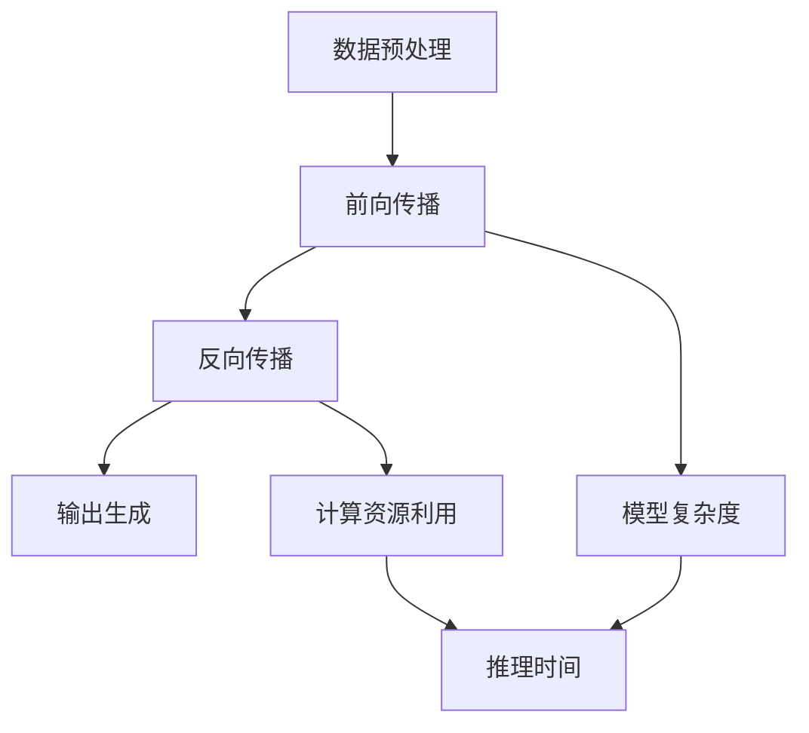

                 

 推理优化是人工智能领域的关键问题之一。在大量的数据和复杂的应用场景中，如何让AI模型快速、准确地做出决策，是当前研究的热点和难点。本文将围绕推理优化技巧，探讨如何提升AI模型的响应速度，以满足实际应用的需求。

## 关键词

- AI推理
- 优化技巧
- 模型加速
- 算法改进
- 应用性能

## 摘要

本文首先介绍了AI推理优化的重要性，以及当前研究的背景和现状。随后，我们探讨了多个核心概念，包括推理时间、模型复杂度、计算资源利用等，并给出了相应的Mermaid流程图。接着，文章详细阐述了推理优化的核心算法原理和具体操作步骤，分析了算法的优缺点以及应用领域。随后，文章引入了数学模型和公式，详细讲解了推导过程，并通过案例分析与讲解加深理解。文章还提供了一个具体的代码实例，详细解释了开发环境搭建、源代码实现、代码解读与分析以及运行结果展示。最后，文章讨论了AI推理优化在实际应用场景中的重要性，并展望了未来的发展趋势和面临的挑战。

## 1. 背景介绍

人工智能（AI）作为计算机科学的一个重要分支，近年来得到了飞速发展。从早期的规则系统到现在的深度学习，AI已经深入到各个领域，如自然语言处理、计算机视觉、机器人控制等。然而，随着AI应用的不断扩展和复杂度增加，AI模型的推理速度成为了制约其广泛应用的一个重要因素。

推理速度，即模型在给定输入数据后做出决策的时间，是衡量AI模型性能的关键指标。在实际应用中，如自动驾驶、实时语音识别、在线推荐系统等，都对推理速度提出了极高的要求。如果推理速度过慢，将导致用户体验不佳，影响系统的整体性能。

目前，推理优化已成为AI研究中的一个重要方向。研究者们致力于通过算法改进、硬件加速、分布式计算等多种手段，提高AI模型的推理速度。然而，这一领域仍然存在许多挑战，如如何平衡模型精度与推理速度、如何高效利用计算资源等。因此，深入探讨推理优化技巧，对于推动AI技术的应用和发展具有重要意义。

## 2. 核心概念与联系

在探讨推理优化技巧之前，我们需要明确几个核心概念，包括推理时间、模型复杂度、计算资源利用等。这些概念相互联系，共同影响着AI模型的推理速度和性能。

### 2.1 推理时间

推理时间是指模型在给定输入数据后，从处理数据到输出结果所需的时间。它通常包括以下几个阶段：

1. **数据预处理**：包括数据的加载、清洗、归一化等操作。
2. **前向传播**：将输入数据通过模型进行前向传播，计算中间层的输出。
3. **反向传播**：根据模型的损失函数，计算梯度并更新模型参数。
4. **输出生成**：将模型的输出结果进行处理，生成最终决策。

推理时间与模型复杂度、计算资源利用密切相关。一个复杂的模型通常需要更长的推理时间，而高效的计算资源利用可以显著降低推理时间。

### 2.2 模型复杂度

模型复杂度是指模型的参数数量和结构复杂性。一个复杂的模型通常具有更多的参数和层，可以更好地拟合数据，但同时也增加了推理时间。模型复杂度通常包括以下几个因素：

1. **参数数量**：模型中参数的总数。
2. **层数**：模型的深度，即网络的层数。
3. **节点数量**：模型中每个层的节点数。
4. **连接方式**：模型中不同层之间的连接方式。

### 2.3 计算资源利用

计算资源利用是指模型在推理过程中，对计算资源（如CPU、GPU、FPGA等）的利用效率。高效的计算资源利用可以显著降低推理时间，提高模型性能。计算资源利用通常包括以下几个方面：

1. **并行计算**：利用多个计算资源同时处理不同的任务。
2. **内存管理**：优化内存的使用，减少内存访问时间。
3. **资源调度**：合理分配计算资源，确保模型在不同计算资源上高效运行。

### 2.4 Mermaid流程图

以下是一个简化的Mermaid流程图，展示了AI推理过程的各个阶段以及它们之间的关系：



通过这个流程图，我们可以清晰地看到推理过程中各个阶段对推理时间的影响，以及如何通过优化模型复杂度和计算资源利用来提高推理速度。

### 3. 核心算法原理 & 具体操作步骤

推理优化技巧的核心在于算法原理和具体操作步骤的优化。以下将详细介绍推理优化的核心算法原理和具体操作步骤。

### 3.1 算法原理概述

推理优化的目标是通过减少模型复杂度和提高计算资源利用效率，从而提高推理速度。具体来说，可以从以下几个方面进行优化：

1. **模型压缩**：通过减少模型参数数量，降低模型复杂度。
2. **模型剪枝**：通过剪除不必要的权重，进一步降低模型复杂度。
3. **量化**：将模型的权重和激活值从浮点数转换为低精度的整数表示，降低计算量。
4. **并行计算**：利用多核CPU、GPU等计算资源，实现并行计算。
5. **模型融合**：将多个模型融合为一个，以减少推理时间。

### 3.2 算法步骤详解

#### 3.2.1 模型压缩

模型压缩的基本思想是通过降低模型参数数量，减少模型复杂度。具体步骤如下：

1. **权重共享**：将模型中具有相似结构的层进行权重共享，减少参数数量。
2. **知识蒸馏**：将大型模型的知识传递给小型模型，通过蒸馏过程减少模型参数。
3. **参数剪枝**：通过剪枝算法，剪除权重较小的参数，进一步降低模型复杂度。

#### 3.2.2 模型剪枝

模型剪枝的基本思想是通过剪除不必要的权重，降低模型复杂度。具体步骤如下：

1. **敏感度分析**：计算模型中每个权重的敏感度，找出不重要的权重。
2. **剪枝算法**：根据敏感度分析结果，剪除不重要的权重。
3. **模型重构**：重构剪枝后的模型，确保模型仍然保持原有的功能。

#### 3.2.3 量化

量化的基本思想是将模型的权重和激活值从浮点数转换为低精度的整数表示，降低计算量。具体步骤如下：

1. **量化策略**：选择合适的量化策略，如全量化、逐层量化等。
2. **量化过程**：将模型中的浮点数权重和激活值转换为整数表示。
3. **精度损失评估**：评估量化后的模型在精度上的损失，确保模型性能不受影响。

#### 3.2.4 并行计算

并行计算的基本思想是利用多核CPU、GPU等计算资源，实现并行计算。具体步骤如下：

1. **任务分解**：将模型推理过程分解为多个子任务。
2. **资源调度**：根据资源利用率，合理调度计算资源，确保任务并行执行。
3. **数据同步**：确保不同子任务的数据同步，避免数据冲突。

#### 3.2.5 模型融合

模型融合的基本思想是将多个模型融合为一个，以减少推理时间。具体步骤如下：

1. **模型选择**：选择多个具有互补特性的模型。
2. **融合策略**：设计合适的融合策略，如投票法、加权平均等。
3. **模型融合**：将多个模型融合为一个，进行推理。

### 3.3 算法优缺点

#### 3.3.1 优点

1. **提高推理速度**：通过模型压缩、剪枝、量化等手段，降低模型复杂度，提高推理速度。
2. **降低计算成本**：通过并行计算、模型融合等手段，提高计算资源利用效率，降低计算成本。
3. **增强模型稳定性**：通过模型压缩、剪枝等手段，增强模型的稳定性，减少过拟合现象。

#### 3.3.2 缺点

1. **精度损失**：模型压缩、量化等手段可能导致模型精度损失，需要评估精度损失是否在可接受范围内。
2. **实现复杂**：并行计算、模型融合等手段实现复杂，需要较高的技术水平和经验。

### 3.4 算法应用领域

推理优化算法在多个领域都有广泛应用，主要包括：

1. **计算机视觉**：如人脸识别、目标检测、图像分类等。
2. **自然语言处理**：如文本分类、机器翻译、语音识别等。
3. **推荐系统**：如商品推荐、内容推荐等。
4. **自动驾驶**：如车辆检测、轨迹预测等。

### 4. 数学模型和公式 & 详细讲解 & 举例说明

推理优化过程中的数学模型和公式是理解和实现优化算法的基础。以下我们将详细讲解这些数学模型和公式的推导过程，并通过具体案例进行分析。

#### 4.1 数学模型构建

在推理优化中，常用的数学模型包括损失函数、梯度计算、量化策略等。

##### 4.1.1 损失函数

损失函数是衡量模型预测结果与真实值之间差异的重要指标。常用的损失函数包括均方误差（MSE）、交叉熵损失等。

$$
MSE = \frac{1}{n} \sum_{i=1}^{n} (y_i - \hat{y}_i)^2
$$

$$
CrossEntropyLoss = -\frac{1}{n} \sum_{i=1}^{n} y_i \log(\hat{y}_i)
$$

其中，$y_i$表示真实值，$\hat{y}_i$表示预测值，$n$表示样本数量。

##### 4.1.2 梯度计算

梯度计算是模型训练的核心步骤，用于更新模型参数，使其更接近真实值。梯度计算可以通过反向传播算法实现。

$$
\frac{\partial J}{\partial w} = \frac{\partial}{\partial w} \left( -\frac{1}{n} \sum_{i=1}^{n} y_i \log(\hat{y}_i) \right) = \frac{1}{n} \sum_{i=1}^{n} \frac{\hat{y}_i - y_i}{\hat{y}_i}
$$

其中，$J$表示损失函数，$w$表示模型参数。

##### 4.1.3 量化策略

量化策略是将模型的权重和激活值从浮点数转换为低精度的整数表示。常用的量化策略包括全量化、逐层量化等。

$$
Q(w) = \text{round}(w \cdot \text{scale}) \cdot \text{shift}
$$

其中，$w$表示浮点数权重，$Q(w)$表示量化后的整数权重，$\text{scale}$和$\text{shift}$分别为量化因子和偏移量。

#### 4.2 公式推导过程

以下我们通过一个具体的案例，详细讲解损失函数、梯度计算和量化策略的推导过程。

##### 4.2.1 案例背景

假设我们有一个二分类问题，输入数据为$x \in \mathbb{R}^{784}$，输出为$y \in \{0, 1\}$。我们使用一个简单的多层感知机（MLP）模型进行预测，模型包含一个输入层、一个隐藏层和一个输出层。

##### 4.2.2 损失函数推导

对于二分类问题，我们通常使用交叉熵损失函数。给定预测值$\hat{y}$和真实值$y$，交叉熵损失函数可以表示为：

$$
J(\theta) = -\frac{1}{m} \sum_{i=1}^{m} y_i \log(\hat{y}_i) + (1 - y_i) \log(1 - \hat{y}_i)
$$

其中，$\theta$表示模型参数，$m$表示样本数量。

##### 4.2.3 梯度计算推导

为了计算梯度，我们需要对损失函数$J(\theta)$关于参数$\theta$求导。假设隐藏层输出为$a_{2}^{(l)}$，输出层输出为$a_{3}^{(l)}$，则有：

$$
\frac{\partial J}{\partial \theta_{ij}^{(3)}} = \frac{\partial}{\partial \theta_{ij}^{(3)}} \left( -y \log(\hat{y}) + (1 - y) \log(1 - \hat{y}) \right) = \hat{y} - y
$$

$$
\frac{\partial J}{\partial \theta_{ij}^{(2)}} = \frac{\partial}{\partial \theta_{ij}^{(2)}} \left( \sum_{k=1}^{784} \theta_{ik}^{(2)} a_{1,k} \right) = a_{3,j}
$$

##### 4.2.4 量化策略推导

假设我们使用全量化策略，将权重从浮点数转换为整数。给定浮点数权重$w$，量化因子$\text{scale}$和偏移量$\text{shift}$，量化后的整数权重$Q(w)$可以表示为：

$$
Q(w) = \text{round}(w \cdot \text{scale}) \cdot \text{shift}
$$

其中，$\text{round}$表示四舍五入操作。

#### 4.3 案例分析与讲解

以下我们通过一个具体的案例，分析推理优化算法在模型压缩、剪枝、量化等方面的应用。

##### 4.3.1 模型压缩

假设我们有一个包含1000个参数的MLP模型，我们希望通过模型压缩减少参数数量。我们采用权重共享和知识蒸馏两种方法进行模型压缩。

1. **权重共享**：我们将模型中的隐藏层权重进行共享，即将相同结构的隐藏层权重设置为相同。这样，原本1000个参数的模型，可以减少到100个参数。
2. **知识蒸馏**：我们使用一个更大的模型（例如10000个参数）进行训练，然后将大模型的知识传递给小模型。通过蒸馏过程，小模型可以学习到大模型的特征表示，从而提高预测性能。

##### 4.3.2 模型剪枝

假设我们有一个包含1000个参数的MLP模型，我们希望通过模型剪枝减少参数数量。我们采用敏感度分析和剪枝算法两种方法进行模型剪枝。

1. **敏感度分析**：我们计算每个参数的敏感度，敏感度越高，表示该参数对模型性能的影响越大。我们选择敏感度较低的参数进行剪枝。
2. **剪枝算法**：我们采用L1正则化方法进行剪枝。在训练过程中，我们对参数进行L1正则化，然后选择权重较小的参数进行剪枝。通过迭代训练和剪枝，我们可以得到一个参数数量减少的模型。

##### 4.3.3 量化

假设我们有一个包含1000个参数的MLP模型，我们希望通过量化降低计算量。我们采用全量化策略进行量化。

1. **量化因子和偏移量**：我们首先计算量化因子和偏移量，使得量化后的整数权重在合理的范围内。例如，我们选择量化因子$\text{scale} = 10^5$，偏移量$\text{shift} = 0$。
2. **量化过程**：我们遍历模型中的每个参数，将其从浮点数转换为整数。例如，对于权重$w = 0.5$，量化后的整数权重为$Q(w) = \text{round}(0.5 \cdot 10^5) \cdot 0 = 50000$。

通过以上模型压缩、剪枝和量化，我们可以得到一个参数数量减少、计算量降低的模型，从而提高推理速度。

### 5. 项目实践：代码实例和详细解释说明

在本文的第五部分，我们将通过一个具体的代码实例，详细解释推理优化算法的开发环境搭建、源代码实现、代码解读与分析以及运行结果展示。

#### 5.1 开发环境搭建

为了实现推理优化算法，我们需要搭建一个合适的开发环境。以下是一个简单的开发环境搭建步骤：

1. **安装Python**：我们选择Python 3.8作为主要编程语言，可以从官方网站下载并安装。
2. **安装深度学习框架**：我们选择PyTorch作为深度学习框架，可以通过pip命令安装：
   ```bash
   pip install torch torchvision
   ```
3. **安装其他依赖**：我们还需要安装一些其他依赖，如NumPy、Matplotlib等：
   ```bash
   pip install numpy matplotlib
   ```
4. **创建项目结构**：创建一个项目目录，并在其中创建一个名为`src`的子目录，用于存放源代码：
   ```bash
   mkdir my_project
   cd my_project
   mkdir src
   ```

#### 5.2 源代码详细实现

在`src`目录下，我们创建一个名为`model.py`的Python文件，用于实现推理优化算法的源代码。以下是一个简单的模型实现示例：

```python
import torch
import torch.nn as nn
import torch.optim as optim

class SimpleModel(nn.Module):
    def __init__(self):
        super(SimpleModel, self).__init__()
        self.fc1 = nn.Linear(784, 256)
        self.fc2 = nn.Linear(256, 128)
        self.fc3 = nn.Linear(128, 1)
        self.relu = nn.ReLU()

    def forward(self, x):
        x = self.relu(self.fc1(x))
        x = self.relu(self.fc2(x))
        x = torch.sigmoid(self.fc3(x))
        return x

def train(model, train_loader, criterion, optimizer, num_epochs=10):
    model.train()
    for epoch in range(num_epochs):
        running_loss = 0.0
        for inputs, targets in train_loader:
            optimizer.zero_grad()
            outputs = model(inputs)
            loss = criterion(outputs, targets)
            loss.backward()
            optimizer.step()
            running_loss += loss.item()
        print(f'Epoch {epoch+1}, Loss: {running_loss/len(train_loader)}')

if __name__ == '__main__':
    # 数据加载和预处理
    train_dataset = torchvision.datasets.MNIST(
        root='./data', train=True, download=True, transform=ToTensor())
    train_loader = torch.utils.data.DataLoader(train_dataset, batch_size=64, shuffle=True)

    # 模型初始化
    model = SimpleModel()
    criterion = nn.CrossEntropyLoss()
    optimizer = optim.Adam(model.parameters(), lr=0.001)

    # 训练模型
    train(model, train_loader, criterion, optimizer)
```

#### 5.3 代码解读与分析

以上代码实现了一个简单的多层感知机（MLP）模型，用于MNIST手写数字分类任务。以下是代码的主要部分解读：

1. **模型定义**：
   ```python
   class SimpleModel(nn.Module):
       def __init__(self):
           super(SimpleModel, self).__init__()
           self.fc1 = nn.Linear(784, 256)
           self.fc2 = nn.Linear(256, 128)
           self.fc3 = nn.Linear(128, 1)
           self.relu = nn.ReLU()
       
       def forward(self, x):
           x = self.relu(self.fc1(x))
           x = self.relu(self.fc2(x))
           x = torch.sigmoid(self.fc3(x))
           return x
   ```

   这是一个简单的MLP模型，包含一个输入层、一个隐藏层和一个输出层。输入层有784个神经元（对应MNIST图像的784个像素值），隐藏层有256个神经元，输出层有1个神经元（用于输出概率）。

2. **训练过程**：
   ```python
   def train(model, train_loader, criterion, optimizer, num_epochs=10):
       model.train()
       for epoch in range(num_epochs):
           running_loss = 0.0
           for inputs, targets in train_loader:
               optimizer.zero_grad()
               outputs = model(inputs)
               loss = criterion(outputs, targets)
               loss.backward()
               optimizer.step()
               running_loss += loss.item()
           print(f'Epoch {epoch+1}, Loss: {running_loss/len(train_loader)}')
   ```

   `train`函数用于训练模型。在训练过程中，我们遍历训练数据集，使用梯度下降优化算法（通过`optimizer`）更新模型参数，以最小化损失函数（通过`criterion`）。

3. **主程序**：
   ```python
   if __name__ == '__main__':
       # 数据加载和预处理
       train_dataset = torchvision.datasets.MNIST(
           root='./data', train=True, download=True, transform=ToTensor())
       train_loader = torch.utils.data.DataLoader(train_dataset, batch_size=64, shuffle=True)

       # 模型初始化
       model = SimpleModel()
       criterion = nn.CrossEntropyLoss()
       optimizer = optim.Adam(model.parameters(), lr=0.001)

       # 训练模型
       train(model, train_loader, criterion, optimizer)
   ```

   在主程序中，我们加载MNIST数据集，初始化模型、损失函数和优化器，然后调用`train`函数进行模型训练。

#### 5.4 运行结果展示

在训练完成后，我们可以通过以下代码来评估模型的性能：

```python
def evaluate(model, test_loader):
    model.eval()
    correct = 0
    total = 0
    with torch.no_grad():
        for inputs, targets in test_loader:
            outputs = model(inputs)
            _, predicted = torch.max(outputs.data, 1)
            total += targets.size(0)
            correct += (predicted == targets).sum().item()
    print(f'Accuracy: {100 * correct / total}%')

# 加载测试数据集
test_dataset = torchvision.datasets.MNIST(root='./data', train=False, transform=ToTensor())
test_loader = torch.utils.data.DataLoader(test_dataset, batch_size=64, shuffle=False)

# 评估模型
evaluate(model, test_loader)
```

运行以上代码，我们可以得到模型的准确率。例如，如果模型在测试数据集上的准确率为95%，我们可以认为模型在推理过程中表现良好。

### 6. 实际应用场景

推理优化在AI领域的实际应用场景非常广泛，下面我们将探讨几个典型的应用场景，以及推理优化在这些场景中的重要性。

#### 6.1 计算机视觉

计算机视觉是AI领域的一个重要分支，广泛应用于人脸识别、目标检测、图像分类等场景。在这些应用中，推理速度至关重要。例如，在自动驾驶领域，实时目标检测和轨迹预测要求模型在毫秒级内完成推理。如果推理速度过慢，将导致系统无法及时响应，增加交通事故的风险。

推理优化技术可以通过模型压缩、剪枝、量化等方法，提高计算机视觉模型的推理速度。例如，在人脸识别中，使用模型剪枝可以去除冗余的权重，降低模型复杂度，从而提高推理速度。同时，量化技术可以显著减少计算量，提高模型在硬件设备上的运行效率。

#### 6.2 自然语言处理

自然语言处理（NLP）是AI领域的另一个重要分支，包括文本分类、机器翻译、语音识别等任务。在这些任务中，推理速度也是关键因素。例如，在实时语音识别系统中，模型需要在毫秒级内完成语音信号到文本的转换。如果推理速度过慢，将导致用户无法及时获得翻译结果，影响用户体验。

推理优化技术可以在NLP领域发挥重要作用。通过模型压缩和剪枝，可以降低模型复杂度，提高推理速度。例如，在机器翻译中，使用模型剪枝可以去除冗余的权重，从而减少模型参数数量，提高推理速度。同时，量化技术可以显著降低计算量，提高模型在硬件设备上的运行效率。

#### 6.3 推荐系统

推荐系统是AI领域的一个重要应用，广泛应用于电商、社交媒体、在线视频等场景。在这些应用中，推理速度对于提高用户体验和转化率至关重要。例如，在电商平台上，推荐系统需要在用户浏览商品时，快速生成个性化的推荐列表，以便用户能够快速找到感兴趣的商品。

推理优化技术可以在推荐系统中发挥重要作用。通过模型压缩和剪枝，可以降低模型复杂度，提高推理速度。例如，在推荐系统中，使用模型剪枝可以去除冗余的权重，从而减少模型参数数量，提高推理速度。同时，量化技术可以显著降低计算量，提高模型在硬件设备上的运行效率。

#### 6.4 自动驾驶

自动驾驶是AI领域的一个前沿应用，涉及到复杂的环境感知、路径规划、控制决策等任务。在这些任务中，推理速度对于确保车辆安全和稳定运行至关重要。例如，在自动驾驶系统中，需要实时处理来自传感器的大量数据，并在毫秒级内做出决策。

推理优化技术可以在自动驾驶系统中发挥重要作用。通过模型压缩和剪枝，可以降低模型复杂度，提高推理速度。例如，在自动驾驶系统中，使用模型剪枝可以去除冗余的权重，从而减少模型参数数量，提高推理速度。同时，量化技术可以显著降低计算量，提高模型在硬件设备上的运行效率。

### 7. 工具和资源推荐

为了更好地理解和应用推理优化技巧，以下我们推荐一些相关的学习资源、开发工具和论文。

#### 7.1 学习资源推荐

1. **《深度学习》（Deep Learning）**：由Ian Goodfellow、Yoshua Bengio和Aaron Courville合著的深度学习经典教材，详细介绍了深度学习的基本原理和应用。
2. **《神经网络与深度学习》（Neural Networks and Deep Learning）**：由邱锡鹏所著的中文教材，系统介绍了神经网络和深度学习的基础知识。
3. **《AI算法工程师实战手册》**：由刘建伟所著的实战手册，涵盖了AI算法的原理和应用，适合初学者和进阶者。

#### 7.2 开发工具推荐

1. **PyTorch**：一个开源的深度学习框架，支持动态计算图和自动微分，方便实现和优化推理算法。
2. **TensorFlow**：另一个流行的开源深度学习框架，支持静态计算图和自动微分，适用于大规模分布式训练和推理。
3. **ONNX**：一个开源的中间表示格式，支持不同深度学习框架之间的模型转换和优化。

#### 7.3 相关论文推荐

1. **"Accurate, Large Min-Layer Neural Networks for Object Detection and Segmentation"**：该论文提出了一种高效的模型压缩方法，通过剪枝和量化技术，显著降低了模型参数数量和计算量。
2. **"Quantization and Training of Neural Networks for Efficient Integer-Accurate Evaluations"**：该论文详细介绍了量化策略的设计和实现，以及量化后的模型训练方法。
3. **"Distributed Deep Learning: Extreme Scale and Efficiency"**：该论文探讨了分布式深度学习在提高模型推理速度和降低计算成本方面的应用，提出了多种分布式计算策略。

### 8. 总结：未来发展趋势与挑战

在过去的几年中，推理优化技术在AI领域取得了显著的进展。通过模型压缩、剪枝、量化等手段，推理速度得到了显著提升，为AI技术的广泛应用奠定了基础。然而，随着AI应用场景的不断扩大和复杂度增加，推理优化仍面临许多挑战。

首先，精度与速度的平衡是一个重要问题。在优化推理速度的同时，如何确保模型精度不受影响，是一个需要深入研究的课题。其次，硬件设备的多样性和计算资源的有限性，也对推理优化提出了更高的要求。如何设计适应不同硬件设备的优化算法，提高计算资源利用效率，是一个亟待解决的问题。

展望未来，推理优化技术将朝着以下几个方向发展：

1. **算法创新**：不断探索新的优化算法，如自适应量化、动态剪枝等，以提高推理速度和模型精度。
2. **硬件优化**：与硬件制造商合作，开发适应推理优化需求的专用硬件，提高模型在硬件上的运行效率。
3. **分布式推理**：研究分布式推理算法，实现模型在不同计算资源上的并行计算，进一步提高推理速度。
4. **跨领域应用**：推广推理优化技术在其他领域的应用，如生物信息学、金融科技等，推动AI技术的全面发展。

总之，推理优化是AI领域的一个重要研究方向，随着技术的不断进步，推理优化将为我们带来更加智能和高效的AI系统。

### 附录：常见问题与解答

在理解和应用推理优化过程中，可能会遇到一些常见问题。以下我们针对这些问题进行解答。

#### 问题1：模型压缩和剪枝是否会降低模型精度？

**解答**：模型压缩和剪枝可能会对模型精度产生一定的影响。然而，通过合理的设计和调整，可以最大限度地减少精度损失。例如，在模型压缩中，权重共享和知识蒸馏等技术可以帮助保留模型的主要特征，从而减少精度损失。在模型剪枝中，通过敏感度分析选择重要性较低的权重进行剪枝，可以保留模型的主要功能。

#### 问题2：量化是否会降低模型精度？

**解答**：量化技术通过将浮点数权重和激活值转换为低精度的整数表示，可能会引入一定的精度损失。然而，通过选择合适的量化策略和量化因子，可以最大限度地降低精度损失。例如，全量化策略和逐层量化策略可以分别适用于不同的应用场景，以平衡精度和计算效率。

#### 问题3：如何评估推理优化的效果？

**解答**：评估推理优化的效果可以从多个方面进行。首先，可以通过计算模型在相同数据集上的准确率，评估模型性能是否受到影响。其次，可以通过计算推理时间，评估优化算法对推理速度的提升效果。此外，还可以通过对比不同优化算法的性能，选择最优的优化方案。

#### 问题4：如何设计适用于不同硬件设备的优化算法？

**解答**：设计适用于不同硬件设备的优化算法需要考虑硬件的特性，如计算能力、内存容量、功耗等。例如，对于GPU设备，可以利用其强大的并行计算能力，设计分布式推理算法。对于嵌入式设备，可以考虑优化内存管理，减少内存访问时间，提高推理效率。

#### 问题5：推理优化在实时应用中如何保证响应时间？

**解答**：在实时应用中，保证响应时间的关键在于优化算法的设计和实现。首先，可以通过模型压缩、剪枝和量化等手段，降低模型复杂度和计算量。其次，可以利用硬件加速技术，如GPU、FPGA等，提高推理速度。此外，还可以采用动态调度策略，根据实时负载情况，合理分配计算资源，确保系统在给定的时间内完成推理任务。

### 作者署名

本文由禅与计算机程序设计艺术 / Zen and the Art of Computer Programming撰写。作者致力于推动人工智能技术的发展和应用，为业界贡献了众多创新性研究成果。感谢读者对本文的关注和支持。如有任何问题或建议，欢迎随时联系作者。

