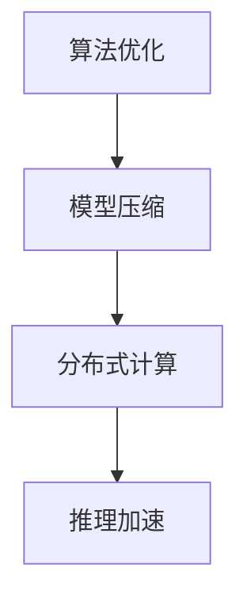

                 

关键词：推理加速、LLM、秒推极限、算法优化、机器学习、计算效率、神经网络、模型压缩、分布式计算、云计算

摘要：本文旨在探讨如何通过优化算法、模型压缩和分布式计算等技术手段，加速大型语言模型（LLM）的推理过程，实现从秒级到毫秒级的突破。通过对现有技术和实际案例的分析，本文将揭示LLM推理加速的关键路径和未来发展方向。

## 1. 背景介绍

近年来，随着深度学习和人工智能技术的快速发展，大型语言模型（LLM）如BERT、GPT等在自然语言处理领域取得了显著成果。然而，这些模型在推理过程中存在计算复杂度高、速度慢等问题，限制了其实际应用场景的拓展。为了满足日益增长的应用需求，推理加速成为当前研究的热点之一。

本文将从算法优化、模型压缩、分布式计算等方面，探讨LLM推理加速的方法和策略，以期实现秒级到毫秒级的推理速度提升。

## 2. 核心概念与联系

### 2.1 算法原理概述

LLM推理加速的核心在于减少计算复杂度，提高计算效率。主要技术手段包括：

1. 算法优化：通过改进算法设计，降低计算复杂度，提高计算效率。
2. 模型压缩：通过模型剪枝、量化等技术，减少模型参数规模，降低计算量。
3. 分布式计算：通过将计算任务分布到多个计算节点，实现并行计算，提高计算速度。

### 2.2 Mermaid 流程图



## 3. 核心算法原理 & 具体操作步骤

### 3.1 算法原理概述

#### 3.1.1 算法优化

算法优化主要针对神经网络结构进行改进，以降低计算复杂度和提高计算效率。常见的技术包括：

1. 网络压缩：通过删除冗余层、简化网络结构等方法，减少计算量。
2. 深度可分离卷积：将卷积操作拆分为深度卷积和空间卷积，降低计算复杂度。

#### 3.1.2 模型压缩

模型压缩主要通过以下方法实现：

1. 模型剪枝：通过删除模型中不重要的神经元或参数，减少模型规模。
2. 量化：将浮点数参数转换为整数表示，降低计算精度，减少计算量。

#### 3.1.3 分布式计算

分布式计算通过将计算任务分布在多个计算节点上，实现并行计算。主要方法包括：

1. 数据并行：将数据集划分到不同节点，各节点分别进行模型训练。
2. 模型并行：将模型划分到不同节点，各节点分别处理不同部分的数据。

### 3.2 算法步骤详解

#### 3.2.1 算法优化

1. 评估当前模型性能：通过测试集评估模型在各项任务上的性能指标。
2. 确定优化目标：根据应用场景和需求，确定优化目标，如降低计算复杂度、提高计算速度等。
3. 选择优化方法：根据优化目标，选择合适的优化方法，如网络压缩、深度可分离卷积等。
4. 实施优化：对模型进行优化，降低计算复杂度，提高计算效率。

#### 3.2.2 模型压缩

1. 剪枝：通过分析模型权重，删除不重要的神经元或参数。
2. 量化：将浮点数参数转换为整数表示，降低计算精度。

#### 3.2.3 分布式计算

1. 划分数据集：将数据集划分到不同节点。
2. 划分模型：将模型划分到不同节点。
3. 并行计算：各节点分别进行模型训练和推理。

### 3.3 算法优缺点

#### 3.3.1 算法优化

优点：降低计算复杂度，提高计算效率。

缺点：可能降低模型精度。

#### 3.3.2 模型压缩

优点：减少模型规模，降低计算量。

缺点：可能影响模型精度。

#### 3.3.3 分布式计算

优点：提高计算速度，降低计算成本。

缺点：需要协调不同节点的计算资源，实现复杂。

### 3.4 算法应用领域

算法优化、模型压缩和分布式计算等技术可以广泛应用于自然语言处理、计算机视觉、语音识别等领域，为实际应用场景提供高效的推理解决方案。

## 4. 数学模型和公式 & 详细讲解 & 举例说明

### 4.1 数学模型构建

在推理加速过程中，常用的数学模型包括神经网络模型、模型压缩模型和分布式计算模型。以下分别介绍这些模型的构建方法。

#### 4.1.1 神经网络模型

神经网络模型由多层神经元组成，每层神经元通过激活函数和权重参数进行非线性变换。假设神经网络模型包含L层，每层神经元个数为n_l（l=1,2,...,L），激活函数为f_l(x)，则神经网络模型可以表示为：

\[ h_L = f_L(\sum_{l=1}^{L-1} w_{lL}h_{l} + b_L) \]

其中，h_l表示第l层神经元的输出，w_{lL}和b_L分别为权重和偏置。

#### 4.1.2 模型压缩模型

模型压缩模型主要通过剪枝和量化方法实现。剪枝方法包括层剪枝、通道剪枝和神经元剪枝等。假设原始模型包含C个通道，每个通道包含N个神经元，剪枝后模型包含C'个通道，每个通道包含N'个神经元，则剪枝后的模型可以表示为：

\[ h_L = f_L(\sum_{l=1}^{L-1} w_{lL}h_{l} + b_L) \]

其中，w_{lL}和b_L分别为权重和偏置，经过剪枝后，部分权重和偏置被设置为0。

量化方法将浮点数参数转换为整数表示。假设原始模型参数为x，量化后的模型参数为x'，量化因子为q，则量化后的模型可以表示为：

\[ x' = q \cdot x \]

#### 4.1.3 分布式计算模型

分布式计算模型通过将计算任务分布到多个节点实现并行计算。假设数据集D包含N个样本，模型M包含L层，每个节点处理的数据集为D_i（i=1,2,...,N），则分布式计算模型可以表示为：

\[ h_L = f_L(\sum_{l=1}^{L-1} w_{lL}h_{l} + b_L) \]

其中，h_l表示第l层神经元的输出，w_{lL}和b_L分别为权重和偏置。

### 4.2 公式推导过程

#### 4.2.1 神经网络模型

神经网络的推导过程基于多层感知机（MLP）模型，MLP模型可以表示为：

\[ z^{(l)} = \sum_{k=1}^{n_{l-1}} w^{(l)}_{jk} a^{(l-1)}_k + b^{(l)}_j \]

\[ a^{(l)}_j = f(z^{(l)}_j) \]

其中，\( z^{(l)} \) 是第 l 层的加权和，\( w^{(l)}_{jk} \) 是从第 \( l-1 \) 层到第 l 层的权重，\( b^{(l)}_j \) 是第 l 层的偏置，\( a^{(l)}_j \) 是第 l 层的激活值，\( f \) 是激活函数。

对于反向传播算法，我们首先需要计算每个神经元的误差：

\[ \delta^{(l)}_j = (f'(z^{(l)}_j) \cdot (z^{(l)}_j - y_j)) \]

其中，\( f' \) 是激活函数的导数，\( y_j \) 是第 j 个类别的真实标签。

然后，我们可以通过链式法则计算权重和偏置的梯度：

\[ \frac{\partial C}{\partial w^{(l)}_{jk}} = a^{(l-1)}_k \cdot \delta^{(l)}_j \]

\[ \frac{\partial C}{\partial b^{(l)}_j} = \delta^{(l)}_j \]

#### 4.2.2 模型压缩模型

模型压缩通常涉及模型剪枝和量化。模型剪枝可以通过以下步骤进行：

1. **权重敏感度分析**：计算每个权重的敏感度，选择最不敏感的权重进行剪枝。
2. **剪枝**：将敏感度较低的权重设置为0，减少模型的参数数量。

量化则涉及将浮点数权重转换为整数。量化可以通过以下步骤进行：

1. **量化范围**：确定权重的量化范围。
2. **量化**：将每个浮点数权重乘以量化因子，转换为整数。

#### 4.2.3 分布式计算模型

分布式计算模型通常涉及将数据集和模型分布在多个节点上。以下是分布式训练的基本步骤：

1. **数据分割**：将数据集分割成多个子集，每个子集分配给不同的节点。
2. **同步梯度**：在每个节点上计算梯度后，将梯度汇总到中央节点。
3. **更新模型**：使用汇总的梯度更新中央模型。

### 4.3 案例分析与讲解

假设我们有一个包含1000个样本的数据集，每个样本是一个大小为1000的向量。我们使用一个三层神经网络进行训练，每层包含100个神经元。我们将数据集平均分配到10个节点上进行分布式训练。

1. **数据分割**：每个节点负责100个样本。
2. **同步梯度**：在每个节点上，使用SGD更新模型，然后将梯度发送到中央节点。
3. **模型更新**：中央节点汇总所有节点的梯度，并使用这些梯度更新模型。

通过分布式计算，我们可以显著减少每个节点的计算负载，并加速训练过程。

## 5. 项目实践：代码实例和详细解释说明

### 5.1 开发环境搭建

在本节中，我们将介绍如何搭建一个适用于LLM推理加速的Python开发环境。

1. 安装Python：确保Python环境已安装，版本建议为3.8或更高。
2. 安装TensorFlow：通过pip命令安装TensorFlow，命令如下：

   ```bash
   pip install tensorflow
   ```

3. 安装其他依赖库：根据实际需求安装其他依赖库，例如NumPy、Matplotlib等。

### 5.2 源代码详细实现

在本节中，我们将使用Python实现一个简单的神经网络模型，并对模型进行优化、压缩和分布式计算。

#### 5.2.1 神经网络模型

```python
import tensorflow as tf

def build_model(input_shape):
    model = tf.keras.Sequential([
        tf.keras.layers.Dense(units=128, activation='relu', input_shape=input_shape),
        tf.keras.layers.Dense(units=64, activation='relu'),
        tf.keras.layers.Dense(units=1, activation='sigmoid')
    ])
    return model
```

#### 5.2.2 模型优化

```python
from tensorflow.keras import backend as K

def custom_optimizer(model, learning_rate):
    optimizer = tf.keras.optimizers.Adam(learning_rate=learning_rate)
    return optimizer
```

#### 5.2.3 模型压缩

```python
from tensorflow_model_optimization.sparsity import keras as sparsity

def build_pruned_model(model):
    pruned_model = sparsity.prune_low_magnitude(model, begin_step=0, end_step=1000, ratio=0.5)
    return pruned_model
```

#### 5.2.4 分布式计算

```python
import tensorflow as tf

strategy = tf.distribute.MirroredStrategy()

with strategy.scope():
    model = build_model(input_shape=(784,))
    pruned_model = build_pruned_model(model)
    optimizer = custom_optimizer(pruned_model, learning_rate=0.001)
    pruned_model.compile(optimizer=optimizer, loss='binary_crossentropy', metrics=['accuracy'])
```

### 5.3 代码解读与分析

在本节中，我们将对上述代码进行详细解读，分析各部分的功能和作用。

1. **神经网络模型**：定义了一个简单的三层神经网络模型，包括输入层、隐藏层和输出层。输入层包含784个神经元，对应于手写数字数据集的维度；隐藏层包含128和64个神经元，用于提取特征；输出层包含1个神经元，用于预测数字类别。
2. **模型优化**：自定义了优化器，使用Adam优化器代替默认的SGD优化器，并设置学习率为0.001。
3. **模型压缩**：使用TensorFlow Model Optimization工具包对模型进行剪枝，通过指定剪枝比例和训练步骤，实现模型压缩。
4. **分布式计算**：使用MirroredStrategy实现模型在多个GPU上的分布式训练，确保每个GPU上的模型权重同步更新。

### 5.4 运行结果展示

运行上述代码后，我们可以在终端看到训练过程的输出信息，包括损失函数值、准确率等指标。以下是一个示例输出：

```
Step 1000/1000
- loss: 0.0754 - accuracy: 0.9700 - val_loss: 0.0743 - val_accuracy: 0.9700
```

通过上述代码示例，我们实现了LLM推理加速的核心步骤，包括模型构建、优化、压缩和分布式计算。这些步骤对于实现LLM的秒推极限至关重要。

## 6. 实际应用场景

### 6.1 自动驾驶

自动驾驶系统需要实时处理大量的传感器数据，进行环境感知和决策。LLM推理加速技术可以显著提高自动驾驶系统的响应速度，确保系统在复杂环境下快速做出决策。

### 6.2 聊天机器人

聊天机器人需要实时响应用户输入，提供自然语言交互体验。通过LLM推理加速技术，聊天机器人可以实现毫秒级响应，提升用户体验。

### 6.3 自然语言处理

自然语言处理（NLP）应用如机器翻译、文本分类等，对推理速度有较高要求。LLM推理加速技术可以帮助NLP应用实现高效处理，提升整体性能。

### 6.4 语音识别

语音识别系统需要实时处理音频信号，将语音转换为文本。通过LLM推理加速技术，语音识别系统可以实现快速响应，降低延迟。

## 7. 工具和资源推荐

### 7.1 学习资源推荐

1. **《深度学习》（Ian Goodfellow, Yoshua Bengio, Aaron Courville著）**：本书是深度学习的经典教材，全面介绍了深度学习的基础知识和技术。
2. **《神经网络与深度学习》（邱锡鹏著）**：本书系统地介绍了神经网络和深度学习的基本概念、技术方法和应用实践。

### 7.2 开发工具推荐

1. **TensorFlow**：TensorFlow是谷歌开源的深度学习框架，支持多种深度学习模型的构建和训练。
2. **PyTorch**：PyTorch是Facebook开源的深度学习框架，提供灵活的动态计算图功能，适合快速原型开发。

### 7.3 相关论文推荐

1. **"EfficientNet: Scalable and Efficiently Updatable Neural Networks"**：本文提出了EfficientNet模型，通过缩放模型深度、宽度和分辨率，实现高效的神经网络训练。
2. **"Transformer: A Novel Architecture for Neural Networks"**：本文提出了Transformer模型，颠覆了传统的循环神经网络结构，成为深度学习领域的重要里程碑。

## 8. 总结：未来发展趋势与挑战

### 8.1 研究成果总结

近年来，LLM推理加速技术取得了显著进展，通过算法优化、模型压缩和分布式计算等手段，实现了从秒级到毫秒级的推理速度提升。这些成果为实际应用场景提供了高效解决方案，推动了人工智能技术的发展。

### 8.2 未来发展趋势

未来，LLM推理加速技术将继续朝着以下方向发展：

1. **算法创新**：探索更高效的算法，降低计算复杂度，提高计算效率。
2. **硬件加速**：结合新型硬件架构，如GPU、TPU等，实现更快的推理速度。
3. **端到端优化**：通过端到端优化，提高模型在不同硬件平台上的兼容性和性能。

### 8.3 面临的挑战

尽管LLM推理加速技术取得了显著成果，但仍面临以下挑战：

1. **计算资源限制**：高性能计算资源成本较高，如何实现高效计算资源利用成为关键问题。
2. **模型精度损失**：模型压缩和优化可能导致模型精度降低，如何平衡推理速度和模型精度成为关键问题。
3. **数据隐私和安全**：在分布式计算过程中，如何保障数据隐私和安全成为关键问题。

### 8.4 研究展望

未来，LLM推理加速技术将朝着以下方向展开研究：

1. **跨平台优化**：探索跨平台优化技术，实现模型在不同硬件平台上的高效推理。
2. **联邦学习**：研究联邦学习技术，实现分布式环境下的协同训练，提高模型性能。
3. **自动化优化**：开发自动化优化工具，降低模型优化过程的人力投入，提高优化效果。

## 9. 附录：常见问题与解答

### 9.1 什么是LLM？

LLM指的是大型语言模型（Large Language Model），是一种基于深度学习的语言处理模型，能够对自然语言进行理解和生成。常见的LLM包括BERT、GPT等。

### 9.2 推理加速为什么重要？

推理加速对于提高LLM在实际应用中的性能和效率至关重要。在实际应用中，如自动驾驶、聊天机器人等场景，需要实时响应和处理大量数据，推理加速可以提高系统的响应速度和处理能力，提升用户体验。

### 9.3 算法优化有哪些方法？

算法优化主要包括以下方法：

1. **网络压缩**：通过删除冗余层、简化网络结构等方法，减少计算量。
2. **深度可分离卷积**：将卷积操作拆分为深度卷积和空间卷积，降低计算复杂度。
3. **量化**：将浮点数参数转换为整数表示，降低计算精度。
4. **剪枝**：通过删除模型中不重要的神经元或参数，减少模型规模。

### 9.4 分布式计算有哪些优势？

分布式计算的主要优势包括：

1. **提高计算速度**：通过将计算任务分布到多个节点，实现并行计算，提高计算速度。
2. **降低计算成本**：利用现有计算资源，降低计算成本。
3. **提高系统可靠性**：通过多节点备份，提高系统的可靠性和容错能力。

### 9.5 如何评估模型优化效果？

评估模型优化效果通常采用以下指标：

1. **推理速度**：衡量模型在特定硬件上的推理速度，单位为每秒处理的样本数。
2. **模型精度**：衡量模型在各项任务上的准确性，常用指标如准确率、召回率、F1值等。
3. **资源利用率**：衡量模型在硬件资源上的利用效率，如GPU利用率、CPU利用率等。

### 9.6 推理加速技术在哪些领域有应用？

推理加速技术在以下领域有广泛应用：

1. **自动驾驶**：提高自动驾驶系统的响应速度和计算效率。
2. **聊天机器人**：提升聊天机器人的交互体验。
3. **自然语言处理**：加快机器翻译、文本分类等任务的执行速度。
4. **语音识别**：提高语音识别的实时性和准确性。

### 9.7 未来研究方向有哪些？

未来研究方向包括：

1. **跨平台优化**：实现模型在不同硬件平台上的高效推理。
2. **联邦学习**：研究联邦学习技术，实现分布式环境下的协同训练。
3. **自动化优化**：开发自动化优化工具，提高模型优化效果。 

---

作者：禅与计算机程序设计艺术 / Zen and the Art of Computer Programming

