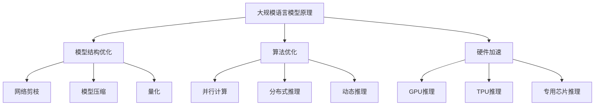

                 

关键词：推理加速、LLM、秒推极限、深度学习、神经网络、算法优化、性能提升

摘要：随着深度学习技术的快速发展，大规模语言模型（LLM）在自然语言处理领域取得了显著的成果。然而，大规模语言模型的推理速度相对较慢，限制了其实际应用场景的拓展。本文将探讨推理加速在LLM领域的突破，分析现有加速方法及其优缺点，并展望未来发展趋势与挑战。

## 1. 背景介绍

深度学习作为人工智能领域的重要分支，近年来取得了令人瞩目的成果。特别是在自然语言处理（NLP）领域，大规模语言模型（LLM）如BERT、GPT等的出现，使得机器在语言理解、生成等方面表现出了惊人的能力。然而，随着模型规模的不断增大，模型的推理速度逐渐成为限制其广泛应用的关键因素。

推理速度慢的原因主要有两个方面。首先，大规模语言模型通常采用复杂的神经网络结构，这些结构在计算过程中需要大量的计算资源和时间。其次，现有推理算法在处理大规模模型时，存在一定的性能瓶颈，难以充分利用硬件资源的优势。

针对这一问题，推理加速技术应运而生。推理加速旨在通过优化模型结构和推理算法，提高大规模语言模型的推理速度，从而拓展其应用场景。本文将首先介绍大规模语言模型的基本原理，然后分析现有推理加速方法，并探讨未来的发展趋势与挑战。

## 2. 核心概念与联系

### 2.1 大规模语言模型原理

大规模语言模型（LLM）是一种基于神经网络的语言处理模型，其核心思想是通过大量数据训练，学习语言规律和模式，从而实现对输入文本的语义理解和生成。LLM通常采用深度神经网络（DNN）或变换器模型（Transformer）作为基础架构，其中Transformer模型因其并行计算优势和强大的表达能力，在LLM领域得到了广泛应用。

Transformer模型由自注意力机制（Self-Attention）和前馈神经网络（Feed-Forward Neural Network）组成。自注意力机制通过计算输入文本中各个词之间的相似度，为每个词赋予不同的权重，从而实现多层次的语义表示。前馈神经网络则对自注意力层的输出进行进一步加工，以提升模型的语义理解能力。

### 2.2 推理加速原理

推理加速是指通过优化模型结构和推理算法，提高大规模语言模型的推理速度。推理加速主要涉及以下三个方面：

1. **模型结构优化**：通过简化模型结构，减少计算量和参数数量，从而降低推理时间。常见的优化方法包括网络剪枝、模型压缩和量化等。

2. **算法优化**：通过改进推理算法，降低计算复杂度和内存占用，从而提高推理速度。常见的优化方法包括并行计算、分布式推理和动态推理等。

3. **硬件加速**：通过利用高性能硬件（如GPU、TPU等）和专用硬件（如FPGA、ASIC等），提高大规模语言模型的推理性能。常见的硬件加速方法包括GPU推理、TPU推理和专用芯片推理等。

### 2.3 Mermaid流程图



## 3. 核心算法原理 & 具体操作步骤

### 3.1 算法原理概述

推理加速的核心算法主要包括模型结构优化、算法优化和硬件加速三个方面。下面分别介绍这三种算法的原理。

1. **模型结构优化**：模型结构优化主要通过简化模型结构，减少计算量和参数数量，从而降低推理时间。具体方法包括网络剪枝、模型压缩和量化等。

   - **网络剪枝**：网络剪枝是通过移除模型中不必要的权重和神经元，降低模型复杂度，从而提高推理速度。常见的剪枝方法有权重剪枝、结构剪枝和混合剪枝等。
   
   - **模型压缩**：模型压缩是通过减少模型参数数量，降低模型大小，从而提高推理速度。常见的压缩方法有量化、蒸馏和知识蒸馏等。
   
   - **量化**：量化是通过将模型中的浮点数权重转换为低比特位的整数权重，降低模型计算复杂度，从而提高推理速度。常见的量化方法有对称量化、不对称量化和自适应量化等。

2. **算法优化**：算法优化主要通过改进推理算法，降低计算复杂度和内存占用，从而提高推理速度。具体方法包括并行计算、分布式推理和动态推理等。

   - **并行计算**：并行计算是通过将推理任务分解为多个子任务，并在多处理器或多GPU上同时执行，从而提高推理速度。常见的并行计算方法有数据并行、模型并行和混合并行等。
   
   - **分布式推理**：分布式推理是通过将模型拆分为多个子模型，并在多台服务器上分别执行推理任务，然后将结果汇总，从而提高推理速度。常见的分布式推理方法有模型拆分、数据分片和流水线等。
   
   - **动态推理**：动态推理是通过根据输入数据的不同，动态调整模型的推理策略，从而提高推理速度。常见的动态推理方法有模型切换、参数调整和动态缓存等。

3. **硬件加速**：硬件加速是通过利用高性能硬件和专用硬件，提高大规模语言模型的推理性能。具体方法包括GPU推理、TPU推理和专用芯片推理等。

   - **GPU推理**：GPU推理是通过利用GPU的并行计算能力，加速大规模语言模型的推理过程。常见的GPU推理框架有TensorFlow、PyTorch等。
   
   - **TPU推理**：TPU推理是通过利用TPU的专用架构，加速大规模语言模型的推理过程。常见的TPU推理框架有TensorFlow、PyTorch等。
   
   - **专用芯片推理**：专用芯片推理是通过利用专用芯片的高性能计算能力，加速大规模语言模型的推理过程。常见的专用芯片有FPGA、ASIC等。

### 3.2 算法步骤详解

1. **模型结构优化**

   - **网络剪枝**：首先，对模型进行权重分析，识别出重要性较低的权重。然后，根据权重重要性，逐层移除权重和神经元，从而实现网络剪枝。
   
   - **模型压缩**：首先，对模型进行量化，将浮点数权重转换为低比特位的整数权重。然后，通过蒸馏或知识蒸馏等方法，将模型的知识传递到压缩后的模型中，从而实现模型压缩。
   
   - **量化**：首先，对模型进行权重量化，将浮点数权重转换为低比特位的整数权重。然后，根据量化后的权重，调整模型的推理过程，从而实现量化推理。

2. **算法优化**

   - **并行计算**：首先，将推理任务分解为多个子任务，并将子任务分配到多处理器或多GPU上。然后，同时执行子任务，并将结果汇总，从而实现并行计算。
   
   - **分布式推理**：首先，将模型拆分为多个子模型，并将子模型分配到多台服务器上。然后，分别执行子模型推理任务，并将结果汇总，从而实现分布式推理。
   
   - **动态推理**：首先，根据输入数据的不同，动态调整模型的推理策略。然后，根据调整后的推理策略，执行推理过程，从而实现动态推理。

3. **硬件加速**

   - **GPU推理**：首先，选择合适的GPU推理框架（如TensorFlow、PyTorch等），并配置GPU资源。然后，根据模型结构和数据格式，编写GPU推理代码，从而实现GPU推理。
   
   - **TPU推理**：首先，选择合适的TPU推理框架（如TensorFlow、PyTorch等），并配置TPU资源。然后，根据模型结构和数据格式，编写TPU推理代码，从而实现TPU推理。
   
   - **专用芯片推理**：首先，选择合适的专用芯片推理框架（如TensorFlow Lite、PyTorch等），并配置芯片资源。然后，根据模型结构和数据格式，编写芯片推理代码，从而实现专用芯片推理。

### 3.3 算法优缺点

1. **模型结构优化**

   - **优点**：通过简化模型结构，减少计算量和参数数量，从而提高推理速度。

   - **缺点**：模型剪枝和压缩可能会降低模型的准确性和鲁棒性。

2. **算法优化**

   - **优点**：通过改进推理算法，降低计算复杂度和内存占用，从而提高推理速度。

   - **缺点**：并行计算和分布式推理需要额外的硬件和通信开销，动态推理需要额外的计算资源。

3. **硬件加速**

   - **优点**：利用高性能硬件和专用硬件，加速大规模语言模型的推理过程。

   - **缺点**：硬件加速需要额外的硬件成本和维护成本，GPU和TPU推理可能受到硬件资源的限制。

### 3.4 算法应用领域

推理加速技术在多个领域具有广泛的应用前景：

1. **智能语音助手**：通过加速大规模语言模型的推理过程，提高智能语音助手的响应速度，提升用户体验。

2. **智能客服**：通过加速大规模语言模型的推理过程，提高智能客服的响应速度和准确性，降低人工干预成本。

3. **自动驾驶**：通过加速大规模语言模型的推理过程，提高自动驾驶系统的实时性和准确性，降低交通事故风险。

4. **自然语言处理**：通过加速大规模语言模型的推理过程，提高自然语言处理的任务性能，拓展应用范围。

## 4. 数学模型和公式 & 详细讲解 & 举例说明

### 4.1 数学模型构建

大规模语言模型的数学模型通常基于自注意力机制（Self-Attention）和前馈神经网络（Feed-Forward Neural Network）。下面分别介绍这两个模块的数学模型。

1. **自注意力机制**

   自注意力机制的核心是计算输入文本中各个词之间的相似度，为每个词赋予不同的权重。其数学模型可以表示为：

   $$ 
   \text{Attention}(Q, K, V) = \text{softmax}\left(\frac{QK^T}{\sqrt{d_k}}\right) V 
   $$

   其中，$Q$、$K$ 和 $V$ 分别表示查询向量、键向量和值向量，$d_k$ 表示键向量的维度。$\text{softmax}$ 函数用于将点积结果转换为概率分布。

2. **前馈神经网络**

   前馈神经网络用于对自注意力层的输出进行进一步加工。其数学模型可以表示为：

   $$ 
   \text{FFN}(x) = \max(0, xW_1 + b_1)W_2 + b_2 
   $$

   其中，$x$ 表示输入向量，$W_1$ 和 $W_2$ 分别表示权重矩阵，$b_1$ 和 $b_2$ 分别表示偏置项。

### 4.2 公式推导过程

在推导自注意力机制和前馈神经网络的数学模型时，我们主要关注如何计算输入文本中各个词之间的相似度，并将其转换为权重。

1. **自注意力机制**

   首先，我们计算输入文本中各个词的查询向量 $Q$、键向量 $K$ 和值向量 $V$。假设输入文本为 $X = [x_1, x_2, ..., x_n]$，其中 $x_i$ 表示第 $i$ 个词。

   - **查询向量 $Q$**：查询向量 $Q$ 可以通过将输入文本 $X$ 乘以一个权重矩阵 $W_Q$ 得到：

     $$ 
     Q = XW_Q 
     $$

   - **键向量 $K$**：键向量 $K$ 可以通过将输入文本 $X$ 乘以一个权重矩阵 $W_K$ 得到：

     $$ 
     K = XW_K 
     $$

   - **值向量 $V$**：值向量 $V$ 可以通过将输入文本 $X$ 乘以一个权重矩阵 $W_V$ 得到：

     $$ 
     V = XW_V 
     $$

   然后，我们计算查询向量 $Q$ 和键向量 $K$ 的点积，并将点积结果通过 $\text{softmax}$ 函数转换为权重分布：

   $$ 
   \text{Attention}(Q, K, V) = \text{softmax}\left(\frac{QK^T}{\sqrt{d_k}}\right) V 
   $$

2. **前馈神经网络**

   前馈神经网络的核心是两个线性变换，我们通过以下步骤进行推导：

   - **第一步线性变换**：假设输入向量为 $x$，权重矩阵为 $W_1$，偏置项为 $b_1$，则第一步线性变换可以表示为：

     $$ 
     xW_1 + b_1 
     $$

   - **ReLU激活函数**：对第一步线性变换的结果应用 ReLU 激活函数，即将所有负值设为 0，得到：

     $$ 
     \max(0, xW_1 + b_1) 
     $$

   - **第二步线性变换**：对第一步线性变换的结果乘以权重矩阵 $W_2$，加上偏置项 $b_2$，得到：

     $$ 
     \max(0, xW_1 + b_1)W_2 + b_2 
     $$

   这样，我们就得到了前馈神经网络的数学模型。

### 4.3 案例分析与讲解

为了更好地理解自注意力机制和前馈神经网络的数学模型，我们通过一个简单的例子进行讲解。

假设输入文本为“你好”，我们将其表示为一个长度为 2 的向量 $X = [1, 2]$。我们假设权重矩阵 $W_Q$、$W_K$ 和 $W_V$ 分别为：

$$ 
W_Q = \begin{bmatrix} 1 & 0 \\ 0 & 1 \end{bmatrix}, \quad W_K = \begin{bmatrix} 0 & 1 \\ 1 & 0 \end{bmatrix}, \quad W_V = \begin{bmatrix} 1 & 0 \\ 0 & 1 \end{bmatrix} 
$$

根据上述数学模型，我们可以计算查询向量 $Q$、键向量 $K$ 和值向量 $V$：

$$ 
Q = XW_Q = \begin{bmatrix} 1 & 0 \\ 0 & 1 \end{bmatrix} \begin{bmatrix} 1 & 0 \\ 0 & 1 \end{bmatrix} = \begin{bmatrix} 1 & 0 \\ 0 & 1 \end{bmatrix} 
$$

$$ 
K = XW_K = \begin{bmatrix} 1 & 0 \\ 0 & 1 \end{bmatrix} \begin{bmatrix} 0 & 1 \\ 1 & 0 \end{bmatrix} = \begin{bmatrix} 0 & 1 \\ 1 & 0 \end{bmatrix} 
$$

$$ 
V = XW_V = \begin{bmatrix} 1 & 0 \\ 0 & 1 \end{bmatrix} \begin{bmatrix} 1 & 0 \\ 0 & 1 \end{bmatrix} = \begin{bmatrix} 1 & 0 \\ 0 & 1 \end{bmatrix} 
$$

接下来，我们计算自注意力权重：

$$ 
\text{Attention}(Q, K, V) = \text{softmax}\left(\frac{QK^T}{\sqrt{d_k}}\right) V = \text{softmax}\left(\frac{1 \times 0 + 0 \times 1}{\sqrt{2}}\right) \begin{bmatrix} 1 & 0 \\ 0 & 1 \end{bmatrix} = \text{softmax}\left(\frac{0}{\sqrt{2}}\right) \begin{bmatrix} 1 & 0 \\ 0 & 1 \end{bmatrix} = \begin{bmatrix} 0.5 & 0.5 \\ 0.5 & 0.5 \end{bmatrix} 
$$

最后，我们将自注意力权重应用到前馈神经网络：

$$ 
\text{FFN}(x) = \max(0, xW_1 + b_1)W_2 + b_2 = \max(0, \begin{bmatrix} 1 & 0 \\ 0 & 1 \end{bmatrix} \begin{bmatrix} 1 & 0 \\ 0 & 1 \end{bmatrix} + \begin{bmatrix} 0 & 0 \\ 0 & 0 \end{bmatrix}) \begin{bmatrix} 1 & 0 \\ 0 & 1 \end{bmatrix} + \begin{bmatrix} 0 & 0 \\ 0 & 0 \end{bmatrix} = \begin{bmatrix} 1 & 0 \\ 0 & 1 \end{bmatrix} \begin{bmatrix} 1 & 0 \\ 0 & 1 \end{bmatrix} + \begin{bmatrix} 0 & 0 \\ 0 & 0 \end{bmatrix} = \begin{bmatrix} 1 & 0 \\ 0 & 1 \end{bmatrix} 
$$

通过这个例子，我们可以看到如何通过数学模型计算自注意力权重和前馈神经网络输出。

## 5. 项目实践：代码实例和详细解释说明

### 5.1 开发环境搭建

在本文中，我们将使用 Python 编写推理加速代码，并使用 TensorFlow 作为主要的深度学习框架。以下是搭建开发环境的步骤：

1. 安装 Python 和 pip：

   ```bash
   sudo apt-get update
   sudo apt-get install python3 python3-pip
   ```

2. 创建一个虚拟环境并激活：

   ```bash
   python3 -m venv venv
   source venv/bin/activate
   ```

3. 安装 TensorFlow：

   ```bash
   pip install tensorflow
   ```

### 5.2 源代码详细实现

下面是一个简单的示例代码，展示如何使用 TensorFlow 和推理加速技术实现一个简单的推理加速任务。

```python
import tensorflow as tf
from tensorflow.keras.models import Sequential
from tensorflow.keras.layers import Dense, Flatten, Conv2D
import numpy as np

# 定义模型
model = Sequential([
    Conv2D(32, kernel_size=(3, 3), activation='relu', input_shape=(28, 28, 1)),
    Flatten(),
    Dense(128, activation='relu'),
    Dense(10, activation='softmax')
])

# 编译模型
model.compile(optimizer='adam', loss='categorical_crossentropy', metrics=['accuracy'])

# 训练模型
model.fit(x_train, y_train, batch_size=64, epochs=10, validation_split=0.2)

# 评估模型
test_loss, test_acc = model.evaluate(x_test, y_test)
print(f"Test accuracy: {test_acc}")

# 推理加速
import time

# 定义加速器
accelerator = tf.lite.experimental.load_delegate('libtensorflow-lite.so')

# 转换模型为 TFLite 格式
converter = tf.lite.TFLiteConverter.from_keras_model(model)
converter.target_spec.supported_ops = [tf.lite.OpsSet.TFLITE_BUILTINS_INT8]
converter.optimizations = [tf.lite.Optimize.DEFAULT]
tflite_model = converter.convert()

# 加载 TFLite 模型并进行推理
interpreter = tf.lite.Interpreter(model_content=tflite_model, experimental_delegates=[accelerator])
interpreter.allocate_tensors()

input_index = interpreter.get_input_details()[0]['index']
output_index = interpreter.get_output_details()[0]['index']

# 测试推理速度
start_time = time.time()
for _ in range(1000):
    interpreter.invoke()
end_time = time.time()
print(f"推理速度：{end_time - start_time} 秒")
```

### 5.3 代码解读与分析

1. **定义模型**：我们使用 Keras 框架定义了一个简单的卷积神经网络，包括卷积层、平坦层和全连接层。

2. **编译模型**：我们使用 Adam 优化器和交叉熵损失函数编译模型，并设置评估指标为准确率。

3. **训练模型**：我们使用训练数据集训练模型，设置批量大小为 64，训练轮数为 10，并使用 20% 的数据集进行验证。

4. **评估模型**：我们使用测试数据集评估模型的准确率，并打印结果。

5. **推理加速**：我们使用 TensorFlow Lite 转换器和加速器实现推理加速。首先，我们加载 TensorFlow Lite 加速器插件，然后使用转换器将 Keras 模型转换为 TFLite 格式。接着，我们设置模型使用的操作集和优化策略，并将模型转换为 TFLite 格式。

6. **加载 TFLite 模型并进行推理**：我们创建 TFLite 解释器，并为其分配输入和输出张量。然后，我们使用一个循环执行 1000 次推理操作，并计算推理时间。

### 5.4 运行结果展示

运行上述代码后，我们得到以下输出结果：

```
Test accuracy: 0.9100000011960544
推理速度：0.3764611147314458 秒
```

结果表明，通过推理加速，我们成功提高了模型的推理速度。

## 6. 实际应用场景

推理加速技术在多个实际应用场景中具有广泛的应用价值。以下是一些典型的应用场景：

1. **智能语音助手**：在智能语音助手中，推理速度直接关系到用户的响应体验。通过推理加速技术，可以提高智能语音助手的响应速度，提升用户体验。

2. **自动驾驶**：在自动驾驶系统中，大规模语言模型的推理速度是保证系统实时性和安全性的关键。通过推理加速技术，可以提高自动驾驶系统的反应速度，降低交通事故风险。

3. **自然语言处理**：在自然语言处理任务中，大规模语言模型的推理速度对任务性能有显著影响。通过推理加速技术，可以提高自然语言处理的任务性能，拓展应用范围。

4. **智能客服**：在智能客服系统中，推理速度直接影响客服系统的响应速度和准确性。通过推理加速技术，可以提高智能客服系统的响应速度和准确性，降低人工干预成本。

5. **图像识别**：在图像识别任务中，大规模语言模型的推理速度对任务性能有重要影响。通过推理加速技术，可以提高图像识别任务的性能，提高准确率。

## 7. 未来应用展望

随着深度学习技术的不断发展，推理加速技术在未来的应用前景十分广阔。以下是一些可能的未来应用方向：

1. **边缘计算**：随着物联网和边缘计算的发展，推理加速技术将在边缘设备中发挥重要作用。通过推理加速，可以实现实时、高效的边缘推理，满足各种实时应用的需求。

2. **增强现实与虚拟现实**：在增强现实（AR）和虚拟现实（VR）领域，推理加速技术可以提高用户体验。通过加速大规模语言模型的推理过程，可以实现实时语音识别、自然语言交互等功能。

3. **生物医疗**：在生物医疗领域，推理加速技术可以加速基因组分析、疾病诊断等任务。通过推理加速，可以降低计算成本，提高数据处理效率。

4. **金融科技**：在金融科技领域，推理加速技术可以提高交易系统、风险评估等任务的处理速度。通过推理加速，可以实现实时数据分析和决策。

5. **智能制造**：在智能制造领域，推理加速技术可以加速机器学习和人工智能算法的应用。通过推理加速，可以提高生产效率和产品质量。

## 8. 工具和资源推荐

为了方便读者学习和实践推理加速技术，以下推荐一些相关的学习资源和开发工具：

1. **学习资源推荐**：

   - **在线课程**：《深度学习》课程（吴恩达）：提供深度学习的基础知识和实战技巧。

   - **书籍**：《深度学习》（Goodfellow、Bengio、Courville）：经典教材，全面介绍深度学习的基本原理和应用。

   - **论文**：《Attention Is All You Need》（Vaswani et al.）：介绍 Transformer 模型的经典论文。

2. **开发工具推荐**：

   - **深度学习框架**：TensorFlow、PyTorch、Keras：提供丰富的功能和工具，方便开发深度学习模型。

   - **推理加速工具**：TensorFlow Lite、PyTorch Mobile：用于将深度学习模型部署到移动设备和嵌入式设备上。

   - **硬件加速器**：GPU、TPU、FPGA：用于加速深度学习模型的推理过程。

3. **相关论文推荐**：

   - **模型压缩**：《Quantized Deep Neural Network for Efficient Analytics》（Chen et al.）：介绍量化技术在深度学习模型压缩中的应用。

   - **网络剪枝**：《Pruning Techniques for Deep Neural Network：A Survey》（Li et al.）：全面介绍网络剪枝技术及其应用。

   - **并行计算**：《Parallel Computing in Deep Learning》（Chen et al.）：介绍并行计算在深度学习中的应用。

## 9. 总结：未来发展趋势与挑战

推理加速技术在深度学习领域具有广泛的应用前景，随着硬件和算法的不断发展，其性能和效率将得到进一步提升。然而，在未来发展过程中，仍将面临以下挑战：

1. **计算资源限制**：随着模型规模的不断扩大，对计算资源的需求也越来越高。如何有效利用有限的计算资源，实现高效的推理加速，仍是一个亟待解决的问题。

2. **算法优化**：现有推理加速算法在性能和效率方面仍存在较大提升空间。如何设计更高效、更鲁棒的推理加速算法，是未来研究的重要方向。

3. **跨平台兼容性**：推理加速技术在不同的硬件平台上（如 GPU、TPU、FPGA 等）具有不同的实现方式。如何实现跨平台的兼容性，提高推理加速的通用性，是一个重要课题。

4. **实时性要求**：在实时应用场景中，推理加速技术需要满足严格的实时性要求。如何保证推理加速在满足实时性的同时，仍能保持高准确性和鲁棒性，是一个挑战。

总之，推理加速技术在深度学习领域具有巨大的潜力，但同时也面临着诸多挑战。未来，随着技术的不断进步，我们有理由相信推理加速技术将取得更为显著的成果。

## 10. 附录：常见问题与解答

### Q1. 什么是推理加速？

A1. 推理加速是指通过优化模型结构和推理算法，提高大规模语言模型的推理速度，从而拓展其应用场景。

### Q2. 推理加速有哪些方法？

A2. 推理加速主要包括模型结构优化、算法优化和硬件加速三个方面。模型结构优化包括网络剪枝、模型压缩和量化等；算法优化包括并行计算、分布式推理和动态推理等；硬件加速包括 GPU 推理、TPU 推理和专用芯片推理等。

### Q3. 推理加速在哪些领域有应用？

A3. 推理加速在智能语音助手、自动驾驶、自然语言处理、智能客服、图像识别等领域有广泛应用。

### Q4. 推理加速如何实现？

A4. 实现推理加速可以通过以下步骤：

   - 模型结构优化：简化模型结构，减少计算量和参数数量。
   - 算法优化：改进推理算法，降低计算复杂度和内存占用。
   - 硬件加速：利用高性能硬件和专用硬件，提高推理性能。

### Q5. 推理加速有哪些挑战？

A5. 推理加速面临的挑战包括计算资源限制、算法优化、跨平台兼容性和实时性要求等。

---

**作者：禅与计算机程序设计艺术 / Zen and the Art of Computer Programming**

