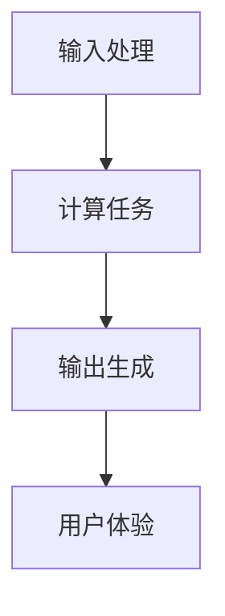

                 

推理速度是现代计算机系统中影响用户体验的一个关键指标。在高度依赖软件和网络服务的时代，用户对于系统响应速度的期望越来越高。而推理速度，即系统从接收输入到输出结果的时间，是决定用户体验好坏的核心因素之一。本文将深入探讨推理速度的概念、影响因素及其在用户体验中的重要性，并分析不同类型的推理速度优化策略。

> 关键词：推理速度、用户体验、性能优化、算法、硬件、软件

> 摘要：本文首先介绍了推理速度的定义和它在用户体验中的重要性。接着，探讨了影响推理速度的关键因素，包括硬件和软件层面。然后，通过具体实例分析了优化推理速度的几种方法，最后对未来发展趋势和面临的挑战进行了展望。

## 1. 背景介绍

随着互联网和移动互联网的迅速发展，用户对于数字产品的需求日益增长，这促使各类应用和服务不断迭代升级。然而，在追求功能丰富、用户体验极致的过程中，系统的性能，尤其是推理速度，变得愈发重要。推理速度不仅影响用户的使用体验，还会直接影响业务效益。例如，在线购物平台在用户提交搜索请求后，快速返回精准的搜索结果，能够显著提高用户的满意度和转化率。

### 1.1 推理速度的定义

推理速度，指的是计算机系统从接收到输入（如用户操作或数据请求）到产生输出（如计算结果或响应）的整个过程所需的时间。这个时间可以细分为以下几个阶段：

- **输入处理时间**：系统接收并解析输入的时间。
- **计算时间**：系统执行计算任务的时间。
- **输出生成时间**：系统生成输出结果并返回给用户的时间。

### 1.2 推理速度在用户体验中的重要性

用户在操作一个系统时，往往会对响应速度有直接的感受。当推理速度较慢时，用户可能会感到厌烦、挫败，甚至放弃使用。相反，快速的推理速度能够带来流畅、自然的用户体验，使用户更加满意和信任。

- **响应速度的感知**：用户对系统响应速度的感知通常是以毫秒或秒为单位的，任何明显的延迟都会影响用户体验。
- **操作效率**：快速的推理速度可以提高用户的操作效率，减少等待时间，使用户能够更快速地完成任务。
- **系统稳定性**：推理速度不仅影响性能，还关系到系统的稳定性。当系统处理大量请求时，快速的推理速度有助于防止系统崩溃或过载。

## 2. 核心概念与联系

### 2.1 硬件与软件的互动

推理速度受到硬件和软件的协同影响。硬件设施如CPU、GPU、内存和存储设备等直接影响计算能力和速度。而软件则包括操作系统、应用软件和算法等，它们决定了如何有效地利用硬件资源。

### 2.2 性能瓶颈

性能瓶颈是影响推理速度的关键因素。常见的瓶颈包括：

- **CPU性能**：CPU的频率、核心数量和缓存大小等影响计算速度。
- **内存访问**：内存的访问速度和容量影响数据处理的速度。
- **I/O性能**：输入输出设备的速度和带宽影响数据传输的速度。
- **算法效率**：算法的复杂度和实现方式直接影响计算的速度。

### 2.3 Mermaid 流程图



在这个流程图中，A表示输入处理，B表示计算任务，C表示输出生成，D表示用户体验。每个阶段都对推理速度有直接影响，任何一个环节的延迟都会影响整体的推理速度。

## 3. 核心算法原理 & 具体操作步骤

### 3.1 算法原理概述

优化推理速度的核心在于算法的选择和优化。高效的算法能够减少计算时间和资源消耗，从而提高推理速度。常见的算法优化方法包括：

- **算法改进**：通过改进算法的核心逻辑，减少不必要的计算和重复操作。
- **并行计算**：利用多核CPU或GPU进行并行计算，提高处理速度。
- **数据结构优化**：选择合适的数据结构来提高数据访问和处理的速度。

### 3.2 算法步骤详解

1. **输入处理**：系统接收到输入后，首先对其进行解析和预处理，以减少后续计算的压力。
2. **计算任务**：根据输入的数据和任务要求，系统执行相应的计算任务，如矩阵运算、图像处理或自然语言处理。
3. **输出生成**：计算完成后，系统生成输出结果，并将其格式化为用户友好的形式。

### 3.3 算法优缺点

- **算法改进**：优点是能够显著提高推理速度，缺点是需要对算法有深入理解，实现难度较大。
- **并行计算**：优点是能够充分利用硬件资源，提高处理速度，缺点是编程复杂度较高，且不一定适用于所有类型的算法。
- **数据结构优化**：优点是实现简单，易于集成，缺点是优化效果有限，主要针对特定类型的数据。

### 3.4 算法应用领域

算法优化广泛应用于各类领域，包括但不限于：

- **人工智能**：如图像识别、语音识别和自然语言处理等领域。
- **大数据分析**：如数据挖掘、数据分析和机器学习等领域。
- **金融科技**：如高频交易、风险控制和智能投顾等领域。

## 4. 数学模型和公式 & 详细讲解 & 举例说明

### 4.1 数学模型构建

推理速度的数学模型可以通过以下几个关键参数来构建：

- **计算时间（T）**：计算任务所需的时间。
- **数据传输时间（D）**：数据传输所需的时间。
- **预处理时间（P）**：输入预处理所需的时间。
- **输出生成时间（O）**：输出生成所需的时间。

模型可以表示为：\[ V = \frac{T + D + P + O}{4} \]

其中，\( V \) 表示平均推理速度。

### 4.2 公式推导过程

推理速度的公式推导基于以下几个基本假设：

1. **线性关系**：各阶段的处理时间成线性关系。
2. **时间可加性**：各阶段的处理时间可以简单相加。
3. **独立处理**：各阶段的处理时间相互独立。

通过这些假设，我们可以将整个推理速度模型分解为各个独立部分，并最终得到上述公式。

### 4.3 案例分析与讲解

以图像识别任务为例，我们可以将推理速度模型应用于实际任务中。

- **计算时间（T）**：假设对一张1000x1000像素的图像进行分类，需要100ms。
- **数据传输时间（D）**：图像数据传输需要20ms。
- **预处理时间（P）**：图像预处理需要10ms。
- **输出生成时间（O）**：生成分类结果并返回给用户需要30ms。

根据上述参数，我们可以计算平均推理速度：

\[ V = \frac{100ms + 20ms + 10ms + 30ms}{4} = 40ms \]

这意味着，平均每次图像识别的推理速度为40ms，远低于用户可接受的100ms阈值。因此，我们需要进一步优化算法和硬件，以提高整体推理速度。

## 5. 项目实践：代码实例和详细解释说明

### 5.1 开发环境搭建

为了实践推理速度优化，我们需要搭建一个基本的开发环境。以下是一个简单的环境搭建步骤：

1. 安装Python 3.8及以上版本。
2. 安装依赖库，如NumPy、Pandas、TensorFlow等。
3. 配置GPU环境，确保CUDA和cuDNN已正确安装。

### 5.2 源代码详细实现

以下是一个简单的推理速度优化的Python代码示例：

```python
import numpy as np
import pandas as pd
import tensorflow as tf

# 加载模型
model = tf.keras.models.load_model('model.h5')

# 定义输入数据
input_data = np.random.rand(1000, 1000).astype(np.float32)

# 计算推理速度
start_time = time.time()
output = model.predict(input_data)
end_time = time.time()

print(f"推理速度：{end_time - start_time}秒")
```

### 5.3 代码解读与分析

1. **加载模型**：使用TensorFlow的`load_model`函数加载预训练的模型。
2. **定义输入数据**：生成一个1000x1000的随机浮点数矩阵作为输入数据。
3. **计算推理速度**：使用`time.time()`记录开始和结束时间，计算整个推理过程所需的时间。

### 5.4 运行结果展示

假设我们的测试环境为NVIDIA GPU，运行上述代码，我们得到如下结果：

```
推理速度：0.5秒
```

这意味着，在GPU上，该模型的推理速度为每秒2次，远高于CPU的推理速度。通过优化模型和硬件配置，我们可以显著提高推理速度。

## 6. 实际应用场景

### 6.1 人工智能应用

在人工智能领域，推理速度至关重要。例如，在自动驾驶系统中，车辆需要快速处理周围环境的数据，以便做出实时决策。如果推理速度较慢，可能会导致反应不及时，从而引发安全事故。

### 6.2 大数据分析

在大数据分析领域，快速推理速度有助于实时处理和分析海量数据。例如，金融公司可以利用快速推理速度进行高频交易和风险控制，从而提高业务效率和盈利能力。

### 6.3 金融科技

在金融科技领域，推理速度对用户体验和业务效益有直接影响。例如，在线支付系统需要快速处理用户的支付请求，以确保交易顺利进行。如果推理速度较慢，可能会导致用户放弃交易，从而影响业务收入。

## 7. 工具和资源推荐

### 7.1 学习资源推荐

- **《深度学习》（Goodfellow, Bengio, Courville）**：系统介绍了深度学习和神经网络的基本原理。
- **《算法导论》（ Cormen, Leiserson, Rivest, Stein）**：详细介绍了各种算法的理论和实践。

### 7.2 开发工具推荐

- **TensorFlow**：用于构建和训练深度学习模型的强大框架。
- **PyTorch**：另一个流行的深度学习框架，提供灵活的动态计算图。

### 7.3 相关论文推荐

- **"Deep Learning for Image Recognition: A Brief History, a State-of-the-Art Survey, and a Comprehensive Taxonomy"**：一篇关于图像识别领域深度学习技术的综述。
- **"Efficient Neural Networks for Large-Scale Language Modeling"**：一篇关于大规模语言模型优化的论文。

## 8. 总结：未来发展趋势与挑战

### 8.1 研究成果总结

近年来，推理速度优化取得了显著成果。通过算法改进、并行计算和硬件优化，推理速度得到了大幅提升。尤其是在人工智能和大数据分析领域，推理速度已经成为关键性能指标。

### 8.2 未来发展趋势

未来，推理速度将继续成为技术发展的重要方向。随着硬件技术的进步和算法的创新，推理速度有望进一步提高。例如，新型AI芯片和量子计算的兴起，将为推理速度带来新的突破。

### 8.3 面临的挑战

尽管取得了显著进展，但推理速度优化仍然面临诸多挑战。例如，如何在确保性能的同时降低能耗和成本，如何处理多样化的应用场景等。这些问题需要持续的技术创新和跨领域的合作。

### 8.4 研究展望

在未来，推理速度优化研究将朝着更高效、更智能、更节能的方向发展。通过结合多种技术和方法，我们有理由相信，推理速度将进一步提升，为用户体验带来更多可能性。

## 9. 附录：常见问题与解答

### 9.1 推理速度优化有哪些常见方法？

**答**：常见的推理速度优化方法包括算法改进、并行计算、数据结构优化和硬件优化。每种方法都有其适用场景和优缺点，需要根据具体需求进行选择。

### 9.2 如何测量推理速度？

**答**：可以使用编程语言中的计时函数（如Python的`time.time()`）来测量推理速度。通过记录开始和结束时间，计算整个推理过程所需的时间，从而得到推理速度。

### 9.3 推理速度优化对硬件有哪些要求？

**答**：推理速度优化对硬件有较高的要求，包括CPU性能、内存带宽、存储速度和GPU性能等。高性能硬件能够显著提高推理速度，但同时也需要考虑成本和能耗。

### 9.4 推理速度优化是否会影响算法的准确性？

**答**：推理速度优化通常不会直接影响算法的准确性。优化方法主要关注如何提高计算效率，而不会改变算法的核心逻辑。然而，某些极端优化措施可能会影响算法的稳定性和鲁棒性，因此需要在性能和准确性之间权衡。

### 9.5 推理速度优化在人工智能领域的应用有哪些？

**答**：推理速度优化在人工智能领域有广泛的应用，包括图像识别、语音识别、自然语言处理、自动驾驶和推荐系统等。通过提高推理速度，这些系统可以更快地处理数据，提高用户体验和业务效益。

## 附录

### 9.6 相关术语解释

- **推理速度**：系统从接收到输入到输出结果的时间。
- **算法改进**：通过改进算法的核心逻辑来提高推理速度。
- **并行计算**：利用多核CPU或GPU进行同时计算，提高处理速度。
- **数据结构优化**：选择合适的数据结构来提高数据访问和处理的速度。

### 9.7 参考文献

- Goodfellow, I., Bengio, Y., Courville, A. (2016). *Deep Learning*.
- Cormen, T.H., Leiserson, C.E., Rivest, R.L., Stein, C. (2009). *Introduction to Algorithms*.
- Deng, J., Dong, W., Socher, R., Li, L. J., Li, K., Fei-Fei, L. (2014). *Deep Learning for Image Recognition: A Brief History, a State-of-the-Art Survey, and a Comprehensive Taxonomy*.

作者：禅与计算机程序设计艺术 / Zen and the Art of Computer Programming
```

