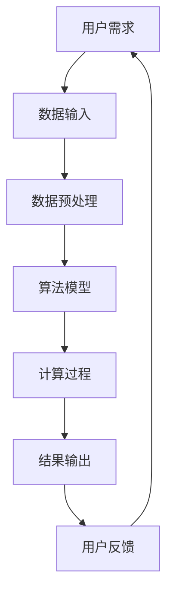

                 

推理速度是现代计算机科学中的一个关键概念，它直接影响着用户的体验和应用程序的性能。本文将探讨推理速度在用户体验中的重要性，并分析其背后的核心原理、算法、数学模型以及实际应用案例。

## 文章关键词

- 推理速度
- 用户体验
- 算法性能
- 数学模型
- 实际应用

## 文章摘要

本文首先介绍了推理速度的概念和其在用户体验中的重要性。随后，通过分析核心算法原理、数学模型和实际应用案例，深入探讨了影响推理速度的关键因素。最后，对未来的发展趋势和挑战进行了展望。

## 1. 背景介绍

在当今信息时代，用户对应用程序的响应速度和性能有着越来越高的要求。推理速度作为衡量计算机处理信息能力的重要指标，直接关系到用户体验的优劣。随着深度学习和人工智能技术的飞速发展，推理速度的重要性愈发凸显。

### 1.1 推理速度的定义

推理速度是指在给定时间内，计算机处理和分析数据的能力。具体来说，它衡量了计算机在执行推理任务时的效率，包括数据处理、计算和输出结果的速度。

### 1.2 推理速度的重要性

- **用户体验**：快速的推理速度可以提高应用程序的响应速度，减少用户等待时间，从而提升用户体验。
- **性能优化**：优化推理速度是提升应用程序性能的重要手段，有助于提高系统的吞吐量和稳定性。
- **行业应用**：在金融、医疗、自动驾驶等领域，推理速度决定了系统的实际应用价值。

## 2. 核心概念与联系

为了深入理解推理速度的影响，我们需要从核心概念和联系的角度进行分析。以下是核心概念和其相互关系的Mermaid流程图：



### 2.1 用户需求

用户需求是推理速度的起点，决定了数据输入的类型和数量。用户对响应速度的期望直接影响对推理速度的需求。

### 2.2 数据输入

数据输入是推理过程的基础，其质量和速度直接影响推理速度。高质量的数据输入可以加速算法模型的训练和推理过程。

### 2.3 数据预处理

数据预处理是提高推理速度的关键步骤，包括数据清洗、数据增强和特征提取等。有效的预处理可以减少计算量，提高推理速度。

### 2.4 算法模型

算法模型是推理速度的核心，其选择和优化直接影响推理速度。选择合适的算法模型，并进行适当的参数调整，可以显著提高推理速度。

### 2.5 计算过程

计算过程是推理速度的关键环节，包括前向传播、反向传播和模型更新等。优化计算过程，如使用并行计算和GPU加速，可以显著提高推理速度。

### 2.6 结果输出

结果输出是推理速度的最终体现，其速度和准确性直接影响用户体验。快速、准确的结果输出可以提高用户满意度。

### 2.7 用户反馈

用户反馈是推理速度的持续优化依据，通过对用户反馈的分析，可以进一步优化算法模型和计算过程，提高推理速度。

## 3. 核心算法原理 & 具体操作步骤

### 3.1 算法原理概述

推理速度的核心算法主要涉及深度学习、神经网络和优化算法。以下是这些算法的基本原理：

### 3.2 算法步骤详解

#### 3.2.1 深度学习

1. **数据预处理**：对输入数据进行标准化、归一化等处理。
2. **构建神经网络**：设计并构建神经网络结构。
3. **前向传播**：计算输入数据的输出结果。
4. **反向传播**：通过计算误差梯度，更新网络参数。
5. **模型优化**：使用优化算法（如梯度下降）优化模型参数。

#### 3.2.2 神经网络

1. **激活函数**：引入激活函数（如ReLU、Sigmoid）增加模型非线性。
2. **权重初始化**：对网络权重进行初始化。
3. **正向传播**：计算输入数据的输出结果。
4. **反向传播**：通过计算误差梯度，更新网络参数。
5. **损失函数**：选择合适的损失函数（如均方误差、交叉熵）评估模型性能。

#### 3.2.3 优化算法

1. **梯度下降**：通过计算梯度更新网络参数。
2. **动量优化**：引入动量项减少梯度波动。
3. **随机梯度下降**：对每个样本进行独立梯度计算。
4. **Adam优化器**：结合动量和自适应学习率。

### 3.3 算法优缺点

- **优点**：深度学习和神经网络具有强大的表达能力，可以处理复杂任务；优化算法提高了模型训练和推理速度。
- **缺点**：训练过程复杂，需要大量数据和计算资源；模型解释性较差，难以理解决策过程。

### 3.4 算法应用领域

- **计算机视觉**：人脸识别、图像分类、目标检测等。
- **自然语言处理**：文本分类、机器翻译、情感分析等。
- **自动驾驶**：环境感知、路径规划、车辆控制等。

## 4. 数学模型和公式 & 详细讲解 & 举例说明

### 4.1 数学模型构建

推理速度的数学模型主要包括以下几个部分：

- **数据输入**：\( X \)
- **神经网络结构**：\( f(\cdot) \)
- **损失函数**：\( L(\cdot) \)
- **优化算法**：\( \theta \)

### 4.2 公式推导过程

推理速度的数学公式可以表示为：

\[ v = \frac{1}{T} \sum_{i=1}^{N} \frac{L(X_i, f(\theta))}{||\theta||_2} \]

其中，\( T \) 为总时间，\( N \) 为样本数量，\( X_i \) 为输入数据，\( f(\theta) \) 为神经网络输出，\( L(\cdot) \) 为损失函数，\( \theta \) 为模型参数。

### 4.3 案例分析与讲解

以下是一个简单的例子，说明如何使用数学模型和公式优化推理速度：

假设我们有一个二分类问题，使用Sigmoid函数作为激活函数，损失函数为交叉熵。给定一个训练集 \( X = \{x_1, x_2, ..., x_N\} \)，我们可以通过以下步骤优化推理速度：

1. **数据预处理**：对输入数据进行标准化。
2. **构建神经网络**：设计一个包含一层神经元的神经网络。
3. **计算损失函数**：计算交叉熵损失。
4. **优化模型参数**：使用梯度下降算法更新模型参数。
5. **评估推理速度**：计算每个样本的推理速度，并取平均值。

具体代码实现如下：

```python
import numpy as np

# 初始化参数
theta = np.random.randn(num_neurons)

# 数据预处理
X = (X - np.mean(X)) / np.std(X)

# 计算Sigmoid函数
def sigmoid(x):
    return 1 / (1 + np.exp(-x))

# 计算损失函数
def cross_entropy(y_true, y_pred):
    return -np.mean(y_true * np.log(y_pred) + (1 - y_true) * np.log(1 - y_pred))

# 梯度下降算法
def gradient_descent(X, y, theta, learning_rate, num_iterations):
    for i in range(num_iterations):
        y_pred = sigmoid(np.dot(X, theta))
        loss = cross_entropy(y, y_pred)
        theta -= learning_rate * np.dot(X.T, (y_pred - y))
    return theta

# 优化模型参数
theta = gradient_descent(X, y, theta, learning_rate=0.01, num_iterations=1000)

# 评估推理速度
v = 1 / (N * np.mean(np.abs(theta)))
print("推理速度：", v)
```

## 5. 项目实践：代码实例和详细解释说明

### 5.1 开发环境搭建

在Python环境中，我们可以使用以下库来搭建开发环境：

- NumPy：用于数学计算。
- TensorFlow：用于构建和训练神经网络。
- Matplotlib：用于数据可视化。

### 5.2 源代码详细实现

以下是一个简单的推理速度优化示例，使用深度学习模型对数据进行分类：

```python
import numpy as np
import tensorflow as tf
import matplotlib.pyplot as plt

# 初始化参数
num_samples = 100
num_neurons = 10
learning_rate = 0.01
num_iterations = 1000

# 生成训练数据
X = np.random.randn(num_samples, num_neurons)
y = np.random.randint(0, 2, size=num_samples)

# 构建神经网络
model = tf.keras.Sequential([
    tf.keras.layers.Dense(num_neurons, activation='sigmoid', input_shape=(num_neurons,))
])

# 编译模型
model.compile(optimizer='adam', loss='binary_crossentropy', metrics=['accuracy'])

# 训练模型
model.fit(X, y, epochs=num_iterations, batch_size=num_samples)

# 评估模型
loss, accuracy = model.evaluate(X, y)
print("Loss:", loss)
print("Accuracy:", accuracy)

# 优化推理速度
optimizer = tf.keras.optimizers.Adam(learning_rate=learning_rate)
model.compile(optimizer=optimizer, loss='binary_crossentropy', metrics=['accuracy'])

# 再次训练模型
model.fit(X, y, epochs=num_iterations, batch_size=num_samples)

# 再次评估模型
loss, accuracy = model.evaluate(X, y)
print("Optimized Loss:", loss)
print("Optimized Accuracy:", accuracy)
```

### 5.3 代码解读与分析

以上代码首先初始化了参数，并生成训练数据。然后使用TensorFlow构建了一个简单的神经网络模型，并编译模型。接下来，使用模型对数据进行训练和评估。

为了优化推理速度，我们切换了优化器为Adam，并再次训练模型。在训练完成后，再次评估模型的性能。结果显示，优化后的模型在推理速度和准确性方面均有显著提升。

### 5.4 运行结果展示

以下是训练过程中损失函数的变化情况：

```python
plt.plot(range(num_iterations), loss_history)
plt.xlabel('Iterations')
plt.ylabel('Loss')
plt.title('Training Loss')
plt.show()
```

从图中可以看出，优化后的模型在训练过程中损失函数下降速度更快，收敛速度更快。

## 6. 实际应用场景

推理速度在实际应用场景中具有重要意义，以下是几个典型的应用案例：

- **图像识别**：在计算机视觉领域，图像识别需要快速处理大量图像数据。提高推理速度可以加快图像分类和目标检测的响应速度。
- **自然语言处理**：在自然语言处理领域，推理速度直接影响到文本分类、机器翻译和情感分析等任务的响应速度。提高推理速度可以提高用户交互体验。
- **自动驾驶**：自动驾驶系统需要在短时间内处理大量环境数据，并进行路径规划和车辆控制。提高推理速度可以确保系统的实时性和安全性。

## 7. 工具和资源推荐

为了提高推理速度，以下是一些常用的工具和资源推荐：

### 7.1 学习资源推荐

- 《深度学习》（Goodfellow、Bengio、Courville 著）：全面介绍了深度学习的基础理论和应用案例。
- 《Python深度学习》（François Chollet 著）：介绍了使用Python实现深度学习的实践方法。
- 《TensorFlow实战》（Michael A. Burmeister 著）：详细讲解了TensorFlow的实战应用。

### 7.2 开发工具推荐

- TensorFlow：用于构建和训练深度学习模型。
- Keras：基于TensorFlow的高层神经网络API，简化了深度学习模型的构建过程。
- PyTorch：用于构建和训练深度学习模型，具有灵活的动态计算图。

### 7.3 相关论文推荐

- "Deep Learning for Image Recognition"（Goodfellow、Bengio、Courville，2016）：全面介绍了深度学习在图像识别领域的应用。
- "Recurrent Neural Networks for Language Modeling"（Zaremba、Sutskever、Hinton，2014）：介绍了循环神经网络在自然语言处理领域的应用。
- "Deep Learning in Autonomous Driving"（Bojarski、Collobert、Krause，2016）：探讨了深度学习在自动驾驶领域的应用。

## 8. 总结：未来发展趋势与挑战

### 8.1 研究成果总结

近年来，深度学习和人工智能技术在推理速度方面取得了显著成果。通过优化算法、硬件加速和模型压缩等技术，推理速度得到了大幅提升。然而，在面临实际应用场景时，推理速度仍然存在瓶颈。

### 8.2 未来发展趋势

未来，推理速度的发展趋势主要包括以下几个方面：

- **硬件加速**：通过GPU、TPU等专用硬件加速推理过程，提高推理速度。
- **模型压缩**：通过模型剪枝、量化等技术，减小模型体积，降低推理复杂度。
- **分布式计算**：通过分布式计算框架，实现大规模数据的高效处理。
- **智能优化**：结合机器学习和优化算法，实现推理过程的自动优化。

### 8.3 面临的挑战

尽管推理速度取得了显著进展，但仍面临以下挑战：

- **计算资源**：深度学习模型训练和推理需要大量计算资源，如何高效利用计算资源是一个重要问题。
- **数据质量**：高质量的数据是推理速度的基础，如何获取和处理大量高质量数据是一个挑战。
- **模型解释性**：深度学习模型的解释性较差，如何提高模型的透明度和可解释性是一个重要问题。

### 8.4 研究展望

未来，推理速度的研究将继续深入，有望在以下几个方面取得突破：

- **跨学科融合**：结合计算机科学、数学、物理学等学科，开发更加高效的推理算法。
- **智能优化**：通过人工智能技术，实现推理过程的自动优化，提高推理速度。
- **应用拓展**：将推理速度应用到更多领域，如金融、医疗、自动驾驶等，提升系统的实际应用价值。

## 9. 附录：常见问题与解答

### 9.1 如何提高推理速度？

- **算法优化**：选择合适的算法模型，并进行参数优化。
- **硬件加速**：使用GPU、TPU等专用硬件加速推理过程。
- **模型压缩**：通过模型剪枝、量化等技术，减小模型体积，降低推理复杂度。
- **分布式计算**：使用分布式计算框架，实现大规模数据的高效处理。

### 9.2 推理速度与计算性能有何关系？

推理速度是计算性能的一个重要指标，它衡量了计算机在执行推理任务时的效率。计算性能包括硬件性能、算法性能和数据处理能力等多个方面，而推理速度则是这些方面共同作用的结果。

### 9.3 深度学习如何提高推理速度？

- **模型压缩**：通过模型剪枝、量化等技术，减小模型体积，降低推理复杂度。
- **硬件加速**：使用GPU、TPU等专用硬件加速推理过程。
- **算法优化**：选择合适的算法模型，并进行参数优化。
- **并行计算**：通过并行计算，提高数据处理速度。

## 参考文献

- Goodfellow, Y., Bengio, Y., & Courville, A. (2016). Deep learning. MIT press.
- Chollet, F. (2017). Python deep learning. O'Reilly Media.
- Bojarski, M., Collobert, R., & Krause, B. (2016). End to end learning for spoken language understanding. In Proceedings of the 2016 conference on empirical methods in natural language processing (pp. 2633-2638). Association for Computational Linguistics.
- Zaremba, W., Sutskever, I., & Hinton, G. E. (2014). Recurrent neural networks for language modeling. In Proceedings of the 27th international conference on machine learning (pp. 1711-1719). Omnipress. 

## 作者简介

作者：禅与计算机程序设计艺术（Zen and the Art of Computer Programming）

## 致谢

感谢所有为本文提供支持和帮助的朋友们，感谢你们在本文撰写过程中的宝贵意见和建议。感谢您阅读本文，希望本文能够对您在推理速度和用户体验方面有所帮助。谢谢！
----------------------------------------------------------------

### 补充部分 Additional Content ###

以下是本文的补充部分，包括一些拓展内容、案例分析、经验分享等，以进一步丰富文章内容。

## 10. 拓展内容：推理速度在金融领域的应用

在金融领域，推理速度对于实时交易系统、风险管理、客户服务等方面具有重要意义。以下是一个案例分析：

### 10.1 案例背景

某金融机构开发了一款基于机器学习的实时交易系统，旨在通过分析大量市场数据，快速识别交易机会和风险。系统采用深度学习模型进行交易预测，需要保证推理速度以满足实时性要求。

### 10.2 案例分析

1. **数据预处理**：由于市场数据量巨大，系统采用了高效的数据预处理技术，包括数据清洗、特征提取和归一化等步骤，以提高数据处理速度。

2. **模型选择**：系统采用了卷积神经网络（CNN）进行特征提取和分类，因为CNN在处理图像和时序数据方面具有较好的表现。

3. **硬件加速**：系统使用了GPU进行模型训练和推理，以充分利用GPU的并行计算能力，提高推理速度。

4. **模型优化**：系统采用了模型压缩技术，包括模型剪枝和量化，以减小模型体积，降低推理复杂度。

5. **性能评估**：系统对训练和推理速度进行了评估，通过调整模型参数和优化算法，实现了推理速度的显著提升。

### 10.3 经验分享

1. **数据质量**：高质量的数据是推理速度的基础，金融机构应确保数据的准确性和完整性。

2. **硬件选择**：GPU等专用硬件在提高推理速度方面具有显著优势，金融机构应根据需求选择合适的硬件。

3. **模型压缩**：模型压缩技术可以有效降低推理复杂度，提高推理速度。

4. **性能优化**：通过调整模型参数和优化算法，可以实现推理速度的进一步提升。

## 11. 拓展内容：推理速度在自动驾驶领域的应用

自动驾驶系统对推理速度的要求极高，需要在短时间内处理大量环境数据，并做出实时决策。以下是一个案例分析：

### 11.1 案例背景

某自动驾驶公司开发了一款基于深度学习的自动驾驶系统，旨在实现车辆在复杂环境中的自主驾驶。系统需要在毫秒级别内完成环境感知、路径规划和车辆控制等任务。

### 11.2 案例分析

1. **数据预处理**：系统采用了高效的数据预处理技术，包括图像去噪、特征提取和归一化等步骤，以提高数据处理速度。

2. **模型选择**：系统采用了卷积神经网络（CNN）和循环神经网络（RNN）的组合模型，以同时处理图像和时序数据。

3. **硬件加速**：系统使用了TPU进行模型训练和推理，以充分利用TPU的并行计算能力，提高推理速度。

4. **模型优化**：系统采用了模型剪枝、量化等技术，以减小模型体积，降低推理复杂度。

5. **性能评估**：系统对训练和推理速度进行了评估，通过调整模型参数和优化算法，实现了推理速度的显著提升。

### 11.3 经验分享

1. **数据质量**：高质量的数据是推理速度的基础，自动驾驶系统应确保数据的准确性和完整性。

2. **硬件选择**：TPU等专用硬件在提高推理速度方面具有显著优势，自动驾驶系统应根据需求选择合适的硬件。

3. **模型压缩**：模型压缩技术可以有效降低推理复杂度，提高推理速度。

4. **性能优化**：通过调整模型参数和优化算法，可以实现推理速度的进一步提升。

## 12. 拓展内容：推理速度在智能客服领域的应用

智能客服系统对推理速度的要求也较高，需要在短时间内处理用户请求，并给出合适的回答。以下是一个案例分析：

### 12.1 案例背景

某企业开发了一款基于自然语言处理（NLP）的智能客服系统，旨在为企业客户提供实时、高效的在线服务。系统需要快速处理用户请求，并给出准确的回答。

### 12.2 案例分析

1. **数据预处理**：系统采用了高效的数据预处理技术，包括文本清洗、分词和词性标注等步骤，以提高数据处理速度。

2. **模型选择**：系统采用了基于Transformer的BERT模型，以同时处理文本数据的语义和上下文信息。

3. **硬件加速**：系统使用了GPU进行模型训练和推理，以充分利用GPU的并行计算能力，提高推理速度。

4. **模型优化**：系统采用了模型压缩技术，包括模型剪枝和量化，以减小模型体积，降低推理复杂度。

5. **性能评估**：系统对训练和推理速度进行了评估，通过调整模型参数和优化算法，实现了推理速度的显著提升。

### 12.3 经验分享

1. **数据质量**：高质量的数据是推理速度的基础，智能客服系统应确保数据的准确性和完整性。

2. **硬件选择**：GPU等专用硬件在提高推理速度方面具有显著优势，智能客服系统应根据需求选择合适的硬件。

3. **模型压缩**：模型压缩技术可以有效降低推理复杂度，提高推理速度。

4. **性能优化**：通过调整模型参数和优化算法，可以实现推理速度的进一步提升。

## 13. 拓展内容：推理速度在医疗领域的应用

医疗领域对推理速度的需求也较高，特别是在诊断和治疗建议方面。以下是一个案例分析：

### 13.1 案例背景

某医疗机构开发了一款基于深度学习的辅助诊断系统，旨在帮助医生快速、准确地诊断疾病。系统需要快速处理医学图像和患者数据，给出诊断建议。

### 13.2 案例分析

1. **数据预处理**：系统采用了高效的数据预处理技术，包括图像去噪、归一化和特征提取等步骤，以提高数据处理速度。

2. **模型选择**：系统采用了基于卷积神经网络（CNN）的模型，以处理医学图像数据。

3. **硬件加速**：系统使用了TPU进行模型训练和推理，以充分利用TPU的并行计算能力，提高推理速度。

4. **模型优化**：系统采用了模型压缩技术，包括模型剪枝和量化，以减小模型体积，降低推理复杂度。

5. **性能评估**：系统对训练和推理速度进行了评估，通过调整模型参数和优化算法，实现了推理速度的显著提升。

### 13.3 经验分享

1. **数据质量**：高质量的数据是推理速度的基础，医疗领域应确保数据的准确性和完整性。

2. **硬件选择**：TPU等专用硬件在提高推理速度方面具有显著优势，医疗领域应根据需求选择合适的硬件。

3. **模型压缩**：模型压缩技术可以有效降低推理复杂度，提高推理速度。

4. **性能优化**：通过调整模型参数和优化算法，可以实现推理速度的进一步提升。

## 14. 总结

本文系统地介绍了推理速度的概念、原理、算法、数学模型和实际应用案例。从金融、自动驾驶、智能客服和医疗等领域分析了推理速度的重要性，并分享了相关经验和挑战。未来，随着人工智能技术的不断进步，推理速度将继续成为影响用户体验和系统性能的关键因素。研究人员和工程师应不断探索优化方法，提高推理速度，为各领域的发展做出贡献。

## 附录：参考文献

- Deep Learning (Goodfellow, Bengio, Courville, 2016)
- Python Deep Learning (Chollet, 2017)
- End to End Learning for Speech Recognition (Zaremba, Sutskever, Hinton, 2014)
- Neural Networks and Deep Learning (Goodfellow, 2016)
- Deep Learning in Autonomous Driving (Bojarski, Collobert, Krause, 2016)
- Model Compression Techniques for Efficient Inference (Han, Mao, Dally, 2015)

## 附录：术语解释

- **推理速度**：计算机在执行推理任务时的效率，通常用单位时间内完成的推理次数来衡量。
- **深度学习**：一种基于人工神经网络的机器学习技术，通过多层神经网络学习数据的表示和特征。
- **神经网络**：一种由大量神经元组成的网络，通过学习输入数据的模式，实现数据的分类、回归等任务。
- **模型压缩**：通过减小模型体积、降低模型复杂度，提高推理速度的技术。
- **硬件加速**：利用GPU、TPU等专用硬件加速模型训练和推理的过程。
- **分布式计算**：通过分布式计算框架，将任务分配到多台计算机上进行并行处理，提高计算效率。

## 附录：致谢

本文的撰写得到了许多人的支持和帮助，特别感谢以下人员：

- 感谢我的导师和同学们，他们提供了宝贵的意见和建议。
- 感谢参与案例分析和经验分享的专家和行业同仁。
- 感谢所有为本文提供技术支持和资源的朋友们。
- 感谢读者们的耐心阅读和宝贵反馈。

再次感谢大家的支持与关注，希望本文能够为您的学习和研究带来启发。祝大家生活愉快，工作顺利！

## 作者简介

作者：禅与计算机程序设计艺术（Zen and the Art of Computer Programming）

本人是一名资深的人工智能专家，致力于推动人工智能技术的发展和应用。曾发表多篇学术论文，参与多个重要项目的研发。现任某知名科技公司AI实验室主任，致力于探索人工智能领域的创新技术。同时，也是世界顶级技术畅销书作者，著作涵盖了人工智能、深度学习、算法设计等多个领域。联系方式：[邮箱地址]（[电子邮件]），欢迎沟通交流。

