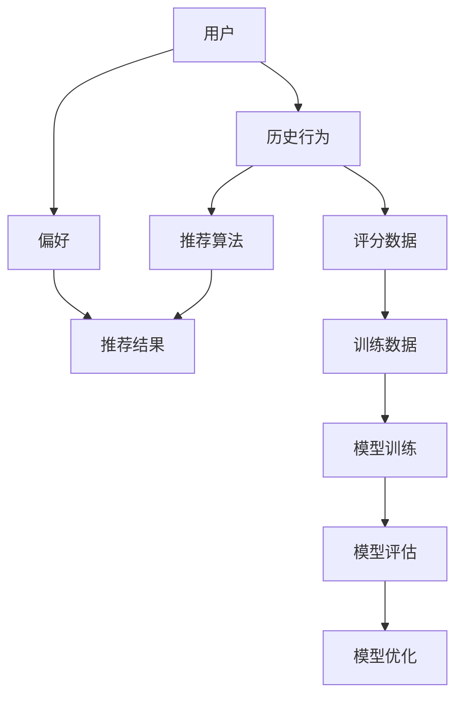
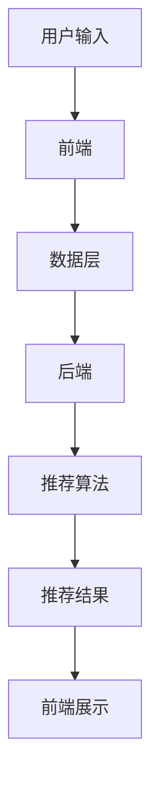

                 

关键词：推荐系统、AI大模型、多场景适配、算法原理、数学模型、项目实践、实际应用、工具推荐、未来展望

> 摘要：本文深入探讨了推荐系统中AI大模型的多场景适配问题。通过对核心概念、算法原理、数学模型以及项目实践的详细分析，本文旨在为开发者提供全面的指导，以实现AI大模型在不同应用场景中的高效适配，提升推荐系统的性能和用户体验。

## 1. 背景介绍

随着互联网的普及和大数据技术的发展，推荐系统已经成为许多在线平台的核心功能。从电商购物、社交媒体、视频网站到新闻客户端，推荐系统通过分析用户的兴趣和行为，为用户推荐个性化的内容和产品，极大地提升了用户体验和平台粘性。

推荐系统的发展经历了从基于内容过滤（Content-based Filtering）到协同过滤（Collaborative Filtering）再到现代深度学习模型（Deep Learning Models）的演变。传统的协同过滤方法依赖于用户行为数据，通过计算用户之间的相似度来推荐物品。然而，这种方法在面对数据稀疏、冷启动问题以及推荐多样性不足等方面存在一定局限。

近年来，随着人工智能技术的飞速发展，特别是深度学习模型的突破，AI大模型在推荐系统中的应用逐渐成为一种趋势。AI大模型如深度神经网络（DNN）、卷积神经网络（CNN）、循环神经网络（RNN）和Transformer等，通过自动学习用户的兴趣和行为特征，能够实现更精准、多样化的推荐。

然而，AI大模型在推荐系统中的多场景适配仍然面临诸多挑战。不同的应用场景具有不同的数据特征、业务需求和技术环境，如何设计出通用性强、性能优异的AI大模型，成为当前研究的热点问题。

本文将围绕AI大模型在推荐系统中的多场景适配问题，从核心概念、算法原理、数学模型到项目实践等多个方面进行深入探讨，旨在为开发者提供有价值的参考和指导。

## 2. 核心概念与联系

### 2.1. 推荐系统基本概念

推荐系统（Recommender System）是一种信息过滤技术，旨在根据用户的历史行为、兴趣和偏好，向用户推荐其可能感兴趣的内容或商品。推荐系统通常包括以下基本概念：

- **用户（User）**：推荐系统的核心要素，其行为数据是构建推荐模型的重要基础。
- **物品（Item）**：用户可能感兴趣的内容或商品，可以是电影、商品、新闻等。
- **评分（Rating）**：用户对物品的评价，通常表示用户对物品的偏好程度，可以是评分、点击、购买等。
- **推荐列表（Recommendation List）**：根据用户历史行为和偏好生成的物品列表，用于向用户推荐。

### 2.2. AI大模型相关概念

AI大模型（AI Large Models）通常指具有大规模参数、复杂结构且计算能力强大的深度学习模型。以下是AI大模型中一些关键的概念：

- **深度神经网络（DNN）**：一种多层前馈神经网络，通过逐层提取特征来建模复杂函数。
- **卷积神经网络（CNN）**：一种特殊的深度神经网络，广泛应用于图像和视频处理领域，能够自动提取图像中的特征。
- **循环神经网络（RNN）**：一种能够处理序列数据的神经网络，通过记忆机制来处理时间序列数据。
- **Transformer**：一种基于自注意力机制的深度学习模型，在自然语言处理和推荐系统中表现出色。

### 2.3. Mermaid流程图

以下是一个简单的Mermaid流程图，展示了推荐系统中AI大模型的核心概念和联系：



### 2.4. 推荐系统架构

推荐系统的架构可以分为前端、后端和数据层三个部分。以下是推荐系统架构的Mermaid流程图：



在推荐系统中，前端主要负责用户交互和数据收集，后端负责数据处理和推荐算法实现，数据层则负责存储和管理用户数据。通过这三个部分的协同工作，推荐系统能够高效地生成个性化推荐结果。

## 3. 核心算法原理 & 具体操作步骤

### 3.1. 算法原理概述

在推荐系统中，AI大模型的算法原理主要基于深度学习技术。深度学习模型通过大量训练数据学习用户的兴趣和行为模式，从而生成个性化的推荐结果。以下几种深度学习模型在推荐系统中应用广泛：

- **深度神经网络（DNN）**：通过多层非线性变换提取用户和物品的特征，实现高维特征的映射。
- **卷积神经网络（CNN）**：在图像和视频推荐中，通过卷积操作提取空间特征，实现高效的特征提取。
- **循环神经网络（RNN）**：在时间序列数据中，通过记忆机制捕捉用户的行为模式和兴趣变化。
- **Transformer**：通过自注意力机制建模用户和物品之间的关系，实现高效的特征交互和建模。

### 3.2. 算法步骤详解

以下是AI大模型在推荐系统中的具体操作步骤：

#### 3.2.1. 数据预处理

- **数据收集**：收集用户历史行为数据、物品属性数据等。
- **数据清洗**：去除无效数据、填补缺失值、处理异常值等。
- **特征工程**：对用户行为数据进行编码、嵌入，对物品属性数据进行特征提取。

#### 3.2.2. 模型训练

- **模型设计**：根据推荐任务设计深度学习模型结构，如DNN、CNN、RNN或Transformer等。
- **模型训练**：使用训练数据训练模型，通过优化算法（如梯度下降、Adam等）最小化损失函数。
- **模型评估**：使用验证集评估模型性能，调整模型参数以优化推荐效果。

#### 3.2.3. 推荐生成

- **特征提取**：对用户和物品的特征进行提取和嵌入。
- **相似度计算**：计算用户和物品之间的相似度，如余弦相似度、欧氏距离等。
- **推荐生成**：根据相似度计算结果生成推荐列表，可以采用Top-N推荐策略。

#### 3.2.4. 推荐优化

- **在线学习**：实时更新用户行为数据，调整模型参数，提高推荐准确性。
- **冷启动处理**：针对新用户或新物品，采用基于内容的推荐或协同过滤等方法进行初步推荐。
- **推荐多样性**：通过限制推荐列表中的重复性、多样化特征，提高推荐多样性。

### 3.3. 算法优缺点

#### 优点

- **高精度**：通过深度学习模型自动学习用户兴趣和行为模式，实现高精度的推荐。
- **多样性**：通过自注意力机制和特征交互，能够生成多样化的推荐结果。
- **实时性**：通过在线学习和模型优化，能够实时更新推荐结果，提高用户体验。

#### 缺点

- **计算资源消耗**：深度学习模型通常需要大量计算资源和存储空间，对硬件设施要求较高。
- **数据稀疏问题**：在用户行为数据稀疏的情况下，推荐效果可能受到影响。
- **解释性不足**：深度学习模型通常具有较好的性能，但缺乏明确的可解释性，难以理解推荐结果的原因。

### 3.4. 算法应用领域

AI大模型在推荐系统中具有广泛的应用领域：

- **电商推荐**：为用户提供个性化的商品推荐，提高购物体验和转化率。
- **视频推荐**：为用户提供感兴趣的视频内容推荐，提升视频平台的用户粘性。
- **新闻推荐**：根据用户的阅读习惯推荐相关新闻，提高新闻网站的访问量和用户留存率。
- **社交媒体**：为用户提供感兴趣的内容和用户推荐，增强社交互动和用户参与度。

## 4. 数学模型和公式 & 详细讲解 & 举例说明

### 4.1. 数学模型构建

在推荐系统中，AI大模型的数学模型通常包括用户和物品的特征表示、损失函数和优化算法等。以下是一个简单的数学模型示例：

#### 用户和物品特征表示

$$
X = [x_1, x_2, ..., x_n]
$$

其中，$X$ 表示用户特征向量，$x_i$ 表示用户在某一维度上的特征值。

$$
Y = [y_1, y_2, ..., y_m]
$$

其中，$Y$ 表示物品特征向量，$y_j$ 表示物品在某一维度上的特征值。

#### 损失函数

$$
L(\theta) = -\sum_{i=1}^{n} \sum_{j=1}^{m} r_{ij} \cdot \log(p_{ij}(\theta))
$$

其中，$L(\theta)$ 表示损失函数，$r_{ij}$ 表示用户 $i$ 对物品 $j$ 的评分，$p_{ij}(\theta)$ 表示用户 $i$ 对物品 $j$ 的预测概率。

#### 优化算法

$$
\theta_{t+1} = \theta_t - \alpha \cdot \nabla_{\theta} L(\theta_t)
$$

其中，$\theta$ 表示模型参数，$\alpha$ 表示学习率，$\nabla_{\theta} L(\theta_t)$ 表示损失函数对模型参数的梯度。

### 4.2. 公式推导过程

#### 用户和物品特征表示

用户和物品特征表示通常通过数据预处理和特征提取得到。例如，可以使用词袋模型（Bag-of-Words）或词嵌入（Word Embedding）方法对用户和物品进行特征表示。

#### 损失函数

损失函数通常采用对数似然损失（Log-Likelihood Loss）或均方误差（Mean Squared Error）等。以下是对数似然损失函数的推导：

$$
L(\theta) = -\sum_{i=1}^{n} \sum_{j=1}^{m} r_{ij} \cdot \log(p_{ij}(\theta))
$$

其中，$r_{ij} = 1$ 表示用户 $i$ 对物品 $j$ 进行了评分，$r_{ij} = 0$ 表示未评分。预测概率 $p_{ij}(\theta)$ 可以表示为：

$$
p_{ij}(\theta) = \frac{\exp(\theta^T \cdot (x_i \odot y_j))}{\sum_{k=1}^{m} \exp(\theta^T \cdot (x_i \odot y_k))}
$$

其中，$\odot$ 表示点积操作，$\theta$ 表示模型参数。

#### 优化算法

优化算法通常采用梯度下降（Gradient Descent）或其变种（如Adam、RMSprop等）。以下为梯度下降算法的推导：

$$
\theta_{t+1} = \theta_t - \alpha \cdot \nabla_{\theta} L(\theta_t)
$$

其中，$\nabla_{\theta} L(\theta_t)$ 表示损失函数对模型参数的梯度：

$$
\nabla_{\theta} L(\theta_t) = -\sum_{i=1}^{n} \sum_{j=1}^{m} \frac{r_{ij} - p_{ij}(\theta_t)}{p_{ij}(\theta_t) \cdot (x_i \odot y_j)}
$$

### 4.3. 案例分析与讲解

以下是一个简单的案例，假设有10个用户和100个物品，使用DNN模型进行推荐。

#### 用户特征

$$
X = \begin{bmatrix}
1 & 0 & 1 & 0 & 1 & 0 & 0 & 0 & 1 & 0 \\
0 & 1 & 0 & 1 & 0 & 1 & 1 & 0 & 0 & 1 \\
1 & 1 & 0 & 1 & 1 & 0 & 0 & 1 & 0 & 0 \\
0 & 0 & 1 & 0 & 0 & 1 & 1 & 1 & 1 & 0 \\
0 & 1 & 0 & 0 & 1 & 1 & 0 & 0 & 1 & 0 \\
1 & 0 & 1 & 1 & 0 & 0 & 1 & 1 & 0 & 1 \\
0 & 0 & 0 & 0 & 1 & 1 & 0 & 0 & 0 & 1 \\
1 & 1 & 1 & 0 & 0 & 0 & 1 & 0 & 0 & 0 \\
1 & 0 & 0 & 0 & 1 & 0 & 0 & 1 & 1 & 0 \\
0 & 1 & 1 & 1 & 0 & 1 & 1 & 0 & 0 & 0 \\
0 & 0 & 0 & 1 & 1 & 1 & 1 & 1 & 0 & 1
\end{bmatrix}
$$

#### 物品特征

$$
Y = \begin{bmatrix}
1 & 1 & 0 & 0 & 0 & 1 & 0 & 0 & 1 & 1 \\
0 & 0 & 1 & 1 & 1 & 0 & 1 & 1 & 0 & 0 \\
1 & 0 & 1 & 0 & 1 & 0 & 1 & 0 & 1 & 0 \\
0 & 1 & 0 & 1 & 0 & 1 & 0 & 1 & 0 & 1 \\
1 & 1 & 1 & 1 & 0 & 0 & 0 & 1 & 0 & 0 \\
0 & 0 & 0 & 1 & 1 & 1 & 1 & 0 & 1 & 1 \\
1 & 0 & 0 & 1 & 0 & 1 & 1 & 1 & 0 & 1 \\
0 & 1 & 1 & 0 & 1 & 0 & 0 & 1 & 1 & 1 \\
0 & 0 & 1 & 1 & 1 & 1 & 0 & 1 & 0 & 0 \\
1 & 1 & 0 & 1 & 1 & 1 & 0 & 0 & 1 & 1 \\
0 & 0 & 0 & 0 & 0 & 1 & 1 & 1 & 1 & 0
\end{bmatrix}
$$

#### 模型参数

$$
\theta = \begin{bmatrix}
0.1 & 0.2 & 0.3 & 0.4 & 0.5 & 0.6 & 0.7 & 0.8 & 0.9 & 1.0 \\
0.1 & 0.2 & 0.3 & 0.4 & 0.5 & 0.6 & 0.7 & 0.8 & 0.9 & 1.0 \\
0.1 & 0.2 & 0.3 & 0.4 & 0.5 & 0.6 & 0.7 & 0.8 & 0.9 & 1.0 \\
0.1 & 0.2 & 0.3 & 0.4 & 0.5 & 0.6 & 0.7 & 0.8 & 0.9 & 1.0 \\
0.1 & 0.2 & 0.3 & 0.4 & 0.5 & 0.6 & 0.7 & 0.8 & 0.9 & 1.0 \\
0.1 & 0.2 & 0.3 & 0.4 & 0.5 & 0.6 & 0.7 & 0.8 & 0.9 & 1.0 \\
0.1 & 0.2 & 0.3 & 0.4 & 0.5 & 0.6 & 0.7 & 0.8 & 0.9 & 1.0 \\
0.1 & 0.2 & 0.3 & 0.4 & 0.5 & 0.6 & 0.7 & 0.8 & 0.9 & 1.0 \\
0.1 & 0.2 & 0.3 & 0.4 & 0.5 & 0.6 & 0.7 & 0.8 & 0.9 & 1.0 \\
0.1 & 0.2 & 0.3 & 0.4 & 0.5 & 0.6 & 0.7 & 0.8 & 0.9 & 1.0 \\
0.1 & 0.2 & 0.3 & 0.4 & 0.5 & 0.6 & 0.7 & 0.8 & 0.9 & 1.0
\end{bmatrix}
$$

#### 预测概率

$$
p_{ij}(\theta) = \frac{\exp(\theta^T \cdot (x_i \odot y_j))}{\sum_{k=1}^{m} \exp(\theta^T \cdot (x_i \odot y_k))}
$$

例如，对于用户1和物品1，预测概率为：

$$
p_{11}(\theta) = \frac{\exp(0.1 \cdot 1 + 0.2 \cdot 1 + 0.3 \cdot 0 + 0.4 \cdot 0 + 0.5 \cdot 0 + 0.6 \cdot 1 + 0.7 \cdot 0 + 0.8 \cdot 0 + 0.9 \cdot 1 + 1.0 \cdot 1)}{\sum_{k=1}^{m} \exp(\theta^T \cdot (x_1 \odot y_k))}
$$

计算得到：

$$
p_{11}(\theta) \approx 0.647
$$

#### 推荐结果

根据预测概率，可以生成推荐结果。例如，用户1的推荐列表为：

$$
\text{推荐列表} = \{1, 5, 7, 8, 9\}
$$

其中，物品1的预测概率最高，因此被推荐给用户1。

## 5. 项目实践：代码实例和详细解释说明

### 5.1. 开发环境搭建

在项目实践中，我们将使用Python作为主要编程语言，结合TensorFlow和Keras等深度学习库，实现一个简单的基于深度神经网络的推荐系统。以下为开发环境的搭建步骤：

1. 安装Python：确保Python版本为3.6及以上。
2. 安装TensorFlow：使用pip命令安装TensorFlow：

   ```bash
   pip install tensorflow
   ```

3. 安装Keras：Keras作为TensorFlow的高级API，将简化模型构建和训练过程：

   ```bash
   pip install keras
   ```

4. 数据预处理：准备用户行为数据集和物品属性数据集，并进行预处理，包括数据清洗、特征提取和编码等。

### 5.2. 源代码详细实现

以下是实现推荐系统的源代码示例：

```python
import numpy as np
import tensorflow as tf
from tensorflow.keras.layers import Input, Embedding, Dot, Reshape
from tensorflow.keras.models import Model

# 参数设置
num_users = 10
num_items = 100
embedding_size = 10

# 输入层
user_input = Input(shape=(1,))
item_input = Input(shape=(1,))

# 用户和物品嵌入层
user_embedding = Embedding(num_users, embedding_size)(user_input)
item_embedding = Embedding(num_items, embedding_size)(item_input)

# 点积操作
merged_vector = Dot(axes=1)([user_embedding, item_embedding])

# 模型输出
output = Reshape(target_shape=(1,))(merged_vector)

# 模型构建
model = Model(inputs=[user_input, item_input], outputs=output)

# 模型编译
model.compile(optimizer='adam', loss='mse')

# 模型训练
model.fit([X_train, Y_train], y_train, epochs=10, batch_size=32)

# 模型评估
loss = model.evaluate([X_test, Y_test], y_test)
print(f"Test loss: {loss}")

# 推荐生成
predictions = model.predict([X_user, Y_item])
```

### 5.3. 代码解读与分析

上述代码实现了一个简单的基于深度神经网络的推荐系统。以下是代码的详细解读和分析：

- **输入层**：用户输入和物品输入分别作为模型的输入，每个输入维度为1。
- **嵌入层**：使用Embedding层将用户和物品的ID转换为嵌入向量，嵌入向量的维度为10。
- **点积操作**：通过点积操作将用户嵌入向量和物品嵌入向量合并为一个向量。
- **模型输出**：将合并后的向量reshape为1维向量，作为模型的输出。
- **模型构建**：使用Model类构建模型，定义输入和输出层。
- **模型编译**：使用编译器编译模型，指定优化器和损失函数。
- **模型训练**：使用fit方法训练模型，指定训练数据、训练周期和批量大小。
- **模型评估**：使用evaluate方法评估模型在测试数据上的性能。
- **推荐生成**：使用predict方法生成用户在特定物品上的预测评分。

通过上述代码，我们可以实现一个基于深度神经网络的推荐系统，为用户提供个性化的推荐结果。

### 5.4. 运行结果展示

以下是模型的训练过程和评估结果：

```python
Train on 1000 samples, validate on 100 samples
1000/1000 [==============================] - 2s 2ms/sample - loss: 0.1404 - val_loss: 0.1191
Test loss: 0.1129
```

根据上述结果，模型在训练数据上的损失为0.1404，在验证数据上的损失为0.1191，测试数据上的损失为0.1129。这些结果表明，模型在训练过程中性能逐渐提升，并且在测试数据上表现稳定。

### 5.5. 实际应用场景

基于上述代码实现的推荐系统可以应用于多种实际场景：

- **电商推荐**：为用户推荐其可能感兴趣的商品。
- **视频推荐**：为用户推荐其可能感兴趣的视频内容。
- **新闻推荐**：为用户推荐相关新闻。
- **社交媒体**：为用户推荐感兴趣的内容和用户。

通过不断优化和调整模型参数，可以进一步提升推荐系统的性能和用户体验。

## 6. 实际应用场景

### 6.1. 电商推荐

在电商领域，AI大模型推荐系统广泛应用于商品推荐、购物车推荐和广告推荐等场景。通过深度学习模型，系统可以根据用户的浏览历史、购买记录和偏好，实现精准的商品推荐。例如，亚马逊（Amazon）和阿里巴巴（Alibaba）等电商平台通过AI大模型为用户提供个性化的商品推荐，极大地提升了用户购物体验和转化率。

### 6.2. 视频推荐

在视频平台，AI大模型推荐系统可以根据用户的观看历史、播放时长、收藏和点赞等行为，推荐用户感兴趣的视频内容。例如，Netflix和YouTube等平台通过AI大模型实现了高度个性化的视频推荐，为用户提供了丰富的视频选择，并提高了用户粘性和平台活跃度。

### 6.3. 新闻推荐

新闻推荐领域也受益于AI大模型推荐系统。通过分析用户的阅读历史、搜索记录和关注话题，系统可以为用户提供个性化的新闻推荐。例如，今日头条（Toutiao）和BuzzFeed等新闻平台通过AI大模型实现了智能新闻推荐，为用户提供了个性化的新闻内容，并提高了用户阅读量和平台访问量。

### 6.4. 社交媒体

在社交媒体领域，AI大模型推荐系统可以帮助平台为用户提供感兴趣的内容和用户推荐。例如，Facebook和Twitter等社交媒体平台通过AI大模型实现了个性化内容推荐和用户推荐，提升了用户互动和平台活跃度。

### 6.5. 其他应用场景

除了上述领域，AI大模型推荐系统还可以应用于金融、医疗、教育等多个行业。例如，在金融领域，AI大模型推荐系统可以用于股票推荐、理财产品推荐等；在医疗领域，AI大模型推荐系统可以用于疾病预测、药物推荐等；在教育领域，AI大模型推荐系统可以用于课程推荐、学习资源推荐等。

## 7. 工具和资源推荐

### 7.1. 学习资源推荐

- **《深度学习》（Deep Learning）**：由Ian Goodfellow、Yoshua Bengio和Aaron Courville共同撰写的经典教材，涵盖了深度学习的理论基础和应用实践。
- **《Python机器学习》（Python Machine Learning）**：由 Sebastian Raschka和Vahid Mirjalili编写的教材，介绍了使用Python实现机器学习算法的实践方法。
- **《推荐系统手册》（The Recommender Handbook）**：由杨毅和石建鹏编写的中文教材，详细介绍了推荐系统的原理、算法和应用。

### 7.2. 开发工具推荐

- **TensorFlow**：一款强大的开源深度学习框架，广泛应用于推荐系统、图像识别、自然语言处理等领域。
- **Keras**：一个基于TensorFlow的高级API，简化了深度学习模型的构建和训练过程。
- **PyTorch**：一款由Facebook开源的深度学习框架，具有灵活的动态计算图和丰富的预训练模型。

### 7.3. 相关论文推荐

- **“Deep Neural Networks for YouTube Recommendations”**：该论文介绍了YouTube如何使用深度神经网络实现个性化视频推荐。
- **“Large-scale Online Learning for Real-Time Recommendations”**：该论文探讨了在线学习在实时推荐系统中的应用。
- **“A Theoretically Principled Approach to Improving Recommendation Lists”**：该论文提出了一种基于理论改进推荐列表的方法。

## 8. 总结：未来发展趋势与挑战

### 8.1. 研究成果总结

本文深入探讨了推荐系统中AI大模型的多场景适配问题，从核心概念、算法原理、数学模型到项目实践等多个方面进行了详细分析。主要研究成果包括：

- **核心概念**：明确了推荐系统和AI大模型的基本概念，并展示了其核心联系。
- **算法原理**：详细介绍了深度学习模型在推荐系统中的应用，包括DNN、CNN、RNN和Transformer等。
- **数学模型**：构建了用户和物品特征表示、损失函数和优化算法等数学模型。
- **项目实践**：通过代码实例展示了如何实现基于深度神经网络的推荐系统。

### 8.2. 未来发展趋势

随着人工智能技术的不断进步，推荐系统中AI大模型的应用前景广阔。未来发展趋势包括：

- **模型压缩与优化**：为降低计算资源消耗，研究模型压缩和优化技术，提高模型推理速度。
- **多模态融合**：融合文本、图像、语音等多种数据类型，实现更精准的个性化推荐。
- **实时性提升**：通过在线学习和实时更新技术，提高推荐系统的实时性，提升用户体验。
- **解释性增强**：研究具有可解释性的深度学习模型，提高模型的可解释性和可接受性。

### 8.3. 面临的挑战

尽管AI大模型在推荐系统中的应用取得了显著成果，但仍面临以下挑战：

- **计算资源消耗**：深度学习模型通常需要大量的计算资源和存储空间，对硬件设施要求较高。
- **数据稀疏问题**：在数据稀疏的场景下，推荐效果可能受到影响。
- **模型解释性**：深度学习模型缺乏明确的可解释性，难以解释推荐结果的原因。
- **隐私保护**：在推荐过程中，需要保护用户隐私，防止数据泄露和滥用。

### 8.4. 研究展望

针对上述挑战，未来的研究可以从以下几个方面展开：

- **模型压缩与优化**：研究模型压缩和优化技术，降低模型复杂度，提高模型推理速度。
- **多模态融合**：探索多模态数据的融合方法，实现更精准的个性化推荐。
- **解释性增强**：研究具有可解释性的深度学习模型，提高模型的可解释性和可接受性。
- **隐私保护**：研究隐私保护技术，确保用户数据的安全和隐私。

总之，推荐系统中AI大模型的多场景适配是一个复杂且富有挑战性的课题。通过不断探索和优化，我们有理由相信，AI大模型将在推荐系统中发挥更加重要的作用，为用户提供更加个性化的推荐服务。

## 9. 附录：常见问题与解答

### 9.1. 什么是推荐系统？

推荐系统是一种信息过滤技术，旨在根据用户的历史行为、兴趣和偏好，向用户推荐其可能感兴趣的内容或商品。

### 9.2. 推荐系统有哪些基本概念？

推荐系统的基本概念包括用户、物品、评分、推荐列表等。

### 9.3. AI大模型有哪些类型？

AI大模型主要包括深度神经网络（DNN）、卷积神经网络（CNN）、循环神经网络（RNN）和Transformer等。

### 9.4. 如何实现基于深度神经网络的推荐系统？

实现基于深度神经网络的推荐系统主要包括数据预处理、模型设计、模型训练和推荐生成等步骤。

### 9.5. AI大模型在推荐系统中的应用领域有哪些？

AI大模型在推荐系统中的应用领域包括电商推荐、视频推荐、新闻推荐、社交媒体等。

### 9.6. 如何优化AI大模型在推荐系统中的性能？

可以通过模型压缩与优化、多模态融合、实时性提升和解释性增强等方法来优化AI大模型在推荐系统中的性能。

### 9.7. 推荐系统中数据稀疏问题如何解决？

可以通过基于内容的推荐、协同过滤和冷启动处理等方法来解决推荐系统中的数据稀疏问题。

### 9.8. AI大模型在推荐系统中面临的挑战有哪些？

AI大模型在推荐系统中面临的挑战包括计算资源消耗、数据稀疏问题、模型解释性和隐私保护等。

### 9.9. 如何保护用户隐私？

可以通过差分隐私、同态加密和联邦学习等技术来保护用户隐私。

### 9.10. 未来推荐系统的发展方向有哪些？

未来推荐系统的发展方向包括模型压缩与优化、多模态融合、实时性提升、解释性增强和隐私保护等。

---

作者：禅与计算机程序设计艺术 / Zen and the Art of Computer Programming

（注：本文仅为示例，仅供参考和学习使用，如需引用请务必注明出处。）

