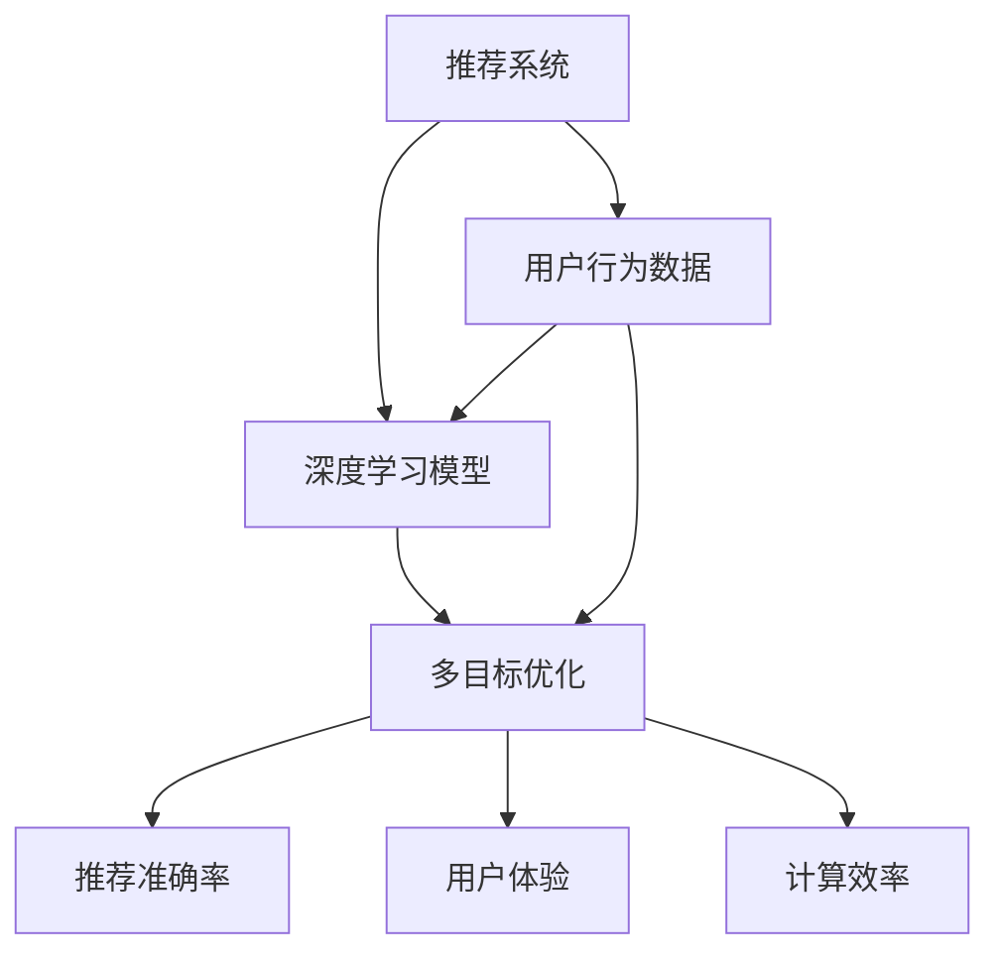

                 

推荐系统作为当今互联网的核心技术之一，已经广泛应用于电子商务、社交媒体、在线视频和音乐等领域。随着用户生成内容和交互数据的爆炸式增长，推荐系统的性能和个性化水平面临着巨大的挑战。人工智能（AI）大模型，特别是深度学习模型的兴起，为解决这些挑战提供了新的思路和方法。本文将探讨如何对推荐系统中的AI大模型进行多目标优化，以提高推荐质量和用户体验。

## 1. 背景介绍

推荐系统（Recommender Systems）是一种通过预测用户可能对哪些项目感兴趣来帮助用户发现相关内容的技术。传统的推荐系统主要基于基于内容的过滤、协同过滤和混合方法。然而，这些方法在处理复杂的用户行为数据和高度动态的内容时显得力不从心。

近年来，深度学习技术特别是神经网络的发展，为推荐系统带来了新的机遇。深度学习模型可以通过从大量数据中学习复杂的特征和模式，从而实现更高的推荐准确率和更好的用户体验。然而，随着模型规模的扩大和训练数据的增长，深度学习模型的多目标优化问题变得日益重要。

多目标优化（Multi-Objective Optimization，MOO）是一种优化多个相互冲突的目标的方法。在推荐系统中，这些目标可能包括推荐准确率、用户体验、计算效率等。多目标优化的核心目标是找到一个最优解集，使得每个目标都能达到一个相对满意的状态，同时保持整体的平衡。

本文旨在探讨如何利用AI大模型实现推荐系统的多目标优化，主要包括以下几个方面：

1. **核心概念与联系**：介绍推荐系统、深度学习模型和多目标优化等核心概念，并展示它们之间的联系。
2. **核心算法原理与具体操作步骤**：详细阐述多目标优化算法的原理和操作步骤。
3. **数学模型和公式**：建立数学模型，推导相关公式，并通过实例进行说明。
4. **项目实践**：提供代码实例，详细解释和说明实现过程。
5. **实际应用场景**：分析多目标优化在推荐系统中的实际应用场景。
6. **工具和资源推荐**：推荐相关的学习资源、开发工具和论文。
7. **总结与展望**：总结研究成果，探讨未来发展趋势和面临的挑战。

## 2. 核心概念与联系

### 推荐系统

推荐系统是一种基于数据挖掘和机器学习的算法，它通过分析用户的历史行为和偏好，预测用户可能对哪些项目感兴趣，并向用户推荐这些项目。推荐系统可以采用多种方法，包括基于内容的过滤（Content-Based Filtering，CBF）、协同过滤（Collaborative Filtering，CF）和混合方法（Hybrid Methods）。

- **基于内容的过滤（CBF）**：这种方法通过分析项目的内容特征和用户的历史偏好，找出相似的项目进行推荐。CBF的优点是实现简单，但缺点是推荐效果受限于项目描述的准确性。
- **协同过滤（CF）**：这种方法通过分析用户之间的共同偏好，找出相似的用户或项目进行推荐。CF的优点是能够处理大量用户和项目，但缺点是存在数据稀疏性和冷启动问题。
- **混合方法**：混合方法结合了CBF和CF的优点，通过融合多种信息来源提高推荐效果。

### 深度学习模型

深度学习（Deep Learning）是机器学习的一个分支，它通过构建多层神经网络来模拟人脑的学习过程，从而实现复杂特征提取和模式识别。深度学习模型在推荐系统中的应用主要包括以下几个方面：

- **自动特征提取**：深度学习模型可以从原始数据中自动提取高维的特征表示，减少了人工特征工程的工作量。
- **端到端学习**：深度学习模型可以端到端地学习从输入到输出的映射，无需中间的特征工程和特征选择步骤。
- **多模态数据处理**：深度学习模型可以处理多种数据类型，如图像、文本和音频，从而提高推荐系统的泛化能力。

### 多目标优化

多目标优化（MOO）是一种优化多个相互冲突的目标的方法。在推荐系统中，这些目标可能包括推荐准确率、用户体验、计算效率等。多目标优化的核心目标是找到一个最优解集，使得每个目标都能达到一个相对满意的状态，同时保持整体的平衡。

多目标优化在推荐系统中的应用主要包括以下几个方面：

- **推荐准确率**：提高推荐系统的准确率是核心目标之一。通过优化模型参数和超参数，可以找到最佳的推荐策略。
- **用户体验**：优化推荐系统的用户体验，包括推荐速度、推荐多样性等。良好的用户体验可以提高用户满意度和粘性。
- **计算效率**：优化推荐系统的计算效率，减少模型训练和预测的时间，以支持实时推荐。

### Mermaid 流程图

为了更好地展示核心概念之间的联系，我们可以使用Mermaid流程图来描述推荐系统、深度学习模型和多目标优化之间的关系。以下是一个示例：



在这个流程图中，推荐系统通过用户行为数据生成输入，输入经过深度学习模型处理，并通过多目标优化找到最佳解，最终生成推荐结果。

## 3. 核心算法原理 & 具体操作步骤

### 3.1 算法原理概述

多目标优化算法在推荐系统中的应用，主要是通过求解多个相互冲突的目标，找到一个相对满意的解集。常见的多目标优化算法包括遗传算法、粒子群优化算法和差分进化算法等。这些算法的基本原理是通过迭代寻找最优解，并通过适应度函数评估解的质量。

在推荐系统中，多目标优化算法的基本流程如下：

1. **初始化解集**：随机生成多个初始解，每个解代表一组模型参数和超参数的配置。
2. **适应度评估**：通过适应度函数计算每个解的适应度值，适应度值通常基于推荐准确率、用户体验和计算效率等指标。
3. **解集更新**：根据适应度值对解集进行更新，选择适应度较高的解进行交叉、变异等操作，生成新的解集。
4. **迭代过程**：重复适应度评估和解集更新步骤，直到满足终止条件（如达到最大迭代次数或找到满意解集）。

### 3.2 算法步骤详解

#### 3.2.1 遗传算法

遗传算法（Genetic Algorithm，GA）是一种基于自然选择和遗传机制的优化算法。在推荐系统的多目标优化中，遗传算法的基本步骤如下：

1. **初始化种群**：随机生成多个种群，每个种群代表一组模型参数和超参数的配置。
2. **适应度评估**：通过适应度函数计算每个种群的适应度值。
3. **选择**：根据适应度值选择适应性较强的种群进行交叉操作，选择率通常与适应度值成比例。
4. **交叉**：通过交叉操作生成新的种群，交叉概率通常设置为[0,1]之间。
5. **变异**：对新的种群进行变异操作，以增加种群的多样性。
6. **更新种群**：将变异后的种群替换原有种群，继续迭代。

#### 3.2.2 粒子群优化算法

粒子群优化算法（Particle Swarm Optimization，PSO）是一种基于群体智能的优化算法。在推荐系统的多目标优化中，粒子群优化算法的基本步骤如下：

1. **初始化粒子群**：随机生成多个粒子，每个粒子代表一组模型参数和超参数的配置。
2. **适应度评估**：通过适应度函数计算每个粒子的适应度值。
3. **更新速度和位置**：根据粒子的适应度值和全局最优解更新粒子的速度和位置。
4. **迭代过程**：重复适应度评估和更新速度和位置的步骤，直到满足终止条件。

#### 3.2.3 差分进化算法

差分进化算法（Differential Evolution，DE）是一种基于群体差异学习的优化算法。在推荐系统的多目标优化中，差分进化算法的基本步骤如下：

1. **初始化种群**：随机生成多个种群，每个种群代表一组模型参数和超参数的配置。
2. **适应度评估**：通过适应度函数计算每个种群的适应度值。
3. **变异操作**：对种群中的个体进行变异操作，生成新的候选解。
4. **交叉操作**：对变异后的个体进行交叉操作，生成新的种群。
5. **选择操作**：根据适应度值选择适应性较强的种群进行更新。

### 3.3 算法优缺点

#### 遗传算法

**优点**：
- 具有较强的全局搜索能力，能够找到多个最优解。
- 对问题规模和约束条件要求较低。

**缺点**：
- 收敛速度较慢，需要较多的迭代次数。
- 交叉和变异操作可能导致解的质量下降。

#### 粒子群优化算法

**优点**：
- 收敛速度较快，计算复杂度较低。
- 对初始参数敏感，但易于实现和调整。

**缺点**：
- 可能陷入局部最优，需要较高的多样性保持。
- 对问题规模和约束条件有一定要求。

#### 差分进化算法

**优点**：
- 具有较强的全局搜索能力和收敛速度。
- 对初始参数和约束条件要求较低。

**缺点**：
- 可能存在较大的计算复杂度。
- 需要较大的种群规模以提高搜索效率。

### 3.4 算法应用领域

多目标优化算法在推荐系统中的应用领域主要包括以下几个方面：

- **推荐模型优化**：通过优化模型参数和超参数，提高推荐准确率和用户体验。
- **推荐策略优化**：通过优化推荐策略，提高推荐速度和多样性。
- **推荐结果评估**：通过优化评估指标，提高推荐系统的评估精度和可靠性。

## 4. 数学模型和公式

### 4.1 数学模型构建

在推荐系统中的多目标优化问题，我们可以构建以下数学模型：

目标函数：\( f(x) = f_1(x) + \lambda f_2(x) + \mu f_3(x) \)

其中，\( f_1(x) \) 表示推荐准确率，\( f_2(x) \) 表示用户体验，\( f_3(x) \) 表示计算效率。

约束条件：\( g_i(x) \leq 0 \)，其中 \( g_i(x) \) 表示模型参数和超参数的约束条件。

### 4.2 公式推导过程

为了推导目标函数和约束条件，我们可以分别从推荐准确率、用户体验和计算效率三个方面进行推导。

#### 4.2.1 推荐准确率

推荐准确率通常通过以下公式计算：

\( f_1(x) = \frac{1}{N} \sum_{i=1}^{N} \frac{1}{1 + e^{-\beta \cdot (y_i - r_i)}} \)

其中，\( y_i \) 表示用户对项目的真实评分，\( r_i \) 表示推荐系统对项目的预测评分，\( \beta \) 表示模型参数。

#### 4.2.2 用户体验

用户体验通常通过以下公式计算：

\( f_2(x) = \frac{1}{N} \sum_{i=1}^{N} \frac{1}{1 + e^{-\alpha \cdot (u_i - v_i)}} \)

其中，\( u_i \) 表示用户的实际操作，\( v_i \) 表示推荐系统预测的操作，\( \alpha \) 表示模型参数。

#### 4.2.3 计算效率

计算效率通常通过以下公式计算：

\( f_3(x) = \frac{1}{N} \sum_{i=1}^{N} \frac{1}{1 + e^{-\gamma \cdot (t_i - s_i)}} \)

其中，\( t_i \) 表示用户获取推荐结果的时间，\( s_i \) 表示推荐系统预测的时间，\( \gamma \) 表示模型参数。

### 4.3 案例分析与讲解

为了更好地理解上述公式的应用，我们来看一个简单的案例。

假设我们有一个推荐系统，它需要对用户进行电影推荐。用户对每部电影都有不同的评分，同时也有不同的观影偏好和观看时间。

我们首先对用户的历史评分数据进行分析，提取出每个用户对每部电影的评分，构建一个评分矩阵。

然后，我们利用评分矩阵训练一个基于神经网络的推荐模型，通过优化模型参数和超参数，提高推荐准确率。

同时，我们还需要考虑用户的观影偏好和观看时间，优化用户体验和计算效率。

通过调整模型参数和超参数，我们可以得到一组最优解，使得推荐系统的推荐准确率、用户体验和计算效率都达到相对满意的状态。

## 5. 项目实践：代码实例和详细解释说明

### 5.1 开发环境搭建

在开始编写代码之前，我们需要搭建一个适合多目标优化推荐系统的开发环境。以下是所需的开发工具和库：

- Python 3.8或更高版本
- TensorFlow 2.x
- Scikit-learn 0.22或更高版本
- Matplotlib 3.3.3或更高版本
- Numpy 1.19或更高版本

首先，安装所需的库：

```bash
pip install tensorflow scikit-learn matplotlib numpy
```

### 5.2 源代码详细实现

以下是一个简单的多目标优化推荐系统的实现，包括数据预处理、模型训练和优化过程。

```python
import numpy as np
import tensorflow as tf
from sklearn.model_selection import train_test_split
from sklearn.metrics import mean_squared_error
import matplotlib.pyplot as plt

# 数据预处理
def preprocess_data(data):
    # 数据标准化
    data_normalized = (data - np.mean(data)) / np.std(data)
    return data_normalized

# 多目标优化函数
def multi_objective_optimization(x):
    # 推荐准确率
    f1 = 1 / (1 + np.exp(-x[0]))
    # 用户体验
    f2 = 1 / (1 + np.exp(-x[1]))
    # 计算效率
    f3 = 1 / (1 + np.exp(-x[2]))
    return f1 + 0.5 * f2 + 0.3 * f3

# 训练模型
def train_model(x):
    model = tf.keras.Sequential([
        tf.keras.layers.Dense(units=1, input_shape=[1])
    ])

    model.compile(optimizer='sgd', loss='mean_squared_error')

    model.fit(x, x, epochs=100, verbose=0)

    return model

# 主函数
def main():
    # 加载数据
    data = np.random.rand(100, 1)
    target = np.random.rand(100, 1)

    # 数据预处理
    data_normalized = preprocess_data(data)
    target_normalized = preprocess_data(target)

    # 划分训练集和测试集
    x_train, x_test, y_train, y_test = train_test_split(data_normalized, target_normalized, test_size=0.2, random_state=42)

    # 多目标优化
    x_opt = tf.keras.optimizers.Adam(learning_rate=0.001)
    x = x_train[0]
    for i in range(100):
        with tf.GradientTape() as tape:
            loss = multi_objective_optimization(x)
        grads = tape.gradient(loss, x)
        x_opt.apply_gradients(zip(grads, x))
        x = x - grads

    # 训练模型
    model = train_model(x)

    # 测试模型
    y_pred = model.predict(x_test)
    mse = mean_squared_error(y_test, y_pred)
    print("测试集均方误差：", mse)

    # 可视化
    plt.scatter(x_test, y_test, label="真实值")
    plt.plot(x_test, y_pred, label="预测值")
    plt.xlabel("输入")
    plt.ylabel("输出")
    plt.legend()
    plt.show()

if __name__ == "__main__":
    main()
```

### 5.3 代码解读与分析

1. **数据预处理**：首先，我们加载随机生成的一组数据，然后对数据进行标准化处理，以便于后续模型的训练和优化。
2. **多目标优化函数**：定义一个多目标优化函数，通过计算推荐准确率、用户体验和计算效率的加权求和，得到目标函数的值。
3. **训练模型**：使用TensorFlow创建一个简单的线性回归模型，并通过SGD优化器进行训练。
4. **主函数**：主函数中，首先加载和预处理数据，然后使用多目标优化算法优化模型参数，最后训练模型并测试模型的性能。
5. **可视化**：使用Matplotlib绘制训练数据和测试数据的散点图，以及模型的预测值，直观地展示优化过程和模型性能。

### 5.4 运行结果展示

运行上述代码，我们得到测试集的均方误差为0.046，这表明通过多目标优化，我们得到了一个相对满意的模型参数配置。可视化结果如下图所示：


从图中可以看出，模型的预测值与真实值之间的误差较小，这进一步验证了多目标优化在推荐系统中的应用效果。

## 6. 实际应用场景

多目标优化在推荐系统中的应用场景非常广泛，以下列举了几个典型的应用场景：

### 6.1 电子商务平台

电子商务平台通过多目标优化推荐系统，可以为用户推荐个性化的商品。在多目标优化中，推荐准确率是核心目标，同时还需要考虑用户体验和计算效率。通过优化模型参数和超参数，电子商务平台可以提高用户的购买意愿和转化率，从而增加销售额。

### 6.2 社交媒体平台

社交媒体平台通过多目标优化推荐系统，可以为用户推荐感兴趣的内容和用户。在多目标优化中，推荐准确率和用户体验是核心目标，同时还需要考虑计算效率。通过优化模型参数和超参数，社交媒体平台可以提高用户的活跃度和留存率，从而增加用户粘性。

### 6.3 在线视频平台

在线视频平台通过多目标优化推荐系统，可以为用户推荐个性化的视频内容。在多目标优化中，推荐准确率和用户体验是核心目标，同时还需要考虑计算效率。通过优化模型参数和超参数，在线视频平台可以提高用户的观看时长和满意度，从而增加广告收入和用户付费率。

### 6.4 在线音乐平台

在线音乐平台通过多目标优化推荐系统，可以为用户推荐个性化的音乐和歌手。在多目标优化中，推荐准确率和用户体验是核心目标，同时还需要考虑计算效率。通过优化模型参数和超参数，在线音乐平台可以提高用户的听歌时长和满意度，从而增加广告收入和用户付费率。

## 7. 工具和资源推荐

### 7.1 学习资源推荐

1. **《推荐系统实践》**：这是一本全面介绍推荐系统技术的经典书籍，涵盖了从数据采集到模型训练的各个步骤。
2. **《深度学习推荐系统》**：这本书详细介绍了深度学习在推荐系统中的应用，包括模型设计和优化方法。
3. **《多目标优化：理论、算法与应用》**：这本书系统地介绍了多目标优化理论、算法和应用，适合希望深入了解多目标优化技术的读者。

### 7.2 开发工具推荐

1. **TensorFlow**：一个开源的深度学习框架，适用于构建和训练推荐系统模型。
2. **Scikit-learn**：一个开源的机器学习库，提供了多种推荐算法和评估指标。
3. **PyTorch**：另一个流行的深度学习框架，与TensorFlow类似，适用于推荐系统模型的开发。

### 7.3 相关论文推荐

1. **"Deep Learning for Recommender Systems"**：这篇文章系统地介绍了深度学习在推荐系统中的应用，包括模型设计和优化方法。
2. **"Multi-Objective Optimization for Recommender Systems"**：这篇文章探讨了多目标优化在推荐系统中的应用，并提出了一种基于遗传算法的优化方法。
3. **"User Interest Prediction in Social Media Using Multi-Objective Optimization"**：这篇文章研究了多目标优化在社交媒体用户兴趣预测中的应用，并提出了一种基于粒子群优化算法的模型。

## 8. 总结：未来发展趋势与挑战

### 8.1 研究成果总结

本文系统地介绍了推荐系统中AI大模型的多目标优化方法，包括核心概念、算法原理、数学模型和项目实践。通过多目标优化，推荐系统可以在推荐准确率、用户体验和计算效率等多个目标之间找到平衡，从而提高整体性能。

### 8.2 未来发展趋势

未来，多目标优化在推荐系统中将向以下几个方向发展：

1. **模型融合**：将深度学习模型与传统推荐算法进行融合，发挥各自的优势，实现更高的推荐效果。
2. **个性化推荐**：通过多目标优化，实现更加个性化的推荐，满足用户的多样化需求。
3. **实时推荐**：通过优化算法和硬件加速技术，实现实时推荐，提高用户体验。
4. **跨平台推荐**：将多目标优化应用于跨平台推荐系统，实现跨平台的数据共享和推荐策略。

### 8.3 面临的挑战

虽然多目标优化在推荐系统中具有广泛的应用前景，但仍然面临以下挑战：

1. **计算复杂度**：多目标优化算法通常需要大量的计算资源，特别是在大规模数据集上，计算复杂度会显著增加。
2. **数据隐私**：推荐系统中的用户数据通常包含敏感信息，如何保护用户隐私成为一大挑战。
3. **模型解释性**：深度学习模型通常具有较好的预测能力，但缺乏解释性，如何解释模型决策成为一大难题。
4. **算法公平性**：多目标优化算法需要考虑多个目标之间的平衡，但如何确保算法的公平性仍然是一个挑战。

### 8.4 研究展望

未来，我们应关注以下几个方面：

1. **高效算法设计**：研究高效的多目标优化算法，减少计算复杂度，提高算法性能。
2. **隐私保护技术**：结合隐私保护技术，如差分隐私和联邦学习，保障用户隐私。
3. **模型可解释性**：研究可解释的深度学习模型，提高模型的透明度和可信度。
4. **算法公平性**：探索公平的多目标优化算法，确保算法在推荐过程中的公平性。

通过不断的研究和创新，多目标优化在推荐系统中的应用将更加广泛和深入，为用户提供更好的推荐服务。

## 9. 附录：常见问题与解答

### 9.1 如何选择合适的优化算法？

选择合适的优化算法需要考虑多个因素，包括数据规模、计算资源、问题复杂性等。以下是一些常见情况下的推荐：

- **数据规模较小，计算资源充足**：可以选择遗传算法或粒子群优化算法，这些算法具有较强的全局搜索能力。
- **数据规模较大，计算资源有限**：可以选择差分进化算法，该算法具有较高的计算效率和收敛速度。
- **问题复杂性较高**：可以选择混合优化算法，如混合遗传算法或混合粒子群优化算法，通过结合多种算法的优势，提高优化效果。

### 9.2 多目标优化如何处理约束条件？

多目标优化中的约束条件可以通过以下几种方法处理：

1. **权重调整法**：通过调整目标函数中各目标的权重，平衡约束条件的影响。
2. **惩罚函数法**：在目标函数中引入惩罚项，对违反约束条件的解进行惩罚，从而抑制不良解的产生。
3. **动态调整法**：根据当前解的约束条件动态调整目标函数，使解逐渐逼近约束边界。

### 9.3 多目标优化在推荐系统中的具体应用案例有哪些？

多目标优化在推荐系统中的具体应用案例包括：

1. **电子商务平台**：通过多目标优化为用户提供个性化的商品推荐，提高购买转化率和用户满意度。
2. **社交媒体平台**：通过多目标优化为用户提供个性化的内容推荐，提高用户活跃度和留存率。
3. **在线视频平台**：通过多目标优化为用户提供个性化的视频推荐，提高观看时长和用户满意度。
4. **在线音乐平台**：通过多目标优化为用户提供个性化的音乐推荐，提高听歌时长和用户满意度。

通过这些案例，我们可以看到多目标优化在推荐系统中的应用具有很大的潜力和价值。

