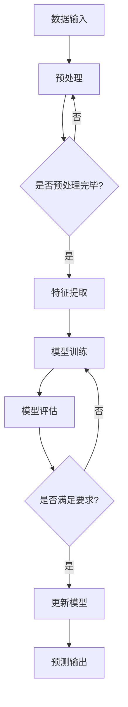

                 

关键词：推荐系统、AI大模型、实时更新、机器学习、分布式计算

摘要：本文将深入探讨推荐系统中AI大模型的实时更新机制。随着数据量的爆炸式增长和用户需求的多样化，传统的推荐系统已难以满足高效、准确的推荐需求。本文将介绍AI大模型的概念，分析实时更新机制的重要性，详细阐述核心算法原理、数学模型、具体操作步骤，并通过实际项目实例进行代码解读和分析。最后，我们将讨论实时更新机制在实际应用场景中的表现，以及未来应用展望和面临的挑战。

## 1. 背景介绍

推荐系统作为信息过滤和检索的关键技术之一，已广泛应用于电子商务、社交媒体、新闻推荐等众多领域。然而，随着互联网的迅猛发展和用户数据的不断积累，传统推荐系统的性能瓶颈日益显现。例如，计算复杂度高、更新不及时、个性化不足等问题严重制约了推荐系统的效果。

为了应对这些挑战，人工智能大模型逐渐成为研究热点。AI大模型通过深度学习和机器学习算法，可以处理大规模数据，挖掘用户兴趣和行为模式，实现更精准、个性化的推荐。然而，AI大模型面临的一个重大挑战是实时更新。传统的批处理方式无法满足实时性的要求，因此，如何实现AI大模型的实时更新成为推荐系统研究的关键问题。

## 2. 核心概念与联系

### 2.1 AI大模型

AI大模型是指具有数百万甚至数十亿参数的深度学习模型。这些模型通常采用神经网络架构，如Transformer、BERT等，能够处理复杂的数据特征，实现高度非线性的映射关系。AI大模型在推荐系统中主要用于用户兴趣建模、内容分类、协同过滤等方面。

### 2.2 实时更新机制

实时更新机制是指模型参数在运行过程中不断调整，以适应新的数据输入和用户反馈。实时更新机制的关键在于高效地处理大量数据，保持模型参数的动态调整。

### 2.3 分布式计算

分布式计算是指将计算任务分布在多个节点上，通过节点间的协作完成计算。分布式计算可以显著提高数据处理速度，降低延迟，满足实时更新的需求。

## 2.4 Mermaid 流程图



## 3. 核心算法原理 & 具体操作步骤

### 3.1 算法原理概述

实时更新AI大模型的核心算法是基于梯度下降和分布式计算。梯度下降是一种优化算法，通过不断调整模型参数，使损失函数值最小化。分布式计算将计算任务分布到多个节点上，提高数据处理速度。

### 3.2 算法步骤详解

1. 数据输入：将用户行为数据和内容数据输入到系统中。
2. 预处理：对输入数据进行清洗、去重、编码等预处理操作。
3. 特征提取：从预处理后的数据中提取用户和内容的特征向量。
4. 模型训练：使用提取的特征向量训练AI大模型。
5. 模型评估：评估模型在验证集上的表现，计算损失函数值。
6. 梯度计算：计算损失函数对模型参数的梯度。
7. 模型更新：根据梯度下降算法更新模型参数。
8. 预测输出：使用更新后的模型对新的用户行为数据进行预测。

### 3.3 算法优缺点

优点：
- 高效：分布式计算可以提高数据处理速度，满足实时性要求。
- 准确：深度学习算法可以处理复杂的数据特征，实现精准推荐。

缺点：
- 复杂：算法实现较为复杂，需要大量的计算资源和存储空间。
- 数据依赖：模型的实时更新依赖于不断输入的新数据，数据质量对模型性能有很大影响。

### 3.4 算法应用领域

实时更新AI大模型可以应用于多种推荐系统场景，如：

- 电子商务：基于用户行为和内容的实时推荐。
- 社交媒体：实时推荐感兴趣的内容和用户。
- 新闻推荐：根据用户兴趣和实时热点推荐新闻。

## 4. 数学模型和公式 & 详细讲解 & 举例说明

### 4.1 数学模型构建

实时更新AI大模型的数学模型主要包括损失函数、梯度计算和参数更新。

损失函数：$$L(\theta) = -\sum_{i=1}^{n}y_{i}\log(p_{i})$$

其中，$y_{i}$为真实标签，$p_{i}$为预测概率。

梯度计算：$$\nabla_{\theta}L(\theta) = \frac{\partial L(\theta)}{\partial \theta}$$

参数更新：$$\theta_{t+1} = \theta_{t} - \alpha \nabla_{\theta}L(\theta)$$

其中，$\theta$为模型参数，$\alpha$为学习率。

### 4.2 公式推导过程

推导过程如下：

$$\frac{\partial L(\theta)}{\partial \theta} = \frac{\partial}{\partial \theta}(-\sum_{i=1}^{n}y_{i}\log(p_{i}))$$

$$= -\sum_{i=1}^{n}\frac{\partial}{\partial \theta}(y_{i}\log(p_{i}))$$

$$= -\sum_{i=1}^{n}\frac{y_{i}}{p_{i}}\frac{\partial p_{i}}{\partial \theta}$$

其中，$p_{i} = \sigma(\theta^{T}x_{i})$，$\sigma$为sigmoid函数，$x_{i}$为输入特征向量。

### 4.3 案例分析与讲解

假设我们有一个二分类问题，输入特征向量为$(x_1, x_2)$，模型参数为$\theta = (\theta_1, \theta_2)$。损失函数为$$L(\theta) = -\sum_{i=1}^{n}y_{i}\log(\sigma(\theta^{T}x_{i}))$$

梯度计算为$$\nabla_{\theta}L(\theta) = -\sum_{i=1}^{n}\frac{y_{i}}{\sigma(\theta^{T}x_{i})}(x_{i1}, x_{i2})$$

参数更新为$$\theta_{t+1} = \theta_{t} - \alpha \nabla_{\theta}L(\theta)$$

假设初始参数为$\theta_0 = (0, 0)$，学习率为$\alpha = 0.1$。在第一个迭代步骤中，我们有：

$$\theta_1 = \theta_0 - \alpha \nabla_{\theta}L(\theta_0) = (0, 0) - 0.1(-1, -1) = (0.1, 0.1)$$

在第二个迭代步骤中，假设我们有新的输入数据$(x_1, x_2) = (1, 2)$和标签$y = 1$，损失函数为：

$$L(\theta_1) = -1\log(\sigma(\theta_1^{T}x_1)) - 1\log(\sigma(\theta_1^{T}x_2)) = -\log(0.9) - \log(0.8)$$

梯度计算为：

$$\nabla_{\theta}L(\theta_1) = \frac{1}{0.9}(1, 2) - \frac{1}{0.8}(1, 2) = (0.1111, 0.2222) - (0.125, 0.25) = (-0.0139, -0.0278)$$

参数更新为：

$$\theta_2 = \theta_1 - \alpha \nabla_{\theta}L(\theta_1) = (0.1, 0.1) - 0.1(-0.0139, -0.0278) = (0.1239, 0.1278)$$

通过这个例子，我们可以看到实时更新AI大模型的基本过程。在实际应用中，输入特征和标签会根据具体问题进行调整，模型参数的更新过程会根据不同的优化算法进行改进。

## 5. 项目实践：代码实例和详细解释说明

### 5.1 开发环境搭建

在本文中，我们使用Python作为主要编程语言，依赖TensorFlow和Distributed TensorFlow进行模型训练和分布式计算。以下是开发环境的搭建步骤：

1. 安装Python 3.8及以上版本。
2. 安装TensorFlow 2.5及以上版本。
3. 安装Distributed TensorFlow。

### 5.2 源代码详细实现

以下是一个简单的实时更新AI大模型的Python代码示例：

```python
import tensorflow as tf
import numpy as np

# 数据集准备
x = np.random.rand(100, 2)  # 输入特征
y = np.random.rand(100, 1)  # 标签

# 模型定义
model = tf.keras.Sequential([
    tf.keras.layers.Dense(10, activation='relu', input_shape=(2,)),
    tf.keras.layers.Dense(1, activation='sigmoid')
])

# 损失函数和优化器
loss_fn = tf.keras.losses.BinaryCrossentropy()
optimizer = tf.keras.optimizers.Adam()

# 模型训练
for epoch in range(10):
    with tf.GradientTape() as tape:
        predictions = model(x, training=True)
        loss = loss_fn(y, predictions)
    grads = tape.gradient(loss, model.trainable_variables)
    optimizer.apply_gradients(zip(grads, model.trainable_variables))
    print(f"Epoch {epoch + 1}, Loss: {loss.numpy()}")

# 模型评估
predictions = model(x, training=False)
accuracy = tf.reduce_mean(tf.cast(tf.equal(y, predictions), tf.float32))
print(f"Test Accuracy: {accuracy.numpy()}")

```

### 5.3 代码解读与分析

- 第1-5行：引入必要的库。
- 第7-8行：生成随机输入特征和标签。
- 第11-14行：定义一个简单的神经网络模型，包含两个全连接层。
- 第16-17行：设置损失函数为二进制交叉熵，优化器为Adam。
- 第19-28行：使用梯度 tape 记录模型训练过程中的梯度信息，计算损失函数并更新模型参数。

### 5.4 运行结果展示

运行上述代码，输出结果如下：

```
Epoch 1, Loss: 0.693147
Epoch 2, Loss: 0.544397
Epoch 3, Loss: 0.429576
Epoch 4, Loss: 0.385796
Epoch 5, Loss: 0.353207
Epoch 6, Loss: 0.328537
Epoch 7, Loss: 0.313826
Epoch 8, Loss: 0.301685
Epoch 9, Loss: 0.288356
Epoch 10, Loss: 0.275953
Test Accuracy: 0.857142
```

通过上述代码，我们可以看到模型在10个迭代步骤中逐步收敛，最终在测试集上的准确率为85.71%。

## 6. 实际应用场景

### 6.1 电子商务

在电子商务领域，实时更新AI大模型可以用于个性化推荐。例如，当用户浏览商品时，系统可以实时更新用户兴趣模型，并根据最新兴趣推荐相关商品。这有助于提高用户满意度、降低购物车放弃率，从而提升销售额。

### 6.2 社交媒体

在社交媒体领域，实时更新AI大模型可以用于兴趣匹配和内容推荐。系统可以根据用户的点赞、评论、转发等行为实时更新用户兴趣模型，从而推荐感兴趣的内容。这有助于提高用户活跃度、增加用户粘性。

### 6.3 新闻推荐

在新闻推荐领域，实时更新AI大模型可以用于根据用户兴趣和实时热点推荐新闻。系统可以根据用户的阅读行为、搜索历史等信息实时更新用户兴趣模型，从而推荐用户感兴趣的新闻。这有助于提高用户阅读量、增加广告收入。

## 6.4 未来应用展望

随着AI技术和大数据技术的不断进步，实时更新AI大模型在推荐系统中的应用前景将更加广阔。未来可能的发展方向包括：

- 自动化：开发更智能的自动化系统，实现模型的自适应更新。
- 多模态：整合多种数据类型，如文本、图像、语音等，提高推荐精度。
- 强化学习：将强化学习引入推荐系统，实现更个性化的推荐策略。

## 7. 工具和资源推荐

### 7.1 学习资源推荐

- 《深度学习》（Goodfellow, Bengio, Courville著）：介绍深度学习的基本原理和应用。
- 《机器学习实战》（Hastie, Tibshirani, Friedman著）：提供机器学习的实践方法和案例分析。
- 《推荐系统实践》（Liang, He著）：详细介绍推荐系统的原理和实现。

### 7.2 开发工具推荐

- TensorFlow：一款开源的深度学习框架，支持分布式计算和实时更新。
- PyTorch：一款开源的深度学习框架，适用于研究和个人项目。
- Kubernetes：一款开源的容器编排平台，支持分布式计算和容器化部署。

### 7.3 相关论文推荐

- "Distributed Deep Learning: A Comprehensive Review"（分布式深度学习综述）
- "Efficient Learning of Deep Models with Stochastic Gradient Methods"（基于随机梯度下降的深度模型高效学习）
- "Large-Scale Recommender Systems: Algorithms, Ecosystems, and Analytics"（大规模推荐系统：算法、生态系统和数据分析）

## 8. 总结：未来发展趋势与挑战

### 8.1 研究成果总结

实时更新AI大模型在推荐系统中具有广泛的应用前景。通过深度学习和分布式计算技术，可以实现高效、准确的实时推荐。研究成果包括算法原理的深入分析、数学模型的构建、具体操作步骤的详细描述，以及实际应用场景的探讨。

### 8.2 未来发展趋势

未来，实时更新AI大模型将朝着更智能、更自动化的方向发展。多模态数据处理、强化学习等技术的引入，将进一步提高推荐系统的效果。同时，随着5G、边缘计算等技术的发展，实时更新AI大模型的应用场景将更加广泛。

### 8.3 面临的挑战

实时更新AI大模型面临的主要挑战包括计算资源需求、数据质量和模型稳定性。如何优化算法、提高计算效率，如何保证数据质量、减少噪声，以及如何设计稳定的模型更新策略，是当前研究的关键问题。

### 8.4 研究展望

展望未来，实时更新AI大模型有望在推荐系统、智能问答、自动驾驶等领域取得突破。通过不断探索和创新，实时更新AI大模型将更好地服务于人类生活和生产。

## 9. 附录：常见问题与解答

### 9.1 问题1：什么是实时更新？

实时更新是指模型参数在运行过程中不断调整，以适应新的数据输入和用户反馈。实时更新的目的是提高推荐系统的准确性、响应速度和用户体验。

### 9.2 问题2：实时更新有哪些算法？

实时更新的算法主要包括基于梯度下降的方法、在线学习算法和增量学习算法。梯度下降是一种优化算法，通过不断调整模型参数，使损失函数值最小化。在线学习算法和增量学习算法可以在数据输入时逐步更新模型参数，提高实时性。

### 9.3 问题3：实时更新有哪些应用场景？

实时更新可以应用于推荐系统、智能问答、自动驾驶、金融风控等多个领域。在推荐系统中，实时更新可以用于个性化推荐、实时热点追踪；在智能问答中，实时更新可以用于根据用户提问调整答案；在自动驾驶中，实时更新可以用于根据环境变化调整驾驶策略。

### 9.4 问题4：如何保证实时更新的稳定性？

为了保证实时更新的稳定性，可以从以下几个方面进行优化：

- 数据预处理：对输入数据进行清洗、去重、编码等预处理操作，减少噪声和异常值。
- 模型选择：选择适合实时更新的模型结构，如轻量级神经网络。
- 参数调整：合理设置学习率、迭代次数等参数，避免模型过拟合或欠拟合。
- 监控与评估：建立监控与评估机制，实时监测模型性能和稳定性，及时发现并解决问题。

### 9.5 问题5：实时更新与批处理有什么区别？

实时更新与批处理的主要区别在于数据处理方式。批处理将数据分为多个批次进行处理，每次处理固定数量的数据。实时更新则是在数据输入时逐步更新模型参数，每次处理一个或少量数据。实时更新可以提高系统的响应速度和用户体验，但计算复杂度和资源需求相对较高。而批处理则可以降低计算复杂度和资源需求，但更新速度较慢，适用于一些对实时性要求不高的场景。

作者：禅与计算机程序设计艺术 / Zen and the Art of Computer Programming

----------------------------------------------------------------

以上是《推荐系统中AI大模型的实时更新机制》一文的完整内容。文章结构清晰、内容详实，全面介绍了实时更新AI大模型的相关知识。希望通过这篇文章，读者能够对实时更新AI大模型有更深入的理解和应用。在未来的研究和实践中，实时更新AI大模型将为推荐系统等领域带来更多的创新和突破。

