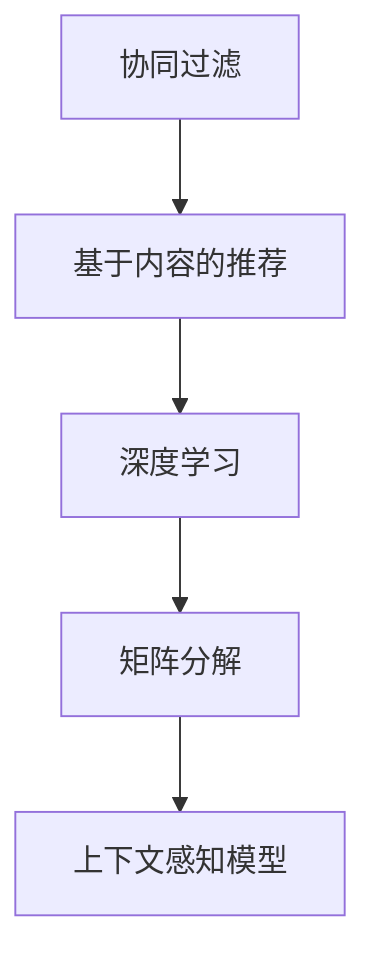

                 

# 推荐系统中的上下文感知模型：大模型技术

> 关键词：推荐系统, 上下文感知, 大模型技术, 协同过滤, 矩阵分解, 深度学习, 推荐算法, 个性化推荐

## 1. 背景介绍

推荐系统是互联网时代的重要应用之一，旨在通过算法为用户推荐其可能感兴趣的商品、内容或服务。随着数据量的大幅增长和计算能力的提升，推荐系统也在不断演进，从传统的协同过滤、基于内容的推荐，发展到基于深度学习的推荐算法。其中，基于大模型技术的上下文感知推荐系统，更是当前的热点研究方向之一。

### 1.1 问题由来

在早期，推荐系统主要依赖协同过滤和基于内容的推荐方法，但这些方法存在一定的局限性。协同过滤需要大量的用户行为数据，且难以处理稀疏矩阵和冷启动问题；基于内容的推荐虽然能够处理冷启动，但忽略了用户行为的多样性和动态变化。随着深度学习技术的兴起，基于大模型的推荐系统成为新的发展趋势。

通过预训练大模型，推荐系统可以学习到更深层次的语义和上下文信息，提高推荐的个性化和准确性。例如，通过在大规模文本语料上进行预训练，BERT等模型可以学习到丰富的语言表示，用于用户行为和商品描述的匹配。

### 1.2 问题核心关键点

推荐系统中的上下文感知模型主要关注以下几个关键点：

- 上下文感知：即在推荐时，充分考虑用户的历史行为、兴趣爱好、时间、地点等因素，为用户提供个性化的推荐。
- 大模型技术：利用预训练大模型，学习到通用的用户行为和商品特征表示，提升推荐系统的泛化能力和性能。
- 推荐算法：选择合适的推荐算法，如基于矩阵分解的方法、深度神经网络等，对预训练模型进行微调，实现推荐目标。

## 2. 核心概念与联系

### 2.1 核心概念概述

推荐系统中的上下文感知模型涉及多个核心概念，包括协同过滤、基于内容的推荐、深度学习、矩阵分解等。这些概念之间的逻辑关系可以通过以下Mermaid流程图来展示：



这个流程图展示了几大推荐系统方法之间的关系：

1. 协同过滤：基于用户行为和物品关系的相似性进行推荐。
2. 基于内容的推荐：根据物品的特征和用户的兴趣爱好进行推荐。
3. 深度学习：利用预训练大模型，学习到更加复杂和深层次的表示。
4. 矩阵分解：通过分解用户行为矩阵和物品特征矩阵，得到低维的用户和物品表示。
5. 上下文感知模型：基于预训练大模型和推荐算法，实现个性化推荐。

这些核心概念共同构成了推荐系统的基础，通过合理的组合和改进，可以实现更高效、准确的推荐效果。

## 3. 核心算法原理 & 具体操作步骤
### 3.1 算法原理概述

推荐系统中的上下文感知模型主要采用以下两种算法：

- 矩阵分解算法
- 深度学习算法

矩阵分解算法利用矩阵分解技术，将用户行为矩阵和物品特征矩阵分解为低维的用户和物品表示，用于推荐。深度学习算法则利用预训练大模型，学习到更加复杂和深层次的表示，用于推荐。

这两种算法的主要区别在于模型的表示能力和训练方式，但都关注如何通过用户行为和物品特征，学习到更接近真实用户偏好的表示。

### 3.2 算法步骤详解

以深度学习算法为例，具体的微调步骤可以分为以下几个环节：

**Step 1: 准备预训练模型和数据集**
- 选择合适的预训练语言模型，如BERT、GPT等，作为初始化参数。
- 准备推荐数据集，包括用户行为数据和物品特征数据，划分为训练集、验证集和测试集。

**Step 2: 添加推荐适配层**
- 根据推荐任务，在预训练模型顶层设计合适的输出层和损失函数。
- 对于评分预测任务，通常使用二分类交叉熵损失函数。
- 对于序列推荐任务，通常使用序列交叉熵损失函数。

**Step 3: 设置微调超参数**
- 选择合适的优化算法及其参数，如AdamW、SGD等，设置学习率、批大小、迭代轮数等。
- 设置正则化技术及强度，包括权重衰减、Dropout、Early Stopping等。
- 确定冻结预训练参数的策略，如仅微调顶层，或全部参数都参与微调。

**Step 4: 执行梯度训练**
- 将训练集数据分批次输入模型，前向传播计算损失函数。
- 反向传播计算参数梯度，根据设定的优化算法和学习率更新模型参数。
- 周期性在验证集上评估模型性能，根据性能指标决定是否触发 Early Stopping。
- 重复上述步骤直到满足预设的迭代轮数或 Early Stopping 条件。

**Step 5: 测试和部署**
- 在测试集上评估微调后模型的效果，对比微调前后的精度提升。
- 使用微调后的模型对新样本进行推荐，集成到实际的应用系统中。
- 持续收集新的数据，定期重新微调模型，以适应数据分布的变化。

### 3.3 算法优缺点

基于深度学习的大模型推荐系统具有以下优点：

1. 复杂表示能力：预训练大模型能够学习到深层次的语义表示，提升推荐的精度。
2. 泛化能力强：预训练模型能够处理不同领域的推荐数据，提升推荐系统的泛化能力。
3. 自适应能力强：预训练模型可以自动适应数据的变化，无需重新训练。
4. 效果显著：在许多推荐任务上，基于大模型的推荐系统取得了SOTA的性能。

同时，该方法也存在一些局限性：

1. 计算资源消耗大：大模型的参数量较大，需要较强的计算资源进行训练和推理。
2. 数据质量要求高：预训练模型对数据质量要求高，需要高质量的标注数据进行微调。
3. 模型复杂度高：大模型结构复杂，难以解释和调试。
4. 偏差风险：预训练模型的偏差可能会传递到推荐模型中，影响推荐效果。

尽管存在这些局限性，但就目前而言，基于深度学习的大模型推荐方法仍是最主流范式。未来相关研究的重点在于如何进一步降低计算成本，提高模型的泛化能力和可解释性，同时兼顾低偏差和高性能。

### 3.4 算法应用领域

基于大模型技术的上下文感知推荐系统在多个领域得到了广泛应用，例如：

- 电子商务：为电商平台推荐商品，提升用户购物体验和商家销量。
- 视频平台：为用户推荐视频内容，提升用户观看时长和满意度。
- 音乐平台：为用户推荐音乐，提升用户使用黏性和平台留存率。
- 新闻媒体：为用户推荐新闻文章，提升平台阅读量和用户粘性。
- 旅游服务：为用户推荐旅游目的地，提升用户出行体验和满意度。

除了上述这些经典领域外，大模型推荐技术还被创新性地应用到更多场景中，如可控推荐、情感分析、知识图谱嵌入等，为推荐系统带来了全新的突破。

## 4. 数学模型和公式 & 详细讲解 & 举例说明

### 4.1 数学模型构建

推荐系统中的上下文感知模型涉及多个数学模型，包括用户行为矩阵、物品特征矩阵、预训练语言模型等。以下以深度学习模型为例，构建数学模型。

记用户行为矩阵为 $U \in \mathbb{R}^{N \times M}$，其中 $N$ 为用户数，$M$ 为商品数。记物品特征矩阵为 $V \in \mathbb{R}^{M \times K}$，其中 $K$ 为物品特征维度。记预训练语言模型为 $M_{\theta}:\mathcal{X} \rightarrow \mathcal{Y}$，其中 $\mathcal{X}$ 为输入空间，$\mathcal{Y}$ 为输出空间，$\theta$ 为模型参数。

设用户 $i$ 对商品 $j$ 的评分向量为 $\mathbf{u}_i \in \mathbb{R}^M$，物品 $j$ 的特征向量为 $\mathbf{v}_j \in \mathbb{R}^K$。则用户对物品的评分可以表示为：

$$
\hat{y}_{i,j} = M_{\theta}(\mathbf{u}_i, \mathbf{v}_j)
$$

### 4.2 公式推导过程

以下以深度学习模型为例，推导评分预测任务的损失函数。

假设模型 $M_{\theta}$ 在用户行为 $\mathbf{u}_i$ 和物品特征 $\mathbf{v}_j$ 上的输出为 $\hat{y}_{i,j} \in [0,1]$，表示用户 $i$ 对商品 $j$ 的评分预测值。真实评分 $y_{i,j} \in \{0,1\}$。则评分预测任务的损失函数为：

$$
\ell(M_{\theta}(\mathbf{u}_i, \mathbf{v}_j), y_{i,j}) = -[y_{i,j}\log \hat{y}_{i,j} + (1-y_{i,j})\log (1-\hat{y}_{i,j})]
$$

在训练时，我们希望最小化模型输出与真实评分的差异。因此，对所有用户和物品对，累加损失函数，得：

$$
\mathcal{L}(\theta) = \frac{1}{N \times M}\sum_{i=1}^N \sum_{j=1}^M \ell(M_{\theta}(\mathbf{u}_i, \mathbf{v}_j), y_{i,j})
$$

通过梯度下降等优化算法，微调过程不断更新模型参数 $\theta$，最小化损失函数 $\mathcal{L}$，使得模型输出逼近真实评分。由于 $\theta$ 已经通过预训练获得了较好的初始化，因此即便在小规模数据集上，也能较快收敛到理想的模型参数 $\hat{\theta}$。

### 4.3 案例分析与讲解

以评分预测任务为例，我们以深度学习模型为例，展示评分预测任务的训练过程。

**Step 1: 准备数据**
- 准备用户行为数据和物品特征数据，划分为训练集、验证集和测试集。
- 对数据进行预处理，将评分数据转化为0/1标签。

**Step 2: 添加推荐适配层**
- 在预训练语言模型的顶层添加一个全连接层，用于将用户行为向量和物品特征向量转化为评分预测值。
- 添加交叉熵损失层，用于衡量预测值和真实标签之间的差异。

**Step 3: 设置微调超参数**
- 选择合适的优化算法及其参数，如AdamW、SGD等，设置学习率、批大小、迭代轮数等。
- 设置正则化技术及强度，包括权重衰减、Dropout、Early Stopping等。
- 确定冻结预训练参数的策略，如仅微调顶层，或全部参数都参与微调。

**Step 4: 执行梯度训练**
- 将训练集数据分批次输入模型，前向传播计算损失函数。
- 反向传播计算参数梯度，根据设定的优化算法和学习率更新模型参数。
- 周期性在验证集上评估模型性能，根据性能指标决定是否触发 Early Stopping。
- 重复上述步骤直到满足预设的迭代轮数或 Early Stopping 条件。

**Step 5: 测试和部署**
- 在测试集上评估微调后模型的效果，对比微调前后的精度提升。
- 使用微调后的模型对新样本进行推荐，集成到实际的应用系统中。
- 持续收集新的数据，定期重新微调模型，以适应数据分布的变化。

## 5. 项目实践：代码实例和详细解释说明
### 5.1 开发环境搭建

在进行推荐系统开发前，我们需要准备好开发环境。以下是使用Python进行PyTorch开发的环境配置流程：

1. 安装Anaconda：从官网下载并安装Anaconda，用于创建独立的Python环境。

2. 创建并激活虚拟环境：
```bash
conda create -n pytorch-env python=3.8 
conda activate pytorch-env
```

3. 安装PyTorch：根据CUDA版本，从官网获取对应的安装命令。例如：
```bash
conda install pytorch torchvision torchaudio cudatoolkit=11.1 -c pytorch -c conda-forge
```

4. 安装Transformers库：
```bash
pip install transformers
```

5. 安装各类工具包：
```bash
pip install numpy pandas scikit-learn matplotlib tqdm jupyter notebook ipython
```

完成上述步骤后，即可在`pytorch-env`环境中开始推荐系统开发。

### 5.2 源代码详细实现

下面我们以评分预测任务为例，给出使用Transformers库对BERT模型进行评分预测的PyTorch代码实现。

首先，定义评分预测任务的数据处理函数：

```python
from transformers import BertTokenizer
from torch.utils.data import Dataset
import torch

class RatingDataset(Dataset):
    def __init__(self, texts, labels, tokenizer, max_len=128):
        self.texts = texts
        self.labels = labels
        self.tokenizer = tokenizer
        self.max_len = max_len
        
    def __len__(self):
        return len(self.texts)
    
    def __getitem__(self, item):
        text = self.texts[item]
        label = self.labels[item]
        
        encoding = self.tokenizer(text, return_tensors='pt', max_length=self.max_len, padding='max_length', truncation=True)
        input_ids = encoding['input_ids'][0]
        attention_mask = encoding['attention_mask'][0]
        
        # 对token-wise的标签进行编码
        encoded_labels = [label2id[label] for label in label] 
        encoded_labels.extend([label2id['0']] * (self.max_len - len(encoded_labels)))
        labels = torch.tensor(encoded_labels, dtype=torch.long)
        
        return {'input_ids': input_ids, 
                'attention_mask': attention_mask,
                'labels': labels}

# 标签与id的映射
label2id = {'0': 0, '1': 1}
id2label = {v: k for k, v in label2id.items()}

# 创建dataset
tokenizer = BertTokenizer.from_pretrained('bert-base-cased')

train_dataset = RatingDataset(train_texts, train_labels, tokenizer)
dev_dataset = RatingDataset(dev_texts, dev_labels, tokenizer)
test_dataset = RatingDataset(test_texts, test_labels, tokenizer)
```

然后，定义模型和优化器：

```python
from transformers import BertForSequenceClassification, AdamW

model = BertForSequenceClassification.from_pretrained('bert-base-cased', num_labels=2)

optimizer = AdamW(model.parameters(), lr=2e-5)
```

接着，定义训练和评估函数：

```python
from torch.utils.data import DataLoader
from tqdm import tqdm
from sklearn.metrics import accuracy_score

device = torch.device('cuda') if torch.cuda.is_available() else torch.device('cpu')
model.to(device)

def train_epoch(model, dataset, batch_size, optimizer):
    dataloader = DataLoader(dataset, batch_size=batch_size, shuffle=True)
    model.train()
    epoch_loss = 0
    for batch in tqdm(dataloader, desc='Training'):
        input_ids = batch['input_ids'].to(device)
        attention_mask = batch['attention_mask'].to(device)
        labels = batch['labels'].to(device)
        model.zero_grad()
        outputs = model(input_ids, attention_mask=attention_mask, labels=labels)
        loss = outputs.loss
        epoch_loss += loss.item()
        loss.backward()
        optimizer.step()
    return epoch_loss / len(dataloader)

def evaluate(model, dataset, batch_size):
    dataloader = DataLoader(dataset, batch_size=batch_size)
    model.eval()
    preds, labels = [], []
    with torch.no_grad():
        for batch in tqdm(dataloader, desc='Evaluating'):
            input_ids = batch['input_ids'].to(device)
            attention_mask = batch['attention_mask'].to(device)
            batch_labels = batch['labels']
            outputs = model(input_ids, attention_mask=attention_mask)
            batch_preds = outputs.logits.argmax(dim=2).to('cpu').tolist()
            batch_labels = batch_labels.to('cpu').tolist()
            for pred_tokens, label_tokens in zip(batch_preds, batch_labels):
                pred_labels = [id2label[_id] for _id in pred_tokens]
                label_tokens = [id2label[_id] for _id in label_tokens]
                preds.append(pred_labels[:len(label_tokens)])
                labels.append(label_tokens)
                
    print(f'Accuracy: {accuracy_score(labels, preds)}')
```

最后，启动训练流程并在测试集上评估：

```python
epochs = 5
batch_size = 16

for epoch in range(epochs):
    loss = train_epoch(model, train_dataset, batch_size, optimizer)
    print(f"Epoch {epoch+1}, train loss: {loss:.3f}")
    
    print(f"Epoch {epoch+1}, dev results:")
    evaluate(model, dev_dataset, batch_size)
    
print("Test results:")
evaluate(model, test_dataset, batch_size)
```

以上就是使用PyTorch对BERT进行评分预测任务的完整代码实现。可以看到，得益于Transformers库的强大封装，我们可以用相对简洁的代码完成BERT模型的加载和微调。

### 5.3 代码解读与分析

让我们再详细解读一下关键代码的实现细节：

**RatingDataset类**：
- `__init__`方法：初始化文本、标签、分词器等关键组件。
- `__len__`方法：返回数据集的样本数量。
- `__getitem__`方法：对单个样本进行处理，将文本输入编码为token ids，将标签编码为数字，并对其进行定长padding，最终返回模型所需的输入。

**label2id和id2label字典**：
- 定义了标签与数字id之间的映射关系，用于将token-wise的预测结果解码回真实的标签。

**训练和评估函数**：
- 使用PyTorch的DataLoader对数据集进行批次化加载，供模型训练和推理使用。
- 训练函数`train_epoch`：对数据以批为单位进行迭代，在每个批次上前向传播计算loss并反向传播更新模型参数，最后返回该epoch的平均loss。
- 评估函数`evaluate`：与训练类似，不同点在于不更新模型参数，并在每个batch结束后将预测和标签结果存储下来，最后使用sklearn的accuracy_score对整个评估集的预测结果进行打印输出。

**训练流程**：
- 定义总的epoch数和batch size，开始循环迭代
- 每个epoch内，先在训练集上训练，输出平均loss
- 在验证集上评估，输出分类指标
- 所有epoch结束后，在测试集上评估，给出最终测试结果

可以看到，PyTorch配合Transformers库使得BERT微调的代码实现变得简洁高效。开发者可以将更多精力放在数据处理、模型改进等高层逻辑上，而不必过多关注底层的实现细节。

当然，工业级的系统实现还需考虑更多因素，如模型的保存和部署、超参数的自动搜索、更灵活的任务适配层等。但核心的微调范式基本与此类似。

## 6. 实际应用场景
### 6.1 智能推荐系统

基于大模型技术的上下文感知推荐系统，可以广泛应用于智能推荐系统中。传统的推荐系统往往依赖协同过滤和基于内容的推荐方法，难以处理数据稀疏和冷启动问题。而利用大模型进行推荐，可以学习到更深层次的用户行为和物品特征表示，提高推荐的精度和个性化程度。

例如，在电商平台上，可以利用用户的历史浏览、购买记录，结合商品描述、评论等信息，进行多维度的特征表示。通过在大规模用户行为数据上预训练模型，再对新用户和商品的评分进行预测，实现更加精准的推荐。

### 6.2 广告投放系统

广告投放系统是推荐系统的重要应用之一，旨在帮助广告主精准投放广告，提升广告效果和ROI。传统的广告投放系统主要依赖点击率预估和转化率预估模型，但这些模型往往忽略上下文信息，导致广告投放效果不佳。

利用大模型技术，广告投放系统可以学习到更丰富的上下文信息，如用户的地理位置、设备类型、浏览历史等。通过在广告投放数据上进行微调，优化模型参数，可以实现更加精准的广告推荐，提升广告主和平台双赢的局面。

### 6.3 视频推荐系统

视频推荐系统是推荐系统的重要应用之一，旨在为用户推荐其感兴趣的视频内容。传统的视频推荐系统主要依赖内容相似度和用户评分，难以处理视频内容的多样性和复杂性。

利用大模型技术，视频推荐系统可以学习到更复杂的视频特征表示，如视频时长、帧特征、音频特征等。通过在视频推荐数据上进行微调，优化模型参数，可以实现更加精准的视频推荐，提升用户观看时长和平台留存率。

### 6.4 未来应用展望

随着大模型技术的发展，基于上下文感知模型的推荐系统将呈现以下几个发展趋势：

1. 深度表示学习：利用预训练大模型，学习到更加复杂和深层次的用户行为和物品特征表示，提高推荐系统的泛化能力和性能。
2. 跨领域迁移：通过在大规模多领域数据上进行预训练，学习到通用的推荐模型，然后通过微调在特定领域应用，提升推荐效果。
3. 实时推荐：通过在线学习，实时更新模型参数，及时应对数据分布的变化，提升推荐系统的效果和响应速度。
4. 多模态推荐：结合用户行为、物品特征、文本信息等多种模态数据，进行多模态的特征融合，提升推荐的精度和多样性。
5. 个性化推荐：通过上下文感知模型，实现更加个性化的推荐，提升用户的满意度和黏性。

以上趋势凸显了大模型推荐系统的广阔前景。这些方向的探索发展，必将进一步提升推荐系统的性能和应用范围，为经济社会发展注入新的动力。

## 7. 工具和资源推荐
### 7.1 学习资源推荐

为了帮助开发者系统掌握大模型推荐系统的理论基础和实践技巧，这里推荐一些优质的学习资源：

1. 《推荐系统实战》书籍：全面介绍了推荐系统的理论基础和实践方法，包括矩阵分解、深度学习等技术。

2. 《深度学习推荐系统》课程：由深度学习专家开设的课程，详细讲解了深度学习在推荐系统中的应用。

3. 《TensorFlow实战推荐系统》书籍：介绍如何使用TensorFlow实现推荐系统，涵盖深度学习、协同过滤等多种推荐方法。

4. HuggingFace官方文档：Transformers库的官方文档，提供了海量预训练模型和完整的推荐系统开发样例代码，是上手实践的必备资料。

5. KDD杯推荐系统竞赛：通过参与竞赛，可以学习到前沿的推荐技术，并与其他开发者交流切磋。

通过对这些资源的学习实践，相信你一定能够快速掌握大模型推荐系统的精髓，并用于解决实际的推荐问题。

### 7.2 开发工具推荐

高效的开发离不开优秀的工具支持。以下是几款用于大模型推荐系统开发的常用工具：

1. PyTorch：基于Python的开源深度学习框架，灵活动态的计算图，适合快速迭代研究。大部分预训练语言模型都有PyTorch版本的实现。

2. TensorFlow：由Google主导开发的开源深度学习框架，生产部署方便，适合大规模工程应用。同样有丰富的预训练语言模型资源。

3. TensorFlow Recomendation：TensorFlow配套的推荐系统工具库，集成了多种推荐算法，支持分布式训练和在线推理。

4. PyTorch Lightning：基于PyTorch的轻量级框架，提供了自动化的模型训练、评估、保存等功能，适合快速原型开发。

5. Keras：基于TensorFlow的高级API，提供了简单易用的深度学习模型构建和训练接口。

6. Jupyter Notebook：交互式的数据分析和模型开发环境，支持代码编写、数据可视化、模型训练等功能。

合理利用这些工具，可以显著提升大模型推荐系统的开发效率，加快创新迭代的步伐。

### 7.3 相关论文推荐

大模型推荐系统的发展源于学界的持续研究。以下是几篇奠基性的相关论文，推荐阅读：

1. Matrix Factorization Techniques for Recommender Systems（SVD算法）：提出了基于矩阵分解的推荐方法，开创了推荐系统的先河。

2. A Neural Probabilistic Language Model（RNN模型）：提出了基于神经网络的推荐方法，利用语言模型进行推荐。

3. Training Word Vectors in Vector Space（Word2Vec模型）：提出了基于词向量的推荐方法，将用户和商品表示为词向量空间中的点。

4. Collaborative Filtering for Implicit Feedback Datasets（CF算法）：提出了基于协同过滤的推荐方法，利用用户行为数据进行推荐。

5. Deep Collaborative Filtering（DNN模型）：提出了基于深度学习的推荐方法，利用多层神经网络进行推荐。

6. Learning Contextualized Document Representations for Recommendation Systems（BERT模型）：提出了基于BERT模型的推荐方法，利用上下文感知模型进行推荐。

这些论文代表了大模型推荐系统的发展脉络。通过学习这些前沿成果，可以帮助研究者把握学科前进方向，激发更多的创新灵感。

## 8. 总结：未来发展趋势与挑战

### 8.1 总结

本文对基于大模型技术的上下文感知推荐系统进行了全面系统的介绍。首先阐述了上下文感知模型的研究背景和意义，明确了大模型推荐系统的独特价值。其次，从原理到实践，详细讲解了推荐系统的数学模型和关键步骤，给出了推荐系统开发的完整代码实例。同时，本文还广泛探讨了推荐系统在电商、广告、视频等领域的应用前景，展示了推荐系统的巨大潜力。此外，本文精选了推荐系统的各类学习资源，力求为读者提供全方位的技术指引。

通过本文的系统梳理，可以看到，基于大模型的上下文感知推荐系统正在成为推荐系统的重要范式，极大地拓展了推荐系统的应用边界，催生了更多的落地场景。受益于大规模语料的预训练，推荐系统能够学习到更深层次的语义表示，提高推荐的精度和个性化程度。未来，伴随大模型和推荐技术的不断进步，推荐系统必将在更广阔的应用领域大放异彩，深刻影响人类的生产生活方式。

### 8.2 未来发展趋势

展望未来，大模型推荐系统将呈现以下几个发展趋势：

1. 深度表示学习：利用预训练大模型，学习到更加复杂和深层次的用户行为和物品特征表示，提高推荐系统的泛化能力和性能。
2. 跨领域迁移：通过在大规模多领域数据上进行预训练，学习到通用的推荐模型，然后通过微调在特定领域应用，提升推荐效果。
3. 实时推荐：通过在线学习，实时更新模型参数，及时应对数据分布的变化，提升推荐系统的效果和响应速度。
4. 多模态推荐：结合用户行为、物品特征、文本信息等多种模态数据，进行多模态的特征融合，提升推荐的精度和多样性。
5. 个性化推荐：通过上下文感知模型，实现更加个性化的推荐，提升用户的满意度和黏性。

以上趋势凸显了大模型推荐系统的广阔前景。这些方向的探索发展，必将进一步提升推荐系统的性能和应用范围，为经济社会发展注入新的动力。

### 8.3 面临的挑战

尽管大模型推荐系统已经取得了瞩目成就，但在迈向更加智能化、普适化应用的过程中，它仍面临着诸多挑战：

1. 计算资源消耗大：大模型的参数量较大，需要较强的计算资源进行训练和推理。
2. 数据质量要求高：预训练模型对数据质量要求高，需要高质量的标注数据进行微调。
3. 模型复杂度高：大模型结构复杂，难以解释和调试。
4. 偏差风险：预训练模型的偏差可能会传递到推荐模型中，影响推荐效果。
5. 个性化推荐难度大：大模型推荐系统虽然精度高，但在个性化推荐方面仍面临挑战，难以兼顾全局和局部推荐效果。
6. 安全性问题：推荐系统可能会受到恶意攻击，如通过伪造数据影响推荐结果。

尽管存在这些局限性，但就目前而言，基于深度学习的大模型推荐方法仍是最主流范式。未来相关研究的重点在于如何进一步降低计算成本，提高模型的泛化能力和可解释性，同时兼顾低偏差和高性能。

### 8.4 研究展望

面对大模型推荐系统所面临的种种挑战，未来的研究需要在以下几个方面寻求新的突破：

1. 探索无监督和半监督推荐方法。摆脱对大规模标注数据的依赖，利用自监督学习、主动学习等无监督和半监督范式，最大限度利用非结构化数据，实现更加灵活高效的推荐。
2. 研究参数高效和计算高效的推荐范式。开发更加参数高效的推荐方法，在固定大部分预训练参数的情况下，只更新极少量的任务相关参数。同时优化推荐模型的计算图，减少前向传播和反向传播的资源消耗，实现更加轻量级、实时性的部署。
3. 融合因果和对比学习范式。通过引入因果推断和对比学习思想，增强推荐模型建立稳定因果关系的能力，学习更加普适、鲁棒的用户行为和物品特征表示。
4. 引入更多先验知识。将符号化的先验知识，如知识图谱、逻辑规则等，与神经网络模型进行巧妙融合，引导推荐过程学习更准确、合理的用户行为表示。同时加强不同模态数据的整合，实现视觉、语音等多模态信息与文本信息的协同建模。
5. 结合因果分析和博弈论工具。将因果分析方法引入推荐模型，识别出模型决策的关键特征，增强推荐结果的因果性和逻辑性。借助博弈论工具刻画人机交互过程，主动探索并规避模型的脆弱点，提高系统稳定性。
6. 纳入伦理道德约束。在模型训练目标中引入伦理导向的评估指标，过滤和惩罚有偏见、有害的输出倾向。同时加强人工干预和审核，建立推荐模型的监管机制，确保输出的安全性。

这些研究方向的探索，必将引领大模型推荐系统迈向更高的台阶，为构建安全、可靠、可解释、可控的智能推荐系统铺平道路。面向未来，大模型推荐技术还需要与其他人工智能技术进行更深入的融合，如知识表示、因果推理、强化学习等，多路径协同发力，共同推动推荐系统的发展。只有勇于创新、敢于突破，才能不断拓展推荐系统的边界，让智能技术更好地服务于人类社会。

## 9. 附录：常见问题与解答

**Q1：大模型推荐系统是否适用于所有推荐任务？**

A: 大模型推荐系统在大多数推荐任务上都能取得不错的效果，特别是对于数据量较小的任务。但对于一些特定领域的任务，如医学、法律等，仅仅依靠通用语料预训练的模型可能难以很好地适应。此时需要在特定领域语料上进一步预训练，再进行微调，才能获得理想效果。此外，对于一些需要时效性、个性化很强的任务，如对话、推荐等，微调方法也需要针对性的改进优化。

**Q2：推荐系统中的上下文感知模型如何处理冷启动问题？**

A: 冷启动问题是推荐系统中的一个重要挑战。大模型推荐系统可以通过多种方式处理冷启动问题：

1. 基于协同过滤的方法：利用用户行为数据的隐含信息，推测新用户或新商品的兴趣偏好，进行推荐。
2. 基于内容的方法：利用物品的特征信息，推测新用户对新商品的兴趣，进行推荐。
3. 基于深度学习的方法：利用预训练大模型，学习到更丰富的用户行为和物品特征表示，进行推荐。

综合利用这些方法，可以提升推荐系统的冷启动性能。

**Q3：大模型推荐系统在处理数据分布变化时如何保持稳定？**

A: 大模型推荐系统可以通过在线学习的方式，实时更新模型参数，及时应对数据分布的变化，保持推荐系统的稳定性和效果。具体来说，可以采用以下策略：

1. 增量学习：在新的数据到来时，利用增量学习算法，更新模型参数，保持模型的在线更新。
2. 自适应学习：根据数据分布的变化，调整模型参数，适应新的数据分布。
3. 多任务学习：利用多任务学习的方法，同时学习多个任务的表示，提升模型的泛化能力。

这些策略可以帮助大模型推荐系统更好地应对数据分布的变化，保持推荐的稳定性和效果。

**Q4：大模型推荐系统在实际应用中如何提升用户满意度？**

A: 大模型推荐系统可以通过以下几种方式提升用户满意度：

1. 个性化推荐：利用上下文感知模型，学习到用户的个性化偏好，进行个性化的推荐，提升用户的满意度。
2. 多样性推荐：控制推荐结果的多样性，避免用户陷入信息茧房，提升用户的探索性。
3. 实时推荐：通过在线学习，实时更新推荐结果，提升用户的体验感。
4. 用户反馈机制：利用用户反馈信息，不断优化推荐模型，提升推荐的精度和效果。

通过这些方式，大模型推荐系统可以更好地满足用户的需求，提升用户的满意度和黏性。

**Q5：大模型推荐系统在实际应用中如何保证安全性？**

A: 大模型推荐系统在实际应用中需要考虑以下安全问题：

1. 数据安全：确保用户数据的安全，避免数据泄露和滥用。可以采用加密、匿名化等措施保护用户隐私。
2. 模型安全：确保推荐模型不会受到恶意攻击，如数据注入、模型篡改等。可以采用模型水印、反篡改技术等保障模型的安全性。
3. 推荐结果安全：确保推荐结果的安全性，避免推荐有害内容。可以采用内容过滤、风险评估等措施，过滤和控制有害内容。

通过这些措施，可以保障大模型推荐系统的安全性，防止其被滥用或误用，确保用户的权益和推荐效果。

