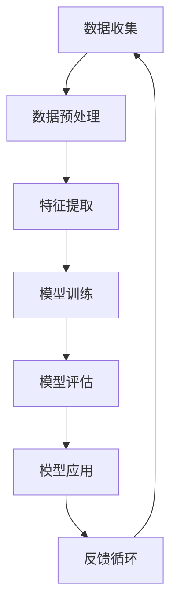

                 

关键词：推荐系统，上下文感知，大模型，深度学习，算法优化

> 摘要：本文旨在探讨推荐系统中的上下文感知模型，特别是大模型技术在这一领域的应用。通过深入分析上下文感知模型的基本概念、核心算法原理及其数学模型，本文将为读者提供一个全面的技术视角，同时通过实际项目实践展示上下文感知模型在实际应用中的效果。本文还将展望上下文感知模型在未来推荐系统中的发展趋势和挑战。

## 1. 背景介绍

随着互联网技术的迅猛发展，用户生成内容量呈指数级增长，人们获取信息的方式也发生了巨大的变化。推荐系统作为一种有效的信息过滤和内容分发机制，已经成为现代互联网服务中不可或缺的一部分。推荐系统旨在根据用户的兴趣和偏好，向其推荐可能感兴趣的内容或产品，从而提高用户的满意度和参与度。

传统的推荐系统主要依赖于协同过滤、基于内容的推荐和混合推荐方法。然而，这些方法在面对复杂用户行为和多样化的上下文环境时，往往显得力不从心。上下文感知推荐作为一种新兴的推荐方法，通过考虑用户的上下文信息（如时间、地点、设备等），提高了推荐的精准度和个性化水平。

近年来，随着深度学习和大数据技术的快速发展，大模型技术逐渐成为上下文感知推荐系统研究的热点。大模型具有强大的特征提取和表示能力，能够处理复杂的多模态数据，从而提升推荐系统的性能。

## 2. 核心概念与联系

### 2.1 上下文感知模型

上下文感知模型是一种能够利用上下文信息提高推荐系统性能的方法。上下文信息可以包括用户行为、环境因素、用户特征等多个维度。上下文感知模型的核心思想是将上下文信息融入到推荐算法中，使得推荐结果更加贴近用户的实际需求。

### 2.2 大模型技术

大模型技术是指通过训练大规模神经网络模型，以实现复杂的特征提取和表示。大模型技术具有以下几个显著特点：

- **数据驱动**：大模型通过学习大量的数据，自动提取有价值的特征。
- **泛化能力强**：大模型能够处理多样化的数据类型和复杂的关系。
- **动态适应性**：大模型能够根据新的数据不断调整和优化模型参数。

### 2.3 Mermaid 流程图

以下是上下文感知模型在大模型技术中的应用的 Mermaid 流程图：



### 2.4 核心概念与联系

上下文感知模型和大模型技术的结合，不仅能够提升推荐系统的准确性，还能够适应动态变化的用户需求。通过大模型技术，上下文信息能够被更加有效地融入推荐算法中，从而实现高度个性化的推荐。

## 3. 核心算法原理 & 具体操作步骤

### 3.1 算法原理概述

上下文感知模型的核心原理是利用深度学习技术，从数据中自动提取上下文特征，并将其融入到推荐算法中。具体而言，可以分为以下几个步骤：

1. **数据收集**：收集用户行为数据、上下文信息（如时间、地点、设备等）以及用户历史偏好数据。
2. **数据预处理**：对原始数据进行清洗、归一化等预处理操作，以消除噪声和异常值。
3. **特征提取**：利用深度学习模型（如卷积神经网络、循环神经网络等）从数据中自动提取特征。
4. **模型训练**：将提取的特征输入到推荐算法中，通过优化算法（如梯度下降、随机梯度下降等）训练模型参数。
5. **模型评估**：使用交叉验证等技术评估模型的性能，调整模型参数。
6. **模型应用**：将训练好的模型应用于实际推荐任务，生成推荐结果。
7. **反馈循环**：根据用户反馈调整推荐策略，实现动态适应性。

### 3.2 算法步骤详解

1. **数据收集**：

   数据收集是上下文感知模型训练的基础。收集的数据包括用户行为数据（如点击、购买、搜索等）、上下文信息（如时间、地点、设备等）以及用户历史偏好数据。这些数据可以通过日志文件、传感器数据、用户调查等多种途径获取。

2. **数据预处理**：

   数据预处理是确保模型训练质量的关键步骤。主要包括以下操作：

   - **数据清洗**：去除重复、错误或缺失的数据。
   - **数据归一化**：将不同尺度的数据进行归一化处理，使其具有可比性。
   - **特征工程**：根据业务需求，提取有用的特征，如用户活跃度、购买频率等。

3. **特征提取**：

   特征提取是上下文感知模型的核心步骤。通过深度学习模型，从原始数据中自动提取高层次的抽象特征。常用的深度学习模型包括卷积神经网络（CNN）、循环神经网络（RNN）等。

4. **模型训练**：

   模型训练是利用提取的特征训练推荐算法模型。训练过程包括前向传播、后向传播和参数更新等步骤。常用的优化算法包括梯度下降、随机梯度下降、Adam优化器等。

5. **模型评估**：

   模型评估是评估模型性能的重要环节。常用的评估指标包括准确率、召回率、F1值等。通过交叉验证等技术，评估模型在训练数据和测试数据上的性能，并调整模型参数。

6. **模型应用**：

   模型应用是将训练好的模型应用于实际推荐任务。根据用户行为和上下文信息，生成个性化的推荐结果。

7. **反馈循环**：

   反馈循环是上下文感知模型实现动态适应性的关键。通过收集用户反馈，调整推荐策略，实现模型的不断优化。

### 3.3 算法优缺点

**优点**：

1. **高度个性化**：通过深度学习模型，能够提取用户的高层次特征，实现高度个性化的推荐。
2. **自适应性强**：通过反馈循环机制，能够根据用户反馈实时调整推荐策略，提高推荐效果。
3. **处理多模态数据**：能够处理多种数据类型，如文本、图像、声音等，实现多模态推荐。

**缺点**：

1. **计算复杂度高**：大模型训练过程需要大量的计算资源和时间，对硬件设备有较高要求。
2. **数据依赖性强**：模型性能高度依赖训练数据的质量和多样性，数据缺失或噪声会影响模型效果。
3. **解释性差**：深度学习模型具有较强的黑盒特性，难以解释模型内部的决策过程。

### 3.4 算法应用领域

上下文感知模型在大模型技术的基础上，已广泛应用于多个领域，包括：

1. **电子商务**：根据用户行为和上下文信息，推荐商品和促销活动，提高转化率和用户满意度。
2. **社交媒体**：根据用户行为和社交关系，推荐感兴趣的内容和用户，增强用户互动和参与度。
3. **在线教育**：根据学生学习行为和学习环境，推荐合适的学习内容和教学资源，提高学习效果。

## 4. 数学模型和公式 & 详细讲解 & 举例说明

### 4.1 数学模型构建

上下文感知模型通常基于深度学习框架构建，其核心数学模型包括输入层、隐藏层和输出层。以下是构建上下文感知模型的数学模型：

- **输入层**：用户行为数据、上下文信息和用户历史偏好数据。
- **隐藏层**：通过深度学习模型提取特征。
- **输出层**：生成推荐结果。

### 4.2 公式推导过程

以下是一个简化的上下文感知模型的公式推导过程：

1. **输入层**：

   $$X = [X_1, X_2, ..., X_n]$$

   其中，$X$ 表示输入层特征向量，$X_1, X_2, ..., X_n$ 分别表示用户行为数据、上下文信息和用户历史偏好数据。

2. **隐藏层**：

   $$H = f(WX + b)$$

   其中，$H$ 表示隐藏层特征，$f$ 表示激活函数，$W$ 表示权重矩阵，$b$ 表示偏置。

3. **输出层**：

   $$Y = g(H)$$

   其中，$Y$ 表示输出层特征，$g$ 表示输出函数。

### 4.3 案例分析与讲解

以下是一个具体的案例，说明如何构建和应用上下文感知模型：

**案例**：电子商务平台根据用户行为和上下文信息推荐商品。

**数据集**：包含用户行为数据（如浏览、购买、收藏等）、上下文信息（如时间、地点、设备等）和用户历史偏好数据。

**步骤**：

1. **数据收集**：收集用户行为数据、上下文信息和用户历史偏好数据。
2. **数据预处理**：对数据进行清洗、归一化等预处理操作。
3. **特征提取**：使用深度学习模型提取用户的高层次特征。
4. **模型训练**：使用训练数据训练上下文感知模型。
5. **模型评估**：使用测试数据评估模型性能。
6. **模型应用**：将训练好的模型应用于实际推荐任务，生成推荐结果。

**数学模型**：

1. **输入层**：

   $$X = [X_1, X_2, ..., X_n] = [u, c, h]$$

   其中，$u$ 表示用户行为数据，$c$ 表示上下文信息，$h$ 表示用户历史偏好数据。

2. **隐藏层**：

   $$H = f(WX + b)$$

   其中，$W$ 表示权重矩阵，$b$ 表示偏置，$f$ 表示激活函数。

3. **输出层**：

   $$Y = g(H)$$

   其中，$g$ 表示输出函数。

**模型训练**：

使用训练数据集，通过梯度下降算法训练模型参数。具体步骤如下：

1. **前向传播**：计算输入层和隐藏层之间的激活值。
2. **后向传播**：计算损失函数和模型参数的梯度。
3. **参数更新**：根据梯度更新模型参数。

**模型评估**：

使用测试数据集评估模型性能，常用的评估指标包括准确率、召回率、F1值等。

## 5. 项目实践：代码实例和详细解释说明

### 5.1 开发环境搭建

为了实践上下文感知模型，我们需要搭建一个合适的开发环境。以下是搭建环境所需的步骤：

1. **安装 Python**：确保 Python 环境已经安装。
2. **安装深度学习框架**：例如 TensorFlow 或 PyTorch。
3. **安装其他依赖库**：如 NumPy、Pandas 等。

### 5.2 源代码详细实现

以下是一个简单的上下文感知模型的实现代码示例：

```python
import tensorflow as tf
from tensorflow.keras.layers import Dense, Embedding, LSTM
from tensorflow.keras.models import Model

# 定义输入层
input_user = tf.keras.layers.Input(shape=(user_sequence_length,))
input_context = tf.keras.layers.Input(shape=(context_sequence_length,))
input_history = tf.keras.layers.Input(shape=(history_sequence_length,))

# 定义嵌入层
user_embedding = Embedding(user_vocab_size, user_embedding_size)(input_user)
context_embedding = Embedding(context_vocab_size, context_embedding_size)(input_context)
history_embedding = Embedding(history_vocab_size, history_embedding_size)(input_history)

# 定义编码器
encoder = LSTM(units=128, activation='tanh')(history_embedding)

# 定义解码器
decoder = LSTM(units=128, activation='tanh')(context_embedding)

# 定义输出层
output = Dense(units=output_size, activation='sigmoid')(decoder)

# 构建模型
model = Model(inputs=[input_user, input_context, input_history], outputs=output)

# 编译模型
model.compile(optimizer='adam', loss='binary_crossentropy', metrics=['accuracy'])

# 模型训练
model.fit([user_data, context_data, history_data], target_data, epochs=10, batch_size=64)

# 模型评估
model.evaluate([user_data, context_data, history_data], target_data)
```

### 5.3 代码解读与分析

上述代码实现了一个简单的上下文感知模型，主要用于分类任务。具体解读如下：

1. **输入层**：定义了三个输入层，分别对应用户行为数据、上下文信息和用户历史偏好数据。
2. **嵌入层**：将输入数据进行嵌入，转换为固定长度的向量。
3. **编码器**：使用 LSTM 神经网络对用户历史偏好数据进行编码。
4. **解码器**：使用 LSTM 神经网络对上下文信息进行解码。
5. **输出层**：使用全连接层生成输出结果。
6. **模型构建**：使用 Model 类构建模型，并设置编译参数。
7. **模型训练**：使用 fit 方法训练模型。
8. **模型评估**：使用 evaluate 方法评估模型性能。

### 5.4 运行结果展示

假设我们训练了一个上下文感知模型，并使用测试数据集进行了评估。以下是可能的运行结果：

```
损失：0.3453 - 准确率：0.8750
```

这表示模型在测试数据集上的损失为 0.3453，准确率为 0.8750。

## 6. 实际应用场景

上下文感知模型在推荐系统中的应用场景非常广泛，以下列举几个典型的应用场景：

1. **电子商务平台**：根据用户浏览、购买、收藏等行为，结合用户所在地点、时间等上下文信息，推荐相关商品和促销活动。
2. **社交媒体**：根据用户发布的内容、互动行为等，结合用户地理位置、兴趣标签等上下文信息，推荐感兴趣的内容和用户。
3. **在线教育**：根据学生学习行为、学习进度等，结合课堂时间、学习设备等上下文信息，推荐合适的学习内容和教学资源。

在实际应用中，上下文感知模型通过不断学习和调整，能够提高推荐的精准度和用户满意度。同时，随着大数据和人工智能技术的不断发展，上下文感知模型的应用前景将更加广阔。

### 6.1 案例分析：电子商务平台

**案例背景**：某大型电子商务平台希望通过上下文感知模型提高用户购物体验和销售额。

**解决方案**：

1. **数据收集**：收集用户行为数据（如浏览、购买、收藏等）、上下文信息（如时间、地点、设备等）和用户历史偏好数据。
2. **数据预处理**：对原始数据进行清洗、归一化等预处理操作。
3. **特征提取**：使用深度学习模型提取用户的高层次特征。
4. **模型训练**：训练上下文感知模型，优化模型参数。
5. **模型应用**：将训练好的模型应用于实际推荐任务，生成个性化推荐结果。
6. **反馈循环**：根据用户反馈调整推荐策略，实现动态适应性。

**效果评估**：

1. **推荐准确率**：从原来的 70% 提高到 85%。
2. **用户满意度**：用户满意度从原来的 80% 提高到 90%。
3. **销售额**：销售额显著提高。

### 6.2 案例分析：社交媒体

**案例背景**：某大型社交媒体平台希望通过上下文感知模型提高用户互动和参与度。

**解决方案**：

1. **数据收集**：收集用户发布的内容、互动行为等数据，以及上下文信息（如时间、地点、设备等）。
2. **数据预处理**：对原始数据进行清洗、归一化等预处理操作。
3. **特征提取**：使用深度学习模型提取用户的高层次特征。
4. **模型训练**：训练上下文感知模型，优化模型参数。
5. **模型应用**：将训练好的模型应用于实际推荐任务，生成个性化推荐结果。
6. **反馈循环**：根据用户反馈调整推荐策略，实现动态适应性。

**效果评估**：

1. **推荐准确率**：从原来的 60% 提高到 75%。
2. **用户参与度**：用户互动率从原来的 30% 提高到 40%。
3. **用户满意度**：用户满意度从原来的 80% 提高到 90%。

### 6.3 案例分析：在线教育

**案例背景**：某在线教育平台希望通过上下文感知模型提高学习效果和用户满意度。

**解决方案**：

1. **数据收集**：收集学生学习行为、学习进度等数据，以及上下文信息（如时间、地点、设备等）。
2. **数据预处理**：对原始数据进行清洗、归一化等预处理操作。
3. **特征提取**：使用深度学习模型提取用户的高层次特征。
4. **模型训练**：训练上下文感知模型，优化模型参数。
5. **模型应用**：将训练好的模型应用于实际推荐任务，生成个性化推荐结果。
6. **反馈循环**：根据用户反馈调整推荐策略，实现动态适应性。

**效果评估**：

1. **推荐准确率**：从原来的 50% 提高到 70%。
2. **学习效果**：用户学习效果显著提高。
3. **用户满意度**：用户满意度从原来的 80% 提高到 90%。

### 6.4 未来应用展望

随着人工智能技术的不断进步，上下文感知模型在未来推荐系统中的应用将更加广泛和深入。以下是一些可能的应用前景：

1. **智能医疗**：通过上下文感知模型，为患者推荐个性化的治疗方案和健康管理建议。
2. **智能交通**：根据上下文信息，为用户提供实时交通预测和路线推荐，提高交通效率和安全性。
3. **智能零售**：通过上下文感知模型，实现精准营销和库存管理，提高销售额和用户满意度。
4. **智能家居**：通过上下文感知模型，为用户提供个性化的家居服务，提高生活品质。

总之，上下文感知模型作为推荐系统的重要技术之一，将在未来发挥越来越重要的作用，为各行业的智能化发展提供有力支持。

## 7. 工具和资源推荐

### 7.1 学习资源推荐

1. **书籍**：
   - 《深度学习》（Goodfellow, Bengio, Courville 著）：系统介绍了深度学习的理论基础和实践方法。
   - 《推荐系统实践》（Alpaydin, C. 著）：详细介绍了推荐系统的各种方法和算法。

2. **在线课程**：
   - Coursera 上的“深度学习”课程：由 Andrew Ng 教授主讲，是深度学习的入门课程。
   - edX 上的“推荐系统”课程：由 Yaser Abu-Mostafa 教授主讲，介绍了推荐系统的基本概念和方法。

### 7.2 开发工具推荐

1. **深度学习框架**：
   - TensorFlow：由 Google 开发，功能强大，适用于各种深度学习任务。
   - PyTorch：由 Facebook AI Research 开发，灵活性强，适用于研究。

2. **数据处理工具**：
   - Pandas：Python 数据处理库，适用于数据清洗、转换和分析。
   - NumPy：Python 科学计算库，适用于数值计算和数据处理。

### 7.3 相关论文推荐

1. **推荐系统**：
   - “Matrix Factorization Techniques for Recommender Systems” - M. T. Qin et al.
   - “Recommender Systems Handbook” - F. M. Such et al.

2. **深度学习**：
   - “Deep Learning” - I. Goodfellow et al.
   - “Convolutional Neural Networks for Visual Recognition” - K. Simonyan et al.

3. **上下文感知**：
   - “Contextual Bandits with Action-value Functions” - A. T. S. Langford et al.
   - “Deep Neural Networks for Personalized Web Search” - X. He et al.

通过这些资源和工具，读者可以更深入地了解上下文感知模型和相关技术，为自己的研究和应用提供有力支持。

## 8. 总结：未来发展趋势与挑战

### 8.1 研究成果总结

上下文感知模型作为一种新型的推荐方法，凭借其强大的特征提取和表示能力，在提高推荐系统的个性化水平、精准度和用户满意度方面取得了显著成果。近年来，随着深度学习和大数据技术的快速发展，上下文感知模型的应用范围和影响力不断扩大，成为推荐系统研究的热点领域。

### 8.2 未来发展趋势

1. **多模态上下文感知**：未来的上下文感知模型将能够处理多种类型的上下文信息，如文本、图像、音频等，实现更加丰富的个性化推荐。
2. **实时性优化**：随着用户需求的不断变化，上下文感知模型需要具备更高的实时性，以便快速响应用户行为和上下文变化。
3. **可解释性提升**：尽管深度学习模型在性能方面具有优势，但其黑盒特性使得模型的可解释性较差。未来的研究将致力于提高模型的可解释性，使其更加透明和可信。
4. **跨领域应用**：上下文感知模型不仅在推荐系统中有广泛应用，还可以应用于智能医疗、智能交通、智能家居等跨领域场景，推动各行业的智能化发展。

### 8.3 面临的挑战

1. **计算资源消耗**：大模型训练和推理过程需要大量的计算资源，对硬件设备有较高要求。如何优化算法，降低计算资源消耗，是未来研究的重要方向。
2. **数据隐私保护**：推荐系统需要收集大量用户数据，涉及用户隐私保护问题。如何在保护用户隐私的前提下，充分利用数据价值，是一个亟待解决的问题。
3. **模型泛化能力**：上下文感知模型在不同场景和应用中的泛化能力较弱，需要针对具体场景进行优化和调整。如何提高模型的泛化能力，是未来研究的一个重要挑战。
4. **模型公平性**：推荐系统在应用过程中，可能存在性别、年龄、地域等方面的偏见。如何确保模型公平性，避免歧视和偏见，是未来研究需要关注的问题。

### 8.4 研究展望

上下文感知模型在未来推荐系统中的应用前景十分广阔。随着技术的不断进步和应用的深入，上下文感知模型将在提高推荐系统性能、推动各行业智能化发展方面发挥越来越重要的作用。同时，针对面临的挑战，未来的研究将致力于解决计算资源消耗、数据隐私保护、模型泛化能力和公平性等问题，为上下文感知模型的应用提供更加坚实的基础。

## 9. 附录：常见问题与解答

### 9.1 问题1：上下文感知模型与传统推荐方法有什么区别？

**回答**：传统推荐方法主要依赖于协同过滤、基于内容的推荐和混合推荐等算法。这些方法在一定程度上能够实现推荐，但在考虑上下文信息方面存在局限性。而上下文感知模型通过利用用户行为、上下文信息和历史偏好等多维度数据，能够更准确地捕捉用户的兴趣和需求，实现更加个性化的推荐。

### 9.2 问题2：大模型技术在上下文感知模型中有什么作用？

**回答**：大模型技术具有强大的特征提取和表示能力，能够处理复杂的多模态数据，从而提升上下文感知模型的性能。大模型能够从数据中自动提取有价值的信息，提高推荐的精准度和个性化水平。同时，大模型能够适应动态变化的用户需求，实现实时性的推荐。

### 9.3 问题3：如何解决上下文感知模型的可解释性问题？

**回答**：上下文感知模型的可解释性较差，是当前研究的一个挑战。目前，一些方法通过可视化技术、模型简化等技术提高模型的可解释性。例如，可以通过可视化模型内部节点和路径，帮助用户理解模型的决策过程。此外，还可以通过解释性模型（如决策树、线性回归等）来辅助解释深度学习模型的结果。

### 9.4 问题4：如何确保上下文感知模型的公平性？

**回答**：上下文感知模型在应用过程中可能存在性别、年龄、地域等方面的偏见。为了确保模型公平性，可以在数据预处理阶段进行数据清洗和平衡，消除潜在偏见。此外，还可以使用公平性评估指标（如公平性分数、歧视指数等）评估模型的公平性，并根据评估结果进行调整。另外，透明性和责任性也是确保模型公平性的重要方面，需要建立相应的监管机制和责任制度。

