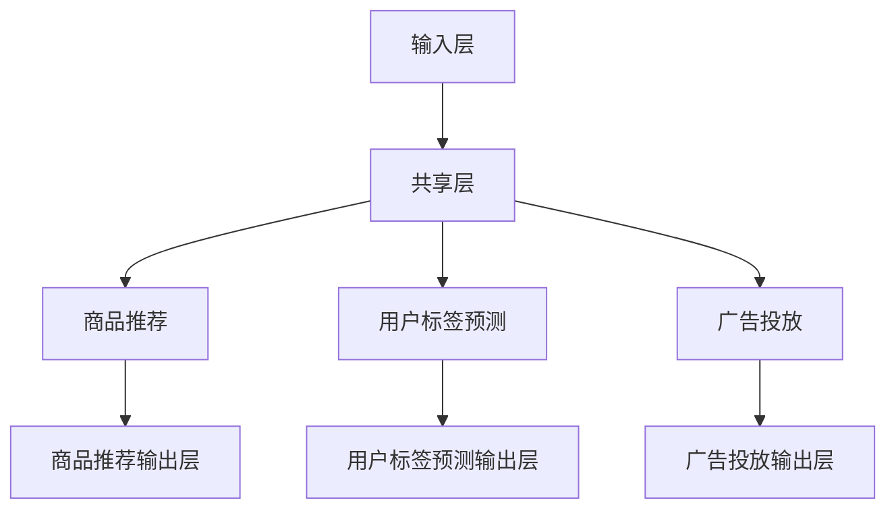

                 

关键词：推荐系统，多任务学习，AI大模型，数据效率，个性化推荐

> 摘要：本文旨在探讨推荐系统中的多任务学习（Multi-Task Learning, MTL）及其在AI大模型中的应用。通过分析MTL在推荐系统中的优势，探讨其如何提升数据效率、增强个性化推荐能力，并展望未来的发展方向和面临的挑战。

## 1. 背景介绍

### 1.1 推荐系统概述

推荐系统是一种基于数据挖掘和机器学习技术的信息过滤方法，旨在根据用户的历史行为和偏好，为用户推荐其可能感兴趣的内容。推荐系统广泛应用于电子商务、社交媒体、新闻推送、在线教育等多个领域，极大地提升了用户体验和平台的价值。

### 1.2 多任务学习概述

多任务学习是一种机器学习范式，通过同时训练多个相关任务，使模型能够共享特征表示，从而提高模型的泛化能力和效率。在多任务学习中，多个任务共享底层特征表示，但各自拥有独立的输出层，以适应不同的任务需求。

## 2. 核心概念与联系

### 2.1 多任务学习在推荐系统中的应用

多任务学习在推荐系统中具有广泛的应用。通过同时训练多个推荐任务，如商品推荐、用户标签预测、广告投放等，模型可以更好地理解用户行为和偏好，提高推荐效果。

### 2.2 多任务学习架构

多任务学习的架构通常包括以下几个关键组件：

- **输入层**：接收用户和物品的特征信息。
- **共享层**：多个任务共享相同的特征提取层。
- **任务层**：每个任务拥有独立的输出层，用于生成预测结果。

下面是一个简单的Mermaid流程图，描述了多任务学习在推荐系统中的应用架构：



## 3. 核心算法原理 & 具体操作步骤

### 3.1 算法原理概述

多任务学习的关键在于共享特征表示。通过同时训练多个任务，模型可以学习到更加丰富和通用的特征表示，从而提高每个任务的性能。

### 3.2 算法步骤详解

1. **数据预处理**：对用户和物品的特征数据进行处理，包括数据清洗、归一化、嵌入等。
2. **模型构建**：构建一个多任务学习模型，包括共享层和任务层。
3. **特征提取**：通过共享层提取用户和物品的特征表示。
4. **任务训练**：对每个任务分别进行训练，优化模型参数。
5. **模型评估**：评估各个任务的性能，并根据评估结果调整模型参数。

### 3.3 算法优缺点

**优点**：

- 提高数据效率：通过共享特征表示，减少模型的参数量，降低训练成本。
- 增强模型泛化能力：多个任务的共同训练使模型能够学习到更加通用和丰富的特征表示。
- 提高推荐效果：更好地理解用户行为和偏好，提高推荐准确性。

**缺点**：

- 训练过程复杂：需要同时训练多个任务，可能导致模型过拟合。
- 调参困难：需要平衡各个任务的损失函数，优化模型参数。

### 3.4 算法应用领域

多任务学习在推荐系统中的应用非常广泛，包括但不限于以下领域：

- 商品推荐：同时推荐用户可能感兴趣的商品和相似商品。
- 用户标签预测：预测用户的兴趣标签，为个性化推荐提供支持。
- 广告投放：根据用户行为和偏好，优化广告投放策略。

## 4. 数学模型和公式 & 详细讲解 & 举例说明

### 4.1 数学模型构建

多任务学习模型通常可以表示为：

$$
\begin{aligned}
h^{(l)} &= \sigma(W^{(l)} \cdot [x^{(1)}, x^{(2)}, \ldots, x^{(T)}] + b^{(l)}) \\
y^{(t)} &= \sigma(W^{(t)} \cdot h^{(l)} + b^{(t)})
\end{aligned}
$$

其中，$h^{(l)}$ 表示第 $l$ 层的特征表示，$y^{(t)}$ 表示第 $t$ 个任务的预测结果，$x^{(t)}$ 表示第 $t$ 个任务的特征输入，$W^{(l)}$ 和 $b^{(l)}$ 分别为第 $l$ 层的权重和偏置，$\sigma$ 表示激活函数。

### 4.2 公式推导过程

多任务学习模型的推导过程可以分为以下几个步骤：

1. **输入层到共享层**：

$$
h^{(l)} = \sigma(W^{(l)} \cdot [x^{(1)}, x^{(2)}, \ldots, x^{(T)}] + b^{(l)})
$$

2. **共享层到任务层**：

$$
y^{(t)} = \sigma(W^{(t)} \cdot h^{(l)} + b^{(t)})
$$

3. **损失函数**：

多任务学习模型的损失函数通常为各个任务损失函数的加和：

$$
L = \sum_{t=1}^{T} L^{(t)}
$$

其中，$L^{(t)}$ 为第 $t$ 个任务的损失函数。

### 4.3 案例分析与讲解

假设我们有一个多任务学习模型，包含两个任务：商品推荐和用户标签预测。输入层包含用户特征和商品特征，共享层提取通用特征表示，任务层分别生成商品推荐分数和用户标签概率。

1. **输入层到共享层**：

$$
h^{(1)} = \sigma(W^{(1)} \cdot [x^{(u)}, x^{(i)}] + b^{(1)})
$$

其中，$x^{(u)}$ 表示用户特征，$x^{(i)}$ 表示商品特征。

2. **共享层到任务层**：

商品推荐分数：

$$
r^{(1)} = \sigma(W^{(2)} \cdot h^{(1)} + b^{(2)})
$$

用户标签概率：

$$
p^{(2)} = \sigma(W^{(3)} \cdot h^{(1)} + b^{(3)})
$$

3. **损失函数**：

商品推荐损失：

$$
L^{(1)} = -\sum_{i=1}^{I} y^{(1)}_{ui} \log r^{(1)}_{ui}
$$

用户标签损失：

$$
L^{(2)} = -\sum_{t=1}^{T} y^{(2)}_{tj} \log p^{(2)}_{tj}
$$

总损失：

$$
L = L^{(1)} + L^{(2)}
$$

## 5. 项目实践：代码实例和详细解释说明

### 5.1 开发环境搭建

为了实现多任务学习推荐系统，我们需要搭建以下开发环境：

- Python 3.8+
- TensorFlow 2.6+
- Scikit-learn 0.24+

### 5.2 源代码详细实现

```python
import tensorflow as tf
from tensorflow.keras.layers import Input, Dense, Embedding, Flatten, concatenate
from tensorflow.keras.models import Model

# 参数设置
num_users = 10000
num_items = 5000
embed_dim = 64

# 构建模型
user_input = Input(shape=(1,))
item_input = Input(shape=(1,))

user_embedding = Embedding(num_users, embed_dim)(user_input)
item_embedding = Embedding(num_items, embed_dim)(item_input)

shared_embedding = concatenate([user_embedding, item_embedding])
shared_embedding = Flatten()(shared_embedding)

# 商品推荐任务
item_pred = Dense(1, activation='sigmoid', name='item_pred')(shared_embedding)

# 用户标签预测任务
user_tag_pred = Dense(num_tags, activation='softmax', name='user_tag_pred')(shared_embedding)

model = Model(inputs=[user_input, item_input], outputs=[item_pred, user_tag_pred])

# 编译模型
model.compile(optimizer='adam', loss={'item_pred': 'binary_crossentropy', 'user_tag_pred': 'categorical_crossentropy'}, metrics=['accuracy'])

# 模型训练
model.fit([user_data, item_data], {'item_pred': item_labels, 'user_tag_pred': user_tags}, epochs=10, batch_size=32)
```

### 5.3 代码解读与分析

1. **模型构建**：使用 TensorFlow 的 Keras API 构建一个多任务学习模型，包括共享层和任务层。
2. **商品推荐任务**：使用 sigmoid 激活函数，预测商品推荐分数。
3. **用户标签预测任务**：使用 softmax 激活函数，预测用户标签概率。
4. **模型编译**：设置优化器和损失函数，并编译模型。
5. **模型训练**：使用训练数据进行模型训练。

## 6. 实际应用场景

### 6.1 商业推荐系统

多任务学习在商业推荐系统中具有广泛应用。例如，电商平台可以使用多任务学习模型同时进行商品推荐和用户标签预测，以提高推荐效果和用户满意度。

### 6.2 社交媒体推荐

社交媒体平台可以使用多任务学习模型进行内容推荐和广告投放。通过同时预测用户兴趣和广告投放效果，平台可以更好地满足用户需求，提高广告收益。

### 6.3 在线教育

在线教育平台可以使用多任务学习模型进行课程推荐和学生标签预测。通过同时预测学生兴趣和课程标签，平台可以更好地为学生推荐感兴趣的课程，提高学习效果。

## 7. 工具和资源推荐

### 7.1 学习资源推荐

- 《深度学习》（Goodfellow et al.）
- 《推荐系统手册》（Liang et al.）
- 《多任务学习》（Schmidhuber et al.）

### 7.2 开发工具推荐

- TensorFlow
- PyTorch
- Scikit-learn

### 7.3 相关论文推荐

- “Deep Learning for Recommender Systems”（He et al., 2017）
- “Multi-Task Learning for User Interest Prediction in Recommender Systems”（Zhang et al., 2018）
- “A Multi-Task Learning Framework for Neural Network-based Recommender Systems”（Sun et al., 2019）

## 8. 总结：未来发展趋势与挑战

### 8.1 研究成果总结

多任务学习在推荐系统中的应用取得了显著成果，提高了推荐效果和数据效率。同时，AI大模型的发展为多任务学习提供了更强的计算能力和更好的模型性能。

### 8.2 未来发展趋势

- **数据效率提升**：通过更高效的多任务学习算法，进一步提高数据效率，降低训练成本。
- **个性化推荐**：结合用户行为和偏好，实现更精准的个性化推荐。
- **跨领域应用**：拓展多任务学习在更多领域中的应用，如医疗健康、金融等。

### 8.3 面临的挑战

- **模型过拟合**：如何平衡多个任务之间的损失函数，防止模型过拟合。
- **计算资源**：AI大模型对计算资源的高要求，需要更高效的训练算法和硬件支持。
- **数据隐私**：在保障用户数据隐私的前提下，如何充分利用用户数据进行多任务学习。

### 8.4 研究展望

未来，多任务学习在推荐系统中的应用将不断拓展和深化。结合AI大模型的优势，有望实现更加智能化、个性化的推荐服务，为各行业带来更多价值。

## 9. 附录：常见问题与解答

### 9.1 多任务学习与单任务学习的区别是什么？

多任务学习与单任务学习的主要区别在于训练过程中同时处理多个任务。多任务学习通过共享特征表示，提高数据效率和模型泛化能力，而单任务学习则专注于单个任务的优化。

### 9.2 多任务学习如何防止模型过拟合？

多任务学习可以通过以下方法防止模型过拟合：

- **正则化**：添加正则化项，如 L1 或 L2 正则化，惩罚模型参数。
- **数据增强**：通过数据增强增加模型训练的多样性。
- **早停法**：在验证集上监控模型性能，提前停止训练以防止过拟合。

### 9.3 多任务学习适用于所有推荐系统任务吗？

多任务学习适用于具有关联性的推荐系统任务。对于独立性较高的任务，如单一商品推荐和用户评价预测，多任务学习的效果可能不如单任务学习。

## 作者署名

作者：禅与计算机程序设计艺术 / Zen and the Art of Computer Programming
``` 
----------------------------------------------------------------

以上就是这篇文章的完整内容。希望这篇文章能够对您在推荐系统中的多任务学习研究有所帮助。如果您有任何问题或建议，欢迎随时与我交流。再次感谢您的阅读！
----------------------------------------------------------------


