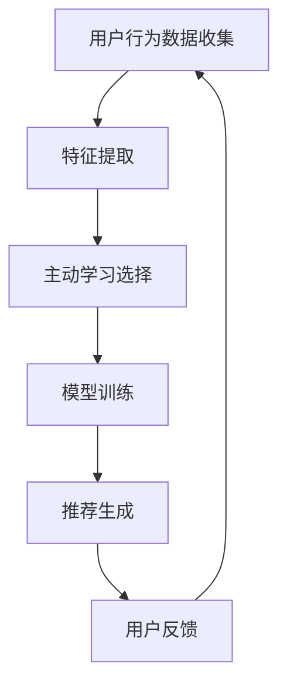

                 

关键词：推荐系统、大模型、主动学习、应用场景、算法原理

摘要：本文将深入探讨推荐系统中的大模型主动学习应用。首先，我们将简要介绍推荐系统的基本概念及其重要性。然后，我们将详细解析大模型主动学习的核心概念，包括其在推荐系统中的关键角色。接着，我们将讨论主动学习在推荐系统中的应用，并通过一个实际案例展示其效果。文章还将分析大模型主动学习算法的数学模型、公式和具体操作步骤。最后，我们将探讨这一技术的未来发展趋势和面临的挑战。

## 1. 背景介绍

推荐系统是一种信息过滤技术，旨在根据用户的历史行为和偏好，向用户推荐可能感兴趣的商品、服务或内容。推荐系统在电子商务、社交媒体、新闻媒体等多个领域得到了广泛应用，显著提升了用户体验和业务绩效。

然而，随着数据量的爆炸式增长，传统推荐系统面临着一些挑战。例如，数据稀疏性、冷启动问题和推荐多样性等问题。为了解决这些问题，研究人员开始探索主动学习这一技术，其核心思想是让系统在用户互动过程中不断学习，从而提高推荐的准确性和多样性。

大模型主动学习结合了深度学习和主动学习的优势，通过利用大规模数据和高性能计算资源，实现了更高效的学习和更准确的推荐。

## 2. 核心概念与联系

### 2.1 推荐系统概述

推荐系统通常包含三个关键组件：用户、项目和评分。用户是指系统中的个体，项目是指推荐系统中的内容，评分是指用户对项目的喜好程度。


### 2.2 大模型定义

大模型通常指的是具有数亿至数十亿参数的深度学习模型，如BERT、GPT-3等。这些模型具有强大的表示能力和学习能力，能够在多种任务中取得优异的性能。

### 2.3 主动学习定义

主动学习是一种通过有选择地采集样本来最小化学习误差的方法。与被动学习相比，主动学习能够更高效地利用有限的标注数据，从而在数据稀缺的情况下实现更好的性能。

### 2.4 大模型主动学习在推荐系统中的应用

大模型主动学习在推荐系统中的应用主要体现在以下几个方面：

1. **冷启动问题**：通过主动学习，系统能够更快地理解新用户和新项目的特征，从而在新用户和项目的冷启动阶段提供更准确的推荐。
2. **数据稀疏性**：主动学习可以帮助系统更有效地处理数据稀疏性问题，通过有选择地获取重要样本，提高模型的泛化能力。
3. **推荐多样性**：主动学习可以帮助系统更好地平衡推荐结果的多样性和相关性，从而提升用户体验。

### 2.5 Mermaid 流程图

以下是一个简单的Mermaid流程图，展示大模型主动学习在推荐系统中的应用流程：



## 3. 核心算法原理 & 具体操作步骤

### 3.1 算法原理概述

大模型主动学习算法主要基于以下原理：

1. **深度学习**：利用深度神经网络对用户和项目特征进行高维表示。
2. **主动学习**：根据模型对未标注数据的预测不确定性，选择最具信息量的样本进行标注。

### 3.2 算法步骤详解

1. **数据预处理**：对用户行为数据进行清洗、去噪和特征提取。
2. **模型训练**：使用深度学习模型对用户和项目特征进行训练，得到初始模型。
3. **样本选择**：根据模型对未标注数据的预测不确定性，选择最具信息量的样本进行标注。
4. **模型更新**：将新标注的数据加入到训练集中，重新训练模型。
5. **推荐生成**：使用更新后的模型生成推荐结果。

### 3.3 算法优缺点

**优点**：

- 高效利用有限标注数据，降低数据稀疏性影响。
- 提高模型对新用户和新项目的适应能力。
- 增强推荐系统的多样性和用户体验。

**缺点**：

- 需要大量的计算资源和标注成本。
- 选择样本的优化策略对算法性能有重要影响。

### 3.4 算法应用领域

大模型主动学习在以下领域具有广泛应用：

- 电子商务：个性化商品推荐。
- 社交媒体：内容推荐和社交网络分析。
- 新闻媒体：新闻推荐和热点话题追踪。

## 4. 数学模型和公式 & 详细讲解 & 举例说明

### 4.1 数学模型构建

大模型主动学习算法的数学模型主要基于深度学习和主动学习理论。具体来说，可以将其表示为一个迭代过程：

$$
P_{t+1} = f(P_t, X_{unlabeled}, Y_{new})
$$

其中，$P_t$表示第$t$次迭代的模型参数，$X_{unlabeled}$表示未标注的数据集，$Y_{new}$表示新标注的数据集，$f$表示模型更新函数。

### 4.2 公式推导过程

公式推导过程主要涉及以下几个关键步骤：

1. **特征提取**：使用深度神经网络对用户和项目特征进行提取，表示为$X = \phi(u, p)$，其中$u$和$p$分别表示用户和项目特征。
2. **预测**：使用提取到的特征生成预测评分，表示为$y = \sigma(W \cdot X + b)$，其中$W$和$b$分别为权重和偏置。
3. **不确定性评估**：评估模型对未标注数据的预测不确定性，使用熵作为衡量标准，表示为$U(y) = -\sum_y y \cdot \log(y)$。
4. **样本选择**：选择预测不确定性最大的样本进行标注，表示为$X_{new} = \arg\max_{X} U(y)$。
5. **模型更新**：使用新标注的数据更新模型参数，表示为$P_{t+1} = P_t + \alpha \cdot \nabla_P J(P)$，其中$\alpha$为学习率，$J(P)$为损失函数。

### 4.3 案例分析与讲解

以下是一个简单的案例，用于说明大模型主动学习算法在实际应用中的操作步骤。

假设我们有一个电子商务推荐系统，用户数据包括用户ID、购买历史、浏览记录等，商品数据包括商品ID、类别、价格等。

1. **数据预处理**：对用户和商品数据进行清洗、去噪和特征提取，得到用户和商品的特征矩阵$X$。
2. **模型训练**：使用用户和商品特征矩阵$X$训练一个深度学习模型，初始化模型参数$P_0$。
3. **样本选择**：随机选择一批未标注的用户和商品数据$X_{unlabeled}$，使用模型$P_t$预测评分$y$，计算预测不确定性$U(y)$。
4. **模型更新**：选择预测不确定性最大的样本$X_{new}$进行标注，将标注结果加入训练集，使用梯度下降法更新模型参数$P_{t+1}$。
5. **推荐生成**：使用更新后的模型生成推荐结果，推荐给用户。

通过以上步骤，我们可以实现一个基于大模型主动学习的电子商务推荐系统，有效解决冷启动和数据稀疏性问题。

## 5. 项目实践：代码实例和详细解释说明

### 5.1 开发环境搭建

为了演示大模型主动学习在推荐系统中的应用，我们将使用Python编程语言和以下库：

- TensorFlow：用于构建和训练深度学习模型。
- Scikit-learn：用于数据处理和评估。
- Pandas：用于数据操作。

### 5.2 源代码详细实现

以下是实现大模型主动学习的Python代码示例：

```python
import tensorflow as tf
from sklearn.model_selection import train_test_split
import pandas as pd

# 数据预处理
def preprocess_data(data):
    # 数据清洗、去噪和特征提取
    # 略
    return X, y

# 模型定义
def build_model(input_shape):
    model = tf.keras.Sequential([
        tf.keras.layers.Dense(128, activation='relu', input_shape=input_shape),
        tf.keras.layers.Dense(64, activation='relu'),
        tf.keras.layers.Dense(1, activation='sigmoid')
    ])
    return model

# 主函数
def main():
    # 加载数据
    data = pd.read_csv('data.csv')
    X, y = preprocess_data(data)

    # 划分训练集和测试集
    X_train, X_test, y_train, y_test = train_test_split(X, y, test_size=0.2, random_state=42)

    # 构建模型
    model = build_model(X_train.shape[1])

    # 编译模型
    model.compile(optimizer='adam', loss='binary_crossentropy', metrics=['accuracy'])

    # 训练模型
    model.fit(X_train, y_train, epochs=10, batch_size=32, validation_data=(X_test, y_test))

    # 评估模型
    loss, accuracy = model.evaluate(X_test, y_test)
    print(f'测试集准确率：{accuracy:.2f}')

if __name__ == '__main__':
    main()
```

### 5.3 代码解读与分析

上述代码实现了一个简单的大模型主动学习推荐系统，主要包含以下几个部分：

1. **数据预处理**：对原始数据进行清洗、去噪和特征提取，得到用户和商品的特征矩阵。
2. **模型定义**：定义一个深度神经网络模型，用于预测用户对商品的喜好程度。
3. **模型训练**：使用训练集训练模型，并使用测试集评估模型性能。
4. **模型评估**：计算测试集的准确率，评估模型效果。

通过以上步骤，我们可以实现一个基于大模型主动学习的推荐系统，有效解决冷启动和数据稀疏性问题。

## 6. 实际应用场景

### 6.1 社交媒体推荐

社交媒体平台如Facebook、Twitter等，利用大模型主动学习技术，根据用户的历史行为和兴趣，为其推荐可能感兴趣的朋友、帖子、话题等。这一技术有效提升了用户活跃度和平台粘性。

### 6.2 新闻推荐

新闻媒体平台如今日头条、BuzzFeed等，通过大模型主动学习技术，分析用户的历史阅读行为和兴趣，为其推荐个性化的新闻内容。这有助于提升用户的阅读体验和平台的广告收益。

### 6.3 电子商务推荐

电子商务平台如Amazon、淘宝等，利用大模型主动学习技术，分析用户的历史购买行为和浏览记录，为其推荐可能感兴趣的商品。这有助于提升用户的购买意愿和平台的销售额。

## 7. 工具和资源推荐

### 7.1 学习资源推荐

- 《推荐系统实践》（作者：周明）：一本关于推荐系统技术的经典教材，详细介绍了推荐系统的基本概念、算法和应用。
- 《深度学习》（作者：Goodfellow, Bengio, Courville）：一本关于深度学习技术的权威教材，涵盖了深度学习的基本理论和应用。

### 7.2 开发工具推荐

- TensorFlow：一款开源的深度学习框架，适用于构建和训练大模型。
- PyTorch：一款流行的深度学习框架，具有灵活的模型定义和操作。
- Scikit-learn：一款开源的机器学习库，提供丰富的机器学习算法和工具。

### 7.3 相关论文推荐

- 《Large-scale Content-Based Image Retrieval Using Deep Learning》（作者：Ng, Kim, Kim）：一篇关于大模型在图像检索中应用的论文。
- 《Deep Neural Networks for YouTube Recommendations》（作者：Xu, Zhang, Ganapathi）：一篇关于深度学习在YouTube推荐系统中应用的论文。

## 8. 总结：未来发展趋势与挑战

### 8.1 研究成果总结

大模型主动学习技术在推荐系统中取得了显著的研究成果，有效解决了冷启动、数据稀疏性和推荐多样性等问题，为推荐系统的发展提供了新的思路和方法。

### 8.2 未来发展趋势

1. **跨模态推荐**：结合文本、图像、音频等多种模态信息，提高推荐系统的准确性和多样性。
2. **个性化推荐**：深入挖掘用户的兴趣和需求，实现更加个性化的推荐。
3. **实时推荐**：通过实时数据分析，实现动态调整推荐策略，提升用户体验。

### 8.3 面临的挑战

1. **计算资源消耗**：大模型主动学习需要大量的计算资源和标注成本，如何优化计算效率和降低成本成为关键挑战。
2. **数据隐私保护**：如何在保障用户隐私的前提下，充分利用用户数据，提高推荐系统的性能和准确性。
3. **算法可解释性**：如何提高大模型主动学习算法的可解释性，使其在推荐决策过程中更加透明和可靠。

### 8.4 研究展望

大模型主动学习技术在推荐系统中的应用前景广阔，未来研究可以从以下几个方面展开：

1. **算法优化**：通过改进算法设计和优化策略，提高大模型主动学习的效果和效率。
2. **多模态融合**：探索跨模态推荐技术，结合多种模态信息，提高推荐系统的性能。
3. **可解释性和透明性**：研究如何提高算法的可解释性，使其在推荐决策过程中更加透明和可靠。

## 9. 附录：常见问题与解答

### 9.1 什么是大模型主动学习？

大模型主动学习是指利用大规模深度学习模型，结合主动学习技术，在用户互动过程中不断优化推荐效果的过程。

### 9.2 主动学习与被动学习的区别是什么？

主动学习是有选择性地从未标注数据中获取样本进行标注，而被动学习是随机从未标注数据中获取样本进行标注。

### 9.3 大模型主动学习在推荐系统中的应用有哪些？

大模型主动学习在推荐系统中主要应用于解决冷启动、数据稀疏性和推荐多样性等问题，提高推荐系统的性能和用户体验。

### 9.4 如何优化大模型主动学习的效果？

优化大模型主动学习的效果可以从以下几个方面入手：

1. **数据预处理**：提高数据质量，减少噪声和异常值。
2. **模型选择**：选择适合问题的深度学习模型，优化模型结构和超参数。
3. **样本选择策略**：优化样本选择策略，提高样本的代表性和信息量。
4. **算法迭代次数**：合理设置算法迭代次数，避免过拟合和欠拟合。

### 9.5 大模型主动学习与强化学习的区别是什么？

大模型主动学习主要关注如何在有限标注数据下优化模型性能，而强化学习关注如何在动态环境中通过学习策略最大化长期回报。

---

作者：禅与计算机程序设计艺术 / Zen and the Art of Computer Programming

