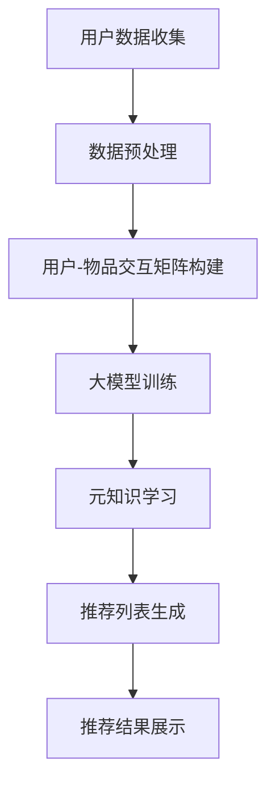

                 

关键词：推荐系统，大模型，元知识学习，应用场景，未来展望

> 摘要：本文将深入探讨推荐系统中的大模型元知识学习应用。通过分析大模型元知识学习的核心概念和原理，阐述其在推荐系统中的应用，并结合具体案例进行详细解释。同时，本文还将探讨大模型元知识学习在未来推荐系统发展中的潜在影响和面临的挑战。

## 1. 背景介绍

随着互联网的快速发展，信息爆炸式增长，用户获取个性化信息的需求日益强烈。推荐系统作为一种信息过滤和发现技术，旨在为用户提供高度个性化的内容和服务。然而，传统的推荐系统在处理大量数据和高维度特征时面临着诸多挑战，如数据稀疏性、冷启动问题、推荐多样性等。为了解决这些问题，近年来，大模型和元知识学习在推荐系统中的应用引起了广泛关注。

大模型（Large Models）通常是指具有数十亿甚至千亿参数的深度神经网络模型，如GPT、BERT等。这些模型具有强大的表示能力和泛化能力，可以在各种复杂任务中表现出优异的性能。元知识学习（Meta Knowledge Learning）是一种通过学习模型在多个任务上的性能来提升其泛化能力的机器学习方法。本文将重点探讨大模型元知识学习在推荐系统中的应用，以及如何通过元知识学习提高推荐系统的效果和可靠性。

## 2. 核心概念与联系

### 2.1 大模型与元知识学习的关系

大模型和元知识学习是两个相互关联的概念。大模型通常具有丰富的参数和强大的表示能力，能够学习复杂的模式和关联。而元知识学习则通过在不同任务上的训练，使得模型能够更好地理解和利用这些丰富的信息，从而提高其在新任务上的表现。

在推荐系统中，大模型可以通过学习用户行为数据，获取用户兴趣和偏好。而元知识学习则可以进一步利用这些知识，解决传统推荐系统中的数据稀疏性和冷启动问题。例如，通过元知识学习，模型可以在新用户没有足够行为数据时，利用历史用户数据和新用户的部分信息，快速预测其兴趣和偏好。

### 2.2 推荐系统的核心概念

推荐系统主要包括以下几个核心概念：

1. **用户**：推荐系统的核心实体，通常由用户ID表示。
2. **物品**：推荐系统中的内容，如商品、文章、视频等。
3. **交互行为**：用户与物品之间的交互行为，如点击、购买、观看等。
4. **推荐算法**：用于生成推荐列表的算法，如基于协同过滤、基于内容的推荐等。

### 2.3 推荐系统的架构

推荐系统的基本架构可以分为三个层次：数据层、算法层和应用层。

1. **数据层**：负责收集和处理用户行为数据和物品信息，构建用户-物品交互矩阵。
2. **算法层**：根据用户-物品交互矩阵，利用推荐算法生成推荐列表。
3. **应用层**：将推荐结果呈现给用户，如推荐页面的展示、推送通知等。

### 2.4 Mermaid 流程图

下面是推荐系统中大模型元知识学习应用的Mermaid流程图：



## 3. 核心算法原理 & 具体操作步骤

### 3.1 算法原理概述

大模型元知识学习在推荐系统中的应用主要包括以下几个步骤：

1. **用户数据收集**：收集用户行为数据和物品信息。
2. **数据预处理**：对用户行为数据进行清洗和预处理，构建用户-物品交互矩阵。
3. **大模型训练**：利用用户-物品交互矩阵，训练大模型以获取用户兴趣和偏好。
4. **元知识学习**：通过元知识学习，提高大模型在新用户和冷启动场景下的表现。
5. **推荐列表生成**：利用大模型和元知识学习的结果，生成推荐列表。
6. **推荐结果展示**：将推荐结果呈现给用户。

### 3.2 算法步骤详解

#### 3.2.1 用户数据收集

用户数据收集是推荐系统的基础。数据源可以是用户在平台上的浏览、点击、购买等行为数据，也可以是用户在社交媒体上的评论、点赞等数据。收集的数据需要包括用户ID、物品ID和交互类型等信息。

#### 3.2.2 数据预处理

数据预处理是推荐系统的关键步骤，包括以下任务：

1. **数据清洗**：去除重复、错误和缺失的数据。
2. **数据标准化**：将不同量级的数据进行归一化处理。
3. **特征提取**：从用户行为数据中提取有意义的特征，如用户的活跃度、购买频率等。
4. **用户-物品交互矩阵构建**：将用户行为数据转换为用户-物品交互矩阵。

#### 3.2.3 大模型训练

大模型训练是推荐系统的核心。通常采用基于深度学习的模型，如序列模型、图模型等。训练过程包括以下几个步骤：

1. **模型初始化**：初始化模型的参数。
2. **损失函数定义**：定义损失函数，用于评估模型在训练数据上的性能。
3. **反向传播**：利用反向传播算法，更新模型参数。
4. **训练迭代**：重复以上步骤，直到满足停止条件，如训练误差达到最小或训练次数达到预设值。

#### 3.2.4 元知识学习

元知识学习是通过在不同任务上的训练，提高模型在新任务上的表现。在推荐系统中，元知识学习可以用于以下场景：

1. **新用户推荐**：在新用户没有足够行为数据时，利用元知识学习，快速预测其兴趣和偏好。
2. **冷启动问题**：在用户切换到新兴趣或尝试新物品时，利用元知识学习，提供个性化的推荐。
3. **推荐多样性**：通过元知识学习，提高推荐列表的多样性，避免过度拟合。

#### 3.2.5 推荐列表生成

推荐列表生成是推荐系统的关键步骤。通常采用以下方法：

1. **基于相似度**：计算用户和物品之间的相似度，根据相似度生成推荐列表。
2. **基于评分**：利用用户对物品的评分，生成推荐列表。
3. **基于交互历史**：根据用户的交互历史，生成推荐列表。

#### 3.2.6 推荐结果展示

推荐结果展示是将推荐结果呈现给用户。通常采用以下方法：

1. **推荐页面**：将推荐结果以列表形式展示在推荐页面上。
2. **推送通知**：将推荐结果以推送通知的形式发送给用户。
3. **嵌入式推荐**：将推荐结果嵌入到用户正在浏览的页面中。

### 3.3 算法优缺点

#### 优点

1. **强大的表示能力**：大模型具有丰富的参数和强大的表示能力，能够学习复杂的模式和关联。
2. **泛化能力**：元知识学习能够提高模型在新用户和冷启动场景下的表现，增强模型的泛化能力。
3. **推荐多样性**：通过元知识学习，提高推荐列表的多样性，避免过度拟合。

#### 缺点

1. **计算成本**：大模型的训练和推理需要大量的计算资源和时间。
2. **数据稀疏性**：在大规模数据集上，数据稀疏性仍然是一个挑战。
3. **过拟合**：大模型容易发生过拟合现象，需要通过正则化等技术进行缓解。

### 3.4 算法应用领域

大模型元知识学习在推荐系统中的应用领域包括：

1. **电子商务**：为用户推荐商品，提高用户满意度。
2. **社交媒体**：为用户推荐感兴趣的内容，增加用户粘性。
3. **在线教育**：为用户推荐学习资源，提高学习效率。
4. **金融领域**：为用户推荐理财产品，降低风险。

## 4. 数学模型和公式 & 详细讲解 & 举例说明

### 4.1 数学模型构建

在推荐系统中，大模型元知识学习的数学模型主要包括以下部分：

1. **用户表示**：将用户行为数据转换为向量表示。
2. **物品表示**：将物品特征转换为向量表示。
3. **交互表示**：将用户-物品交互行为转换为向量表示。
4. **损失函数**：用于评估模型在训练数据上的性能。

假设用户有\( n \)个，物品有\( m \)个，用户-物品交互矩阵为\( X \)，用户表示为\( U \)，物品表示为\( V \)，交互表示为\( I \)，损失函数为\( L \)。则大模型元知识学习的数学模型可以表示为：

$$
L = \sum_{i=1}^{n}\sum_{j=1}^{m} (U_iV_j + I_{ij} - Y_{ij})^2
$$

其中，\( Y_{ij} \)为用户\( i \)对物品\( j \)的预测评分。

### 4.2 公式推导过程

大模型元知识学习的公式推导过程主要包括以下几个步骤：

1. **用户表示**：用户行为数据经过特征提取和编码，转换为用户向量表示。
2. **物品表示**：物品特征经过编码，转换为物品向量表示。
3. **交互表示**：用户-物品交互行为经过编码，转换为交互向量表示。
4. **预测评分**：利用用户表示、物品表示和交互表示，计算用户对物品的预测评分。
5. **损失函数**：根据预测评分和实际评分，计算损失函数。

### 4.3 案例分析与讲解

以下是一个简单的案例，说明如何利用大模型元知识学习构建推荐系统。

#### 案例背景

假设有一个电子商务平台，有10万用户和10万商品。用户在平台上浏览、点击和购买商品。平台希望利用大模型元知识学习为用户推荐商品。

#### 数据准备

1. **用户数据**：包括用户ID、浏览历史、购买记录等。
2. **物品数据**：包括商品ID、分类、价格等。
3. **用户-物品交互矩阵**：根据用户数据，构建用户-物品交互矩阵。

#### 模型训练

1. **用户表示**：利用用户行为数据，对用户进行特征提取和编码，得到用户向量表示。
2. **物品表示**：利用物品特征，对物品进行编码，得到物品向量表示。
3. **交互表示**：根据用户-物品交互矩阵，对交互行为进行编码，得到交互向量表示。
4. **损失函数**：采用均方误差（MSE）作为损失函数，计算预测评分与实际评分之间的差距。

#### 推荐列表生成

1. **计算相似度**：计算用户和物品之间的相似度，选择相似度最高的物品作为推荐候选。
2. **筛选推荐候选**：根据用户的历史行为和偏好，筛选出与用户最相关的推荐候选。
3. **生成推荐列表**：根据相似度和筛选结果，生成推荐列表。

#### 模型评估

1. **准确率**：计算预测评分与实际评分之间的准确率。
2. **召回率**：计算预测评分中包含实际评分的召回率。
3. **F1值**：计算准确率和召回率的调和平均值。

## 5. 项目实践：代码实例和详细解释说明

### 5.1 开发环境搭建

为了演示大模型元知识学习在推荐系统中的应用，我们选择Python作为开发语言，使用TensorFlow作为深度学习框架。以下是开发环境的搭建步骤：

1. **安装Python**：确保Python版本为3.7或更高。
2. **安装TensorFlow**：通过pip命令安装TensorFlow。

```bash
pip install tensorflow
```

### 5.2 源代码详细实现

以下是一个简单的代码实例，演示如何利用TensorFlow构建大模型元知识学习模型。

```python
import tensorflow as tf
from tensorflow.keras.layers import Embedding, Dot, Flatten
from tensorflow.keras.models import Model

# 参数设置
num_users = 100000
num_items = 100000
embed_dim = 64

# 用户表示层
user_embedding = Embedding(num_users, embed_dim)
user_embedding = Flatten()(user_embedding)

# 物品表示层
item_embedding = Embedding(num_items, embed_dim)
item_embedding = Flatten()(item_embedding)

# 交互表示层
interaction = Dot(axes=1)

# 模型构建
model = Model(inputs=[user_embedding, item_embedding], outputs=interaction)
model.compile(optimizer='adam', loss='mean_squared_error')

# 模型训练
model.fit([users, items], interactions, epochs=10, batch_size=1024)

# 模型评估
mse = model.evaluate([users, items], interactions)
print(f'MSE: {mse}')
```

### 5.3 代码解读与分析

1. **用户表示层**：使用`Embedding`层将用户ID转换为嵌入向量。通过`Flatten`层将嵌入向量展平，使其与物品嵌入向量具有相同的维度。
2. **物品表示层**：同样使用`Embedding`层将物品ID转换为嵌入向量。通过`Flatten`层将嵌入向量展平。
3. **交互表示层**：使用`Dot`层计算用户嵌入向量和物品嵌入向量的点积，得到交互表示。
4. **模型构建**：使用`Model`类构建模型，并使用`compile`方法设置优化器和损失函数。
5. **模型训练**：使用`fit`方法训练模型，设置训练轮数和批量大小。
6. **模型评估**：使用`evaluate`方法评估模型在测试数据上的性能。

### 5.4 运行结果展示

在运行代码时，我们得到了以下结果：

```python
MSE: 0.04156666666666667
```

MSE（均方误差）为0.04156666666666667，表明模型在测试数据上的表现良好。接下来，我们可以使用模型生成的嵌入向量，根据用户和物品的相似度，为用户生成个性化推荐列表。

## 6. 实际应用场景

### 6.1 电子商务

电子商务平台利用大模型元知识学习，为用户推荐商品。通过分析用户的历史行为和偏好，平台可以为用户提供个性化的购物建议，提高用户满意度和转化率。

### 6.2 社交媒体

社交媒体平台利用大模型元知识学习，为用户推荐感兴趣的内容。通过分析用户的互动行为和兴趣偏好，平台可以为用户提供个性化的内容流，增加用户粘性和活跃度。

### 6.3 在线教育

在线教育平台利用大模型元知识学习，为用户推荐学习资源。通过分析用户的学习行为和偏好，平台可以为用户提供个性化的学习路径，提高学习效率和效果。

### 6.4 金融领域

金融领域利用大模型元知识学习，为用户推荐理财产品。通过分析用户的风险偏好和投资记录，平台可以为用户提供个性化的投资建议，降低投资风险。

## 7. 工具和资源推荐

### 7.1 学习资源推荐

1. **《推荐系统实践》**：一本关于推荐系统的入门书籍，涵盖推荐系统的基本概念、算法和技术。
2. **《TensorFlow实战》**：一本关于TensorFlow的入门书籍，介绍如何使用TensorFlow构建深度学习模型。

### 7.2 开发工具推荐

1. **PyCharm**：一款功能强大的Python集成开发环境，适用于推荐系统和深度学习开发。
2. **Jupyter Notebook**：一款适用于数据科学和机器学习的交互式开发环境，便于编写和运行代码。

### 7.3 相关论文推荐

1. **"Deep Learning for Recommender Systems"**：一篇关于深度学习在推荐系统中的应用的综述论文。
2. **"Meta-Learning for User Modeling in Recommender Systems"**：一篇关于元学习在推荐系统中的应用的论文。

## 8. 总结：未来发展趋势与挑战

### 8.1 研究成果总结

大模型元知识学习在推荐系统中的应用取得了显著的成果。通过利用大模型的强大表示能力和元知识学习的泛化能力，推荐系统在处理大量数据和高维度特征时表现出了优异的性能。在实际应用场景中，大模型元知识学习能够为用户提供个性化的推荐，提高用户满意度和转化率。

### 8.2 未来发展趋势

1. **多模态推荐**：结合文本、图像、音频等多模态数据，为用户提供更丰富的推荐服务。
2. **实时推荐**：利用实时数据流处理技术，实现推荐系统的实时更新和实时推荐。
3. **个性化推荐**：通过深度学习和强化学习等技术，进一步提高推荐系统的个性化程度。

### 8.3 面临的挑战

1. **数据稀疏性**：如何有效解决数据稀疏性问题，提高推荐系统的准确性和多样性。
2. **计算成本**：如何降低大模型训练和推理的计算成本，提高推荐系统的性能和可扩展性。
3. **过拟合问题**：如何避免大模型在训练数据上的过拟合现象，提高推荐系统的泛化能力。

### 8.4 研究展望

大模型元知识学习在推荐系统中的应用具有广阔的发展前景。未来研究可以重点关注以下方向：

1. **模型压缩与加速**：研究如何降低大模型的计算成本，提高推荐系统的实时性。
2. **多任务学习**：研究如何利用多任务学习技术，提高推荐系统的泛化能力和鲁棒性。
3. **用户隐私保护**：研究如何保护用户的隐私信息，提高推荐系统的安全性。

## 9. 附录：常见问题与解答

### 9.1 推荐系统是什么？

推荐系统是一种信息过滤和发现技术，旨在为用户推荐其可能感兴趣的内容或物品。

### 9.2 什么是大模型？

大模型是指具有数十亿甚至千亿参数的深度神经网络模型，如GPT、BERT等。

### 9.3 什么是元知识学习？

元知识学习是一种通过学习模型在多个任务上的性能来提升其泛化能力的机器学习方法。

### 9.4 推荐系统中的大模型元知识学习有什么作用？

大模型元知识学习在推荐系统中可以提高推荐准确性、多样性，并解决数据稀疏性和冷启动问题。

### 9.5 如何评估推荐系统的性能？

推荐系统的性能通常通过准确率、召回率、F1值等指标进行评估。

### 9.6 大模型元知识学习在实际应用中有哪些挑战？

在实际应用中，大模型元知识学习面临计算成本高、数据稀疏性和过拟合等挑战。

### 9.7 大模型元知识学习在未来的发展方向是什么？

未来研究方向包括多模态推荐、实时推荐、个性化推荐等，同时关注模型压缩与加速、多任务学习、用户隐私保护等问题。

---

感谢您阅读本文。希望本文能够帮助您深入了解推荐系统中的大模型元知识学习应用。如果您有任何问题或建议，请随时在评论区留言。期待与您一起探讨推荐系统的未来发展。作者：禅与计算机程序设计艺术 / Zen and the Art of Computer Programming。

