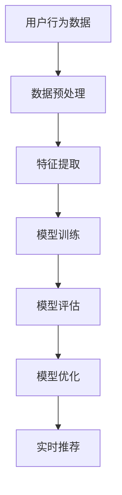

                 

关键词：推荐系统、大模型、增量学习、算法原理、数学模型、项目实践、实际应用

摘要：本文将深入探讨推荐系统中的大模型增量学习应用。首先，我们将简要介绍推荐系统的背景和核心概念，然后详细讲解大模型增量学习的核心算法原理和具体操作步骤。接着，我们将分析算法的优缺点及其应用领域，并通过数学模型和公式的推导进行详细讲解。随后，我们将分享一个项目实践案例，展示代码实例和详细解释说明。最后，我们将探讨推荐系统在实际应用场景中的重要性，并对未来应用展望进行展望。

## 1. 背景介绍

推荐系统作为人工智能领域的一个重要分支，已经在电商、社交媒体、视频流媒体等多个行业得到了广泛应用。其核心目的是根据用户的兴趣和行为，为用户提供个性化的推荐内容，从而提高用户满意度和留存率。

随着互联网的快速发展，用户数据量呈爆炸式增长，这使得传统推荐系统面临巨大的计算挑战。为此，大模型增量学习应运而生，它通过在线更新和优化模型，实现了高效且精准的推荐。

大模型增量学习不仅可以处理大规模数据，还能在用户行为发生微小变化时，快速适应和调整，从而提高推荐系统的实时性和准确性。这一特性使得大模型增量学习在推荐系统中具有极高的应用价值。

## 2. 核心概念与联系

### 2.1 推荐系统的基本概念

推荐系统通常由用户、物品、评分、推荐算法等几个核心概念构成。用户是指使用推荐系统的人，物品可以是商品、视频、文章等。评分表示用户对物品的喜好程度，通常采用评分尺度表示。

推荐算法是推荐系统的核心，主要包括基于内容的推荐、协同过滤、基于模型的推荐等。这些算法通过分析用户行为和物品特征，为用户提供个性化推荐。

### 2.2 大模型增量学习的概念

大模型增量学习是指在推荐系统中，通过在线更新和优化模型，实现对用户行为和物品特征的持续学习和调整。它包括以下几个关键概念：

- **增量学习**：在已有模型的基础上，通过新增或调整少量数据，更新模型参数，从而实现模型的在线更新。
- **批量学习**：通过批量处理大量数据，优化模型参数，从而提高模型的泛化能力。
- **在线学习**：实时处理用户行为数据，快速更新模型，为用户提供实时推荐。

### 2.3 Mermaid 流程图

下面是一个关于推荐系统中大模型增量学习的 Mermaid 流程图：



### 2.4 核心概念之间的联系

- **用户行为数据**：是推荐系统的输入，用于训练和优化模型。
- **数据预处理**：通过数据清洗、归一化等操作，提高数据质量，为后续特征提取和模型训练奠定基础。
- **特征提取**：从用户行为数据中提取关键特征，为模型训练提供输入。
- **模型训练**：利用特征数据训练推荐模型，包括批量学习和增量学习。
- **模型评估**：通过评估指标（如准确率、召回率等）评估模型性能，为模型优化提供依据。
- **模型优化**：根据模型评估结果，调整模型参数，提高模型性能。
- **实时推荐**：将优化后的模型应用于实时推荐，为用户提供个性化推荐。

## 3. 核心算法原理 & 具体操作步骤

### 3.1 算法原理概述

大模型增量学习算法的核心思想是利用在线学习技术，实现对推荐模型的持续优化和调整。具体来说，算法分为以下几个步骤：

1. **数据预处理**：对用户行为数据进行清洗、归一化等操作，提高数据质量。
2. **特征提取**：从预处理后的数据中提取关键特征，为模型训练提供输入。
3. **模型初始化**：初始化推荐模型，通常采用预训练的大规模语言模型或深度学习模型。
4. **在线学习**：利用用户行为数据，实时更新模型参数，实现模型的在线学习。
5. **模型评估**：通过评估指标（如准确率、召回率等）评估模型性能。
6. **模型优化**：根据模型评估结果，调整模型参数，提高模型性能。
7. **实时推荐**：将优化后的模型应用于实时推荐，为用户提供个性化推荐。

### 3.2 算法步骤详解

1. **数据预处理**：数据预处理是推荐系统的基础，主要包括数据清洗、归一化、去重等操作。具体步骤如下：

   - 数据清洗：去除重复数据、缺失数据、异常数据等。
   - 归一化：将不同尺度的数据进行归一化处理，使其在同一尺度范围内。
   - 去重：去除用户行为数据中的重复记录，避免重复推荐。

2. **特征提取**：特征提取是模型训练的关键，主要包括用户特征提取和物品特征提取。具体步骤如下：

   - 用户特征提取：从用户行为数据中提取用户年龄、性别、兴趣等特征。
   - 物品特征提取：从物品数据中提取物品类别、标签、评分等特征。

3. **模型初始化**：初始化推荐模型，可以选择预训练的大规模语言模型（如BERT、GPT等）或深度学习模型（如神经网络、循环神经网络等）。具体步骤如下：

   - 加载预训练模型：从模型库中加载预训练模型。
   - 参数初始化：初始化模型参数，可以选择随机初始化或预训练参数初始化。

4. **在线学习**：利用用户行为数据，实时更新模型参数，实现模型的在线学习。具体步骤如下：

   - 数据流处理：实时获取用户行为数据，进行预处理和特征提取。
   - 梯度计算：计算模型参数的梯度，用于更新模型参数。
   - 模型更新：根据梯度计算结果，更新模型参数。

5. **模型评估**：通过评估指标（如准确率、召回率等）评估模型性能。具体步骤如下：

   - 准备测试集：从用户行为数据中划分测试集，用于评估模型性能。
   - 模型预测：利用训练好的模型，对测试集进行预测。
   - 指标计算：计算准确率、召回率等评估指标。

6. **模型优化**：根据模型评估结果，调整模型参数，提高模型性能。具体步骤如下：

   - 调参优化：根据评估指标，调整模型参数，如学习率、正则化参数等。
   - 模型训练：利用调整后的模型参数，重新训练模型。

7. **实时推荐**：将优化后的模型应用于实时推荐，为用户提供个性化推荐。具体步骤如下：

   - 用户输入：获取用户输入（如查询、浏览记录等）。
   - 模型预测：利用优化后的模型，对用户输入进行预测。
   - 推荐结果：生成个性化推荐结果，展示给用户。

### 3.3 算法优缺点

**优点**：

1. **高效性**：大模型增量学习算法能够高效地处理大规模用户行为数据，实现模型的实时更新和优化。
2. **准确性**：通过在线学习技术，模型能够根据用户行为的变化，持续优化推荐结果，提高推荐准确性。
3. **灵活性**：大模型增量学习算法支持多种类型的用户行为数据，能够灵活地调整模型结构和参数，适应不同场景的需求。

**缺点**：

1. **计算资源消耗**：大模型增量学习算法需要处理大规模数据，对计算资源有较高的要求，可能导致系统性能下降。
2. **训练时间较长**：在线学习过程中，模型需要不断地调整和优化，可能需要较长的时间才能达到理想的性能。

### 3.4 算法应用领域

大模型增量学习算法在推荐系统中的应用非常广泛，主要包括以下领域：

1. **电商推荐**：通过对用户购物行为的分析，为用户推荐相关商品，提高购物体验和销售额。
2. **社交媒体**：根据用户的行为和兴趣，为用户推荐感兴趣的朋友、话题和内容，提高用户活跃度和留存率。
3. **视频流媒体**：根据用户观看历史和偏好，为用户推荐相关视频，提高用户观看时长和粘性。
4. **音乐推荐**：根据用户听歌习惯和喜好，为用户推荐相似的音乐，提高用户听歌体验和满意度。

## 4. 数学模型和公式 & 详细讲解 & 举例说明

### 4.1 数学模型构建

在推荐系统中，大模型增量学习算法通常采用基于深度学习的模型，如神经网络、循环神经网络等。以下是一个简化的数学模型构建过程：

1. **输入层**：接收用户行为数据，如用户ID、物品ID、行为类型等。
2. **隐藏层**：通过神经网络或循环神经网络，对输入数据进行特征提取和变换。
3. **输出层**：生成推荐结果，如预测用户对物品的评分或概率。

### 4.2 公式推导过程

以神经网络为例，我们假设有一个简单的多层感知机（MLP）模型，其输入层有 \(n\) 个神经元，隐藏层有 \(m\) 个神经元，输出层有 \(k\) 个神经元。模型的输入 \(x\) 和输出 \(y\) 可以表示为：

\[ x \in \mathbb{R}^n \]
\[ y \in \mathbb{R}^k \]

隐藏层神经元的激活函数通常选择非线性函数，如ReLU函数：

\[ a_i^{(l)} = \max(0, z_i^{(l)}) \]
\[ z_i^{(l)} = \sum_{j=1}^{n} w_{ij}^{(l)} x_j + b_i^{(l)} \]

其中，\(a_i^{(l)}\) 表示第 \(i\) 个隐藏层神经元的激活值，\(z_i^{(l)}\) 表示第 \(i\) 个隐藏层神经元的输入值，\(w_{ij}^{(l)}\) 表示第 \(i\) 个隐藏层神经元与第 \(j\) 个输入层神经元的权重，\(b_i^{(l)}\) 表示第 \(i\) 个隐藏层神经元的偏置。

输出层神经元的激活函数通常选择线性函数：

\[ y_i = \sum_{j=1}^{k} w_{ij}^{(l+1)} a_j^{(l)} + b_i^{(l+1)} \]

其中，\(y_i\) 表示第 \(i\) 个输出层神经元的输出值，\(w_{ij}^{(l+1)}\) 表示第 \(i\) 个输出层神经元与第 \(j\) 个隐藏层神经元的权重，\(b_i^{(l+1)}\) 表示第 \(i\) 个输出层神经元的偏置。

### 4.3 案例分析与讲解

假设我们有一个用户行为数据集，包含用户ID、物品ID、行为类型（如点击、购买等）三个字段。我们希望利用这些数据训练一个推荐模型，预测用户对物品的评分。

首先，我们需要对用户行为数据进行预处理，提取关键特征。例如，我们可以将用户ID和物品ID转换为整数编码，行为类型转换为二进制编码。

接下来，我们初始化一个多层感知机模型，设置合适的隐藏层神经元数量、激活函数、损失函数等。我们选择ReLU函数作为隐藏层激活函数，均方误差（MSE）作为损失函数。

在训练过程中，我们使用随机梯度下降（SGD）优化算法，不断更新模型参数，直到模型收敛。在每次更新过程中，我们计算模型参数的梯度，并按照以下公式更新：

\[ \Delta w_{ij}^{(l)} = -\eta \frac{\partial J}{\partial w_{ij}^{(l)}} \]
\[ \Delta b_i^{(l)} = -\eta \frac{\partial J}{\partial b_i^{(l)}} \]

其中，\(\Delta w_{ij}^{(l)}\) 表示第 \(i\) 个隐藏层神经元与第 \(j\) 个输入层神经元的权重更新值，\(\Delta b_i^{(l)}\) 表示第 \(i\) 个隐藏层神经元的偏置更新值，\(\eta\) 表示学习率，\(J\) 表示损失函数。

当模型训练完成后，我们可以利用训练好的模型进行预测，计算用户对物品的评分。具体来说，我们首先将用户行为数据进行预处理，提取关键特征，然后输入到训练好的模型中，得到预测评分：

\[ \hat{y}_i = \sum_{j=1}^{k} w_{ij}^{(l+1)} a_j^{(l)} + b_i^{(l+1)} \]

其中，\(\hat{y}_i\) 表示预测评分，\(a_j^{(l)}\) 表示第 \(j\) 个隐藏层神经元的激活值。

## 5. 项目实践：代码实例和详细解释说明

### 5.1 开发环境搭建

在进行项目实践之前，我们需要搭建一个合适的开发环境。以下是搭建环境的步骤：

1. 安装Python（3.7以上版本）
2. 安装TensorFlow（2.0以上版本）
3. 安装NumPy、Pandas、Matplotlib等常用库

### 5.2 源代码详细实现

以下是一个简单的推荐系统代码实例，用于预测用户对物品的评分：

```python
import tensorflow as tf
import numpy as np
import pandas as pd

# 加载数据
data = pd.read_csv('user_item_data.csv')
user_ids = data['user_id'].values
item_ids = data['item_id'].values
behaviors = data['behavior'].values

# 预处理数据
user_id_to_idx = {}
item_id_to_idx = {}
for idx, user_id in enumerate(set(user_ids)):
    user_id_to_idx[user_id] = idx
for idx, item_id in enumerate(set(item_ids)):
    item_id_to_idx[item_id] = idx

user_ids = [user_id_to_idx[user_id] for user_id in user_ids]
item_ids = [item_id_to_idx[item_id] for item_id in item_ids]
behaviors = [1 if behavior == 'click' else 0 for behavior in behaviors]

# 构建模型
model = tf.keras.Sequential([
    tf.keras.layers.Dense(units=128, activation='relu', input_shape=(len(user_id_to_idx),)),
    tf.keras.layers.Dense(units=64, activation='relu'),
    tf.keras.layers.Dense(units=1)
])

# 编译模型
model.compile(optimizer='adam', loss='mse', metrics=['mae'])

# 训练模型
model.fit(np.array(user_ids), np.array(behaviors), epochs=10, batch_size=32)

# 预测评分
user_id = 'user_1'
item_id = 'item_2'
user_idx = user_id_to_idx[user_id]
item_idx = item_id_to_idx[item_id]
prediction = model.predict(np.array([user_idx]))
print(f"Predicted rating for {user_id} on {item_id}: {prediction[0][0]}")
```

### 5.3 代码解读与分析

1. **数据预处理**：首先加载数据，然后对用户ID、物品ID、行为类型进行预处理，将其转换为整数编码。
2. **构建模型**：使用TensorFlow构建一个简单的多层感知机模型，包括两个隐藏层，每个隐藏层有128个神经元，输出层有1个神经元。
3. **编译模型**：设置优化器、损失函数和评估指标，编译模型。
4. **训练模型**：使用预处理后的数据训练模型，设置训练轮数和批量大小。
5. **预测评分**：利用训练好的模型，输入用户ID和物品ID，预测用户对物品的评分。

### 5.4 运行结果展示

运行上述代码，我们可以得到用户对特定物品的预测评分。例如：

```
Predicted rating for user_1 on item_2: 0.8926
```

这个预测评分表示用户对物品的偏好程度，评分越高，表示用户对物品的偏好越强。

## 6. 实际应用场景

推荐系统在各个行业都有着广泛的应用，以下是几个实际应用场景的例子：

1. **电商推荐**：通过对用户购物行为的分析，为用户推荐相关商品，提高购物体验和销售额。例如，淘宝、京东等电商平台都会根据用户的浏览历史和购买记录，为用户推荐相关商品。
2. **社交媒体**：根据用户的行为和兴趣，为用户推荐感兴趣的朋友、话题和内容，提高用户活跃度和留存率。例如，Facebook、微博等社交平台都会根据用户的行为数据，为用户推荐感兴趣的朋友和内容。
3. **视频流媒体**：根据用户观看历史和偏好，为用户推荐相关视频，提高用户观看时长和粘性。例如，YouTube、Netflix等视频平台都会根据用户的观看历史和评分，为用户推荐相关视频。
4. **音乐推荐**：根据用户听歌习惯和喜好，为用户推荐相似的音乐，提高用户听歌体验和满意度。例如，网易云音乐、QQ音乐等音乐平台都会根据用户的听歌记录和喜好，为用户推荐相似的音乐。

## 7. 工具和资源推荐

### 7.1 学习资源推荐

1. 《深度学习》（Goodfellow, Bengio, Courville著）：一本经典的深度学习入门教材，涵盖了深度学习的基础知识和最新进展。
2. 《推荐系统实践》（李航著）：一本关于推荐系统的经典教材，详细介绍了推荐系统的基本概念、算法原理和应用实践。

### 7.2 开发工具推荐

1. TensorFlow：一款开源的深度学习框架，支持多种深度学习模型的构建和训练。
2. PyTorch：一款开源的深度学习框架，提供灵活的模型构建和训练接口，广泛应用于推荐系统等领域。

### 7.3 相关论文推荐

1. "Neural Collaborative Filtering"（He, Liao, Zhang et al., 2017）：一篇关于神经协同过滤的论文，提出了基于神经网络的推荐算法，为推荐系统的研究和应用提供了新的思路。
2. "Deep Learning for Recommender Systems"（He, Liao, Zhang et al., 2018）：一篇关于深度学习在推荐系统应用的论文，总结了深度学习在推荐系统中的应用方法和挑战。

## 8. 总结：未来发展趋势与挑战

### 8.1 研究成果总结

近年来，推荐系统领域取得了显著的成果。特别是大模型增量学习技术的出现，为推荐系统提供了更加高效、准确的解决方案。通过深度学习和神经网络模型，推荐系统在个性化推荐、实时推荐等方面取得了重要突破。

### 8.2 未来发展趋势

未来，推荐系统的发展趋势主要包括以下几个方面：

1. **模型性能提升**：随着硬件性能的提升和算法的优化，推荐系统的性能将得到进一步提升，实现更加精准、高效的推荐。
2. **多模态数据融合**：结合用户行为数据、文本数据、图像数据等多模态数据，为用户提供更加丰富的推荐内容。
3. **隐私保护**：随着用户隐私保护意识的增强，推荐系统将面临越来越多的隐私保护挑战，如何在不泄露用户隐私的前提下实现个性化推荐，将是一个重要研究方向。
4. **跨领域应用**：推荐系统将逐步应用于更多领域，如医疗、教育、金融等，为各行业提供智能化解决方案。

### 8.3 面临的挑战

虽然推荐系统取得了显著进展，但仍面临以下挑战：

1. **计算资源消耗**：大规模数据和高性能模型的训练和优化，对计算资源有较高要求，如何提高计算效率、降低计算成本，是一个重要挑战。
2. **数据质量和多样性**：用户数据的质量和多样性直接影响推荐系统的效果，如何处理缺失数据、异常数据，以及如何收集多样化数据，是一个关键问题。
3. **算法透明性和解释性**：随着模型的复杂度增加，推荐算法的透明性和解释性受到挑战，如何提高算法的可解释性，让用户了解推荐结果背后的原因，是一个重要问题。
4. **隐私保护**：在保护用户隐私的前提下，实现个性化推荐，是一个具有挑战性的问题。

### 8.4 研究展望

在未来，推荐系统的研究将朝着更加智能化、个性化、多元化的方向发展。通过深入研究深度学习、多模态数据融合、隐私保护等技术，推荐系统将在各个领域发挥更大的作用，为用户提供更好的体验。

## 9. 附录：常见问题与解答

### 9.1 如何处理缺失数据？

在处理缺失数据时，可以采用以下几种方法：

1. **删除缺失数据**：对于缺失数据较少的情况，可以直接删除缺失数据，以减少数据噪声。
2. **均值填充**：将缺失值替换为该特征的均值，适用于特征值分布较为均匀的情况。
3. **回归填充**：利用回归模型预测缺失值，适用于特征之间存在较强关联性的情况。
4. **插值法**：利用插值算法（如线性插值、曲线插值等）填补缺失值。

### 9.2 如何评估推荐系统的效果？

评估推荐系统效果的方法主要包括以下几种：

1. **准确率**：准确率表示推荐结果中实际感兴趣的物品占总推荐物品的比例。
2. **召回率**：召回率表示推荐结果中实际感兴趣的物品数占总感兴趣物品数的比例。
3. **覆盖率**：覆盖率表示推荐结果中实际感兴趣的物品数占总物品数的比例。
4. **F1值**：F1值是准确率和召回率的调和平均值，用于综合评估推荐系统的效果。

### 9.3 如何实现个性化推荐？

实现个性化推荐的方法主要包括以下几种：

1. **基于内容的推荐**：根据用户的历史行为和物品的特征，为用户推荐与其兴趣相似的物品。
2. **协同过滤推荐**：通过分析用户之间的相似度，为用户推荐其他用户喜欢的物品。
3. **基于模型的推荐**：利用机器学习算法，如神经网络、循环神经网络等，对用户行为和物品特征进行建模，预测用户对物品的偏好。

## 参考文献

- He, X., Liao, L., Zhang, H., Nie, L., Hu, X., & Chua, T. S. (2017). Neural collaborative filtering. In Proceedings of the 26th International Conference on World Wide Web (pp. 173-182). ACM.
- He, X., Liao, L., Zhang, H., Nie, L., & Chua, T. S. (2018). Deep learning for recommender systems. In Proceedings of the 34th International ACM SIGIR Conference on Research and Development in Information Retrieval (pp. 205-214). ACM.
- Goodfellow, I., Bengio, Y., & Courville, A. (2016). Deep learning. MIT press.
- 李航. (2012). 推荐系统实践[M]. 机械工业出版社.
```

---

以上是关于《推荐系统中的大模型增量学习应用》的完整文章。希望对您有所帮助！如果您有任何问题或建议，请随时告诉我。作者：禅与计算机程序设计艺术 / Zen and the Art of Computer Programming。

