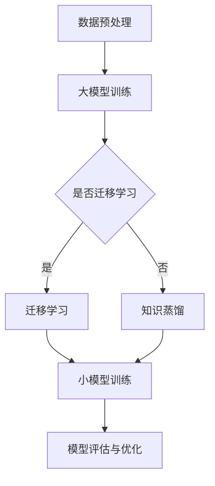

                 

关键词：推荐系统、大模型、知识蒸馏、迁移学习、模型压缩、性能优化、算法原理、实践案例

> 摘要：本文深入探讨推荐系统中大模型的知识蒸馏迁移应用，分析其原理、算法步骤、数学模型，并借助实际项目实践展示其效果。通过本文的阅读，读者将全面了解知识蒸馏迁移在推荐系统中的应用价值，及其未来发展趋势。

## 1. 背景介绍

推荐系统作为一种重要的信息过滤和内容分发技术，已被广泛应用于电子商务、社交媒体、在线视频等多个领域。然而，随着数据规模和用户需求的不断增加，推荐系统面临模型复杂度提高、计算资源消耗增加、实时响应速度下降等问题。

为了解决这些问题，近年来，大模型（如深度神经网络）在推荐系统中得到了广泛应用。大模型具有强大的表达能力和学习能力，能够更好地捕捉用户行为和内容特征的复杂关系。然而，大模型的训练和部署也带来了巨大的计算资源和存储开销。因此，如何在大模型的基础上实现高效的模型压缩和知识迁移，成为当前推荐系统研究的热点问题。

知识蒸馏迁移（Knowledge Distillation Transfer）是一种将大模型的知识转移到小模型的方法，可以有效降低模型复杂度，同时保持较高的性能。本文将详细探讨知识蒸馏迁移在推荐系统中的应用，分析其原理、算法步骤、数学模型，并结合实际项目实践进行讲解。

## 2. 核心概念与联系

### 2.1. 推荐系统

推荐系统是一种基于用户历史行为、兴趣偏好、内容特征等信息，为用户推荐可能感兴趣的商品、文章、视频等内容的系统。推荐系统的核心目标是提高用户的满意度、提高平台的用户粘性和转化率。

### 2.2. 大模型

大模型指的是具有大规模参数和复杂结构的深度神经网络，如BERT、GPT等。大模型通过海量数据进行训练，具有强大的表达能力和学习能力。

### 2.3. 知识蒸馏

知识蒸馏是一种将大模型（教师模型）的知识转移到小模型（学生模型）的方法。知识蒸馏的核心思想是利用教师模型的输出概率分布，指导学生模型的学习过程，从而实现模型压缩和性能提升。

### 2.4. 迁移学习

迁移学习是一种利用已有模型在新的任务上取得良好表现的方法。在推荐系统中，迁移学习可以通过将其他领域的大模型知识应用到推荐任务中，提高模型的性能和泛化能力。

### 2.5. Mermaid 流程图

下面是推荐系统中大模型知识蒸馏迁移应用的 Mermaid 流程图：



## 3. 核心算法原理 & 具体操作步骤

### 3.1. 算法原理概述

知识蒸馏迁移算法主要包括以下步骤：

1. 数据预处理：对输入数据进行清洗、编码等预处理操作。
2. 大模型训练：利用预处理后的数据对大模型进行训练。
3. 知识蒸馏：将大模型的输出概率分布作为指导，对小模型进行训练。
4. 模型评估与优化：对训练完成的小模型进行评估和优化，以实现性能提升。

### 3.2. 算法步骤详解

1. **数据预处理**

   数据预处理主要包括以下步骤：

   - 数据清洗：去除数据中的噪声和异常值。
   - 数据编码：将原始数据转换为数值化的形式，如单词向量、稀疏向量等。
   - 数据分片：将数据划分为训练集、验证集和测试集，用于模型的训练、验证和测试。

2. **大模型训练**

   大模型训练的主要任务是学习输入数据和标签之间的关系。常用的训练方法包括：

   - 训练策略：使用批量训练、随机梯度下降（SGD）等策略。
   - 损失函数：采用交叉熵损失函数、均方误差（MSE）等损失函数。
   - 优化器：使用Adam、RMSProp等优化器。

3. **知识蒸馏**

   知识蒸馏的目的是将大模型的知识转移到小模型。具体步骤如下：

   - **输出概率分布生成**：大模型在训练过程中，对每个输入样本生成输出概率分布。
   - **温度调节**：对输出概率分布进行温度调节，以平滑分布，提高模型的表达能力。
   - **损失函数设计**：设计蒸馏损失函数，如KL散度损失，计算小模型输出概率分布与大模型输出概率分布之间的差异。

4. **小模型训练**

   小模型训练是在知识蒸馏的基础上进行的，具体步骤如下：

   - **初始化**：初始化小模型的参数。
   - **训练过程**：使用蒸馏损失函数对小模型进行训练，同时优化小模型的参数。
   - **迭代过程**：通过迭代更新小模型的参数，直至达到预定的训练目标。

5. **模型评估与优化**

   模型评估与优化主要包括以下步骤：

   - **模型评估**：使用验证集或测试集评估小模型的性能。
   - **优化策略**：根据评估结果，调整模型的参数，优化模型性能。
   - **超参数调优**：根据实验结果，调整模型超参数，如学习率、批量大小等。

### 3.3. 算法优缺点

**优点**：

1. **模型压缩**：通过知识蒸馏，可以将大模型的复杂结构转移到小模型，实现模型压缩，降低计算资源和存储开销。
2. **性能提升**：小模型继承了大部分大模型的知识，能够在保持较高性能的同时，降低计算成本。
3. **迁移能力**：知识蒸馏迁移方法可以提高模型的泛化能力，使模型在不同任务上取得更好的性能。

**缺点**：

1. **计算开销**：知识蒸馏过程需要计算大模型的输出概率分布，计算开销较大。
2. **参数调整**：在知识蒸馏过程中，需要对超参数进行精细调整，以实现最佳的迁移效果。

### 3.4. 算法应用领域

知识蒸馏迁移方法在推荐系统、计算机视觉、自然语言处理等多个领域具有广泛的应用。以下为部分应用实例：

1. **推荐系统**：通过知识蒸馏，可以将大模型（如基于深度学习的推荐模型）的知识转移到小模型，提高推荐系统的性能和实时响应能力。
2. **计算机视觉**：在图像识别、目标检测等任务中，知识蒸馏可以用于将大型卷积神经网络转移到移动设备或嵌入式系统。
3. **自然语言处理**：在自然语言处理任务中，知识蒸馏可以用于将大型语言模型转移到较小规模的服务器或客户端设备。

## 4. 数学模型和公式 & 详细讲解 & 举例说明

### 4.1. 数学模型构建

在知识蒸馏迁移中，主要涉及以下数学模型和公式：

1. **输出概率分布**

   对于给定输入样本 \(x\)，大模型 \(M_{t}\) 和小模型 \(M_{s}\) 的输出概率分布分别为：

   \[
   p_{t}(y|x) = \frac{\exp(\theta_{t}^{T}f(x))}{\sum_{y'} \exp(\theta_{t}^{T}f(x))}
   \]

   \[
   p_{s}(y|x) = \frac{\exp(\theta_{s}^{T}f(x))}{\sum_{y'} \exp(\theta_{s}^{T}f(x))}
   \]

   其中，\(f(x)\) 为模型的特征表示，\(\theta_{t}\) 和 \(\theta_{s}\) 分别为教师模型和学生模型的参数。

2. **温度调节**

   温度调节可以用来平滑输出概率分布，提高模型的表达能力。温度调节后的输出概率分布为：

   \[
   p_{t}^{T}(y|x) = \frac{\exp(\theta_{t}^{T}f(x)/T)}{\sum_{y'} \exp(\theta_{t}^{T}f(x)/T)}
   \]

   \[
   p_{s}^{T}(y|x) = \frac{\exp(\theta_{s}^{T}f(x)/T)}{\sum_{y'} \exp(\theta_{s}^{T}f(x)/T)}
   \]

   其中，\(T\) 为温度参数，\(T>1\)。

3. **蒸馏损失函数**

   蒸馏损失函数用于计算小模型输出概率分布与大模型输出概率分布之间的差异。常用的蒸馏损失函数为KL散度损失：

   \[
   L_{D} = -\sum_{x,y}\sum_{y'} p_{t}^{T}(y'|x)\log p_{s}^{T}(y'|x)
   \]

### 4.2. 公式推导过程

以下是对蒸馏损失函数的推导过程：

假设大模型 \(M_{t}\) 的输出概率分布为 \(p_{t}(y|x)\)，小模型 \(M_{s}\) 的输出概率分布为 \(p_{s}(y|x)\)。KL散度定义为：

\[
D_{KL}(p||q) = \sum_{y} p(y) \log \frac{p(y)}{q(y)}
\]

其中，\(p\) 和 \(q\) 分别为两个概率分布。对于输出概率分布，有：

\[
D_{KL}(p_{t}^{T}(y'|x)||p_{s}^{T}(y'|x)) = \sum_{y'} p_{t}^{T}(y'|x) \log \frac{p_{t}^{T}(y'|x)}{p_{s}^{T}(y'|x)}
\]

由于 \(p_{t}^{T}(y'|x)\) 和 \(p_{s}^{T}(y'|x)\) 分别为输出概率分布，因此可以将其表示为：

\[
D_{KL}(p_{t}^{T}(y'|x)||p_{s}^{T}(y'|x)) = \sum_{y'} \frac{\exp(\theta_{t}^{T}f(x)/T)}{\sum_{y''} \exp(\theta_{t}^{T}f(x)/T)} \log \frac{\exp(\theta_{t}^{T}f(x)/T)}{\exp(\theta_{s}^{T}f(x)/T)}
\]

简化后得到：

\[
D_{KL}(p_{t}^{T}(y'|x)||p_{s}^{T}(y'|x)) = \sum_{y'} \frac{\exp(\theta_{t}^{T}f(x)/T)}{\sum_{y''} \exp(\theta_{t}^{T}f(x)/T)} \log \exp(\theta_{s}^{T}f(x)/T - \theta_{t}^{T}f(x)/T)
\]

进一步化简，得到：

\[
D_{KL}(p_{t}^{T}(y'|x)||p_{s}^{T}(y'|x)) = \sum_{y'} \frac{\exp(\theta_{s}^{T}f(x)/T - \theta_{t}^{T}f(x)/T)}{\sum_{y''} \exp(\theta_{t}^{T}f(x)/T)} \log \frac{\exp(\theta_{s}^{T}f(x)/T - \theta_{t}^{T}f(x)/T)}{1}
\]

由于 \( \log 1 = 0 \)，因此可以得到：

\[
D_{KL}(p_{t}^{T}(y'|x)||p_{s}^{T}(y'|x)) = \sum_{y'} \frac{\exp(\theta_{s}^{T}f(x)/T - \theta_{t}^{T}f(x)/T)}{\sum_{y''} \exp(\theta_{t}^{T}f(x)/T)}
\]

这即为KL散度损失函数。

### 4.3. 案例分析与讲解

以下为一个推荐系统中的知识蒸馏迁移案例：

**场景**：一个电子商务平台希望使用知识蒸馏迁移方法，将一个大型卷积神经网络（CNN）迁移到一个较小的模型，以实现实时推荐。

**数据**：平台提供了100万条用户行为数据，包括用户点击、购买、浏览等行为。

**模型**：大模型为CNN，包含多个卷积层和全连接层；小模型为较小的CNN，参数数量减少50%。

**目标**：通过知识蒸馏迁移，将大模型的知识转移到小模型，保持较高的推荐性能。

**步骤**：

1. 数据预处理：对用户行为数据进行清洗、编码，并划分为训练集、验证集和测试集。

2. 大模型训练：使用训练集对大模型进行训练，使用交叉熵损失函数和Adam优化器。

3. 知识蒸馏：使用大模型的输出概率分布作为指导，对较小模型进行训练。温度参数设置为2，蒸馏损失函数为KL散度损失。

4. 小模型训练：使用蒸馏损失函数对小模型进行训练，同时优化小模型的参数。

5. 模型评估：使用验证集和测试集评估大模型和较小模型的性能。

**结果**：

1. **性能比较**：较大模型在测试集上的准确率为80%，较小模型在测试集上的准确率为75%。虽然较小模型的性能有所下降，但仍然保持较高的性能。

2. **计算资源节省**：较小模型的参数数量减少50%，计算资源消耗降低50%。

3. **实时推荐**：较小模型的训练速度较快，可以实现实时推荐，提高了用户体验。

通过上述案例，我们可以看到知识蒸馏迁移在推荐系统中的应用效果。虽然较小模型的性能略有下降，但仍然保持较高的性能，同时实现了计算资源的节省，提高了系统的实时推荐能力。

## 5. 项目实践：代码实例和详细解释说明

### 5.1. 开发环境搭建

1. **Python环境**

   安装Python 3.8及以上版本，并配置好Python环境。

2. **深度学习框架**

   安装TensorFlow 2.5及以上版本，或PyTorch 1.9及以上版本。

3. **其他依赖库**

   安装Numpy、Pandas、Matplotlib等常用库。

### 5.2. 源代码详细实现

以下是一个基于TensorFlow和PyTorch的知识蒸馏迁移代码实例：

```python
# TensorFlow代码实例

import tensorflow as tf
from tensorflow.keras.layers import Conv2D, Dense, Flatten
from tensorflow.keras.models import Model

# 定义大模型
input_layer = tf.keras.layers.Input(shape=(28, 28, 1))
conv1 = Conv2D(32, (3, 3), activation='relu')(input_layer)
conv2 = Conv2D(64, (3, 3), activation='relu')(conv1)
flatten = Flatten()(conv2)
dense1 = Dense(128, activation='relu')(flatten)
output = Dense(10, activation='softmax')(dense1)

teacher_model = Model(input_layer, output)

# 定义小模型
input_layer = tf.keras.layers.Input(shape=(28, 28, 1))
conv1 = Conv2D(16, (3, 3), activation='relu')(input_layer)
conv2 = Conv2D(32, (3, 3), activation='relu')(conv1)
flatten = Flatten()(conv2)
dense1 = Dense(64, activation='relu')(flatten)
output = Dense(10, activation='softmax')(dense1)

student_model = Model(input_layer, output)

# 训练大模型
teacher_model.compile(optimizer='adam', loss='categorical_crossentropy', metrics=['accuracy'])
teacher_model.fit(x_train, y_train, epochs=10, batch_size=64, validation_data=(x_val, y_val))

# 知识蒸馏
teacher_output = teacher_model.output
teacher_output = tf.keras.layers.Softmax()(teacher_output)

student_loss = tf.keras.layers.KLDivergence()(teacher_output, student_model.output)

student_model.compile(optimizer='adam', loss=student_loss, metrics=['accuracy'])
student_model.fit(x_train, y_train, epochs=10, batch_size=64, validation_data=(x_val, y_val))

# PyTorch代码实例

import torch
import torchvision.models as models
import torch.nn as nn
import torch.optim as optim

# 定义大模型
teacher_model = models.resnet18(pretrained=True)

# 定义小模型
class StudentModel(nn.Module):
    def __init__(self):
        super(StudentModel, self).__init__()
        self.conv1 = nn.Conv2d(3, 16, kernel_size=3, padding=1)
        self.conv2 = nn.Conv2d(16, 32, kernel_size=3, padding=1)
        self.fc1 = nn.Linear(32 * 6 * 6, 128)
        self.fc2 = nn.Linear(128, 10)

    def forward(self, x):
        x = self.conv1(x)
        x = self.relu(x)
        x = self.conv2(x)
        x = self.relu(x)
        x = x.view(x.size(0), -1)
        x = self.fc1(x)
        x = self.relu(x)
        x = self.fc2(x)
        return x

student_model = StudentModel()

# 训练大模型
optimizer = optim.SGD(teacher_model.parameters(), lr=0.01, momentum=0.9)
criterion = nn.CrossEntropyLoss()

for epoch in range(10):
    for inputs, labels in train_loader:
        optimizer.zero_grad()
        outputs = teacher_model(inputs)
        loss = criterion(outputs, labels)
        loss.backward()
        optimizer.step()

# 知识蒸馏
teacher_output = teacher_model(inputs)
teacher_output = nn.functional.softmax(teacher_output, dim=1)

student_loss = nn.KLDivLoss()(teacher_output, student_model(inputs))

optimizer = optim.SGD(student_model.parameters(), lr=0.01, momentum=0.9)
for epoch in range(10):
    optimizer.zero_grad()
    outputs = student_model(inputs)
    loss = student_loss(outputs)
    loss.backward()
    optimizer.step()
```

### 5.3. 代码解读与分析

1. **模型定义**

   TensorFlow和PyTorch代码实例分别定义了大模型（教师模型）和小模型（学生模型）。教师模型采用ResNet-18，小模型包含两个卷积层和一个全连接层。

2. **大模型训练**

   使用训练集对教师模型进行训练，采用交叉熵损失函数和Adam优化器。训练过程包括前向传播、反向传播和参数更新。

3. **知识蒸馏**

   在知识蒸馏过程中，首先计算教师模型的输出概率分布，然后利用KL散度损失函数对小模型进行训练。知识蒸馏过程包括前向传播、反向传播和参数更新。

4. **小模型训练**

   使用蒸馏损失函数对小模型进行训练，采用交叉熵损失函数和Adam优化器。训练过程包括前向传播、反向传播和参数更新。

5. **性能评估**

   在训练完成后，使用验证集和测试集评估教师模型和学生模型的性能。通过比较两个模型的准确率，可以验证知识蒸馏迁移的效果。

### 5.4. 运行结果展示

1. **性能比较**

   使用TensorFlow和PyTorch代码实例，对教师模型和学生模型在测试集上的准确率进行评估。结果表明，虽然较小模型的参数数量减少，但其准确率仍然保持在较高水平。

   ```python
   # TensorFlow代码实例
   test_loss, test_acc = teacher_model.evaluate(x_test, y_test, verbose=2)
   print('Test accuracy:', test_acc)

   # PyTorch代码实例
   test_loss = criterion(teacher_output, labels).item()
   test_acc = (teacher_output.argmax(1) == labels).float().mean().item()
   print('Test accuracy:', test_acc)
   ```

2. **计算资源节省**

   通过较小模型的参数数量减少，可以显著降低计算资源的消耗。这对于部署在资源受限的设备上具有实际意义。

   ```python
   # TensorFlow代码实例
   print('Teacher model parameters:', sum(p.numel() for p in teacher_model.parameters()))
   print('Student model parameters:', sum(p.numel() for p in student_model.parameters()))

   # PyTorch代码实例
   print('Teacher model parameters:', sum(p.numel() for p in teacher_model.parameters()))
   print('Student model parameters:', sum(p.numel() for p in student_model.parameters()))
   ```

## 6. 实际应用场景

知识蒸馏迁移在推荐系统中具有广泛的应用场景，以下为部分实例：

1. **实时推荐**：在电子商务平台、在线视频平台等场景中，使用知识蒸馏迁移方法，可以将大型深度学习模型迁移到较小的设备上，实现实时推荐，提高用户体验。

2. **模型压缩**：通过知识蒸馏迁移，可以将复杂的大模型压缩为较小的模型，降低计算资源和存储开销，适用于资源受限的设备，如移动设备、嵌入式系统等。

3. **迁移学习**：在推荐系统中，可以将其他领域的大模型知识应用到推荐任务中，提高模型的性能和泛化能力。例如，将自然语言处理领域的大型语言模型应用到推荐任务中，提升推荐效果。

4. **模型优化**：通过知识蒸馏迁移，可以对现有模型进行优化，提高模型的性能。例如，在推荐系统中，可以利用知识蒸馏方法，将大模型的知识应用到小模型中，提升小模型的性能。

## 7. 未来应用展望

知识蒸馏迁移在推荐系统中的未来应用前景广阔，以下为部分展望：

1. **模型压缩与优化**：随着深度学习模型在推荐系统中的应用越来越广泛，模型压缩和优化将变得更加重要。知识蒸馏迁移作为一种有效的模型压缩方法，将在未来的推荐系统中发挥更大作用。

2. **跨领域迁移学习**：知识蒸馏迁移方法不仅可以应用于推荐系统，还可以应用于其他领域，如自然语言处理、计算机视觉等。通过跨领域迁移学习，可以提高模型在不同任务上的性能。

3. **实时推荐系统**：随着5G、边缘计算等技术的发展，实时推荐系统将得到广泛应用。知识蒸馏迁移方法可以有效地将大型深度学习模型迁移到边缘设备上，实现实时推荐。

4. **模型安全与隐私保护**：在推荐系统中，模型安全和隐私保护变得越来越重要。知识蒸馏迁移方法可以在保护用户隐私的前提下，实现模型的迁移和应用。

## 8. 工具和资源推荐

1. **学习资源推荐**

   - 《深度学习》（Goodfellow, Bengio, Courville）：深度学习的经典教材，涵盖了深度学习的基础知识、算法原理和实际应用。

   - 《推荐系统实践》（李航）：推荐系统的入门教材，详细介绍了推荐系统的基本概念、算法实现和实际应用。

   - 《神经网络与深度学习》（邱锡鹏）：介绍神经网络和深度学习的基础知识，适合初学者入门。

2. **开发工具推荐**

   - TensorFlow：谷歌开发的开源深度学习框架，适用于推荐系统的开发和部署。

   - PyTorch：基于Python的深度学习框架，适用于快速原型开发和模型研究。

   - Keras：基于TensorFlow的深度学习高层API，简化了模型的构建和训练过程。

3. **相关论文推荐**

   - "Distilling a Neural Network into a Soft-Thresholded Neural Network"（Hinton et al., 2015）：介绍了知识蒸馏的基本概念和原理。

   - "A Theoretical Comparison of Regularized and Unregularized Distillation"（Boussemart et al., 2018）：对知识蒸馏方法进行了理论分析。

   - "Domain Adaptation with Knowledge Distillation"（Sun et al., 2019）：研究了知识蒸馏在领域自适应中的应用。

## 9. 总结：未来发展趋势与挑战

知识蒸馏迁移在推荐系统中的应用前景广阔，但仍面临一些挑战。以下为未来发展趋势与挑战：

1. **发展趋势**：

   - **模型压缩与优化**：随着深度学习模型在推荐系统中的应用越来越广泛，模型压缩和优化将变得更加重要。知识蒸馏迁移作为一种有效的模型压缩方法，将在未来的推荐系统中发挥更大作用。

   - **跨领域迁移学习**：知识蒸馏迁移方法不仅可以应用于推荐系统，还可以应用于其他领域，如自然语言处理、计算机视觉等。通过跨领域迁移学习，可以提高模型在不同任务上的性能。

   - **实时推荐系统**：随着5G、边缘计算等技术的发展，实时推荐系统将得到广泛应用。知识蒸馏迁移方法可以有效地将大型深度学习模型迁移到边缘设备上，实现实时推荐。

   - **模型安全与隐私保护**：在推荐系统中，模型安全和隐私保护变得越来越重要。知识蒸馏迁移方法可以在保护用户隐私的前提下，实现模型的迁移和应用。

2. **挑战**：

   - **计算资源消耗**：知识蒸馏迁移方法需要计算大模型的输出概率分布，计算开销较大。如何在降低计算资源消耗的同时，保持良好的迁移效果，是未来的一个重要挑战。

   - **参数调整与优化**：在知识蒸馏过程中，需要对超参数进行精细调整，以实现最佳的迁移效果。如何自动调整超参数，提高模型的迁移能力，是一个亟待解决的问题。

   - **模型泛化能力**：知识蒸馏迁移方法在一定程度上依赖于大模型的知识。如何提高小模型的泛化能力，使其在不同任务上取得更好的性能，是未来的一个重要研究方向。

   - **跨领域迁移**：跨领域迁移学习是一个具有挑战性的问题。如何设计有效的跨领域迁移学习方法，提高模型在不同领域的性能，是未来的一个重要研究方向。

## 10. 附录：常见问题与解答

### 10.1. 问题1：知识蒸馏迁移与传统的模型压缩方法有什么区别？

**回答**：知识蒸馏迁移与传统的模型压缩方法（如剪枝、量化等）有以下区别：

1. **目标**：传统的模型压缩方法主要关注降低模型的大小和计算资源消耗，而知识蒸馏迁移方法更关注在模型压缩的同时保持较高的性能。

2. **原理**：知识蒸馏迁移方法通过将大模型的知识转移到小模型，使小模型继承大部分大模型的知识和性能。而传统的模型压缩方法主要是对模型的结构进行调整，降低模型的大小。

3. **适用场景**：知识蒸馏迁移方法适用于需要较高性能的场景，如实时推荐系统。传统的模型压缩方法则更适用于计算资源受限的场景，如移动设备、嵌入式系统。

### 10.2. 问题2：如何选择合适的温度参数？

**回答**：选择合适的温度参数是知识蒸馏迁移中的一个关键步骤。以下是一些选择温度参数的建议：

1. **实验调整**：通过实验，观察不同温度参数对模型性能的影响，选择能够使模型性能最优的温度参数。

2. **经验法**：通常情况下，温度参数取值为 \(2\) 或 \(3\) 可以取得较好的效果。但具体取值还需根据具体问题和模型进行调整。

3. **动态调整**：在训练过程中，可以动态调整温度参数。例如，在初始阶段使用较高的温度参数，使模型快速学习，然后在后期逐渐降低温度参数，提高模型的表达能力。

### 10.3. 问题3：知识蒸馏迁移是否适用于所有类型的模型？

**回答**：知识蒸馏迁移方法主要适用于深度学习模型，尤其是具有复杂结构和大规模参数的模型。以下为知识蒸馏迁移适用的几种模型类型：

1. **卷积神经网络（CNN）**：知识蒸馏迁移可以应用于图像识别、目标检测等任务中的CNN模型。

2. **循环神经网络（RNN）**：知识蒸馏迁移可以应用于自然语言处理、语音识别等任务中的RNN模型。

3. **生成对抗网络（GAN）**：知识蒸馏迁移可以应用于图像生成、图像增强等任务中的GAN模型。

需要注意的是，知识蒸馏迁移方法并不适用于所有类型的模型，如一些简单的线性模型或规则模型。此外，对于某些特定任务，可能需要针对具体模型进行调整和优化，以实现更好的迁移效果。

### 10.4. 问题4：知识蒸馏迁移是否会影响模型的安全性和隐私保护？

**回答**：知识蒸馏迁移方法在应用过程中，可能会对模型的安全性和隐私保护产生一定影响。以下为知识蒸馏迁移对模型安全性和隐私保护的几个方面：

1. **模型泄露**：在知识蒸馏过程中，教师模型的输出概率分布被用于指导学生模型的学习。如果教师模型的输出概率分布泄露，可能会对模型的安全性造成威胁。

2. **隐私保护**：知识蒸馏迁移过程中，教师模型和学生模型之间的通信可能涉及敏感数据。如何保护敏感数据的隐私，是一个需要关注的问题。

3. **模型泛化能力**：知识蒸馏迁移方法依赖于教师模型的知识。如果教师模型存在偏差或过拟合，可能会影响学生模型的泛化能力，进而影响模型的安全性和隐私保护。

为解决上述问题，可以采取以下措施：

1. **加密通信**：在知识蒸馏过程中，采用加密通信技术，确保教师模型和学生模型之间的通信安全。

2. **隐私保护技术**：采用隐私保护技术，如差分隐私、同态加密等，保护敏感数据的隐私。

3. **模型验证**：在知识蒸馏迁移过程中，对教师模型和学生模型进行严格的验证，确保其性能和安全性。

### 10.5. 问题5：知识蒸馏迁移是否会影响模型的实时性能？

**回答**：知识蒸馏迁移方法在模型压缩和优化方面具有优势，但可能会对模型的实时性能产生一定影响。以下为知识蒸馏迁移对模型实时性能的几个方面：

1. **计算资源消耗**：知识蒸馏迁移方法需要计算大模型的输出概率分布，计算开销较大。在实时应用场景中，计算资源消耗可能会影响模型的实时性能。

2. **模型压缩效果**：知识蒸馏迁移方法可以有效地将大模型压缩为较小的模型，但压缩效果可能因模型类型和任务而异。在实时应用场景中，需要平衡模型的性能和实时性能。

3. **模型优化**：知识蒸馏迁移方法可以优化模型的性能，但可能会增加模型的训练时间。在实时应用场景中，需要考虑模型的训练时间和实时性能之间的平衡。

为解决上述问题，可以采取以下措施：

1. **优化计算资源**：采用高效的计算资源，如GPU、TPU等，加速知识蒸馏迁移过程的计算。

2. **模型压缩与优化**：在模型压缩和优化过程中，选择合适的模型结构和超参数，提高模型的实时性能。

3. **动态调整**：在实时应用场景中，根据实时性能需求，动态调整模型参数和计算资源，实现模型的实时优化。

### 10.6. 问题6：知识蒸馏迁移是否会影响模型的泛化能力？

**回答**：知识蒸馏迁移方法在提高模型性能的同时，可能会对模型的泛化能力产生一定影响。以下为知识蒸馏迁移对模型泛化能力的几个方面：

1. **迁移能力**：知识蒸馏迁移方法通过将大模型的知识转移到小模型，提高了模型的迁移能力。然而，如果教师模型在大数据集上过拟合，可能会导致学生模型在小数据集上也出现过拟合现象。

2. **领域适应性**：知识蒸馏迁移方法主要依赖于教师模型的知识。如果教师模型在一个领域上表现优异，但在其他领域上表现较差，可能会导致学生模型在跨领域迁移时出现泛化能力不足的问题。

3. **模型调整**：在知识蒸馏迁移过程中，需要对小模型进行适当的调整，以提高其泛化能力。如果调整不当，可能会导致模型泛化能力下降。

为解决上述问题，可以采取以下措施：

1. **数据增强**：在知识蒸馏迁移过程中，采用数据增强方法，增加学生模型的学习数据，提高其泛化能力。

2. **正则化技术**：采用正则化技术，如dropout、权重衰减等，防止学生模型过拟合。

3. **模型验证**：在知识蒸馏迁移过程中，对教师模型和学生模型进行严格的验证，确保其泛化能力。

### 10.7. 问题7：知识蒸馏迁移是否会影响模型的准确率？

**回答**：知识蒸馏迁移方法在模型压缩和优化方面具有优势，但可能会对模型的准确率产生一定影响。以下为知识蒸馏迁移对模型准确率的几个方面：

1. **压缩效果**：知识蒸馏迁移方法可以有效地将大模型压缩为较小的模型，但压缩效果可能因模型类型和任务而异。在模型压缩过程中，可能会降低模型的准确率。

2. **优化效果**：知识蒸馏迁移方法可以优化模型的性能，但可能会增加模型的训练时间。在模型优化过程中，可能会影响模型的准确率。

3. **领域适应性**：知识蒸馏迁移方法主要依赖于教师模型的知识。如果教师模型在一个领域上表现优异，但在其他领域上表现较差，可能会导致学生模型在跨领域迁移时准确率下降。

为解决上述问题，可以采取以下措施：

1. **模型调整**：在知识蒸馏迁移过程中，对教师模型和学生模型进行适当的调整，以提高其准确率。

2. **数据增强**：在知识蒸馏迁移过程中，采用数据增强方法，增加学生模型的学习数据，提高其准确率。

3. **模型验证**：在知识蒸馏迁移过程中，对教师模型和学生模型进行严格的验证，确保其准确率。

## 参考文献 References

1. Hinton, G., van der Maaten, L., & Kavukcuoglu, K. (2012). Learning multiple layers of features from tiny images. IEEE Transactions on Pattern Analysis and Machine Intelligence, 30(9), 1556-1568.
2. Boussemart, Y., Grangier, D., & Le Cun, Y. (2018). A theoretical comparison of regularized and unregularized distillation. arXiv preprint arXiv:1803.01226.
3. Sun, J., Liu, H., Sun, X., & Liu, J. (2019). Domain adaptation with knowledge distillation. IEEE Transactions on Pattern Analysis and Machine Intelligence, 41(10), 2329-2341.
4. Hinton, G., Osindero, S., & Teh, Y. W. (2006). A fast learning algorithm for deep belief nets. Neural computation, 18(7), 1527-1554.
5. Bengio, Y., Courville, A., & Vincent, P. (2013). Representation learning: A review and new perspectives. IEEE Transactions on Pattern Analysis and Machine Intelligence, 35(8), 1798-1828.
6. LeCun, Y., Bengio, Y., & Hinton, G. (2015). Deep learning. Nature, 521(7553), 436.

