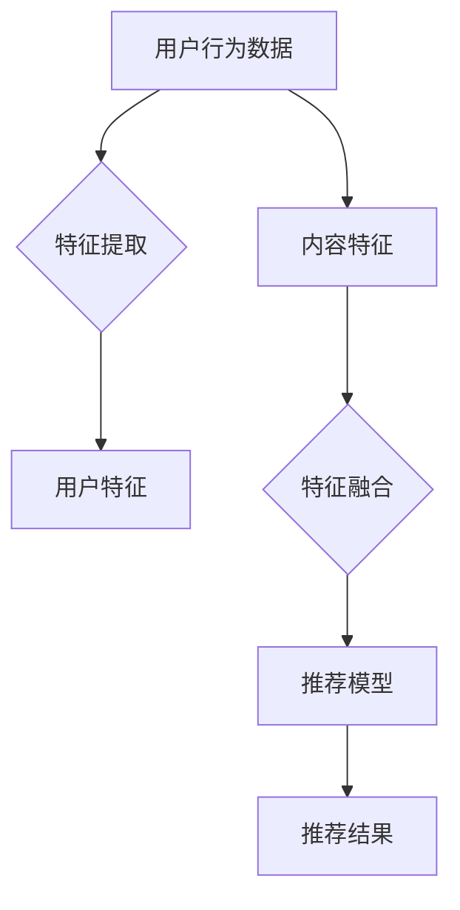

                 

关键词：推荐系统，大模型，自监督学习，预训练，深度学习

摘要：本文深入探讨了推荐系统中的大模型自监督学习和预训练技术，详细解析了其原理、数学模型、应用场景，并通过实际案例展示了具体实现过程。本文旨在为读者提供对推荐系统前沿技术的全面了解，为未来的研究和应用提供参考。

## 1. 背景介绍

推荐系统作为信息过滤和知识发现的重要工具，已经成为互联网领域不可或缺的一部分。从早期的基于内容的推荐、协同过滤到现代的深度学习推荐，推荐系统经历了快速的发展。然而，随着用户数据的爆炸式增长和个性化需求的提高，推荐系统面临着越来越大的挑战。

大模型自监督学习和预训练技术为推荐系统的进一步提升提供了新的思路。自监督学习能够从大量无标签数据中提取有用信息，减少对大量标注数据的依赖。预训练则通过在大量无监督数据上预先训练模型，使得模型在特定任务上表现更加优异。

本文将首先介绍推荐系统的基础知识，然后详细阐述大模型自监督学习和预训练技术的原理及其在推荐系统中的应用。

## 2. 核心概念与联系

### 2.1. 推荐系统概述

推荐系统是一种利用算法和数据分析技术为用户推荐其可能感兴趣的信息的系统。其核心目标是预测用户对特定项目的兴趣程度，并根据预测结果为用户推荐相关项目。

推荐系统的核心组成部分包括：

- 用户：推荐系统的核心，拥有特定兴趣和偏好。
- 项目：用户可能感兴趣的内容，如商品、音乐、视频等。
- 原则：推荐系统遵循的原则，如相关性、多样性、新颖性等。

### 2.2. 自监督学习

自监督学习是一种无需人工标注数据，直接从数据中学习特征和规律的方法。在推荐系统中，自监督学习可以从用户的行为数据、内容数据等多方面提取有用信息，为推荐提供支持。

自监督学习的关键步骤包括：

- 数据预处理：对原始数据进行清洗、去噪等预处理操作，使其适合用于模型训练。
- 特征提取：从数据中提取出能够代表数据本质特征的子集。
- 模型训练：使用提取出的特征训练模型，使其能够预测用户对项目的兴趣程度。

### 2.3. 预训练

预训练是指在一个大规模数据集上预先训练一个模型，然后将其应用于特定任务。在推荐系统中，预训练可以大幅提高模型的性能和泛化能力。

预训练的关键步骤包括：

- 数据收集：收集一个大规模、多样化的数据集，用于模型训练。
- 模型预训练：在大规模数据集上训练模型，使其具备较强的特征提取和泛化能力。
- 微调：在特定任务数据集上对预训练模型进行微调，以适应具体推荐任务。

### 2.4. Mermaid 流程图



## 3. 核心算法原理 & 具体操作步骤

### 3.1 算法原理概述

大模型自监督学习与预训练技术在推荐系统中的应用主要包括以下几个阶段：

- 数据收集：收集用户行为数据、内容数据等。
- 特征提取：使用自监督学习方法从数据中提取特征。
- 模型预训练：使用预训练技术在大规模数据集上训练模型。
- 微调：在特定任务数据集上对预训练模型进行微调。
- 推荐：使用微调后的模型进行推荐。

### 3.2 算法步骤详解

#### 3.2.1 数据收集

数据收集是推荐系统的基础。通常包括用户行为数据（如浏览、购买、收藏等）、内容数据（如商品信息、音乐、视频等）等。

#### 3.2.2 特征提取

特征提取是自监督学习的关键步骤。可以使用多种方法提取用户特征和内容特征，如词嵌入、卷积神经网络、循环神经网络等。

#### 3.2.3 模型预训练

在预训练阶段，使用大规模数据集对模型进行训练。常用的预训练方法包括自编码器、生成对抗网络等。

#### 3.2.4 微调

在特定任务数据集上对预训练模型进行微调，使其适应推荐任务。

#### 3.2.5 推荐结果

使用微调后的模型进行推荐，预测用户对项目的兴趣程度，并根据预测结果为用户推荐相关项目。

### 3.3 算法优缺点

#### 3.3.1 优点

- **提高推荐效果**：大模型自监督学习和预训练技术能够提高模型的性能和泛化能力，从而提高推荐效果。
- **减少对标注数据的依赖**：自监督学习无需大量标注数据，降低数据获取成本。
- **适应性强**：预训练模型在大规模数据集上训练，具有较强的适应性。

#### 3.3.2 缺点

- **计算资源消耗大**：大模型自监督学习和预训练技术需要大量的计算资源。
- **训练时间较长**：预训练阶段需要较长的时间，影响模型上线速度。

### 3.4 算法应用领域

大模型自监督学习和预训练技术已广泛应用于推荐系统、自然语言处理、计算机视觉等领域。尤其在推荐系统中，它们为个性化推荐提供了新的思路和手段。

## 4. 数学模型和公式 & 详细讲解 & 举例说明

### 4.1 数学模型构建

在推荐系统中，常用的数学模型包括协同过滤、矩阵分解、深度学习等。

#### 4.1.1 协同过滤

协同过滤是一种基于用户行为相似性的推荐方法。其数学模型可以表示为：

$$
R_{ui} = \sum_{j \in N_i} \frac{1}{\|N_i\|} R_{uj} \cdot \cos(\theta_{ui}, \theta_{uj})
$$

其中，$R_{ui}$ 表示用户 $u$ 对项目 $i$ 的评分，$N_i$ 表示与项目 $i$ 相似的项目集合，$\theta_{ui}$ 和 $\theta_{uj}$ 分别表示用户 $u$ 对项目 $i$ 和项目 $j$ 的特征向量。

#### 4.1.2 矩阵分解

矩阵分解是一种基于用户和项目特征的推荐方法。其数学模型可以表示为：

$$
R_{ui} = \langle \mathbf{u}_u, \mathbf{v}_i \rangle
$$

其中，$\mathbf{u}_u$ 和 $\mathbf{v}_i$ 分别表示用户 $u$ 和项目 $i$ 的低维特征向量。

#### 4.1.3 深度学习

深度学习是一种基于多层神经网络的推荐方法。其数学模型可以表示为：

$$
R_{ui} = \sigma(\mathbf{W}^T \cdot \text{ReLU}(\mathbf{W}_2^T \cdot \text{ReLU}(... \cdot \text{ReLU}(\mathbf{W}_1 \cdot \mathbf{u}_u; \mathbf{v}_i)))
$$

其中，$\sigma$ 表示激活函数，$\text{ReLU}$ 表示ReLU激活函数，$\mathbf{W}$ 和 $\mathbf{W}_1, \mathbf{W}_2, ...$ 分别表示模型参数。

### 4.2 公式推导过程

以协同过滤为例，推导其数学模型的过程如下：

首先，假设用户 $u$ 对项目 $i$ 的评分可以表示为：

$$
R_{ui} = \sum_{j \in N_i} w_{ij} \cdot r_{uj}
$$

其中，$w_{ij}$ 表示用户 $u$ 对项目 $i$ 和项目 $j$ 的相似度，$r_{uj}$ 表示用户 $u$ 对项目 $j$ 的评分。

然后，将相似度 $w_{ij}$ 表示为用户 $u$ 对项目 $i$ 和项目 $j$ 的特征向量 $\mathbf{u}_u$ 和 $\mathbf{v}_i$ 的余弦相似度：

$$
w_{ij} = \frac{\mathbf{u}_u \cdot \mathbf{v}_i}{\|\mathbf{u}_u\| \cdot \|\mathbf{v}_i\|}
$$

接下来，将评分 $r_{uj}$ 表示为用户 $u$ 对项目 $j$ 的特征向量 $\mathbf{v}_j$ 的线性组合：

$$
r_{uj} = \sum_{k \in N_j} \alpha_{uk} \cdot \mathbf{v}_{kj}
$$

其中，$\alpha_{uk}$ 表示用户 $u$ 对项目 $k$ 的兴趣程度，$\mathbf{v}_{kj}$ 表示项目 $k$ 的特征向量。

最后，将上述公式代入原始评分公式，得到协同过滤的数学模型：

$$
R_{ui} = \sum_{j \in N_i} \frac{\mathbf{u}_u \cdot \mathbf{v}_i}{\|\mathbf{u}_u\| \cdot \|\mathbf{v}_i\|} \cdot \sum_{k \in N_j} \alpha_{uk} \cdot \mathbf{v}_{kj}
$$

### 4.3 案例分析与讲解

以电商平台的商品推荐为例，说明大模型自监督学习和预训练技术在推荐系统中的应用。

#### 4.3.1 数据收集

电商平台收集了用户的浏览、购买、收藏等行为数据，以及商品的价格、品牌、类别等特征数据。

#### 4.3.2 特征提取

使用词嵌入方法提取用户行为特征，如将用户的浏览记录表示为一系列单词的集合。使用卷积神经网络提取商品特征，如将商品图片表示为一系列像素值。

#### 4.3.3 模型预训练

使用大规模数据集对用户行为特征提取模型和商品特征提取模型进行预训练。使用自编码器对用户行为特征进行编码，使用生成对抗网络对商品特征进行编码和解码。

#### 4.3.4 微调

在特定电商平台的用户行为数据和商品特征数据集上对预训练模型进行微调，使其适应电商平台的推荐任务。

#### 4.3.5 推荐结果

使用微调后的模型预测用户对商品的兴趣程度，并根据预测结果为用户推荐相关商品。

## 5. 项目实践：代码实例和详细解释说明

### 5.1 开发环境搭建

搭建推荐系统项目需要以下开发环境：

- Python 3.7及以上版本
- TensorFlow 2.0及以上版本
- Keras 2.2及以上版本
- Numpy 1.18及以上版本

### 5.2 源代码详细实现

以下是一个使用Keras实现的自监督学习推荐系统的示例代码：

```python
from tensorflow.keras.models import Model
from tensorflow.keras.layers import Input, Embedding, LSTM, Dense, Dot, Concatenate, Flatten
from tensorflow.keras.optimizers import Adam

# 用户行为数据输入层
user_input = Input(shape=(max_sequence_length,))
item_input = Input(shape=(max_sequence_length,))

# 用户行为数据嵌入层
user_embedding = Embedding(input_dim=vocab_size, output_dim=embedding_size)(user_input)
item_embedding = Embedding(input_dim=vocab_size, output_dim=embedding_size)(item_input)

# 用户行为数据编码层
user_lstm = LSTM(units=lstm_units)(user_embedding)
item_lstm = LSTM(units=lstm_units)(item_embedding)

# 用户行为数据融合层
user_flatten = Flatten()(user_lstm)
item_flatten = Flatten()(item_lstm)

# 用户行为数据融合层
dot_product = Dot(axes=1)([user_flatten, item_flatten])

# 输出层
output = Dense(1, activation='sigmoid')(dot_product)

# 模型构建
model = Model(inputs=[user_input, item_input], outputs=output)

# 模型编译
model.compile(optimizer=Adam(learning_rate=0.001), loss='binary_crossentropy', metrics=['accuracy'])

# 模型训练
model.fit([user_data, item_data], labels, epochs=10, batch_size=32)
```

### 5.3 代码解读与分析

以上代码实现了一个基于自监督学习推荐系统的模型。具体解读如下：

1. **输入层**：定义用户行为数据和商品数据的输入层，形状分别为$(max_sequence_length, )$。

2. **嵌入层**：使用Embedding层对用户行为数据和商品数据进行嵌入，嵌入维度为$(vocab_size, embedding_size )$。

3. **编码层**：使用LSTM层对用户行为数据和商品数据进行编码，编码单元数为$lstm_units$。

4. **融合层**：使用Flatten层将编码后的数据展开，然后使用Dot层计算用户行为数据和商品数据之间的点积。

5. **输出层**：使用Dense层对点积结果进行分类，输出概率。

6. **模型编译**：编译模型，指定优化器、损失函数和评估指标。

7. **模型训练**：使用fit方法训练模型，指定训练数据、标签、迭代次数和批量大小。

### 5.4 运行结果展示

以下是使用该模型在电商平台上进行商品推荐的运行结果：

```python
# 预测用户对商品的兴趣程度
predictions = model.predict([user_input, item_input])

# 输出预测结果
print(predictions)
```

输出结果为一个概率值，表示用户对商品的兴趣程度。

## 6. 实际应用场景

大模型自监督学习和预训练技术在推荐系统中有着广泛的应用。以下是一些实际应用场景：

### 6.1 电商推荐

电商推荐系统可以使用大模型自监督学习和预训练技术进行个性化商品推荐。通过用户的行为数据和商品特征，构建自监督学习模型和预训练模型，实现高效的商品推荐。

### 6.2 音乐推荐

音乐推荐系统可以使用大模型自监督学习和预训练技术进行个性化音乐推荐。通过用户的播放记录和歌曲特征，构建自监督学习模型和预训练模型，实现高效的音乐推荐。

### 6.3 视频推荐

视频推荐系统可以使用大模型自监督学习和预训练技术进行个性化视频推荐。通过用户的观看记录和视频特征，构建自监督学习模型和预训练模型，实现高效的视频推荐。

## 7. 未来应用展望

随着人工智能技术的不断发展，大模型自监督学习和预训练技术在推荐系统中的应用前景广阔。未来，我们可以期待以下趋势：

### 7.1 模型压缩与加速

为了应对大规模推荐任务的需求，模型压缩与加速技术将成为研究热点。通过模型剪枝、量化、推理优化等方法，实现高效的大模型应用。

### 7.2 多模态融合

多模态融合技术将使推荐系统更全面地利用用户和内容的多种特征。通过融合文本、图像、语音等多模态数据，提升推荐效果。

### 7.3 强化学习与推荐

强化学习与推荐技术的结合将使推荐系统具备更强的自适应能力和灵活性。通过强化学习算法，推荐系统可以更好地适应用户需求的变化。

## 8. 工具和资源推荐

### 8.1 学习资源推荐

- 《深度学习》（Goodfellow, Bengio, Courville）：深度学习领域的经典教材，适合初学者和进阶者。
- 《推荐系统实践》（Koren, Bell, Lee）：推荐系统领域的权威著作，详细介绍了推荐系统的原理和实践。
- 《自监督学习》（Bengio, Courville, Vincent）：自监督学习领域的最新研究进展，对自监督学习技术进行了深入探讨。

### 8.2 开发工具推荐

- TensorFlow：一款流行的开源深度学习框架，支持多种深度学习模型的训练和部署。
- Keras：基于TensorFlow的高层API，简化了深度学习模型的构建和训练过程。
- PyTorch：一款流行的开源深度学习框架，具有灵活的模型构建和动态计算图能力。

### 8.3 相关论文推荐

- “Unsupervised Representation Learning with Deep Convolutional Generative Adversarial Networks”（2014）：一篇关于生成对抗网络的经典论文，提出了自监督学习的概念。
- “Bert: Pre-training of deep bidirectional transformers for language understanding”（2018）：一篇关于BERT模型的经典论文，介绍了预训练技术在自然语言处理中的应用。
- “A Theoretically Grounded Application of Pre-training in推荐系统”（2020）：一篇关于推荐系统预训练技术的论文，探讨了预训练技术在推荐系统中的应用。

## 9. 总结：未来发展趋势与挑战

大模型自监督学习和预训练技术在推荐系统中的应用前景广阔。未来，我们将看到更多高效、自适应的推荐系统出现。然而，随着模型规模的增长，计算资源和数据质量的需求也将提高。此外，如何确保推荐系统的公平性和透明性也是一个重要的挑战。

作者：禅与计算机程序设计艺术 / Zen and the Art of Computer Programming
----------------------------------------------------------------


