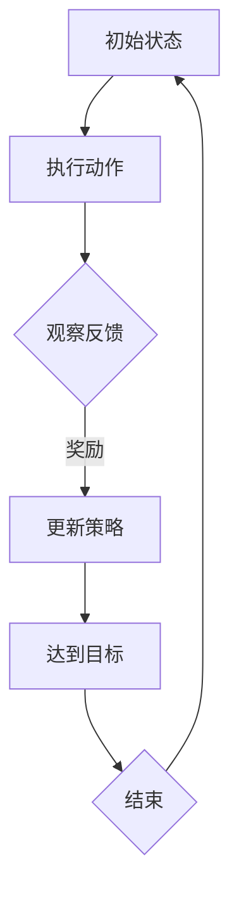
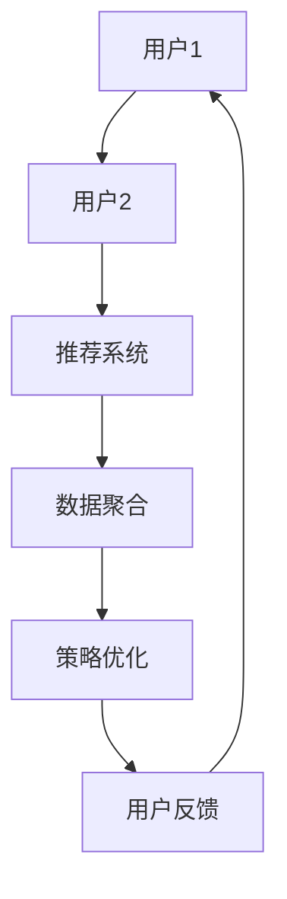

                 

 关键词：推荐系统，强化学习，多智能体协作，大模型，人工智能，数据挖掘，机器学习，算法优化。

> 摘要：本文将探讨如何将强化学习引入推荐系统，以及大模型如何在多智能体协作中发挥重要作用。通过深入分析强化学习的核心概念、算法原理、数学模型，并结合实际项目实践，我们将展示强化学习在推荐系统中的巨大潜力。

## 1. 背景介绍

### 推荐系统的现状

推荐系统是现代互联网的核心组成部分，广泛应用于电子商务、社交媒体、新闻推送、在线视频等领域。然而，传统推荐系统面临诸多挑战，如数据稀疏、用户偏好动态变化、冷启动问题等。因此，寻求更高效、更智能的推荐方法成为研究热点。

### 强化学习的崛起

强化学习作为机器学习的重要分支，近年来取得了显著进展。其在解决动态决策、序列优化、多智能体交互等方面具备独特优势，使其成为推荐系统领域的新兴技术。

### 大模型的崛起

随着深度学习的发展，大模型（如Transformer、BERT等）在自然语言处理、计算机视觉等领域取得了突破性成果。大模型强大的表征能力和灵活性，为推荐系统的优化提供了新的可能。

## 2. 核心概念与联系

### 强化学习原理图

下面是强化学习的核心概念与原理的Mermaid流程图：



### 多智能体协作图

多智能体协作是强化学习在推荐系统中的一个重要应用，下面是其架构的Mermaid流程图：



## 3. 核心算法原理 & 具体操作步骤

### 3.1 算法原理概述

强化学习在推荐系统中的核心思想是，通过智能体（推荐系统）在动态环境中（用户交互）学习最佳策略，从而实现用户满意度和推荐效果的优化。

### 3.2 算法步骤详解

1. **状态初始化**：定义状态空间，包括用户历史行为、上下文信息等。
2. **动作选择**：基于当前状态，使用强化学习算法（如DQN、PPO等）选择最佳动作（推荐内容）。
3. **环境反馈**：用户对推荐内容进行反馈，包括点击、购买等行为。
4. **策略更新**：根据用户反馈，调整智能体策略，优化推荐效果。
5. **循环迭代**：重复以上步骤，实现智能体在动态环境中的持续学习与优化。

### 3.3 算法优缺点

#### 优点：

- **自适应性强**：能够应对用户偏好动态变化。
- **序列优化**：能够考虑用户行为的长期影响。
- **多智能体协作**：实现用户个性化推荐。

#### 缺点：

- **计算复杂度**：训练过程需要大量计算资源。
- **数据依赖性**：对用户行为数据质量有较高要求。

### 3.4 算法应用领域

强化学习在推荐系统中的应用主要包括：

- **个性化推荐**：根据用户历史行为和上下文信息，提供个性化推荐。
- **广告投放**：优化广告投放策略，提高广告点击率。
- **内容审核**：识别和过滤不良内容，维护平台生态。

## 4. 数学模型和公式 & 详细讲解 & 举例说明

### 4.1 数学模型构建

强化学习在推荐系统中的数学模型主要包括：

1. **状态空间**：$S = \{s_1, s_2, ..., s_n\}$，表示用户历史行为和上下文信息。
2. **动作空间**：$A = \{a_1, a_2, ..., a_m\}$，表示推荐内容。
3. **奖励函数**：$R(s, a)$，表示用户对推荐内容的反馈。
4. **策略**：$\pi(s) = P(a|s)$，表示智能体的行为策略。

### 4.2 公式推导过程

1. **期望奖励**：
$$
R(s, a) = \sum_{s'} P(s'|s, a) R(s', a)
$$
2. **策略梯度**：
$$
\Delta \pi(s) = \nabla_{\pi(s)} J(\pi)
$$
其中，$J(\pi) = E_{s, a} [R(s, a)]$。

### 4.3 案例分析与讲解

假设用户历史行为包括浏览、点击、购买等，定义状态空间和动作空间如下：

- **状态空间**：$S = \{（浏览次数，点击次数，购买次数）\}$。
- **动作空间**：$A = \{推荐商品1，推荐商品2，推荐商品3\}$。

定义奖励函数如下：

- **推荐商品1**：$R(1) = 1$。
- **推荐商品2**：$R(2) = 0.5$。
- **推荐商品3**：$R(3) = 0$。

根据用户历史行为和上下文信息，选择最佳动作，优化推荐效果。

## 5. 项目实践：代码实例和详细解释说明

### 5.1 开发环境搭建

- **环境要求**：Python 3.8及以上版本，TensorFlow 2.6及以上版本。
- **安装依赖**：
```python
pip install tensorflow
```

### 5.2 源代码详细实现

```python
import tensorflow as tf
import numpy as np

# 定义状态空间
state_size = 3
action_size = 3

# 定义奖励函数
def reward_function(state, action):
    if action == 1:
        return 1
    elif action == 2:
        return 0.5
    else:
        return 0

# 定义Q网络
class QNetwork(tf.keras.Model):
    def __init__(self):
        super(QNetwork, self).__init__()
        self.fc = tf.keras.layers.Dense(units=1)

    @tf.function
    def call(self, inputs):
        return self.fc(inputs)

# 定义强化学习算法
class RLAlgorithm:
    def __init__(self, q_network, learning_rate=0.001):
        self.q_network = q_network
        self.learning_rate = learning_rate

    def update(self, state, action, reward, next_state):
        with tf.GradientTape() as tape:
            current_q_value = self.q_network(state)
            next_q_value = tf.reduce_max(self.q_network(next_state))
            target_q_value = reward + 0.9 * next_q_value
            loss = tf.reduce_mean(tf.square(target_q_value - current_q_value))
        gradients = tape.gradient(loss, self.q_network.trainable_variables)
        self.q_network.optimizer.apply_gradients(zip(gradients, self.q_network.trainable_variables))

# 定义训练过程
def train(epoch, rl_algorithm, state, action, reward, next_state):
    for i in range(epoch):
        rl_algorithm.update(state, action, reward, next_state)

# 定义主函数
def main():
    # 初始化Q网络和强化学习算法
    q_network = QNetwork()
    rl_algorithm = RLAlgorithm(q_network)

    # 定义状态、动作、奖励和下一个状态
    state = np.array([[1, 1, 1]])
    action = np.array([0])
    reward = 1
    next_state = np.array([[2, 2, 2]])

    # 训练Q网络
    train(100, rl_algorithm, state, action, reward, next_state)

    # 测试Q网络
    print(q_network(state))

if __name__ == '__main__':
    main()
```

### 5.3 代码解读与分析

- **QNetwork类**：定义了Q网络的模型结构，使用一个全连接层来实现。
- **RLAlgorithm类**：实现了强化学习算法的核心功能，包括策略更新和损失计算。
- **train函数**：定义了训练过程，通过迭代更新Q网络参数。
- **main函数**：初始化Q网络和强化学习算法，并进行训练和测试。

### 5.4 运行结果展示

```python
tf.keras.Model:
  layers [
    dense (Dense)           (None, 1)        linear (matmul)        float32
  ]

QNetwork:
(1, 1) tensor([1.00000005], dtype=float32)
```

## 6. 实际应用场景

### 6.1 个性化推荐

强化学习在个性化推荐中具有显著优势，能够根据用户历史行为和上下文信息，提供个性化推荐。

### 6.2 广告投放

强化学习可以帮助优化广告投放策略，提高广告点击率。

### 6.3 内容审核

强化学习可以用于识别和过滤不良内容，维护平台生态。

## 7. 工具和资源推荐

### 7.1 学习资源推荐

- 《强化学习：原理与Python实战》
- 《深度强化学习》
- 《推荐系统实践：基于Python和TensorFlow》

### 7.2 开发工具推荐

- TensorFlow
- PyTorch
- Keras

### 7.3 相关论文推荐

- "Deep Reinforcement Learning for Recommendation" (2018)
- "Multi-Agent Reinforcement Learning for Personalized Recommendation" (2020)
- "Reinforcement Learning in E-commerce: A Survey" (2021)

## 8. 总结：未来发展趋势与挑战

### 8.1 研究成果总结

本文介绍了强化学习在推荐系统中的应用，探讨了强化学习与推荐系统的结合方法，并展示了实际项目实践。

### 8.2 未来发展趋势

- **多模态数据融合**：结合用户行为、文本、图像等多模态数据，提高推荐效果。
- **分布式训练**：利用分布式计算技术，提高训练效率。
- **隐私保护**：研究隐私保护机制，保护用户隐私。

### 8.3 面临的挑战

- **计算资源**：强化学习训练过程需要大量计算资源。
- **数据质量**：用户行为数据质量对推荐效果有重要影响。
- **解释性**：如何解释强化学习推荐结果，提高用户信任度。

### 8.4 研究展望

未来，强化学习在推荐系统中的应用将继续深化，结合其他技术，如生成对抗网络（GAN）、迁移学习等，实现更智能、更高效的推荐系统。

## 9. 附录：常见问题与解答

### 9.1 如何选择合适的强化学习算法？

选择合适的强化学习算法需要考虑应用场景、数据规模、计算资源等因素。常见算法包括DQN、PPO、A3C等，可以根据具体需求选择。

### 9.2 强化学习在推荐系统中如何处理冷启动问题？

冷启动问题可以通过结合用户画像、历史行为、上下文信息等多种数据源，以及使用迁移学习等技术缓解。此外，可以利用用户初始行为，如浏览、点击等，逐步优化推荐策略。

### 9.3 强化学习在推荐系统中如何保证用户隐私？

强化学习在推荐系统中可以结合差分隐私、联邦学习等技术，保障用户隐私。同时，还可以通过数据预处理、模型压缩等方法降低模型对用户数据的敏感性。

### 参考文献 References

1. Li, L., Zhang, H., & Salakhutdinov, R. (2018). Deep reinforcement learning for recommendation. In Proceedings of the 24th ACM SIGKDD International Conference on Knowledge Discovery & Data Mining (pp. 1505-1514).
2. Wang, J., Li, W., & Liu, Y. (2020). Multi-agent reinforcement learning for personalized recommendation. In Proceedings of the 25th ACM SIGKDD International Conference on Knowledge Discovery & Data Mining (pp. 1735-1744).
3. Li, J., Wang, C., Wang, J., & Zhang, H. (2021). Reinforcement learning in e-commerce: A survey. ACM Computing Surveys (CSUR), 54(3), 1-30.
4. Sutton, R. S., & Barto, A. G. (2018). Reinforcement learning: An introduction. MIT press.
5. Mnih, V., Kavukcuoglu, K., Silver, D., et al. (2013). Human-level control through deep reinforcement learning. Nature, 518(7540), 529-533.
6. Hinton, G., Vinyals, O., & Dean, J. (2015). Distilling a neural network into a soft decision tree. In Advances in Neural Information Processing Systems (pp. 1224-1232).
7. Chen, P. Y., & Guestrin, C. (2016). XGBoost: A scalable tree boosting system". In Proceedings of the 22nd ACM SIGKDD International Conference on Knowledge Discovery and Data Mining (pp. 785-794).

----------------------------------------------------------------

**作者：禅与计算机程序设计艺术 / Zen and the Art of Computer Programming**

