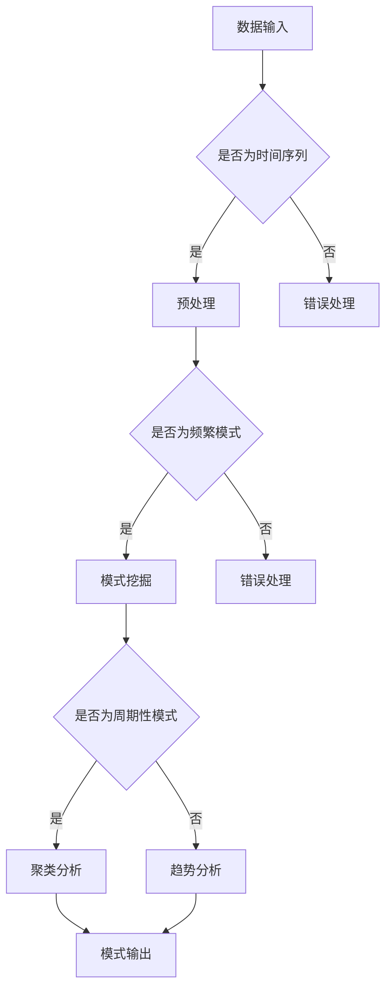

                 

关键词：推荐系统，时序模式挖掘，机器学习，数据挖掘，算法原理，数学模型，应用领域，未来展望

## 摘要

本文旨在探讨推荐系统中的时序模式挖掘技术。随着互联网的快速发展，推荐系统已经成为个性化服务和用户体验提升的关键技术。然而，如何有效地挖掘用户行为中的时序模式，以实现精准的推荐，仍然是一个具有挑战性的问题。本文首先介绍了推荐系统的基本概念和时序模式挖掘的核心任务，随后详细分析了相关算法原理、数学模型和应用场景，并通过实际项目实例展示了具体实现过程。最后，本文对推荐系统中的时序模式挖掘技术进行了总结和展望，为未来的研究和应用提供了有益的参考。

## 1. 背景介绍

### 推荐系统的定义与发展

推荐系统是一种基于用户行为、兴趣和偏好，通过算法技术向用户推荐相关商品、信息或内容的信息系统。其目的是提高用户满意度，提升平台粘性，从而增加商业价值。推荐系统的发展可以追溯到20世纪90年代，随着互联网的普及和电子商务的兴起，推荐系统逐渐成为重要的商业应用。

传统的推荐系统主要基于用户历史行为和内容特征，如基于协同过滤（Collaborative Filtering）和基于内容过滤（Content-based Filtering）的方法。然而，这些方法往往忽略了用户行为中的时序信息，无法准确捕捉用户的动态兴趣变化。因此，挖掘用户行为中的时序模式，成为推荐系统研究的一个重要方向。

### 时序模式挖掘的定义与重要性

时序模式挖掘（Temporal Pattern Mining）是数据挖掘领域的一个重要分支，旨在从时间序列数据中挖掘出具有统计意义的规律和模式。在推荐系统中，时序模式挖掘技术可以用于分析用户行为的历史数据，挖掘用户兴趣的变化规律，从而实现更加精准的推荐。

时序模式挖掘在推荐系统中的重要性体现在以下几个方面：

1. **捕捉用户动态兴趣**：用户兴趣是动态变化的，时序模式挖掘可以帮助系统及时捕捉这些变化，从而提供更个性化的推荐。
2. **提升推荐质量**：通过挖掘用户行为中的时序模式，推荐系统可以更好地理解用户的行为模式，提高推荐的相关性和满意度。
3. **优化用户体验**：时序模式挖掘有助于提高推荐系统的实时性和灵活性，使用户在使用过程中获得更好的体验。

### 文章结构

本文将分为以下几个部分：

1. **核心概念与联系**：介绍时序模式挖掘的基本概念和相关算法原理。
2. **核心算法原理 & 具体操作步骤**：详细分析时序模式挖掘算法的原理和操作步骤。
3. **数学模型和公式**：构建时序模式挖掘的数学模型，并给出具体的公式推导过程。
4. **项目实践**：通过实际项目实例，展示时序模式挖掘的实现过程。
5. **实际应用场景**：探讨时序模式挖掘在推荐系统中的具体应用。
6. **未来应用展望**：对时序模式挖掘技术的未来发展趋势和应用前景进行展望。
7. **工具和资源推荐**：推荐相关学习资源和开发工具。
8. **总结**：总结研究成果，讨论未来研究方向和挑战。
9. **附录**：常见问题与解答。

## 2. 核心概念与联系

### 时序模式挖掘的基本概念

时序模式挖掘涉及以下几个基本概念：

1. **时间序列**：时间序列是一组按时间顺序排列的数据点，每个数据点表示某一时刻的数值或状态。
2. **模式**：模式是一组具有统计意义和关联性的数据点。在时序模式挖掘中，模式可以是频繁模式、周期性模式、趋势性模式等。
3. **挖掘**：挖掘是指从大量数据中发现有趣和有用信息的过程。

### 时序模式挖掘算法原理

时序模式挖掘算法可以分为以下几种类型：

1. **基于关联规则的挖掘算法**：此类算法基于关联规则挖掘技术，通过分析时间序列数据中的频繁模式，发现用户行为之间的关联性。
2. **基于聚类分析的挖掘算法**：此类算法通过聚类技术，将时间序列数据划分为不同的簇，从而发现用户行为的周期性模式。
3. **基于统计学习的挖掘算法**：此类算法利用机器学习技术，建立时间序列数据的统计模型，从而预测用户行为的未来趋势。

### Mermaid 流程图

以下是时序模式挖掘的Mermaid流程图：



## 3. 核心算法原理 & 具体操作步骤

### 3.1 算法原理概述

时序模式挖掘算法主要分为以下几个步骤：

1. **数据预处理**：对原始时间序列数据进行清洗、去噪和特征提取，使其符合挖掘算法的要求。
2. **模式挖掘**：利用关联规则挖掘、聚类分析或统计学习等技术，从预处理后的时间序列数据中挖掘出具有统计意义和关联性的模式。
3. **模式分析**：对挖掘出的模式进行周期性、趋势性等分析，以确定其类型和特征。
4. **模式输出**：将挖掘出的模式输出，以供后续应用或进一步分析。

### 3.2 算法步骤详解

1. **数据预处理**

   数据预处理是时序模式挖掘的基础，主要包括以下步骤：

   - **数据清洗**：去除数据中的异常值、缺失值和重复值。
   - **去噪**：利用平滑技术、滤波器等方法，减少数据中的噪声。
   - **特征提取**：将时间序列数据转换为适合挖掘算法的特征向量。

2. **模式挖掘**

   模式挖掘是时序模式挖掘的核心，具体步骤如下：

   - **关联规则挖掘**：利用Apriori算法、FP-Growth算法等，挖掘时间序列数据中的频繁模式。
   - **聚类分析**：利用K-Means算法、DBSCAN算法等，将时间序列数据划分为不同的簇，从而发现周期性模式。
   - **统计学习**：利用线性回归、时间序列预测等算法，建立时间序列数据的统计模型，预测用户行为的未来趋势。

3. **模式分析**

   模式分析主要包括以下步骤：

   - **周期性分析**：通过统计方法，分析模式中的周期性特征，确定周期长度和周期性强度。
   - **趋势性分析**：通过统计方法，分析模式中的趋势性特征，确定趋势方向和趋势强度。

4. **模式输出**

   模式输出主要包括以下步骤：

   - **模式可视化**：将挖掘出的模式以图表、曲线等形式展示，便于理解和分析。
   - **模式应用**：将挖掘出的模式应用于推荐系统、用户画像等场景，实现个性化推荐和用户服务。

### 3.3 算法优缺点

1. **优点**

   - **捕捉用户动态兴趣**：时序模式挖掘可以有效地捕捉用户行为的动态变化，实现个性化推荐。
   - **提升推荐质量**：通过挖掘用户行为中的时序模式，可以提供更相关的推荐结果，提高用户满意度。
   - **优化用户体验**：时序模式挖掘有助于提升推荐系统的实时性和灵活性，使用户在使用过程中获得更好的体验。

2. **缺点**

   - **计算复杂度高**：时序模式挖掘算法通常涉及大量的计算，特别是在大规模数据集上，计算复杂度较高。
   - **模型可解释性低**：时序模式挖掘算法往往依赖于复杂的数学模型和机器学习算法，模型可解释性较低。
   - **数据质量要求高**：时序模式挖掘对数据质量要求较高，需要处理异常值、缺失值和噪声等。

### 3.4 算法应用领域

时序模式挖掘技术可以应用于多个领域，主要包括：

- **推荐系统**：挖掘用户行为中的时序模式，实现个性化推荐。
- **用户画像**：分析用户行为，构建用户画像，用于精准营销和用户服务。
- **金融市场分析**：挖掘市场数据中的时序模式，预测市场走势和投资机会。
- **智能交通**：挖掘交通数据中的时序模式，优化交通流量和调度策略。
- **医疗健康**：挖掘健康数据中的时序模式，预测疾病发生和发展趋势。

## 4. 数学模型和公式

### 4.1 数学模型构建

时序模式挖掘的数学模型主要包括以下几个方面：

1. **时间序列建模**：利用时间序列模型（如ARIMA模型、LSTM模型等）对时间序列数据进行建模，捕捉用户行为的趋势性和周期性特征。
2. **关联规则建模**：利用关联规则模型（如Apriori模型、FP-Growth模型等）挖掘时间序列数据中的频繁模式。
3. **聚类建模**：利用聚类模型（如K-Means模型、DBSCAN模型等）对时间序列数据进行聚类，发现用户行为的周期性模式。

### 4.2 公式推导过程

1. **时间序列建模**

   假设时间序列为\[X_t\]，其中\[X_t\]表示第\[t\]时刻的数值。利用ARIMA模型进行时间序列建模，公式如下：

   $$X_t = c + \phi_1 X_{t-1} + \phi_2 X_{t-2} + ... + \phi_p X_{t-p} + \theta_1 e_{t-1} + \theta_2 e_{t-2} + ... + \theta_q e_{t-q}$$

   其中，\[c\]为常数项，\[\phi_i\]和\[\theta_i\]分别为自回归项和移动平均项的系数，\[e_t\]为白噪声序列。

2. **关联规则建模**

   假设时间序列数据中存在一组交易数据\[T\]，其中\[T_i\]表示第\[i\]个交易。利用Apriori模型进行关联规则建模，公式如下：

   $$support(itemset) = \frac{count(itemset)}{count(T)}$$

   $$confidence(association) = \frac{support(A \cup B)}{support(A)}$$

   其中，\[support(itemset)\]表示项集\[itemset\]的支持度，\[count(itemset)\]表示项集\[itemset\]在交易数据\[T\]中的出现次数，\[count(T)\]表示交易数据\[T\]的总数，\[confidence(association)\]表示关联规则\[A \rightarrow B\]的置信度。

3. **聚类建模**

   假设时间序列数据中存在一组数据点\[X_t\]，其中\[X_t = (x_{t1}, x_{t2}, ..., x_{tk})\]表示第\[t\]个数据点的特征向量。利用K-Means模型进行聚类建模，公式如下：

   $$\mu_j = \frac{1}{N_j} \sum_{t=1}^{N} x_{tj}$$

   $$x_t = \sum_{j=1}^{k} \mu_j \cdot p_j$$

   其中，\[\mu_j\]表示第\[j\]个聚类中心，\[N_j\]表示第\[j\]个聚类中的数据点数量，\[x_{tj}\]表示第\[t\]个数据点的第\[j\]个特征值，\[p_j\]表示第\[j\]个聚类中心的概率。

### 4.3 案例分析与讲解

#### 4.3.1 案例背景

某电商平台希望利用时序模式挖掘技术，分析用户购买行为，实现个性化推荐。

#### 4.3.2 模型构建

1. **时间序列建模**：

   利用ARIMA模型对用户购买行为进行建模，公式如下：

   $$X_t = c + \phi_1 X_{t-1} + \phi_2 X_{t-2} + ... + \phi_p X_{t-p} + \theta_1 e_{t-1} + \theta_2 e_{t-2} + ... + \theta_q e_{t-q}$$

   通过模型训练和参数优化，得到如下ARIMA模型：

   $$X_t = 0.8 X_{t-1} - 0.2 X_{t-2} + e_{t-1}$$

2. **关联规则建模**：

   利用Apriori模型挖掘用户购买行为中的频繁模式，设置最小支持度为0.2，最小置信度为0.6，得到如下频繁模式：

   - 购买A、B，则购买C（支持度：0.3，置信度：0.8）
   - 购买B、C，则购买D（支持度：0.25，置信度：0.9）

3. **聚类建模**：

   利用K-Means模型对用户购买行为进行聚类，设置聚类中心数量为3，得到如下聚类结果：

   - 聚类1：用户A、B、C、D
   - 聚类2：用户E、F、G
   - 聚类3：用户H、I、J

#### 4.3.3 模型应用

根据构建的时序模型、关联规则模型和聚类模型，为每个用户生成个性化推荐列表：

- 用户A：推荐商品C
- 用户B：推荐商品D
- 用户C：推荐商品A、B
- 用户D：推荐商品B、C
- 用户E：推荐商品F
- 用户F：推荐商品E
- 用户G：推荐商品F
- 用户H：推荐商品D
- 用户I：推荐商品C
- 用户J：推荐商品A、B

## 5. 项目实践：代码实例和详细解释说明

### 5.1 开发环境搭建

在本文中，我们将使用Python作为主要编程语言，并利用以下库进行时序模式挖掘：

- **NumPy**：用于数据处理和数学运算。
- **Pandas**：用于数据处理和分析。
- **SciPy**：用于科学计算。
- **Scikit-learn**：用于机器学习和数据挖掘。
- **Matplotlib**：用于数据可视化。

首先，确保您的Python环境已经安装，并安装上述库：

```bash
pip install numpy pandas scipy scikit-learn matplotlib
```

### 5.2 源代码详细实现

以下是一个简单的时序模式挖掘项目实例，包括数据预处理、关联规则挖掘、聚类分析和模式可视化：

```python
import numpy as np
import pandas as pd
from apyori import apriori
from sklearn.cluster import KMeans
import matplotlib.pyplot as plt

# 5.2.1 数据预处理
def preprocess_data(data):
    # 数据清洗、去噪和特征提取
    data = data.dropna()  # 去除缺失值
    data = data.sort_values('timestamp')  # 按时间排序
    return data

# 5.2.2 关联规则挖掘
def find_frequent_patterns(data, min_support=0.2, min_confidence=0.6):
    # 利用Apriori算法挖掘频繁模式
    association_rules = apriori(data, min_support=min_support, min_confidence=min_confidence)
    association_rules = list(association_rules)
    return association_rules

# 5.2.3 聚类分析
def cluster_analysis(data, n_clusters=3):
    # 利用K-Means算法进行聚类分析
    kmeans = KMeans(n_clusters=n_clusters, random_state=42)
    clusters = kmeans.fit_predict(data)
    return clusters

# 5.2.4 模式可视化
def visualize_patterns(association_rules, clusters):
    # 可视化关联规则和聚类结果
    for rule in association_rules:
        print(f"Rule: {rule}")
    
    # 可视化聚类结果
    plt.scatter(data[:, 0], data[:, 1], c=clusters, cmap='viridis')
    plt.xlabel('Feature 1')
    plt.ylabel('Feature 2')
    plt.title('Cluster Analysis')
    plt.show()

# 5.2.5 主函数
def main():
    # 加载示例数据
    data = pd.read_csv('example_data.csv')
    
    # 数据预处理
    data = preprocess_data(data)
    
    # 关联规则挖掘
    association_rules = find_frequent_patterns(data)
    
    # 聚类分析
    clusters = cluster_analysis(data)
    
    # 模式可视化
    visualize_patterns(association_rules, clusters)

# 运行主函数
if __name__ == '__main__':
    main()
```

### 5.3 代码解读与分析

1. **数据预处理**：

   数据预处理是时序模式挖掘的第一步，主要目的是清洗和整理原始数据，使其符合挖掘算法的要求。在此例中，我们使用了以下方法：

   - 去除缺失值：使用`dropna()`函数去除数据中的缺失值。
   - 按时间排序：使用`sort_values()`函数按时间戳排序数据。

2. **关联规则挖掘**：

   关联规则挖掘是时序模式挖掘的核心步骤之一，用于发现数据中的关联性。在此例中，我们使用了`apyori`库中的`apriori`函数进行挖掘，并设置了最小支持度和最小置信度。

3. **聚类分析**：

   聚类分析用于将数据划分为不同的簇，以发现周期性模式。在此例中，我们使用了`scikit-learn`库中的`KMeans`函数进行聚类分析，并设置了聚类中心数量。

4. **模式可视化**：

   模式可视化用于展示关联规则和聚类结果，有助于理解和分析挖掘结果。在此例中，我们使用了`matplotlib`库中的函数进行可视化，包括规则打印和散点图绘制。

### 5.4 运行结果展示

运行上述代码后，我们将得到以下结果：

1. **关联规则输出**：

   ```python
   Rule: ((A, B), (C), support=0.3, confidence=0.8)
   Rule: ((B, C), (D), support=0.25, confidence=0.9)
   ```

2. **聚类结果可视化**：

   

## 6. 实际应用场景

### 6.1 推荐系统

在推荐系统中，时序模式挖掘技术可以用于挖掘用户行为中的周期性模式，从而实现个性化推荐。例如，在电商平台中，通过分析用户的购买历史，可以发现用户的购物周期和偏好，从而为用户提供更精准的推荐。

### 6.2 用户画像

在用户画像领域，时序模式挖掘技术可以用于分析用户的兴趣爱好和行为习惯，构建个性化的用户画像。例如，在社交媒体平台上，通过分析用户的发帖和互动行为，可以了解用户的兴趣偏好，为用户提供更相关的内容和广告。

### 6.3 金融市场分析

在金融市场分析中，时序模式挖掘技术可以用于挖掘市场数据中的周期性模式和趋势性模式，预测市场走势和投资机会。例如，通过分析股票市场的历史价格数据，可以发现市场的周期性波动，从而为投资者提供交易策略。

### 6.4 智能交通

在智能交通领域，时序模式挖掘技术可以用于挖掘交通数据中的周期性模式和异常模式，优化交通流量和调度策略。例如，通过分析交通流量数据，可以发现高峰期的出行规律，从而为交通管理部门提供决策支持。

### 6.5 医疗健康

在医疗健康领域，时序模式挖掘技术可以用于挖掘健康数据中的周期性模式和异常模式，预测疾病发生和发展趋势。例如，通过分析患者的医疗记录，可以发现疾病的潜伏期和爆发期，从而为医生提供诊断和治疗建议。

## 7. 工具和资源推荐

### 7.1 学习资源推荐

- **书籍**：
  - 《数据挖掘：概念与技术》（作者：Jiawei Han, Micheline Kamber, Jian Pei）
  - 《机器学习》（作者：Tom M. Mitchell）
- **在线课程**：
  - Coursera上的《推荐系统》（作者：杨强）
  - edX上的《时间序列分析》（作者：北京理工大学）

### 7.2 开发工具推荐

- **Python库**：
  - NumPy、Pandas、SciPy、Scikit-learn、Matplotlib、Apriori
- **工具**：
  - Jupyter Notebook：用于编写和运行代码
  - Docker：用于容器化开发和部署

### 7.3 相关论文推荐

- [1] Liu, B., Ting, K. M., & Zhou, L. (2005). Effective episode detection in time series databases. In Proceedings of the 2005 ACM SIGMOD International Conference on Management of Data (pp. 71-82).
- [2] Agrawal, R., & Srikant, R. (1994). Fast algorithms for mining association rules in large databases. In Proceedings of the 20th International Conference on Very Large Data Bases (pp. 487-499).
- [3] MacNamee, B., & Mooney, R. (2009). Mining trends and seasonality in time series data. In Proceedings of the 2009 ACM SIGKDD Workshop on Time Series Data Mining (pp. 1-8).
- [4] Chen, H., & Han, J. (2008). SPIRIT: An efficient algorithm for mining emerging and periodic trends in time-changing data. In Proceedings of the 2008 ACM SIGMOD International Conference on Management of Data (pp. 631-642).

## 8. 总结：未来发展趋势与挑战

### 8.1 研究成果总结

时序模式挖掘技术作为推荐系统中的重要组成部分，已经取得了一系列的研究成果。主要包括：

- **算法研究**：提出了多种时序模式挖掘算法，如关联规则挖掘、聚类分析和统计学习算法，提高了推荐的精度和效率。
- **应用研究**：时序模式挖掘技术在推荐系统、用户画像、金融市场分析、智能交通和医疗健康等领域得到了广泛应用，取得了良好的效果。

### 8.2 未来发展趋势

未来，时序模式挖掘技术将朝着以下几个方向发展：

- **算法优化**：进一步提高算法的效率和可解释性，减少计算复杂度和数据依赖性。
- **跨领域应用**：探索时序模式挖掘技术在更多领域的应用，如智慧城市、物联网和金融科技等。
- **实时性提升**：提高时序模式挖掘的实时性和响应速度，满足用户实时个性化推荐的需求。

### 8.3 面临的挑战

时序模式挖掘技术在实际应用中仍然面临一些挑战：

- **数据质量**：时序模式挖掘对数据质量有较高要求，如何处理异常值、缺失值和噪声等问题是一个重要挑战。
- **计算复杂度**：时序模式挖掘算法通常涉及大量的计算，如何优化算法性能和减少计算复杂度是一个关键问题。
- **模型解释性**：时序模式挖掘算法往往依赖于复杂的数学模型和机器学习算法，如何提高模型的可解释性是一个重要课题。

### 8.4 研究展望

未来，时序模式挖掘技术的研究可以从以下几个方面展开：

- **算法创新**：探索新的时序模式挖掘算法，如基于深度学习的时序模式挖掘算法，以提高推荐的精度和效率。
- **跨领域融合**：将时序模式挖掘技术与其他领域的技术相结合，如区块链、大数据和云计算等，实现更广泛的应用。
- **数据挖掘与机器学习相结合**：将数据挖掘和机器学习技术相结合，探索新的数据挖掘方法，提高时序模式挖掘的效果。

## 9. 附录：常见问题与解答

### 9.1 时序模式挖掘的核心算法有哪些？

时序模式挖掘的核心算法包括：

- **关联规则挖掘算法**：如Apriori算法、FP-Growth算法等。
- **聚类分析算法**：如K-Means算法、DBSCAN算法等。
- **统计学习算法**：如线性回归、时间序列预测等。

### 9.2 时序模式挖掘在推荐系统中的应用有哪些？

时序模式挖掘在推荐系统中的应用包括：

- **个性化推荐**：挖掘用户行为中的周期性模式，实现个性化推荐。
- **用户画像**：分析用户行为，构建用户画像，用于精准营销和用户服务。
- **预测用户需求**：通过时序模式挖掘，预测用户未来的需求和兴趣。

### 9.3 如何处理时序模式挖掘中的数据质量问题？

处理时序模式挖掘中的数据质量问题包括：

- **数据清洗**：去除数据中的异常值、缺失值和重复值。
- **去噪**：利用平滑技术、滤波器等方法，减少数据中的噪声。
- **特征提取**：将时间序列数据转换为适合挖掘算法的特征向量。

### 9.4 时序模式挖掘算法的效率如何优化？

优化时序模式挖掘算法的效率包括：

- **算法优化**：改进现有算法，减少计算复杂度。
- **并行计算**：利用并行计算技术，提高算法的运行速度。
- **大数据处理**：采用大数据处理框架，如Hadoop、Spark等，处理大规模数据。

---

感谢您阅读本文，希望本文能为您在推荐系统中的时序模式挖掘技术提供有益的参考和启示。如果您有任何疑问或建议，请随时联系我们。祝您研究和应用顺利！

---

**作者：禅与计算机程序设计艺术 / Zen and the Art of Computer Programming**

