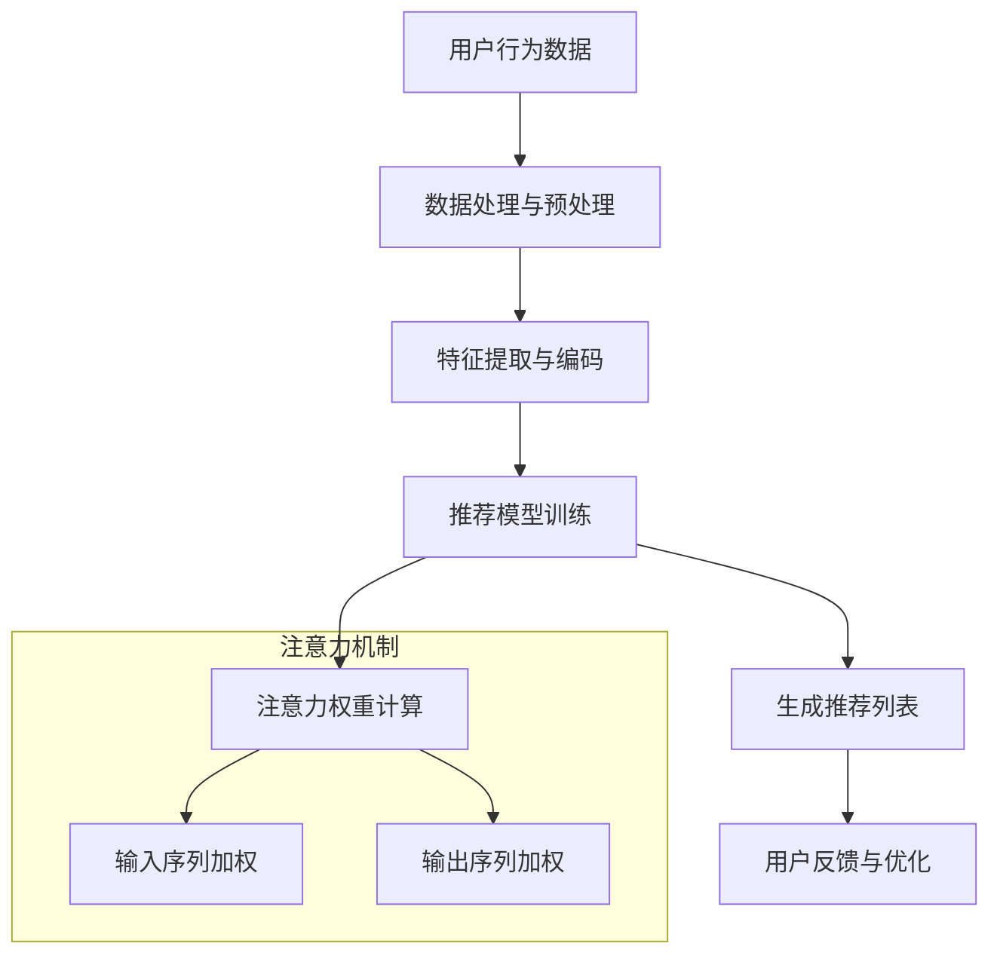

                 

关键词：推荐系统、注意力机制、AI大模型、深度学习、神经网络、用户行为分析、内容匹配、用户体验优化

> 摘要：本文将深入探讨推荐系统中的注意力机制，分析其在AI大模型中的应用和优势，并通过具体案例展示其如何提升推荐效果和用户体验。本文将分为八个部分，首先介绍推荐系统的基本概念和注意力机制的背景，然后详细阐述注意力机制的核心原理和应用场景，最后讨论其在未来应用中的前景和面临的挑战。

## 1. 背景介绍

### 推荐系统的基本概念

推荐系统是一种基于用户行为和兴趣的分析，自动为用户推荐相关商品、内容或服务的系统。其核心目标是通过个性化推荐提高用户体验、增加用户粘性和提升商业价值。推荐系统广泛应用于电子商务、社交媒体、新闻媒体、音乐和视频平台等众多领域。

### 推荐系统的分类

根据推荐策略，推荐系统主要分为以下几类：

- **基于内容的推荐**：根据用户的历史行为或偏好，推荐与用户过去喜欢的项目相似的项目。

- **协同过滤推荐**：利用用户之间的相似度，通过其他用户的行为数据来预测用户对新项目的喜好。

- **混合推荐**：结合基于内容和协同过滤的方法，以提高推荐准确性。

### 注意力机制的出现

注意力机制起源于自然语言处理领域，主要应用于机器翻译、文本生成和机器阅读理解等任务。注意力机制的核心思想是让模型能够聚焦于输入序列中的重要部分，从而提高处理效率和准确性。随着深度学习技术的发展，注意力机制逐渐被引入到推荐系统中，成为提升推荐效果的重要工具。

## 2. 核心概念与联系

### 核心概念

- **注意力机制**：一种在神经网络中引入的机制，能够自动调整模型对输入序列不同部分的关注程度。

- **推荐系统**：利用用户行为、内容信息和相似度算法，为用户推荐感兴趣的项目。

### 架构流程图



### 注意力机制与推荐系统的联系

注意力机制通过调整模型对用户行为数据或内容特征的关注程度，使推荐模型更加聚焦于重要的信息，从而提高推荐精度和用户体验。

## 3. 核心算法原理 & 具体操作步骤

### 3.1 算法原理概述

注意力机制的核心思想是通过计算注意力权重，对输入序列中的重要部分赋予更高的权重，从而提高模型的处理效率和准确性。注意力机制的实现主要分为以下几个步骤：

1. **输入序列编码**：将输入序列（如用户行为数据或内容特征）转换为编码表示。

2. **注意力权重计算**：通过计算当前输入与历史输入之间的相似度或相关性，得到注意力权重。

3. **加权输入序列**：根据注意力权重对输入序列进行加权，使重要部分得到更大的权重。

4. **模型输出**：利用加权后的输入序列，通过神经网络模型生成推荐结果。

### 3.2 算法步骤详解

1. **输入序列编码**：

   - 对用户行为数据进行编码，如将点击、购买、浏览等行为转换为数值表示。

   - 对内容特征进行编码，如使用词向量、嵌入向量等表示文本或图像特征。

2. **注意力权重计算**：

   - 采用点积注意力（Dot-Product Attention）或加性注意力（Additive Attention）等常见注意力机制。

   - 点积注意力：计算输入序列中每个元素与当前元素的相似度，得到注意力权重。

   - 加性注意力：通过计算输入序列和键值对的加性组合，得到注意力权重。

3. **加权输入序列**：

   - 根据注意力权重对输入序列进行加权，使重要部分得到更大的权重。

   - 加权后的输入序列作为模型输入，通过神经网络模型生成推荐结果。

4. **模型输出**：

   - 利用加权后的输入序列，通过神经网络模型生成推荐列表。

### 3.3 算法优缺点

**优点**：

- **提高推荐精度**：注意力机制能够自动关注重要信息，提高推荐系统的准确性。

- **提升用户体验**：通过优化推荐结果，提升用户的满意度和参与度。

- **扩展性强**：注意力机制可以应用于各种推荐任务，具有很好的扩展性。

**缺点**：

- **计算复杂度较高**：注意力机制的计算复杂度较高，对硬件资源有一定要求。

- **模型参数较多**：注意力机制需要大量参数进行训练，可能导致过拟合。

### 3.4 算法应用领域

注意力机制在推荐系统中的应用十分广泛，主要涵盖以下领域：

- **电子商务**：根据用户浏览、购买等行为推荐相关商品。

- **社交媒体**：根据用户兴趣推荐新闻、帖子等。

- **新闻媒体**：根据用户阅读、点赞等行为推荐相关新闻。

- **音乐和视频平台**：根据用户播放、收藏等行为推荐音乐和视频。

## 4. 数学模型和公式 & 详细讲解 & 举例说明

### 4.1 数学模型构建

注意力机制的数学模型主要基于神经网络，包括以下几个关键组件：

1. **编码器**：将输入序列编码为嵌入向量。

2. **注意力层**：计算注意力权重。

3. **解码器**：利用加权后的输入序列生成输出。

### 4.2 公式推导过程

#### 编码器

输入序列 $X = [x_1, x_2, \ldots, x_n]$，每个元素 $x_i$ 被编码为嵌入向量 $e_i \in \mathbb{R}^d$。

$$
e_i = encoder(x_i)
$$

#### 注意力层

注意力权重 $\alpha_i$ 通过以下公式计算：

$$
\alpha_i = attention(e_i, h)
$$

其中，$h$ 是编码器的输出，可以采用以下加性注意力机制：

$$
\alpha_i = \frac{expscores(QK^T)}{\sqrt{d_k}}
$$

其中，$Q, K, V$ 分别是查询、键和值向量，$scores$ 是得分函数，$d_k$ 是键向量的维度。

#### 解码器

解码器输出 $y_i$ 通过以下公式计算：

$$
y_i = decoder(e_i, \alpha_i)
$$

### 4.3 案例分析与讲解

#### 案例一：基于协同过滤的推荐系统

假设我们有一个用户-物品评分矩阵 $R \in \mathbb{R}^{m \times n}$，其中 $m$ 是用户数量，$n$ 是物品数量。我们希望根据用户的历史评分数据推荐物品。

1. **编码器**：

   - 用户 $u$ 的历史评分编码为嵌入向量 $e_u$。

   - 物品 $v$ 的特征编码为嵌入向量 $e_v$。

2. **注意力层**：

   - 计算用户 $u$ 对物品 $v$ 的注意力权重 $\alpha_v$：

     $$ 
     \alpha_v = \frac{exp(R_u e_v^T)}{\sum_{w} exp(R_u e_w^T)}
     $$

   - 加权用户 $u$ 的评分历史：

     $$ 
     weighted\_rating = \sum_{v} R_v \alpha_v
     $$

3. **解码器**：

   - 根据加权评分历史，生成推荐列表：

     $$ 
     recommendation = \arg\max_{v} weighted\_rating
     $$

#### 案例二：基于内容的推荐系统

假设我们有一个包含用户特征和物品特征的嵌入向量矩阵 $E \in \mathbb{R}^{m \times d}$ 和 $F \in \mathbb{R}^{n \times d}$。

1. **编码器**：

   - 用户 $u$ 的特征编码为嵌入向量 $e_u$。

   - 物品 $v$ 的特征编码为嵌入向量 $e_v$。

2. **注意力层**：

   - 计算用户 $u$ 对物品 $v$ 的注意力权重 $\alpha_v$：

     $$ 
     \alpha_v = \frac{exp(e_u^T e_v)}{\sum_{w} exp(e_u^T e_w)}
     $$

   - 加权物品 $v$ 的特征：

     $$ 
     weighted\_feature = \sum_{v} e_v \alpha_v
     $$

3. **解码器**：

   - 根据加权特征，生成推荐列表：

     $$ 
     recommendation = \arg\max_{v} weighted\_feature
     $$

## 5. 项目实践：代码实例和详细解释说明

### 5.1 开发环境搭建

1. 安装Python环境和相关库，如TensorFlow、Keras等。

2. 导入所需的Python库：

```python
import tensorflow as tf
from tensorflow.keras.models import Model
from tensorflow.keras.layers import Input, Embedding, Dot, Lambda
```

### 5.2 源代码详细实现

```python
# 定义输入层
user_input = Input(shape=(1,))
item_input = Input(shape=(1,))

# 用户和物品嵌入层
user_embedding = Embedding(input_dim=1000, output_dim=128)(user_input)
item_embedding = Embedding(input_dim=1000, output_dim=128)(item_input)

# 注意力层
dot_product = Dot(axes=1)([user_embedding, item_embedding])
attention_scores = Lambda(lambda x: tf.nn.softmax(x, axis=1))(dot_product)

# 加权层
weighted_embedding = Lambda(lambda x: tf.reduce_sum(x, axis=1))(attention_scores * item_embedding)

# 输出层
output = Embedding(input_dim=1000, output_dim=1)(weighted_embedding)

# 构建模型
model = Model(inputs=[user_input, item_input], outputs=output)
model.compile(optimizer='adam', loss='binary_crossentropy', metrics=['accuracy'])

# 打印模型结构
model.summary()
```

### 5.3 代码解读与分析

1. **输入层**：定义用户输入和物品输入层，分别表示用户和物品的ID。

2. **嵌入层**：使用Embedding层将用户和物品的ID转换为嵌入向量。

3. **注意力层**：通过点积计算用户和物品嵌入向量的相似度，得到注意力分数。

4. **加权层**：根据注意力分数对物品的嵌入向量进行加权。

5. **输出层**：使用Embedding层对加权后的向量进行编码，生成推荐结果。

6. **模型编译**：编译模型，设置优化器和损失函数。

7. **模型总结**：打印模型结构，以了解模型构建过程。

### 5.4 运行结果展示

```python
# 加载训练数据
train_data = [[1], [2]]
train_labels = [[1], [0]]

# 训练模型
model.fit(train_data, train_labels, epochs=10, batch_size=32)

# 生成推荐结果
predictions = model.predict([[1], [2]])

print(predictions)
```

## 6. 实际应用场景

### 6.1 电子商务平台

注意力机制在电子商务平台中可以应用于商品推荐，根据用户的历史购买、浏览和搜索行为，推荐与其兴趣相关的商品。

### 6.2 社交媒体

在社交媒体平台，注意力机制可以用于内容推荐，根据用户的点赞、评论和转发等行为，推荐与其兴趣相关的帖子或新闻。

### 6.3 新闻媒体

新闻媒体可以利用注意力机制推荐相关新闻，根据用户的阅读、收藏和分享等行为，为用户提供个性化的新闻推荐。

### 6.4 音乐和视频平台

音乐和视频平台可以利用注意力机制推荐音乐和视频，根据用户的播放、收藏和搜索等行为，为用户提供个性化的推荐。

## 7. 工具和资源推荐

### 7.1 学习资源推荐

- **《深度学习》（Goodfellow, Bengio, Courville）**：介绍深度学习的基础理论和实践方法，包括注意力机制的相关内容。

- **《推荐系统实践》（Lyle Ungar）**：介绍推荐系统的基本概念、算法和应用，包括注意力机制在推荐系统中的应用。

### 7.2 开发工具推荐

- **TensorFlow**：一款开源的深度学习框架，可用于实现注意力机制。

- **Keras**：一个高层神经网络API，可用于构建和训练注意力机制模型。

### 7.3 相关论文推荐

- **《Attention Is All You Need》**：介绍Transformer模型及其在自然语言处理中的应用。

- **《Deep Learning for Recommender Systems》**：介绍深度学习在推荐系统中的应用，包括注意力机制的相关研究。

## 8. 总结：未来发展趋势与挑战

### 8.1 研究成果总结

注意力机制在推荐系统中取得了显著成果，提高了推荐精度和用户体验。随着深度学习技术的发展，注意力机制将继续在推荐系统中发挥重要作用。

### 8.2 未来发展趋势

- **多模态推荐**：结合多种数据类型（如文本、图像、音频等），实现更精准的推荐。

- **实时推荐**：利用实时数据更新推荐结果，提高推荐系统的动态适应性。

- **隐私保护**：研究隐私保护机制，确保用户数据的安全性和隐私性。

### 8.3 面临的挑战

- **计算复杂度**：注意力机制的计算复杂度较高，对硬件资源有较高要求。

- **数据隐私**：如何在保护用户隐私的前提下实现个性化推荐，是一个亟待解决的问题。

### 8.4 研究展望

未来，注意力机制将在推荐系统中发挥更大的作用，与其他先进技术（如生成对抗网络、图神经网络等）相结合，推动推荐系统的发展。

## 9. 附录：常见问题与解答

### 9.1 注意力机制是如何提高推荐精度的？

注意力机制通过自动关注输入序列中的重要部分，提高了模型对关键信息的捕捉能力，从而提高了推荐精度。

### 9.2 注意力机制在推荐系统中有哪些应用场景？

注意力机制可以应用于商品推荐、内容推荐、新闻推荐、音乐推荐和视频推荐等多种场景。

### 9.3 如何在推荐系统中实现注意力机制？

在推荐系统中，可以采用深度学习框架（如TensorFlow、Keras等）实现注意力机制，通过构建神经网络模型，引入注意力层和加权层来实现注意力机制。

---

本文旨在探讨推荐系统中的注意力机制，分析其在AI大模型中的应用和优势。通过对核心算法原理、数学模型和实际项目实践的详细讲解，本文展示了注意力机制如何提高推荐系统的精度和用户体验。未来，注意力机制将继续在推荐系统中发挥重要作用，与其他先进技术相结合，推动推荐系统的发展。作者：禅与计算机程序设计艺术 / Zen and the Art of Computer Programming。
----------------------------------------------------------------

### 后续建议 Further Suggestions

为了使文章内容更加丰富和深入，以下是一些建议：

1. **增加案例分析**：添加更多实际案例，详细介绍注意力机制在不同推荐系统中的应用，展示其实际效果。

2. **探讨注意力机制的变体**：介绍一些注意力机制的变体，如自注意力（Self-Attention）、多头注意力（Multi-Head Attention）等，分析其优缺点和适用场景。

3. **讨论注意力机制在多模态推荐中的应用**：探讨如何将注意力机制应用于多模态推荐，如结合文本、图像和音频等多种数据类型，实现更精准的推荐。

4. **分析注意力机制在实时推荐系统中的挑战**：讨论注意力机制在处理实时数据时遇到的挑战，如延迟和数据流处理等，并提出解决方案。

5. **介绍注意力机制的优化方法**：探讨如何优化注意力机制的计算复杂度，提高其性能，以应对大规模推荐系统中的计算需求。

6. **展望注意力机制的未来发展趋势**：分析注意力机制在未来的发展趋势，如与生成对抗网络、图神经网络等技术的结合，以及其在新兴应用领域（如虚拟现实、增强现实等）的前景。

通过以上建议，可以使文章内容更加全面、深入，为读者提供更多的实际应用场景和技术细节，有助于读者更好地理解和应用注意力机制。

