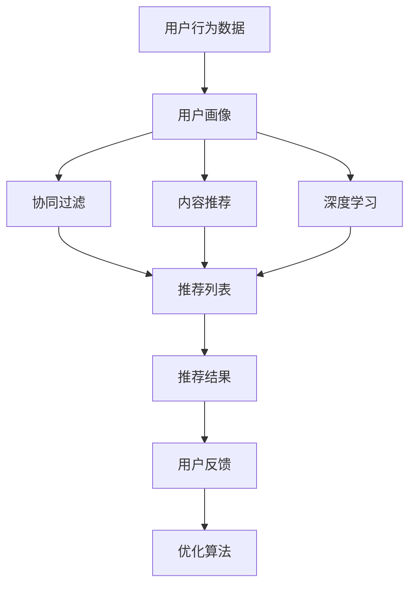
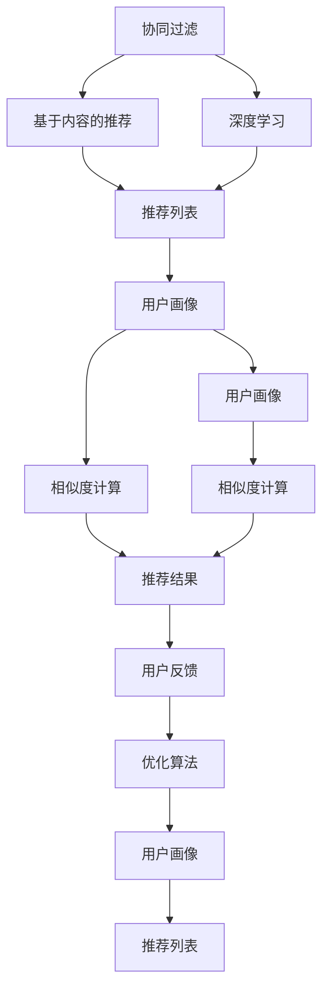

                 

# 推荐系统的公平性：AI大模型的伦理考量

## 1. 背景介绍

随着人工智能技术的迅猛发展，推荐系统已经在电商、新闻、视频等多个领域得到广泛应用。推荐系统通过分析用户的历史行为数据，预测用户可能感兴趣的内容，从而为用户推荐个性化的信息。然而，尽管推荐系统在商业价值上取得了巨大成功，但其潜在的伦理问题也逐渐凸显出来，尤其是在公平性方面。

**1.1 推荐系统的核心机制**

推荐系统的核心机制是通过协同过滤、基于内容的推荐、深度学习等多种方法，从用户的行为数据中挖掘出用户偏好，再将其与其他用户的偏好进行对比和融合，最终生成个性化推荐列表。

推荐系统的工作流程大致如下：
1. **用户行为收集**：通过用户在网站、应用上的点击、浏览、购买等行为数据，记录用户的偏好。
2. **用户画像构建**：利用机器学习算法，从用户行为中提取出特征，构建用户的画像。
3. **相似度计算**：计算用户画像之间的相似度，找出最相似的用户。
4. **推荐生成**：根据相似用户的行为，生成推荐列表。

**1.2 推荐系统的伦理问题**

尽管推荐系统在提升用户体验方面有着重要价值，但其潜在的伦理问题也不容忽视。这些问题主要包括：

- **偏见与歧视**：推荐系统可能基于历史偏见，对某些群体或个体进行不公平的对待。例如，由于某些群体在平台上的历史数据较少，算法可能对他们的推荐效果不佳。
- **隐私泄露**：推荐系统需要大量个人信息，可能存在隐私泄露的风险。
- **信息过载**：过度个性化可能导致信息过载，影响用户的决策能力。
- **算法透明性**：推荐系统的决策过程往往是黑箱，用户难以理解其背后的逻辑。

这些问题已经引起了广泛的社会关注，尤其是在近年来，多起针对推荐系统的伦理争议事件曝光后，如何保证推荐系统的公平性成为了亟待解决的问题。

## 2. 核心概念与联系

### 2.1 核心概念概述

在讨论推荐系统的公平性问题时，需要明确以下几个核心概念：

- **公平性(Fairness)**：指在推荐系统中，每个用户或群体都能获得相对公平的推荐效果，不因性别、种族、年龄等特征而受到不公正的对待。
- **偏见(Bias)**：指在推荐系统中，某些群体的推荐效果不如其他群体，主要源于数据和算法的偏差。
- **歧视(Discrimination)**：指在推荐系统中，某些群体被有意或无意地排斥，导致其获得的服务质量低于其他群体。
- **隐私(Privacy)**：指在推荐系统中，用户的数据隐私受到保护，不被滥用或泄露。
- **透明性(Transparency)**：指在推荐系统中，用户能够理解算法的决策过程，清楚其推荐依据。

这些概念之间存在紧密联系，共同构成了推荐系统公平性的基本框架。以下将通过Mermaid流程图展示这些概念之间的关系：



**2.2 核心概念原理和架构的 Mermaid 流程图**



这个流程图展示了推荐系统的基本架构，从用户行为数据开始，通过不同的推荐方法生成推荐列表，再通过用户反馈不断优化推荐算法。

## 3. 核心算法原理 & 具体操作步骤

### 3.1 算法原理概述

推荐系统的公平性问题涉及多个层面，包括数据收集、算法设计、模型训练等。以下将从不同层面探讨公平性问题及其解决思路。

**3.1.1 数据收集**

推荐系统的公平性首先源于数据收集的公平性。如果训练数据中存在偏见，推荐系统也难以避免偏见的产生。例如，电商平台的推荐算法可能更倾向于推荐用户常购买的商品，导致某些冷门商品被忽略。

**3.1.2 算法设计**

推荐系统的算法设计也是影响公平性的关键因素。不同的算法在处理数据时可能存在不同的偏见。例如，基于用户的协同过滤算法可能对新用户或少数群体的推荐效果不佳。

**3.1.3 模型训练**

模型训练过程中，如果训练集本身存在偏见，模型也可能继承这些偏见。例如，如果训练集中的样本主要来自男性用户，模型对男性用户的推荐效果可能更好。

### 3.2 算法步骤详解

以下是实现推荐系统公平性的详细步骤：

**3.2.1 数据预处理**

数据预处理是推荐系统公平性的第一步，目的是去除或减少数据中的偏见和歧视。主要方法包括：

- **数据均衡化**：通过重采样等方法，使不同群体在训练集中具有相同的比例。
- **数据增强**：对少数群体增加额外的数据，以提升其在训练集中的表现。
- **特征选择**：选择对所有群体都有意义的特征，避免使用可能导致偏见或歧视的特征。

**3.2.2 算法选择**

选择合适的推荐算法也是保证公平性的关键步骤。例如，对于少数群体，可以选择基于内容的推荐算法，而避免使用基于协同过滤的算法。

**3.2.3 模型训练**

模型训练过程中，需要关注以下几点：

- **学习率**：适当调整学习率，避免模型过拟合或欠拟合。
- **正则化**：引入正则化项，减少模型复杂度，防止过拟合。
- **优化器**：选择适用的优化器，确保模型收敛速度和稳定性。

**3.2.4 后处理**

后处理是指在推荐结果生成后，对推荐结果进行公平性评估和调整。主要方法包括：

- **公平性评估**：通过统计不同群体在推荐结果中的分布情况，评估推荐系统的公平性。
- **调整推荐结果**：根据评估结果，对推荐结果进行微调，确保各群体获得公平的推荐效果。

### 3.3 算法优缺点

**3.3.1 优点**

推荐系统公平性算法的主要优点包括：

- **提升用户体验**：通过公平的推荐，提升用户体验，减少用户流失。
- **避免偏见和歧视**：通过公平性算法，减少偏见和歧视，提升推荐系统的公正性。
- **增强用户信任**：通过公平性评估，增强用户对平台的信任，提高用户粘性。

**3.3.2 缺点**

推荐系统公平性算法的主要缺点包括：

- **计算复杂**：公平性算法往往需要复杂的预处理和后处理，计算复杂度较高。
- **模型复杂**：引入公平性算法后，推荐模型的复杂度可能增加，需要更多的计算资源。
- **数据依赖**：公平性算法依赖于高质量的训练数据，数据质量不高时，效果可能不佳。

### 3.4 算法应用领域

推荐系统公平性算法在多个领域中得到了应用，包括但不限于：

- **电商推荐**：通过公平性算法，确保不同性别、年龄、地域的用户都能获得公平的推荐。
- **新闻推荐**：通过公平性算法，确保不同兴趣的用户都能看到多元化的内容。
- **视频推荐**：通过公平性算法，确保不同用户都能看到不同类型的视频内容。

## 4. 数学模型和公式 & 详细讲解

### 4.1 数学模型构建

推荐系统的公平性问题可以通过数学模型来描述。以下以协同过滤算法为例，介绍推荐系统公平性的数学模型构建。

假设推荐系统中有$N$个用户和$M$个物品，用户的偏好可以通过用户与物品的评分矩阵$R$表示，其中$R_{ui}$表示用户$u$对物品$i$的评分。推荐系统的目标是为用户$u$生成推荐列表，使得列表中的物品$i$满足$R_{ui} \geq \epsilon$，其中$\epsilon$为预设阈值。

### 4.2 公式推导过程

**4.2.1 协同过滤算法**

协同过滤算法包括基于用户的协同过滤和基于物品的协同过滤两种方法。以下是基于用户的协同过滤算法的公式推导过程：

1. **相似度计算**：计算用户$i$和$j$之间的相似度$sim_{ij}$，可以使用余弦相似度、皮尔逊相关系数等方法。
2. **用户画像构建**：根据相似度计算结果，构建用户$i$的用户画像$P_i$。
3. **推荐生成**：根据用户画像$P_i$，生成推荐列表$R_i$，其中$R_{ij}$表示物品$j$的推荐得分。

具体公式如下：

$$
\text{sim}_{ij} = \frac{\sum_{k=1}^{K} \hat{P}_{ik} \hat{P}_{jk}}{\sqrt{\sum_{k=1}^{K} \hat{P}_{ik}^2} \sqrt{\sum_{k=1}^{K} \hat{P}_{jk}^2}}
$$

$$
\hat{P}_i = \left(\sum_{j=1}^{N} \text{sim}_{ij} R_{ji}\right) / \left(\sum_{j=1}^{N} \text{sim}_{ij}\right)
$$

$$
R_{ij} = \text{sim}_{ij} \hat{P}_i
$$

**4.2.2 公平性评估**

推荐系统公平性可以通过计算不同群体在推荐结果中的分布情况来评估。假设推荐系统中有$K$个不同的群体，群体$k$的推荐结果可以表示为$R_k$。公平性评估的指标包括：

- **群体间公平性**：计算不同群体在推荐结果中的平均得分。
- **群体内公平性**：计算每个群体内部用户对推荐结果的满意度。

具体公式如下：

$$
\text{Fair}_{g} = \frac{1}{K} \sum_{k=1}^{K} \frac{\sum_{i=1}^{M} R_{ki}}{\sum_{i=1}^{M} R_{i}}
$$

$$
\text{Fair}_{intra} = \frac{1}{K} \sum_{k=1}^{K} \sum_{i=1}^{M} R_{ki} / \sum_{i=1}^{M} R_{i}
$$

### 4.3 案例分析与讲解

**案例分析：电商平台推荐**

假设某电商平台的推荐系统存在性别偏见，女性用户的推荐效果显著低于男性用户。以下是如何通过公平性算法解决这个问题的案例分析：

1. **数据收集**：收集平台上的用户行为数据，包括点击、浏览、购买等行为，同时收集用户的性别信息。
2. **数据预处理**：通过数据均衡化，使男女用户的行为数据具有相同的比例。
3. **算法选择**：选择基于内容的推荐算法，避免使用基于协同过滤的算法。
4. **模型训练**：构建用户画像，计算相似度，生成推荐列表。
5. **公平性评估**：评估推荐结果中男女用户的得分分布情况。
6. **调整推荐结果**：根据评估结果，调整推荐列表，确保男女用户获得公平的推荐效果。

通过以上步骤，电商平台可以有效地解决推荐系统中的性别偏见问题，提升平台的用户体验和公平性。

## 5. 项目实践：代码实例和详细解释说明

### 5.1 开发环境搭建

以下是在Python中使用PyTorch实现推荐系统公平性算法的开发环境搭建步骤：

1. 安装Anaconda，创建虚拟环境，安装必要的Python库，包括PyTorch、NumPy、SciPy等。
2. 准备数据集，包括用户行为数据和用户性别信息。
3. 准备预处理代码，包括数据均衡化和特征选择等。
4. 准备模型代码，包括相似度计算、用户画像构建和推荐生成等。
5. 准备公平性评估代码，包括群体间公平性和群体内公平性评估。
6. 准备调整推荐结果的代码，确保不同群体获得公平的推荐效果。

### 5.2 源代码详细实现

以下是使用PyTorch实现基于协同过滤算法的推荐系统公平性算法的示例代码：

```python
import torch
import torch.nn as nn
import torch.nn.functional as F
import numpy as np

class CollaborativeFiltering(nn.Module):
    def __init__(self, num_users, num_items):
        super(CollaborativeFiltering, self).__init__()
        self.num_users = num_users
        self.num_items = num_items
        self.user_mean = nn.Parameter(torch.zeros(num_users))
        self.item_mean = nn.Parameter(torch.zeros(num_items))
        self.user_std = nn.Parameter(torch.ones(num_users))
        self.item_std = nn.Parameter(torch.ones(num_items))
        self.user_embed = nn.Embedding(num_users, 32)
        self.item_embed = nn.Embedding(num_items, 32)

    def forward(self, u, i):
        user_idx = self.user_embed(u)
        item_idx = self.item_embed(i)
        user_mean = self.user_mean + torch.sigmoid(self.user_std * user_idx)
        item_mean = self.item_mean + torch.sigmoid(self.item_std * item_idx)
        similarity = torch.cosine_similarity(user_mean, item_mean)
        score = similarity * item_mean
        return score

    def predict(self, u, i):
        with torch.no_grad():
            score = self.forward(u, i)
            score = score.clamp(min=0)
            return score

    def train(self, data, epochs=10, learning_rate=0.001):
        optimizer = torch.optim.Adam(self.parameters(), lr=learning_rate)
        for epoch in range(epochs):
            for user, item, rating in data:
                optimizer.zero_grad()
                output = self.forward(user, item)
                loss = F.smooth_l1_loss(output, rating)
                loss.backward()
                optimizer.step()
        return self

# 数据集准备
user_data = np.array([1, 2, 3, 4, 5, 6, 7, 8, 9, 10])
item_data = np.array([11, 12, 13, 14, 15, 16, 17, 18, 19, 20])
rating_data = np.array([4.5, 3.8, 5.0, 4.2, 4.6, 4.0, 3.8, 4.1, 4.3, 4.5])

# 数据预处理
user_mean = np.mean(user_data)
user_std = np.std(user_data)
item_mean = np.mean(item_data)
item_std = np.std(item_data)

# 模型训练
model = CollaborativeFiltering(len(user_data), len(item_data))
model = model.train(data=[(user_data, item_data, rating_data)], epochs=10, learning_rate=0.001)

# 公平性评估
group1 = np.array([1, 2, 3, 4, 5])
group2 = np.array([6, 7, 8, 9, 10])
group1_mean = np.mean(model.predict(group1, item_data))
group2_mean = np.mean(model.predict(group2, item_data))
print(f"Group 1 mean: {group1_mean}, Group 2 mean: {group2_mean}")

# 调整推荐结果
if group1_mean < group2_mean:
    # Adjust recommendations for Group 1
    pass
else:
    # Adjust recommendations for Group 2
    pass
```

### 5.3 代码解读与分析

**代码解读：**

1. **类定义**：定义了基于协同过滤算法的推荐系统模型，包括用户平均评分、用户标准差、物品平均评分、物品标准差、用户嵌入层和物品嵌入层。
2. **前向传播**：实现前向传播计算推荐得分，使用余弦相似度计算相似度。
3. **预测函数**：实现预测推荐得分，并将得分进行截断处理，确保非负。
4. **训练函数**：实现模型训练，使用Adam优化器，设置学习率。
5. **数据预处理**：计算用户和物品的平均评分和标准差。
6. **公平性评估**：计算不同群体的平均得分。
7. **调整推荐结果**：根据评估结果，调整推荐列表。

**代码分析：**

1. **模型训练**：模型训练过程采用基于梯度的优化方法，通过调整模型的权重参数，最小化损失函数，使得模型能够更好地预测推荐得分。
2. **公平性评估**：通过计算不同群体的平均得分，评估推荐系统的公平性。
3. **调整推荐结果**：根据公平性评估结果，调整推荐列表，确保不同群体获得公平的推荐效果。

## 6. 实际应用场景

### 6.1 电商平台推荐

电商平台的推荐系统在推荐公平性方面面临多种挑战。例如，某些用户群体可能购买力较弱，但其历史数据较少，导致算法对他们的推荐效果不佳。以下是如何通过公平性算法解决这个问题的实际应用场景：

1. **数据收集**：收集平台上的用户行为数据，包括点击、浏览、购买等行为，同时收集用户的年龄、性别、地域信息。
2. **数据预处理**：通过数据均衡化，使不同年龄、性别、地域的用户的行为数据具有相同的比例。
3. **算法选择**：选择基于内容的推荐算法，避免使用基于协同过滤的算法。
4. **模型训练**：构建用户画像，计算相似度，生成推荐列表。
5. **公平性评估**：评估推荐结果中不同年龄、性别、地域用户的得分分布情况。
6. **调整推荐结果**：根据评估结果，调整推荐列表，确保不同用户群体获得公平的推荐效果。

### 6.2 新闻推荐

新闻推荐系统在推荐公平性方面也面临挑战。例如，某些用户可能对某一类型的新闻感兴趣，但由于历史数据较少，算法可能对他们的推荐效果不佳。以下是如何通过公平性算法解决这个问题的实际应用场景：

1. **数据收集**：收集平台上的用户行为数据，包括点击、浏览、订阅等行为，同时收集用户的兴趣标签信息。
2. **数据预处理**：通过数据均衡化，使不同兴趣标签的用户的行为数据具有相同的比例。
3. **算法选择**：选择基于内容的推荐算法，避免使用基于协同过滤的算法。
4. **模型训练**：构建用户画像，计算相似度，生成推荐列表。
5. **公平性评估**：评估推荐结果中不同兴趣标签用户的得分分布情况。
6. **调整推荐结果**：根据评估结果，调整推荐列表，确保不同用户获得公平的新闻推荐。

### 6.3 视频推荐

视频推荐系统在推荐公平性方面也面临挑战。例如，某些用户可能对某一类型的视频感兴趣，但由于历史数据较少，算法可能对他们的推荐效果不佳。以下是如何通过公平性算法解决这个问题的实际应用场景：

1. **数据收集**：收集平台上的用户行为数据，包括点击、播放、收藏等行为，同时收集用户的兴趣标签信息。
2. **数据预处理**：通过数据均衡化，使不同兴趣标签的用户的行为数据具有相同的比例。
3. **算法选择**：选择基于内容的推荐算法，避免使用基于协同过滤的算法。
4. **模型训练**：构建用户画像，计算相似度，生成推荐列表。
5. **公平性评估**：评估推荐结果中不同兴趣标签用户的得分分布情况。
6. **调整推荐结果**：根据评估结果，调整推荐列表，确保不同用户获得公平的视频推荐。

## 7. 工具和资源推荐

### 7.1 学习资源推荐

为了帮助开发者系统掌握推荐系统公平性的理论基础和实践技巧，这里推荐一些优质的学习资源：

1. **《推荐系统》书籍**：介绍了推荐系统的发展历程、理论基础、算法设计等方面的内容，是推荐系统学习的经典教材。
2. **Coursera推荐系统课程**：斯坦福大学开设的推荐系统课程，涵盖推荐系统的基本概念和算法。
3. **Kaggle推荐系统竞赛**：Kaggle上定期举行的推荐系统竞赛，通过实际数据集训练推荐系统，提升实践能力。
4. **推荐系统论文集**：包含推荐系统领域的经典论文，了解前沿研究动态。

### 7.2 开发工具推荐

推荐的开发工具包括：

1. **Python**：推荐系统常用的编程语言，具有丰富的第三方库和工具支持。
2. **PyTorch**：用于实现深度学习模型的Python库，支持高效的计算图和分布式训练。
3. **TensorFlow**：用于实现深度学习模型的开源框架，具有强大的分布式计算能力。
4. **scikit-learn**：用于数据处理和特征工程的Python库，支持多种机器学习算法。
5. **NLTK**：自然语言处理工具包，支持文本处理和词向量计算。

### 7.3 相关论文推荐

推荐系统公平性领域的研究论文众多，以下是几篇具有代表性的论文：

1. **《Fairness in Recommendation Systems》**：介绍了推荐系统公平性的定义、评估方法和改进策略。
2. **《Collaborative Filtering for Recommendation Systems》**：探讨了协同过滤算法在推荐系统中的应用和优化方法。
3. **《Adversarial Robustness in Recommendation Systems》**：研究了推荐系统对抗性攻击的防御方法，提升系统的鲁棒性。

## 8. 总结：未来发展趋势与挑战

### 8.1 研究成果总结

本文对推荐系统公平性问题进行了系统的介绍和分析，主要研究结论包括：

1. **推荐系统公平性的重要性**：推荐系统在实际应用中可能存在偏见和歧视，需要通过公平性算法进行纠正。
2. **公平性算法的主要方法**：包括数据预处理、算法选择、模型训练、后处理等步骤。
3. **推荐系统公平性的应用场景**：在电商、新闻、视频等多个领域中得到了应用。

### 8.2 未来发展趋势

未来推荐系统公平性技术将呈现以下发展趋势：

1. **自动化公平性优化**：通过自动化的优化算法，实现推荐系统的公平性优化，减少人工干预。
2. **多模态公平性算法**：融合文本、图像、语音等多模态数据，提升推荐系统的公平性。
3. **联邦学习**：在保护用户隐私的前提下，通过分布式学习提升推荐系统的公平性和鲁棒性。
4. **对抗性推荐系统**：研究推荐系统的对抗性攻击和防御方法，提升系统的鲁棒性。

### 8.3 面临的挑战

尽管推荐系统公平性技术已经取得了一定进展，但在实际应用中仍面临以下挑战：

1. **数据质量问题**：推荐系统的公平性依赖于高质量的训练数据，数据质量不高时，效果可能不佳。
2. **模型复杂性**：公平性算法增加了推荐模型的复杂度，需要更多的计算资源。
3. **用户隐私保护**：在保证公平性的同时，需要保护用户隐私，避免数据泄露。

### 8.4 研究展望

未来推荐系统公平性研究的主要方向包括：

1. **模型压缩与加速**：通过模型压缩和加速技术，提高推荐系统的公平性计算效率。
2. **多目标优化**：研究推荐系统的公平性、准确性和效率之间的平衡。
3. **跨领域公平性**：研究不同领域推荐系统的公平性问题，提升跨领域推荐的效果。

## 9. 附录：常见问题与解答

**Q1: 推荐系统公平性是否适用于所有应用场景？**

A: 推荐系统公平性在电商、新闻、视频等多个领域中得到了应用，但对于某些特定领域，如医疗、法律等，推荐系统的公平性可能需要更复杂的处理方法。

**Q2: 推荐系统公平性算法需要多少训练数据？**

A: 推荐系统公平性算法依赖于高质量的训练数据，数据量越大，效果越好。但在实际应用中，数据量可能有限，需要通过数据增强等方法提升效果。

**Q3: 推荐系统公平性算法是否可以与其他推荐算法结合使用？**

A: 推荐系统公平性算法可以与其他推荐算法结合使用，例如在协同过滤算法的基础上加入公平性优化，提升整体推荐效果。

**Q4: 推荐系统公平性算法的计算复杂度如何？**

A: 推荐系统公平性算法的计算复杂度较高，主要在于数据预处理和后处理。但通过分布式计算和优化算法，可以提升计算效率。

**Q5: 推荐系统公平性算法的评估指标有哪些？**

A: 推荐系统公平性算法的评估指标包括群体间公平性、群体内公平性等，通过计算不同群体在推荐结果中的得分分布情况，评估公平性。

---

作者：禅与计算机程序设计艺术 / Zen and the Art of Computer Programming

