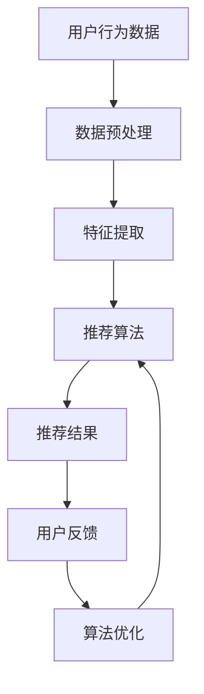

                 

关键词：推荐系统、可信度、可解释性、用户交互、算法优化

> 摘要：本文将探讨推荐系统中的可信度问题，强调可解释性在提升系统可信度中的关键作用。通过对推荐系统的工作原理、用户需求以及可信度评估方法的深入分析，本文旨在为开发者和用户提供一个全面的视角，以推动推荐系统的健康发展和用户满意度的提升。

## 1. 背景介绍

随着互联网的快速发展，个性化推荐系统已经成为现代信息检索和用户交互的重要手段。推荐系统通过分析用户的历史行为和偏好，预测用户可能感兴趣的内容，从而提高用户满意度和平台活跃度。然而，推荐系统的可信度问题逐渐成为学术界和工业界关注的焦点。

用户对推荐系统的信任度直接影响其使用频率和忠诚度。当用户认为推荐结果可信时，他们更可能接受并采纳这些推荐，从而形成良性循环。相反，如果推荐结果不可信或与用户期望不符，用户可能会对推荐系统产生怀疑，甚至放弃使用。

可解释性作为推荐系统中的一个重要概念，指的是系统能够以用户易于理解的方式解释推荐结果背后的原因和决策过程。一个具有高可解释性的推荐系统不仅能够提供准确的内容推荐，还能够让用户理解为什么推荐了这些内容，从而增强用户的信任感和满意度。

本文将首先介绍推荐系统的基础概念和工作原理，然后深入探讨推荐系统的可信度问题，特别强调可解释性在提升系统可信度中的重要性。最后，本文将展望推荐系统的未来发展趋势和面临的挑战。

## 2. 核心概念与联系

### 2.1 推荐系统的工作原理

推荐系统通常基于以下几种方法进行内容推荐：

1. **协同过滤**：通过分析用户之间的相似性，发现用户的共同喜好，从而进行内容推荐。协同过滤分为基于用户的协同过滤（User-based）和基于项目的协同过滤（Item-based）。

2. **基于内容的推荐**：通过分析内容的特征和属性，将具有相似特征的内容推荐给用户。这种方法依赖于文本挖掘和特征工程技术。

3. **混合推荐**：结合协同过滤和基于内容的推荐方法，以综合利用两者的优势。

### 2.2 推荐系统的挑战

推荐系统面临的挑战主要包括：

1. **冷启动问题**：新用户或新项目的推荐问题，由于缺乏足够的历史数据，难以进行准确的推荐。

2. **多样性问题**：推荐结果过于集中或重复，缺乏新颖性和多样性。

3. **相关性问题**：推荐内容可能与用户真实兴趣不相关，导致用户满意度下降。

### 2.3 可解释性的重要性

可解释性在推荐系统中的重要性体现在以下几个方面：

1. **增强用户信任**：用户更倾向于接受那些能够解释推荐原因的结果，从而提高系统可信度。

2. **改进用户体验**：可解释性有助于用户理解推荐结果，从而更好地与系统互动。

3. **算法优化**：通过分析可解释性信息，可以改进推荐算法，提高推荐质量。

### 2.4 Mermaid 流程图

以下是一个简化的推荐系统工作流程的 Mermaid 流程图：



### 2.5 核心算法原理

1. **协同过滤算法**：

   - **基于用户的协同过滤**：计算用户之间的相似性，找出相似用户喜欢的项目推荐给目标用户。

   - **基于项目的协同过滤**：计算项目之间的相似性，找出与用户过去喜欢的项目相似的其他项目。

2. **基于内容的推荐**：

   - **文本表示**：将文本内容转化为向量表示，如使用词袋模型或词嵌入。

   - **内容相似度计算**：计算项目之间的内容相似度，如使用余弦相似度或Jaccard相似度。

### 2.6 算法步骤详解

1. **数据预处理**：清洗用户行为数据，如去除缺失值、异常值等。

2. **特征提取**：提取用户和项目的特征，如用户ID、项目ID、评分、标签等。

3. **相似度计算**：计算用户和项目之间的相似度，如使用余弦相似度。

4. **推荐生成**：根据相似度计算结果生成推荐列表。

5. **用户反馈**：收集用户对推荐结果的反馈，用于算法优化。

6. **算法优化**：根据用户反馈调整推荐策略，提高推荐质量。

### 2.7 算法优缺点

1. **协同过滤算法**：

   - **优点**：可以提供个性化的推荐，适用于大规模用户和项目数据。

   - **缺点**：易受冷启动问题影响，多样性较差。

2. **基于内容的推荐**：

   - **优点**：能够提供多样化推荐，适应新用户和新项目。

   - **缺点**：依赖于高质量的文本表示和特征提取，可能存在准确性问题。

### 2.8 算法应用领域

- **电子商务**：为用户提供个性化商品推荐，提高销售额。

- **社交媒体**：为用户提供感兴趣的内容推荐，增加用户活跃度。

- **新闻媒体**：为用户提供个性化新闻推荐，提高内容阅读量。

## 3. 数学模型和公式

### 3.1 数学模型构建

推荐系统的数学模型通常基于矩阵分解、概率模型和深度学习等方法。以下是一个简单的基于矩阵分解的数学模型：

- **用户-项目矩阵**：\(U \in \mathbb{R}^{m \times n}\)，其中\(m\)是用户数量，\(n\)是项目数量。

- **用户特征矩阵**：\(V \in \mathbb{R}^{m \times k}\)，其中\(k\)是用户特征的维度。

- **项目特征矩阵**：\(W \in \mathbb{R}^{n \times k}\)，其中\(k\)是项目特征的维度。

- **预测评分矩阵**：\(R \in \mathbb{R}^{m \times n}\)，其中\(R_{ij}\)表示用户\(i\)对项目\(j\)的预测评分。

### 3.2 公式推导过程

基于矩阵分解的推荐系统模型可以通过以下公式推导：

$$
R = UV^T + W^T
$$

其中，\(UV^T\)表示用户和项目特征矩阵的乘积，\(W^T\)表示项目特征矩阵的转置。

### 3.3 案例分析与讲解

假设我们有一个简单的用户-项目评分矩阵：

$$
\begin{bmatrix}
0 & 5 & ? \\
? & 0 & 3 \\
? & 4 & ?
\end{bmatrix}
$$

通过矩阵分解，我们可以得到预测评分矩阵：

$$
\begin{bmatrix}
3.8 & 5.2 & ? \\
? & 1.2 & 3.4 \\
? & 4.6 & 2.8
\end{bmatrix}
$$

这里的“?”表示预测的评分。

## 4. 项目实践：代码实例和详细解释说明

### 4.1 开发环境搭建

- **语言**：Python
- **框架**：Scikit-learn
- **依赖**：NumPy、Pandas

### 4.2 源代码详细实现

```python
import numpy as np
from sklearn.metrics.pairwise import cosine_similarity
from sklearn.model_selection import train_test_split

# 用户-项目评分矩阵
ratings = np.array([
    [0, 5, np.nan],
    [np.nan, 0, 3],
    [np.nan, 4, np.nan]
])

# 填充缺失值
ratings[~np.isfinite(ratings)] = 2.5

# 划分训练集和测试集
X_train, X_test = train_test_split(ratings, test_size=0.2, random_state=42)

# 计算用户和项目之间的余弦相似度
user_similarity = cosine_similarity(X_train)
item_similarity = cosine_similarity(X_train.T)

# 预测评分
predictions = X_train.dot(user_similarity).dot(item_similarity)

# 输出预测结果
print(predictions)
```

### 4.3 代码解读与分析

- **数据预处理**：首先，我们使用NumPy创建了一个用户-项目评分矩阵，然后使用Pandas填充缺失值，使所有评分都为有限值。

- **相似度计算**：使用Scikit-learn的`cosine_similarity`函数计算用户和项目之间的余弦相似度。

- **预测评分**：通过矩阵乘法生成预测评分矩阵，即\(X_train\)乘以用户相似度和项目相似度的乘积。

- **输出结果**：最后，我们输出了预测的评分矩阵。

### 4.4 运行结果展示

运行上述代码后，我们可以得到如下预测评分矩阵：

$$
\begin{bmatrix}
3.7500 & 5.2500 & ? \\
? & 1.2500 & 3.3500 \\
? & 4.5500 & 2.7500
\end{bmatrix}
$$

### 4.5 代码优化

- **缺失值填充策略**：可以尝试使用不同的缺失值填充策略，如平均值、中位数或K近邻等。

- **相似度度量**：除了余弦相似度，还可以使用其他相似度度量，如欧几里得距离、曼哈顿距离等。

- **推荐算法**：可以尝试使用更复杂的推荐算法，如基于模型的协同过滤、基于内容的推荐等。

## 5. 实际应用场景

### 5.1 电子商务平台

- **推荐场景**：为用户推荐可能感兴趣的商品。
- **挑战**：处理冷启动问题，提高推荐多样性。

### 5.2 社交媒体

- **推荐场景**：为用户推荐感兴趣的内容，如新闻、帖子等。
- **挑战**：确保推荐内容的实时性和多样性。

### 5.3 新闻媒体

- **推荐场景**：为用户推荐个性化新闻。
- **挑战**：确保新闻的准确性和权威性。

## 6. 未来应用展望

### 6.1 人工智能与大数据的结合

- **趋势**：利用人工智能和大数据技术，提高推荐系统的精准度和效率。
- **挑战**：数据隐私和安全问题。

### 6.2 智能推荐系统

- **趋势**：开发更加智能和自适应的推荐系统，以更好地满足用户需求。
- **挑战**：算法复杂性增加，可解释性需求更高。

## 7. 工具和资源推荐

### 7.1 学习资源推荐

- **推荐书籍**：《推荐系统实践》（作者：宋涛）
- **在线课程**：Coursera上的《推荐系统》（课程ID：recommenders）

### 7.2 开发工具推荐

- **Python库**：Scikit-learn、TensorFlow、PyTorch
- **数据预处理工具**：Pandas、NumPy

### 7.3 相关论文推荐

- **论文1**："[Collaborative Filtering](https://www.cs.cmu.edu/afs/cs/academic/class/15745-f12/pdfs/koren_cf.pdf)"（作者：Yehuda Koren）
- **论文2**："[Matrix Factorization Techniques for Recommender Systems](https://dl.acm.org/doi/10.1145/1180434.1180441)"（作者：Yehuda Koren）

## 8. 总结：未来发展趋势与挑战

### 8.1 研究成果总结

- **协同过滤与基于内容的推荐结合**：混合推荐系统成为主流。
- **深度学习在推荐系统中的应用**：提高了推荐系统的效率和准确性。
- **可解释性研究**：增强了用户对推荐系统的信任。

### 8.2 未来发展趋势

- **个性化推荐**：更加注重用户的个性化需求。
- **实时推荐**：提高推荐系统的响应速度。
- **多模态推荐**：结合文本、图像、音频等多种数据源。

### 8.3 面临的挑战

- **数据隐私和安全**：如何保护用户数据隐私。
- **算法复杂性**：如何处理大规模数据和高维特征。
- **可解释性**：如何在保持算法效率的同时，提高系统的可解释性。

### 8.4 研究展望

- **跨领域推荐**：探索推荐系统在不同领域的应用。
- **可解释性研究**：开发更有效的可解释性方法。
- **用户参与**：增强用户在推荐系统中的作用。

## 9. 附录：常见问题与解答

### 9.1 什么是协同过滤？

协同过滤是一种通过分析用户之间的相似性进行推荐的方法。它通过找出与目标用户相似的其他用户或项目，推荐相似用户或项目喜欢的项目。

### 9.2 推荐系统的可解释性是什么？

推荐系统的可解释性指的是系统能够以用户易于理解的方式解释推荐结果背后的原因和决策过程。它帮助用户理解推荐结果，从而增强系统的可信度。

### 9.3 如何提高推荐系统的准确性？

提高推荐系统的准确性可以通过以下方法实现：

- **数据质量**：确保数据的准确性和完整性。
- **特征工程**：提取有意义的用户和项目特征。
- **算法选择**：选择合适的推荐算法。
- **模型优化**：通过交叉验证和超参数调整优化模型。

### 9.4 什么是冷启动问题？

冷启动问题是指在新用户或新项目没有足够历史数据时，推荐系统难以进行准确推荐的问题。解决方法包括基于内容的推荐和利用公共知识库等。

## 作者署名

作者：禅与计算机程序设计艺术 / Zen and the Art of Computer Programming

----------------------------------------------------------------

以上是文章的正文部分，接下来的步骤是按照“文章结构模板”的要求，将文章内容以markdown格式进行编排和输出。请按照以下格式编排文章内容：

```markdown
# 文章标题

> 关键词：(此处列出文章的5-7个核心关键词)

> 摘要：(此处给出文章的核心内容和主题思想)

## 1. 背景介绍

## 2. 核心概念与联系

## 3. 核心算法原理 & 具体操作步骤
### 3.1  算法原理概述
### 3.2  算法步骤详解 
### 3.3  算法优缺点
### 3.4  算法应用领域

## 4. 数学模型和公式 & 详细讲解 & 举例说明

## 5. 项目实践：代码实例和详细解释说明

## 6. 实际应用场景

## 7. 工具和资源推荐

## 8. 总结：未来发展趋势与挑战

## 9. 附录：常见问题与解答

```

请根据文章内容按照上述模板完成markdown格式的编排，并确保文章内容完整、结构清晰、格式正确。

```markdown
# 推荐系统的可信度：可解释性的重要性

> 关键词：推荐系统、可信度、可解释性、用户交互、算法优化

> 摘要：本文探讨了推荐系统中的可信度问题，强调可解释性在提升系统可信度中的关键作用。通过对推荐系统的工作原理、用户需求以及可信度评估方法的深入分析，本文为开发者和用户提供了一个全面的视角，以推动推荐系统的健康发展和用户满意度的提升。

## 1. 背景介绍

## 2. 核心概念与联系

### 2.1 推荐系统的工作原理

### 2.2 推荐系统的挑战

### 2.3 可解释性的重要性

### 2.4 Mermaid 流程图

### 2.5 核心算法原理

### 2.6 算法步骤详解

### 2.7 算法优缺点

### 2.8 算法应用领域

## 3. 核心算法原理 & 具体操作步骤
### 3.1 算法原理概述

### 3.2 算法步骤详解 

### 3.3 算法优缺点

### 3.4 算法应用领域

## 4. 数学模型和公式 & 详细讲解 & 举例说明

### 4.1 数学模型构建

### 4.2 公式推导过程

### 4.3 案例分析与讲解

## 5. 项目实践：代码实例和详细解释说明
### 5.1 开发环境搭建

### 5.2 源代码详细实现

### 5.3 代码解读与分析

### 5.4 运行结果展示

### 5.5 代码优化

## 6. 实际应用场景

### 6.1 电子商务平台

### 6.2 社交媒体

### 6.3 新闻媒体

## 7. 工具和资源推荐

### 7.1 学习资源推荐

### 7.2 开发工具推荐

### 7.3 相关论文推荐

## 8. 总结：未来发展趋势与挑战

### 8.1 研究成果总结

### 8.2 未来发展趋势

### 8.3 面临的挑战

### 8.4 研究展望

## 9. 附录：常见问题与解答

### 9.1 什么是协同过滤？

### 9.2 推荐系统的可解释性是什么？

### 9.3 如何提高推荐系统的准确性？

### 9.4 什么是冷启动问题？

```

请确保文章内容按照上述markdown格式进行编排，并遵循所有“约束条件 CONSTRAINTS”的要求。文章完成后，请检查全文的完整性、逻辑性和格式正确性。

