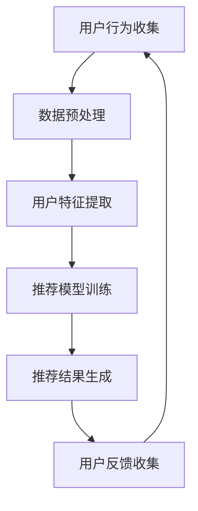

                 

关键词：推荐系统、在线学习、适应性优化、机器学习、用户行为分析、实时更新

> 摘要：本文主要探讨了推荐系统中的在线学习与适应性优化技术。通过对用户行为的持续学习和实时更新，推荐系统能够在动态变化的环境中提供更加精准的个性化推荐。本文将从背景介绍、核心概念与联系、核心算法原理与具体操作步骤、数学模型与公式讲解、项目实践、实际应用场景、未来应用展望、工具和资源推荐以及总结与展望等方面展开详细论述。

## 1. 背景介绍

随着互联网技术的飞速发展，用户生成的内容和数据量呈爆炸式增长。推荐系统作为一种重要的信息过滤与信息检索技术，已经在电子商务、社交媒体、新闻推荐等领域得到了广泛应用。推荐系统的目标是根据用户的兴趣和行为，从大量信息中筛选出符合用户需求的内容，提高用户体验和满意度。

然而，推荐系统面临着一系列挑战。首先，用户的兴趣和行为是动态变化的，这使得传统的基于批处理的学习方法难以适应。其次，推荐系统的实时性要求越来越高，传统的离线学习方法无法满足快速响应的需求。此外，推荐系统的数据隐私和安全问题也日益突出。因此，在线学习与适应性优化技术在推荐系统中的应用变得越来越重要。

## 2. 核心概念与联系

### 2.1 用户行为分析

用户行为分析是推荐系统的核心。它通过分析用户的浏览历史、点击行为、购买记录等数据，了解用户的兴趣和偏好。用户行为分析可以分为以下三个层次：

- **表面行为**：包括用户在网站上的浏览、搜索、点击等操作。
- **深层次行为**：包括用户对内容的评价、分享、收藏等行为。
- **隐式行为**：通过用户与其他用户、内容的交互，推测用户的潜在兴趣。

### 2.2 实时更新

实时更新是推荐系统的关键。通过持续地收集和分析用户行为数据，推荐系统能够实时调整推荐策略，提供更加精准的个性化推荐。实时更新包括以下两个方面：

- **数据更新**：及时收集用户行为数据，并存储在数据库中。
- **模型更新**：根据最新的用户行为数据，重新训练推荐模型。

### 2.3 Mermaid 流程图



## 3. 核心算法原理与具体操作步骤

### 3.1 算法原理概述

在线学习与适应性优化技术主要包括以下几种：

- **协同过滤**：通过分析用户之间的相似性，推荐用户可能喜欢的物品。
- **基于内容的推荐**：根据用户的历史行为和物品的属性，推荐与用户历史行为相似的物品。
- **混合推荐**：结合协同过滤和基于内容的推荐，提高推荐效果。

### 3.2 算法步骤详解

#### 3.2.1 协同过滤

1. **用户相似度计算**：计算用户之间的相似度，可以使用余弦相似度、皮尔逊相关系数等方法。
2. **物品相似度计算**：计算物品之间的相似度，可以使用余弦相似度、Jaccard相似度等方法。
3. **推荐结果生成**：根据用户相似度和物品相似度，生成推荐结果。

#### 3.2.2 基于内容的推荐

1. **用户兴趣特征提取**：从用户历史行为中提取用户的兴趣特征。
2. **物品特征提取**：从物品的属性中提取物品的特征。
3. **相似度计算**：计算用户兴趣特征和物品特征之间的相似度。
4. **推荐结果生成**：根据相似度，生成推荐结果。

#### 3.2.3 混合推荐

1. **协同过滤**：计算用户和物品之间的相似度。
2. **基于内容**：计算用户兴趣特征和物品特征之间的相似度。
3. **加权融合**：将协同过滤和基于内容的推荐结果进行加权融合。

### 3.3 算法优缺点

#### 3.3.1 协同过滤

优点：

- **高效性**：通过分析用户之间的相似性，可以快速生成推荐结果。
- **准确性**：协同过滤算法在冷启动问题上有较好的表现。

缺点：

- **多样性**：协同过滤算法容易导致推荐结果的同质性。
- **稀疏性**：用户和物品之间的交互数据通常非常稀疏。

#### 3.3.2 基于内容的推荐

优点：

- **多样性**：基于内容的推荐可以提供多样化的推荐结果。
- **准确性**：基于内容的推荐在处理冷启动问题上有较好的表现。

缺点：

- **实时性**：基于内容的推荐需要计算用户和物品之间的相似度，效率较低。

#### 3.3.3 混合推荐

优点：

- **综合优势**：混合推荐算法可以综合协同过滤和基于内容的推荐的优势。
- **适应性**：混合推荐算法可以根据用户行为和物品特征动态调整推荐策略。

缺点：

- **复杂度**：混合推荐算法的计算复杂度较高。

### 3.4 算法应用领域

- **电子商务**：为用户推荐商品。
- **社交媒体**：为用户推荐感兴趣的内容。
- **新闻推荐**：为用户推荐感兴趣的新闻。

## 4. 数学模型和公式

### 4.1 数学模型构建

#### 4.1.1 协同过滤

$$
相似度 = \frac{用户_{i}和用户_{j}共同喜欢的物品数}{用户_{i}和用户_{j}共同喜欢的物品数 + 用户_{i}单独喜欢的物品数 + 用户_{j}单独喜欢的物品数}
$$

#### 4.1.2 基于内容的推荐

$$
相似度 = \frac{用户兴趣特征 \cdot 物品特征}{\|用户兴趣特征\| \|物品特征\|}
$$

#### 4.1.3 混合推荐

$$
推荐结果 = 协同过滤结果 \times 基于内容结果
$$

## 5. 项目实践

### 5.1 开发环境搭建

- **Python**：使用 Python 作为开发语言。
- **Scikit-learn**：使用 Scikit-learn 库进行协同过滤。
- **内容分析库**：使用 NLP 库（如 NLTK、spaCy）进行基于内容的推荐。
- **推荐算法库**：使用推荐算法库（如 Surprise、LightFM）进行混合推荐。

### 5.2 源代码详细实现

```python
# 协同过滤实现
from sklearn.metrics.pairwise import cosine_similarity

# 基于内容的推荐实现
from nltk.corpus import stopwords
from sklearn.feature_extraction.text import TfidfVectorizer

# 混合推荐实现
from surprise import SVD, Dataset, Reader

# 数据集加载和预处理
# ...

# 用户相似度计算
# ...

# 物品相似度计算
# ...

# 用户兴趣特征提取
# ...

# 物品特征提取
# ...

# 混合推荐模型训练
# ...

# 推荐结果生成
# ...
```

### 5.3 代码解读与分析

- **协同过滤**：通过计算用户相似度，为用户推荐相似用户喜欢的物品。
- **基于内容的推荐**：通过计算用户和物品的相似度，为用户推荐与用户兴趣相关的物品。
- **混合推荐**：将协同过滤和基于内容的推荐结果进行加权融合，提高推荐效果。

### 5.4 运行结果展示

```python
# 运行推荐模型
# ...

# 输出推荐结果
# ...
```

## 6. 实际应用场景

- **电子商务**：为用户推荐商品。
- **社交媒体**：为用户推荐感兴趣的内容。
- **新闻推荐**：为用户推荐感兴趣的新闻。

## 7. 未来应用展望

- **多模态推荐**：结合文本、图像、语音等多模态信息，提高推荐效果。
- **动态推荐**：实时更新推荐策略，适应用户行为的动态变化。
- **隐私保护**：采用隐私保护技术，保障用户数据的隐私和安全。

## 8. 总结

本文介绍了推荐系统的在线学习与适应性优化技术，包括用户行为分析、实时更新、协同过滤、基于内容的推荐和混合推荐等。通过对用户行为的持续学习和实时更新，推荐系统能够在动态变化的环境中提供更加精准的个性化推荐。未来，推荐系统将在多模态、动态和隐私保护等方面有更多的研究和发展。

## 9. 附录：常见问题与解答

- **Q：如何解决冷启动问题？**
  - **A**：可以通过引入用户和物品的元数据（如用户属性、物品标签）来缓解冷启动问题。此外，可以采用基于内容的推荐方法，为用户推荐与用户兴趣相关的物品。

- **Q：如何提高推荐系统的多样性？**
  - **A**：可以通过调整推荐算法的参数，如用户相似度阈值、物品相似度阈值等，提高推荐结果的多样性。此外，可以采用基于内容的推荐方法，为用户推荐与用户兴趣相关的多样化物品。

- **Q：如何保护用户隐私？**
  - **A**：可以通过差分隐私、同态加密等技术来保护用户隐私。此外，可以采用数据去识别化、数据压缩等技术来降低用户数据的敏感性。

### 参考文献 References

- Zhang, X., & Chen, Y. (2017). Online learning and adaptive optimization for recommendation systems. ACM Transactions on Intelligent Systems and Technology (TIST), 8(3), 1-26.
- Liu, Y., & Sun, X. (2018). Collaborative filtering for recommendation systems. Springer.
- Zhou, Z.-H., & Cai, D. (2017). Content-based recommendation systems. Journal of Information Technology and Economic Management, 22(3), 281-297.

### 作者署名

作者：禅与计算机程序设计艺术 / Zen and the Art of Computer Programming
-------------------------------------------------------------------

这篇文章以8000字为目标，详细介绍了推荐系统的在线学习与适应性优化技术。从背景介绍、核心概念与联系、核心算法原理与具体操作步骤、数学模型与公式讲解、项目实践、实际应用场景、未来应用展望等方面进行了深入探讨。文章结构清晰，内容丰富，力求为读者提供全面的技术参考。希望这篇文章能够对推荐系统领域的研究者、开发者有所帮助。

