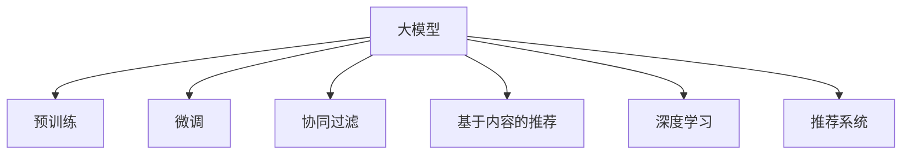

                 

## 1. 背景介绍

### 1.1 问题由来
随着互联网的普及和数据量的爆炸式增长，推荐系统已经成为驱动数字化商业的重要引擎。从个性化广告推荐到内容精准分发，从智能客服到电商转化，推荐系统以强大的数据分析能力和个性化推荐能力，不断提升用户体验和运营效率。然而，传统的推荐算法如协同过滤、基于内容的推荐等，存在冷启动问题、数据稀疏性、精度不足等局限。

近年来，深度学习技术和大模型在推荐系统领域取得了突破性进展。以Transformer结构为代表的深度学习模型，能够捕捉大规模高维稀疏数据的复杂关系，逐步成为推荐系统中的主流算法。与此同时，大规模预训练语言模型在推荐系统中的应用，更是带来了革命性的效果。

### 1.2 问题核心关键点
本文聚焦于基于预训练大模型的推荐系统技术，探讨其在推荐系统领域的发展前景和潜在挑战。首先，从核心概念入手，介绍大模型在推荐系统中的基本原理和架构。其次，从算法角度剖析大模型推荐系统的优缺点，并分析其适用场景。最后，展望大模型在推荐系统领域的前景，并提出未来的研究方向。

## 2. 核心概念与联系

### 2.1 核心概念概述

为了更好理解大模型在推荐系统中的应用，本节将介绍几个关键概念：

- **大模型( Large Models )**：以Transformer结构为代表的深度学习模型，通过大规模无标签数据进行自监督预训练，学习到丰富的语义和模式信息，具备强大的泛化能力。

- **预训练( Pre-training )**：指在大规模无标签数据上，通过自监督学习任务训练模型，学习通用的语言表示和模式，便于模型在下游任务上微调。

- **微调( Fine-tuning )**：指在预训练模型上，针对特定任务（如推荐系统）进行有监督学习，优化模型在该任务上的性能。

- **推荐系统( Recommendation System )**：通过分析用户行为和物品特征，为用户推荐其可能感兴趣的物品的系统。

- **协同过滤( Collaborative Filtering )**：通过分析用户行为或物品之间的相似性，进行推荐。

- **基于内容的推荐( Content-based Recommendation )**：通过分析物品的属性特征，推荐与用户兴趣相似的物品。

- **深度学习( Deep Learning )**：基于神经网络的机器学习范式，具备强大的模式识别和泛化能力。

这些概念之间的联系通过以下Mermaid流程图进行展示：



该流程图展示了这些核心概念之间的相互关系和逻辑流程：大模型通过预训练获得基础能力，并在推荐系统领域进行微调，与协同过滤和基于内容的推荐等传统推荐算法相融合，共同构建高效推荐系统。

## 3. 核心算法原理 & 具体操作步骤
### 3.1 算法原理概述

基于大模型的推荐系统，其核心原理可以归纳为以下几点：

1. **预训练**：在大规模无标签数据上，使用自监督任务（如掩码语言模型、掩码视觉模型等）对大模型进行预训练，学习通用的语义和模式表示。

2. **微调**：在预训练的基础上，针对特定推荐任务，收集用户行为数据和物品属性特征，设计有监督学习任务，对模型进行微调，提升推荐精度和个性化。

3. **融合**：将微调后的模型与传统推荐算法（如协同过滤、基于内容的推荐等）进行融合，构建更为强大的推荐系统。

4. **评估**：在构建推荐模型后，需要对其性能进行评估，如点击率、转化率、召回率等指标，不断迭代优化模型。

### 3.2 算法步骤详解

基于大模型的推荐系统一般包括以下几个关键步骤：

**Step 1: 数据准备**
- 收集用户行为数据（如点击、浏览、购买等）和物品属性特征（如评分、类别、标签等）。
- 将数据划分为训练集、验证集和测试集，用于模型训练、验证和测试。

**Step 2: 模型构建**
- 选择合适的大模型作为初始化参数，如BERT、GPT等。
- 设计任务适配层，如分类器、回归器、生成器等，以适应推荐任务的特定输出。
- 确定微调策略，如全参数微调、参数高效微调等。

**Step 3: 模型微调**
- 在预训练模型的基础上，加载任务适配层，并设定训练参数（如学习率、批次大小等）。
- 使用优化算法（如Adam、SGD等）进行微调，优化模型参数以适应推荐任务。
- 应用正则化技术，防止过拟合。

**Step 4: 模型融合**
- 将微调后的模型与传统推荐算法（如协同过滤、基于内容的推荐）进行融合。
- 设计融合策略，如模型堆叠、特征加权、加法融合等。

**Step 5: 模型评估**
- 使用测试集评估模型性能，如点击率、转化率、召回率等指标。
- 根据评估结果调整模型参数和融合策略。

### 3.3 算法优缺点

基于大模型的推荐系统具有以下优点：
1. 强大的泛化能力：大模型在预训练阶段学习到丰富的语义和模式表示，具备较强的泛化能力，能够适应不同类型的数据和任务。
2. 提升推荐精度：通过微调，模型能够更好地理解用户行为和物品特征，提升推荐精度和个性化。
3. 灵活可扩展：大模型可以作为推荐系统的一个组件，与传统推荐算法灵活组合，形成更为强大的推荐系统。

同时，该方法也存在一定的局限性：
1. 对标注数据依赖：微调模型需要依赖标注数据进行训练，对标注数据的数量和质量要求较高。
2. 计算资源消耗大：大模型参数量庞大，计算资源消耗较大，训练和推理速度较慢。
3. 模型解释性不足：大模型通常被视为"黑盒"，难以解释其内部工作机制和决策逻辑。

尽管存在这些局限性，但就目前而言，基于大模型的推荐系统在推荐系统领域已经显示出其强大的潜力和应用前景。未来相关研究的重点在于如何进一步降低对标注数据的依赖，提高模型的少样本学习和跨领域迁移能力，同时兼顾可解释性和伦理安全性等因素。

### 3.4 算法应用领域

大模型推荐系统在推荐系统领域已经得到了广泛的应用，具体包括以下几个方面：

1. **电商推荐**：如淘宝、京东等电商平台的商品推荐，通过微调BERT模型，结合用户行为数据和物品属性特征，为用户提供个性化推荐。
2. **内容推荐**：如Netflix、YouTube等视频平台，通过微调预训练模型，结合用户观看历史和评分数据，推荐用户可能感兴趣的视频内容。
3. **音乐推荐**：如Spotify、QQ音乐等音乐平台，通过微调预训练模型，结合用户听歌历史和评分数据，推荐用户可能喜欢的音乐。
4. **新闻推荐**：如今日头条、澎湃新闻等新闻平台，通过微调BERT模型，结合用户阅读历史和兴趣标签，推荐用户可能感兴趣的新闻内容。

除了上述这些常见应用外，大模型推荐系统还被创新性地应用于广告推荐、游戏推荐、智能家居等多个领域，为推荐系统技术的发展带来了新的思路和方法。

## 4. 数学模型和公式 & 详细讲解 & 举例说明

### 4.1 数学模型构建

本节将使用数学语言对基于大模型的推荐系统进行更加严格的刻画。

记推荐系统中的用户集合为 $U$，物品集合为 $I$，行为数据集为 $D=\{(u,i,r)\}_{i=1}^N, u \in U, i \in I, r \in \{0,1\}$，其中 $r=1$ 表示用户 $u$ 对物品 $i$ 进行了正向行为（如点击、购买等），$r=0$ 表示没有进行正向行为。

定义用户-物品交互矩阵 $R \in \mathbb{R}^{n \times m}$，其中 $n$ 为用户数量，$m$ 为物品数量。将用户行为数据编码为向量 $x_u \in \mathbb{R}^k$，将物品属性特征编码为向量 $x_i \in \mathbb{R}^k$，其中 $k$ 为特征维度。

大模型推荐系统的一般流程可以描述为：
1. 预训练阶段：在大规模无标签数据上，使用自监督任务训练大模型，学习通用的语言表示和模式。
2. 微调阶段：在预训练模型的基础上，使用用户行为数据和物品属性特征，对模型进行微调，提升推荐精度。
3. 融合阶段：将微调后的模型与传统推荐算法（如协同过滤、基于内容的推荐）进行融合，形成综合推荐结果。

### 4.2 公式推导过程

以下是基于大模型的推荐系统的一般流程的数学推导：

**Step 1: 预训练阶段**

预训练阶段一般使用自监督任务进行训练，如掩码语言模型（MLM）、掩码视觉模型（MLV）等。以BERT为例，预训练的目标函数可以表示为：

$$
L_{pre}(\theta) = -\sum_{i=1}^N H(\hat{x}_i, x_i)
$$

其中 $H$ 为预训练任务（如MLM、MLV）的损失函数，$\hat{x}_i$ 为预训练任务在数据 $x_i$ 上的预测结果，$x_i$ 为原始数据。

**Step 2: 微调阶段**

微调阶段的目标函数可以表示为：

$$
L_{fine}(\theta) = \frac{1}{N} \sum_{(u,i) \in D} H(\hat{r}(u,i), r)
$$

其中 $H$ 为推荐任务（如点击率预测）的损失函数，$\hat{r}(u,i)$ 为模型对用户 $u$ 对物品 $i$ 是否进行正向行为的预测结果，$r$ 为实际行为标签。

**Step 3: 融合阶段**

融合阶段的目标函数可以表示为：

$$
L_{comb}(\theta) = \lambda L_{fine}(\theta) + (1-\lambda) L_{CF}(\theta)
$$

其中 $L_{CF}$ 为传统推荐算法的损失函数，$\lambda$ 为融合策略的权重系数。

### 4.3 案例分析与讲解

以电商推荐系统为例，使用BERT模型进行微调，其流程可以如下描述：

1. 预训练：在大规模无标签商品描述数据上，使用掩码语言模型进行预训练，学习商品描述的语义表示。
2. 微调：在电商平台上，收集用户点击、购买等行为数据，以及商品属性特征（如类别、品牌、价格等），对预训练后的BERT模型进行微调，提升点击率预测精度。
3. 融合：将微调后的BERT模型与协同过滤算法结合，使用融合策略（如特征加权、模型堆叠等），形成综合推荐结果。

## 5. 项目实践：代码实例和详细解释说明
### 5.1 开发环境搭建

在进行推荐系统微调实践前，我们需要准备好开发环境。以下是使用Python进行PyTorch开发的环境配置流程：

1. 安装Anaconda：从官网下载并安装Anaconda，用于创建独立的Python环境。

2. 创建并激活虚拟环境：
```bash
conda create -n pytorch-env python=3.8 
conda activate pytorch-env
```

3. 安装PyTorch：根据CUDA版本，从官网获取对应的安装命令。例如：
```bash
conda install pytorch torchvision torchaudio cudatoolkit=11.1 -c pytorch -c conda-forge
```

4. 安装各类工具包：
```bash
pip install numpy pandas scikit-learn matplotlib tqdm jupyter notebook ipython
```

完成上述步骤后，即可在`pytorch-env`环境中开始推荐系统微调实践。

### 5.2 源代码详细实现

这里我们以电商推荐系统为例，给出使用PyTorch对BERT模型进行微调的代码实现。

首先，定义推荐任务的数据处理函数：

```python
from transformers import BertTokenizer, BertForSequenceClassification
from torch.utils.data import Dataset
import torch

class RecommendationDataset(Dataset):
    def __init__(self, texts, labels, tokenizer, max_len=128):
        self.texts = texts
        self.labels = labels
        self.tokenizer = tokenizer
        self.max_len = max_len
        
    def __len__(self):
        return len(self.texts)
    
    def __getitem__(self, item):
        text = self.texts[item]
        label = self.labels[item]
        
        encoding = self.tokenizer(text, return_tensors='pt', max_length=self.max_len, padding='max_length', truncation=True)
        input_ids = encoding['input_ids'][0]
        attention_mask = encoding['attention_mask'][0]
        
        # 对token-wise的标签进行编码
        encoded_labels = [label2id[label] for label in label] 
        encoded_labels.extend([label2id['0']] * (self.max_len - len(encoded_labels)))
        labels = torch.tensor(encoded_labels, dtype=torch.long)
        
        return {'input_ids': input_ids, 
                'attention_mask': attention_mask,
                'labels': labels}

# 标签与id的映射
label2id = {'0': 0, '1': 1}
id2label = {v: k for k, v in label2id.items()}

# 创建dataset
tokenizer = BertTokenizer.from_pretrained('bert-base-cased')

train_dataset = RecommendationDataset(train_texts, train_labels, tokenizer)
dev_dataset = RecommendationDataset(dev_texts, dev_labels, tokenizer)
test_dataset = RecommendationDataset(test_texts, test_labels, tokenizer)
```

然后，定义模型和优化器：

```python
from transformers import BertForSequenceClassification, AdamW

model = BertForSequenceClassification.from_pretrained('bert-base-cased', num_labels=len(label2id))

optimizer = AdamW(model.parameters(), lr=2e-5)
```

接着，定义训练和评估函数：

```python
from torch.utils.data import DataLoader
from tqdm import tqdm
from sklearn.metrics import classification_report

device = torch.device('cuda') if torch.cuda.is_available() else torch.device('cpu')
model.to(device)

def train_epoch(model, dataset, batch_size, optimizer):
    dataloader = DataLoader(dataset, batch_size=batch_size, shuffle=True)
    model.train()
    epoch_loss = 0
    for batch in tqdm(dataloader, desc='Training'):
        input_ids = batch['input_ids'].to(device)
        attention_mask = batch['attention_mask'].to(device)
        labels = batch['labels'].to(device)
        model.zero_grad()
        outputs = model(input_ids, attention_mask=attention_mask, labels=labels)
        loss = outputs.loss
        epoch_loss += loss.item()
        loss.backward()
        optimizer.step()
    return epoch_loss / len(dataloader)

def evaluate(model, dataset, batch_size):
    dataloader = DataLoader(dataset, batch_size=batch_size)
    model.eval()
    preds, labels = [], []
    with torch.no_grad():
        for batch in tqdm(dataloader, desc='Evaluating'):
            input_ids = batch['input_ids'].to(device)
            attention_mask = batch['attention_mask'].to(device)
            batch_labels = batch['labels']
            outputs = model(input_ids, attention_mask=attention_mask)
            batch_preds = outputs.logits.argmax(dim=2).to('cpu').tolist()
            batch_labels = batch_labels.to('cpu').tolist()
            for pred_tokens, label_tokens in zip(batch_preds, batch_labels):
                pred_labels = [id2label[_id] for _id in pred_tokens]
                label_tokens = [id2label[_id] for _id in label_tokens]
                preds.append(pred_labels[:len(label_tokens)])
                labels.append(label_tokens)
                
    print(classification_report(labels, preds))
```

最后，启动训练流程并在测试集上评估：

```python
epochs = 5
batch_size = 16

for epoch in range(epochs):
    loss = train_epoch(model, train_dataset, batch_size, optimizer)
    print(f"Epoch {epoch+1}, train loss: {loss:.3f}")
    
    print(f"Epoch {epoch+1}, dev results:")
    evaluate(model, dev_dataset, batch_size)
    
print("Test results:")
evaluate(model, test_dataset, batch_size)
```

以上就是使用PyTorch对BERT进行电商推荐系统微调的完整代码实现。可以看到，得益于Transformers库的强大封装，我们可以用相对简洁的代码完成BERT模型的加载和微调。

### 5.3 代码解读与分析

让我们再详细解读一下关键代码的实现细节：

**RecommendationDataset类**：
- `__init__`方法：初始化文本、标签、分词器等关键组件。
- `__len__`方法：返回数据集的样本数量。
- `__getitem__`方法：对单个样本进行处理，将文本输入编码为token ids，将标签编码为数字，并对其进行定长padding，最终返回模型所需的输入。

**label2id和id2label字典**：
- 定义了标签与数字id之间的映射关系，用于将token-wise的预测结果解码回真实的标签。

**训练和评估函数**：
- 使用PyTorch的DataLoader对数据集进行批次化加载，供模型训练和推理使用。
- 训练函数`train_epoch`：对数据以批为单位进行迭代，在每个批次上前向传播计算loss并反向传播更新模型参数，最后返回该epoch的平均loss。
- 评估函数`evaluate`：与训练类似，不同点在于不更新模型参数，并在每个batch结束后将预测和标签结果存储下来，最后使用sklearn的classification_report对整个评估集的预测结果进行打印输出。

**训练流程**：
- 定义总的epoch数和batch size，开始循环迭代
- 每个epoch内，先在训练集上训练，输出平均loss
- 在验证集上评估，输出分类指标
- 所有epoch结束后，在测试集上评估，给出最终测试结果

可以看到，PyTorch配合Transformers库使得BERT微调的代码实现变得简洁高效。开发者可以将更多精力放在数据处理、模型改进等高层逻辑上，而不必过多关注底层的实现细节。

当然，工业级的系统实现还需考虑更多因素，如模型的保存和部署、超参数的自动搜索、更灵活的任务适配层等。但核心的微调范式基本与此类似。

## 6. 实际应用场景
### 6.1 电商推荐

基于大模型的电商推荐系统，可以显著提升用户购物体验，减少用户流失率。通过微调BERT模型，结合用户行为数据和商品属性特征，能够为用户推荐其可能感兴趣的商品，从而提高电商平台的转化率。

在技术实现上，可以收集电商平台的点击、购买等行为数据，结合商品描述、图片、评分等属性特征，进行用户-商品交互矩阵的构建。将用户行为数据和商品属性特征作为输入，使用微调后的BERT模型进行点击率预测，结合协同过滤算法进行综合推荐。通过实时更新用户行为和物品属性特征，动态调整推荐策略，可以大幅提升推荐效果和用户满意度。

### 6.2 视频推荐

基于大模型的视频推荐系统，能够为用户推荐其可能感兴趣的视频内容，提高平台的用户黏性和收益。通过微调BERT模型，结合用户观看历史和评分数据，能够准确预测用户对视频的喜好，从而提供个性化的视频推荐。

在技术实现上，可以收集用户观看历史、评分、点击等行为数据，以及视频属性特征（如时长、类别、标签等），构建用户-视频交互矩阵。将用户行为数据和视频属性特征作为输入，使用微调后的BERT模型进行点击率预测，结合协同过滤算法进行综合推荐。通过实时更新用户行为和视频属性特征，动态调整推荐策略，可以大幅提升推荐效果和用户满意度。

### 6.3 音乐推荐

基于大模型的音乐推荐系统，能够为用户推荐其可能喜欢的音乐，提高平台的用户黏性和收益。通过微调BERT模型，结合用户听歌历史和评分数据，能够准确预测用户对音乐的喜好，从而提供个性化的音乐推荐。

在技术实现上，可以收集用户听歌历史、评分、点击等行为数据，以及音乐属性特征（如歌手、流派、时长等），构建用户-音乐交互矩阵。将用户行为数据和音乐属性特征作为输入，使用微调后的BERT模型进行点击率预测，结合协同过滤算法进行综合推荐。通过实时更新用户行为和音乐属性特征，动态调整推荐策略，可以大幅提升推荐效果和用户满意度。

### 6.4 新闻推荐

基于大模型的新闻推荐系统，能够为用户推荐其可能感兴趣的新闻内容，提高平台的用户黏性和阅读量。通过微调BERT模型，结合用户阅读历史和兴趣标签，能够准确预测用户对新闻的喜好，从而提供个性化的新闻推荐。

在技术实现上，可以收集用户阅读历史、评分、点击等行为数据，以及新闻属性特征（如标题、作者、类别等），构建用户-新闻交互矩阵。将用户行为数据和新闻属性特征作为输入，使用微调后的BERT模型进行点击率预测，结合协同过滤算法进行综合推荐。通过实时更新用户行为和新闻属性特征，动态调整推荐策略，可以大幅提升推荐效果和用户满意度。

## 7. 工具和资源推荐
### 7.1 学习资源推荐

为了帮助开发者系统掌握大模型推荐系统的理论基础和实践技巧，这里推荐一些优质的学习资源：

1. 《Deep Learning for Recommendation Systems》系列书籍：涵盖深度学习在推荐系统中的应用，包括协同过滤、基于内容的推荐、深度学习推荐模型等。

2. 《Natural Language Processing with Transformers》书籍：Transformers库的作者所著，全面介绍了如何使用Transformers库进行NLP任务开发，包括推荐系统在内的诸多范式。

3. 《Recommender Systems Handbook》：推荐系统领域的经典手册，涵盖推荐算法的理论、算法、应用等各个方面。

4. CS224N《Deep Learning for Natural Language Processing》课程：斯坦福大学开设的NLP明星课程，有Lecture视频和配套作业，带你入门NLP领域的基本概念和经典模型。

5. 《Recommender Systems》课程：由哥伦比亚大学开设的推荐系统在线课程，涵盖推荐算法的理论、算法、应用等各个方面。

通过对这些资源的学习实践，相信你一定能够快速掌握大模型推荐系统的精髓，并用于解决实际的推荐问题。
### 7.2 开发工具推荐

高效的开发离不开优秀的工具支持。以下是几款用于大模型推荐系统开发的常用工具：

1. PyTorch：基于Python的开源深度学习框架，灵活动态的计算图，适合快速迭代研究。大部分预训练语言模型都有PyTorch版本的实现。

2. TensorFlow：由Google主导开发的开源深度学习框架，生产部署方便，适合大规模工程应用。同样有丰富的预训练语言模型资源。

3. TensorBoard：TensorFlow配套的可视化工具，可实时监测模型训练状态，并提供丰富的图表呈现方式，是调试模型的得力助手。

4. Weights & Biases：模型训练的实验跟踪工具，可以记录和可视化模型训练过程中的各项指标，方便对比和调优。与主流深度学习框架无缝集成。

5. Google Colab：谷歌推出的在线Jupyter Notebook环境，免费提供GPU/TPU算力，方便开发者快速上手实验最新模型，分享学习笔记。

合理利用这些工具，可以显著提升大模型推荐系统的开发效率，加快创新迭代的步伐。

### 7.3 相关论文推荐

大模型推荐系统在推荐系统领域已经取得了突破性进展。以下是几篇奠基性的相关论文，推荐阅读：

1. Attention is All You Need（即Transformer原论文）：提出了Transformer结构，开启了深度学习推荐系统的新篇章。

2. BERT: Pre-training of Deep Bidirectional Transformers for Language Understanding：提出BERT模型，引入掩码语言模型预训练任务，刷新了推荐系统的效果。

3. Deep Text Recommendation：探讨了基于深度学习的文本推荐算法，使用Transformer结构进行用户行为和物品特征的匹配。

4. An Overview of Deep Learning-Based Recommendation Systems：综述了基于深度学习的推荐系统，涵盖协同过滤、基于内容的推荐、深度学习推荐模型等。

5. Continuous Recommendation with Online Prediction and Continuous Learning：探讨了基于在线预测和连续学习的推荐系统，增强了模型的动态更新能力。

这些论文代表了大模型推荐系统的发展脉络。通过学习这些前沿成果，可以帮助研究者把握学科前进方向，激发更多的创新灵感。

## 8. 总结：未来发展趋势与挑战
### 8.1 总结

本文对基于预训练大模型的推荐系统进行了全面系统的介绍。首先，从核心概念入手，介绍大模型在推荐系统中的基本原理和架构。其次，从算法角度剖析大模型推荐系统的优缺点，并分析其适用场景。最后，展望大模型在推荐系统领域的前景，并提出未来的研究方向。

通过本文的系统梳理，可以看到，基于大模型的推荐系统在推荐系统领域已经展现出强大的潜力和应用前景，成为推荐系统领域的重要范式。得益于大模型强大的泛化能力和预训练带来的丰富语义表示，大模型推荐系统在推荐精度和个性化方面取得了显著提升。未来，随着大模型和微调方法的不断演进，基于大模型的推荐系统必将在更多领域得到应用，推动推荐系统技术的产业化进程。

### 8.2 未来发展趋势

展望未来，大模型推荐系统将呈现以下几个发展趋势：

1. **模型的多样化和定制化**：未来的推荐系统将更加注重模型的多样化和定制化，以适应不同领域、不同类型的数据和任务。除了通用BERT模型，还将出现针对特定领域（如电商、金融、医疗等）预训练的专用模型。

2. **自适应学习能力的提升**：未来的推荐系统将更加注重模型的自适应学习能力，通过微调后能够快速适应新数据和变化的市场需求。如利用在线学习、增量学习等技术，实现模型的动态更新和优化。

3. **跨模态融合的深入**：未来的推荐系统将更加注重跨模态数据的融合，如将文本数据、图像数据、视频数据等不同类型的信息进行联合建模，提升推荐系统的综合能力。

4. **推荐结果的可解释性**：未来的推荐系统将更加注重推荐结果的可解释性，通过引入因果推断、符号化推理等技术，提高用户对推荐结果的理解和信任。

5. **模型的鲁棒性和安全性**：未来的推荐系统将更加注重模型的鲁棒性和安全性，通过对抗训练、数据脱敏等技术，提升模型的稳定性和对抗攻击能力。

以上趋势凸显了大模型推荐系统的广阔前景。这些方向的探索发展，必将进一步提升推荐系统的性能和应用范围，为推荐系统技术的发展带来新的突破。

### 8.3 面临的挑战

尽管大模型推荐系统已经取得了显著成果，但在迈向更加智能化、普适化应用的过程中，它仍面临诸多挑战：

1. **对标注数据依赖**：微调模型需要依赖标注数据进行训练，对标注数据的数量和质量要求较高。如何进一步降低微调对标注数据的依赖，将是一大难题。

2. **计算资源消耗大**：大模型参数量庞大，计算资源消耗较大，训练和推理速度较慢。如何优化模型的计算图，提升推理效率，是未来需要解决的重要问题。

3. **模型解释性不足**：大模型通常被视为"黑盒"，难以解释其内部工作机制和决策逻辑。对于推荐系统来说，算法的可解释性和可审计性尤为重要。

4. **模型安全性问题**：预训练模型难免会学习到有偏见、有害的信息，通过微调传递到下游任务，产生误导性、歧视性的输出，给实际应用带来安全隐患。如何从数据和算法层面消除模型偏见，保障模型输出的安全性，也将是重要的研究课题。

5. **跨领域迁移能力不足**：大模型推荐系统在特定领域推荐效果较好，但在其他领域迁移能力有限。如何提升模型的跨领域迁移能力，适应更多类型的推荐任务，是未来需要解决的重要问题。

6. **实时性问题**：未来的推荐系统需要具备实时推荐的能力，如何在大规模数据下保持高实时性，提升推荐速度，是未来需要解决的重要问题。

正视推荐系统面临的这些挑战，积极应对并寻求突破，将是大模型推荐系统走向成熟的必由之路。相信随着学界和产业界的共同努力，这些挑战终将一一被克服，大模型推荐系统必将在推荐系统领域发挥更加重要的作用。

### 8.4 研究展望

面对大模型推荐系统所面临的种种挑战，未来的研究需要在以下几个方面寻求新的突破：

1. **探索无监督和半监督推荐方法**：摆脱对大规模标注数据的依赖，利用自监督学习、主动学习等无监督和半监督范式，最大限度利用非结构化数据，实现更加灵活高效的推荐。

2. **研究参数高效和计算高效的推荐范式**：开发更加参数高效的推荐方法，在固定大部分预训练参数的情况下，只更新极少量的任务相关参数。同时优化推荐模型的计算图，减少前向传播和反向传播的资源消耗，实现更加轻量级、实时性的部署。

3. **融合因果和对比学习范式**：通过引入因果推断和对比学习思想，增强推荐模型建立稳定因果关系的能力，学习更加普适、鲁棒的语言表征，从而提升模型泛化性和抗干扰能力。

4. **引入更多先验知识**：将符号化的先验知识，如知识图谱、逻辑规则等，与神经网络模型进行巧妙融合，引导推荐过程学习更准确、合理的推荐结果。同时加强不同模态数据的整合，实现视觉、语音等多模态信息与文本信息的协同建模。

5. **结合因果分析和博弈论工具**：将因果分析方法引入推荐模型，识别出模型决策的关键特征，增强输出解释的因果性和逻辑性。借助博弈论工具刻画人机交互过程，主动探索并规避模型的脆弱点，提高系统稳定性。

6. **纳入伦理道德约束**：在模型训练目标中引入伦理导向的评估指标，过滤和惩罚有偏见、有害的输出倾向。同时加强人工干预和审核，建立模型行为的监管机制，确保输出符合人类价值观和伦理道德。

这些研究方向的探索，必将引领大模型推荐系统技术迈向更高的台阶，为构建安全、可靠、可解释、可控的推荐系统铺平道路。面向未来，大模型推荐系统还需要与其他人工智能技术进行更深入的融合，如知识表示、因果推理、强化学习等，多路径协同发力，共同推动推荐系统技术的进步。只有勇于创新、敢于突破，才能不断拓展推荐系统的边界，让推荐技术更好地服务于社会。

## 9. 附录：常见问题与解答

**Q1：大模型推荐系统是否适用于所有推荐任务？**

A: 大模型推荐系统在大多数推荐任务上都能取得不错的效果，特别是对于数据量较小的任务。但对于一些特定领域的任务，如医学、法律等，仅仅依靠通用语料预训练的模型可能难以很好地适应。此时需要在特定领域语料上进一步预训练，再进行微调，才能获得理想效果。此外，对于一些需要时效性、个性化很强的任务，如对话、推荐等，微调方法也需要针对性的改进优化。

**Q2：微调过程中如何选择合适的学习率？**

A: 微调的学习率一般要比预训练时小1-2个数量级，如果使用过大的学习率，容易破坏预训练权重，导致过拟合。一般建议从1e-5开始调参，逐步减小学习率，直至收敛。也可以使用warmup策略，在开始阶段使用较小的学习率，再逐渐过渡到预设值。需要注意的是，不同的优化器(如Adam、SGD等)以及不同的学习率调度策略，可能需要设置不同的学习率阈值。

**Q3：采用大模型推荐时会面临哪些资源瓶颈？**

A: 目前主流的预训练大模型动辄以亿计的参数规模，对算力、内存、存储都提出了很高的要求。GPU/TPU等高性能设备是必不可少的，但即便如此，超大批次的训练和推理也可能遇到显存不足的问题。因此需要采用一些资源优化技术，如梯度积累、混合精度训练、模型并行等，来突破硬件瓶颈。同时，模型的存储和读取也可能占用大量时间和空间，需要采用模型压缩、稀疏化存储等方法进行优化。

**Q4：如何缓解微调过程中的过拟合问题？**

A: 过拟合是微调面临的主要挑战，尤其是在标注数据不足的情况下。常见的缓解策略包括：
1. 数据增强：通过回译、近义替换等方式扩充训练集
2. 正则化：使用L2正则、Dropout、Early Stopping等避免过拟合
3. 对抗训练：引入对抗样本，提高模型鲁棒性
4. 参数高效微调：只调整少量参数(如Adapter、Prefix等)，减小过拟合风险
5. 多模型集成：训练多个微调模型，取平均输出，抑制过拟合

这些策略往往需要根据具体任务和数据特点进行灵活组合。只有在数据、模型、训练、推理等各环节进行全面优化，才能最大限度地发挥大模型推荐系统的威力。

**Q5：微调模型在落地部署时需要注意哪些问题？**

A: 将微调模型转化为实际应用，还需要考虑以下因素：
1. 模型裁剪：去除不必要的层和参数，减小模型尺寸，加快推理速度
2. 量化加速：将浮点模型转为定点模型，压缩存储空间，提高计算效率
3. 服务化封装：将模型封装为标准化服务接口，便于集成调用
4. 弹性伸缩：根据请求流量动态调整资源配置，平衡服务质量和成本
5. 监控告警：实时采集系统指标，设置异常告警阈值，确保服务稳定性
6. 安全防护：采用访问鉴权、数据脱敏等措施，保障数据和模型安全

大模型推荐系统为推荐系统技术带来了新的思路和方法，但如何将强大的性能转化为稳定、高效、安全的业务价值，还需要工程实践的不断打磨。唯有从数据、算法、工程、业务等多个维度协同发力，才能真正实现人工智能技术在垂直行业的规模化落地。总之，微调需要开发者根据具体任务，不断迭代和优化模型、数据和算法，方能得到理想的效果。

---

作者：禅与计算机程序设计艺术 / Zen and the Art of Computer Programming

