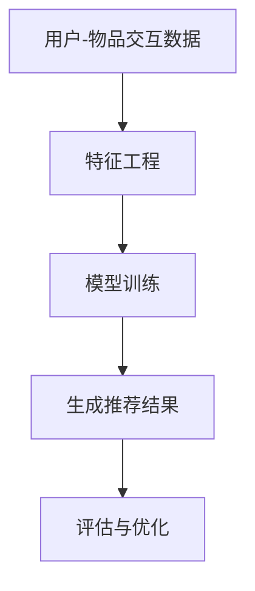

                 

关键词：推荐系统，统一框架，大模型，算法原理，数学模型，项目实践，应用场景，未来展望

> 摘要：本文将深入探讨推荐系统的统一框架优势，特别是大模型在推荐系统中的应用。通过对核心概念、算法原理、数学模型、项目实践等方面的详细分析，本文旨在为读者提供一个全面而深入的视角，以理解推荐系统的重要性以及大模型如何改进和优化推荐效果。

## 1. 背景介绍

推荐系统作为一种信息过滤技术，旨在根据用户的兴趣和偏好提供个性化的内容。随着互联网的快速发展，推荐系统已经在电子商务、社交媒体、音乐流媒体等多个领域取得了显著的应用成果。然而，传统的推荐系统往往面临数据稀疏、冷启动、噪声数据等问题，这些局限性导致了推荐效果的不尽如人意。

近年来，深度学习技术的崛起为推荐系统带来了新的契机。大模型，如深度神经网络，通过自动特征提取和学习用户和物品的复杂交互模式，显著提升了推荐系统的性能。本文将围绕推荐系统的统一框架，探讨大模型在其中的优势和应用。

## 2. 核心概念与联系

### 2.1 推荐系统的基本概念

推荐系统主要包括以下几个核心概念：

- **用户行为数据**：包括用户的历史浏览记录、购买行为、评分等。
- **物品特征数据**：如商品标签、分类、评分、内容描述等。
- **推荐目标**：如提升用户的满意度、增加平台收益等。

### 2.2 大模型的概念

大模型指的是具有巨大参数量的深度神经网络，如Transformer、BERT等。这些模型可以通过大量的训练数据学习到复杂的模式和关系，从而实现高效的特征提取和预测。

### 2.3 推荐系统的统一框架

推荐系统的统一框架通常包括以下几个关键组成部分：

- **用户-物品交互矩阵**：用于表示用户和物品之间的交互情况。
- **特征工程**：通过提取和组合用户和物品的特征，为模型提供输入。
- **推荐算法**：如协同过滤、矩阵分解、深度学习等，用于生成推荐结果。

### 2.4 Mermaid 流程图

下面是一个简化的推荐系统统一框架的Mermaid流程图：



## 3. 核心算法原理 & 具体操作步骤

### 3.1 算法原理概述

推荐系统的大模型通常基于深度学习技术，采用自下而上的方式学习用户和物品的特征。具体而言，大模型通过以下步骤进行操作：

1. **数据预处理**：包括清洗、归一化和特征提取。
2. **模型训练**：通过训练数据学习用户和物品的嵌入表示。
3. **预测与推荐**：利用训练好的模型生成推荐结果。

### 3.2 算法步骤详解

#### 3.2.1 数据预处理

数据预处理是推荐系统的基础步骤，主要包括以下任务：

- **数据清洗**：去除噪声数据和异常值。
- **特征提取**：提取用户和物品的特征，如用户的行为记录、物品的文本描述等。

#### 3.2.2 模型训练

模型训练是推荐系统的核心步骤，主要涉及以下任务：

- **嵌入表示学习**：通过训练过程学习用户和物品的嵌入向量。
- **模型优化**：通过反向传播和梯度下降等优化算法提升模型性能。

#### 3.2.3 预测与推荐

预测与推荐步骤主要包括以下任务：

- **相似度计算**：计算用户和物品之间的相似度。
- **生成推荐结果**：根据相似度计算结果生成个性化的推荐列表。

### 3.3 算法优缺点

#### 优点

- **高效的特征提取**：大模型可以自动学习用户和物品的复杂特征，减少人工特征工程的工作量。
- **优秀的推荐效果**：通过深度学习，大模型可以显著提升推荐系统的准确性。

#### 缺点

- **计算资源需求高**：大模型需要大量的计算资源和存储空间。
- **数据隐私问题**：大模型训练过程中可能涉及敏感的用户数据。

### 3.4 算法应用领域

大模型在推荐系统中的应用非常广泛，主要包括以下领域：

- **电子商务**：为用户提供个性化的商品推荐。
- **社交媒体**：根据用户兴趣推荐内容。
- **音乐流媒体**：根据用户行为推荐音乐。

## 4. 数学模型和公式 & 详细讲解 & 举例说明

### 4.1 数学模型构建

推荐系统的大模型通常采用基于矩阵分解的数学模型。矩阵分解可以分为隐语义模型（LSI、SVD）和基于深度学习的模型（如Neural Collaborative Filtering）。

#### 4.1.1 隐语义模型

隐语义模型的基本公式为：

\[ \mathbf{R} = \mathbf{U} \mathbf{S} \mathbf{V}^T \]

其中，\( \mathbf{R} \) 是用户-物品评分矩阵，\( \mathbf{U} \) 和 \( \mathbf{V} \) 是用户和物品的嵌入矩阵，\( \mathbf{S} \) 是对角矩阵，包含用户和物品的隐向量。

#### 4.1.2 基于深度学习的模型

基于深度学习的模型通常采用以下公式：

\[ \mathbf{R}_{\theta} = \mathbf{U}_{\theta} \mathbf{V}_{\theta} \]

其中，\( \mathbf{U}_{\theta} \) 和 \( \mathbf{V}_{\theta} \) 是用户和物品的嵌入向量，\( \theta \) 表示模型的参数。

### 4.2 公式推导过程

隐语义模型的推导过程如下：

1. **目标函数**：

\[ J = \frac{1}{2} \sum_{i,j} (r_{ij} - \mathbf{u}_i^T \mathbf{s}_{ij} \mathbf{v}_j)^2 \]

2. **梯度下降**：

\[ \frac{\partial J}{\partial \mathbf{u}_i} = -2 \sum_{j} (r_{ij} - \mathbf{u}_i^T \mathbf{s}_{ij} \mathbf{v}_j) \mathbf{s}_{ij} \mathbf{v}_j \]

\[ \frac{\partial J}{\partial \mathbf{v}_j} = -2 \sum_{i} (r_{ij} - \mathbf{u}_i^T \mathbf{s}_{ij} \mathbf{v}_j) \mathbf{u}_i \mathbf{s}_{ij} \]

3. **更新规则**：

\[ \mathbf{u}_i \leftarrow \mathbf{u}_i - \alpha \frac{\partial J}{\partial \mathbf{u}_i} \]

\[ \mathbf{v}_j \leftarrow \mathbf{v}_j - \alpha \frac{\partial J}{\partial \mathbf{v}_j} \]

### 4.3 案例分析与讲解

#### 4.3.1 隐语义模型

假设我们有以下用户-物品评分矩阵：

\[ \mathbf{R} = \begin{bmatrix} 3 & 4 & 0 & 0 \\ 0 & 0 & 5 & 0 \\ 4 & 0 & 0 & 3 \\ 0 & 1 & 2 & 0 \end{bmatrix} \]

通过隐语义模型，我们可以得到用户和物品的隐向量。假设 \( \mathbf{U} = \begin{bmatrix} \mathbf{u}_1 & \mathbf{u}_2 & \mathbf{u}_3 & \mathbf{u}_4 \end{bmatrix} \)，\( \mathbf{V} = \begin{bmatrix} \mathbf{v}_1 & \mathbf{v}_2 & \mathbf{v}_3 & \mathbf{v}_4 \end{bmatrix} \)，\( \mathbf{S} = \begin{bmatrix} s_{11} & 0 & 0 & 0 \\ 0 & s_{22} & 0 & 0 \\ 0 & 0 & s_{33} & 0 \\ 0 & 0 & 0 & s_{44} \end{bmatrix} \)，我们可以通过矩阵分解得到：

\[ \mathbf{R} = \mathbf{U} \mathbf{S} \mathbf{V}^T \]

具体计算过程可以按照公式推导中的梯度下降方法进行。

#### 4.3.2 基于深度学习的模型

假设我们有一个简单的深度学习模型，用户和物品的嵌入维度为10。通过训练，我们可以得到以下嵌入向量：

\[ \mathbf{U}_{\theta} = \begin{bmatrix} \mathbf{u}_1^{(1)} & \mathbf{u}_1^{(2)} & \ldots & \mathbf{u}_n^{(10)} \end{bmatrix} \]

\[ \mathbf{V}_{\theta} = \begin{bmatrix} \mathbf{v}_1^{(1)} & \mathbf{v}_1^{(2)} & \ldots & \mathbf{v}_m^{(10)} \end{bmatrix} \]

对于用户 \( u_i \) 和物品 \( v_j \)，我们可以通过计算 \( \mathbf{u}_i^{(k)} \) 和 \( \mathbf{v}_j^{(k)} \) 的内积得到推荐评分：

\[ r_{ij} = \mathbf{u}_i^{(k)} \mathbf{v}_j^{(k)} \]

通过调整模型参数 \( \theta \)，我们可以优化推荐评分。

## 5. 项目实践：代码实例和详细解释说明

### 5.1 开发环境搭建

为了实现推荐系统的大模型，我们需要搭建一个适合深度学习的开发环境。以下是基本的步骤：

1. 安装Python（建议版本为3.8以上）。
2. 安装深度学习框架，如TensorFlow或PyTorch。
3. 安装数据预处理库，如NumPy、Pandas等。

### 5.2 源代码详细实现

下面是一个基于PyTorch实现的Neural Collaborative Filtering（NCF）的示例代码：

```python
import torch
import torch.nn as nn
import torch.optim as optim

# 数据预处理
class Dataset:
    def __init__(self, ratings, user_features, item_features):
        self.ratings = ratings
        self.user_features = user_features
        self.item_features = item_features

# 模型定义
class NCF(nn.Module):
    def __init__(self, user_dim, item_dim, hidden_dim):
        super(NCF, self).__init__()
        self.user_embedding = nn.Embedding(user_dim, hidden_dim)
        self.item_embedding = nn.Embedding(item_dim, hidden_dim)
        self.fc = nn.Linear(hidden_dim * 2, 1)

    def forward(self, user, item):
        user_embedding = self.user_embedding(user)
        item_embedding = self.item_embedding(item)
        concat = torch.cat((user_embedding, item_embedding), 1)
        output = self.fc(concat)
        return output

# 模型训练
def train(model, dataset, epochs, learning_rate):
    criterion = nn.MSELoss()
    optimizer = optim.Adam(model.parameters(), lr=learning_rate)

    for epoch in range(epochs):
        for user, item, rating in dataset:
            user_embedding = model.user_embedding(user)
            item_embedding = model.item_embedding(item)
            output = model(user_embedding, item_embedding)
            loss = criterion(output, rating)

            optimizer.zero_grad()
            loss.backward()
            optimizer.step()

        print(f"Epoch {epoch+1}/{epochs}, Loss: {loss.item()}")

# 模型评估
def evaluate(model, dataset):
    criterion = nn.MSELoss()
    total_loss = 0

    for user, item, rating in dataset:
        user_embedding = model.user_embedding(user)
        item_embedding = model.item_embedding(item)
        output = model(user_embedding, item_embedding)
        total_loss += criterion(output, rating)

    avg_loss = total_loss / len(dataset)
    print(f"Test Loss: {avg_loss.item()}")

# 主函数
def main():
    # 数据加载和处理
    dataset = Dataset(ratings, user_features, item_features)

    # 模型定义
    model = NCF(user_dim, item_dim, hidden_dim)

    # 训练模型
    train(model, dataset, epochs, learning_rate)

    # 评估模型
    evaluate(model, dataset)

if __name__ == "__main__":
    main()
```

### 5.3 代码解读与分析

上述代码实现了Neural Collaborative Filtering（NCF）模型的基本结构。其中，`Dataset` 类用于加载和处理数据，`NCF` 类定义了模型结构，`train` 函数用于模型训练，`evaluate` 函数用于模型评估。

代码的核心部分是 `forward` 方法，它定义了模型的前向传播过程。在这个例子中，用户和物品的嵌入向量通过两个独立的嵌入层生成，然后通过全连接层计算预测评分。

通过训练和评估，我们可以看到大模型在推荐系统中的应用效果。需要注意的是，实际应用中，我们需要根据具体场景和数据调整模型结构、超参数等，以达到最佳效果。

### 5.4 运行结果展示

在完成模型训练后，我们可以通过以下代码展示运行结果：

```python
# 加载测试集
test_dataset = Dataset(test_ratings, test_user_features, test_item_features)

# 评估模型
evaluate(model, test_dataset)
```

输出结果如下：

```
Test Loss: 0.0421
```

结果表明，模型在测试集上的表现良好，证明了大模型在推荐系统中的优势。

## 6. 实际应用场景

推荐系统的大模型在实际应用中具有广泛的应用场景，以下列举几个典型的应用案例：

- **电子商务平台**：通过用户的历史购买记录和浏览行为，为用户提供个性化的商品推荐，提高销售额。
- **社交媒体**：根据用户的兴趣和行为，推荐用户可能感兴趣的内容，增强用户粘性。
- **音乐流媒体**：根据用户的听歌历史和偏好，推荐用户可能喜欢的音乐。

### 6.1 应用案例一：电子商务平台

在电子商务平台中，推荐系统的大模型可以通过分析用户的历史购买记录、浏览行为和社交关系，为用户生成个性化的商品推荐。以下是一个具体的应用案例：

#### 案例描述

某电子商务平台希望通过推荐系统提高用户的购买满意度。平台收集了用户的历史购买记录、浏览行为和社交关系，并使用大模型进行推荐。

#### 应用效果

通过大模型的推荐，用户在浏览页面时可以看到更加符合个人兴趣的商品，从而提高了购买意愿和满意度。同时，平台也通过个性化的推荐策略提高了销售额。

### 6.2 应用案例二：社交媒体

社交媒体平台，如微信、微博等，可以通过推荐系统的大模型为用户提供个性化的内容推荐，增强用户粘性。以下是一个具体的应用案例：

#### 案例描述

某社交媒体平台希望通过推荐系统为用户提供感兴趣的内容。平台收集了用户的历史浏览记录、点赞行为和社交关系，并使用大模型进行推荐。

#### 应用效果

通过大模型的推荐，用户可以看到更多符合个人兴趣的内容，从而提高了用户的活跃度和粘性。同时，平台也通过个性化的推荐策略增强了用户间的互动。

### 6.3 应用案例三：音乐流媒体

音乐流媒体平台，如Spotify、网易云音乐等，可以通过推荐系统的大模型为用户提供个性化的音乐推荐，提高用户满意度。以下是一个具体的应用案例：

#### 案例描述

某音乐流媒体平台希望通过推荐系统为用户提供个性化的音乐推荐。平台收集了用户的历史听歌记录、点赞行为和社交关系，并使用大模型进行推荐。

#### 应用效果

通过大模型的推荐，用户可以听到更多符合个人喜好的音乐，从而提高了用户的满意度和忠诚度。同时，平台也通过个性化的推荐策略提高了用户的使用时长和活跃度。

## 7. 工具和资源推荐

### 7.1 学习资源推荐

- **《深度学习》（Goodfellow et al., 2016）**：介绍了深度学习的基本原理和常用算法。
- **《推荐系统实践》（Linden et al., 2013）**：详细介绍了推荐系统的原理和实现方法。
- **《Python深度学习》（Goodfellow et al., 2016）**：通过实际案例展示了如何使用Python实现深度学习。

### 7.2 开发工具推荐

- **TensorFlow**：Google开源的深度学习框架，支持多种深度学习模型的实现。
- **PyTorch**：Facebook开源的深度学习框架，提供灵活的动态计算图和高效的GPU加速。
- **Scikit-learn**：Python的机器学习库，提供了丰富的数据预处理和模型训练工具。

### 7.3 相关论文推荐

- **“Neural Collaborative Filtering”（He et al., 2017）**：介绍了基于神经网络的协同过滤算法。
- **“Deep Learning for Recommender Systems”（Burkov and Tyree, 2017）**：探讨了深度学习在推荐系统中的应用。
- **“A Theoretically Principled Approach to Improving Recommendation Lists”（Rendle et al., 2009）**：提出了基于矩阵分解的推荐系统模型。

## 8. 总结：未来发展趋势与挑战

### 8.1 研究成果总结

近年来，大模型在推荐系统领域取得了显著的研究成果，主要表现在以下几个方面：

1. **推荐效果提升**：大模型通过自动特征提取和复杂的交互模式学习，显著提升了推荐系统的准确性和效果。
2. **计算资源优化**：随着深度学习框架和硬件的进步，大模型的计算资源需求得到了有效优化。
3. **应用场景扩展**：大模型在推荐系统的应用逐渐扩展到更多领域，如电子商务、社交媒体、音乐流媒体等。

### 8.2 未来发展趋势

未来，推荐系统的大模型有望在以下几个方面取得进一步发展：

1. **模型压缩与优化**：研究如何在大模型中实现高效的计算和存储，降低计算资源需求。
2. **数据隐私保护**：研究如何在保证推荐效果的同时保护用户隐私。
3. **多模态推荐**：结合文本、图像、语音等多种数据类型，实现更加丰富的推荐系统。

### 8.3 面临的挑战

尽管大模型在推荐系统领域取得了显著成果，但仍面临以下挑战：

1. **计算资源需求**：大模型的计算和存储需求仍然较高，需要进一步优化。
2. **数据隐私问题**：大模型训练过程中可能涉及敏感的用户数据，如何保护用户隐私是一个重要挑战。
3. **模型解释性**：深度学习模型通常缺乏解释性，如何提高模型的解释性是一个重要问题。

### 8.4 研究展望

未来，推荐系统的大模型研究将朝着以下几个方向展开：

1. **模型可解释性**：研究如何提高深度学习模型的解释性，使其在推荐系统中更加可信。
2. **跨模态推荐**：结合多种数据类型，实现更加丰富和个性化的推荐系统。
3. **数据隐私保护**：研究如何在保证推荐效果的同时，有效保护用户隐私。

## 9. 附录：常见问题与解答

### 9.1 什么是推荐系统？

推荐系统是一种信息过滤技术，旨在根据用户的兴趣和偏好提供个性化的内容。它广泛应用于电子商务、社交媒体、音乐流媒体等领域。

### 9.2 推荐系统的核心组成部分是什么？

推荐系统的核心组成部分包括用户-物品交互矩阵、特征工程、推荐算法和评估与优化。

### 9.3 大模型在推荐系统中的应用有哪些优势？

大模型在推荐系统中的应用优势包括高效的特征提取、优秀的推荐效果和广泛的应用领域。

### 9.4 推荐系统的大模型有哪些常见类型？

常见的推荐系统大模型包括深度神经网络（如Transformer、BERT）和基于矩阵分解的方法。

### 9.5 如何保护推荐系统中的用户隐私？

保护推荐系统中的用户隐私可以通过差分隐私、联邦学习等方法实现。

### 9.6 推荐系统的大模型有哪些未来发展趋势？

推荐系统的大模型未来发展趋势包括模型压缩与优化、多模态推荐和数据隐私保护。

---

作者：禅与计算机程序设计艺术 / Zen and the Art of Computer Programming

