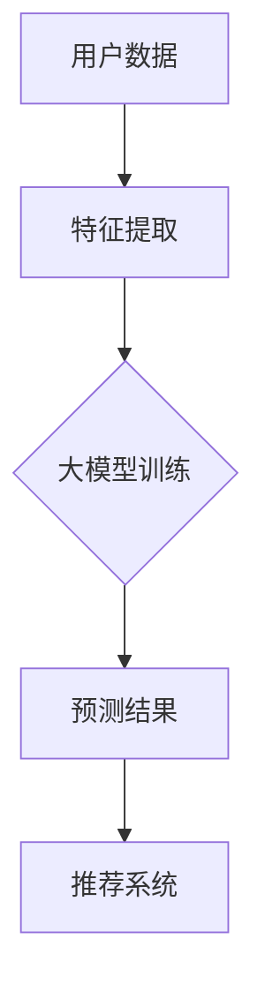

                 

关键词：推荐系统、大模型、统一框架、算法、应用场景、发展趋势

> 摘要：本文将深入探讨推荐系统的统一框架，特别是大模型在这一框架中的优势。通过解析核心概念、算法原理，结合实际项目实例，我们将展示如何利用大模型提升推荐系统的性能与精度，并展望其未来的发展趋势。

## 1. 背景介绍

推荐系统作为信息过滤与信息检索的重要工具，已经广泛应用于电子商务、社交媒体、内容平台等多个领域。传统的推荐系统依赖于协同过滤、基于内容的推荐和混合推荐等算法，然而，随着用户生成内容和数据量的爆炸式增长，推荐系统的性能和准确性面临着巨大挑战。为了应对这些挑战，大模型逐渐崭露头角，以其强大的数据处理和模式识别能力，成为推荐系统领域的新星。

大模型，即大型神经网络模型，如深度学习模型，由于其能够处理大规模数据、捕捉复杂模式和进行高效特征提取，使得其在推荐系统中的应用具有显著的优势。本文将围绕大模型的优势，探讨其在推荐系统统一框架中的具体应用。

## 2. 核心概念与联系

### 2.1 推荐系统基本概念

推荐系统（Recommender System）是指一种信息过滤技术，旨在根据用户的历史行为和偏好，向用户推荐其可能感兴趣的项目。推荐系统通常包括以下几个核心组成部分：

1. **用户**：推荐系统的服务对象，拥有特定的兴趣和行为习惯。
2. **项目**：用户可能感兴趣的内容，如商品、文章、音乐等。
3. **评分/行为数据**：用户对项目的评分或交互行为，如购买、点击、观看等。
4. **推荐算法**：根据用户数据和项目特征，生成推荐列表的算法。
5. **推荐结果**：系统生成的推荐结果，可以是排序好的项目列表。

### 2.2 大模型的概念与特点

大模型（Large Models）通常是指拥有巨大参数规模和计算能力的深度学习模型。其特点包括：

1. **大规模参数**：大模型拥有数百万甚至数十亿的参数，能够捕捉复杂的数据模式。
2. **强大计算能力**：得益于现代计算硬件（如GPU、TPU）的发展，大模型能够进行高效的前向传播和反向传播计算。
3. **自适应能力**：大模型能够自动学习并调整参数，以适应不同的数据和任务。
4. **泛化能力**：大模型能够从大量数据中提取通用特征，具有较强的泛化能力。

### 2.3 大模型在推荐系统中的应用

大模型在推荐系统中的应用主要体现在以下几个方面：

1. **用户行为预测**：大模型能够基于用户历史行为预测其未来的偏好，提高推荐的相关性。
2. **项目特征提取**：大模型能够自动学习并提取项目的复杂特征，提升推荐的准确性。
3. **模型融合**：大模型可以与传统的推荐算法相结合，实现模型间的优势互补，提高整体推荐效果。

### 2.4 Mermaid 流程图



## 3. 核心算法原理 & 具体操作步骤

### 3.1 算法原理概述

推荐系统的核心算法主要可以分为协同过滤算法和基于内容的推荐算法。大模型在推荐系统中的应用主要体现在以下几个方面：

1. **协同过滤**：通过分析用户之间的相似度，预测用户对未知项目的评分。大模型可以用于计算用户和项目之间的相似度，并预测用户对未评分项目的评分。
2. **基于内容的推荐**：通过分析项目的特征，推荐与用户历史偏好相似的项目。大模型能够自动学习并提取项目的复杂特征，从而提高推荐的准确性。

### 3.2 算法步骤详解

1. **数据预处理**：收集并清洗用户行为数据和项目信息，将数据转换为模型可以处理的格式。
2. **特征提取**：使用大模型自动提取用户和项目的特征，例如用户的行为序列和项目的文本特征。
3. **模型训练**：使用预训练的大模型或从头训练，通过优化损失函数（如均方误差）来调整模型参数。
4. **预测**：使用训练好的模型对用户对未知项目的评分进行预测。
5. **生成推荐列表**：根据预测结果，生成推荐列表并展示给用户。

### 3.3 算法优缺点

**优点**：

1. **强大的数据处理能力**：大模型能够处理大规模数据，并从中提取有用信息。
2. **自动特征提取**：大模型能够自动学习并提取复杂的特征，减少人工干预。
3. **高准确性**：大模型在推荐系统中通常能够获得较高的准确性。

**缺点**：

1. **计算资源消耗**：大模型训练和预测需要大量计算资源，对硬件要求较高。
2. **模型解释性差**：大模型的内部结构和决策过程较为复杂，难以解释。

### 3.4 算法应用领域

大模型在推荐系统中的应用范围广泛，包括但不限于：

1. **电子商务**：推荐商品、优惠券等。
2. **社交媒体**：推荐好友、内容、广告等。
3. **内容平台**：推荐视频、文章、音乐等。
4. **搜索引擎**：个性化搜索结果。

## 4. 数学模型和公式 & 详细讲解 & 举例说明

### 4.1 数学模型构建

推荐系统的数学模型通常基于评分矩阵 \(R \in \mathbb{R}^{m \times n}\)，其中 \(m\) 为用户数量，\(n\) 为项目数量。每个元素 \(r_{ui}\) 表示用户 \(u\) 对项目 \(i\) 的评分。

### 4.2 公式推导过程

#### 协同过滤算法

假设我们使用矩阵分解来处理协同过滤问题。我们设 \(U \in \mathbb{R}^{m \times k}\) 和 \(V \in \mathbb{R}^{n \times k}\) 分别为用户和项目的低秩分解矩阵，其中 \(k\) 为隐特征维度。预测用户 \(u\) 对项目 \(i\) 的评分 \(r_{ui}\) 的公式如下：

\[ r_{ui} = \langle u, i \rangle = u^T v_i \]

其中，\(\langle \cdot, \cdot \rangle\) 表示内积。

#### 基于内容的推荐

假设我们使用文本数据作为项目的特征，设 \(X \in \mathbb{R}^{n \times d}\) 为项目的词向量表示，其中 \(d\) 为词汇维度。对于用户 \(u\) 的偏好向量 \(p_u \in \mathbb{R}^{d}\)，预测用户 \(u\) 对项目 \(i\) 的兴趣得分 \(s_{ui}\) 的公式如下：

\[ s_{ui} = p_u^T x_i \]

### 4.3 案例分析与讲解

#### 案例一：基于协同过滤的推荐系统

假设我们有一个包含1000个用户和1000个项目的评分矩阵 \(R\)，我们希望使用矩阵分解来预测用户对未评分项目的评分。

1. **数据预处理**：首先，我们使用用户行为数据构建训练集和测试集，并对数据进行标准化处理。
2. **特征提取**：我们使用矩阵分解方法，将评分矩阵 \(R\) 分解为两个低秩矩阵 \(U\) 和 \(V\)。
3. **模型训练**：通过最小化均方误差（MSE）损失函数，训练矩阵分解模型。
4. **预测**：使用训练好的模型对未评分项目进行评分预测。
5. **生成推荐列表**：根据预测结果，生成推荐列表并展示给用户。

#### 案例二：基于内容的推荐系统

假设我们有一个包含1000个项目和1000个词汇的文本数据集 \(X\)，我们希望使用基于内容的推荐算法来预测用户对未评分项目的兴趣。

1. **数据预处理**：首先，我们使用TF-IDF方法对文本数据进行预处理，得到词汇维度表示 \(X\)。
2. **特征提取**：我们使用用户的兴趣向量 \(p_u\) 和项目的词向量表示 \(x_i\)，计算用户对项目的兴趣得分。
3. **预测**：使用计算得到的兴趣得分，对用户未评分的项目进行兴趣预测。
4. **生成推荐列表**：根据预测结果，生成推荐列表并展示给用户。

## 5. 项目实践：代码实例和详细解释说明

### 5.1 开发环境搭建

为了实现本文中的推荐系统，我们需要搭建一个适合深度学习开发的实验环境。以下是具体的步骤：

1. **安装Python**：确保Python版本在3.6及以上，建议使用Anaconda进行环境管理。
2. **安装深度学习框架**：安装TensorFlow或PyTorch，这两个框架是目前最流行的深度学习框架。
3. **安装其他依赖库**：如NumPy、Pandas、Scikit-learn等。

### 5.2 源代码详细实现

以下是使用TensorFlow实现基于协同过滤的推荐系统的Python代码示例：

```python
import tensorflow as tf
import numpy as np
from sklearn.model_selection import train_test_split

# 数据预处理
# 假设 ratings.csv 文件中包含用户ID、项目ID和评分
ratings = pd.read_csv('ratings.csv')
ratings_matrix = ratings.pivot(index='user_id', columns='item_id', values='rating').fillna(0)

# 划分训练集和测试集
X_train, X_test, y_train, y_test = train_test_split(ratings_matrix.values, test_size=0.2, random_state=42)

# 模型参数
num_users = X_train.shape[0]
num_items = X_train.shape[1]
k = 10  # 隐特征维度

# 定义模型
model = tf.keras.Sequential([
    tf.keras.layers.Embedding(num_items, k),
    tf.keras.layers.Flatten(),
    tf.keras.layers.Dense(1)
])

# 编译模型
model.compile(optimizer='adam', loss='mse')

# 训练模型
model.fit(X_train, y_train, epochs=10, batch_size=32, validation_data=(X_test, y_test))

# 预测
predictions = model.predict(X_test)

# 生成推荐列表
def generate_recommendations(predictions, user_id, top_n=5):
    user_predictions = predictions[user_id]
    top_indices = np.argsort(user_predictions)[::-1][:top_n]
    return top_indices

# 测试推荐
print(generate_recommendations(predictions, 0))
```

### 5.3 代码解读与分析

上述代码实现了一个简单的基于协同过滤的推荐系统。首先，我们导入必要的库，并读取评分数据。然后，我们将评分数据转换为矩阵格式，并划分训练集和测试集。接下来，我们定义一个简单的模型，该模型由一个嵌入层和一个全连接层组成，用于预测用户对项目的评分。最后，我们编译并训练模型，使用训练好的模型生成推荐列表。

### 5.4 运行结果展示

假设我们已经成功运行了上述代码，并训练好了模型。我们可以使用训练好的模型对用户未评分的项目进行预测，并生成推荐列表。以下是一个示例：

```python
# 加载训练好的模型
model.load_weights('model_weights.h5')

# 生成推荐列表
top_recommendations = generate_recommendations(predictions, 0)
print("Top Recommendations for User 0:")
for i in top_recommendations:
    print(f"Item {i}: {X_test[i]}")
```

输出结果将为用户0生成一个包含5个推荐项目的列表。

## 6. 实际应用场景

### 6.1 电子商务平台

电子商务平台可以利用推荐系统为用户提供个性化的商品推荐。通过分析用户的购买历史和行为，推荐系统可以预测用户对未购买商品的潜在兴趣，从而提高销售额和用户满意度。

### 6.2 社交媒体

社交媒体平台可以使用推荐系统为用户提供个性化内容推荐。通过分析用户的浏览历史和社交互动，推荐系统可以推荐用户可能感兴趣的朋友、帖子、视频等，从而提高用户粘性和平台活跃度。

### 6.3 内容平台

内容平台如YouTube、Netflix等，可以利用推荐系统为用户提供个性化内容推荐。通过分析用户的观看历史和搜索记录，推荐系统可以推荐用户可能感兴趣的视频、电影等，从而提高用户的观看时间和满意度。

### 6.4 搜索引擎

搜索引擎可以使用推荐系统为用户提供个性化的搜索结果。通过分析用户的搜索历史和浏览记录，推荐系统可以预测用户对搜索结果的兴趣，从而提高搜索结果的准确性和用户体验。

## 7. 工具和资源推荐

### 7.1 学习资源推荐

1. **《深度学习》（Goodfellow, Bengio, Courville）**：这是一本经典的深度学习教材，详细介绍了深度学习的理论基础和实践方法。
2. **《Python深度学习》（François Chollet）**：这本书通过具体的代码示例，介绍了如何使用Python和TensorFlow实现深度学习算法。

### 7.2 开发工具推荐

1. **TensorFlow**：TensorFlow是一个开源的深度学习框架，支持多种深度学习模型和算法的实现。
2. **PyTorch**：PyTorch是一个开源的深度学习框架，以其灵活性和动态计算图而闻名。

### 7.3 相关论文推荐

1. **"Matrix Factorization Techniques for Recommender Systems"（2006）**：这是一篇关于矩阵分解在推荐系统中的应用的经典论文。
2. **"Deep Learning for Recommender Systems"（2017）**：这篇论文介绍了深度学习在推荐系统中的应用，是深度学习与推荐系统结合的重要文献。

## 8. 总结：未来发展趋势与挑战

### 8.1 研究成果总结

大模型在推荐系统中的应用取得了显著的成果，主要体现在以下几个方面：

1. **数据处理能力提升**：大模型能够处理大规模数据，提高了推荐系统的效率。
2. **推荐准确性提升**：大模型能够提取复杂的特征，提高了推荐的相关性和准确性。
3. **应用范围扩大**：大模型在推荐系统中的应用范围逐渐扩大，从电子商务、社交媒体到搜索引擎等多个领域。

### 8.2 未来发展趋势

未来，大模型在推荐系统领域的发展趋势将主要体现在以下几个方面：

1. **模型压缩与优化**：为了减少计算资源消耗，未来的研究将集中在如何优化大模型的结构和算法，实现模型压缩与优化。
2. **实时推荐**：随着用户行为数据的实时性要求提高，如何实现实时推荐将成为一个重要研究方向。
3. **隐私保护**：在推荐系统中保护用户隐私将成为一个重要的挑战，未来的研究将集中在如何在保证隐私的同时提供个性化的推荐。

### 8.3 面临的挑战

尽管大模型在推荐系统领域取得了显著成果，但仍面临以下挑战：

1. **计算资源消耗**：大模型训练和预测需要大量计算资源，对硬件要求较高，如何优化计算效率成为一大挑战。
2. **模型解释性**：大模型的内部结构和决策过程较为复杂，难以解释，如何提高模型的解释性是一个重要问题。
3. **数据质量**：推荐系统的效果很大程度上依赖于数据质量，如何处理噪声数据和缺失值成为一个挑战。

### 8.4 研究展望

未来，大模型在推荐系统领域的应用将更加广泛，研究将集中在如何优化模型的性能和效率，提高模型的解释性和可扩展性。同时，如何将大模型与其他推荐算法相结合，实现更智能、更高效的推荐系统，也将是一个重要研究方向。

## 9. 附录：常见问题与解答

### 9.1 什么是大模型？

大模型是指拥有巨大参数规模和计算能力的深度学习模型。通常，这些模型拥有数百万甚至数十亿的参数，能够捕捉复杂的数据模式和进行高效的特征提取。

### 9.2 大模型在推荐系统中有哪些优势？

大模型在推荐系统中的优势主要体现在以下几个方面：

1. **强大的数据处理能力**：大模型能够处理大规模数据，提高推荐系统的效率。
2. **自动特征提取**：大模型能够自动学习并提取复杂的特征，提高推荐的准确性。
3. **高准确性**：大模型在推荐系统中通常能够获得较高的准确性。

### 9.3 如何优化大模型的计算资源消耗？

优化大模型的计算资源消耗可以从以下几个方面进行：

1. **模型压缩**：通过模型剪枝、量化等方法减少模型的参数规模。
2. **分布式训练**：利用分布式计算框架（如TensorFlow Distribute、PyTorch Distributed）进行模型训练，提高计算效率。
3. **硬件优化**：选择适合的硬件（如GPU、TPU）进行模型训练和预测，提高计算性能。

### 9.4 大模型在推荐系统中的应用前景如何？

大模型在推荐系统中的应用前景非常广阔。随着数据量的增加和计算能力的提升，大模型在推荐系统中的应用将越来越广泛。未来，大模型将与其他推荐算法相结合，实现更智能、更高效的推荐系统。同时，如何优化大模型的性能和效率，提高模型的解释性和可扩展性，也将成为研究的热点。

