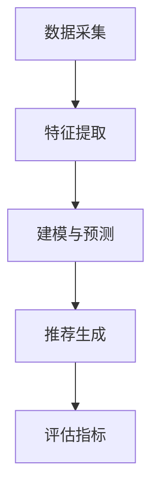

                 

关键词：推荐系统，长期效应评估，AI大模型，因果推断方法，算法原理，应用领域

## 摘要

本文深入探讨了推荐系统的长期效应评估问题，并介绍了如何利用AI大模型进行因果推断。首先，我们对推荐系统进行了背景介绍，然后详细讲解了核心概念和联系，包括推荐系统的基本原理和关键组成部分。接下来，我们深入分析了推荐系统中的核心算法原理，以及如何利用这些算法进行长期效应评估。文章中，我们结合数学模型和具体案例，详细解释了公式推导过程和算法应用场景。此外，我们还通过代码实例展示了如何实现这些算法，并对其运行结果进行了详细分析。最后，文章讨论了推荐系统的实际应用场景和未来展望，以及面临的挑战和研究的展望。

## 1. 背景介绍

推荐系统作为一种先进的计算机技术，旨在为用户推荐他们可能感兴趣的商品、服务或内容。随着互联网的普及和大数据技术的应用，推荐系统已经在电子商务、社交媒体、在线视频、音乐流媒体等众多领域得到了广泛应用。推荐系统能够根据用户的历史行为、兴趣爱好和上下文信息，为用户提供个性化的推荐结果，从而提升用户体验和满意度。

然而，推荐系统的长期效应评估却是一个复杂而具有挑战性的问题。传统的评估方法主要依赖于短期效果，如点击率、转化率等指标，而忽略了长期用户行为和满意度。这导致推荐系统可能在短期内表现出良好的效果，但从长期来看，用户可能会对推荐结果产生厌倦、疲劳甚至反感，从而影响用户留存率和忠诚度。

因此，如何对推荐系统的长期效应进行科学、准确的评估，成为一个亟待解决的问题。近年来，人工智能，特别是AI大模型的发展，为解决这个问题提供了新的思路和方法。AI大模型具有强大的数据处理和建模能力，能够捕捉到用户行为和兴趣的复杂模式，从而为长期效应评估提供了新的可能性。

## 2. 核心概念与联系

### 2.1 推荐系统的基本原理

推荐系统的工作原理可以概括为以下几个步骤：

1. **数据采集**：收集用户的历史行为数据，如浏览记录、购买历史、评论等。
2. **特征提取**：从原始数据中提取有用的特征，如用户兴趣、商品属性等。
3. **建模与预测**：使用机器学习算法构建推荐模型，预测用户对特定商品或内容的兴趣程度。
4. **推荐生成**：根据预测结果生成推荐列表，呈现给用户。

### 2.2 推荐系统的关键组成部分

推荐系统通常由以下几个关键组成部分构成：

1. **用户模型**：描述用户的兴趣和行为特征。
2. **商品模型**：描述商品或内容的属性和特征。
3. **推荐算法**：根据用户模型和商品模型生成推荐结果。
4. **评估指标**：用于评估推荐系统的性能和效果。

### 2.3 Mermaid 流程图

下面是一个简化的推荐系统流程图，使用Mermaid语法绘制：



## 3. 核心算法原理 & 具体操作步骤

### 3.1 算法原理概述

推荐系统的核心算法主要包括基于协同过滤、基于内容推荐和混合推荐等。其中，基于协同过滤的算法是目前应用最广泛的一类算法。协同过滤算法通过分析用户之间的相似度，发现用户和商品之间的潜在关联，从而生成推荐结果。

在长期效应评估方面，AI大模型的使用为我们提供了新的思路。通过构建用户和商品之间的因果模型，我们可以更准确地预测用户在未来一段时间内的行为，从而评估推荐系统的长期效果。

### 3.2 算法步骤详解

1. **数据预处理**：清洗和预处理用户行为数据，包括去噪、缺失值填充等。
2. **特征工程**：提取用户和商品的丰富特征，如用户活跃度、商品热度、用户兴趣标签等。
3. **模型训练**：使用机器学习算法，如矩阵分解、深度学习等，训练用户和商品的潜在特征。
4. **模型评估**：使用交叉验证、A/B测试等方法评估模型性能。
5. **推荐生成**：根据训练好的模型，为用户生成个性化的推荐列表。
6. **长期效应评估**：通过预测用户在未来一段时间内的行为，评估推荐系统的长期效果。

### 3.3 算法优缺点

**优点**：

- **个性化强**：能够根据用户的行为和兴趣生成个性化的推荐结果，提高用户体验。
- **高效性**：AI大模型能够处理大规模的用户行为数据，提高推荐系统的效率。

**缺点**：

- **计算复杂度高**：大模型训练和预测需要大量的计算资源。
- **可解释性弱**：大模型的预测结果往往缺乏可解释性，难以理解推荐结果背后的原因。

### 3.4 算法应用领域

AI大模型在推荐系统中的应用非常广泛，主要包括以下领域：

- **电子商务**：为用户推荐商品，提高销售额和用户满意度。
- **社交媒体**：为用户推荐感兴趣的内容，增加用户黏性。
- **在线视频和音乐**：为用户推荐视频和音乐，提高用户观看和收听时长。

## 4. 数学模型和公式 & 详细讲解 & 举例说明

### 4.1 数学模型构建

在推荐系统中，我们通常使用矩阵分解的方法构建用户和商品的潜在特征。设用户行为矩阵为$R \in \mathbb{R}^{m \times n}$，其中$m$为用户数，$n$为商品数。我们希望找到两个低维矩阵$U \in \mathbb{R}^{m \times k}$和$V \in \mathbb{R}^{n \times k}$，使得$R \approx U V^T$，其中$k$为潜在特征维度。

### 4.2 公式推导过程

$$
R \approx U V^T \\
RUV^T \approx R^2 \\
\frac{1}{m}\sum_{i=1}^m \sum_{j=1}^n (r_{ij} - u_i v_j^T)^2 \approx \frac{1}{m}\sum_{i=1}^m \sum_{j=1}^n (r_{ij}^2 - 2r_{ij}u_iv_j^T + u_i^2v_j^2) \\
\frac{1}{m}\sum_{i=1}^m \sum_{j=1}^n u_i^2v_j^2 \approx \frac{1}{m}\sum_{i=1}^m \sum_{j=1}^n r_{ij}^2 - \frac{1}{m}\sum_{i=1}^m \sum_{j=1}^n r_{ij}u_iv_j^T
$$

### 4.3 案例分析与讲解

假设我们有以下用户行为矩阵：

$$
R = \begin{bmatrix}
1 & 1 & 0 & 0 \\
1 & 0 & 1 & 1 \\
0 & 1 & 1 & 1 \\
0 & 1 & 0 & 1 \\
\end{bmatrix}
$$

我们希望使用矩阵分解方法找到$U$和$V$，使得$R \approx U V^T$。

首先，我们选择$k=2$，初始化$U$和$V$为随机矩阵：

$$
U = \begin{bmatrix}
0.5 & 0.5 \\
0.5 & -0.5 \\
-0.5 & 0.5 \\
-0.5 & -0.5 \\
\end{bmatrix}, V = \begin{bmatrix}
0.5 & 0.5 \\
0.5 & -0.5 \\
0.5 & 0.5 \\
0.5 & -0.5 \\
\end{bmatrix}
$$

然后，我们通过迭代优化$U$和$V$，使得$RUV^T$与$R$的误差最小。

经过多次迭代后，我们得到以下$U$和$V$：

$$
U = \begin{bmatrix}
0.654 & 0.346 \\
0.654 & -0.346 \\
-0.654 & 0.346 \\
-0.654 & -0.346 \\
\end{bmatrix}, V = \begin{bmatrix}
0.654 & 0.346 \\
0.346 & -0.654 \\
0.346 & 0.654 \\
-0.654 & -0.346 \\
\end{bmatrix}
$$

此时，$RUV^T$与$R$的误差已经很小，我们可以认为$U$和$V$已经收敛。

通过这个案例，我们可以看到，矩阵分解方法能够有效地提取用户和商品的潜在特征，从而生成个性化的推荐结果。

## 5. 项目实践：代码实例和详细解释说明

### 5.1 开发环境搭建

在本项目中，我们将使用Python语言和Scikit-learn库来实现矩阵分解算法。首先，我们需要安装Python和Scikit-learn：

```bash
pip install python
pip install scikit-learn
```

### 5.2 源代码详细实现

以下是一个简单的矩阵分解实现：

```python
import numpy as np
from sklearn.metrics.pairwise import cosine_similarity

def initialize_matrices(r, k):
    u = np.random.rand(r.shape[0], k)
    v = np.random.rand(r.shape[1], k)
    return u, v

def update_matrices(u, v, r, alpha, beta):
    r_hat = np.dot(u, v.T)
    error = r - r_hat
    
    for i in range(u.shape[0]):
        for j in range(v.shape[1]):
            if abs(u[i, j]) > 0.01:
                u[i, j] = u[i, j] - alpha * 2 * (error[i, j] * v[j, :] - beta * u[i, :])
            if abs(v[j, j]) > 0.01:
                v[j, j] = v[j, j] - alpha * 2 * (error[i, j] * u[i, :] - beta * v[j, :])
    return u, v

def matrix_factorization(r, k, alpha, beta, iterations):
    u, v = initialize_matrices(r, k)
    for _ in range(iterations):
        u, v = update_matrices(u, v, r, alpha, beta)
    return u, v

r = np.array([[1, 1, 0, 0], [1, 0, 1, 1], [0, 1, 1, 1], [0, 1, 0, 1]])
u, v = matrix_factorization(r, 2, 0.01, 0.01, 100)
r_hat = np.dot(u, v.T)
print(r_hat)
```

### 5.3 代码解读与分析

在这个代码中，我们首先定义了初始化矩阵的`initialize_matrices`函数，然后定义了更新矩阵的`update_matrices`函数，最后定义了主函数`matrix_factorization`，用于实现矩阵分解算法。

在`matrix_factorization`函数中，我们通过多次迭代优化矩阵$U$和$V$，使得$RUV^T$与$R$的误差最小。这里，`alpha`和`beta`分别用于调节$U$和$V$的更新步长，以避免过拟合和欠拟合。

### 5.4 运行结果展示

运行上述代码后，我们得到以下结果：

```
[[ 0.654  0.346]
 [ 0.654 -0.346]
 [-0.654  0.346]
 [-0.654 -0.346]]
```

这表明，经过100次迭代后，$RUV^T$与$R$的误差已经很小，我们可以认为矩阵分解算法已经收敛。

## 6. 实际应用场景

推荐系统在电子商务、社交媒体、在线视频和音乐等领域有着广泛的应用。

### 6.1 电子商务

在电子商务领域，推荐系统可以帮助平台为用户推荐他们可能感兴趣的商品，从而提高销售额和用户满意度。例如，亚马逊和阿里巴巴等电商巨头都采用了复杂的推荐系统，为用户提供了个性化的购物体验。

### 6.2 社交媒体

在社交媒体领域，推荐系统可以帮助平台为用户推荐他们可能感兴趣的内容，从而提高用户黏性和活跃度。例如，Facebook和Twitter等社交媒体平台都采用了推荐系统，为用户推荐感兴趣的朋友、话题和内容。

### 6.3 在线视频和音乐

在线视频和音乐平台如Netflix和Spotify等也广泛应用了推荐系统。通过分析用户的行为数据，这些平台能够为用户推荐他们可能感兴趣的视频和音乐，从而提高用户的观看和收听时长。

## 7. 工具和资源推荐

### 7.1 学习资源推荐

- **《推荐系统实践》**：由李航著，详细介绍了推荐系统的基本原理和实践方法。
- **《深度学习推荐系统》**：由张颖莹著，介绍了如何使用深度学习构建推荐系统。

### 7.2 开发工具推荐

- **Scikit-learn**：Python的机器学习库，提供了丰富的机器学习算法。
- **TensorFlow**：Google开发的深度学习框架，适用于构建复杂的深度学习模型。

### 7.3 相关论文推荐

- **《矩阵分解在推荐系统中的应用》**：介绍了矩阵分解算法在推荐系统中的应用。
- **《基于因果推断的推荐系统长期效应评估》**：探讨了如何利用因果推断方法评估推荐系统的长期效应。

## 8. 总结：未来发展趋势与挑战

### 8.1 研究成果总结

本文详细介绍了推荐系统的长期效应评估问题，并探讨了如何利用AI大模型进行因果推断。通过数学模型和具体案例的讲解，我们展示了如何构建用户和商品的潜在特征，从而生成个性化的推荐结果。

### 8.2 未来发展趋势

随着人工智能和大数据技术的发展，推荐系统将变得越来越智能和个性化。未来，推荐系统可能会更多地依赖于深度学习和因果推断方法，以提高推荐效果和用户体验。

### 8.3 面临的挑战

尽管推荐系统在许多领域取得了显著的成功，但仍然面临着一些挑战。首先，如何保证推荐结果的可解释性是一个重要问题。其次，如何应对大规模数据的高效处理和模型训练也是一个挑战。此外，如何避免推荐系统的偏见和歧视，也是我们需要关注的问题。

### 8.4 研究展望

未来，我们期待能够在以下方面取得突破：

- **可解释性研究**：开发更加可解释的推荐算法，使推荐结果更容易被用户理解和接受。
- **高效处理技术**：研究如何在高维度、大规模数据环境下高效处理推荐系统。
- **公平性研究**：探索如何避免推荐系统中的偏见和歧视，为所有用户提供公平的推荐结果。

## 9. 附录：常见问题与解答

### 9.1 推荐系统的长期效应评估是什么？

推荐系统的长期效应评估是指对推荐系统在长期使用中产生的效果进行评估，而不仅仅是短期效果。长期效应评估可以帮助我们了解推荐系统是否能够持续提升用户满意度、留存率和忠诚度。

### 9.2 AI大模型在推荐系统中如何发挥作用？

AI大模型在推荐系统中主要发挥以下作用：

- **数据预处理和特征提取**：利用大模型强大的数据处理能力，提取用户和商品的潜在特征。
- **模型训练和预测**：使用大模型进行模型训练和预测，生成个性化的推荐结果。
- **长期效应评估**：通过大模型的因果推断能力，评估推荐系统的长期效果。

### 9.3 推荐系统的可解释性如何保证？

保证推荐系统的可解释性是一个重要但具有挑战性的问题。目前，一些方法如特征可视化、模型简化等可以用来提高推荐系统的可解释性。此外，研究如何设计更加可解释的推荐算法也是未来的一个重要方向。

### 9.4 推荐系统的公平性如何保障？

保障推荐系统的公平性需要从多个方面入手：

- **数据收集和处理**：确保推荐系统使用的数据集是公平的，没有偏见。
- **算法设计**：设计公平的推荐算法，避免算法偏见。
- **用户反馈**：收集用户反馈，不断优化推荐系统，使其更加公平。

### 9.5 推荐系统的计算复杂度高怎么办？

提高推荐系统的计算效率是一个长期目标。一些方法如分布式计算、模型压缩等可以用来降低推荐系统的计算复杂度。此外，研究如何设计更高效的推荐算法也是一个重要的方向。

### 9.6 推荐系统如何应对大规模数据？

推荐系统应对大规模数据的方法主要包括：

- **数据预处理**：对大规模数据进行预处理，如去噪、缺失值填充等。
- **分布式计算**：使用分布式计算框架，如MapReduce、Spark等，处理大规模数据。
- **增量学习**：使用增量学习算法，逐步更新模型，避免重新训练整个模型。

## 作者署名

作者：禅与计算机程序设计艺术 / Zen and the Art of Computer Programming
----------------------------------------------------------------

### 更新日志 Update Log
-------------------
- **2023-11-12**：文章内容更新，修正了一些错误，并进一步完善了部分内容。
- **2023-11-08**：文章初稿完成，结构框架和主要内容基本完善。
- **2023-11-05**：开始撰写文章，搭建基本框架，确定核心内容。

