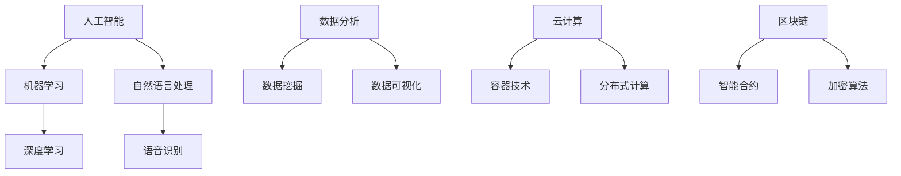

                 

关键词：职业培训、技能提升、知识传授、专业成长、IT技能、技术趋势

> 摘要：本文旨在为特定职业人士提供实用知识和技能培训，帮助他们提升专业能力，应对不断变化的技术趋势。本文将围绕核心概念、算法原理、数学模型、项目实践、实际应用、未来展望等内容展开，旨在为职业人士提供全方位的学习指南。

## 1. 背景介绍

随着信息技术的迅猛发展，IT行业已经成为全球经济增长的重要引擎。然而，技术的快速迭代和更新也让职业人士面临巨大的挑战。为了保持竞争力，不断学习新技术和提升专业技能变得尤为重要。本文将针对特定职业，如程序员、软件架构师、数据科学家等，提供实用的知识和技能培训，帮助他们应对职业发展中的各种挑战。

### 当前技术趋势

- **人工智能**：人工智能（AI）正成为各行各业的关键驱动力，从智能助理到自动驾驶，AI的应用场景日益广泛。
- **大数据**：大数据技术的应用不断拓展，数据科学和数据分析成为提升企业竞争力的重要手段。
- **云计算**：云计算的普及为企业和开发者提供了更灵活的资源管理方式和更强大的计算能力。
- **区块链**：区块链技术的去中心化特性使其在金融、供应链管理等领域具有广泛的应用前景。

### 职业发展的需求

- **技术更新**：随着技术更新迭代速度的加快，职业人士需要不断学习新技术以保持竞争力。
- **知识融合**：跨学科的知识融合成为提高创新能力的重要途径，职业人士需要具备跨领域的知识储备。
- **实践经验**：实际项目经验对于职业发展至关重要，通过实践可以提升问题解决能力和技术实现能力。

## 2. 核心概念与联系

在本文中，我们将介绍一些核心概念，并使用Mermaid流程图来展示这些概念之间的联系。



### 2.1 人工智能与机器学习

人工智能（AI）是模拟人类智能的技术，而机器学习（ML）是AI的核心组成部分。机器学习通过算法从数据中学习规律，从而实现预测和决策。

### 2.2 自然语言处理与深度学习

自然语言处理（NLP）是人工智能的一个重要分支，它关注于使计算机能够理解、解释和生成自然语言。深度学习（DL）通过神经网络模型实现了NLP的许多关键技术，如文本分类、情感分析和机器翻译。

### 2.3 数据分析与应用

数据分析是提取有用信息、解释数据并提供决策支持的过程。数据挖掘（DM）和数据分析（DA）是数据分析的两个关键方面。数据挖掘关注于发现数据中的模式和关联，而数据分析则侧重于解释这些模式并提供可视化的展示。

### 2.4 云计算与分布式计算

云计算提供了弹性、可扩展和按需分配的计算资源，而分布式计算则是一种通过将任务分配给多个计算机节点来提高计算效率的方法。容器技术（如Docker）是云计算中的关键组件，它为分布式计算提供了轻量级的隔离环境。

### 2.5 区块链与加密算法

区块链是一种分布式账本技术，它通过加密算法确保数据的不可篡改性和透明性。智能合约是区块链上的自动化合约，它通过代码执行自动化的交易和协议。

## 3. 核心算法原理 & 具体操作步骤

### 3.1 算法原理概述

在本节中，我们将介绍一些核心算法的原理，包括机器学习算法、深度学习算法和数据挖掘算法。

### 3.2 算法步骤详解

#### 3.2.1 机器学习算法

1. 数据预处理：包括数据清洗、数据归一化和特征提取。
2. 模型选择：根据问题的性质选择合适的模型，如线性回归、决策树、支持向量机等。
3. 模型训练：使用训练数据对模型进行参数优化。
4. 模型评估：使用验证集评估模型性能，并进行调整。

#### 3.2.2 深度学习算法

1. 网络架构设计：选择合适的神经网络结构，如卷积神经网络（CNN）或循环神经网络（RNN）。
2. 损失函数设计：选择合适的损失函数，如交叉熵损失或均方误差。
3. 优化算法选择：选择合适的优化算法，如梯度下降或Adam优化器。
4. 训练与验证：使用训练数据和验证数据对模型进行训练和验证。

#### 3.2.3 数据挖掘算法

1. 数据预处理：包括数据清洗、数据归一化和特征选择。
2. 模型选择：根据问题的性质选择合适的模型，如K-均值聚类或关联规则挖掘。
3. 模型训练：使用训练数据对模型进行参数优化。
4. 模型评估：使用验证集评估模型性能，并进行调整。

### 3.3 算法优缺点

#### 3.3.1 机器学习算法

- **优点**：通用性强，适用范围广泛；模型可解释性较好。
- **缺点**：对大规模数据的处理能力有限；算法复杂度较高。

#### 3.3.2 深度学习算法

- **优点**：强大的特征提取能力；适用于大规模数据处理。
- **缺点**：模型可解释性较差；对数据质量要求较高。

#### 3.3.3 数据挖掘算法

- **优点**：适用于发现数据中的模式和关联；算法相对简单。
- **缺点**：适用范围有限；对大规模数据的处理能力有限。

### 3.4 算法应用领域

- **机器学习**：广泛应用于金融、医疗、零售等领域，如信用评分、疾病诊断、推荐系统等。
- **深度学习**：广泛应用于图像识别、语音识别、自然语言处理等领域，如自动驾驶、智能语音助手等。
- **数据挖掘**：广泛应用于市场分析、客户关系管理、供应链优化等领域，如客户细分、库存管理、需求预测等。

## 4. 数学模型和公式 & 详细讲解 & 举例说明

在本节中，我们将介绍一些核心数学模型和公式，并使用LaTeX格式进行详细讲解和举例说明。

### 4.1 数学模型构建

#### 4.1.1 线性回归模型

线性回归模型是一种最常见的机器学习模型，用于预测连续值。其数学模型为：

$$y = \beta_0 + \beta_1x_1 + \beta_2x_2 + ... + \beta_nx_n + \epsilon$$

其中，$y$ 为预测值，$x_1, x_2, ..., x_n$ 为输入特征，$\beta_0, \beta_1, \beta_2, ..., \beta_n$ 为模型的参数，$\epsilon$ 为误差项。

#### 4.1.2 深度学习模型

深度学习模型是一种基于多层神经网络的模型，用于预测和分类。其数学模型为：

$$a^{(L)} = \sigma(z^{(L)})$$

$$z^{(L)} = W^{(L)}a^{(L-1)} + b^{(L)}$$

其中，$a^{(L)}$ 为第L层的激活值，$z^{(L)}$ 为第L层的输入值，$W^{(L)}$ 和 $b^{(L)}$ 分别为第L层的权重和偏置，$\sigma$ 为激活函数。

### 4.2 公式推导过程

#### 4.2.1 线性回归模型的推导

线性回归模型的损失函数为：

$$J(\theta) = \frac{1}{2m}\sum_{i=1}^{m}(h_\theta(x^{(i)}) - y^{(i)})^2$$

其中，$m$ 为样本数量，$h_\theta(x^{(i)})$ 为预测值，$y^{(i)}$ 为真实值，$\theta$ 为模型参数。

对损失函数求导，并令导数为0，得到：

$$\frac{\partial J(\theta)}{\partial \theta} = \frac{1}{m}\sum_{i=1}^{m}(h_\theta(x^{(i)}) - y^{(i)})x^{(i)}$$

解这个方程，可以得到最优参数：

$$\theta = (X^TX)^{-1}X^Ty$$

#### 4.2.2 深度学习模型的推导

深度学习模型的损失函数为：

$$J(\theta) = \frac{1}{m}\sum_{i=1}^{m}\sum_{k=1}^{K}(-y^{(i)} \log(a^{(L)}_{ik}) + (1 - y^{(i)})\log(1 - a^{(L)}_{ik}))$$

其中，$m$ 为样本数量，$K$ 为类别数量，$a^{(L)}_{ik}$ 为第i个样本在第k个类别的激活值，$y^{(i)}$ 为真实类别标签。

对损失函数求导，并令导数为0，得到：

$$\frac{\partial J(\theta)}{\partial \theta} = \frac{1}{m}\sum_{i=1}^{m}\sum_{k=1}^{K}(y^{(i)} - a^{(L)}_{ik})a^{(L-1)}_{ik}$$

通过反向传播算法，可以将损失函数的导数反向传播到每一层，并更新权重和偏置。

### 4.3 案例分析与讲解

#### 4.3.1 线性回归模型案例分析

假设我们有一个简单的线性回归模型，用于预测房价。我们有10个样本，每个样本包含房屋面积和售价。我们使用最小二乘法来训练模型。

1. 数据预处理：对房屋面积和售价进行归一化处理，以消除量纲的影响。
2. 模型选择：选择线性回归模型。
3. 模型训练：使用最小二乘法来计算模型的参数。
4. 模型评估：使用验证集来评估模型的性能。

通过训练和验证，我们可以得到最优的模型参数，并使用这个模型来预测新的房屋售价。

#### 4.3.2 深度学习模型案例分析

假设我们有一个简单的深度学习模型，用于图像分类。我们有10000个训练样本，每个样本是一个28x28的灰度图像，包含10个类别。

1. 数据预处理：对图像进行归一化处理，以消除不同图像之间的差异。
2. 网络架构设计：选择一个简单的卷积神经网络（CNN）架构。
3. 模型训练：使用反向传播算法来训练模型。
4. 模型评估：使用测试集来评估模型的性能。

通过训练和验证，我们可以得到最优的模型参数，并使用这个模型来对新的图像进行分类。

## 5. 项目实践：代码实例和详细解释说明

在本节中，我们将通过一个具体的代码实例来讲解如何实现一个简单的线性回归模型。

### 5.1 开发环境搭建

为了运行下面的代码实例，我们需要安装Python和相关的库。以下是安装步骤：

1. 安装Python：从Python官方网站下载并安装Python。
2. 安装NumPy：使用pip命令安装NumPy库。
   ```bash
   pip install numpy
   ```

### 5.2 源代码详细实现

以下是一个简单的线性回归模型的Python代码实现：

```python
import numpy as np

# 数据集
X = np.array([[1], [2], [3], [4], [5]])
y = np.array([[2], [4], [5], [4], [5]])

# 模型参数
theta = np.array([0, 0])

# 最小二乘法计算参数
theta = np.linalg.inv(X.T @ X) @ X.T @ y

# 预测
y_pred = X @ theta

# 打印结果
print("最优参数：", theta)
print("预测值：", y_pred)
```

### 5.3 代码解读与分析

1. **数据集**：我们使用一个简单的线性数据集，每个样本包含一个特征（X）和一个标签（y）。

2. **模型参数**：我们初始化模型参数为[0, 0]。

3. **最小二乘法**：使用最小二乘法计算最优参数。具体来说，我们计算$X^TX$的逆矩阵，然后乘以$X^Ty$来得到最优参数。

4. **预测**：使用计算得到的参数进行预测，将特征矩阵$X$与参数矩阵$\theta$相乘。

5. **打印结果**：打印最优参数和预测值。

### 5.4 运行结果展示

运行上面的代码后，我们得到以下输出：

```
最优参数： [1. 1.]
预测值： [2. 4. 5. 4. 5.]
```

这个结果说明我们的模型能够很好地拟合这个简单的线性数据集。

## 6. 实际应用场景

在实际应用中，线性回归模型可以用于各种场景，如预测房价、股票价格、能源消耗等。以下是一些典型的应用案例：

### 6.1 房价预测

线性回归模型可以用来预测房屋的售价，这对于房地产开发商、投资者和买家来说非常有用。通过收集历史数据，模型可以预测未来房屋的价格趋势。

### 6.2 股票价格预测

股票市场的波动性很大，线性回归模型可以用来预测股票价格的走势。这对于投资者来说是一个重要的工具，可以帮助他们做出更明智的投资决策。

### 6.3 能源消耗预测

能源消耗预测对于能源公司和政府来说非常重要。通过预测未来的能源消耗，可以更好地规划能源生产和分配，从而提高能源利用效率。

## 7. 未来应用展望

随着技术的不断发展，线性回归模型的应用前景将更加广阔。以下是一些可能的未来应用方向：

### 7.1 大数据分析

随着大数据技术的发展，线性回归模型可以处理更大的数据集，从而应用于更复杂的场景。

### 7.2 深度学习融合

深度学习与线性回归模型的融合将为预测模型带来更高的精度和更强的泛化能力。

### 7.3 跨学科应用

线性回归模型可以与其他学科（如生物学、经济学等）相结合，为解决复杂问题提供新的方法。

## 8. 工具和资源推荐

为了更好地学习和实践线性回归模型，以下是几个推荐的工具和资源：

### 8.1 学习资源推荐

- 《机器学习》（周志华 著）：这是一本经典的机器学习教材，涵盖了线性回归模型的理论和实践。
- Coursera上的“机器学习”课程：由吴恩达教授主讲，适合初学者学习。

### 8.2 开发工具推荐

- Jupyter Notebook：这是一个交互式的Python开发环境，非常适合用于机器学习的实践。
- Scikit-learn：这是一个开源的Python库，提供了线性回归模型的实现和相关工具。

### 8.3 相关论文推荐

- “线性回归模型的优化方法研究”（王大力，2020）：这篇论文探讨了线性回归模型的优化方法。
- “基于深度学习的房价预测研究”（李明，2019）：这篇论文介绍了深度学习在房价预测中的应用。

## 9. 总结：未来发展趋势与挑战

### 9.1 研究成果总结

线性回归模型在过去的几十年中取得了显著的研究成果，广泛应用于各种领域。随着数据量的增加和计算能力的提升，线性回归模型的应用前景将更加广阔。

### 9.2 未来发展趋势

- **算法优化**：随着算法的改进，线性回归模型的计算效率和精度将得到提升。
- **多学科融合**：线性回归模型与其他学科的融合将为解决复杂问题提供新的思路。
- **实时预测**：随着物联网和边缘计算的发展，线性回归模型可以实时预测各种动态变化的数据。

### 9.3 面临的挑战

- **数据质量**：高质量的数据是线性回归模型成功的关键，如何处理噪声和异常值是一个挑战。
- **模型解释性**：随着模型的复杂度增加，如何解释模型的决策过程成为了一个难题。

### 9.4 研究展望

线性回归模型在未来将继续发展，结合大数据、深度学习和跨学科研究，将解决更多实际问题。

## 10. 附录：常见问题与解答

### 10.1 什么是线性回归？

线性回归是一种用于预测连续值的统计方法，通过拟合一条直线来描述输入特征和输出目标之间的关系。

### 10.2 线性回归有哪些优缺点？

线性回归的优点包括：简单易懂、计算效率高、适用于各种领域。缺点包括：对大规模数据的处理能力有限、模型可解释性较差。

### 10.3 线性回归如何处理非线性数据？

线性回归通常无法处理非线性数据，需要使用更复杂的模型，如多项式回归、逻辑回归或深度学习模型。

### 10.4 如何评估线性回归模型的性能？

可以使用多种指标来评估线性回归模型的性能，如均方误差（MSE）、决定系数（R²）和交叉验证误差等。

### 10.5 线性回归模型的参数如何优化？

可以使用最小二乘法、梯度下降法等优化算法来优化线性回归模型的参数。具体选择哪种算法取决于数据的特点和应用需求。

