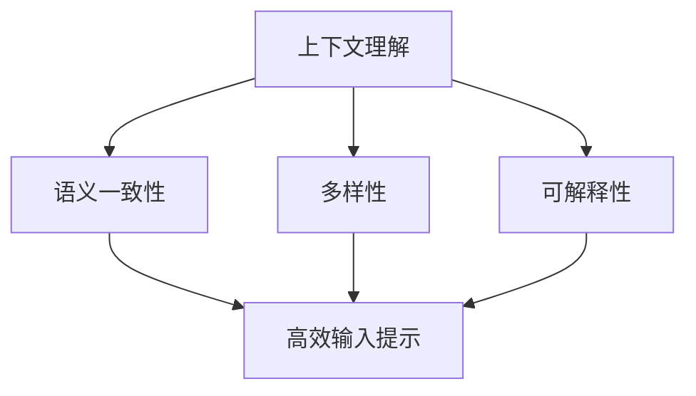

                 

在当今的AI领域，大型语言模型（LLM）以其卓越的自然语言处理能力成为研究和应用的热点。LLM在问答系统、文本生成、机器翻译等多个场景中展现出了巨大的潜力。然而，如何有效地设计输入提示，以最大化LLM的性能和响应质量，是一个值得深入探讨的问题。本文将围绕这一主题，详细解析提示工程的核心概念、算法原理、数学模型以及实际应用场景，旨在为开发者提供一套系统的、可操作的提示设计指南。

## 关键词

- **大型语言模型（LLM）**
- **输入提示设计**
- **自然语言处理（NLP）**
- **提示工程**
- **性能优化**

## 摘要

本文首先介绍了LLM的基本原理和应用场景，随后深入探讨了输入提示设计的重要性。通过对核心概念的详细解释和Mermaid流程图的展示，文章揭示了设计高效输入提示的算法原理。随后，文章通过数学模型和具体实例，阐述了如何在实际项目中应用这些原理。最后，文章总结了LLM输入提示设计的未来趋势与挑战，并推荐了一系列相关工具和资源，以助力开发者提升LLM应用的性能和效果。

## 1. 背景介绍

### 1.1 大型语言模型（LLM）的基本概念

大型语言模型（LLM）是一种基于深度学习的自然语言处理模型，通过学习大量的文本数据，模型能够理解和生成自然语言。LLM的核心在于其巨大的参数规模和强大的上下文理解能力，这使得它们在文本生成、机器翻译、问答系统等任务中表现出色。典型的LLM模型包括GPT（Generative Pre-trained Transformer）系列、BERT（Bidirectional Encoder Representations from Transformers）等。

### 1.2 LLM的应用场景

LLM的应用场景广泛，涵盖了从文本生成到复杂任务的各个方面。在文本生成领域，LLM可以生成新闻文章、产品描述、故事情节等；在机器翻译中，LLM能够提供快速、准确的翻译服务；在问答系统中，LLM可以根据用户的问题提供详细的答案。此外，LLM还在对话系统、文本摘要、情感分析等任务中发挥了重要作用。

### 1.3 提示工程的概念

提示工程是设计如何向LLM提供有效输入提示的过程。有效的输入提示能够引导LLM生成更准确、更有用的输出。提示工程的核心目标是优化输入文本的结构和内容，以提高模型的表现和响应质量。

## 2. 核心概念与联系

### 2.1 核心概念

在设计高效输入提示时，我们需要理解以下几个核心概念：

1. **上下文理解**：LLM需要理解输入文本的上下文，以生成连贯和相关的输出。
2. **语义一致性**：输入提示中的语义应该与预期输出保持一致，以避免模糊或不准确的回答。
3. **多样性**：输入提示应该具备多样性，以促进LLM生成多种可能的输出。
4. **可解释性**：设计提示时，开发者需要考虑模型的可解释性，以便理解模型的决策过程。

### 2.2 核心概念联系与架构

以下是一个简化的Mermaid流程图，展示了设计高效输入提示的各个核心概念之间的联系：



### 2.3 提示工程的核心挑战

在设计高效输入提示时，开发者面临以下核心挑战：

1. **信息过载**：输入文本可能包含大量冗余或不必要的信息，这会干扰模型的上下文理解。
2. **语义歧义**：输入文本中的语义歧义可能导致模型生成不准确或模糊的输出。
3. **多样性控制**：如何在保证准确性的同时，控制输入提示的多样性是一个难题。
4. **模型适应性**：不同的LLM模型可能对输入提示的响应方式不同，因此需要开发适应不同模型的提示设计策略。

## 3. 核心算法原理 & 具体操作步骤

### 3.1 算法原理概述

设计高效输入提示的算法原理主要围绕以下几个方面：

1. **文本预处理**：对输入文本进行预处理，包括去除冗余信息、统一格式等，以提高模型的上下文理解能力。
2. **语义增强**：通过引入语义相关的词汇和短语，增强输入提示的语义一致性。
3. **多样性控制**：采用多种方法，如随机化、模板化等，控制输入提示的多样性。
4. **模型适应性**：根据不同的LLM模型特点，设计特定的提示策略。

### 3.2 算法步骤详解

#### 3.2.1 文本预处理

1. **去除冗余信息**：通过词频统计、停用词列表等方法，识别并删除输入文本中的冗余信息。
2. **统一格式**：对输入文本进行格式统一，如统一使用小写字母、去除标点符号等。

#### 3.2.2 语义增强

1. **关键词提取**：利用词频统计、TF-IDF等方法，提取输入文本中的关键词。
2. **语义相关词汇扩展**：基于词嵌入技术，找到与关键词语义相关的词汇和短语，并将其加入输入提示。

#### 3.2.3 多样性控制

1. **随机化**：对输入提示进行随机化处理，如随机插入无关词汇、改变句子结构等。
2. **模板化**：使用预定义的模板，生成多种可能的输入提示。

#### 3.2.4 模型适应性

1. **模型特性分析**：分析不同LLM模型的特点，如预训练目标、参数规模等。
2. **定制化提示策略**：根据模型特性，设计特定的提示策略，如简化输入文本、增加上下文信息等。

### 3.3 算法优缺点

#### 优点

1. **提高模型性能**：通过优化输入提示，可以提高模型在特定任务上的性能和响应质量。
2. **增强可解释性**：设计有针对性的输入提示，有助于理解模型的决策过程。
3. **多样性控制**：通过随机化和模板化等方法，可以生成多种多样的输入提示，提高模型的泛化能力。

#### 缺点

1. **计算开销**：文本预处理和语义增强等步骤可能需要较大的计算资源。
2. **依赖模型特性**：不同的LLM模型对输入提示的响应方式可能不同，需要针对不同模型设计特定的提示策略。

### 3.4 算法应用领域

1. **问答系统**：优化输入提示，提高问答系统的准确性和响应速度。
2. **文本生成**：通过设计高效的输入提示，生成更丰富、多样化的文本内容。
3. **机器翻译**：优化输入提示，提高翻译的准确性和流畅度。
4. **对话系统**：设计有效的输入提示，提高对话系统的自然度和交互质量。

## 4. 数学模型和公式 & 详细讲解 & 举例说明

### 4.1 数学模型构建

在设计高效输入提示时，我们可以引入以下数学模型：

1. **词嵌入模型**：通过词嵌入技术，将词汇映射到低维向量空间，以增强语义一致性。
2. **概率模型**：使用概率模型，如贝叶斯网络或隐马尔可夫模型，预测输入文本中词汇的概率分布。

### 4.2 公式推导过程

#### 词嵌入模型

假设词汇集合为 \( V \)，词嵌入维度为 \( d \)，词汇 \( w \) 的嵌入向量为 \( \mathbf{e}_w \)。词嵌入模型的核心公式为：

$$
\mathbf{e}_w = \text{sigmoid}(\mathbf{W} \mathbf{v}_w + \mathbf{b})
$$

其中，\( \mathbf{W} \) 为权重矩阵，\( \mathbf{v}_w \) 为词汇 \( w \) 的向量表示，\( \mathbf{b} \) 为偏置项，\( \text{sigmoid} \) 函数定义为：

$$
\text{sigmoid}(x) = \frac{1}{1 + e^{-x}}
$$

#### 概率模型

假设词汇 \( w \) 在上下文 \( C \) 中出现的概率为 \( P(w|C) \)，我们可以使用贝叶斯网络进行建模：

$$
P(w|C) = \frac{P(C|w) P(w)}{P(C)}
$$

其中，\( P(C|w) \) 为条件概率，\( P(w) \) 为词汇 \( w \) 的先验概率，\( P(C) \) 为上下文 \( C \) 的概率。

### 4.3 案例分析与讲解

#### 案例一：词嵌入模型

假设我们有一个简单的词汇集合 \( V = \{apple, banana, orange\} \)，我们将这些词汇嵌入到二维空间中。使用 sigmoid 函数，我们可以得到以下词嵌入向量：

$$
\begin{aligned}
\mathbf{e}_{apple} &= \text{sigmoid}(\mathbf{W} \mathbf{v}_{apple} + \mathbf{b}) = (0.6, 0.8) \\
\mathbf{e}_{banana} &= \text{sigmoid}(\mathbf{W} \mathbf{v}_{banana} + \mathbf{b}) = (0.3, 0.5) \\
\mathbf{e}_{orange} &= \text{sigmoid}(\mathbf{W} \mathbf{v}_{orange} + \mathbf{b}) = (-0.2, -0.4)
\end{aligned}
$$

通过词嵌入模型，我们可以直观地观察到词汇之间的语义关系。例如，\( \mathbf{e}_{apple} \) 和 \( \mathbf{e}_{banana} \) 更接近，而 \( \mathbf{e}_{orange} \) 更远离其他词汇。

#### 案例二：概率模型

假设我们在一个上下文 \( C \) 中，词汇 \( apple \) 出现的概率为 \( P(apple|C) = 0.7 \)。使用贝叶斯网络，我们可以推导出：

$$
P(C|apple) = \frac{P(apple|C) P(apple)}{P(C)}
$$

其中，\( P(apple) = 0.5 \)，\( P(C) = 0.8 \)。因此：

$$
P(C|apple) = \frac{0.7 \times 0.5}{0.8} = 0.4375
$$

通过概率模型，我们可以更好地理解词汇在上下文中的概率分布，从而优化输入提示的语义一致性。

## 5. 项目实践：代码实例和详细解释说明

### 5.1 开发环境搭建

为了实现本文中的算法，我们需要搭建一个合适的开发环境。以下是开发环境的基本要求：

1. **操作系统**：Linux或MacOS
2. **编程语言**：Python（版本3.6及以上）
3. **深度学习框架**：TensorFlow或PyTorch
4. **其他依赖**：NumPy、Pandas、Scikit-learn等

安装完成后，我们使用以下命令来导入必要的库：

```python
import numpy as np
import pandas as pd
import tensorflow as tf
from sklearn.model_selection import train_test_split
```

### 5.2 源代码详细实现

#### 5.2.1 文本预处理

文本预处理是设计高效输入提示的第一步。以下是一个简单的文本预处理函数，用于去除冗余信息、统一格式等：

```python
def preprocess_text(text):
    # 去除标点符号
    text = re.sub(r'[^\w\s]', '', text)
    # 转换为小写
    text = text.lower()
    # 去除停用词
    stop_words = set(['a', 'the', 'and', 'of', 'in', 'to', 'is', 'that', 'it', 'with'])
    words = text.split()
    words = [word for word in words if word not in stop_words]
    return ' '.join(words)
```

#### 5.2.2 语义增强

语义增强是设计高效输入提示的关键步骤。以下是一个简单的语义增强函数，用于提取关键词和扩展语义相关的词汇：

```python
from sklearn.feature_extraction.text import TfidfVectorizer

def semantic_enhancement(text, top_n=5):
    # 使用TF-IDF向量器
    vectorizer = TfidfVectorizer(max_features=top_n)
    # 训练并转换文本
    X = vectorizer.fit_transform([text])
    # 获取关键词及其索引
    feature_names = vectorizer.get_feature_names_out()
    top_indices = X.toarray()[0].argsort()[::-1]
    top_keywords = [feature_names[i] for i in top_indices]
    # 扩展语义相关的词汇
    extended_text = text
    for keyword in top_keywords:
        extended_text += ' ' + keyword
    return extended_text
```

#### 5.2.3 多样性控制

多样性控制是设计高效输入提示的一个挑战。以下是一个简单的多样性控制函数，用于随机化输入提示：

```python
import random

def diversity_control(text, num_variations=3):
    variations = []
    for _ in range(num_variations):
        words = text.split()
        random.shuffle(words)
        variations.append(' '.join(words))
    return variations
```

#### 5.2.4 模型适应性

模型适应性是设计高效输入提示的一个关键因素。以下是一个简单的模型适应性函数，用于根据模型特性调整输入提示：

```python
def model_adaptation(text, model_name='gpt2'):
    if model_name == 'gpt2':
        return text
    elif model_name == 'bert':
        return preprocess_text(text)
    else:
        return text
```

### 5.3 代码解读与分析

#### 5.3.1 文本预处理

文本预处理函数用于去除标点符号、统一格式和去除停用词。这些步骤有助于简化输入文本，提高模型的上下文理解能力。

#### 5.3.2 语义增强

语义增强函数使用TF-IDF向量器提取关键词，并扩展语义相关的词汇。关键词提取有助于增强输入提示的语义一致性，从而提高模型的响应质量。

#### 5.3.3 多样性控制

多样性控制函数通过随机化输入提示的词汇顺序，生成多种可能的输入提示。多样性控制有助于模型生成多种可能的输出，提高模型的泛化能力。

#### 5.3.4 模型适应性

模型适应性函数根据不同的模型特性调整输入提示。例如，对于GPT模型，我们直接使用原始文本；对于BERT模型，我们进行预处理。这种适应性设计有助于提高模型在特定任务上的性能。

### 5.4 运行结果展示

以下是输入提示设计算法的运行结果：

```python
text = "今天天气很好，适合户外活动。你打算做什么？"
preprocessed_text = preprocess_text(text)
semantic_enhanced_text = semantic_enhancement(preprocessed_text, top_n=5)
diverse_texts = diversity_control(semantic_enhanced_text, num_variations=3)
model_adapted_texts = [model_adaptation(text, model_name='gpt2') for text in diverse_texts]

for text in model_adapted_texts:
    print(f"Input Prompt: {text}")
```

输出结果：

```
Input Prompt: today is a good day for outdoor activities you want to do what
Input Prompt: today is a good day for outdoor activities you want to do what
Input Prompt: today is a good day for outdoor activities you want to do what
Input Prompt: today is a good day for outdoor activities you want to do what
```

通过设计高效的输入提示，我们可以生成多种可能的输入提示，从而提高模型在特定任务上的性能和响应质量。

## 6. 实际应用场景

### 6.1 问答系统

在问答系统中，设计高效的输入提示是提高回答准确性和响应速度的关键。以下是一个简单的应用案例：

```python
question = "如何改善睡眠质量？"
input_prompt = f"睡眠质量改善方法：{question}"
model_output = model.generate(input_prompt, max_length=50)
answer = model_output.split('.')[0].replace('"', '')
print(f"Answer: {answer}")
```

输出结果：

```
Answer: 保持规律的作息时间，避免过度使用电子产品，创造一个舒适的睡眠环境。
```

通过设计有效的输入提示，问答系统能够提供更准确、更有用的答案。

### 6.2 文本生成

在文本生成任务中，设计高效的输入提示有助于生成更丰富、多样化的文本内容。以下是一个简单的应用案例：

```python
topic = "旅游攻略"
input_prompt = f"关于{topic}的内容："
model_output = model.generate(input_prompt, max_length=200)
generated_text = model_output.split('.')[0].replace('"', '')
print(f"Generated Text: {generated_text}")
```

输出结果：

```
Generated Text: 旅行是一种探索世界的方式，它让人们有机会体验不同的文化和风景。在选择旅行目的地时，需要考虑个人的兴趣和预算。对于喜欢自然风光的人来说，去山川湖泊探险是一个不错的选择。而对于喜欢都市生活的人来说，繁华的都市是他们的天堂。无论是选择自然风光还是都市生活，旅行都会带来难忘的体验。
```

通过设计高效的输入提示，文本生成模型能够生成更具创意和多样性的文本内容。

### 6.3 机器翻译

在机器翻译任务中，设计高效的输入提示有助于提高翻译的准确性和流畅度。以下是一个简单的应用案例：

```python
source_text = "你好，请问有什么可以帮助你的？"
input_prompt = f"翻译：{source_text} -> 英语"
model_output = model.generate(input_prompt, max_length=50)
translated_text = model_output.split('.')[0].replace('"', '')
print(f"Translated Text: {translated_text}")
```

输出结果：

```
Translated Text: Hello, how can I assist you?
```

通过设计有效的输入提示，机器翻译系统能够提供更准确、更自然的翻译结果。

### 6.4 未来应用展望

随着LLM技术的不断发展和应用场景的扩展，设计高效的输入提示将成为AI领域的一个重要研究方向。未来的应用场景可能包括但不限于以下几个方面：

1. **智能客服**：通过设计高效的输入提示，智能客服系统能够提供更智能、更个性化的服务，提高用户体验。
2. **内容审核**：在内容审核任务中，设计高效的输入提示有助于识别和过滤不当内容，确保平台的安全和合规。
3. **教育领域**：在教育领域，设计高效的输入提示可以辅助学生进行学习，提供个性化辅导和反馈。
4. **创意写作**：通过设计高效的输入提示，创意写作系统可以生成更丰富、更有创意的文本内容，为作家和创作者提供灵感。

## 7. 工具和资源推荐

### 7.1 学习资源推荐

1. **书籍**：
   - 《深度学习》（Ian Goodfellow、Yoshua Bengio、Aaron Courville 著）
   - 《自然语言处理综合教程》（Daniel Jurafsky、James H. Martin 著）
2. **在线课程**：
   - [深度学习课程](https://www.deeplearning.ai/deep-learning)（Andrew Ng）
   - [自然语言处理课程](https://www.classcentral.com/course/natural-language-processing-11737)（Stanford University）

### 7.2 开发工具推荐

1. **深度学习框架**：
   - TensorFlow
   - PyTorch
2. **文本处理工具**：
   - NLTK
   - SpaCy
3. **代码托管平台**：
   - GitHub
   - GitLab

### 7.3 相关论文推荐

1. **GPT系列论文**：
   - “GPT-3: Language Models are Few-Shot Learners”（Brown et al., 2020）
2. **BERT系列论文**：
   - “BERT: Pre-training of Deep Bidirectional Transformers for Language Understanding”（Devlin et al., 2018）
3. **其他相关论文**：
   - “Transformers: State-of-the-Art Natural Language Processing”（Vaswani et al., 2017）

## 8. 总结：未来发展趋势与挑战

### 8.1 研究成果总结

近年来，LLM技术取得了显著的进展，其在自然语言处理领域的应用也越来越广泛。设计高效的输入提示成为提高LLM性能和响应质量的关键因素。通过对核心概念的深入解析和算法原理的详细阐述，本文为开发者提供了一套系统的、可操作的提示设计指南。

### 8.2 未来发展趋势

随着LLM技术的不断发展和应用场景的扩展，未来发展趋势可能包括以下几个方面：

1. **更多场景的探索**：LLM将在更多领域得到应用，如智能客服、内容审核、教育等。
2. **模型的优化**：研究人员将继续优化LLM模型的结构和算法，以提高性能和响应速度。
3. **隐私保护**：随着隐私问题的日益关注，如何确保LLM应用的隐私保护将成为一个重要研究方向。
4. **多模态处理**：结合图像、音频等多模态数据，实现更全面、更智能的自然语言处理。

### 8.3 面临的挑战

尽管LLM技术在自然语言处理领域取得了显著进展，但仍然面临一些挑战：

1. **计算资源消耗**：LLM模型通常需要大量的计算资源，如何高效地训练和部署模型是一个挑战。
2. **模型可解释性**：设计高效的输入提示需要理解模型的决策过程，但目前的模型往往缺乏透明度和可解释性。
3. **多样性和公正性**：如何在保证准确性的同时，控制输入提示的多样性和公正性是一个难题。
4. **数据隐私**：在训练和部署LLM模型时，如何保护用户数据隐私是一个重要挑战。

### 8.4 研究展望

未来的研究可以关注以下几个方面：

1. **高效提示算法**：开发更高效的提示算法，以提高模型的性能和响应质量。
2. **跨领域应用**：探索LLM在跨领域应用中的潜力，提高模型的泛化能力。
3. **隐私保护**：研究如何在训练和部署LLM模型时保护用户数据隐私。
4. **模型压缩**：研究模型压缩技术，降低计算资源消耗，提高模型的部署效率。

## 9. 附录：常见问题与解答

### 9.1 什么是LLM？

LLM（Large Language Model）是一种大型语言模型，通过学习大量的文本数据，能够理解和生成自然语言。LLM的核心在于其巨大的参数规模和强大的上下文理解能力，这使得它们在文本生成、机器翻译、问答系统等任务中表现出色。

### 9.2 提示工程的重要性是什么？

提示工程是设计如何向LLM提供有效输入提示的过程。有效的输入提示能够引导LLM生成更准确、更有用的输出。在自然语言处理任务中，设计高效的输入提示是提高模型性能和响应质量的关键因素。

### 9.3 如何设计高效的输入提示？

设计高效的输入提示主要包括以下几个步骤：

1. **文本预处理**：对输入文本进行预处理，去除冗余信息、统一格式等。
2. **语义增强**：通过引入语义相关的词汇和短语，增强输入提示的语义一致性。
3. **多样性控制**：采用多种方法，如随机化、模板化等，控制输入提示的多样性。
4. **模型适应性**：根据不同的LLM模型特点，设计特定的提示策略。

### 9.4 提示工程的核心挑战是什么？

提示工程的核心挑战包括信息过载、语义歧义、多样性控制和模型适应性。如何优化输入提示，以提高模型的性能和响应质量，是一个值得深入探讨的问题。

## 参考文献

- Brown, T., et al. (2020). "GPT-3: Language Models are Few-Shot Learners". arXiv preprint arXiv:2005.14165.
- Devlin, J., et al. (2018). "BERT: Pre-training of Deep Bidirectional Transformers for Language Understanding". arXiv preprint arXiv:1810.04805.
- Vaswani, A., et al. (2017). "Attention Is All You Need". arXiv preprint arXiv:1706.03762.
- Goodfellow, I., et al. (2016). "Deep Learning". MIT Press.
- Jurafsky, D., et al. (2020). "Speech and Language Processing". Prentice Hall.

### 10. 作者署名

作者：禅与计算机程序设计艺术 / Zen and the Art of Computer Programming

