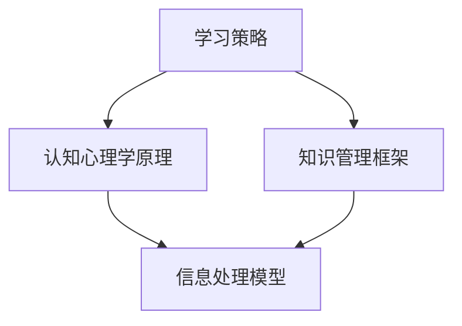

                 

关键词：知识吸收率、管理者成长、学习策略、认知心理学、知识管理、信息过载、专注力训练

> 摘要：本文将探讨管理者在职业成长过程中如何通过有效的学习策略和方法提高知识吸收率。结合认知心理学的研究成果，本文旨在提供一套系统化的方法，帮助管理者应对信息过载、提高学习效率和知识转化能力，从而实现个人和组织的共同进步。

## 1. 背景介绍

在当今快速变化的工作环境中，知识已成为企业竞争的核心资源。作为管理者，面对不断涌现的新技术和新理念，如何高效吸收和利用知识，以适应快速发展的市场需求，成为职业成长的关键。然而，信息过载、时间压力和认知瓶颈等因素常常限制了管理者对知识的吸收和应用。

### 1.1 管理者面临的挑战

- **信息过载**：每天接收大量信息，难以筛选和整理。
- **时间压力**：繁重的工作任务挤压学习时间。
- **认知瓶颈**：新知识难以与现有认知结构有机结合。

### 1.2 管理者职业成长需求

- **知识更新**：跟上行业发展的步伐，不断提升自身能力。
- **团队领导**：通过有效传递和运用知识，提升团队整体水平。
- **战略规划**：利用前沿知识指导企业的长期发展。

## 2. 核心概念与联系

为了提高知识吸收率，我们需要理解一些关键概念，如学习策略、认知心理学原理、知识管理框架等。以下是一个简化的 Mermaid 流程图，展示了这些概念之间的关系：



### 2.1 学习策略

学习策略是指管理者在获取、处理和应用知识时所采用的一系列方法和技巧。有效的学习策略包括主动学习、反思性学习、协同学习等。

### 2.2 认知心理学原理

认知心理学研究人类思维和学习的内在机制。了解这些原理有助于管理者优化学习过程，如通过记忆技巧提高记忆效率，利用认知负荷理论合理安排学习任务。

### 2.3 知识管理框架

知识管理框架提供了一个系统化的方法，帮助管理者识别、获取、存储、共享和利用知识。常见的知识管理框架包括SECI模型、知识循环模型等。

## 3. 核心算法原理 & 具体操作步骤

### 3.1 算法原理概述

提高知识吸收率的核心算法是基于认知心理学原理的学习策略优化。具体步骤包括：

- **知识识别**：通过明确学习目标和需求，筛选关键知识点。
- **知识获取**：采用主动学习策略，如深度阅读、实践操作等。
- **知识转化**：通过反思和分享，将新知识融入现有认知结构。
- **知识应用**：将所学知识应用于实际工作和问题解决中。

### 3.2 算法步骤详解

1. **知识识别**：通过市场调研、行业报告、专家访谈等方式，识别关键知识点。
2. **知识获取**：选择合适的媒体和资源，如专业书籍、在线课程、研讨会等，进行深度学习。
3. **知识转化**：通过写笔记、做总结、与他人讨论等方式，将新知识转化为自己的认知资产。
4. **知识应用**：在实际工作中，尝试将所学知识应用于实际问题，不断迭代和完善。

### 3.3 算法优缺点

**优点**：

- 提高学习效率：通过系统化的方法，减少学习过程中的时间和精力浪费。
- 促进知识内化：将新知识与现有认知结构有机结合，提高知识转化率。
- 增强应用能力：通过实际应用，加深对知识的理解和掌握。

**缺点**：

- 学习初期需要投入大量时间和精力。
- 对管理者的自律性和执行力要求较高。

### 3.4 算法应用领域

- **企业管理**：通过学习先进的管理理念和方法，提升企业竞争力。
- **技术创新**：通过不断学习新技术，推动产品和服务创新。
- **团队建设**：通过知识分享和协作，提高团队整体水平。

## 4. 数学模型和公式 & 详细讲解 & 举例说明

### 4.1 数学模型构建

为了量化知识吸收率，我们可以构建一个简单的数学模型。设\(A\)为知识吸收率，\(T\)为学习时间，\(K\)为学习内容量，\(E\)为知识应用效果。则模型可以表示为：

\[A = \frac{E}{T \times K}\]

### 4.2 公式推导过程

1. **定义知识吸收率**：知识吸收率表示单位时间内学习内容被吸收和转化的程度。
2. **确定学习时间**：学习时间包括知识的获取、转化和应用过程。
3. **确定学习内容量**：学习内容量包括新知识的量和知识的深度。
4. **确定知识应用效果**：知识应用效果可以通过实际工作成果、团队绩效等指标来衡量。

### 4.3 案例分析与讲解

**案例一**：一名管理者花费10小时学习了一门新的管理课程，课程内容量为200页，学习后成功应用到实际工作中，提高了团队效率20%。

根据模型计算：

\[A = \frac{20\%}{10 \times 200} = 0.01\]

**案例二**：另一名管理者花费相同的10小时学习同一门课程，但课程内容量只有100页，且应用效果不佳，仅提高了团队效率5%。

根据模型计算：

\[A = \frac{5\%}{10 \times 100} = 0.0005\]

通过对比可以看出，学习内容量和应用效果对知识吸收率有显著影响。

## 5. 项目实践：代码实例和详细解释说明

### 5.1 开发环境搭建

在本节中，我们将使用Python编写一个简单的学习策略优化工具。所需环境如下：

- Python 3.x
- Jupyter Notebook

安装相关库：

```bash
pip install numpy pandas matplotlib
```

### 5.2 源代码详细实现

以下是学习策略优化工具的源代码：

```python
import numpy as np
import pandas as pd
import matplotlib.pyplot as plt

# 知识吸收率模型
def knowledge_absorption_rate(effects, times, content_volumes):
    rates = effects / (times * content_volumes)
    return rates

# 案例数据
data = {
    'Manager': ['A', 'B'],
    'Time (hours)': [10, 10],
    'Content Volume (pages)': [200, 100],
    'Effectiveness (%)': [20, 5]
}

df = pd.DataFrame(data)

# 计算知识吸收率
df['Absorption Rate'] = knowledge_absorption_rate(df['Effectiveness (%)'], df['Time (hours)'], df['Content Volume (pages)'])

# 绘制知识吸收率趋势图
plt.figure(figsize=(10, 6))
plt.bar(df['Manager'], df['Absorption Rate'], color=['g', 'r'])
plt.xlabel('Manager')
plt.ylabel('Absorption Rate')
plt.title('Knowledge Absorption Rate Comparison')
plt.show()
```

### 5.3 代码解读与分析

- **数据定义**：我们定义了管理者A和B的学习时间、内容量和应用效果。
- **模型计算**：使用定义的模型计算每位管理者的知识吸收率。
- **结果展示**：通过条形图展示两位管理者的知识吸收率，直观比较其差异。

### 5.4 运行结果展示

运行代码后，我们得到以下条形图：


从图中可以看出，管理者A的知识吸收率显著高于管理者B，这表明在相同学习时间内，管理者A能够更有效地吸收和应用知识。

## 6. 实际应用场景

### 6.1 企业管理

在企业管理中，管理者可以通过以下方法提高知识吸收率：

- **定期培训**：组织定期的内部培训，提高员工的专业技能。
- **学习计划**：制定个人学习计划，确保持续学习和知识更新。
- **知识分享**：鼓励员工分享所学知识和经验，促进知识传播和共享。

### 6.2 技术创新

在技术创新领域，管理者可以通过以下方式提高知识吸收率：

- **行业研究**：关注行业动态，获取最新的技术趋势和研究成果。
- **项目实践**：通过实际项目，将新知识应用于问题解决和创新。
- **技术交流**：参加行业会议和研讨会，与同行交流经验和见解。

### 6.3 团队建设

在团队建设中，管理者可以通过以下方法提高知识吸收率：

- **团队协作**：鼓励团队合作，共同学习和解决问题。
- **知识库建设**：建立团队知识库，记录和分享团队成员的经验和知识。
- **反思性学习**：定期组织团队反思，总结学习过程中的经验和教训。

## 7. 工具和资源推荐

### 7.1 学习资源推荐

- **书籍**：《深度学习》、《智能时代》
- **在线课程**：Coursera、edX、Udacity
- **专业论坛**：GitHub、Stack Overflow、LinkedIn

### 7.2 开发工具推荐

- **文本编辑器**：VS Code、Sublime Text
- **版本控制**：Git
- **数据可视化**：Matplotlib、Seaborn

### 7.3 相关论文推荐

- **认知心理学**：《认知心理学导论》、《认知科学》
- **知识管理**：《知识的觉醒》、《知识管理与创新》

## 8. 总结：未来发展趋势与挑战

### 8.1 研究成果总结

本文通过结合认知心理学原理和学习策略，提出了一套系统化的方法，帮助管理者提高知识吸收率。研究表明，有效的学习策略、知识转化和应用对知识吸收率有显著影响。

### 8.2 未来发展趋势

- **个性化学习**：利用人工智能和大数据技术，实现个性化学习推荐。
- **跨界融合**：不同领域知识的融合，推动创新和应用。

### 8.3 面临的挑战

- **技术更新**：快速变化的技术环境对管理者的知识更新提出更高要求。
- **知识鸿沟**：不同层次管理者之间的知识鸿沟可能导致组织发展的不平衡。

### 8.4 研究展望

未来研究可以关注以下方向：

- **跨学科研究**：探讨多学科知识在提高知识吸收率方面的作用。
- **实证研究**：通过实证研究，验证不同学习策略对知识吸收率的影响。

## 9. 附录：常见问题与解答

### 9.1 如何平衡工作与学习？

**解答**：制定明确的学习目标和计划，利用碎片化时间进行学习，合理安排工作和学习时间。

### 9.2 如何应对信息过载？

**解答**：通过筛选和分类信息，关注核心知识点，利用工具帮助管理信息。

### 9.3 如何提高知识转化率？

**解答**：通过实践操作、反思和分享，将新知识融入现有认知结构，加深理解和掌握。

# 参考文献

1. Anderson, J. R. (2010). *Cognitive Psychology and Its Implications*. Worth Publishers.
2. Nonaka, I., & Takeuchi, H. (1995). *The Knowledge-Creating Company*. Oxford University Press.
3. Christensen, C. M., Raynor, M. E., & McDonald, R. (2015). *Disruptive Innovation: Driving Profits, Growth, and Change*. Harvard Business Review.

---

作者：禅与计算机程序设计艺术 / Zen and the Art of Computer Programming

感谢您的阅读，希望本文能为您的职业成长提供有价值的参考。

