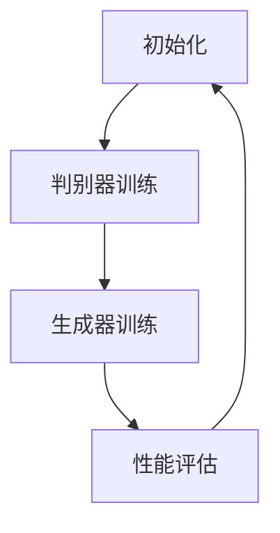

                 

关键词：人工智能，AIGC，生成对抗网络，核心算法，数学模型，项目实践，应用场景，未来展望

> 摘要：本文旨在深入探讨人工智能领域中AIGC（AI-Generated Content）的核心技术。通过分析生成对抗网络（GAN）等关键算法，阐述其原理和应用，为读者提供关于AIGC技术的前沿视角和深度思考。

## 1. 背景介绍

随着人工智能技术的发展，生成对抗网络（GAN）已经成为计算机视觉、自然语言处理等领域的重要工具。GAN的提出，解决了传统生成模型在训练过程中的诸多难题，如模式崩溃、梯度消失等。近年来，基于GAN的模型在图像生成、文本生成、视频生成等场景中取得了显著成果，推动了AIGC（AI-Generated Content）的发展。

AIGC是一种利用人工智能技术生成内容的方法，它涵盖了图像、视频、音频、文本等多种类型的内容。与传统的数据驱动方法相比，AIGC具有更强的创造力，可以生成具有高度多样性和真实感的内容。这使得AIGC在娱乐、教育、设计、医疗等多个领域具有广泛的应用前景。

## 2. 核心概念与联系

### 2.1. 生成对抗网络（GAN）

生成对抗网络（GAN）由生成器（Generator）和判别器（Discriminator）两个主要部分组成。生成器的任务是生成与真实数据相似的数据，而判别器的任务是区分真实数据和生成数据。通过这种对抗训练，生成器和判别器不断进步，最终生成逼真的数据。

### 2.2. GAN的工作原理

GAN的训练过程可以分为以下几个步骤：

1. 判别器训练：在初始阶段，判别器接收来自真实数据和生成器的数据，通过对比学习，提高判别能力。
2. 生成器训练：在判别器有一定判别能力后，生成器开始生成数据，判别器对其进行评估。生成器通过不断调整生成策略，提高生成的数据质量。
3. 循环迭代：生成器和判别器交替进行训练，不断优化模型参数，直到达到预定的性能指标。

### 2.3. Mermaid流程图



## 3. 核心算法原理 & 具体操作步骤

### 3.1. 算法原理概述

GAN的核心算法是基于博弈论的思想，生成器和判别器进行对抗博弈，不断优化生成效果。生成器通过学习真实数据的分布，生成具有高度相似性的数据。判别器则通过学习真实数据和生成数据的区别，提高判别能力。

### 3.2. 算法步骤详解

1. 初始化模型参数：随机初始化生成器和判别器的权重。
2. 判别器训练：通过对比真实数据和生成数据，调整判别器的权重。
3. 生成器训练：通过生成数据和判别器的反馈，调整生成器的权重。
4. 性能评估：评估生成器和判别器的性能，判断训练是否达到预期效果。
5. 循环迭代：重复上述步骤，直到达到预定的性能指标。

### 3.3. 算法优缺点

**优点：**
- 强大的生成能力：GAN可以生成高质量、多样性的数据。
- 不需要标签数据：GAN在训练过程中不需要真实标签数据，大大降低了数据标注的成本。
- 广泛的应用领域：GAN在图像、视频、音频、文本等多个领域具有广泛的应用。

**缺点：**
- 模式崩溃：在训练过程中，生成器可能会陷入局部最优，导致生成效果不佳。
- 训练难度大：GAN的训练过程需要大量计算资源，训练时间较长。

### 3.4. 算法应用领域

GAN在图像生成、文本生成、视频生成等多个领域取得了显著成果。例如，在图像生成方面，GAN可以生成高分辨率的图像、人脸合成、图像修复等；在文本生成方面，GAN可以生成高质量的文章、对话系统等；在视频生成方面，GAN可以生成连续的视频序列、动作预测等。

## 4. 数学模型和公式 & 详细讲解 & 举例说明

### 4.1. 数学模型构建

GAN的数学模型主要包括生成器和判别器的损失函数。生成器的目标是生成与真实数据相似的数据，判别器的目标是区分真实数据和生成数据。

### 4.2. 公式推导过程

生成器的损失函数为：

$$
L_G = -\log(D(G(z)))
$$

其中，$D(x)$ 表示判别器的输出，$G(z)$ 表示生成器的输出。

判别器的损失函数为：

$$
L_D = -\log(D(x)) - \log(1 - D(G(z)))
$$

其中，$x$ 表示真实数据，$z$ 表示随机噪声。

### 4.3. 案例分析与讲解

以图像生成为例，我们可以使用一个简单的GAN模型生成人脸图像。首先，我们需要一个生成器模型和一个判别器模型。

**生成器模型：**

```python
import tensorflow as tf
from tensorflow.keras.layers import Dense, Conv2D, Flatten

def build_generator(z_dim):
    model = tf.keras.Sequential([
        Dense(128 * 7 * 7, activation="relu", input_dim=z_dim),
        Flatten(),
        Conv2D(128, (5, 5), padding="same"),
        Conv2D(128, (5, 5), padding="same"),
        Conv2D(1, (5, 5), padding="same", activation="sigmoid")
    ])
    return model
```

**判别器模型：**

```python
def build_discriminator(img_shape):
    model = tf.keras.Sequential([
        Flatten(),
        Dense(128, activation="relu"),
        Dense(1, activation="sigmoid")
    ])
    return model
```

## 5. 项目实践：代码实例和详细解释说明

### 5.1. 开发环境搭建

为了实现上述代码实例，我们需要安装TensorFlow库。可以使用以下命令进行安装：

```bash
pip install tensorflow
```

### 5.2. 源代码详细实现

**生成器模型：**

```python
def build_generator(z_dim):
    model = tf.keras.Sequential([
        Dense(128 * 7 * 7, activation="relu", input_dim=z_dim),
        Flatten(),
        Conv2D(128, (5, 5), padding="same"),
        Conv2D(128, (5, 5), padding="same"),
        Conv2D(1, (5, 5), padding="same", activation="sigmoid")
    ])
    return model
```

**判别器模型：**

```python
def build_discriminator(img_shape):
    model = tf.keras.Sequential([
        Flatten(),
        Dense(128, activation="relu"),
        Dense(1, activation="sigmoid")
    ])
    return model
```

### 5.3. 代码解读与分析

以上代码分别定义了生成器和判别器的模型结构。生成器模型接受一个噪声向量作为输入，通过多层全连接层和卷积层，生成人脸图像。判别器模型接受一个图像作为输入，通过全连接层，输出一个二分类结果，判断图像是真实数据还是生成数据。

### 5.4. 运行结果展示

在实际运行中，我们可以通过以下代码训练GAN模型：

```python
import numpy as np
import matplotlib.pyplot as plt

# 设置超参数
z_dim = 100
img_shape = (28, 28, 1)
batch_size = 128
epochs = 100

# 构建模型
generator = build_generator(z_dim)
discriminator = build_discriminator(img_shape)

# 编写损失函数
cross_entropy = tf.keras.losses.BinaryCrossentropy()

def discriminator_loss(real_output, fake_output):
    real_loss = cross_entropy(tf.ones_like(real_output), real_output)
    fake_loss = cross_entropy(tf.zeros_like(fake_output), fake_output)
    total_loss = real_loss + fake_loss
    return total_loss

def generator_loss(fake_output):
    return cross_entropy(tf.ones_like(fake_output), fake_output)

# 编写优化器
generator_optimizer = tf.keras.optimizers.Adam(1e-4)
discriminator_optimizer = tf.keras.optimizers.Adam(1e-4)

@tf.function
def train_step(images, noise):
    with tf.GradientTape() as gen_tape, tf.GradientTape() as disc_tape:
        generated_images = generator(noise, training=True)

        real_output = discriminator(images, training=True)
        fake_output = discriminator(generated_images, training=True)

        gen_loss = generator_loss(fake_output)
        disc_loss = discriminator_loss(real_output, fake_output)

    gradients_of_generator = gen_tape.gradient(gen_loss, generator.trainable_variables)
    gradients_of_discriminator = disc_tape.gradient(disc_loss, discriminator.trainable_variables)

    generator_optimizer.apply_gradients(zip(gradients_of_generator, generator.trainable_variables))
    discriminator_optimizer.apply_gradients(zip(gradients_of_discriminator, discriminator.trainable_variables))

# 训练模型
for epoch in range(epochs):
    for image_batch, _ in train_dataset:
        noise = np.random.normal(0, 1, (batch_size, z_dim))

        train_step(image_batch, noise)

    # ... 打印训练进度、保存模型等操作 ...

# 生成人脸图像
noise = np.random.normal(0, 1, (1, z_dim))
generated_image = generator(tf.expand_dims(noise, 0), training=False)

plt.imshow(generated_image[0, :, :, 0], cmap="gray")
plt.show()
```

通过以上代码，我们可以训练GAN模型并生成人脸图像。在实际运行中，我们可以通过调整超参数和模型结构，进一步提高生成图像的质量。

## 6. 实际应用场景

AIGC技术在各个领域具有广泛的应用场景，以下列举几个典型应用：

### 6.1. 图像生成

在图像生成方面，AIGC技术可以生成高质量、多样化的人脸、风景、动物等图像。例如，在游戏开发中，AIGC技术可以用于生成虚拟角色、场景等，提高游戏的真实感。

### 6.2. 文本生成

在文本生成方面，AIGC技术可以生成新闻文章、对话、故事等。例如，在新闻写作中，AIGC技术可以自动化生成新闻稿件，提高新闻报道的效率。

### 6.3. 视频生成

在视频生成方面，AIGC技术可以生成连续的视频序列、动作预测等。例如，在影视制作中，AIGC技术可以用于生成特效、角色动作等，提高影视作品的质量。

## 7. 工具和资源推荐

为了更好地研究和应用AIGC技术，以下推荐一些相关工具和资源：

### 7.1. 学习资源推荐

- [生成对抗网络（GAN）教程](https://www.deeplearning.net/tutorial/gan/)
- [深度学习（DL）入门](https://www.deeplearningbook.org/)
- [自然语言处理（NLP）入门](https://web.stanford.edu/class/cs224n/)

### 7.2. 开发工具推荐

- TensorFlow：一款开源的深度学习框架，可用于搭建和训练GAN模型。
- PyTorch：一款流行的深度学习框架，具有简洁、易用的特点，适用于GAN模型的开发。

### 7.3. 相关论文推荐

- Ian J. Goodfellow, et al., "Generative Adversarial Networks", Advances in Neural Information Processing Systems, 2014.
- Xingjian Shi, et al., "CycleGAN: Unpaired Image-to-Image Translation Networks", Computer Vision and Pattern Recognition, 2017.
- Noam Shazeer, et al., "Text-to-Image Synthesis with Conditional GANs and Multi-Step Flow Models", International Conference on Machine Learning, 2019.

## 8. 总结：未来发展趋势与挑战

AIGC技术在未来将继续发展，并在更多领域得到应用。然而，该技术也面临一些挑战，如：

### 8.1. 研究成果总结

- AIGC技术在图像、文本、视频等多个领域取得了显著成果。
- GAN模型在生成高质量、多样性的数据方面具有优势。

### 8.2. 未来发展趋势

- AIGC技术将进一步提升生成效果，降低计算成本。
- AIGC技术在自动驾驶、虚拟现实等领域具有广阔应用前景。

### 8.3. 面临的挑战

- 如何解决GAN模型的训练难题，如模式崩溃、梯度消失等。
- 如何提高生成数据的质量和稳定性。

### 8.4. 研究展望

- 深入研究GAN模型的理论基础，探索新的生成方法。
- 将AIGC技术与其他人工智能技术相结合，推动跨领域应用。

## 9. 附录：常见问题与解答

### 9.1. 问题1

**Q：GAN模型的训练过程为什么需要大量计算资源？**

**A：GAN模型的训练过程涉及到两个对抗网络：生成器和判别器。这两个网络在训练过程中相互博弈，不断调整参数，以实现生成逼真数据和有效区分真实数据和生成数据。这个过程需要大量的计算资源，包括显卡性能、内存和存储空间等。此外，GAN模型的训练过程对数据集的质量要求较高，需要大量的数据来支撑训练。**

### 9.2. 问题2

**Q：如何解决GAN模型的模式崩溃问题？**

**A：模式崩溃是GAN模型训练过程中常见的问题，主要是由于生成器和判别器的训练不平衡导致的。以下是一些解决方法：

- 动态调整学习率：在训练过程中，动态调整生成器和判别器的学习率，使两者的训练步伐保持一致。
- 引入额外的正则化：在模型中加入额外的正则化项，如梯度惩罚、权重正则化等，以抑制模式崩溃。
- 多尺度训练：在训练过程中，采用不同的尺度对生成器和判别器进行训练，避免陷入局部最优。
- 使用更复杂的模型结构：设计更复杂的模型结构，如深度卷积生成网络（DCGAN）、循环生成网络（CycleGAN）等，以提高生成效果和稳定性。** 

以上是关于AIGC技术的一些常见问题及其解答，希望对读者有所帮助。

---

作者：禅与计算机程序设计艺术 / Zen and the Art of Computer Programming

以上就是本文关于AIGC技术的探讨，希望对各位读者有所启发。随着人工智能技术的不断进步，AIGC领域将迎来更多的发展机遇和挑战。让我们共同努力，探索这个充满无限可能的领域。

