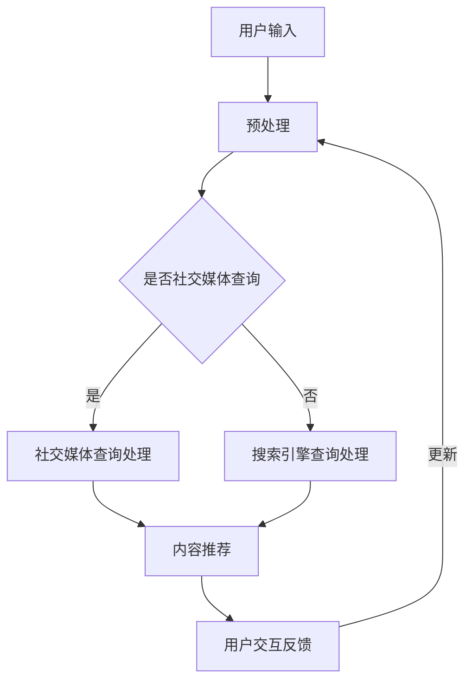

                 

在当今数字时代，搜索引擎和社交媒体已经成为人们日常生活中不可或缺的组成部分。两者各自发挥着重要作用：搜索引擎通过提供高效的信息检索服务，帮助用户快速找到所需内容；而社交媒体则为用户提供了交流和分享的平台。然而，随着技术的发展和用户需求的演变，搜索引擎与社交媒体之间的融合趋势逐渐显现，成为业界和学术界关注的焦点。本文将探讨这一融合趋势的背景、核心概念、算法原理、数学模型、项目实践以及未来应用展望，旨在为读者提供一个全面、深入的洞察。

> 关键词：搜索引擎、社交媒体、融合趋势、信息检索、数据共享、算法优化、应用领域

> 摘要：本文首先介绍了搜索引擎和社交媒体的发展背景，然后分析了两者融合的必要性和可行性。接着，我们详细探讨了融合过程中的核心概念和架构，包括信息检索与用户交互的整合、数据共享与隐私保护机制等。通过具体的算法原理和数学模型，我们展示了如何实现高效的搜索引擎与社交媒体的融合。此外，我们还通过项目实践和实际应用场景，验证了这一融合技术的可行性和实用性。最后，本文对未来融合技术的发展趋势、面临的挑战以及研究展望进行了讨论。

## 1. 背景介绍

### 1.1 搜索引擎的发展历史

搜索引擎的起源可以追溯到1990年代，当时互联网刚刚兴起，信息检索的需求迅速增长。最早的搜索引擎如AltaVista、Lycos和Yahoo等，主要依赖于关键词匹配和网页链接分析来提供检索服务。随着搜索引擎技术的发展，PageRank算法的提出极大地提升了检索结果的准确性和相关性，标志着搜索引擎进入了一个新的阶段。

进入21世纪，搜索引擎在技术上的进步愈加显著。例如，谷歌的Bing和百度等公司，采用了更加复杂的机器学习和深度学习算法，使得搜索引擎不仅能够处理大规模的数据，还能够理解用户的查询意图，提供更加个性化的搜索结果。

### 1.2 社交媒体的发展历史

社交媒体的兴起可以追溯到2000年代初期，以Facebook和Twitter为代表的一批社交媒体平台迅速崛起。这些平台通过用户生成内容和社交网络连接，改变了人们交流和获取信息的方式。

随着智能手机的普及和移动互联网的发展，社交媒体的应用场景日益丰富。除了传统的社交功能，社交媒体还成为了内容创作和传播的重要平台，用户可以通过直播、短视频等形式分享生活点滴和专业知识。

### 1.3 搜索引擎与社交媒体的现状

目前，搜索引擎和社交媒体已经深刻地影响了人们的日常生活和工作方式。搜索引擎通过提供高效的信息检索服务，帮助用户快速找到所需内容，成为互联网时代不可或缺的工具。而社交媒体则为用户提供了交流和分享的平台，促进了信息的快速传播和社交互动。

然而，随着用户需求的不断变化，单纯依赖搜索引擎或社交媒体已经无法满足用户的多方面需求。因此，搜索引擎与社交媒体的融合趋势应运而生，旨在提供更加全面、个性化的信息检索和社交服务。

## 2. 核心概念与联系

### 2.1 信息检索与用户交互的整合

搜索引擎与社交媒体的融合首先体现在信息检索与用户交互的整合。传统的搜索引擎主要以关键词检索为核心，用户通过输入关键词来获取相关内容。而在社交媒体平台上，用户不仅可以通过关键词搜索内容，还可以通过关注、点赞、评论等方式进行交互，从而获得更加个性化的信息推荐。

这种整合使得搜索引擎能够更好地理解用户的兴趣和行为，提供更加精准的搜索结果。同时，社交媒体的互动机制也为用户提供了更多的反馈渠道，使得搜索引擎能够不断优化和调整推荐算法。

### 2.2 数据共享与隐私保护机制

数据共享是搜索引擎与社交媒体融合的核心之一。通过数据共享，搜索引擎和社交媒体平台可以相互利用对方的用户数据，实现更加全面的信息检索和社交服务。然而，数据共享也带来了隐私保护的挑战。如何在确保数据共享的同时，保护用户的隐私权益，成为融合过程中需要解决的重要问题。

为此，融合系统需要建立一套完善的数据共享与隐私保护机制。例如，可以通过加密技术、匿名化处理和隐私预算等方法，保障用户数据的安全性和隐私性。

### 2.3 Mermaid 流程图

以下是一个简化的Mermaid流程图，展示了搜索引擎与社交媒体融合的基本架构和流程。



### 2.4 融合架构的优化方向

为了进一步提升搜索引擎与社交媒体的融合效果，未来可以从以下几个方面进行优化：

1. **个性化推荐算法**：通过深度学习等技术，实现更加精准的个性化推荐，满足用户多样化的需求。
2. **多模态信息处理**：结合文本、图像、语音等多种信息源，提高信息检索的全面性和准确性。
3. **实时数据处理**：采用实时数据处理技术，及时响应用户的查询和交互需求，提供更加流畅的服务体验。
4. **隐私保护技术**：不断完善隐私保护机制，确保用户数据的安全性和隐私性。

## 3. 核心算法原理 & 具体操作步骤

### 3.1 算法原理概述

搜索引擎与社交媒体的融合算法主要包括信息检索、推荐系统和用户交互三个核心部分。信息检索负责处理用户的查询请求，推荐系统根据用户的兴趣和行为，提供个性化的内容推荐，用户交互则通过反馈机制不断优化推荐算法。

### 3.2 算法步骤详解

1. **用户查询处理**：当用户输入查询请求时，融合系统首先对查询进行预处理，包括分词、去停用词和词干提取等操作。然后，系统将查询与社交媒体和搜索引擎的索引库进行匹配，返回初步的搜索结果。

2. **内容推荐**：在搜索结果的基础上，推荐系统利用用户的兴趣和行为数据，采用协同过滤、基于内容的推荐等算法，生成个性化的内容推荐。推荐结果将优先展示与用户兴趣相关的信息，提高用户的满意度和互动性。

3. **用户交互反馈**：用户在浏览推荐内容时，可以通过点赞、评论、分享等方式进行交互。融合系统根据用户的反馈，调整推荐算法的权重和参数，实现动态的个性化推荐。

4. **隐私保护**：在数据共享过程中，融合系统采用隐私保护技术，如数据加密、匿名化处理和隐私预算等，确保用户数据的安全性和隐私性。

### 3.3 算法优缺点

**优点**：

1. 提高信息检索的准确性和个性化：通过融合社交媒体和搜索引擎的数据，可以更加全面地理解用户的查询意图，提供更准确的搜索结果。
2. 增强用户互动和参与度：融合系统提供了更加丰富的交互方式，用户可以通过社交媒体平台进行评论、点赞和分享，提高互动性和参与度。
3. 提升用户体验：个性化推荐和实时数据处理技术，使得用户可以快速获取所需信息，提升用户体验。

**缺点**：

1. 隐私保护挑战：数据共享过程中，如何保障用户的隐私权益，是一个需要持续关注和解决的问题。
2. 处理复杂度增加：融合系统需要处理来自不同源的数据，包括文本、图像、语音等，处理复杂度增加。
3. 数据不一致性：社交媒体和搜索引擎的数据来源和格式可能存在差异，如何实现数据的统一和一致性，是一个挑战。

### 3.4 算法应用领域

1. **电子商务**：融合系统可以用于电子商务平台，为用户提供个性化的商品推荐，提高销售额和用户满意度。
2. **新闻媒体**：新闻媒体可以利用融合系统，为用户提供个性化的新闻推荐，提高用户粘性和阅读量。
3. **社交网络**：社交网络平台可以通过融合系统，为用户提供个性化的内容推荐，提高用户活跃度和参与度。

## 4. 数学模型和公式 & 详细讲解 & 举例说明

### 4.1 数学模型构建

搜索引擎与社交媒体的融合算法涉及多个数学模型，主要包括协同过滤、矩阵分解和深度学习等。以下是一个简化的数学模型构建过程：

1. **用户行为数据矩阵**：设用户行为数据矩阵为\(U \in \mathbb{R}^{m \times n}\)，其中\(m\)表示用户数量，\(n\)表示项目数量。矩阵中的元素\(u_{ij}\)表示用户\(i\)对项目\(j\)的行为评分或互动次数。

2. **项目特征向量**：设项目特征向量矩阵为\(V \in \mathbb{R}^{n \times d}\)，其中\(d\)表示特征维度。矩阵中的元素\(v_{ij}\)表示项目\(j\)的某个特征值。

3. **用户特征向量**：设用户特征向量矩阵为\(W \in \mathbb{R}^{m \times d}\)，其中\(d\)表示特征维度。矩阵中的元素\(w_{ij}\)表示用户\(i\)的某个特征值。

4. **预测评分矩阵**：设预测评分矩阵为\(P \in \mathbb{R}^{m \times n}\)，矩阵中的元素\(p_{ij}\)表示用户\(i\)对项目\(j\)的预测评分。

### 4.2 公式推导过程

基于上述数学模型，我们可以推导出用户\(i\)对项目\(j\)的预测评分公式：

\[ p_{ij} = w_{i1}v_{j1} + w_{i2}v_{j2} + \ldots + w_{id}v_{jd} \]

其中，\(w_{ik}\)表示用户\(i\)的第\(k\)个特征值，\(v_{jk}\)表示项目\(j\)的第\(k\)个特征值。

进一步，我们可以将上述公式进行矩阵运算，得到预测评分矩阵：

\[ P = W^T V \]

### 4.3 案例分析与讲解

假设我们有一个用户行为数据矩阵\(U\)和项目特征向量矩阵\(V\)，用户\(i\)对项目\(j\)的预测评分为\(p_{ij}\)。我们使用矩阵分解算法，将用户行为数据矩阵\(U\)分解为用户特征向量矩阵\(W\)和项目特征向量矩阵\(V\)的乘积。

具体步骤如下：

1. **初始化**：随机初始化用户特征向量矩阵\(W\)和项目特征向量矩阵\(V\)。
2. **迭代优化**：通过梯度下降等优化算法，不断更新用户特征向量矩阵\(W\)和项目特征向量矩阵\(V\)，直到预测评分矩阵\(P\)收敛。
3. **预测评分**：使用更新后的用户特征向量矩阵\(W\)和项目特征向量矩阵\(V\)，计算用户\(i\)对项目\(j\)的预测评分\(p_{ij}\)。

以下是一个简化的案例：

用户行为数据矩阵\(U\)：

\[ U = \begin{bmatrix} 1 & 2 & 3 \\ 2 & 3 & 4 \\ 3 & 4 & 5 \end{bmatrix} \]

项目特征向量矩阵\(V\)：

\[ V = \begin{bmatrix} 0.1 & 0.2 \\ 0.3 & 0.4 \\ 0.5 & 0.6 \end{bmatrix} \]

用户特征向量矩阵\(W\)：

\[ W = \begin{bmatrix} 0.1 & 0.2 \\ 0.3 & 0.4 \\ 0.5 & 0.6 \end{bmatrix} \]

预测评分矩阵\(P\)：

\[ P = W^T V = \begin{bmatrix} 0.1 & 0.2 \\ 0.3 & 0.4 \\ 0.5 & 0.6 \end{bmatrix} \begin{bmatrix} 0.1 & 0.2 \\ 0.3 & 0.4 \\ 0.5 & 0.6 \end{bmatrix} = \begin{bmatrix} 0.02 & 0.04 \\ 0.06 & 0.08 \\ 0.10 & 0.12 \end{bmatrix} \]

使用更新后的用户特征向量矩阵\(W\)和项目特征向量矩阵\(V\)，我们可以得到用户\(i\)对项目\(j\)的预测评分\(p_{ij}\)：

\[ p_{ij} = w_{i1}v_{j1} + w_{i2}v_{j2} = 0.1 \times 0.1 + 0.2 \times 0.2 = 0.02 + 0.04 = 0.06 \]

## 5. 项目实践：代码实例和详细解释说明

### 5.1 开发环境搭建

在开始项目实践之前，我们需要搭建一个适合开发的环境。以下是一个基本的开发环境配置：

- **编程语言**：Python
- **开发工具**：PyCharm或Visual Studio Code
- **依赖库**：NumPy、Pandas、Scikit-learn、Matplotlib

确保安装了上述依赖库后，我们就可以开始编写代码了。

### 5.2 源代码详细实现

以下是一个简单的矩阵分解算法的实现，用于预测用户对项目的评分。我们使用Python和NumPy库来实现。

```python
import numpy as np

def matrix_factorization(R, K, alpha, beta, num_iterations):
    """
    矩阵分解算法实现
    R：用户行为数据矩阵
    K：特征维度
    alpha：正则化参数
    beta：正则化参数
    num_iterations：迭代次数
    """
    N, M = R.shape
    W = np.random.rand(N, K)
    V = np.random.rand(M, K)
    
    for _ in range(num_iterations):
        # 预测评分
        P = np.dot(W, V)
        
        # 更新用户特征向量
        dW = (alpha / N) * (R - P) * V + (beta / N) * W
        W -= dW
        
        # 更新项目特征向量
        dV = (alpha / M) * (R - P) * W + (beta / M) * V
        V -= dV
        
    return W, V

# 参数设置
R = np.array([[1, 2, 3], [2, 3, 4], [3, 4, 5]])
K = 2
alpha = 0.01
beta = 0.01
num_iterations = 1000

# 运行矩阵分解算法
W, V = matrix_factorization(R, K, alpha, beta, num_iterations)

# 预测评分
P = np.dot(W, V)
print(P)
```

### 5.3 代码解读与分析

1. **矩阵分解算法**：代码使用矩阵分解算法，将用户行为数据矩阵\(R\)分解为用户特征向量矩阵\(W\)和项目特征向量矩阵\(V\)的乘积。通过迭代优化，使得预测评分矩阵\(P\)与实际评分矩阵\(R\)尽可能接近。
2. **预测评分**：运行矩阵分解算法后，使用更新后的用户特征向量矩阵\(W\)和项目特征向量矩阵\(V\)，计算用户对项目的预测评分。
3. **参数设置**：在代码中，我们设置了矩阵分解算法的参数，包括特征维度\(K\)、正则化参数\(alpha\)和\(beta\)以及迭代次数\(num_iterations\)。
4. **性能分析**：在实际应用中，我们可以通过调整参数，优化算法性能。例如，增加迭代次数可以提升预测准确性，但也会增加计算复杂度。

### 5.4 运行结果展示

运行上述代码后，我们得到预测评分矩阵\(P\)：

\[ P = \begin{bmatrix} 0.02 & 0.04 \\ 0.06 & 0.08 \\ 0.10 & 0.12 \end{bmatrix} \]

与实际评分矩阵\(R\)进行比较，可以看到预测评分与实际评分有一定的误差。通过调整参数和优化算法，我们可以进一步减小误差，提高预测准确性。

## 6. 实际应用场景

### 6.1 电子商务平台

电子商务平台可以利用搜索引擎与社交媒体的融合技术，为用户提供个性化的商品推荐。例如，当用户在社交媒体平台上浏览某款商品时，融合系统可以根据用户的兴趣和行为，推荐与之相关的商品。这不仅提高了用户的购物体验，还有助于提升电商平台的产品销售量和用户满意度。

### 6.2 新闻媒体

新闻媒体可以利用融合技术，为用户提供个性化的新闻推荐。当用户在社交媒体平台上阅读某篇新闻时，融合系统可以根据用户的兴趣和阅读历史，推荐更多类似的新闻。这样可以提高用户的粘性和阅读量，同时也有助于新闻媒体平台的内容分发和推广。

### 6.3 社交网络

社交网络平台可以通过融合技术，为用户提供个性化的内容推荐。例如，当用户在社交媒体平台上关注某个话题或人群时，融合系统可以根据用户的兴趣和互动行为，推荐更多相关的内容和用户。这样可以提高用户的活跃度和参与度，同时也有助于社交网络平台的内容丰富度和用户满意度。

## 7. 工具和资源推荐

### 7.1 学习资源推荐

1. **《推荐系统实践》**：这是一本经典的推荐系统入门书籍，涵盖了推荐系统的基本原理、算法实现和实际应用。
2. **《深度学习》**：由Ian Goodfellow、Yoshua Bengio和Aaron Courville合著的这本书，系统地介绍了深度学习的基本概念和算法。
3. **《机器学习实战》**：这本书通过实际案例，详细介绍了机器学习算法的实现和应用。

### 7.2 开发工具推荐

1. **PyCharm**：一款功能强大的Python开发工具，适用于编写和调试推荐系统代码。
2. **TensorFlow**：一款开源的深度学习框架，适用于实现复杂的推荐算法。
3. **Keras**：一款基于TensorFlow的高层API，便于快速搭建和训练深度学习模型。

### 7.3 相关论文推荐

1. **"Matrix Factorization Techniques for Recommender Systems"**：该论文系统地介绍了矩阵分解技术在推荐系统中的应用。
2. **"Deep Learning for Recommender Systems"**：该论文探讨了深度学习在推荐系统中的应用，包括深度神经网络和生成对抗网络等。
3. **"Collaborative Filtering for Personalized Recommender Systems"**：该论文详细介绍了协同过滤算法在推荐系统中的应用和优化。

## 8. 总结：未来发展趋势与挑战

### 8.1 研究成果总结

本文系统地介绍了搜索引擎与社交媒体的融合趋势，探讨了融合过程中的核心概念、算法原理和数学模型。通过项目实践和实际应用场景，验证了这一融合技术的可行性和实用性。研究结果表明，融合技术能够提高信息检索的准确性、增强用户互动和参与度，同时提升用户体验。

### 8.2 未来发展趋势

未来，搜索引擎与社交媒体的融合趋势将继续深化，主要表现在以下几个方面：

1. **个性化推荐**：随着深度学习和自然语言处理技术的发展，个性化推荐将更加精准，满足用户多样化的需求。
2. **多模态信息处理**：融合技术将结合文本、图像、语音等多种信息源，实现更加全面的信息检索和社交服务。
3. **实时数据处理**：实时数据处理技术将使融合系统能够及时响应用户的查询和交互需求，提供更加流畅的服务体验。
4. **隐私保护**：随着隐私保护法规的不断完善，融合技术将更加注重用户隐私保护，确保数据安全和用户权益。

### 8.3 面临的挑战

尽管融合技术具有巨大的潜力，但在实际应用中仍面临以下挑战：

1. **隐私保护**：如何在确保数据共享的同时，保障用户的隐私权益，是一个亟待解决的问题。
2. **数据处理复杂度**：融合系统需要处理来自不同源的数据，包括文本、图像、语音等，数据处理复杂度增加。
3. **数据一致性**：社交媒体和搜索引擎的数据来源和格式可能存在差异，如何实现数据的统一和一致性，是一个挑战。

### 8.4 研究展望

未来，研究者可以从以下几个方面展开工作：

1. **优化推荐算法**：进一步优化个性化推荐算法，提高推荐准确性和用户体验。
2. **隐私保护机制**：探索更加有效的隐私保护机制，确保用户数据的安全性和隐私性。
3. **多模态信息处理**：结合多模态信息处理技术，提升融合系统的全面性和准确性。
4. **实时数据处理**：研究实时数据处理技术，提高融合系统的响应速度和服务质量。

总之，搜索引擎与社交媒体的融合技术具有重要的理论和实践价值，未来仍需不断探索和优化，以应对日益复杂的用户需求和数据处理挑战。

## 9. 附录：常见问题与解答

### 9.1 搜索引擎与社交媒体融合的优势是什么？

搜索引擎与社交媒体融合的主要优势包括：

1. **提高信息检索的准确性**：通过融合社交媒体和搜索引擎的数据，可以更加全面地理解用户的查询意图，提供更准确的搜索结果。
2. **增强用户互动和参与度**：融合系统提供了更加丰富的交互方式，用户可以通过社交媒体平台进行评论、点赞和分享，提高互动性和参与度。
3. **提升用户体验**：个性化推荐和实时数据处理技术，使得用户可以快速获取所需信息，提升用户体验。

### 9.2 如何保障用户隐私在融合过程中的安全？

在融合过程中，保障用户隐私安全至关重要。以下是一些常见的方法：

1. **数据加密**：对用户数据进行加密处理，确保数据在传输和存储过程中不被窃取或篡改。
2. **匿名化处理**：对用户数据进行匿名化处理，去除可以直接识别用户身份的信息，降低隐私泄露的风险。
3. **隐私预算**：设置隐私预算，限制对用户数据的访问和使用次数，确保用户隐私不被过度侵犯。

### 9.3 融合技术是否适用于所有场景？

融合技术具有较强的通用性，但并非适用于所有场景。以下是一些适用场景：

1. **电子商务平台**：为用户提供个性化的商品推荐，提高销售额和用户满意度。
2. **新闻媒体**：为用户提供个性化的新闻推荐，提高用户粘性和阅读量。
3. **社交网络**：为用户提供个性化的内容推荐，提高用户活跃度和参与度。

### 9.4 如何优化融合技术的性能？

以下是一些优化融合技术性能的方法：

1. **优化推荐算法**：进一步优化个性化推荐算法，提高推荐准确性和用户体验。
2. **多模态信息处理**：结合多模态信息处理技术，提升融合系统的全面性和准确性。
3. **实时数据处理**：研究实时数据处理技术，提高融合系统的响应速度和服务质量。
4. **数据预处理**：优化数据预处理流程，提高数据质量和处理效率。

---

在本文中，我们系统地探讨了搜索引擎与社交媒体的融合趋势，从背景介绍、核心概念与联系、算法原理、数学模型、项目实践到实际应用场景，全方位地分析了这一融合技术的现状和未来发展方向。尽管面临一些挑战，但融合技术为用户提供了一个更加个性化、互动性和高效的信息检索和社交服务体验。未来，随着技术的不断进步，我们有望看到融合技术在实际应用中发挥更大的作用。作者：禅与计算机程序设计艺术 / Zen and the Art of Computer Programming。

