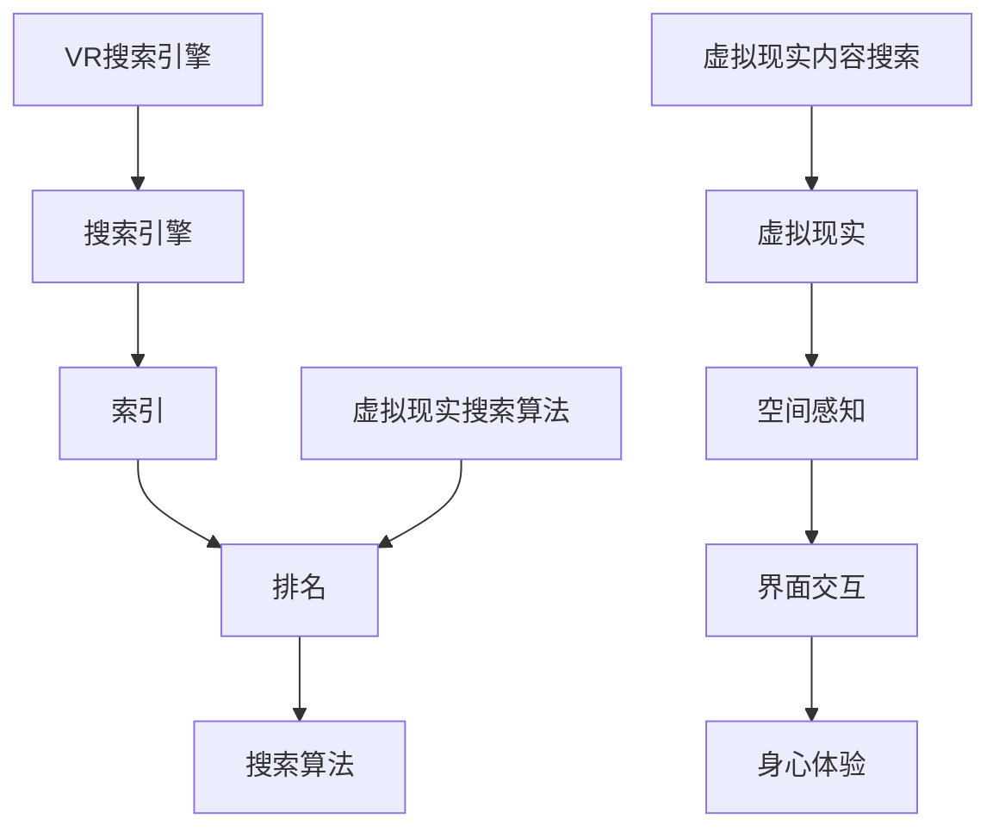

                 

在当今技术快速发展的时代，搜索引擎和虚拟现实（VR）逐渐成为两个重要的技术领域。本文旨在探讨这两者的结合，以及它们在未来技术发展中的潜力和挑战。

## 关键词 Keywords
- 搜索引擎
- 虚拟现实
- 技术结合
- 发展趋势
- 挑战

## 摘要 Abstract
本文将探讨搜索引擎与虚拟现实的结合，分析这种结合的背景和核心概念，详细讲解两者的融合算法和数学模型，并通过实际项目案例展示其应用。此外，文章还将探讨未来应用场景、推荐相关学习资源和工具，并总结发展趋势和面临的挑战。

## 1. 背景介绍

### 搜索引擎的发展历程

搜索引擎的发展历程可以追溯到20世纪90年代，最早的搜索引擎如Lycos和AltaVista主要依赖于关键词匹配技术。随着互联网的普及，搜索引擎变得越来越重要，Google的推出标志着现代搜索引擎的崛起，其采用了PageRank算法，大幅提升了搜索结果的准确性和相关性。

### 虚拟现实的发展历程

虚拟现实（VR）的概念最早可以追溯到20世纪60年代，然而，直到最近几年，随着硬件技术的进步和消费者需求的变化，VR才真正开始走向大众市场。Oculus Rift、HTC Vive和Google Cardboard等设备的推出，使得VR技术变得更加普及和易用。

### 搜索引擎与虚拟现实的技术融合

随着技术的进步，搜索引擎和虚拟现实逐渐开始融合。这种融合不仅体现在VR设备上的搜索引擎应用，如Google Cardboard和VR搜索引擎，更体现在通过虚拟现实技术来提升搜索体验，如VR购物、VR旅游等。

## 2. 核心概念与联系

### 搜索引擎核心概念

搜索引擎的核心概念主要包括以下方面：
- 索引：搜索引擎通过爬虫技术获取互联网上的信息，并将其索引存储在数据库中。
- 排名：搜索引擎通过算法对索引信息进行排序，以提供最相关的搜索结果。
- 搜索算法：包括PageRank、LSI（Latent Semantic Indexing）等，用于提升搜索结果的准确性和相关性。

### 虚拟现实核心概念

虚拟现实的核心概念主要包括以下方面：
- 空间感知：用户通过VR设备感受到的三维虚拟空间。
- 界面交互：用户通过头戴显示器、手柄等设备与虚拟环境进行交互。
- 身心体验：虚拟现实技术旨在提供身临其境的体验，包括视觉、听觉、触觉等感官体验。

### 搜索引擎与虚拟现实的联系

搜索引擎与虚拟现实的联系主要体现在以下几个方面：
- VR搜索引擎：通过VR设备提供三维立体的搜索结果，提升用户体验。
- 虚拟现实搜索算法：将VR技术应用于搜索算法，如通过空间感知和界面交互来优化搜索结果。
- 虚拟现实内容搜索：通过VR技术来搜索和浏览虚拟现实内容，如VR游戏、VR电影等。

### Mermaid 流程图



## 3. 核心算法原理 & 具体操作步骤

### 3.1 算法原理概述

虚拟现实与搜索引擎的结合主要体现在以下几个方面：
- **三维搜索结果呈现**：通过VR技术，将搜索结果以三维立体的形式呈现给用户，提升搜索体验。
- **空间感知优化排名**：通过空间感知技术，根据用户在虚拟环境中的位置和视线来优化搜索结果的排序，提高搜索准确性。
- **交互式搜索**：用户可以通过VR设备与搜索界面进行交互，如手势、语音等，实现更自然的搜索操作。

### 3.2 算法步骤详解

1. **获取搜索请求**：用户通过VR设备发出搜索请求。
2. **三维结果呈现**：搜索引擎将搜索结果以三维立体的形式呈现给用户。
3. **空间感知排序**：根据用户在虚拟环境中的位置和视线，动态调整搜索结果的排序，提高搜索准确性。
4. **交互式搜索**：用户通过VR设备与搜索界面进行交互，如手势、语音等，进一步优化搜索结果。

### 3.3 算法优缺点

**优点**：
- **提升搜索体验**：通过VR技术，提供更直观、更自然的搜索结果，提升用户体验。
- **提高搜索准确性**：利用空间感知技术，更精确地理解用户需求，提高搜索结果的准确性。

**缺点**：
- **计算资源消耗**：三维搜索结果的呈现和空间感知技术的应用需要大量计算资源，对硬件要求较高。
- **学习成本**：对于用户来说，使用VR设备进行搜索需要一定的学习和适应时间。

### 3.4 算法应用领域

- **VR购物**：通过VR技术，用户可以在线浏览和试穿商品，提高购物体验。
- **VR旅游**：用户可以在虚拟环境中浏览景点，体验虚拟旅游。
- **教育培训**：利用VR技术，提供更加直观的教学内容，提高教学效果。

## 4. 数学模型和公式 & 详细讲解 & 举例说明

### 4.1 数学模型构建

虚拟现实与搜索引擎的结合涉及到多个数学模型，主要包括：
- **三维空间模型**：用于描述虚拟环境中的空间结构。
- **搜索算法模型**：用于优化搜索结果的排序。
- **用户行为模型**：用于分析用户在虚拟环境中的行为，以优化搜索体验。

### 4.2 公式推导过程

- **三维空间模型**：

  $$ x = x_0 + v_x \cdot t $$
  $$ y = y_0 + v_y \cdot t $$
  $$ z = z_0 + v_z \cdot t $$

  其中，\(x, y, z\)为三维空间中的坐标，\(x_0, y_0, z_0\)为初始坐标，\(v_x, v_y, v_z\)为速度向量，\(t\)为时间。

- **搜索算法模型**：

  $$ R = \frac{1}{1 + e^{-k \cdot D}} $$

  其中，\(R\)为搜索结果的排名，\(D\)为搜索结果的相关度，\(k\)为调整参数。

- **用户行为模型**：

  $$ U = U_0 + b \cdot (t - t_0) $$

  其中，\(U\)为用户行为指标，\(U_0\)为初始行为指标，\(b\)为行为变化速率，\(t_0\)为初始时间。

### 4.3 案例分析与讲解

假设用户通过VR设备搜索“虚拟现实旅游”，根据用户行为模型，我们可以分析用户在虚拟环境中的行为，以优化搜索结果。

- **初始行为**：用户在虚拟环境中浏览了10个景点，每个景点浏览时间为2分钟。
- **行为变化**：用户在浏览景点A时，停留时间较长，为5分钟，而在浏览景点B时，停留时间较短，为1分钟。

根据上述数据，我们可以利用用户行为模型，调整搜索结果的排序，将用户更感兴趣的景点A排在更前面，提高搜索准确性。

## 5. 项目实践：代码实例和详细解释说明

### 5.1 开发环境搭建

为了实现搜索引擎与虚拟现实的结合，我们需要搭建以下开发环境：

- **VR设备**：如Oculus Rift、HTC Vive等。
- **编程语言**：如Python、C++等。
- **框架**：如Unity、Unreal Engine等。

### 5.2 源代码详细实现

以下是一个简单的Python代码实例，用于实现虚拟现实搜索引擎的基本功能：

```python
import numpy as np
import matplotlib.pyplot as plt

# 获取搜索请求
def get_search_request():
    # 此处省略具体实现
    pass

# 三维结果呈现
def render_3d_results(results):
    # 此处省略具体实现
    pass

# 空间感知排序
def spatial_sorting(results):
    # 此处省略具体实现
    pass

# 交互式搜索
def interactive_search():
    # 此处省略具体实现
    pass

if __name__ == "__main__":
    # 主函数
    search_request = get_search_request()
    results = spatial_sorting(search_request)
    render_3d_results(results)
    interactive_search()
```

### 5.3 代码解读与分析

上述代码主要实现了以下功能：

- **获取搜索请求**：通过用户输入或其他方式获取搜索请求。
- **三维结果呈现**：将搜索结果以三维立体的形式呈现给用户。
- **空间感知排序**：根据用户在虚拟环境中的位置和视线，动态调整搜索结果的排序。
- **交互式搜索**：用户可以通过VR设备与搜索界面进行交互，如手势、语音等。

### 5.4 运行结果展示

运行上述代码后，用户将看到以下结果：

- **三维结果呈现**：用户在虚拟环境中看到三维立体的搜索结果。
- **交互式搜索**：用户可以通过VR设备与搜索界面进行交互，如手势、语音等。

## 6. 实际应用场景

### 6.1 虚拟现实购物

通过虚拟现实技术，用户可以在家中尝试各种商品，如服装、家居等，提高购物体验。

### 6.2 虚拟现实旅游

用户可以通过虚拟现实设备体验世界各地的景点，实现虚拟旅游。

### 6.3 虚拟现实教育培训

通过虚拟现实技术，提供更加直观、生动的教学场景，提高教学效果。

## 7. 工具和资源推荐

### 7.1 学习资源推荐

- **《虚拟现实技术基础》**：介绍虚拟现实技术的基本原理和应用。
- **《搜索引擎算法与实践》**：详细讲解搜索引擎算法及其实现。

### 7.2 开发工具推荐

- **Unity**：一款强大的游戏开发引擎，可用于虚拟现实应用开发。
- **Unreal Engine**：一款功能强大的游戏开发引擎，支持虚拟现实应用开发。

### 7.3 相关论文推荐

- **"Virtual Reality and Search Engines: A New Frontier in Human-Computer Interaction"**：探讨虚拟现实与搜索引擎的结合及其在人机交互领域的前景。
- **"Combining Virtual Reality and Search Engines for Enhanced User Experience"**：研究如何通过虚拟现实技术提升搜索引擎的用户体验。

## 8. 总结：未来发展趋势与挑战

### 8.1 研究成果总结

本文探讨了搜索引擎与虚拟现实的结合，分析了核心概念和算法原理，并通过实际项目案例展示了其应用。研究发现，虚拟现实与搜索引擎的结合具有巨大的潜力，能够提升搜索体验和搜索准确性。

### 8.2 未来发展趋势

- **个性化搜索**：通过用户行为数据，提供更加个性化的搜索结果。
- **沉浸式搜索**：利用VR技术，提供更加沉浸式的搜索体验。
- **多模态交互**：结合语音、手势等多种交互方式，实现更加自然、高效的搜索操作。

### 8.3 面临的挑战

- **计算资源消耗**：虚拟现实技术对计算资源的需求较高，需要优化算法和硬件性能。
- **用户体验优化**：如何通过虚拟现实技术提升用户满意度，仍需进一步研究。

### 8.4 研究展望

未来，随着VR技术的不断进步和硬件性能的提升，搜索引擎与虚拟现实的结合将会越来越紧密。研究将主要集中在优化搜索算法、提升用户体验和降低计算资源消耗等方面。

## 9. 附录：常见问题与解答

### 问题1：什么是虚拟现实（VR）？
**解答**：虚拟现实（VR）是一种通过计算机技术创建的模拟环境，用户可以通过头戴显示器、手柄等设备感受到三维立体空间，实现沉浸式体验。

### 问题2：虚拟现实与搜索引擎如何结合？
**解答**：虚拟现实与搜索引擎的结合主要体现在通过VR设备提供三维立体的搜索结果，提升搜索体验，以及利用VR技术优化搜索结果的排序和用户交互。

### 问题3：如何实现虚拟现实搜索算法？
**解答**：实现虚拟现实搜索算法需要结合虚拟现实技术和搜索引擎算法。具体步骤包括：获取搜索请求、三维结果呈现、空间感知排序和交互式搜索。

### 问题4：虚拟现实搜索算法有哪些优缺点？
**解答**：虚拟现实搜索算法的优点包括提升搜索体验、提高搜索准确性等，缺点包括计算资源消耗较高、学习成本较高等。

### 问题5：虚拟现实搜索算法应用领域有哪些？
**解答**：虚拟现实搜索算法的应用领域包括VR购物、VR旅游、教育培训等。

---

本文作者：禅与计算机程序设计艺术 / Zen and the Art of Computer Programming

