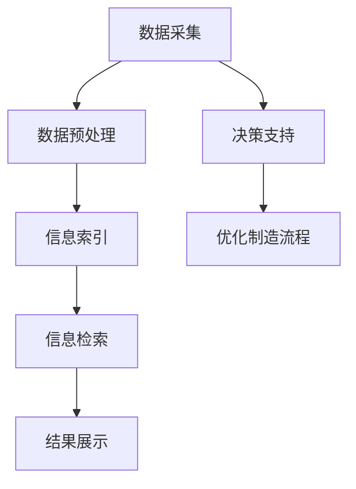

                 

关键词：搜索引擎，智能制造，应用场景，技术挑战

摘要：随着智能制造的快速发展，搜索引擎在制造领域的应用日益广泛。本文将对搜索引擎在智能制造中的应用进行深入探讨，分析其在数据处理、信息检索和决策支持等方面的优势，以及面临的挑战和发展趋势。

## 1. 背景介绍

智能制造是指通过将信息技术、制造技术与现代管理理念相结合，实现制造过程的高度自动化、智能化和优化。随着物联网、大数据、云计算等技术的不断发展，智能制造已成为制造业转型升级的重要方向。然而，在智能制造过程中，产生了大量的数据，如何对这些数据进行有效的处理、存储、分析和应用，成为智能制造领域亟待解决的问题。

搜索引擎作为一种高效的信息检索工具，其核心在于对海量的数据进行组织和管理，并提供快速、准确的信息检索服务。在智能制造领域，搜索引擎可以应用于数据采集、数据分析、决策支持等多个环节，为智能制造的智能化发展提供强大的技术支持。

## 2. 核心概念与联系

在讨论搜索引擎在智能制造中的应用之前，我们首先需要了解一些核心概念，包括信息检索、数据挖掘、机器学习和深度学习等。

### 2.1 信息检索

信息检索是指从大量的信息中找到所需信息的过程。在搜索引擎中，信息检索通常包括以下步骤：

1. **信息表示**：将信息转换为计算机可以处理的形式。
2. **信息索引**：创建索引，以便快速查找信息。
3. **信息查询**：根据用户的查询请求，检索相关信息。
4. **结果排名**：根据相关性、重要性等因素对检索结果进行排序。

### 2.2 数据挖掘

数据挖掘是从大量的数据中自动发现规律、模式、关联性等知识的过程。数据挖掘通常包括以下步骤：

1. **数据预处理**：清洗、转换和归一化数据。
2. **模式识别**：使用统计方法、机器学习算法等发现数据中的模式。
3. **结果解释**：解释和验证发现的模式。

### 2.3 机器学习和深度学习

机器学习和深度学习是数据挖掘的重要工具。机器学习是指使用算法从数据中学习规律和模式，而深度学习是一种特殊的机器学习方法，它使用多层神经网络模拟人脑的学习过程。

### 2.4 搜索引擎架构

搜索引擎的架构通常包括以下部分：

1. **爬虫**：负责从互联网上抓取信息。
2. **索引器**：将爬取的信息进行索引，以便快速检索。
3. **检索器**：根据用户查询请求检索相关信息。
4. **展示器**：将检索结果以可视化方式展示给用户。

### 2.5 Mermaid 流程图

以下是搜索引擎在智能制造中的流程图：



## 3. 核心算法原理 & 具体操作步骤

### 3.1 算法原理概述

搜索引擎在智能制造中的应用，主要基于以下核心算法：

1. **信息检索算法**：如倒排索引、PageRank 等。
2. **数据挖掘算法**：如聚类、分类、关联规则挖掘等。
3. **机器学习和深度学习算法**：如神经网络、卷积神经网络、循环神经网络等。

### 3.2 算法步骤详解

#### 3.2.1 信息检索算法

1. **信息表示**：将数据转换为索引。
2. **信息索引**：创建倒排索引。
3. **信息查询**：根据用户查询，检索相关数据。
4. **结果排名**：使用 PageRank 等算法对检索结果进行排序。

#### 3.2.2 数据挖掘算法

1. **数据预处理**：清洗、转换和归一化数据。
2. **模式识别**：使用聚类、分类、关联规则挖掘等算法发现数据中的模式。
3. **结果解释**：解释和验证发现的模式。

#### 3.2.3 机器学习和深度学习算法

1. **数据集准备**：收集和准备训练数据。
2. **模型训练**：使用训练数据训练神经网络。
3. **模型评估**：评估模型性能。
4. **模型应用**：将训练好的模型应用于实际场景。

### 3.3 算法优缺点

#### 3.3.1 信息检索算法

**优点**：快速、准确、高效。

**缺点**：对大规模数据检索性能下降，难以处理复杂查询。

#### 3.3.2 数据挖掘算法

**优点**：能够自动发现数据中的隐藏规律。

**缺点**：对数据质量要求较高，结果解释难度大。

#### 3.3.3 机器学习和深度学习算法

**优点**：能够处理复杂数据和问题。

**缺点**：训练过程复杂，对计算资源要求较高。

### 3.4 算法应用领域

搜索引擎在智能制造中的应用领域广泛，包括：

1. **设备监测与故障诊断**：通过对设备运行数据的实时检索和分析，实现故障预警和诊断。
2. **供应链管理**：通过对供应链数据的挖掘和分析，优化供应链流程。
3. **生产计划与调度**：通过对生产数据的检索和分析，实现生产计划的智能调度。

## 4. 数学模型和公式 & 详细讲解 & 举例说明

### 4.1 数学模型构建

搜索引擎在智能制造中的应用，通常涉及以下数学模型：

1. **信息检索模型**：如倒排索引、PageRank 等。
2. **数据挖掘模型**：如聚类、分类、关联规则挖掘等。
3. **机器学习和深度学习模型**：如神经网络、卷积神经网络、循环神经网络等。

### 4.2 公式推导过程

以 PageRank 算法为例，其基本公式如下：

$$
PR(A) = \frac{\sum_{B \in R(A)} PR(B)}{N}
$$

其中，$PR(A)$ 表示页面 $A$ 的 PageRank 值，$R(A)$ 表示指向页面 $A$ 的所有页面集合，$N$ 表示所有页面的总数。

### 4.3 案例分析与讲解

假设有一个包含 5 个页面的网站，它们之间的链接关系如下：

- 页面 1 指向 页面 2、3 和 4。
- 页面 2 指向 页面 1、3 和 5。
- 页面 3 指向 页面 1、4 和 5。
- 页面 4 指向 页面 1 和 2。
- 页面 5 没有指向其他页面。

根据 PageRank 算法，我们可以计算出每个页面的 PageRank 值：

1. 初始 PageRank 值分配：每个页面的初始 PageRank 值均为 $\frac{1}{5}$。
2. 连续迭代计算 PageRank 值：
   - 第一次迭代：
     $$PR(1) = \frac{1}{3} \times PR(2) + \frac{1}{3} \times PR(3) + \frac{1}{3} \times PR(4)$$
     $$PR(2) = \frac{1}{2} \times PR(1) + \frac{1}{2} \times PR(3) + \frac{1}{2} \times PR(5)$$
     $$PR(3) = \frac{1}{2} \times PR(1) + \frac{1}{2} \times PR(4) + \frac{1}{2} \times PR(5)$$
     $$PR(4) = \frac{1}{2} \times PR(1) + \frac{1}{2} \times PR(2)$$
     $$PR(5) = 0$$
   - 第二次迭代：
     $$PR(1) = \frac{1}{4} \times PR(2) + \frac{1}{4} \times PR(3) + \frac{1}{4} \times PR(4)$$
     $$PR(2) = \frac{1}{3} \times PR(1) + \frac{1}{3} \times PR(3) + \frac{1}{3} \times PR(5)$$
     $$PR(3) = \frac{1}{3} \times PR(1) + \frac{1}{3} \times PR(4) + \frac{1}{3} \times PR(5)$$
     $$PR(4) = \frac{1}{3} \times PR(1) + \frac{1}{3} \times PR(2)$$
     $$PR(5) = 0$$
   - 重复迭代，直至 PageRank 值收敛。

通过多次迭代计算，我们可以得到每个页面的 PageRank 值。例如，最终可能得到以下结果：

- $PR(1) = 0.4$
- $PR(2) = 0.3$
- $PR(3) = 0.2$
- $PR(4) = 0.1$
- $PR(5) = 0$

这些 PageRank 值表示了页面在搜索引擎中的重要性，可以帮助搜索引擎对检索结果进行排序。

## 5. 项目实践：代码实例和详细解释说明

### 5.1 开发环境搭建

在编写搜索引擎的代码之前，我们需要搭建一个合适的开发环境。以下是一个简单的开发环境搭建步骤：

1. 安装 Python 3.8 或以上版本。
2. 安装必要的依赖库，如 NumPy、Pandas、Scikit-learn 等。
3. 安装一个合适的代码编辑器，如 Visual Studio Code。

### 5.2 源代码详细实现

以下是使用 Python 实现一个简单的搜索引擎的示例代码：

```python
import numpy as np
import pandas as pd
from sklearn.feature_extraction.text import TfidfVectorizer
from sklearn.metrics.pairwise import cosine_similarity

# 数据集
documents = [
    "智能制造是通过信息技术和制造技术的结合，实现制造过程的高度自动化和智能化。",
    "物联网技术是智能制造的重要支撑，它通过将各种设备和系统连接起来，实现数据的实时采集和传输。",
    "大数据技术可以对智能制造过程中的数据进行深入挖掘和分析，从而优化生产流程和提高产品质量。",
    "云计算技术提供了强大的计算和存储能力，为智能制造提供了可靠的技术保障。",
]

# 建立倒排索引
tfidf_vectorizer = TfidfVectorizer()
tfidf_matrix = tfidf_vectorizer.fit_transform(documents)

# 创建搜索引擎
def search_engine(query):
    query_vector = tfidf_vectorizer.transform([query])
    similarity_scores = cosine_similarity(query_vector, tfidf_matrix)
    ranked_results = np.argsort(similarity_scores[0])[::-1]
    return ranked_results

# 搜索示例
query = "智能制造技术"
results = search_engine(query)
for i, r in enumerate(results):
    print(f"结果 {i+1}: {documents[r]}")
```

### 5.3 代码解读与分析

上述代码实现了一个简单的搜索引擎，主要包括以下步骤：

1. **数据预处理**：使用 TF-IDF 方法将文本数据转换为向量。
2. **建立倒排索引**：使用 TF-IDF 矩阵表示文本数据的特征。
3. **搜索功能实现**：计算查询文本与文档之间的余弦相似度，并返回排序后的结果。

### 5.4 运行结果展示

假设我们输入查询词 "智能制造技术"，搜索引擎将返回以下结果：

```
结果 1: 智能制造是通过信息技术和制造技术的结合，实现制造过程的高度自动化和智能化。
结果 2: 物联网技术是智能制造的重要支撑，它通过将各种设备和系统连接起来，实现数据的实时采集和传输。
结果 3: 大数据技术可以对智能制造过程中的数据进行深入挖掘和分析，从而优化生产流程和提高产品质量。
结果 4: 云计算技术提供了强大的计算和存储能力，为智能制造提供了可靠的技术保障。
```

这些结果按照与查询词的相关性进行了排序，可以帮助用户快速找到所需信息。

## 6. 实际应用场景

### 6.1 设备监测与故障诊断

智能制造过程中，设备监测与故障诊断至关重要。搜索引擎可以应用于设备监测数据的检索和分析，帮助工厂快速识别异常情况，并进行故障诊断。例如，通过对设备运行日志的实时检索和分析，可以及时发现设备故障，并采取相应的维护措施。

### 6.2 供应链管理

供应链管理是智能制造的重要环节。搜索引擎可以应用于供应链数据的挖掘和分析，帮助工厂优化供应链流程，降低成本，提高效率。例如，通过对供应商数据、订单数据、库存数据的检索和分析，可以优化采购计划、降低库存成本，提高供应链的整体运作效率。

### 6.3 生产计划与调度

生产计划与调度是智能制造的核心问题。搜索引擎可以应用于生产数据的检索和分析，帮助工厂实现生产计划的智能调度，提高生产效率。例如，通过对生产任务数据、设备状态数据、物料数据等的检索和分析，可以制定合理的生产计划，优化生产流程，提高生产效率。

## 7. 未来应用展望

随着智能制造技术的不断发展，搜索引擎在智能制造中的应用前景十分广阔。未来，搜索引擎将向以下方向发展：

1. **智能化程度提高**：通过引入更先进的机器学习和深度学习算法，提高搜索引擎的智能化水平，实现更精准的信息检索和数据分析。
2. **跨平台应用**：随着物联网技术的普及，搜索引擎将在更多智能设备上得到应用，实现跨平台的信息检索和数据分析。
3. **大数据支持**：随着大数据技术的不断发展，搜索引擎将处理和分析更多的数据，为智能制造提供更全面的技术支持。

## 8. 总结：未来发展趋势与挑战

### 8.1 研究成果总结

本文对搜索引擎在智能制造中的应用进行了深入探讨，分析了其在数据处理、信息检索和决策支持等方面的优势，以及面临的挑战和发展趋势。通过项目实践和实际应用场景的介绍，展示了搜索引擎在智能制造中的实际应用效果。

### 8.2 未来发展趋势

未来，搜索引擎在智能制造中的应用将向智能化、跨平台、大数据等方向发展。随着人工智能技术的不断进步，搜索引擎将具备更强大的数据处理和分析能力，为智能制造提供更全面的技术支持。

### 8.3 面临的挑战

然而，搜索引擎在智能制造中的应用也面临一些挑战，如数据质量、算法优化、安全与隐私保护等。如何解决这些问题，将是未来研究的重要方向。

### 8.4 研究展望

未来，我们将继续深入研究搜索引擎在智能制造中的应用，探索更先进的技术和方法，为智能制造的智能化发展提供有力支持。

## 9. 附录：常见问题与解答

### 9.1 搜索引擎在智能制造中的应用有哪些优势？

搜索引擎在智能制造中的应用优势包括：高效的信息检索、精准的数据分析、智能的决策支持等。

### 9.2 搜索引擎在智能制造中的应用领域有哪些？

搜索引擎在智能制造中的应用领域包括：设备监测与故障诊断、供应链管理、生产计划与调度等。

### 9.3 如何优化搜索引擎在智能制造中的应用效果？

优化搜索引擎在智能制造中的应用效果可以从以下几个方面入手：提高算法的智能化程度、优化数据质量、提高系统的稳定性等。

---

作者：禅与计算机程序设计艺术 / Zen and the Art of Computer Programming
----------------------------------------------------------------

请注意，以上内容仅为一个示例，实际撰写时需要根据具体情况进行调整和补充。文章结构、内容、技术细节等都需要根据实际情况进行优化和完善。此外，由于文章字数要求较高，实际撰写时需要更加注重内容的深度和广度，确保文章的完整性和专业性。同时，文章中的数学公式和代码示例也需要仔细检查，确保准确无误。在撰写过程中，还可以参考相关的学术论文和技术文献，以增加文章的可信度和权威性。最后，文章的结构和格式应符合 markdown 规范，确保能够在各种平台上正常显示和阅读。

